## Differential Diagnosis of Acute Appendicitis

The differential diagnosis of RLQ pain is one of the broadest in surgery. The key challenge is that the RLQ is a "crowded neighbourhood" — the terminal ileum, caecum, appendix, right ureter, right ovary/tube, psoas muscle, and various vascular structures all live here. A systematic organ-based approach is essential.

<Callout title="Core Principle">
When working through the DDx, always ask three questions: (1) **What organs live in the RLQ?** (2) **What is the patient's age and sex?** (3) **Are there any atypical features that point away from appendicitis?** — e.g., prominent diarrhoea (think ileitis/GE), vaginal discharge (think PID), haematuria (think ureteric colic), missed period (think ectopic pregnancy).
</Callout>

### Overview: Causes of RLQ Pain

From the lecture slides, the following is the comprehensive list of causes of ***RLQ pain*** [2]:

> ***Acute appendicitis, Caecal diverticulitis, Ureteric colic*, Ruptured ectopic pregnancy*, Mesenteric adenitis, Torsion of ovarian cyst*, Ileitis, Meckel's diverticulitis, Caecal ischaemia, Cancer of caecum, Inguinal/femoral hernia*, Testicular pathology*, Perforated peptic ulcer, Acute cholecystitis*** [2]
>
> *(asterisked conditions can cause pain on either side)*

```mermaid
graph TD
    A["RLQ Pain — Differential Diagnosis"] --> B["Gastrointestinal"]
    A --> C["Gynaecological"]
    A --> D["Urological"]
    A --> E["Vascular"]
    A --> F["Other"]

    B --> B1["Acute appendicitis"]
    B --> B2["Caecal diverticulitis"]
    B --> B3["Mesenteric adenitis"]
    B --> B4["Meckel's diverticulitis"]
    B --> B5["Ileitis<br/>(Crohn's, TB, Yersinia,<br/>Campylobacter, Salmonella)"]
    B --> B6["Caecal ischaemia"]
    B --> B7["Cancer of caecum"]
    B --> B8["Perforated peptic ulcer<br/>(Valentino's sign)"]
    B --> B9["Intussusception<br/>(paediatric)"]

    C --> C1["Ruptured ectopic pregnancy"]
    C --> C2["Ovarian cyst torsion / rupture"]
    C --> C3["PID / Tubo-ovarian abscess"]
    C --> C4["Mittelschmerz<br/>(ovulation pain)"]
    C --> C5["Endometriosis"]

    D --> D1["Ureteric colic"]
    D --> D2["UTI / Pyelonephritis"]
    D --> D3["Testicular torsion"]

    E --> E1["Caecal ischaemia"]

    F --> F1["Strangulated inguinal /<br/>femoral hernia"]
    F --> F2["HSP<br/>(paediatric)"]
    F --> F3["Acute cholecystitis<br/>(referred pain)"]
    F --> F4["Psoas abscess"]
```

---

### A. Gastrointestinal Causes

#### 1. Caecal / Right-Sided Diverticulitis

- ***Right colon diverticulosis is common in Asians*** [5]. This is a **critical Hong Kong-specific point** — while diverticular disease in Western populations predominantly affects the **left/sigmoid colon**, in Asia (including Hong Kong, Japan, Korea), **right-sided (caecal) diverticulitis is more common** [4][5].
- ***Caecal diverticulitis mimics appendicitis*** [5] — both present with RLQ pain, fever, leucocytosis, and localised peritonism. The two can be virtually indistinguishable clinically.
- **Why does it mimic appendicitis?** The caecum and appendix are anatomically adjacent. Inflammation of a caecal diverticulum irritates the same parietal peritoneum in the RIF.
- **How to differentiate**: ***CT abdomen with contrast is the diagnostic test of choice in patients with suspected acute diverticulitis*** [4]. CT shows pericolic fat stranding centred on the caecal wall (rather than an inflamed appendix), diverticula, and colonic wall thickening.
- ***The role of CT scan*** in distinguishing caecal diverticulitis from appendicitis is emphasised in the lecture [5].
- Features more suggestive of diverticulitis over appendicitis on CT include: pericolonic/mesenteric inflammation, involvement of > 10 cm of colon, and absence of enlarged pericolonic lymph nodes [4].

<Callout title="Hong Kong Exam Pearl" type="idea">
In any Hong Kong clinical exam or MCQ, if a middle-aged or elderly Asian patient presents with "appendicitis-like" RLQ pain, **always consider right-sided diverticulitis** as a differential. The CT scan is key to differentiating the two.
</Callout>

#### 2. Mesenteric Adenitis

This is a **classic mimic of appendicitis**, especially in children.

- ***Often misdiagnosed as acute appendicitis*** [2].
- ***Causative organisms: β-haemolytic Streptococcus, E. coli, Streptococcus viridans, Yersinia, Coxsackievirus, rubeola virus, and adenovirus*** [2].
- ***Usually in children*** [2].
- ***Recent sore throat and high fever*** [2] — this is the key distinguishing feature. The child typically has a **viral prodrome** (URTI symptoms) preceding the abdominal pain by a few days.
- ***Not much peritoneal sign*** [2] — this is a crucial clinical differentiator. In mesenteric adenitis, the enlarged mesenteric lymph nodes cause visceral-type pain but do **not** cause significant parietal peritoneal irritation. So you get tenderness but minimal guarding or rebound tenderness, and no true localised peritonism.
- **Why does it cause RLQ pain?** The mesenteric lymph nodes draining the terminal ileum and caecum are concentrated in the RIF (ileocolic lymph nodes). When they enlarge from infection, they cause pain referred to the RLQ.
- **Diagnosis**: ***Presence of enlarged lymph nodes found during operation*** [2] (historically a finding at laparotomy/laparoscopy when the appendix is normal). Now, ***USG can detect mesenteric lymphadenopathy*** pre-operatively [6].
- **Management**: Conservative — it is a self-limiting condition. Antibiotics are not needed unless a specific bacterial pathogen is identified.

<Callout title="Mesenteric Adenitis vs Appendicitis" type="error">
The classic trap: a child with URTI symptoms for 2–3 days who then develops RLQ pain. Students often jump to appendicitis, but the **viral prodrome + high fever + minimal peritoneal signs** should flag mesenteric adenitis. In appendicitis, the **pain comes first**, and the fever is typically low-grade. In mesenteric adenitis, the **sore throat/viral illness comes first**, and the fever is often higher.
</Callout>

#### 3. Meckel's Diverticulitis

***Meckel's diverticulitis*** presents ***similar to acute appendicitis*** [2] and may be an ***incidental finding during appendicectomy*** [2].

- **What is a Meckel's diverticulum?** It is a ***true congenital diverticulum*** (contains all bowel wall layers) located on the ***anti-mesenteric aspect of the small intestine***, arising from ***incomplete obliteration of the vitelline duct*** (omphalomesenteric duct — the embryological connection between the midgut and the yolk sac) [7].

**The Rule of 2s** (classic mnemonic) [7]:
- **2%** of the population
- **2%** become symptomatic, often by age **2**
- **2:1** male-to-female ratio
- **2 inches** in length
- Found within **2 feet** of the ileocaecal valve
- **2 types** of ectopic tissue: gastric (60%) and pancreatic (6%)

- **Why does it mimic appendicitis?** The Meckel's diverticulum is located on the ileum approximately 2 feet (60 cm) proximal to the ileocaecal valve. When it becomes inflamed (Meckel's diverticulitis), the ***small bowel may migrate into the RLQ and mimic symptoms of acute appendicitis*** [4]. The inflammation of a visceral peritoneal structure in the RLQ region produces virtually identical pain patterns.
- ***Diagnosis by CT scan*** [2]. CT may show a blind-ending tubular structure arising from the ileum with surrounding fat stranding.
- ***Treatment: Antibiotics + Diverticulectomy or small bowel resection*** [2].
- Complications include: massive painless haematochezia (from acid secretion by ectopic gastric mucosa eroding adjacent ileal mucosa), intestinal obstruction (intussusception with Meckel's as lead point, volvulus), and Littre's hernia (hernia containing Meckel's diverticulum) [7].

#### 4. Ileitis

***Ileitis*** is inflammation of the terminal ileum, which lies in the RIF and can closely mimic appendicitis. It is ***sometimes misdiagnosed as acute appendicitis*** and can be an ***incidental finding of inflamed terminal ileum during operation*** [2].

***Causes of ileitis*** [2]:
- ***Crohn's disease*** — chronic granulomatous transmural inflammation. Look for: prolonged diarrhoea with abdominal pain ± gross bleeding, weight loss, fatigue, perianal disease, extraintestinal manifestations (arthritis, uveitis, erythema nodosum) [4]. Crohn's classically affects the terminal ileum.
- ***TB*** — intestinal TB is not uncommon in Hong Kong. Presents similarly to Crohn's but with risk factors (immigration from endemic areas, HIV, immunosuppression). Ileocaecal region is the most common site.
- ***Radiation enteritis*** — history of pelvic/abdominal radiotherapy.
- ***Bacterial infection: Campylobacter, Yersinia, Salmonella*** [2][4] — acute self-limited bacterial ileitis. ***Should be considered when acute diarrhoea is a prominent symptom*** [4]. Yersinia enterocolitica has a particular predilection for the terminal ileum and mesenteric lymph nodes and is a classic appendicitis mimic (sometimes called "pseudoappendicitis").

**How to differentiate from appendicitis**: Diarrhoea is the **predominant** symptom in ileitis/colitis, whereas in appendicitis, **pain is the dominant symptom** and diarrhoea is mild/absent or occurs only with a pelvic appendix [4].

#### 5. Cancer of the Caecum

- ***Cancer of caecum*** [2] can present as RLQ pain, especially if it causes obstruction of the appendiceal orifice (leading to secondary appendicitis) or if the tumour itself perforates or becomes locally advanced.
- In elderly patients with RLQ pain, **always consider caecal carcinoma**.
- ***CRC can only be excluded with colonoscopy after resolution of acute inflammation*** [4].
- Features suggestive of malignancy: weight loss, iron-deficiency anaemia, change in bowel habit, palpable RIF mass, family history of colorectal cancer.

#### 6. Perforated Peptic Ulcer (PPU) — Valentino's Sign

- ***Perforated peptic ulcer*** [2] can mimic appendicitis via **Valentino's sign** [3]: gastric/duodenal contents leak from a perforated ulcer and track down the right paracolic gutter to the RIF, causing RLQ pain and peritonism.
- ***PPU: epigastric pain → RLQ (Valentino's sign)*** [3].
- **How to differentiate**: History of preceding epigastric pain, NSAID use, known PUD, erect CXR showing free gas under the diaphragm (pneumoperitoneum). The pain starts in the epigastrium and later involves the RLQ — the reverse direction of appendicitis pain migration.

#### 7. Intussusception (Paediatric)

- In the ***paediatric differential diagnosis***, intussusception must be considered [6].
- Classical triad: colicky abdominal pain (episodic, with pain-free intervals), "redcurrant jelly" stools (blood and mucus), and a palpable sausage-shaped mass.
- Most common in infants 6–36 months — typically younger than the peak age for appendicitis.
- **Differentiation**: Intussusception has episodic pain with pain-free intervals (the child may appear completely well between episodes), whereas appendicitis pain is more continuous and progressive.

#### 8. Acute Cholecystitis

- ***Acute cholecystitis*** [2] usually causes RUQ pain but can occasionally cause referred pain or pain that extends to the RLQ.
- Rarely a true mimic — Murphy's sign, fever, and RUQ tenderness usually point to the correct diagnosis. USG shows gallstones, thickened gallbladder wall, and pericholecystic fluid.

#### 9. Acute Pancreatitis

- ***Acute pancreatitis*** [3] — epigastric pain radiating to the back, associated with vomiting. Raised serum amylase/lipase. Usually not confused with appendicitis, but mentioned for completeness as a cause of acute abdominal pain.

#### 10. Caecal Ischaemia

- ***Caecal ischaemia*** [2] — seen in elderly patients with vascular risk factors (AF, atherosclerosis, recent cardiac surgery, hypotension). The caecum is a watershed area between SMA and IMA territories.
- Presents with sudden-onset RLQ pain, bloody diarrhoea. CT angiography or colonoscopy may show mucosal ischaemia.

---

### B. Gynaecological Causes

In **all women of reproductive age** presenting with RLQ pain, gynaecological pathology must be actively excluded. The key first step is always: **check a pregnancy test (urine β-hCG)**.

#### 1. Ruptured Ectopic Pregnancy

- ***Presents with sudden severe pain, bleeding, and circulatory collapse*** [2].
- ***Investigations: pregnancy tests, blood count, type and screen*** [2].
- ***Diagnosis: USG*** [2].
- ***Treatment: large-bore IV cannula and resuscitation → urgent laparoscopy and salpingotomy/salpingectomy*** [2].
- **Why it mimics appendicitis**: A right-sided tubal ectopic can cause RLQ pain and peritonism due to tubal rupture and haemoperitoneum.
- **Key differentiator**: ***Positive pregnancy test strongly suggests presence of an ectopic pregnancy if an intrauterine pregnancy cannot be visualized*** [4]. Amenorrhoea/missed period, vaginal bleeding, haemodynamic instability.

<Callout title="Never Miss This" type="error">
**Every woman of reproductive age with acute abdominal pain MUST have a pregnancy test.** Missing an ectopic pregnancy is potentially fatal. This is a medicolegal standard of care.
</Callout>

#### 2. Torsion or Ruptured Ovarian Cyst

- ***Ovarian cyst complications: ruptured, torsion, infarct*** [2].
- ***Lower abdominal pain ± tenderness and guarding*** [2].
- ***Diagnosis confirmed by USG or CT*** [2].
- ***Treatment is laparoscopic ovarian cystectomy/oophorectomy*** [2].
- **Ruptured cyst**: ***Pain often begins during strenuous physical activity such as exercise or intercourse*** [4]. Sudden onset of sharp unilateral lower abdominal pain, no fever (unless secondary infection).
- **Ovarian torsion**: ***Refers to twisting of the ovary on its ligamentous supports, often resulting in impedance of its blood supply*** [4]. Presents with sudden severe unilateral pain, nausea/vomiting (due to peritoneal irritation), and a palpable adnexal mass. It is a surgical emergency — delay leads to ovarian infarction and loss.
- **How to differentiate from appendicitis**: Onset is typically more sudden, pain is often suprapubic or in the iliac fossa (lower than McBurney's point), and there may be a known history of ovarian cysts. USG is diagnostic.

#### 3. Pelvic Inflammatory Disease (PID) / Tubo-Ovarian Abscess (TOA)

- ***PID: recent onset of pain that worsens during coitus or during/shortly after menses are particularly suggestive*** [4].
- ***Purulent endocervical discharge, cervical motion tenderness, and adnexal tenderness on physical examination are particularly suggestive*** [4].
- ***TOA: inflammatory mass involving ovary, fallopian tube, and adjacent pelvic organs including bladder and bowels. Most commonly found in reproductive-age women resulting from upper genital tract infection, usually a complication of PID*** [4].
- **Why it mimics appendicitis**: PID can cause RLQ pain and peritonism. However, PID is usually **bilateral** (both adnexae tender), whereas appendicitis is strictly right-sided. PID patients often have a history of vaginal discharge, recent sexual activity, or IUD insertion.
- **Key differentiators**: Cervical motion tenderness ("chandelier sign"), bilateral adnexal tenderness, vaginal/cervical discharge, high vaginal swab positive for *Chlamydia trachomatis* or *Neisseria gonorrhoeae*.

> **Fitz-Hugh-Curtis syndrome**: PID can also cause RUQ pain due to perihepatic inflammation (violin-string adhesions between the liver capsule and anterior abdominal wall), further broadening its mimicry.

#### 4. Mittelschmerz ("Middle Pain")

- ***Mittelschmerz pain (ovulation)*** [3] — mid-cycle ovulatory pain caused by follicular rupture and release of follicular fluid/blood, which irritates the peritoneum.
- Typically mild, self-limiting, occurring around day 14 of the menstrual cycle.
- Usually does not cause significant peritonism or fever — differentiating it from appendicitis.

#### 5. Endometriosis / Acute Endometritis

- ***Endometriosis: presence of endometrial glands and stroma at extrauterine sites*** [4]. Can cause chronic or cyclical RLQ pain (especially if endometriotic implants are on the right ovary, appendix, or peritoneum).
- ***Acute endometritis: occurs after obstetrical delivery or invasive uterine procedure*** [4]. Usually causes diffuse lower abdominal/pelvic pain with uterine tenderness and fever.

---

### C. Urological Causes

#### 1. Ureteric Colic

- ***Presence of stones in the right or left ureter*** [2].
- ***True colic, severe, gripping in nature*** [2] — this is a key differentiator. Ureteric colic comes in **waves** (the ureter contracts rhythmically trying to push the stone along), whereas appendicitis pain is **constant** once somatic pain develops.
- ***Starts at the loin and radiates to the groin region*** [2] — the classic loin-to-groin radiation follows the dermatomes of the ureter (T11–L2).
- ***Presence of RBC in urinalysis*** [2] — microscopic haematuria is present in ~85% of cases. However, note that a pelvic appendix lying near the ureter can also cause mild haematuria.
- ***Diagnosis confirmed by X-ray or plain CT abdomen*** [2] (non-contrast CT KUB is the gold standard for ureteric calculi).
- ***Treatment is mostly conservative and pain relief as majority of stones pass spontaneously*** [2].
- **How to differentiate from appendicitis**: The patient with renal colic is **restless** and cannot find a comfortable position (rolling around in agony), whereas the appendicitis patient **lies still** (movement aggravates peritoneal irritation). Colic is episodic; appendicitis pain is continuous. Urinalysis with haematuria points towards colic.

#### 2. UTI / Pyelonephritis

- Dysuria, frequency, urgency, and suprapubic pain suggest cystitis.
- Fever + flank pain + pyuria suggest pyelonephritis.
- A **pelvic appendix** can cause dysuria by irritating the bladder, potentially mimicking UTI — but in appendicitis, the urinalysis will show only a few WBCs (sterile pyuria) and **no bacteria on culture**, whereas true UTI will have significant bacteriuria and positive culture.

#### 3. Testicular Torsion

- ***Testicular torsion*** [3] — must be considered in young males with RLQ pain, as the pain can be **referred** from the testis to the RIF via the genitofemoral nerve (L1–L2).
- Always **examine the scrotum** in any male presenting with lower abdominal pain. The testis will be high-riding, horizontally oriented ("bell-clapper deformity"), and exquisitely tender. Absent cremasteric reflex.
- This is a **surgical emergency** — testicular salvage drops dramatically after 6 hours.

---

### D. Other Causes

#### 1. Strangulated Inguinal / Femoral Hernia

- ***Inguinal/femoral hernia*** [2] can cause RLQ (or LLQ) pain, especially if incarcerated or strangulated.
- **Always examine the groin** — a tender, irreducible lump at the inguinal or femoral region with associated RLQ pain and signs of obstruction (vomiting, distension) should prompt urgent surgical assessment.
- Femoral hernias are **more common in women** and have a **high strangulation rate** due to the rigid femoral ring.

#### 2. Henoch-Schönlein Purpura (HSP) — Paediatric

- ***HSP*** is listed as a differential for appendicitis in children [1][6].
- HSP is an **IgA-mediated small vessel vasculitis** presenting with the classic tetrad: palpable purpura (typically on the buttocks and lower limbs), abdominal pain, arthritis, and renal involvement (glomerulonephritis) [6].
- **Why does it mimic appendicitis?** Intestinal vasculitis causes colicky abdominal pain, and HSP can also cause intussusception (especially ileo-ileal). The abdominal pain may precede the rash, causing diagnostic confusion.
- **Key differentiator**: The characteristic **purpuric rash** on the buttocks and extensor surfaces of the legs. If in doubt, USG abdomen to rule out intussusception.

#### 3. Psoas Abscess

- Infection of the psoas muscle (from TB spondylitis, Crohn's disease, or haematogenous seeding) can cause RIF pain, hip flexion, and fever — mimicking a retrocaecal appendicitis.
- CT scan is diagnostic (shows fluid collection within the psoas).

#### 4. Medical Causes Mimicking Acute Abdomen

From the general acute abdomen DDx [3]:
- **DKA**: Can cause diffuse abdominal pain; always check blood glucose and ketones.
- **Gastroenteritis**: ***N/V followed by pain in GE*** [3] (contrast with appendicitis where ***pain precedes N/V***).

---

### Systematic Approach: Differentiating Key Mimics

| Feature | Appendicitis | Mesenteric Adenitis | Ectopic Pregnancy | Ureteric Colic | PID | Right-Sided Diverticulitis |
|---------|-------------|-------------------|------------------|---------------|-----|--------------------------|
| **Age/Sex** | Any; M > F | ***Children*** | Women of reproductive age | Any | Women of reproductive age | Older adults; ***common in Asians*** |
| **Pain onset** | Gradual; migrates periumbilical → RIF | Diffuse, poorly localised | Sudden, severe | Sudden, colicky | Gradual; bilateral | Gradual; RLQ |
| **Prodrome** | None | ***Recent sore throat, URTI*** | Missed period | None | Vaginal discharge | None |
| **Fever** | Low-grade | ***High fever*** | Usually none (unless infected) | None | Variable | Low-grade |
| **Peritoneal signs** | Localised RIF | ***Minimal / absent*** | Diffuse (haemoperitoneum) | None | Bilateral lower abdomen | Localised RIF |
| **Key investigation** | Clinical ± CT | USG (lymph nodes) | ***Pregnancy test + USG*** | CT KUB; urinalysis (RBC) | HVS; cervical swab | ***CT abdomen with contrast*** |
| **Diarrhoea prominent?** | No (unless pelvic) | Variable | No | No | No | No |

---

### Paediatric-Specific Differential Diagnosis

The ***paediatric differential diagnosis*** [1][6] deserves special attention because presentations are vaguer:

- ***Mesenteric adenitis***: viral illness prodrome, USG detects lymphadenopathy [6]
- ***Meckel's diverticulitis***: CT abdomen [6]
- ***Gynaecological causes*** (in adolescent girls) [6]
- ***HSP***: look for purpuric rash, arthritis, abdominal pain ± intussusception
- ***Intussusception***: episodic colicky pain, vomiting, "redcurrant jelly" stools, sausage-shaped mass
- ***Gastroenteritis***: vomiting and diarrhoea precede pain; no localising signs
- ***UTI / stone disease***
- ***DKA*** (if diabetic child)

> ***For girls: always ask LMP, order pregnancy test and USG abdomen. Do NOT perform PV examination on your own — consult Gynaecology!*** [6]

<Callout title="High Yield Summary">

**Systematic DDx of RLQ pain (as per lecture slides)**:

**GI**: Acute appendicitis, caecal diverticulitis (common in Asians — CT to differentiate), mesenteric adenitis (children, URTI prodrome, minimal peritoneal signs), Meckel's diverticulitis (Rule of 2s, CT diagnosis, incidental finding at OT), ileitis (Crohn's, TB, Yersinia, Campylobacter, Salmonella — diarrhoea is predominant symptom), caecal ischaemia, cancer of caecum, PPU with Valentino's sign.

**Gynaecological** (all women of reproductive age — always pregnancy test!): Ruptured ectopic pregnancy (sudden pain + bleeding + collapse), ovarian cyst torsion/rupture (USG/CT, laparoscopy), PID/TOA (cervical motion tenderness, discharge), Mittelschmerz, endometriosis/endometritis.

**Urological**: Ureteric colic (loin-to-groin, colicky, RBC on urinalysis, patient restless), UTI, testicular torsion (always examine scrotum in males).

**Other**: Strangulated hernia (always examine groins), HSP (paediatric, purpuric rash), psoas abscess, DKA.

**Key Differentiators**:
- Pain before N/V = appendicitis; N/V before pain = gastroenteritis
- URTI prodrome + high fever + minimal peritoneal signs = mesenteric adenitis
- Asian patient + RLQ pain + older age = think caecal diverticulitis (CT to differentiate)
- Positive pregnancy test + RLQ pain = ectopic pregnancy until proven otherwise
- Loin-to-groin colicky pain + restless patient + haematuria = ureteric colic

</Callout>

---

<ActiveRecallQuiz
  title="Active Recall - Differential Diagnosis of Acute Appendicitis"
  items={[
    {
      question: "Why is right-sided (caecal) diverticulitis particularly important in the Hong Kong context, and how is it differentiated from acute appendicitis?",
      markscheme: "Right-sided diverticulosis is more common in Asian populations (unlike left-sided predominance in Western populations). It closely mimics appendicitis with RLQ pain, fever, and peritonism. CT abdomen with contrast is the diagnostic test of choice — shows pericolonic fat stranding centred on the caecal wall rather than an inflamed appendix.",
    },
    {
      question: "List three clinical features that distinguish mesenteric adenitis from acute appendicitis in a child.",
      markscheme: "(1) Recent URTI/sore throat prodrome preceding abdominal pain, (2) Higher fever than typically seen in appendicitis, (3) Minimal or absent peritoneal signs despite abdominal tenderness. Causative organisms include beta-haemolytic Strep, Yersinia, adenovirus.",
    },
    {
      question: "A 25-year-old woman presents with sudden-onset RLQ pain. She missed her last period. What is the most important immediate investigation and why?",
      markscheme: "Urine pregnancy test (beta-hCG). A positive pregnancy test in the context of RLQ pain and amenorrhoea strongly suggests ruptured ectopic pregnancy until proven otherwise. Follow up with pelvic USG. This is a life-threatening emergency requiring urgent laparoscopy if confirmed.",
    },
    {
      question: "What is Valentino's sign and what condition does it indicate?",
      markscheme: "Valentino's sign is RLQ pain caused by a perforated peptic ulcer (PPU) — gastric/duodenal contents leak and track down the right paracolic gutter to the RIF, mimicking appendicitis. Key differentiator: the pain starts in the epigastrium (opposite direction to appendicitis pain migration), and erect CXR may show pneumoperitoneum.",
    },
    {
      question: "How do you clinically differentiate ureteric colic from acute appendicitis at the bedside?",
      markscheme: "Ureteric colic: patient is restless/cannot lie still, pain is colicky (comes in waves), radiates loin-to-groin, urinalysis shows RBCs, no peritoneal signs. Appendicitis: patient lies still (movement worsens pain), pain is constant (once somatic), localised peritoneal signs present, urinalysis usually normal.",
    },
    {
      question: "State the 'Rule of 2s' for Meckel's diverticulum.",
      markscheme: "2% of population, 2% become symptomatic (often by age 2), 2:1 male-to-female ratio, 2 inches long, found within 2 feet of ileocaecal valve, 2 types of ectopic tissue (gastric and pancreatic). It is a true diverticulum from incomplete obliteration of the vitelline (omphalomesenteric) duct.",
    },
  ]}
/>

## References

[1] Lecture slides: GC 203. The child needs an operation Common emergencies and surgery in childhood.pdf (p39–41)
[2] Lecture slides: GC 195. Lower and diffuse abdominal pain RLQ problems; pelvic inflammatory disease; peritonitis and abdominal emergencies.pdf (p5, p14, p16, p17, p20, p22, p25, p27)
[3] Senior notes: maxim.md (Section 4.6 – Acute appendicitis; Section 2.4 – Acute abdomen)
[4] Senior notes: felixlai.md (Acute appendicitis – Differential diagnosis; Diverticulitis DDx)
[5] Lecture slides: Diverticular diseases - Dr. J Tsang.pdf (p4)
[6] Senior notes: maxim.md (Section 3.3 – Paediatric surgical abdomen)
[7] Senior notes: maxim.md (Meckel diverticulum section)
