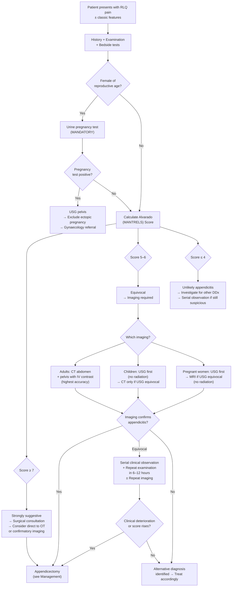

## Diagnostic Criteria, Algorithm, and Investigations

### Fundamental Diagnostic Principle

> ***Diagnosis of acute appendicitis is essentially clinical*** [2][4]. ***Diagnosis is often clinical*** [8].

This is the single most important statement to internalise. Unlike many conditions where you depend heavily on a single definitive test, acute appendicitis is diagnosed by **putting together the clinical picture** — history, examination, basic bloods, and scoring systems — and then using imaging to **confirm or exclude** in equivocal cases. No blood test or imaging modality alone can definitively rule in or rule out appendicitis.

**Why is clinical diagnosis so central?** Because the pathological process is dynamic and evolves over hours. A patient seen at 6 hours may have a completely different examination from the same patient at 18 hours. This is why ***serial examination is important*** [6] — particularly in children where the presentation is vague. The diagnosis often becomes clearer with time as pain localises.

---

### The Alvarado (MANTRELS) Score

The ***Alvarado score*** is the most widely used clinical scoring system for risk-stratifying suspected appendicitis [3][4]. It is a clinical and laboratory-based scoring system that helps guide the **operative decision** [4].

**MANTRELS** is the mnemonic — each letter represents a component:

| Component | Feature | Score | Explanation |
|-----------|---------|-------|-------------|
| **M** | ***Migratory RIF pain*** | 1 | The hallmark visceral → somatic pain shift (T8–10 periumbilical → RIF as parietal peritoneum becomes involved) |
| **A** | ***Anorexia*** | 1 | Visceral inflammation causes reflex appetite suppression via vagal afferents |
| **N** | ***Nausea and vomiting*** | 1 | Brainstem activation via visceral afferents; occurs *after* pain onset |
| **T** | ***Tenderness in RIF*** | **2** | Somatic pain from parietal peritoneal irritation — the most heavily weighted clinical sign |
| **R** | ***Rebound tenderness*** | 1 | Indicates established peritoneal inflammation |
| **E** | ***Elevated temperature ( > 37.5°C)*** | 1 | Systemic inflammatory response to appendiceal infection |
| **L** | ***Leucocytosis ( > 10 × 10⁹/L)*** | **2** | Neutrophilic response to bacterial infection — second most heavily weighted parameter |
| **S** | ***Shift to left*** | 1 | Increase in immature neutrophils (bands) — indicates acute bacterial infection driving emergency granulopoiesis |
| | **Total** | **10** | |

<Callout title="Why is Tenderness weighted 2 and Leucocytosis weighted 2?">
These two features carry the highest discriminatory power. RIF tenderness (a somatic sign) means the inflammation has already reached the parietal peritoneum — it is the most reliable clinical sign. Leucocytosis is the most objective laboratory marker of acute inflammation. Together they contribute 4 out of 10 points.
</Callout>

### Interpreting the Alvarado Score

| Score | Interpretation | Action |
|-------|---------------|--------|
| ***≥ 7*** | ***Strongly predictive of acute appendicitis*** | ***Consider surgery or further imaging*** [3][4] |
| ***5–6*** | ***Equivocal score*** | ***Requires abdominal USG or contrast-enhanced CT*** [3][4] |
| ***≤ 4*** | ***Appendicitis can be ruled out with greater certainty*** | ***Evaluate for other possible diagnoses*** [4] |

> **Practical nuance**: The Alvarado score was originally designed for adult males. It has **lower specificity in women of reproductive age** (because gynaecological pathology can produce similar symptoms and signs) and in **children** (who may not mount a robust leucocytosis and whose symptoms are vague). In these groups, a lower threshold for imaging is appropriate.

### Other Scoring Systems (Brief Mention)

- **Appendicitis Inflammatory Response (AIR) Score**: Incorporates CRP levels in addition to clinical features. More discriminatory than Alvarado in some studies, particularly for identifying complicated appendicitis.
- **Paediatric Appendicitis Score (PAS)**: Modified for children — includes right lower quadrant cough/hop/percussion tenderness instead of rebound tenderness (which is harder to elicit reliably in children).
- **Adult Appendicitis Score (AAS)**: Newer score incorporating CRP and clinical features with better sensitivity/specificity profiles.

> For exams, the **Alvarado (MANTRELS) score** is the one you must know inside out. The others are good to be aware of.

---

### Diagnostic Algorithm

The following algorithm integrates the clinical assessment, scoring, and imaging strategy for suspected acute appendicitis:

<Callout title="Key Decision Points in the Algorithm" type="idea">

1. **Always pregnancy test first** in women of reproductive age — ectopic pregnancy kills and must be excluded before anything else.
2. **Alvarado ≥ 7**: Many centres will proceed directly to surgery (especially in classic presentations in young males). Some will get a confirmatory CT to reduce negative appendicectomy rates.
3. **Alvarado 5–6**: This is the "grey zone" — imaging is essential here. CT is the modality of choice in adults.
4. **Alvarado ≤ 4**: Think of other diagnoses, but do NOT discharge without a plan for follow-up or serial observation if the clinical suspicion persists.
5. ***Serial examination is key in paediatrics*** [6] — children's presentations evolve, and a child who looks non-specific at presentation may develop clear signs hours later.

</Callout>

---

### Investigations

Investigations serve three purposes: (1) **support the clinical diagnosis**, (2) **exclude differential diagnoses**, and (3) **identify complications** (perforation, abscess).

#### A. Bedside Tests

***Bedside tests: urinalysis, pregnancy test*** [8]

| Test | Purpose | Key Findings | Interpretation |
|------|---------|-------------|----------------|
| ***Urinalysis*** | Exclude UTI / ureteric colic; detect sterile pyuria from pelvic appendix | RBCs → ureteric colic; WBCs + nitrites + bacteria → UTI | A **pelvic appendix** irritating the bladder/ureter can cause **sterile pyuria** (WBCs but no bacteria on culture) — don't be fooled into diagnosing UTI |
| ***Pregnancy test (urine β-hCG)*** | ***Indicated in all women of childbearing age*** [4] | Positive → ectopic pregnancy until proven otherwise | Mandatory before any imaging with radiation or surgical decision-making |
| Temperature | Assess fever | > 37.5°C scores 1 point on Alvarado | High fever ( > 38.5°C) suggests perforation/abscess or alternative diagnosis |

#### B. Blood Tests

***Blood tests: blood count, renal and liver function, amylase, clotting profile, arterial blood gas, type and screen*** [8]

| Test | Rationale | Key Findings in Appendicitis | Caveats |
|------|-----------|------------------------------|---------|
| ***CBC with differentials*** | Assess for leucocytosis and left shift | ***Leucocytosis with left shift*** — increased total WBC, bands, and neutrophils [4]. ***↑↑↑ leucocytosis may indicate gangrenous/perforated appendix*** [3] | ***A normal WBC cannot rule out appendicitis*** [3]. WBC is normal in ~20% of confirmed cases. In children, the elderly, and immunosuppressed, leucocytosis may be absent. Pregnancy has physiological leucocytosis (up to 15 × 10⁹/L) |
| ***CRP*** | Inflammatory marker; more specific than WBC for duration of inflammation | ***↑ CRP*** [4]. CRP rises ~12 hours after symptom onset. A **normal CRP within the first 12 hours does not exclude appendicitis**. Very high CRP ( > 100 mg/L) suggests complicated appendicitis (perforation/abscess) | CRP is a better marker of **duration** and **severity** rather than presence of appendicitis |
| ***Clotting profile*** | Pre-operative baseline | Usually normal | Required before any surgical intervention to check for bleeding diathesis [4] |
| ***Electrolyte profile*** | Assess dehydration from vomiting/poor intake | May show dehydration (↑ urea, ↑ creatinine), hypokalaemia (from vomiting) | Important for pre-operative fluid resuscitation planning |
| ***RFT*** | Baseline renal function; pre-operative; exclude renal pathology | Usually normal | Needed before contrast CT to assess eGFR (contrast is contraindicated in significant renal insufficiency) [4] |
| ***LFT*** | Baseline; marker of perforation | ***Mild elevations in serum bilirubin have been noted to be a marker for appendiceal perforation*** [4] | The mechanism is thought to be portal bacteraemia/endotoxaemia from the inflamed appendix causing hepatocyte dysfunction via portal venous drainage |
| ***Serum amylase*** | Exclude acute pancreatitis (a DDx of acute abdomen) | Normal in appendicitis; markedly elevated ( > 3× upper limit) in pancreatitis | A mildly elevated amylase can occur with any intra-abdominal inflammation — don't overcall pancreatitis |
| ***ABG with lactate*** | Assess for metabolic acidosis / raised lactate in sepsis or ischaemic bowel | Raised lactate suggests sepsis, peritonitis, or mesenteric ischaemia | Important in the unwell patient with generalised peritonitis |
| ***Group and screen (type and screen)*** | Pre-operative preparation | — | Required for any patient heading to theatre [6] |

<Callout title="The Bilirubin-Perforation Link" type="idea">
This is a commonly tested pearl: ***mild elevation of serum bilirubin is a marker for appendiceal perforation*** [4]. Why? When the appendix perforates, bacteria and endotoxins enter the portal circulation via the appendiceal vein → ileocolic vein → portal vein → liver. Endotoxins impair hepatic bilirubin excretion at the canalicular membrane, causing a mild unconjugated or mixed hyperbilirubinaemia. If you see an appendicitis patient with a mildly raised bilirubin, worry about perforation.
</Callout>

#### C. Radiological Investigations

The ***imaging of choice for RLQ pain*** is ***CT with IV contrast*** [3][8].

##### 1. Plain Abdominal X-ray (AXR)

***AXR: faecoliths (only 5% radio-opaque)*** [3]

- ***Not recommended in the diagnostic workup of suspected appendicitis, nor do findings on plain radiograph change the level of suspicion for appendicitis*** [4].
- ***Plain XR (rarely)*** used in paediatric assessment [1].
- **Why is it still sometimes done?** Primarily to exclude other causes of acute abdomen (e.g., bowel obstruction with dilated loops and air-fluid levels, pneumoperitoneum from perforated viscus — though erect CXR is better for this).
- **Possible findings** (non-specific and unreliable):
  - Radio-opaque faecolith in RIF (only 5% of appendicoliths are calcified enough to be visible)
  - Localised ileus ("sentinel loop") — a dilated loop of small bowel in the RIF due to localised inflammation
  - Loss of the right psoas shadow (from retroperitoneal inflammation)
  - Scoliosis concave to the right (from psoas spasm)
- **Bottom line**: AXR is a low-yield investigation for appendicitis specifically. Its value lies in excluding other diagnoses.

##### 2. Ultrasound (USG) Abdomen and Pelvis

***USG: low sensitivity, for pregnant women/children*** [3]. ***Ultrasound and CT scan may be helpful*** [8].

**Advantages (+)** [4]:
- ***No ionising radiation*** — safe for **children** and **pregnant women**
- ***No intravenous contrast required***
- Can assess gynaecological pathology simultaneously (ovarian cyst, ectopic pregnancy, PID)
- Real-time, bedside, repeatable

**Disadvantages (−)** [4]:
- ***Lower diagnostic accuracy*** compared to CT
- ***Higher non-diagnostic rate*** (cannot visualise the appendix in 15–50% of cases)
- ***Operator dependent*** — accuracy varies with sonographer experience
- ***Patient-specific limitations***: ***body habitus*** (obesity significantly reduces sensitivity), ***discomfort*** (pressure on tender abdomen), ***appendix location relative to overlying bowel*** (retrocaecal appendix hidden by gas-filled bowel)

**USG Findings of Appendicitis** [4]:

| Finding | Significance |
|---------|-------------|
| ***Non-compressible appendix with double-wall thickness diameter > 6 mm*** | The cardinal USG sign. A normal appendix is compressible and < 6 mm. An inflamed appendix is swollen, oedematous, and rigid — it cannot be compressed by the ultrasound probe ("non-compressible blind-ending tubular structure") |
| ***Focal pain over appendix with compression*** (sonographic McBurney's sign) | The point of maximal tenderness corresponds to the visualised appendix — provides real-time correlation between anatomy and symptoms |
| ***Increased echogenicity of inflamed periappendiceal fat*** | Inflamed fat appears bright on ultrasound (compared to normal hypoechoic fat). This represents the periappendiceal inflammation/fat stranding |
| ***Fluid in RLQ*** | Free fluid around the appendix suggests transmural inflammation or early perforation |
| ***Presence of appendicolith (with posterior acoustic shadowing)*** | A calcified faecolith within the lumen. The acoustic shadowing is caused by the dense calcified structure blocking ultrasound transmission — same principle as gallstones on USG |

**Graded compression technique**: The sonographer applies gentle, graduated pressure with the transducer in the RIF. Normal bowel loops are displaced and compressed. The inflamed appendix, being rigid and non-compressible, remains visible as a target-like structure on transverse view.

> **Strategy in children**: ***USG is the first-line imaging in paediatrics*** [1][3]. If USG is positive → proceed to surgery. If USG is negative or equivocal but clinical suspicion remains → **serial observation** or **CT** (bearing in mind radiation concerns — ***beware of high radiation*** [1]).

##### 3. CT Abdomen and Pelvis with IV Contrast

This is the ***imaging modality with the highest diagnostic accuracy*** [3][4] and the ***lowest non-diagnostic rate*** [4].

- **Sensitivity**: 94–98%
- **Specificity**: 95–98%
- **Negative predictive value**: > 97% (a truly negative CT essentially excludes appendicitis)

**Advantages (+)** [4]:
- ***Highest diagnostic accuracy***
- ***Lowest non-diagnostic rate***
- Excellent for identifying complications (abscess, phlegmon, perforation)
- Can identify alternative diagnoses (right-sided diverticulitis, mesenteric adenitis, ovarian pathology, ureteric calculi)

**Disadvantages (−)** [4]:
- ***Radiation is contraindicated in infants and pregnancy*** — CT involves significant ionising radiation (effective dose ~10 mSv for an abdominal CT). In children, radiation risk is amplified due to longer remaining lifespan for cancer development. ***Beware of high radiation*** in paediatrics [1].
- ***Contrast is contraindicated in renal insufficiency or hypersensitivity*** — iodinated contrast can cause contrast-induced nephropathy (especially if eGFR < 30) or anaphylactoid reactions.

**CT Findings of Appendicitis** [3][4]:

| Finding | Significance |
|---------|-------------|
| ***Enlarged appendiceal AP diameter > 6 mm with an occluded lumen*** | The inflamed, obstructed appendix distends with fluid/pus. Normal appendix diameter is < 6 mm |
| ***Appendiceal wall thickening > 2 mm*** | Oedema and inflammatory infiltrate in the wall |
| ***Appendiceal wall enhancement*** | The inflamed wall takes up IV contrast avidly (hyperaemia from the inflammatory response). This is why IV contrast is used. |
| ***Periappendiceal fat stranding*** | The most sensitive CT sign. Inflammation spreads beyond the appendiceal wall into the surrounding mesenteric fat, which appears as hazy increased attenuation ("dirty fat") on CT |
| ***Presence of appendicolith*** | A calcified density within the appendiceal lumen. Present in ~25% of cases. Its presence increases the risk of perforation and treatment failure with antibiotics alone |

**CT Findings Suggesting Complications**:

| Finding | Complication |
|---------|-------------|
| Focal defect in enhancing wall + extraluminal air | **Perforation** |
| Walled-off fluid collection with rim enhancement | **Appendiceal abscess** |
| Inflammatory mass without drainable fluid | **Phlegmon** |
| Free fluid in pelvis / paracolic gutters | **Peritonitis** |
| Extraluminal appendicolith | **Perforation** (the faecolith has escaped through the defect) |

##### 4. MRI Abdomen and Pelvis

***MRI abdomen and pelvis with contrast*** [4]

- **Advantages**: ***No ionising radiation*** [4] — the primary reason it is used.
- **Disadvantages**: ***Higher non-diagnostic rate*** [4], longer scan time (20–30 min vs 5 min for CT), requires patient cooperation (difficult in young children without sedation), less widely available on an emergency basis, more expensive.
- **When to use**: **Second-line imaging in pregnant women** when USG is equivocal. Also increasingly used in paediatric centres where availability allows.
- **Findings**: Similar to CT — enlarged appendix, wall thickening, periappendiceal fluid/inflammation. T2-weighted sequences show the inflamed appendix as high signal.

##### 5. Diagnostic Laparoscopy

***Diagnostic laparoscopy*** [3] is both diagnostic AND therapeutic.

- Used when the diagnosis remains uncertain despite clinical assessment and imaging.
- Particularly useful in **women of reproductive age** (can simultaneously assess the appendix, ovaries, tubes, and uterus).
- If appendicitis is confirmed → proceed to laparoscopic appendicectomy in the same sitting.
- If the appendix is normal → inspect the terminal ileum (Crohn's, Meckel's, mesenteric adenitis), gynaecological organs, and remainder of the abdomen.

<Callout title="Important" type="error">
***AVOID endoscopy for acute abdomen: a sealed-off perforation may open by gas insufflation during endoscopy*** [3]. This refers to upper/lower GI endoscopy (OGD/colonoscopy), NOT diagnostic laparoscopy. Laparoscopy is performed with careful insufflation in a controlled surgical setting and is safe. But blowing air into the GI lumen via endoscopy in a patient with a walled-off perforation can disrupt the seal and cause generalised peritonitis.
</Callout>

### Summary: Imaging Strategy by Patient Group

| Patient Group | First-Line Imaging | Second-Line Imaging | Rationale |
|---------------|-------------------|---------------------|-----------|
| **Adult male** | ***CT abdomen + pelvis with IV contrast*** | — | Highest accuracy, no radiation concerns in adults |
| **Adult female of reproductive age** | ***Urine PT first***, then ***CT*** (if PT negative) | USG if gynaecological DDx likely; diagnostic laparoscopy if still equivocal | Must exclude ectopic; CT for appendicitis, but USG may diagnose gynaecological cause |
| ***Children*** | ***USG*** | ***CT (beware of high radiation)*** [1] | Minimise radiation in paediatrics; serial observation before CT |
| ***Pregnant women*** | ***USG*** | ***MRI*** (no radiation) | CT is contraindicated (radiation to foetus); MRI is safe |
| **Elderly** | ***CT abdomen + pelvis with IV contrast*** | Colonoscopy after resolution (exclude caecal CA) | Must exclude malignancy as underlying cause |

### Investigations for Acute Abdomen — Quick Reference

From the lecture slides, the general investigation approach for acute abdominal pain [8]:

> ***Bedside tests: urinalysis, pregnancy test***
> ***Blood tests: blood count, renal and liver function, amylase, clotting profile, arterial blood gas, type and screen***
> ***Imaging: erect CXR, erect and supine AXR, USG, CT, contrast studies***
> ***Endoscopy: colonoscopy, upper endoscopy***

And the site-specific imaging guidance from senior notes [3]:

| Site of Pain | Imaging of Choice |
|-------------|-------------------|
| RUQ | USG |
| LUQ | CT |
| **RLQ** | **CT with IV contrast** |
| LLQ | CT with IV contrast |
| Suprapubic | USG (TAS or TVS) |

---

### Special Considerations

#### Paediatric Diagnosis

- ***Investigations: leucocytosis, plain XR (rarely), USG, CT (beware of high radiation)*** [1].
- ***Clinical diagnosis — serial examination is important*** [6].
- ***For boys: usually no need for imaging unless suspected delayed abscess or unclear diagnosis*** [6].
- ***For girls: ask LMP, order pregnancy test and USG abdomen. Do NOT perform PV on your own — consult Gynaecology!!*** [6].
- The approach in children is more conservative with imaging because: (1) radiation risk is significant, (2) clinical observation with serial exams is often sufficient, (3) USG can be used as first-line to avoid radiation.

#### When the Appendix Appears Normal at Surgery

If a normal appendix is found at operation [3]:
- The appendix is **still removed** — to avoid diagnostic confusion in the future (if the appendix is left in situ, a future episode of RLQ pain would re-raise appendicitis as a possibility).
- The surgeon must **systematically inspect**: terminal ileum (Crohn's, Meckel's diverticulum, TB ileitis), mesenteric lymph nodes (mesenteric adenitis), right colon (diverticulitis, carcinoma), gynaecological organs (women), and omentum/small bowel mesentery.
- The specimen is sent for **histology** — incidental carcinoid tumours and other pathology are occasionally found.

<Callout title="High Yield Summary">

**Diagnostic Principle**: Acute appendicitis is a CLINICAL diagnosis. Scoring systems (Alvarado/MANTRELS) and imaging SUPPORT the clinical assessment.

**Alvarado (MANTRELS) Score**: M-igratory RIF pain (1), A-norexia (1), N-ausea/vomiting (1), T-enderness RIF (2), R-ebound (1), E-levated temperature (1), L-eucocytosis (2), S-hift to left (1) = Total 10.
- ≥ 7: Strongly predictive → surgery/imaging
- 5–6: Equivocal → USG or CT
- ≤ 4: Unlikely → investigate other DDx

**Key Bloods**: CBC (leucocytosis, left shift — ↑↑↑ suggests complicated appendicitis, but normal does NOT rule it out), CRP (rises after 12 hours; very high suggests complications), LFT (↑ bilirubin = marker of perforation), pregnancy test (MANDATORY in all women of childbearing age), amylase (exclude pancreatitis).

**Imaging**:
- AXR: NOT recommended for appendicitis diagnosis (only 5% of faecoliths radio-opaque).
- USG: First-line in children and pregnant women. Non-compressible appendix > 6 mm.
- CT with IV contrast: HIGHEST diagnostic accuracy in adults. Appendix > 6 mm, wall thickening > 2 mm, fat stranding, appendicolith.
- MRI: Second-line in pregnant women (no radiation).

**Patient-specific strategies**: Adults → CT. Children → USG first, then CT if equivocal (beware radiation). Pregnant → USG first, then MRI. Girls with RLQ pain → always pregnancy test + USG + Gynae consult.

</Callout>

---

<ActiveRecallQuiz
  title="Active Recall - Diagnosis of Acute Appendicitis"
  items={[
    {
      question: "List the 8 components of the Alvarado (MANTRELS) score and their point values.",
      markscheme: "M - Migratory RIF pain (1), A - Anorexia (1), N - Nausea/vomiting (1), T - Tenderness in RIF (2), R - Rebound tenderness (1), E - Elevated temperature above 37.5C (1), L - Leucocytosis above 10x10^9/L (2), S - Shift to left (1). Total = 10. Score 7-10 = strongly predictive, 5-6 = equivocal (needs imaging), 0-4 = unlikely.",
    },
    {
      question: "What are the 5 key CT findings of acute appendicitis?",
      markscheme: "(1) Enlarged appendiceal diameter > 6 mm with occluded lumen, (2) Appendiceal wall thickening > 2 mm, (3) Periappendiceal fat stranding (most sensitive sign), (4) Appendiceal wall enhancement (hyperaemia), (5) Presence of appendicolith.",
    },
    {
      question: "Why is USG preferred over CT as first-line imaging in children with suspected appendicitis?",
      markscheme: "USG involves no ionising radiation, which is critical in children due to their higher radiation sensitivity and longer remaining lifespan for cancer development. CT involves significant radiation dose (~10 mSv). USG is also non-invasive, requires no contrast, and can be repeated. CT is reserved for equivocal USG results.",
    },
    {
      question: "A patient with suspected appendicitis has a mildly elevated serum bilirubin but otherwise normal LFTs. What does this suggest and what is the mechanism?",
      markscheme: "Mild elevation of serum bilirubin is a marker for appendiceal perforation. Mechanism: perforation causes bacteria/endotoxins to enter portal circulation via appendiceal vein to ileocolic vein to portal vein to liver. Endotoxins impair hepatic bilirubin excretion at the canalicular membrane, causing mild hyperbilirubinaemia.",
    },
    {
      question: "What is the first investigation you must order in a 22-year-old woman presenting with RLQ pain, and why?",
      markscheme: "Urine pregnancy test (beta-hCG). Mandatory in ALL women of childbearing age to exclude ectopic pregnancy, which is a life-threatening emergency. A positive result with RLQ pain and no intrauterine pregnancy on USG strongly suggests ectopic pregnancy. Must be done before any imaging or surgical planning.",
    },
    {
      question: "Why should you AVOID colonoscopy or OGD in a patient with suspected acute abdomen?",
      markscheme: "Gas insufflation during endoscopy can disrupt a sealed-off (walled-off) perforation, converting a contained situation into generalised peritonitis. This applies to upper and lower GI endoscopy, NOT to diagnostic laparoscopy which is performed under controlled surgical conditions.",
    },
  ]}
/>

## References

[1] Lecture slides: GC 203. The child needs an operation Common emergencies and surgery in childhood.pdf (p39, p41)
[2] Lecture slides: GC 195. Lower and diffuse abdominal pain RLQ problems; pelvic inflammatory disease; peritonitis and abdominal emergencies.pdf (p5, p9, p14, p15)
[3] Senior notes: maxim.md (Section 4.6 – Acute appendicitis; Section 2.4 – Acute abdomen)
[4] Senior notes: felixlai.md (Acute appendicitis – Diagnosis, Biochemical tests, Radiological tests)
[6] Senior notes: maxim.md (Section 3.3 – Paediatric surgical abdomen)
[8] Lecture slides: GC 195. Lower and diffuse abdominal pain RLQ problems; pelvic inflammatory disease; peritonitis and abdominal emergencies.pdf (p12, p15)
