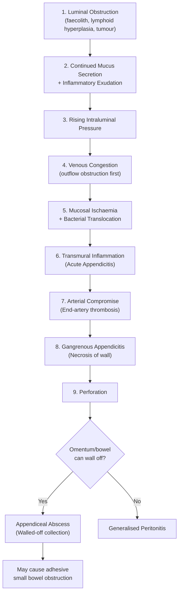
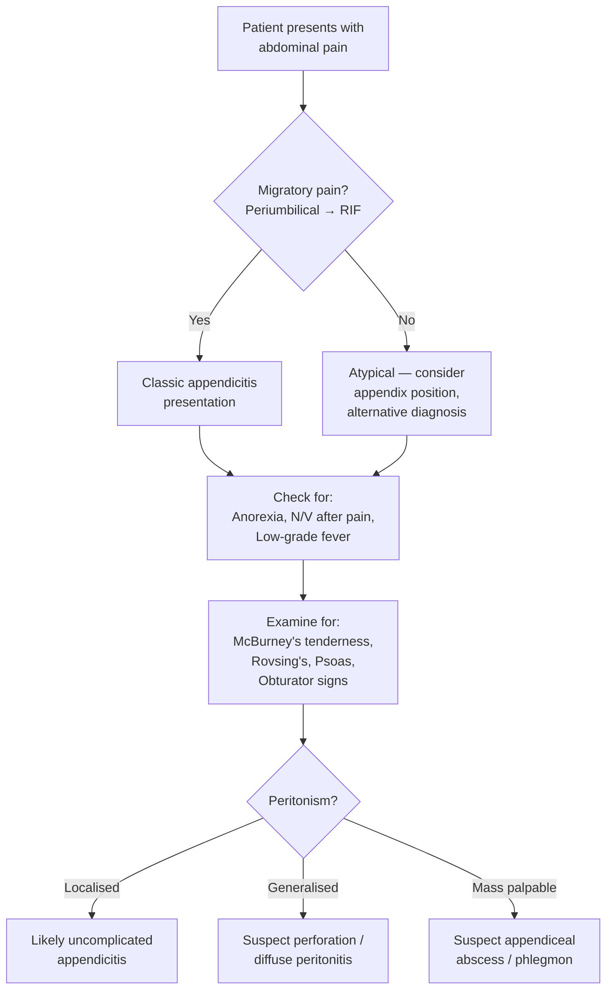

# Acute Appendicitis

## Definition

Acute appendicitis is an **acute inflammation of the vermiform appendix**, most commonly resulting from obstruction of the appendiceal lumen. The term derives from Latin: *appendix* = "something attached" + *-itis* = "inflammation." It is the ***most common acute surgical emergency of the abdomen*** and the ***most common acute paediatric surgical condition*** [1][2].

Approximately **two-thirds of cases are due to luminal occlusion**, while **one-third are non-occlusive** (the exact mechanism in non-occlusive cases remains debated but likely involves mucosal ulceration from viral infection or lymphoid hyperplasia) [3].

<Callout title="Key Concept">
Think of acute appendicitis as a "closed-loop obstruction" at miniature scale — the appendix has a single opening into the caecum, so any blockage creates a sealed chamber where pressure builds, blood supply is compromised, and bacteria proliferate. This is exactly the same principle as a closed-loop bowel obstruction, just in a tiny organ.
</Callout>

### Disease Severity Grading

A useful grading system that mirrors the pathological progression [4]:

| Grade | Description |
|-------|-------------|
| 1 | Inflamed (simple / early) |
| 2 | Gangrenous (ischaemic necrosis of wall) |
| 3 | Perforated with localized free fluid |
| 4 | Perforated with regional abscess |
| 5 | Perforated with diffuse peritonitis |

> This grading matters operatively — Grade 1–2 can often be managed laparoscopically with ease, while Grade 4–5 may require open conversion, drainage, and intensive post-operative antibiotics.

---

## Epidemiology

- ***Peak incidence in the 2nd and 3rd decades of life (20s–30s)*** in adults [4].
- ***Peak age in paediatrics: between 4 and 15 years*** [1].
- **Increasingly common through childhood and early adult life**, then declines in the elderly [4].
- **Male : Female ratio ≈ 1.4 : 1** [4].
- **Lifetime risk**: approximately 7–8%.
- Rare in infants < 2 years (the appendiceal lumen is wide and funnel-shaped, making obstruction less likely, and lymphoid tissue is underdeveloped).
- In the elderly, acute appendicitis is less common but carries **higher morbidity and mortality** due to delayed presentation, atypical symptoms, and higher perforation rates.

### Epidemiology in Hong Kong Context

- Hong Kong has a relatively high incidence of **right-sided diverticulitis** compared to Western populations, which is an important differential (more on this in DDx later) [4].
- The availability of CT scanning and emergency ultrasonography in Hong Kong's public hospital system (HA hospitals) has improved diagnostic accuracy, but clinical diagnosis remains paramount in straightforward presentations.

---

## Anatomy and Function

### Gross Anatomy

The **vermiform appendix** is a **true diverticulum of the caecum**, meaning it contains **all layers of the colonic wall**: mucosa, submucosa, muscularis (both longitudinal and circular layers), and serosa [4].

- **Base**: Located at the **posteromedial wall of the caecum**, approximately **2 cm below the ileocaecal valve**, at the point where the **three taeniae coli converge** on the caecum [3][4].
  - This convergence point is **constant** regardless of the position of the tip — this is why during surgery, ***the appendix can always be traced by gentle traction on the taeniae coli*** [3].
- **Surface landmark**: The base corresponds to **McBurney's point** — defined as the point ***one-third of the distance from the anterior superior iliac spine (ASIS) to the umbilicus*** [3].
- **Length**: Typically 6–9 cm (range 2–20 cm).
- **In colonoscopy**: The appendiceal orifice is visualized on the ***posteromedial wall of the caecum, approximately 2 cm below the ileocaecal valve*** [3].

### Position of the Appendix Tip

The **base** is constant, but the **tip** is highly variable. This is critical because the position of the tip determines the clinical presentation:

| Position | Frequency | Clinical Significance |
|----------|-----------|----------------------|
| **Retrocaecal** (but intraperitoneal) | **74%** | Most common. May cause flank/back pain. Psoas sign positive. May lack classic anterior abdominal signs because the appendix is "hidden" behind the caecum. |
| **Pelvic** | **21%** | May irritate the bladder (dysuria, frequency) or rectum (diarrhoea, tenesmus). Rectal/pelvic exam important. |
| **Paracaecal** | 2% | Typical RIF presentation |
| **Subcaecal** | 1.5% | Typical RIF presentation |
| **Preileal** | 1% | May cause small bowel-type symptoms |
| **Postileal** | 0.5% | May be behind the ileum, atypical presentation |

<Callout title="Why does position matter so much?" type="idea">
The classic "textbook" presentation of acute appendicitis (periumbilical pain migrating to RIF) relies on the appendix being in a position where it can irritate the anterior parietal peritoneum. A **retrocaecal** appendix may never touch the anterior parietal peritoneum, so the patient may present with flank pain, back pain, or even no localizing signs — leading to delayed diagnosis and higher perforation rates. Similarly, a **pelvic** appendix may irritate the bladder or rectum, mimicking UTI or gastroenteritis.
</Callout>

- The appendix's position is affected by **embryological rotation**. The caecum undergoes continuous growth during foetal life, rotating the appendix into its retrocaecal (but intraperitoneal) position during childhood. ***A pelvic appendix may result from absence of this rotation*** [4].
- Position can also be dramatically altered by **malrotation or non-rotation of the caecum** (e.g., the caecum may end up in the RUQ or even LUQ) [3].

### Neurovascular Supply

- **Arterial supply**: The ***appendiceal artery***, which is a ***terminal branch of the ileocolic artery*** (itself a branch of the superior mesenteric artery, SMA) [3][4].
  - **Crucially, this is an end-artery** — there is no collateral blood supply. This means that ***thrombosis of the appendiceal artery causes necrosis of the entire appendix (gangrenous appendicitis)*** [3]. This explains why the progression from inflammation to gangrene can be rapid and irreversible.
- **Venous drainage**: Appendiceal vein → ileocolic vein → superior mesenteric vein → portal vein.
  - This portal venous drainage explains why appendicitis can (rarely) cause **pylephlebitis** (septic thrombophlebitis of the portal vein) and **hepatic abscess**.
- **Lymphatic drainage**: To the ileocolic lymph nodes.
- **Nerve supply**: Sympathetic and parasympathetic fibres via the superior mesenteric plexus. **Visceral afferent pain fibres enter the spinal cord at T8–T10** — this is why early appendiceal pain is referred to the periumbilical region (T10 dermatome).

### Function

The appendix was historically considered "vestigial," but it is now understood to have roles in:
- **Immune function**: The wall contains abundant **lymphoid tissue** (sometimes called the "abdominal tonsil"), particularly in children and young adults. This lymphoid tissue is part of **gut-associated lymphoid tissue (GALT)** and participates in IgA secretion.
  - ***Lymphoid tissue undergoes atrophy with age*** [4], which partly explains why appendicitis becomes less common in the elderly.
- **Gut microbiome reservoir**: The appendix may serve as a "safe house" for commensal bacteria, allowing recolonization of the colon after diarrhoeal illness.

### The Mesoappendix

The appendix is suspended by a **mesoappendix** (a triangular fold of peritoneum), which contains the ***appendicular artery and vein*** [3]. During appendicectomy, the mesoappendix must be ligated to control the appendicular artery before the appendix is divided at its base.

---

## Aetiology

The central mechanism is **obstruction of the appendiceal lumen**, though non-obstructive causes exist. The causes differ by age group:

### Causes of Luminal Obstruction

| Cause | Details | Age Group |
|-------|---------|-----------|
| ***Lymphoid hyperplasia*** | Reactive enlargement of submucosal lymphoid follicles (from viral or bacterial infection, e.g., adenovirus, EBV, measles) occludes the narrow lumen | ***Main cause in young patients / children*** [4] |
| ***Faecolith (fecalith)*** | A hard, stony mass composed of ***faecal material, calcium phosphates, bacteria, and epithelial debris*** [4]. Acts as a "stone" blocking the appendiceal orifice | ***Main cause in older patients*** [4]. Associated with low-fibre diets. |
| ***Tumours*** | ***Carcinoma of the caecum*** can obstruct the appendiceal orifice; intrinsic tumours include ***carcinoid tumour, adenocarcinoma, and mucocele*** | Elderly patients [3][4] |
| ***Intestinal parasites*** | e.g., *Enterobius vermicularis* (pinworm), *Ascaris lumbricoides* | More common in endemic areas |
| ***Foreign bodies*** | Ingested objects, fruit seeds, etc. | Rare |
| Calculi | True appendicoliths (calcified fecaliths) | Any age |

<Callout title="Exam Pearl" type="idea">
In an elderly patient presenting with features of acute appendicitis, always think about **caecal carcinoma** as a possible underlying cause. Post-appendicectomy, the specimen should be sent for histology, and if there is any suspicion, a follow-up colonoscopy should be arranged.
</Callout>

### Non-Obstructive Appendicitis (~1/3 of cases)

- Mucosal ulceration from viral infection (adenovirus, CMV)
- Direct bacterial invasion
- Ischaemic causes (vasculitis, e.g., in Henoch-Schönlein purpura)

### Bacteriology

Once the appendix becomes inflamed and ischaemic, **polymicrobial bacterial overgrowth** occurs. The common organisms reflect normal colonic flora [4]:

- ***Escherichia coli*** (most common aerobe)
- ***Bacteroides spp.*** (most common anaerobe — especially *B. fragilis*)
- ***Pseudomonas aeruginosa***
- ***Peptostreptococcus spp.***

> This mixed aerobic-anaerobic flora is why antibiotic regimens for appendicitis must cover both Gram-negatives and anaerobes (e.g., cefuroxime + metronidazole, or amoxicillin-clavulanate).

### Risk Factors for Perforation

Perforation is the most feared progression. Risk factors include [4]:

| Risk Factor | Explanation |
|-------------|-------------|
| ***Male gender*** | Possibly due to delayed presentation |
| ***Extremes of age*** | Young children cannot articulate symptoms; elderly have atypical presentations. Both groups have higher perforation rates (up to 50–70% in < 5 years and > 65 years) |
| ***Diabetes mellitus*** | Autonomic neuropathy blunts pain perception; immunocompromised state |
| ***Immunosuppression*** | Blunted inflammatory response → delayed diagnosis |
| ***Previous abdominal surgery*** | Altered anatomy makes diagnosis difficult |
| ***Faecolith obstruction*** | More complete obstruction → faster progression to gangrene |
| ***Pelvic appendix*** | Doesn't irritate anterior parietal peritoneum → delayed diagnosis [4] |

---

## Pathophysiology

Understanding the pathophysiology of acute appendicitis as a **stepwise sequence** is critical — it explains every clinical feature, complication, and management decision.

### Step-by-Step Pathogenesis

### Detailed Explanation of Each Step

1. **Luminal obstruction**: The appendix has a narrow lumen (especially in adults). Obstruction creates a ***"closed-loop" obstruction*** [1] — the appendix has only one opening into the caecum, so once blocked, secretions have nowhere to go.

2. **Continued mucus secretion**: The appendiceal mucosa continues to secrete mucus (approximately 1 mL/day). ***Continuous mucus secretion and inflammatory exudation leads to increased intraluminal and intramural pressure*** [4].

3. **Rising intraluminal pressure**: Pressure within the lumen exceeds venous pressure first (veins are thin-walled and low-pressure), then lymphatic pressure, and eventually arterial pressure.

4. **Venous congestion → lymphatic stasis**: ***Thrombosis and occlusion of small vessels in the appendiceal wall, and stasis of lymphatic flow*** [4]. The appendix becomes oedematous, engorged, and hyperaemic. This is the "early appendicitis" stage (Grade 1).

5. **Mucosal ischaemia and bacterial invasion**: As the mucosa becomes ischaemic, the mucosal barrier breaks down. ***Bacterial overgrowth occurs within the diseased appendix, and intraluminal bacteria subsequently invade the appendiceal wall*** [4]. This is when the process becomes truly infective.

6. **Transmural inflammation**: The entire wall is now inflamed. When inflammation reaches the **serosa** (outermost layer), it irritates the adjacent **parietal peritoneum** — this is when the pain **shifts from periumbilical to RIF**.

7. **Arterial compromise**: Because the appendiceal artery is an **end-artery**, once arterial inflow is compromised (by oedema compressing the artery, or thrombosis), the entire appendix undergoes **gangrenous necrosis** (Grade 2).

8. **Perforation** (Grade 3–5): ***Once significant inflammation and necrosis occurs, the appendix is at risk of perforation*** [4]. The weakened, necrotic wall gives way, releasing pus, faecal material, and bacteria into the peritoneal cavity.

9. **Outcome depends on the body's ability to contain the spillage**:
   - If the **omentum and adjacent bowel loops** can migrate to wall off the perforation → ***appendiceal abscess*** (Grade 4) → may later cause ***adhesive small bowel obstruction*** [3].
   - If the infection is **not walled off** → ***generalised peritonitis*** (Grade 5) [3] — a life-threatening surgical emergency.

<Callout title="Why does perforation happen faster in children?" type="error">
Children have a **poorly developed omentum** (the "policeman of the abdomen" that walls off infection). This means that when perforation occurs in a child, generalised peritonitis is more likely than a contained abscess. Combined with their inability to articulate symptoms clearly, this explains why **perforation rates in children under 5 can exceed 50%**.
</Callout>

---

## Classification

### By Pathological Stage (Clinical-Pathological Correlation)

| Stage | Pathology | Clinical Correlate |
|-------|-----------|-------------------|
| **Early / Catarrhal** | Mucosal and submucosal inflammation only | Vague periumbilical pain, anorexia |
| **Suppurative / Phlegmonous** | Transmural inflammation with pus in lumen | Pain shifts to RIF, localised peritonism |
| **Gangrenous** | Necrosis of appendiceal wall | Severe pain, then may get paradoxical relief (nerve death) → then sudden deterioration |
| **Perforated** | Hole in the wall | Sudden worsening of pain, generalised peritonism, sepsis |
| **Abscess** | Walled-off perforation | Palpable RIF mass, swinging fever, persistent symptoms |

### By Complexity

- **Uncomplicated**: Inflamed but not gangrenous/perforated (Grade 1)
- **Complicated**: Gangrenous (Grade 2), perforated (Grade 3), abscess (Grade 4), or diffuse peritonitis (Grade 5)

> This distinction is important for management — uncomplicated appendicitis *may* be managed conservatively with antibiotics in select cases (the "antibiotics-first" approach), while complicated appendicitis almost always requires surgery ± drainage.

---

## Clinical Features

The classic presentation occurs in only **50–60% of patients**. Always maintain a high index of suspicion.

### Symptoms

#### 1. Abdominal Pain — The Cardinal Symptom

The **migratory pattern of pain** is the single most important diagnostic feature:

**Phase 1: Visceral Pain (Early)**
- ***Periumbilical pain: crampy, intermittent, poorly localized*** [3]
- **Why periumbilical?** The appendix is a midgut structure. Visceral afferent nerve fibres from the appendix travel with sympathetic nerves and ***enter the spinal cord at T8–T10 levels*** [4]. T10 is the dermatome of the umbilicus. Since visceral pain is transmitted by unmyelinated C-fibres that converge on shared spinal cord segments, the brain cannot localise it precisely — hence the vague, poorly localised periumbilical ache.
- **Character**: Dull, crampy, colicky (due to peristaltic contractions of the appendiceal smooth muscle trying to expel the obstruction).
- ***Aggravated by moving and coughing*** [3] (even at this stage, movement jostles the inflamed viscus).

**Phase 2: Somatic Pain (Later — typically after 12–24 hours)**
- ***Pain migrating to the right lower quadrant (RLQ) after 12–24 hours: constant, sharp, well-localised pain*** [3][4]
- **Why does it migrate?** Once transmural inflammation extends to the **serosa**, it irritates the overlying **parietal peritoneum**. Unlike the viscera, the parietal peritoneum is innervated by **somatic nerves** (myelinated A-delta fibres) that provide ***precise localisation*** [4]. The pain now shifts to wherever the inflamed appendix is located — classically the RIF.
- **Character**: Sharp, constant, worse with movement (the patient lies still and resists any jostling).

<Callout title="Classic Teaching Point">
***"Visceral → Somatic" pain migration is highly suggestive of acute appendicitis.*** The sequence is: vague periumbilical discomfort → sharp RIF pain over 12–24 hours. This pattern has a **positive predictive value of ~80%** for appendicitis.

Contrast this with **gastroenteritis**, where ***nausea/vomiting precedes the pain*** [3] — in appendicitis, pain comes first, then nausea/vomiting.
</Callout>

**Atypical Pain Locations (based on appendix position)**:
- **Retrocaecal appendix**: Pain may be in the **right flank or back**; may mimic renal colic. Anterior abdominal signs may be minimal.
- **Pelvic appendix**: **Suprapubic pain**; may mimic UTI or gynecological pathology. May cause **rectal pain** or **urinary symptoms**.
- **Long appendix crossing midline**: **Left-sided pain** (rare but described).
- **Malrotated caecum**: Pain may be **anywhere** in the abdomen.

#### 2. Anorexia (Loss of Appetite)

- ***Anorexia is a classical feature*** [4] — present in > 90% of cases.
- **Why?** Visceral inflammation causes a reflex suppression of appetite via vagal afferents to the brainstem vomiting/appetite centres. The peritoneal irritation also causes ileus and gastric stasis, reducing the desire to eat.
- Clinically useful: **If a patient is hungry and eating normally, think twice about appendicitis.**

#### 3. Nausea and Vomiting

- ***Nausea and vomiting are classical features*** [4].
- **Why?** Visceral afferent stimulation from the inflamed appendix activates the **area postrema** and **nucleus tractus solitarius** in the brainstem. Peritoneal irritation also reflexly causes gastric stasis and reverse peristalsis.
- **Key timing**: In appendicitis, ***pain precedes nausea/vomiting***. In gastroenteritis, ***nausea/vomiting typically precedes pain*** [3]. This is a commonly tested distinction.
- Vomiting is usually mild (1–2 episodes) and not profuse.

#### 4. Low-Grade Fever

- ***Low-grade fever*** [3] — typically 37.5–38.5°C.
- **Why?** The inflammatory response generates pyrogens (IL-1, IL-6, TNF-α, PGE₂) that act on the hypothalamic thermoregulatory centre.
- **High fever ( > 38.5°C)** should raise suspicion for **perforation, abscess, or an alternative diagnosis**.

#### 5. Other Non-Specific Symptoms

- ***Indigestion, flatulence*** [4] — due to reflex ileus.
- ***Diarrhoea*** [4] — especially with a **pelvic appendix** irritating the rectum (causes increased rectal peristalsis). Can mimic gastroenteritis.
- ***Tenesmus*** [4] — again due to a pelvic appendix irritating the rectum (a feeling of incomplete evacuation and the urge to defaecate).
- ***Malaise*** [4] — general systemic inflammation.
- **Dysuria / urinary frequency** — a pelvic appendix lying close to the bladder can irritate it, mimicking a UTI.
- **Constipation** — due to reflex ileus; some patients develop absolute constipation with peritonitis.

> **The classic sequence**: Anorexia → periumbilical pain → nausea ± vomiting → pain migration to RIF → low-grade fever. This sequence (sometimes called **Murphy's sequence** or the **chronology of symptoms**) is present in ~50% of cases but is highly specific when present.

### Signs

The physical examination in suspected appendicitis follows a systematic approach. Signs are best understood in terms of what they are testing:

#### 1. General Inspection

- The patient often **lies still** with hips slightly flexed (because extension of the right hip stretches the psoas and irritates the inflamed appendix).
- **Facial expression of pain** when asked to move or cough.
- May be flushed with low-grade fever.
- **Foetor oris** (bad breath) — due to dehydration and reduced oral intake.

#### 2. Abdominal Inspection

- The abdomen may be **still** on the affected side (reduced respiratory excursion due to guarding).
- No specific visible abnormality in early appendicitis.
- A distended abdomen may indicate complications (ileus, peritonitis, or abscess with obstruction).

#### 3. Palpation — Tenderness and Peritonism

***Pointing sign: Maximum tenderness at McBurney's point*** [3]
- McBurney's point is the surface landmark of the appendiceal base.
- The patient can often point with one finger to the site of maximum pain — this is the "pointing sign."
- **Why here?** The inflamed appendix (or its base) lies deep to this point, and pressure here compresses inflamed tissue against the psoas/iliacus, causing sharp somatic pain.

**Localised guarding**
- Involuntary contraction of the abdominal wall muscles overlying the inflamed area.
- **Why?** A protective reflex mediated by spinal cord reflex arcs — when somatic pain fibres from the parietal peritoneum are stimulated, motor neurones to the overlying rectus/oblique muscles cause contraction to "splint" the area and prevent further irritation.

**Rebound tenderness**
- Pain that is worse on sudden release of deep palpation than on compression.
- **Why?** Sudden release causes the peritoneum to spring back into contact with the inflamed appendix, generating a burst of somatic nerve firing. This is a sign of **parietal peritoneal irritation**.

**Rigidity (Board-like abdomen)**
- Indicates **diffuse peritonitis** (Grade 5) — suggests perforation with generalised contamination.
- The entire abdominal wall is involuntarily rigid.

#### 4. Special Signs

***Rovsing's sign: RLQ pain upon deep palpation (or rebound) of the LLQ*** [3]
- **Why?** Pressing on the left side of the abdomen pushes bowel gas and intestinal contents towards the caecum and RIF, distending the caecum and jostling the inflamed appendix. Pain is felt in the RIF, not the LLQ. This confirms that the source of irritation is in the RIF.

***Psoas sign (Cope's psoas test): Increased RIF pain upon passive extension of the right hip (or asking the patient to flex the right hip against resistance)*** [3]
- **Why?** The psoas major muscle lies in the retroperitoneum along the right iliac fossa. A **retrocaecal appendix** lies directly on or near the psoas. Extending the hip stretches the psoas, which moves against the inflamed appendix, causing pain.
- This sign is most useful for **retrocaecal appendicitis**.

**Obturator sign: RIF pain on passive internal rotation of the flexed right hip**
- **Why?** The obturator internus muscle forms part of the lateral pelvic wall. A **pelvic appendix** lying near this muscle will be irritated when the muscle moves during internal rotation.
- This sign is most useful for **pelvic appendicitis**.

**Dunphy's sign: Increased pain with coughing**
- **Why?** Coughing raises intra-abdominal pressure, causing the parietal peritoneum to move against the inflamed appendix.

**Cough test / Percussion tenderness**
- Gently percussing the RIF causes pain — a gentler way of eliciting peritoneal irritation than deep palpation.

#### 5. Rectal Examination (DRE)

- Classically taught as part of the assessment.
- May reveal **right-sided pelvic tenderness** if the appendix is in a pelvic position.
- A **palpable mass** may indicate an appendiceal abscess.
- In practice, DRE adds limited information if imaging is available, but it should be performed if:
  - The diagnosis is unclear
  - A pelvic appendix is suspected
  - Pelvic pathology (e.g., pelvic abscess, TOA, ectopic pregnancy) is in the differential

#### 6. Vaginal Examination (in women of reproductive age)

- Important to assess for **cervical motion tenderness** (suggests PID), **adnexal masses** (ovarian cyst/torsion, ectopic pregnancy), and **vaginal discharge**.

#### 7. Signs Suggesting Complications

| Sign | Suggests |
|------|----------|
| High fever ( > 38.5°C) | Perforation / abscess |
| Tachycardia | Sepsis / dehydration |
| Palpable RIF mass | Appendiceal phlegmon or abscess |
| Generalised rigidity | Diffuse peritonitis |
| Absent bowel sounds | Paralytic ileus from peritonitis |
| Paradoxical pain relief followed by sudden deterioration | Gangrenous appendicitis (nerve endings in the wall die → brief pain relief → then wall perforates → sudden peritonitis) |

<Callout title="The 'Relief then Crash' Pattern" type="error">
A patient whose pain suddenly "gets better" before dramatically worsening likely has **gangrenous appendicitis progressing to perforation**. The initial relief occurs because the necrotic appendiceal wall has lost its nerve supply (dead nerves don't fire pain signals). Then when perforation occurs, bacterial and faecal contamination of the peritoneal cavity causes sudden severe peritonitis. Never be falsely reassured by apparent improvement — reassess!
</Callout>

### Special Populations

#### Children (Paediatric Appendicitis)

- ***Most common acute paediatric surgical condition*** [1].
- ***Peak age between 4 and 15 years*** [1].
- **Higher perforation rate** (up to 30–50%), especially in younger children, because:
  - Cannot articulate symptoms clearly → delayed diagnosis
  - Underdeveloped omentum → poor ability to wall off infection
  - Thinner appendiceal wall → perforates more readily
- May present with **diffuse abdominal pain**, irritability, refusal to eat/walk, and **diarrhoea** more commonly than adults.
- **Neonates and infants**: Extremely rare. If it occurs, almost always presents as perforation with peritonitis (diagnosis is rarely made pre-operatively).

#### Elderly

- **Atypical presentations** are the rule, not the exception.
- Lower temperature response, less prominent leucocytosis, vague symptoms.
- **High perforation rate** (50–70%) due to delayed presentation and delayed diagnosis.
- Must rule out **caecal carcinoma** as the underlying cause.

#### Pregnancy

- **Most common non-obstetric surgical emergency in pregnancy**.
- The growing uterus displaces the caecum and appendix **superiorly and laterally** — pain may be in the **right flank or even RUQ** rather than RIF, especially in the 2nd and 3rd trimesters.
- **Leucocytosis is normal in pregnancy** (up to 15,000/µL) → less reliable as a diagnostic marker.
- **Ultrasound** is the first-line imaging (no ionising radiation); **MRI** is second-line.
- Perforation risk is higher because of delayed diagnosis, and maternal/foetal morbidity is significant with perforation → maintain a low threshold for surgery.

#### Immunocompromised Patients (HIV, transplant recipients, on chemotherapy)

- Blunted inflammatory response → minimal fever, minimal leucocytosis, minimal peritoneal signs.
- Very high risk of delayed diagnosis and perforation.

---

## Summary of Clinical Approach (Pre-Diagnosis)

<Callout title="High Yield Summary">

**Definition**: Acute inflammation of the vermiform appendix; most common acute surgical emergency. 2/3 obstructive, 1/3 non-obstructive.

**Epidemiology**: Peak 20s–30s adults; 4–15 years paediatric. M:F = 1.4:1. Lifetime risk ~7–8%.

**Anatomy**: True diverticulum of caecum. Base at convergence of taeniae coli (McBurney's point). Appendiceal artery is an END-ARTERY (thrombosis → gangrene). Retrocaecal 74%, Pelvic 21%.

**Aetiology**: Lymphoid hyperplasia (young), faecolith (older), tumour (elderly). Bacteria: E. coli, Bacteroides, Pseudomonas, Peptostreptococcus.

**Pathophysiology**: Obstruction → ↑ intraluminal pressure → venous congestion → ischaemia → bacterial invasion → transmural inflammation → gangrene → perforation → abscess or peritonitis.

**Risk factors for perforation**: Male, extremes of age, DM, immunosuppression, previous surgery, faecolith, pelvic appendix.

**Classic symptom sequence**: Anorexia → periumbilical pain (T8–10 visceral) → N/V → pain migrates to RIF (somatic, parietal peritoneum) → low-grade fever.

**Key signs**: McBurney's point tenderness (pointing sign), Rovsing's (RIF pain on LLQ pressure), Psoas (retrocaecal), Obturator (pelvic), rebound tenderness, guarding.

**Atypical presentations**: Retrocaecal (flank/back pain), Pelvic (dysuria/diarrhoea/tenesmus), Children (diffuse pain, high perforation), Elderly (vague, high perforation), Pregnancy (displaced superiorly).

</Callout>

---

<ActiveRecallQuiz
  title="Active Recall - Acute Appendicitis (Definition to Clinical Features)"
  items={[
    {
      question: "Why is the appendiceal artery clinically significant in the pathogenesis of gangrenous appendicitis?",
      markscheme: "It is a terminal branch (end-artery) of the ileocolic artery with no collateral supply. Thrombosis leads to complete necrosis of the appendiceal wall (gangrenous appendicitis).",
    },
    {
      question: "Explain the pathophysiological basis for pain migration from the periumbilical region to the right iliac fossa in acute appendicitis.",
      markscheme: "Early: visceral afferents from appendix enter spinal cord at T8-T10 (periumbilical dermatome) causing vague, poorly localised pain. Later: transmural inflammation involves serosa, irritating parietal peritoneum innervated by somatic nerves, causing sharp, well-localised RIF pain.",
    },
    {
      question: "A pelvic appendix may mimic which conditions and why?",
      markscheme: "UTI (bladder irritation causing dysuria/frequency), gastroenteritis (rectal irritation causing diarrhoea/tenesmus), and gynaecological pathology (suprapubic pain). Because the pelvic appendix lies close to the bladder, rectum, and adnexa.",
    },
    {
      question: "What is the most common cause of appendiceal obstruction in young patients versus older patients?",
      markscheme: "Young: lymphoid hyperplasia (reactive to viral/bacterial infection). Older: faecolith (hard mass of faecal material, calcium phosphates, bacteria, epithelial debris). Elderly: also consider tumours (caecal carcinoma, carcinoid).",
    },
    {
      question: "Why do children have higher perforation rates in acute appendicitis compared to adults?",
      markscheme: "Three reasons: (1) Cannot articulate symptoms clearly leading to delayed diagnosis, (2) Underdeveloped omentum cannot wall off infection, (3) Thinner appendiceal wall perforates more readily.",
    },
    {
      question: "Describe the mechanism behind Rovsing's sign.",
      markscheme: "Deep palpation of the LLQ pushes bowel gas and contents towards the caecum/RIF, distending the caecum and jostling the inflamed appendix against the parietal peritoneum, causing referred pain in the RIF (not the LLQ).",
    },
  ]}
/>

## References

[1] Lecture slides: GC 203. The child needs an operation Common emergencies and surgery in childhood.pdf (p39)
[2] Lecture slides: GC 195. Lower and diffuse abdominal pain RLQ problems; pelvic inflammatory disease; peritonitis and abdominal emergencies.pdf
[3] Senior notes: maxim.md (Section 4.6 - Acute appendicitis)
[4] Senior notes: felixlai.md (Acute appendicitis section)
