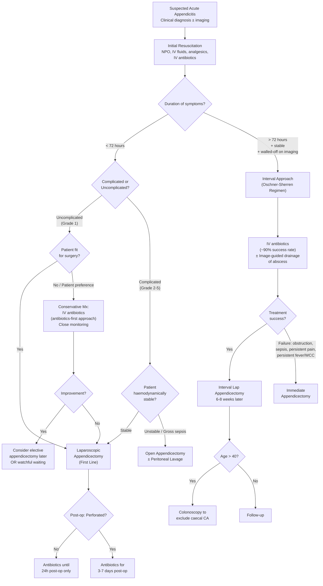

## Management of Acute Appendicitis

### General Principles

The management of acute appendicitis rests on three pillars: **resuscitation**, **antibiotics**, and **surgery**. The decision tree depends critically on three factors:

1. **When did symptoms start?** ( < 72 hours vs > 72 hours)
2. **Is the appendicitis complicated or uncomplicated?** (simple inflammation vs gangrenous/perforated/abscess/peritonitis)
3. **Is the patient stable or unstable?**

> ***Treatment: Antibiotics + Appendicectomy (Laparoscopic vs open)*** [2]

> ***Appendectomy is the preferred treatment for complicated or uncomplicated acute appendicitis*** [4]. It ***can generally be performed with low morbidity and mortality*** [4].

---

### Management Algorithm

---

### Step 1: Initial Resuscitation and Supportive Care

Before any definitive treatment, **every patient** needs resuscitation. This is not unique to appendicitis — it applies to any acute surgical abdomen [3][4]:

***Resuscitation, NPO, IV fluids, analgesics*** [3]

| Measure | Details | Rationale |
|---------|---------|-----------|
| **NPO (nil per os)** | Nothing by mouth | Patient is likely heading to theatre; eating/drinking increases aspiration risk under general anaesthesia. Also reduces stimulation of an already inflamed GI tract |
| ***IV fluid resuscitation*** | Adults: bolus crystalloid (e.g., Hartmann's or 0.9% NaCl) as needed, then maintenance. ***Paediatric resuscitation: NS 20 mL/kg as fast rate*** [6]. ***Maintenance: 4-2-1 rule (4 mL/kg/hr for 1st 10 kg, 2 mL/kg/hr for 2nd 10 kg, 1 mL/kg/hr for each additional kg)*** [4] | Patients are often dehydrated from vomiting, poor oral intake, and third-space losses from peritoneal inflammation. Adequate hydration optimises tissue perfusion and renal function pre-operatively |
| ***Correction of electrolyte abnormalities*** | Check and correct K⁺, Na⁺, etc. | Vomiting causes hypokalaemia and metabolic alkalosis. Hypokalaemia must be corrected before anaesthesia (risk of cardiac arrhythmias) |
| ***Pain control with analgesics*** | Paracetamol ± NSAIDs ± opioids (e.g., morphine, fentanyl) | Historically, there was reluctance to give analgesia before diagnosis (fear of "masking signs"). This is now considered **outdated and unethical** — adequate analgesia does NOT impair diagnostic accuracy and improves patient cooperation during examination |
| ***Close monitoring of vital signs and urine output*** [4] | HR, BP, temperature, urine output (target > 0.5 mL/kg/hr in adults, > 1 mL/kg/hr in children) | Detects early signs of deterioration (sepsis, perforation, haemodynamic compromise) |
| **NG decompression** | Nasogastric tube if vomiting is persistent or if bowel obstruction / ileus is present | Decompresses the stomach, reduces aspiration risk, and relieves distension. ***NG decompression*** is listed in the general management of paediatric surgical abdomen [6] |

<Callout title="IV Fluid in Paediatrics — The 4-2-1 Rule" type="idea">

| Weight Bracket | Hourly Rate | Daily Equivalent |
|---------------|-------------|-----------------|
| ***1st 10 kg*** | ***4 mL/kg/hr*** | ***100 mL/kg/day*** |
| ***2nd 10 kg*** | ***2 mL/kg/hr*** | ***50 mL/kg/day*** |
| ***Each extra kg*** | ***1 mL/kg/hr*** | ***20 mL/kg/day*** |

Example: A 25 kg child → (10 × 4) + (10 × 2) + (5 × 1) = 40 + 20 + 5 = **65 mL/hr** maintenance [4].

</Callout>

---

### Step 2: Antibiotic Therapy

***Prophylactic IV antibiotics*** [3] are a cornerstone of management, serving different roles at different stages:

#### Indications for Antibiotics [4]

1. **Pre-operative prophylaxis**: ***Perioperative antibiotics are required and given within a 60-minute "window" before the initial incision*** [4] — this ensures therapeutic antibiotic levels in tissue at the time of surgical incision, reducing surgical site infection (SSI).
2. **Non-operative management**: Antibiotics as primary treatment for uncomplicated appendicitis (the "antibiotics-first" approach).
3. **Post-operative continuation**: Required for **complicated appendicitis** (perforation, abscess, peritonitis) to treat ongoing intra-abdominal sepsis.

#### Antibiotic Choice

***Anaerobic coverage is essential*** [3]. The standard regimens target the polymicrobial flora (Gram-negatives + anaerobes):

| Regimen | Components | Rationale |
|---------|------------|-----------|
| ***Metronidazole AND 3rd generation cephalosporin*** [4] | e.g., IV metronidazole 500 mg TDS + IV ceftriaxone 2 g OD | Metronidazole ("metro" = covers anaerobes, especially *Bacteroides fragilis*; also has anti-protozoal activity). Ceftriaxone (3rd-gen cephalosporin — covers Gram-negatives including *E. coli*, *Pseudomonas* partially) |
| ***IV ceftriaxone + metronidazole*** [3] | As above | Same regimen, written from Maxim notes — the most commonly cited combination |
| Alternative: Amoxicillin-clavulanate (co-amoxiclav) | IV augmentin 1.2 g TDS | Broad-spectrum cover of both aerobes and anaerobes in a single agent. Sometimes used in less severe cases |
| Alternative: Piperacillin-tazobactam | IV pip-taz 4.5 g TDS | Broader spectrum — reserved for complicated/septic cases |

> **Why must we cover anaerobes?** Because *Bacteroides fragilis* is the most common anaerobic organism in the appendix, and it is the principal cause of **intra-abdominal abscess formation** after appendicitis. Metronidazole provides excellent anaerobic cover and penetrates abscess cavities well.

#### Duration of Antibiotics

| Scenario | Duration | Rationale |
|----------|----------|-----------|
| ***Non-complicated appendicitis*** | ***Continue until 24 hours post-op only*** [3] | The source of infection is removed at surgery; prolonged antibiotics provide no additional benefit and increase antibiotic resistance risk |
| ***Complicated appendicitis (abscess, phlegmon, peritonitis)*** | ***Continue 3–7 days post-op*** [3] | Ongoing intra-abdominal contamination requires continued treatment. Duration guided by clinical response (defervescence, normalising WCC/CRP, improving pain) |
| Conservative (antibiotics-first) approach | 7–10 days (IV then oral step-down) | As per CODA trial protocol [3] |

---

### Step 3: Definitive Surgical Management

#### A. Immediate Surgery (Presentation < 72 hours)

***Patients who present within 72 hours will undergo immediate appendicectomy*** [4].

**Why 72 hours as the cut-off?** Within the first 72 hours, the inflammatory process is still evolving — tissue planes are identifiable, adhesions are not yet dense, and the appendix can be safely dissected. After 72 hours, dense adhesions and phlegmon formation make surgery **technically hazardous** [4].

##### ***Laparoscopic Appendicectomy — First Line*** [3]

***Laparoscopic is preferred: ↓ infection risk, ↓ post-op pain, ↓ hospital stay*** [3]

**Advantages of laparoscopic over open** [4]:

| Advantage | Explanation |
|-----------|-------------|
| Lower wound infection rate | Smaller incisions; the appendix is removed through a port (often within a retrieval bag) without direct contact with the abdominal wall |
| Lower post-operative pain | Smaller incisions = less tissue trauma = less somatic pain |
| Shorter hospital stay | Faster recovery from smaller wounds, earlier mobilisation, earlier return to oral intake |
| Better cosmesis | Three small port-site scars (typically 5–12 mm) vs a larger RIF incision |
| Diagnostic advantage | The laparoscope allows inspection of the entire peritoneal cavity — useful when the diagnosis is uncertain (can visualise appendix, terminal ileum, Meckel's, ovaries, tubes, etc.) |

**Disadvantages of laparoscopic** [4]:

| Disadvantage | Explanation |
|-------------|-------------|
| ***Conversion to open may be required*** | If the appendix is retrocaecal with dense adhesions, or if there is uncontrollable bleeding or unclear anatomy |
| ***Longer operative time*** | Setup of laparoscopic equipment and port placement adds time |
| ***Higher rate of intra-abdominal abscess*** | Controversial — some studies suggest slightly higher post-op abscess rates with laparoscopic approach (possibly due to CO₂ insufflation disseminating bacteria, or less thorough washout). Not consistently demonstrated in recent meta-analyses |
| ***Higher rate of intra-operative complications*** | Port-related injuries (bowel, vascular), CO₂ insufflation complications |
| ***Higher cost*** | Equipment costs (disposable trocars, endoscopic staplers) |

**Patient positioning**: ***Supine ± Trendelenburg and right side up*** [3] — tilting the patient head-down and right side up causes the small bowel to fall away from the operative field in the RIF by gravity, improving visualisation.

##### ***Open Appendicectomy***

***Open: indicated if gross sepsis*** [3]

**Indications for open approach**:
- Gross sepsis / diffuse peritonitis (Grade 5) — open approach allows better peritoneal lavage
- Haemodynamic instability
- Failed laparoscopic approach (conversion)
- Lack of laparoscopic equipment/expertise
- Appendiceal mass requiring right hemicolectomy

##### ***Methods of Incision (Open Surgery)*** [3][4]

| Incision | Description | Advantages / Indications |
|----------|-------------|--------------------------|
| ***Lanz incision*** | ***Transverse incision 2 cm below umbilicus, centred on the mid-clavicular line*** [3][4]. ***More popular*** [3] | ***Follows Langer's lines (skin tension lines) → more cosmetically pleasing with reduced scarring*** [3]. Preferred for most open appendicectomies |
| ***Gridiron incision*** | ***Incision perpendicular to the line joining ASIS to umbilicus, centred at McBurney's point*** [3][4] | Classic teaching incision. Muscle-splitting approach (splits external oblique, internal oblique, and transversus abdominis along their fibre direction rather than cutting across them) — less muscle damage |
| ***Rutherford-Morrison incision*** | ***Extends the Gridiron obliquely upwards and laterally*** [3] | ***For paracaecal appendix*** [3] or when wider access is needed (retrocaecal appendix, abscess, or difficult dissection) |

<Callout title="Lanz vs Gridiron — Exam Favourite">
Both incisions are centred over the RIF, but the **Lanz** runs transversely (along Langer's lines → better cosmesis), while the **Gridiron** runs perpendicular to the ASIS-umbilicus line (a muscle-splitting incision centred at McBurney's point). In practice, the **Lanz is more commonly used** for its cosmetic advantage. The **Rutherford-Morrison** is an extended Gridiron for difficult cases.
</Callout>

##### Pre-operative Preparation [4]

- ***Orogastric tube to decompress the stomach*** — reduces gastric distension and aspiration risk during induction of anaesthesia
- ***Foley catheter or voiding prior to operation*** — an empty bladder reduces the risk of iatrogenic bladder injury and provides intra-operative urine output monitoring
- ***Perioperative antibiotics*** — within 60-minute window before incision

##### Surgical Steps (Simplified)

1. **Access** (laparoscopic ports or open incision)
2. **Identify the appendix** by tracing the taeniae coli to their convergence at the caecal base
3. **Divide the mesoappendix** — ligate/clip/cauterise the ***appendicular artery*** (end-artery — must be securely controlled to prevent haemorrhage)
4. **Divide the appendix at its base** — ligate the stump with absorbable suture or secure with endoscopic stapler/loop. Some surgeons invaginate the stump into the caecal wall (purse-string or Z-stitch) — this is controversial and increasingly omitted
5. **Specimen retrieval** — place in retrieval bag (laparoscopic) to avoid contaminating the wound. **Always send for histology** (may find carcinoid, adenocarcinoma, mucinous neoplasm)
6. **Peritoneal lavage** if purulent/contaminated — wash out RIF and pelvis
7. **Inspect the rest of the abdomen** — terminal ileum, Meckel's, caecum, ovaries/tubes (in women)
8. **Close** — port sites (laparoscopic) or layered closure (open)

#### B. Interval Surgery — The Oschner-Sherren Regimen (Presentation > 72 hours, Stable, Walled-Off)

| Feature | Details |
|---------|---------|
| ***Indication*** | ***Present > 72 hours AND stable*** [3]. The appendiceal process has already been ***"walled-off"*** [4] — an appendiceal phlegmon or abscess has formed |
| ***Why not operate immediately?*** | ***Immediate surgery in patients with long duration of symptoms and phlegmon formation is associated with increased morbidity due to dense adhesions and inflammation. Appendicectomy in these circumstances often requires extensive dissection and leads to injury of adjacent structures and complications necessitating ileocolectomy or caecostomy*** [4] |
| ***Initial treatment*** | ***IV antibiotics (~90% success rate) ± image-guided percutaneous drainage of abscess*** [3] |
| ***Interval appendicectomy*** | ***Laparoscopic appendicectomy 6–8 weeks later*** [3][4] |
| ***Rationale for interval appendicectomy*** | ***Prevent recurrence of appendicitis + exclude neoplasms (carcinoid, adenocarcinoma, mucinous cystadenoma, cystadenocarcinoma) especially in older adults who have higher incidence*** [4] |
| ***If age > 40*** | ***Colonoscopy to exclude caecal carcinoma*** [3] |
| ***Treatment failure*** | ***Evidenced by bowel obstruction, sepsis, persistent pain, fever, or leucocytosis → requires immediate appendicectomy*** [4] |

<Callout title="Why 6–8 weeks?" type="idea">
The 6–8 week interval allows complete resolution of the inflammatory process, so that tissue planes return to normal and safe dissection is possible. Operating too early (e.g., at 2–3 weeks) risks encountering residual inflammation and dense adhesions. Operating too late (e.g., > 3 months) risks recurrence in the interim.
</Callout>

#### C. Conservative (Antibiotics-First) Management

***Conservative management can be considered if uncomplicated (no perforation/abscess) and not fit for surgery*** [3].

| Feature | Details |
|---------|---------|
| **Indication** | Uncomplicated appendicitis (Grade 1) in patients not fit for / unwilling to undergo surgery; no appendicolith on imaging |
| **Regimen** | ***Bowel rest, IV ceftriaxone + metronidazole*** [3] → step down to oral antibiotics (e.g., oral co-amoxiclav) for total 7–10 days |
| **Success rate** | Initial resolution in ~90% of cases |
| ***Recurrence rate*** | ***30% in 3 months, 40% in 1 year, 50% in 3 years*** [3] — this is the major drawback |

##### Surgery vs Antibiotics — Comparison

| | Surgery | Antibiotics (Non-operative) |
|---|---------|---------------------------|
| **Pros** | ***Appendectomy can generally be performed with low morbidity and mortality*** [4]. Definitive — removes the appendix permanently. Allows histological examination (exclude tumour) | ***Lower pain score, lower risk of surgical complication, faster rate of recovery*** [4] |
| **Cons** | ***Higher pain score, higher risk of surgical complication, slower rate of recovery*** [4] | ***Risk of progression of symptoms, risk of developing complicated appendicitis, risk of recurrent appendicitis, greater risk in elderly and immunocompromised. Risk of unexpected lesion (carcinoid/carcinoma) increases with age*** [4] |

##### Key Evidence for Conservative Management [3]

- ***CODA trial (2020)***: 10-day antibiotics non-inferior to appendicectomy for uncomplicated appendicitis. However, ***30% chance of requiring appendicectomy within 90 days***, and ***increased risk of failure if appendicoliths present***.
- ***APPAC I/II/III trials***: Finnish trials demonstrating that antibiotic therapy is a safe and feasible alternative for uncomplicated appendicitis, though with significant recurrence rates.
- ***APPIC trial***: Further supporting evidence for antibiotics-first approach.

<Callout title="When to AVOID antibiotics-first" type="error">
Do NOT use the antibiotics-first approach in:
- **Complicated appendicitis** (gangrenous, perforated, abscess, peritonitis)
- **Appendicolith present on imaging** (higher failure rate — CODA trial)
- **Immunocompromised patients** (higher risk of progression)
- **Elderly patients** (risk of missed neoplasm — the removed appendix allows histological examination)
- **Unreliable patients** (unable to return for follow-up if symptoms worsen)
</Callout>

---

### Post-operative Management

***Post-operative management*** [4]:

| Aspect | Uncomplicated | Complicated |
|--------|---------------|-------------|
| **Diet** | ***Start on clear liquid diet and advance to regular diet as tolerated*** [4] | Advance cautiously; may need longer NPO period if ileus present |
| **Antibiotics** | ***Antibiotics are NOT required postoperatively for non-perforated appendicitis*** [4]. Stop at 24 hours post-op [3] | ***Continue 3–7 days post-op*** [3] |
| **Mobilisation** | Early mobilisation encouraged (reduces DVT risk, promotes bowel function) | As tolerated |
| **Wound care** | Standard port-site or incision care | May need delayed primary closure or vacuum-assisted closure if gross contamination |

### Post-operative Complications

***Risks — need to know for consent!*** [3]

These are systematically categorised by timing:

#### Immediate Complications (Intra-operative)

| Complication | Explanation |
|-------------|-------------|
| ***Conversion to open*** | Inability to complete laparoscopically due to adhesions, bleeding, or unclear anatomy |
| ***Normal appendix found*** | ***Still removed to avoid diagnostic confusion*** [3] — if the appendix is left in situ, future RLQ pain episodes will always re-raise appendicitis as a possibility |
| ***Malignancy found requiring right hemicolectomy ± stoma*** | Incidental carcinoid ( > 2 cm), adenocarcinoma, or mucinous neoplasm may require oncological resection |
| ***Injury to surrounding organs*** | Caecum, small bowel, ureter, iliac vessels |
| ***Bleeding*** | From appendicular artery (end-artery), mesoappendix, or port-site vessels |

#### Early Complications (Days to Weeks)

| Complication | Explanation |
|-------------|-------------|
| ***Wound infection (5–10%)*** [3] | The most common post-operative complication. Higher with complicated appendicitis. Polymicrobial (same organisms as appendicitis). Present with wound erythema, discharge, pain. Treated with wound opening, drainage, and antibiotics |
| ***Intra-abdominal / pelvic abscess*** | ***Spiking fever*** [3] — classically swinging (high spikes then near-normal troughs). Occurs when residual infected material collects in the pelvis or RIF. Diagnosed with CT. Treated with image-guided percutaneous drainage ± antibiotics |
| ***Post-operative ileus*** | Temporary failure of bowel peristalsis after abdominal surgery. Presents with distension, absence of flatus/bowel sounds, nausea. Usually self-limiting (2–5 days). Managed with NPO, IV fluids, NG tube if needed |

#### Late Complications (Weeks to Months)

| Complication | Explanation |
|-------------|-------------|
| ***Incisional hernia*** | Herniation of bowel/omentum through the fascial defect at the incision site. More common with open surgery. Presents as a reducible lump at the scar |
| ***Adhesions*** | Fibrous bands that form between intra-abdominal structures as part of wound healing. Can cause adhesive small bowel obstruction months to years later. The most common cause of SBO in developed countries |
| ***Recurrent / stump appendicitis*** [3] | If the appendiceal stump is too long ( > 0.5 cm), residual appendiceal tissue can re-inflame. Rare but important — always ligate the appendix flush at its base |
| ***Enterocutaneous fistula*** | ***Result from an intra-peritoneal abscess that fistulises to the skin*** [4]. Presents with faeculent discharge from the wound. Managed with NPO, TPN, octreotide to reduce intestinal secretions, and surgical repair if persistent |
| ***Pylephlebitis (septic portal vein thrombosis)*** | ***Associated with high fever, chills, rigors, and jaundice. Thrombosis and infection within the portal venous system. Caused by septicaemia in the portal venous system and leads to development of intra-hepatic abscesses*** [4]. This occurs because the appendiceal vein drains into the portal system (appendiceal vein → ileocolic vein → SMV → portal vein). Treated with prolonged IV antibiotics ± anticoagulation |

<Callout title="Pylephlebitis — A Rare but Devastating Complication" type="error">
If a post-appendicectomy patient develops **high spiking fevers, rigors, jaundice, and RUQ pain**, think of ***pylephlebitis*** — septic thrombophlebitis of the portal vein. CT with IV contrast will show portal vein thrombosis and hepatic abscesses. This requires prolonged IV antibiotics (4–6 weeks) and therapeutic anticoagulation. Mortality is significant (~10–30%) if not recognised early.
</Callout>

---

### Management in Special Populations

#### Paediatric Appendicitis

- ***Laparoscopic appendicectomy ± open*** [6]
- ***Non-operative management (NOM) can be considered in selected patients (no complications, no appendicoliths)*** [6]
- ***Resuscitation: NS 20 mL/kg fast rate*** [6]
- ***NG decompression, correct electrolytes, type and screen for OT*** [6]
- Children often present later with complicated appendicitis → higher rates of open conversion and prolonged antibiotic courses

#### Pregnancy

- Surgery should NOT be delayed — the risk of perforation and foetal loss from complicated appendicitis far exceeds the risk of surgery.
- Laparoscopic approach is safe in all trimesters (slight modification of port placement in late pregnancy).
- Left lateral tilt to prevent aortocaval compression by the gravid uterus.
- Avoid excessive CO₂ insufflation pressure.

#### Elderly

- Maintain a low threshold for surgery — atypical presentations lead to delayed diagnosis and higher perforation rates.
- Always send the specimen for histology and consider follow-up colonoscopy to exclude underlying caecal malignancy.

---

### Summary of Management Decision Tree

| Clinical Scenario | Approach |
|-------------------|----------|
| **Uncomplicated, < 72 hours, fit for surgery** | ***Immediate laparoscopic appendicectomy*** |
| **Complicated, < 72 hours, stable** | ***Immediate laparoscopic appendicectomy*** (may need open if gross sepsis) |
| **Complicated, < 72 hours, unstable / gross sepsis** | ***Open appendicectomy*** with peritoneal lavage |
| **Walled-off / phlegmon / abscess, > 72 hours, stable** | ***Oschner-Sherren regimen: IV antibiotics ± percutaneous drainage → interval appendicectomy at 6–8 weeks. Colonoscopy if > 40 years old*** |
| **Walled-off but treatment failure** | ***Immediate appendicectomy*** |
| **Uncomplicated, patient unfit for / declines surgery** | ***Antibiotics-first approach (NOM): bowel rest + IV then PO antibiotics for 7–10 days. Counsel about 30–50% recurrence risk*** |

<Callout title="High Yield Summary">

**Resuscitation**: NPO, IV fluids (4-2-1 rule in paediatrics), analgesics, electrolyte correction, close monitoring.

**Antibiotics**: IV metronidazole + 3rd-gen cephalosporin (e.g., ceftriaxone). Given within 60-min window before incision. Non-complicated: stop at 24h post-op. Complicated: continue 3–7 days.

**Surgery — Laparoscopic appendicectomy is FIRST LINE**: ↓ wound infection, ↓ pain, ↓ hospital stay. Open if gross sepsis, conversion, or no laparoscopic capability. Patient positioning: supine ± Trendelenburg + right side up.

**Open Incisions**: Lanz (more popular, follows Langer's lines, better cosmesis), Gridiron (at McBurney's point, muscle-splitting), Rutherford-Morrison (extended Gridiron for difficult cases).

**Timing**: < 72 hours → immediate surgery. > 72 hours + stable + walled-off → Oschner-Sherren regimen (IV antibiotics ± drainage → interval appendicectomy at 6–8 weeks). Colonoscopy if > 40yo to exclude CA.

**Conservative (antibiotics-first)**: For uncomplicated, no appendicolith, not fit for surgery. ~90% initial success but 30% recur at 3 months, 40% at 1 year, 50% at 3 years. CODA trial: 10-day antibiotics non-inferior but 30% need surgery within 90 days. Avoid if appendicolith present.

**Consent — Risks**: Immediate: conversion to open, normal appendix removed, malignancy needing R hemicolectomy ± stoma, organ injury, bleeding. Early: wound infection (5–10%), intra-abdominal abscess (spiking fever), ileus. Late: incisional hernia, adhesions, stump appendicitis, enterocutaneous fistula, pylephlebitis.

**Post-op**: Non-perforated: clear liquids → advance diet, stop antibiotics at 24h. Perforated: antibiotics 3–7 days, advance diet cautiously.

**Always send specimen for histology** — exclude carcinoid, adenocarcinoma, mucinous neoplasm.

</Callout>

---

<ActiveRecallQuiz
  title="Active Recall - Management of Acute Appendicitis"
  items={[
    {
      question: "What is the standard antibiotic regimen for acute appendicitis, and what organisms does each component cover?",
      markscheme: "IV metronidazole + 3rd generation cephalosporin (e.g., ceftriaxone). Metronidazole covers anaerobes (especially Bacteroides fragilis). Ceftriaxone covers Gram-negatives (E. coli, Pseudomonas). Given within 60-min window before incision. Non-complicated: 24h post-op. Complicated: 3-7 days post-op.",
    },
    {
      question: "A patient presents with RLQ pain, CT shows an appendiceal abscess, and symptoms have been present for 5 days. The patient is haemodynamically stable. What is the management plan?",
      markscheme: "Oschner-Sherren regimen: (1) IV antibiotics (metronidazole + ceftriaxone), (2) Image-guided percutaneous drainage of the abscess, (3) Interval laparoscopic appendicectomy at 6-8 weeks, (4) Colonoscopy if age > 40 to exclude caecal carcinoma. Rationale: > 72 hours, walled-off process — immediate surgery risks dense adhesions, organ injury, and need for ileocolectomy.",
    },
    {
      question: "List 3 advantages and 3 disadvantages of laparoscopic vs open appendicectomy.",
      markscheme: "Advantages of laparoscopic: (1) Lower wound infection rate, (2) Lower post-op pain, (3) Shorter hospital stay. Also: better cosmesis, diagnostic advantage. Disadvantages of laparoscopic: (1) May need conversion to open, (2) Longer operative time, (3) Higher cost. Also: possibly higher intra-abdominal abscess rate, higher intra-operative complication rate.",
    },
    {
      question: "Name the three open incisions used for appendicectomy and state the key feature of each.",
      markscheme: "Lanz: transverse incision 2cm below umbilicus, follows Langer's lines (most popular, best cosmesis). Gridiron: perpendicular to ASIS-umbilicus line at McBurney's point (muscle-splitting, classic teaching incision). Rutherford-Morrison: extended Gridiron obliquely upwards and laterally (for paracaecal/retrocaecal appendix or difficult access).",
    },
    {
      question: "What is pylephlebitis and why does it occur after appendicitis?",
      markscheme: "Pylephlebitis = septic thrombophlebitis of the portal vein. Occurs because the appendiceal vein drains via ileocolic vein to SMV to portal vein. Bacterial septicaemia from the inflamed/perforated appendix spreads through this venous system, causing portal vein thrombosis and intrahepatic abscesses. Presents with high fever, rigors, jaundice, and RUQ pain. Treated with prolonged IV antibiotics and anticoagulation.",
    },
    {
      question: "What are the recurrence rates for the antibiotics-first (conservative) approach to uncomplicated appendicitis, and which factor increases the risk of treatment failure?",
      markscheme: "Recurrence rate: 30% at 3 months, 40% at 1 year, 50% at 3 years. Presence of appendicolith on imaging significantly increases the risk of treatment failure (CODA trial). Other risk factors for failure: complicated appendicitis, immunosuppression, elderly age.",
    },
  ]}
/>

## References

[1] Lecture slides: GC 203. The child needs an operation Common emergencies and surgery in childhood.pdf (p41)
[2] Lecture slides: GC 195. Lower and diffuse abdominal pain RLQ problems; pelvic inflammatory disease; peritonitis and abdominal emergencies.pdf (p15)
[3] Senior notes: maxim.md (Section 4.6 – Acute appendicitis, Management)
[4] Senior notes: felixlai.md (Acute appendicitis – Treatment, Supportive treatment, Medical treatment, Laparoscopic appendicectomy, Post-operative management)
[6] Senior notes: maxim.md (Section 3.3 – Paediatric surgical abdomen)
