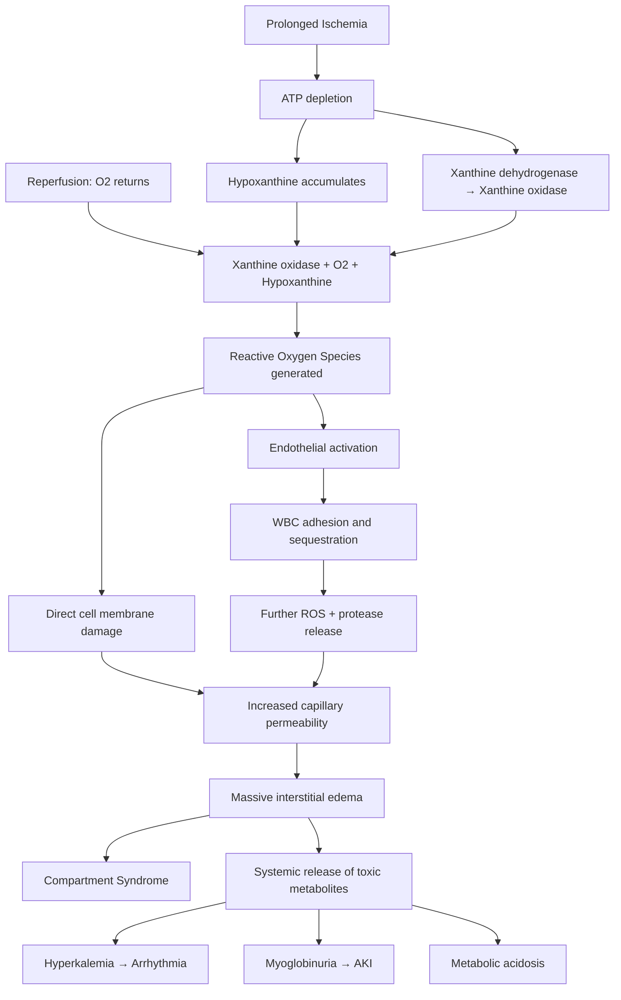

## Complications of Acute Limb Ischemia

Complications of ALI fall into two broad categories that logically follow the disease timeline: complications from the **ischemia itself** (before treatment), and complications from the **revascularization** (after treatment). This distinction is critical because, paradoxically, *restoring* blood flow can sometimes be more dangerous than the ischemia was. Additionally, complications of any surgical procedures (embolectomy, bypass, thrombolysis, amputation) must be considered.

***Complications*** of acute embolism [5]:
- ***Compartment syndrome***
- ***Electrolytes / renal failure***

Let's work through each systematically from first principles.

---

### 1. Complications Due to Ischemia (Pre-Revascularization)

These complications occur when the limb has been ischemic for a prolonged period, whether or not revascularization is attempted.

#### 1A. Irreversible Tissue Necrosis and Gangrene

- If ischemia persists beyond the 6-hour window without collateral compensation, skeletal muscle undergoes coagulative necrosis
- Nerves die first (sensory → motor), then muscle, then skin, then bone (tissue sensitivity: nerves > muscle > skin > bone [2])
- Untreated, this progresses to **gangrene** — dry gangrene if the tissue mummifies without infection; wet gangrene if secondary bacterial infection supervenes
- **Wet gangrene** is a surgical emergency requiring debridement or amputation because ascending infection → sepsis → multiorgan failure → death

#### 1B. Metabolic Derangements from Muscle Necrosis

Even before revascularization, necrotic muscle leaks its intracellular contents into the local interstitial fluid, which slowly seeps into the systemic circulation:

- **Potassium (K⁺)**: Intracellular K⁺ concentration is ~150 mmol/L vs. extracellular ~4 mmol/L. Massive cell death releases enormous K⁺ loads → ***hyperkalemia*** → cardiac arrhythmias (peaked T waves → widened QRS → sine wave → VF/asystole)
- **Myoglobin**: Released from necrotic myocytes → filtered by glomerulus → precipitates in acidic tubular fluid → tubular obstruction → ***acute kidney injury (AKI)*** by acute tubular necrosis (ATN) [2]
- **Hydrogen ions (H⁺)**: Lactic acid from anaerobic metabolism + cell lysis → ***metabolic acidosis***
- **Phosphate (PO₄³⁻)**: Released from broken-down ATP → hyperphosphatemia → binds calcium → hypocalcemia
- **Creatine kinase (CK)**: Marker of muscle injury; CK-MM isoform is skeletal-muscle specific

<Callout title="Why Delay in Amputation of Rutherford III is Lethal" type="error">
***Delays in amputation of non-viable extremities can result in infection, myoglobinuria, acute renal failure and hyperkalemia*** [2]. The dead limb acts as a reservoir of toxic metabolites — every hour it remains attached, more K⁺, myoglobin, and acid leak into the systemic circulation. Primary amputation removes the source.
</Callout>

---

### 2. Complications Due to Revascularization (Post-Treatment)

This is the **ischemia–reperfusion injury** paradigm — a concept that appears across many organ systems (cardiac STEMI, stroke, organ transplantation, ALI). The principle is always the same: restoring blood flow to ischemic tissue triggers a cascade of secondary injury that can be as harmful as the ischemia itself.

#### 2A. Reperfusion Injury — The Underlying Mechanism

**Why does restoring blood flow cause damage?**

During ischemia, cells switch to anaerobic metabolism, ATP is depleted, and a compound called **hypoxanthine** accumulates (a breakdown product of ATP degradation). Simultaneously, the enzyme **xanthine dehydrogenase** is converted to **xanthine oxidase** by calcium-activated proteases.

When oxygen-rich blood returns (reperfusion):
1. Xanthine oxidase uses the returning O₂ to convert hypoxanthine → xanthine → uric acid, generating **reactive oxygen species (ROS)** — superoxide (O₂⁻), hydrogen peroxide (H₂O₂), hydroxyl radical (OH•)
2. These ROS directly damage cell membranes, proteins, and DNA [2]
3. ROS also activate endothelial cells → expression of adhesion molecules (P-selectin, ICAM-1) → **white blood cell (WBC) accumulation and sequestration in the microcirculation** [2]
4. Activated WBCs release further ROS and proteases → additional tissue damage
5. **Increased vascular permeability** → fluid leaks from capillaries into the interstitium → massive edema

This results from ***formation of oxygen-free radicals that directly damage the tissue and cause WBC accumulation and sequestration in microcirculation*** [2]. It ***prolongs the ischemic interval since it impairs adequate nutrient flow to the tissue despite restoration of axial blood flow*** [2].

Think of it this way: ischemia primes a bomb (hypoxanthine + xanthine oxidase), and reperfusion lights the fuse (oxygen returns).

---

#### 2B. Compartment Syndrome (Post-Revascularization)

This is the single most important complication to understand and recognize.

***Compartment syndrome*** [5] — listed as a key complication in the lecture slides.

**Pathophysiology** [2][3]:
- ***Post-ischemic compartment syndrome occurs after revascularization procedures*** [2]
- ***Prolonged ischemia → cell lysis → fluid leak into interstitium*** [3]
- Muscle deprived of arterial blood flow becomes ischemic → formation of oxygen free radicals upon reperfusion → ***damage to capillary walls*** → ***increased vascular permeability*** → localized swelling and edema → ***increases the compartment pressure*** [2]
- The lower leg has four compartments enclosed by non-distensible fascia. Once swelling exceeds the capacity of the fascial envelope, pressure rises
- When ***intracompartmental pressure > 30 mmHg*** [3] (or within 30 mmHg of diastolic BP), capillary perfusion ceases → muscle and nerve ischemia **within the compartment** — a vicious cycle

***Compartment syndrome: mainly a clinical diagnosis*** [10]:

**Clinical Features** [3][10]:
- ***Severe pain disproportional to clinical picture, unrelieved by analgesia*** [10] — this is the **earliest** and **most sensitive** sign. The pain is out of proportion with what you'd expect from the underlying injury/surgery
- ***Pain on passive stretching of digits*** [10] — passively dorsiflexing or plantarflexing the toes stretches the muscles within the swollen compartment, eliciting severe pain. This is the most sensitive clinical test.
- ***Severe swelling, tense and shiny skin*** [10] — the compartment is visibly and palpably tense
- ***Sensory deficit, later paralysis*** [10] — nerves coursing through the compartment are compressed
- ***Pulses always palpable*** [10] — systolic arterial pressure far exceeds intracompartmental pressure, so main-vessel pulses are preserved. **Loss of pulses is an extremely late and unreliable sign** — by that point, the limb is lost
- **Numbness in the web space between first and second toes** is suggestive of compression of the **deep peroneal nerve** coursing through the anterior compartment [2]

**Which compartment is most commonly affected?** ***Anterior compartment*** is most commonly affected. However, ***involvement of the posterior compartment is the most functionally devastating*** [2] — the deep posterior compartment contains the tibial nerve and the flexor muscles essential for ambulation.

***Compartment Syndrome and Fasciotomy*** [5]: The four compartments:
- ***Anterior compartment*** (tibialis anterior, extensor digitorum longus, deep peroneal nerve)
- ***Peroneal (lateral) compartment*** (peroneus longus and brevis, superficial peroneal nerve)
- ***Posterior compartments*** — superficial (gastrocnemius, soleus) and deep (tibialis posterior, flexor hallucis longus, tibial nerve, posterior tibial artery)

**Management** [3][16]:
- **Remove constrictive dressings** (casts, bandages) [16]
- ***Urgent fasciotomy*** (***medial + lateral incisions***) [3] — two-incision technique decompresses all four compartments
- **Leave skin incisions open** for re-inspection after 48 hours ± removal of necrotic tissue [16]
- Delayed primary closure or skin grafting once swelling resolves

**Prevention**: ***Fasciotomy should be routinely considered in any patient with > 6 hours of acute limb ischemia*** or combined arterial and venous injuries [2]. This is **prophylactic fasciotomy** — done at the time of revascularization to pre-empt the reperfusion edema.

<Callout title="Exam Pearl — Pulses in Compartment Syndrome" type="error">
Students commonly think that absent pulses = compartment syndrome. This is wrong. ***Pulses are always palpable*** [10] in compartment syndrome. The key sign is **pain out of proportion**, especially **pain on passive stretch**. If you wait for pulses to disappear, the limb is already lost.
</Callout>

---

#### 2C. Rhabdomyolysis

***Rhabdomyolysis*** [2][3]: ***Release of K⁺, H⁺ and myoglobin from damaged muscle cells*** [3]

"Rhabdo-" (skeletal muscle) + "myo-" (muscle) + "lysis" (breakdown) — literally, the breakdown/dissolution of skeletal muscle.

**Pathophysiology**:
Reperfusion washes out all the intracellular contents from necrotic muscle cells into the systemic circulation simultaneously:

| Substance Released | Consequence | Mechanism |
|---|---|---|
| **Myoglobin** | ***AKI*** [2][3] | Myoglobin is freely filtered by the glomerulus → precipitates in the acidic environment of the renal tubules → forms myoglobin casts → **tubular obstruction** → acute tubular necrosis (ATN). Free iron from myoglobin also generates ROS → direct tubular epithelial damage |
| **Potassium (K⁺)** | ***Cardiac arrhythmia*** [2][3] | Massive K⁺ release → hyperkalemia → alters cardiac myocyte resting membrane potential → peaked T waves, widened QRS, sine wave pattern → VF → cardiac arrest |
| **Hydrogen ions (H⁺)** | Metabolic acidosis | Lactic acid + intracellular acid release → worsens myoglobin precipitation (acidic pH promotes cast formation) |
| **Phosphate** | Hyperphosphatemia → hypocalcemia | Chelates calcium |
| **CK** | Biomarker (not directly toxic) | CK > 5× upper limit of normal confirms rhabdomyolysis |

**Clinical Features** [3]:
- ***Arrhythmia*** — from hyperkalemia
- ***AKI*** — dark "tea-colored" or "cola-colored" urine (myoglobinuria); oliguria/anuria
- Muscle pain, weakness, swelling (though these may be masked by the ALI presentation)

**Management** [2][3]:
- ***Aggressive hydration*** — high-volume IV normal saline (target UO > 200–300 mL/hr) to dilute myoglobin in the tubules and maintain renal perfusion
- ***Diuresis with mannitol*** — osmotic diuretic that increases tubular flow rate, reducing myoglobin concentration and precipitation
- ***IV bicarbonate*** — alkalinizes the urine (target urine pH > 6.5), reducing myoglobin precipitation and cast formation in the tubules (myoglobin is less nephrotoxic in alkaline conditions)
- **Cardiac monitoring** — continuous ECG for arrhythmia detection
- **Treat hyperkalemia urgently** if present: IV calcium gluconate (membrane stabilizer), insulin + glucose (drives K⁺ intracellularly), nebulized salbutamol, sodium bicarbonate, kayexalate, dialysis if refractory

**Post-operative monitoring** [3]: ***Monitor BP/P, UO, APTT, RFT, cardiac monitor***

---

#### 2D. Stroke and Hemorrhage (Post-Thrombolysis)

***Stroke and hemorrhage***: Patients treated with endovascular procedures (thrombolysis) have a ***higher risk of stroke and major hemorrhage*** including GI bleeding and hematoma at vascular puncture site [2].

**Why?** Thrombolytic agents (tPA) activate plasmin systemically, not just locally at the catheter tip. Plasmin breaks down fibrin clot everywhere in the body — including hemostatic plugs at recent wound sites, in cerebral vessels, or in the GI tract. This is why thrombolysis has strict contraindications (recent surgery, CVA, active bleeding).

---

#### 2E. Metabolic Acidosis

- Reperfusion washes accumulated lactic acid and other organic acids from the ischemic limb into the systemic circulation
- Can cause profound systemic acidosis → myocardial depression, vasodilatation, hemodynamic collapse
- Monitor with serial ABG; treat with IV bicarbonate and supportive care

---

### 3. Complications of Surgical Procedures

#### 3A. Complications of Embolectomy/Bypass Surgery

| Complication | Mechanism | Notes |
|---|---|---|
| **Graft failure** | Early: graft kink; Intermediate: neointimal hyperplasia; Late: atherosclerosis [14] | Surveillance with serial Doppler USG; palpate for patency, auscultate for bruits |
| **Graft infection** | Especially prosthetic grafts (PTFE, Dacron) — synthetic material is a nidus for bacterial colonization | Autogenous vein grafts are more resistant to infection [14] |
| **Re-thrombosis / embolization** | Incomplete clot removal; residual stenosis; new embolism from cardiac source | Intra-operative angiography reduces this risk; long-term anticoagulation |
| **Arterial dissection** | Fogarty balloon or catheter damages intima | More likely in diseased vessels |
| **Aortoenteric fistula** | Erosion of prosthetic aortic graft into duodenum (usually D3/D4) | Rare but catastrophic; presents with GI bleeding months to years post-op [14] |
| **Ureter injury** | During aorto-iliac bypass dissection | Proximity of ureter to iliac vessels |
| **Autonomic nerve damage** | Injury to hypogastric plexus during aortic surgery | Sexual dysfunction [14] |
| **Embolic complications** | Distal showering of debris during surgery | Renal impairment, ischemic bowel, spinal cord ischemia [14] |

#### 3B. Complications of Thrombolysis

| Complication | Incidence | Notes |
|---|---|---|
| **Hemorrhagic stroke** | ~1–2% | Most feared complication; reason for strict contraindications |
| **Major hemorrhage** | ~5–10% | GI bleeding, retroperitoneal hemorrhage, puncture site bleeding |
| **Distal embolization** | Variable | Clot fragments break off during lysis and occlude smaller distal vessels |
| **Reperfusion injury** | Expected | Though more gradual than surgical embolectomy, still occurs |

#### 3C. Complications of Amputation [2][3]

| Timing | Complication | Mechanism / Management |
|---|---|---|
| **Early** | Bleeding / hematoma | Inadequate intra-operative hemostasis |
| | Wound infection / dehiscence | Compromised blood supply to stump; contamination from wet gangrene |
| | **Skin necrosis** | Poor perfusion of stump — may require revision to a higher level [3] |
| | ***Phantom limb pain*** | Brain somatosensory cortex retains representation of amputated limb; ectopic firing of severed nerve endings. ***Mx: reassurance, amitriptyline, gabapentin*** [3] |
| | DVT / PE | Immobility; hypercoagulable post-surgical state. Mx: prophylactic heparin [3] |
| **Late** | **Stump ulceration** | Pressure from prosthesis on inadequately vascularized stump |
| | **Stump neuroma** | Disordered regrowth of severed nerve endings forms a painful nodule |
| | **Osteomyelitis** | Infection extends to bone, especially if wound healing was compromised |
| | **Osteophyte formation** | Abnormal bone growth at the cut end of the stump |
| | **Fixed flexion deformity** | Muscle imbalance and contracture after unopposed flexor pull. For BKA: knee flexion contracture (contraindicates BKA if pre-existing) |

---

### 4. Systemic Complications (Related to Underlying Disease)

Remember: ALI patients are usually elderly with significant cardiovascular comorbidity. The physiological stress of ischemia, surgery, and reperfusion can trigger systemic events:

| Complication | Why It Happens |
|---|---|
| **Myocardial infarction** | Stress response (catecholamine surge), hypotension, metabolic acidosis, hyperkalemia — all stress the heart; many of these patients already have coronary artery disease |
| **Acute kidney injury** | Myoglobin nephrotoxicity + contrast nephropathy from CTA/DSA + hypotension + pre-existing CKD (diabetic patients) |
| **Sepsis / SIRS** | Necrotic tissue is an ideal culture medium for bacteria; reperfusion washout of endotoxins and cytokines triggers systemic inflammatory response |
| **Multi-organ failure** | Final common pathway when reperfusion injury, sepsis, and metabolic derangements overwhelm compensatory mechanisms |
| **Death** | 30-day mortality ~15–20%; mainly from cardiac events, sepsis, and reperfusion-related multi-organ failure |

---

### 5. Volkmann's Contracture — A Late Sequela

While classically associated with supracondylar fractures in children, Volkmann's contracture can follow any missed compartment syndrome. If compartment syndrome is not treated with fasciotomy in time, muscle undergoes ischemic necrosis → replaced by fibrous tissue → **contracture** of the affected muscles → fixed deformity. In the forearm: classic "claw hand" with flexed wrist and fingers. In the leg: fixed equinus (plantarflexed) foot with clawed toes.

This is the end-stage result of **untreated compartment syndrome** — entirely preventable with timely fasciotomy.

---

### Summary Table: Complications by Timing

| Phase | Complication | Key Features | Management |
|---|---|---|---|
| **During ischemia** | Tissue necrosis, gangrene | Progressive: pallor → mottling → fixed mottling → gangrene | Revascularization (if viable) or amputation (if non-viable) |
| | Metabolic derangements | Hyperkalemia, acidosis, myoglobinuria (even before reperfusion) | Monitor bloods; amputate if Rutherford III |
| **After reperfusion** | ***Compartment syndrome*** | Pain out of proportion, pain on passive stretch, tense swelling, pulses present | ***Urgent fasciotomy*** |
| | ***Rhabdomyolysis*** | Hyperkalemia → arrhythmia; myoglobinuria → AKI | Aggressive hydration, mannitol, IV bicarbonate, cardiac monitoring |
| | Reperfusion injury | ROS-mediated tissue damage, WBC sequestration | Supportive; prophylactic fasciotomy prevents worst sequelae |
| | ***Electrolyte / renal failure*** | Hyperkalemia, metabolic acidosis, AKI | Serial K⁺, RFT, UO monitoring; treat hyperkalemia urgently |
| **After thrombolysis** | Stroke, major hemorrhage | Systemic plasmin activation | ICU monitoring; transfusion; neurosurgical consult if stroke |
| **After surgery** | Graft failure / infection | Kink (early), neointimal hyperplasia (intermediate), atherosclerosis (late) | Surveillance Doppler USG; graft revision |
| **After amputation** | Phantom limb pain | Brain retains representation of absent limb | Amitriptyline, gabapentin, mirror therapy |
| | Stump complications | Ulceration, neuroma, osteomyelitis, flexion deformity | Prosthetic fitting, revision surgery |
| **Systemic** | MI, AKI, sepsis, MOF, death | Elderly patients with CVS comorbidity under physiological stress | ICU care, multidisciplinary support |

---

<Callout title="High Yield Summary">

**Complications are classified as ischemia-related vs revascularization-related (reperfusion).**

**The two key complications from the lecture slides**: ***Compartment syndrome*** and ***Electrolytes / renal failure*** [5].

**Compartment syndrome** (post-revascularization): Ischemia–reperfusion → ROS → capillary leak → interstitial edema → raised intracompartmental pressure > 30 mmHg. Signs: pain out of proportion and on passive stretch, tense swelling, sensory deficit, **pulses present**. Anterior compartment most commonly affected; posterior compartment most functionally devastating. Management: **urgent fasciotomy** (medial + lateral). Prophylactic fasciotomy if ischemia > 6 hours.

**Rhabdomyolysis**: Muscle necrosis releases K⁺ (arrhythmia), myoglobin (AKI by ATN), H⁺ (acidosis). Management: aggressive IV hydration, mannitol diuresis, IV bicarbonate to alkalinize urine, cardiac monitoring, treat hyperkalemia.

**Delays in amputating non-viable limbs → infection, myoglobinuria, AKI, hyperkalemia** → death. Rutherford III = amputate promptly.

**Post-thrombolysis**: Hemorrhagic stroke, major GI/puncture-site hemorrhage.

**Post-amputation**: Phantom limb pain (Mx: amitriptyline, gabapentin), stump necrosis, infection, neuroma, fixed flexion deformity.

</Callout>

---

<ActiveRecallQuiz
  title="Active Recall - Complications of Acute Limb Ischemia"
  items={[
    {
      question: "What are the two key complications of acute embolism mentioned in the lecture slides? Explain the pathophysiology of each.",
      markscheme: "(1) Compartment syndrome: ischemia-reperfusion injury generates ROS that damage capillary walls, increasing vascular permeability; fluid leaks into the interstitium within non-distensible fascial compartments, raising intracompartmental pressure above 30 mmHg, causing muscle and nerve ischemia. (2) Electrolytes / renal failure: muscle necrosis releases K+ (hyperkalemia causing arrhythmia), myoglobin (precipitates in acidic renal tubules causing AKI by ATN), and H+ (metabolic acidosis).",
    },
    {
      question: "A patient develops severe pain out of proportion 8 hours after successful embolectomy. The limb is tense and swollen. Pedal pulses are palpable. What is the diagnosis and what is the immediate management?",
      markscheme: "Compartment syndrome (post-revascularization). Immediate management: urgent fasciotomy with two incisions (medial and lateral) to decompress all four compartments of the lower leg. Leave wounds open for re-inspection at 48 hours. Pulses being present is expected in compartment syndrome (SBP far exceeds intracompartmental pressure).",
    },
    {
      question: "Explain the mechanism of reperfusion injury in ALI from first principles. Why does restoring blood flow cause further damage?",
      markscheme: "During ischemia, ATP breakdown generates hypoxanthine and xanthine dehydrogenase converts to xanthine oxidase. Upon reperfusion, returning O2 enables xanthine oxidase to convert hypoxanthine to uric acid, generating reactive oxygen species (superoxide, H2O2, hydroxyl radical). ROS directly damage cell membranes, activate endothelial cells causing WBC adhesion and sequestration in microcirculation, and increase vascular permeability causing massive edema. This prolongs ischemia despite axial blood flow restoration.",
    },
    {
      question: "A patient with Rutherford III ALI has been waiting 12 hours for amputation. What systemic complications may have already developed, and why is further delay dangerous?",
      markscheme: "Necrotic muscle continuously leaks K+ (hyperkalemia → fatal arrhythmia), myoglobin (myoglobinuria → AKI by tubular obstruction/ATN), H+ (metabolic acidosis → myocardial depression), and phosphate (hyperphosphatemia → hypocalcemia). Bacterial colonization of necrotic tissue → sepsis. Delay worsens all of these. Amputation removes the source of toxic metabolites.",
    },
    {
      question: "How does IV bicarbonate help in the management of rhabdomyolysis-associated AKI? What are two other treatments?",
      markscheme: "IV bicarbonate alkalinizes the urine (target pH > 6.5), which reduces myoglobin precipitation and cast formation in the renal tubules (myoglobin is more soluble and less nephrotoxic in alkaline conditions). Other treatments: (1) Aggressive IV hydration with normal saline to maintain high tubular flow rate and dilute myoglobin. (2) Mannitol as an osmotic diuretic to further increase tubular flow. Also: cardiac monitoring for hyperkalemia, treat K+ urgently if elevated.",
    },
    {
      question: "Which compartment of the lower leg is most commonly affected by compartment syndrome, and which is most functionally devastating? Explain why.",
      markscheme: "Anterior compartment is most commonly affected (contains tibialis anterior, extensors, deep peroneal nerve). Deep posterior compartment is most functionally devastating because it contains the tibial nerve and flexor muscles essential for ambulation (tibialis posterior, flexor hallucis longus, flexor digitorum longus). Damage here causes loss of plantarflexion and toe flexion, and tibial nerve damage causes plantar sensory loss.",
    },
  ]}
/>

---

## References

[2] Senior notes: felixlai.md (Acute arterial insufficiency — Complications due to ischemia, Complications due to revascularization sections)
[3] Senior notes: maxim.md (Acute limb ischaemia — Complications: compartment syndrome, rhabdomyolysis; Amputation complications)
[5] Lecture slides: WCS 002 - Toe gangrene and leg ulcer - by Prof SWK Cheng.pdf (p26, p27 — Treatment of Acute Embolism, Complications)
[10] Lecture slides: GC 231. High Energy Trauma Open Fracture_Part 3.pdf (p1, p4 — Compartment syndrome: clinical diagnosis, features)
[14] Senior notes: maxim.md (Bypass surgery — Complications of bypass surgery)
[16] Senior notes: maxim.md (Complications of trauma — Compartment syndrome management)
