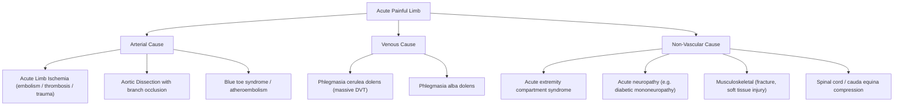

## Differential Diagnosis of Acute Limb Ischemia

When a patient presents with a sudden, painful, cold, pale limb, the instinctive diagnosis is acute limb ischemia (ALI). But several other conditions can mimic ALI by producing some combination of pain, pallor, pulselessness, or swelling in a limb. The key to working through the differential is to ask: **Is this truly an acute arterial occlusion, or is something else reducing perfusion or mimicking ischemia?**

Let's work through this systematically — first by understanding the two named differentials from the senior notes and lecture slides, then broadening out to the complete list.

---

### Overview: Differential Diagnosis Framework

The differential for an acutely painful, compromised limb can be organized by mechanism:

---

### 1. Acute Extremity Compartment Syndrome

***Acute extremity compartment syndrome*** is a named differential of ALI [2][3].

**Why does it mimic ALI?** Compartment syndrome causes **extrinsic compression of arteries** leading to ischemic symptoms [2]. The swollen, tense compartment physically squeezes both the vessels and nerves running within it, producing pain, pallor, paraesthesia, and even pulselessness — overlapping heavily with the 6 P's.

**How to differentiate from ALI:**

| Feature | Acute Limb Ischemia | Compartment Syndrome |
|---|---|---|
| **Cause** | Intrinsic arterial occlusion (embolus/thrombus) | Raised intracompartmental pressure compressing contents |
| **Pain** | Severe, distal, constant | ***Severe pain disproportional to clinical picture, unrelieved by analgesia*** [10] |
| **Passive stretch** | Not a specific feature | ***Pain on passive stretching of digits*** [10] — this is the most sensitive clinical sign |
| **Swelling** | Usually absent (unless reperfusion has occurred) | ***Severe swelling, tense and shiny skin*** [10] |
| **Pulses** | Absent distal to the occlusion | ***Pulses always palpable*** [10] — because the occlusion is at the microvascular/compartmental level, not the main artery |
| **Onset** | Sudden (embolism) or over hours (thrombosis) | ***Commonly post-traumatic*** [10], or post-reperfusion |
| **Neurological deficit** | Sensory loss → then motor loss (due to nerve ischemia from absent arterial flow) | ***Sensory deficit, later paralysis*** [10] (due to direct nerve compression and ischemia within the compartment) |

<Callout title="Critical Distinction" type="error">
The single most important distinguishing feature: **pulses**. In compartment syndrome, ***pulses are always palpable*** [10] because the systolic blood pressure far exceeds the intracompartmental pressure. By the time pulses are lost in compartment syndrome, the limb is almost certainly non-viable. In ALI, pulselessness is an early and defining feature.
</Callout>

**Why does compartment syndrome occur?** The lower leg has four fascial compartments (anterior, lateral/peroneal, superficial posterior, deep posterior), each enclosed by unyielding fascia. When there is swelling within a compartment (post-fracture bleeding, post-ischemia reperfusion edema), the pressure rises because the fascia cannot expand. When intracompartmental pressure exceeds capillary perfusion pressure (~30 mmHg), local microvascular flow ceases → muscle and nerve ischemia within that compartment → necrosis if untreated.

**Management**: ***Mainly a clinical diagnosis*** [10]. Confirmed by measuring intracompartmental pressure ( > 30 mmHg, or within 30 mmHg of diastolic pressure). Treatment is urgent **fasciotomy** (medial + lateral incisions in the leg to decompress all four compartments).

---

### 2. Phlegmasia Cerulea Dolens (Massive DVT)

***DVT with superficial vein thrombosis — known as phlegmasia cerulea dolens*** (literally "painful blue edema") [2][3].

**Why does it mimic ALI?** In this condition, ***venous pressure is increased to an extent that extremity perfusion is impaired*** [2]. Normally, arterial-to-capillary flow depends on a pressure gradient: arterial pressure > capillary pressure > venous pressure. If venous outflow is completely blocked (massive iliofemoral DVT), venous pressure rises enormously → capillary pressure rises → eventually, the venous back-pressure exceeds the arterial driving pressure → arterial inflow ceases → the limb becomes ischemic despite no primary arterial pathology.

**Clinical features**:
- **Massively swollen** limb (distinguishing feature — ALI limbs are NOT swollen; they are typically normal or slightly shrunken)
- **Cyanotic** (blue) rather than pale — because the limb is engorged with deoxygenated venous blood, not empty of blood
- **Severe pain**
- May progress to **venous gangrene** if untreated
- Pulses may be absent due to secondary arterial compromise from back-pressure

**How to differentiate from ALI:**

| Feature | Acute Limb Ischemia | Phlegmasia Cerulea Dolens |
|---|---|---|
| **Limb appearance** | Pale/white → mottled | **Blue/cyanotic**, massively swollen |
| **Swelling** | Absent or minimal | **Massive edema** (the limb is engorged) |
| **Mechanism** | Primary arterial occlusion | Primary venous occlusion → secondary arterial compromise |
| **Risk factors** | AF, atherosclerosis, trauma | DVT risk factors: malignancy, immobility, hypercoagulability, surgery |
| **Venous Doppler** | Audible (until Rutherford III) | **Absent** (the veins are thrombosed) |
| **Response to elevation** | **Worsens** ischemia (reduces arterial head) | May **improve** venous congestion |

**Related entity — Phlegmasia Alba Dolens** ("painful white leg"):
- An earlier stage of massive DVT where the limb is swollen and **pale** (white) rather than blue
- "Alba" = white; the pallor is caused by arterial spasm triggered by the massive venous occlusion
- Can progress to phlegmasia cerulea dolens if venous thrombosis extends

---

### 3. Aortic Dissection with Branch Vessel Occlusion

Aortic dissection can present primarily as ALI when the dissection flap extends to occlude iliac or femoral arteries [3]. This is not a "mimic" per se — it actually IS a cause of limb ischemia — but it must be considered in the differential because **management is radically different**.

**How to recognize:**
- Concurrent **chest, back, or abdominal pain** (tearing, radiating)
- **Pulse deficit**: asymmetric pulses (e.g., absent left femoral with present right femoral)
- **Blood pressure discrepancy** between arms
- Risk factors: hypertension, connective tissue disorders (Marfan, Ehlers-Danlos), bicuspid aortic valve

**Why it matters for ALI differential:** ***Must rule out aortic dissection before giving heparin*** [3] — anticoagulation in dissection worsens hemorrhage into the false lumen. Always get an **ECG and CXR** as initial screening. CT angiography is definitive.

---

### 4. Chronic Limb Ischemia (Acute-on-Chronic Exacerbation)

This is less of a "differential" and more of a spectrum. A patient with pre-existing chronic limb ischemia (Fontaine Stage II–III) may present with worsening symptoms that can be confused with true acute ALI:
- **Key differentiators**: gradual progression over > 2 weeks, pre-existing claudication history, trophic changes (hair loss, nail thickening, skin atrophy), well-developed collaterals on imaging
- However, if an atherosclerotic plaque acutely ruptures and thromboses, this becomes a genuine ALI event — "acute-on-chronic"

---

### 5. Neurogenic Claudication (Spinal Stenosis)

This is a differential for the **claudication** component of chronic limb ischemia, but may also confuse an acute presentation if the patient has acute worsening of spinal stenosis symptoms [3][11]:

| Feature | ***Vascular Claudication*** | ***Neurogenic Claudication*** |
|---|---|---|
| **Cause** | ***Chronic limb ischaemia*** | ***Spinal stenosis*** |
| **Radiation of pain** | ***From distal to proximal*** | ***From proximal to distal*** |
| **Exacerbating factor** | ***Walking uphill*** (increased muscle O₂ demand) | ***Walking downhill*** (lumbar extension narrows spinal canal) |
| **Relieving factor** | ***Rest "Shop window to shop window"*** | ***Bending over, sitting "Park bench to park bench"*** (flexion widens spinal canal) |
| **Pulse** | ***Absent*** | ***Present*** |
| **Associations** | ***Atherosclerotic risk factors, atrophic changes*** | ***Only 10% SLR +ve, back pain*** |

**Why the different pattern?** In neurogenic claudication, the problem is nerve root compression in the lumbar spinal canal. Lumbar extension (standing upright, walking downhill) narrows the spinal canal further, compressing nerve roots. Flexion (bending forward, sitting) opens the canal. That's why these patients lean on a shopping cart at the supermarket — it flexes the spine and relieves symptoms.

In vascular claudication, the problem is inadequate blood supply to exercising muscle. Walking uphill demands more muscle work → more O₂ demand → but stenosed arteries can't deliver → ischemic pain. Rest reduces O₂ demand → pain resolves within minutes.

---

### 6. Other Differentials to Consider

| Condition | Why It Mimics ALI | How to Differentiate |
|---|---|---|
| **Sciatica / Lumbar radiculopathy** [11] | Leg pain, numbness, weakness (can mimic paraesthesia and paralysis) | Pain radiates from back, follows dermatomal distribution (L5–S1), positive straight leg raise, pulses present |
| **Acute peripheral neuropathy** (e.g., diabetic mononeuropathy) | Sudden numbness, weakness in a limb | Neurological distribution, pulses present, no pallor/coolness |
| **Musculoskeletal injury** (fracture, muscle tear) | Acute limb pain, swelling, inability to move | History of trauma, point tenderness, abnormal X-ray, pulses present |
| **Baker's cyst (ruptured)** [11] | Acute calf pain and swelling mimicking DVT or ALI | Posterior knee mass, MRI confirms cyst, pulses present |
| **Chronic compartment syndrome** [11] | Exertional leg pain in athletes | Young, heavy-muscled, pain resolves with rest (unlike rest pain of ALI), pulses present, no atherosclerotic risk factors |
| **Arthritis of hip or foot** [11] | Limb pain with walking | Joint pain rather than muscle group pain, pulses present, X-ray shows joint changes |
| **Raynaud's phenomenon** | Digital pallor, cyanosis, pain | Episodic, triggered by cold/stress, symmetrical, affects fingers > toes, normal pulses between episodes |

---

### 7. Common Pitfalls in Differential Diagnosis

The lecture slides specifically highlight ***arterial diseases: common pitfalls*** [12]:

- ***Mis-diagnosis of claudication*** — confusing neurogenic claudication with vascular claudication
- ***Toe amputation before revascularization*** — performing local tissue surgery without addressing the underlying arterial insufficiency first
- ***Delay recognition of acute ischemia*** — every hour of delay reduces the chance of limb salvage; the 6-hour window is critical
- ***Beware of "leg pain"*** — not all leg pain is vascular; systematic assessment is needed
- ***"Treating the angiogram" – intervention for asymptomatic disease*** — finding an arterial stenosis on imaging does not mean it needs treatment unless it is causing symptoms

<Callout title="Exam Pitfall" type="error">
***Delay recognition of acute ischemia*** [12] is the most dangerous clinical pitfall. A patient with a cold, painful, pulseless limb needs emergency assessment NOW — not a routine outpatient referral. The 6-hour window to irreversible damage means this is as time-critical as an acute STEMI ("time is muscle" applies to both the heart and the limb).
</Callout>

---

### Summary Differential Diagnosis Table

| Differential | Key Distinguishing Feature(s) from ALI |
|---|---|
| **Compartment syndrome** | Pulses **present**; tense swelling; pain on passive stretch; post-trauma/post-reperfusion |
| **Phlegmasia cerulea dolens** | **Massive swelling** + **cyanosis** (blue, not pale); venous > arterial |
| **Aortic dissection** | Chest/back pain; BP discrepancy; pulse deficit; widened mediastinum on CXR |
| **Neurogenic claudication** | Pulses present; pain proximal→distal; relieved by flexion; back pain |
| **Sciatica** | Dermatomal distribution; SLR positive; pulses present |
| **Acute neuropathy** | Neurological distribution; no color/temperature change; pulses present |
| **Ruptured Baker's cyst** | Posterior knee mass; calf swelling; pulses present |
| **Raynaud's** | Episodic; cold-triggered; symmetrical digital involvement; self-resolving |

> **The unifying theme**: In ALI, pulses are **absent** and the limb is **pale/white**. In almost every mimic, pulses are **present** (the arterial supply is intact) and the mechanism is something else entirely — nerve compression, venous congestion, or compartmental pressure. Always check the pulses and use a handheld Doppler.

---

<Callout title="High Yield Summary">

**Named differentials of ALI** (from senior notes and slides):
1. **Acute extremity compartment syndrome** — extrinsic arterial compression; pulses present; tense swelling; pain on passive stretch; mainly clinical diagnosis
2. **Phlegmasia cerulea dolens** — massive DVT causing secondary arterial compromise; blue swollen limb (not pale); venous Doppler absent
3. **Aortic dissection** — must rule out before anticoagulation; chest/back pain; pulse deficit

**Other differentials**: Neurogenic claudication (spinal stenosis), sciatica, Baker's cyst, musculoskeletal injury, Raynaud's phenomenon.

**Key bedside differentiator**: Are the pulses present? → If yes, it's likely NOT primary ALI.

**Common pitfalls** (from lecture slides): Mis-diagnosis of claudication, delay recognition of acute ischemia, toe amputation before revascularization, beware of "leg pain", treating the angiogram.

</Callout>

---

<ActiveRecallQuiz
  title="Active Recall - Differential Diagnosis of Acute Limb Ischemia"
  items={[
    {
      question: "Name the two main differentials of acute limb ischemia listed in the senior notes. For each, explain the mechanism by which it mimics ALI.",
      markscheme: "(1) Acute extremity compartment syndrome: raised intracompartmental pressure causes extrinsic compression of arteries leading to ischemic symptoms. (2) Phlegmasia cerulea dolens (massive DVT): venous pressure increases to the extent that arterial inflow is impaired, causing secondary limb ischemia despite no primary arterial occlusion.",
    },
    {
      question: "How can you distinguish compartment syndrome from true acute limb ischemia at the bedside? Give three key differences.",
      markscheme: "(1) Pulses are always palpable in compartment syndrome vs absent in ALI. (2) Tense swelling and shiny skin in compartment syndrome vs absent/minimal swelling in ALI. (3) Pain on passive stretching of digits is the hallmark of compartment syndrome, not a feature of ALI.",
    },
    {
      question: "A 70-year-old presents with bilateral calf pain on walking 100 metres that radiates from buttock downward and is relieved by sitting on a bench. Pulses are present. What is the most likely diagnosis and how does it differ from vascular claudication?",
      markscheme: "Neurogenic claudication due to spinal stenosis. Differences: pain radiates proximal to distal (vs distal to proximal in vascular); relieved by flexion/sitting (vs simple rest); exacerbated by walking downhill (vs uphill); pulses present (vs absent); associated with back pain not atherosclerotic risk factors.",
    },
    {
      question: "List four common pitfalls in arterial disease management as highlighted in the lecture slides.",
      markscheme: "(1) Mis-diagnosis of claudication. (2) Toe amputation before revascularization. (3) Delay recognition of acute ischemia. (4) Beware of leg pain. (5) Treating the angiogram - intervention for asymptomatic disease. (Any 4 of 5.)",
    },
    {
      question: "Why is a massively swollen and blue limb more likely phlegmasia cerulea dolens than ALI? Explain the pathophysiology.",
      markscheme: "In ALI, the arterial supply is cut off so the limb empties of blood - it becomes pale/white and is NOT swollen. In phlegmasia cerulea dolens, massive iliofemoral DVT blocks venous outflow, venous back-pressure rises and engorges the limb with deoxygenated blood, causing massive swelling and blue/cyanotic discoloration. The venous congestion eventually exceeds arterial driving pressure, causing secondary arterial compromise.",
    },
  ]}
/>

---

## References

[2] Senior notes: felixlai.md (Acute arterial insufficiency — Differential diagnosis, Clinical manifestation sections)
[3] Senior notes: maxim.md (Acute limb ischaemia — DDx, Etiology, Management sections)
[10] Lecture slides: GC 231. High Energy Trauma Open Fracture_Part 3.pdf (p4 — Compartment syndrome)
[11] Senior notes: felixlai.md (Chronic arterial insufficiency — Differential diagnosis of intermittent claudication)
[12] Lecture slides: WCS 002 - Toe gangrene and leg ulcer - by Prof SWK Cheng.pdf (p28 — Common Pitfalls)
