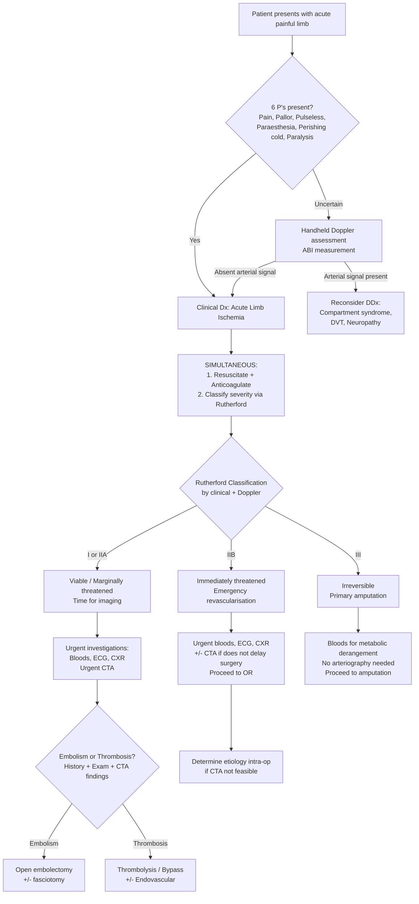

## Diagnostic Criteria, Algorithm & Investigation Modalities

### 1. Diagnostic Criteria — ALI is a Clinical Diagnosis

This is a crucial point to understand from first principles: ***Diagnosis is clinical*** [5]. Unlike many conditions where you need a blood test or imaging study to confirm the diagnosis, ALI is diagnosed **at the bedside** by recognizing the 6 P's and assessing the Doppler signals. You don't wait for a CT scan before starting treatment — the 6-hour window to irreversible damage means every minute counts.

That said, you need a systematic framework to:
1. **Confirm the diagnosis** (Is this really arterial ischemia?)
2. **Classify severity** (Rutherford — determines management)
3. **Determine the etiology** (Embolism vs thrombosis — determines surgical approach)
4. **Localize the occlusion** (Where exactly? — determines operative plan)
5. **Assess the patient** (Fitness for surgery, comorbidities, embolic source)

The lecture slides frame the clinical evaluation as five sequential questions [13]:

> ***Clinical Evaluation*** [13]:
> - ***Does the patient have arterial disease?***
> - ***Acute or chronic?***
> - ***How severe?***
> - ***Where is the obstruction?***
> - ***Why?***

Let's now build the diagnostic algorithm around these five questions.

---

### 2. Diagnostic Algorithm

<Callout title="Key Principle">
The algorithm is driven by **clinical severity first, imaging second**. You classify Rutherford at the bedside using the 6 P's and handheld Doppler — this determines the urgency. Imaging (CTA) is obtained only when the limb is viable enough to afford the time.
</Callout>

---

### 3. Step-by-Step Diagnostic Approach

#### Step 1: Confirm the Diagnosis (Bedside)

**History + Physical Examination** — as detailed in the clinical features section. The key bedside maneuvers:

- **Palpation of peripheral pulses** [2]:
  - ***Upper extremities***: Carotid / Subclavian / Axillary / Brachial / Radial / Ulnar
  - ***Lower extremities***: Femoral / Popliteal / Posterior tibial / Dorsalis pedis
  - Compare **both sides** — asymmetry is the most important finding
  - The level where pulses disappear tells you where the occlusion is (the occlusion is **one joint above** the line of demarcation between normal and ischemic tissue [2])

- **Temperature, color, capillary refill** [2]:
  - Cool / Pale / Delayed capillary refill
  - Look for **mottling** and determine whether it is blanchable (potentially reversible) or fixed (irreversible)

- **Handheld Doppler assessment** [3]:
  - This is the single most important bedside tool
  - Check for **arterial** and **venous** Doppler signals at the ankle (posterior tibial and dorsalis pedis)
  - The combination of arterial and venous Doppler signals maps directly onto the Rutherford classification

- **Neurological examination** [2]:
  - Signs of early nerve dysfunction: numbness or paraesthesia
  - Signs of advanced nerve dysfunction: motor loss (paralysis)

- **Buerger test** [2]:
  - Elevate the foot with patient lying supine until veins drain completely, then place foot in dependent position
  - **Normal**: Remains pink on elevation
  - **Ischemia**: Pallor on elevation → Dusky flush (rubor) spreading proximally from toes when dependent (reactive hyperemia — the ischemic capillary bed vasodilates maximally and floods with blood when gravity assists inflow)

#### Step 2: Classify Severity — Rutherford Classification

This is done **clinically + with handheld Doppler**, not with imaging. Refer to the Rutherford table from the previous section [2][3]:

| Category | Sensory Loss | Motor Deficit | Arterial Doppler | Venous Doppler | Action |
|---|---|---|---|---|---|
| **I** (Viable) | None | None | Audible | Audible | ***CTA*** → plan revascularization |
| **IIA** (Marginally threatened) | Minimal (toes) | None | Inaudible | Audible | ***CTA*** → revascularization |
| **IIB** (Immediately threatened) | Beyond toes | Mild/moderate | Inaudible | Audible | ***CTA*** if time permits → **emergency** revascularization |
| **III** (Irreversible) | Profound | Paralysis | Inaudible | Inaudible | ***Not required*** → primary **amputation** |

**Why is Doppler so useful here?** The handheld continuous-wave Doppler detects blood flow velocity by the frequency shift of ultrasound waves reflected off moving red blood cells (the Doppler effect — named after Christian Doppler). Even when a pulse is not palpable by hand, the Doppler can detect low-velocity flow. If the arterial signal is **audible**, there is still some flow reaching the limb (viable). If **inaudible**, the limb is at risk. If even the **venous** signal is inaudible, there is no flow whatsoever — the limb is dead.

<Callout title="Muscle Viability Assessment — Intra-operative" type="idea">
When there is doubt about viability (borderline Rutherford IIB/III), the surgeon can **directly assess muscle viability** at the time of surgery [2]: Viable muscle appears **shiny** and **twitches in response to flicking**. Non-viable muscle appears **dull** and **does not respond to flicking**. This is a critical intra-operative decision point.
</Callout>

#### Step 3: Determine the Etiology — Embolism vs Thrombosis

This is determined by **history, physical examination, and imaging** [2]:

| Feature | Embolic | Thrombotic |
|---|---|---|
| **Identifiable source** | AF / AMI | Less common |
| **History** | Absence of claudication | Presence of claudication |
| **Physical examination** | Presence of contralateral pulse | Absence of contralateral pulse |
| **Imaging (Angiography)** | Minimal atherosclerosis, regular sharp cut-off, few collaterals | Diffuse atherosclerosis, irregular cut-off, well-developed collaterals |

**Why does the angiographic appearance differ?**
- **Embolic cut-off** is "regular" and "sharp" because the embolus lodges in a previously normal artery — the vessel wall is smooth upstream, and there is an abrupt meniscus where the embolus sits. Few collaterals are seen because the artery was never stenosed before, so the body never had stimulus to develop them.
- **Thrombotic cut-off** is "irregular" because the underlying artery is diseased with diffuse atherosclerotic plaque, creating an irregular luminal surface. Collaterals are well-developed because the chronic stenosis progressively stimulated angiogenesis over months to years.

---

### 4. Investigation Modalities

Investigations are divided into **urgent bedside/laboratory tests** and **imaging studies**.

#### 4A. Urgent Bedside Investigations

##### Ankle-Brachial Index (ABI)

***The Non-invasive Vascular Laboratory*** [13]:
- ***Ultrasound based***
- ***Segmental pressure***
- ***Waveform analysis***
- ***Ankle-brachial index (ABI)***
- ***Exercise test***

**How to measure** [2]:
- **ABI** = Resting systolic ankle BP (higher of posterior tibial or dorsalis pedis) ÷ Systolic brachial BP (higher of left or right arm)
- **Ankle pressure**: BP cuff around the calf, Doppler probe at dorsalis pedis or posterior tibial artery. Inflate cuff until signal obliterated, slowly deflate until signal returns — that is the systolic ankle pressure.
- **Brachial pressure**: BP cuff around the arm, Doppler probe at brachial artery, same inflation-deflation technique.

**Interpretation** [2][14]:

| ABI | Interpretation | Pathophysiology |
|---|---|---|
| **> 1.3** | ***Calcified (non-compressible) artery*** | Mönckeberg medial calcification (common in DM patients) → the artery cannot be compressed by the cuff, giving a falsely elevated reading. Use **toe-brachial pressure index (TBPI)** instead (digital arteries are spared from calcification) |
| **0.9–1.3** | ***Normal*** | Ankle pressure should be approximately equal to or slightly higher than brachial (due to pulse wave amplification distally) |
| **0.4–0.9** | ***Claudication*** | Arterial obstruction reduces distal pressure; sufficient for rest but insufficient during exercise |
| **< 0.4** | ***Critical limb ischemia*** | Severe obstruction → rest pain, non-healing ulceration, gangrene |

**Why is ABI useful in ALI?** It provides an objective, quantitative measure of severity. A critically low ABI ( < 0.4) or unmeasurable ABI (no Doppler signal) confirms severe ischemia. However, in the acute setting with a clearly ischemic limb, don't waste precious time calculating a formal ABI — the Doppler assessment alone (audible vs inaudible) is sufficient for Rutherford classification.

<Callout title="Exam Pitfall — ABI > 1.3" type="error">
An ABI > 1.3 does NOT mean the patient has super-normal blood flow. It means the artery is **calcified and incompressible** — commonly in diabetic patients. The ABI is falsely elevated and **unreliable**. You must use alternative methods: **toe-brachial pressure index (TBPI)**, **transcutaneous oxygen measurement (TcO₂)**, or **arterial Doppler USG** [14].
</Callout>

##### Exercise Treadmill Test (for chronic / equivocal cases)
- Indicated when a patient has a classical history of intermittent claudication but **normal ABI at rest** [2]
- Measure ABI before and after exercise on a treadmill
- A **decrease of ≥ 0.2** in ABI post-exercise indicates hemodynamically significant claudication [2]
- **Why?** At rest, collateral flow may be sufficient to maintain near-normal ankle pressure. Exercise increases muscle oxygen demand → vasodilation in the muscle bed → "steals" blood through the collaterals → pressure drops distal to the stenosis.
- Not typically used in the acute setting (patients can't walk on a treadmill with ALI), but important to know for context.

---

#### 4B. Urgent Blood Investigations

***Urgent investigations*** [3]: ***CBC D/C, clotting, LRFT, T&S, CK (muscle injury)***

| Test | Rationale | Key Findings |
|---|---|---|
| **CBC with differentials** [2] | Baseline; assess for polycythemia (increases viscosity → thrombosis), thrombocytopenia (HIT), leukocytosis (infection/gangrene) | Elevated WCC may suggest infected gangrene or sepsis |
| **Clotting profile (PT/APTT)** [2] | Baseline before anticoagulation; assess for coagulopathy | Prolonged APTT may suggest lupus anticoagulant; needed for heparin monitoring (target APTT 60–80s) |
| **Renal function tests (RFT)** [2] | Baseline renal function; anticipate contrast nephropathy from CTA; anticipate myoglobin-induced AKI | Elevated creatinine/urea may indicate pre-existing CKD or early rhabdomyolysis-induced AKI |
| **Liver function tests (LFT)** | General assessment; hepatic synthetic function affects coagulation | — |
| **Group & Save / Type & Screen (T&S)** [3] | Anticipate need for blood products if surgical intervention required | — |
| ***Serum CK level*** [2][3] | ***Evaluation of rhabdomyolysis*** — CK is released from necrotic skeletal muscle (CK-MM isoform) | Markedly elevated CK ( > 5× normal) indicates significant muscle necrosis. Serial monitoring post-revascularization is essential |
| ***Arterial blood gas (ABG)*** [2] | ***Look for lactic acidosis*** — lactate rises as ischemic muscle switches to anaerobic metabolism | Metabolic acidosis (low pH, low HCO₃⁻, high lactate). Severe lactate elevation ( > 4 mmol/L) suggests extensive muscle ischemia and predicts higher complication rates |
| ***Cardiac enzymes (Troponin)*** [2] | ***Indicated if suspecting an AMI with left ventricular mural thrombus*** — AMI is both a cause of embolism and a comorbidity that affects surgical risk | Elevated troponin may indicate concurrent MI or demand ischemia |
| **Electrolytes (K⁺, Ca²⁺, PO₄³⁻)** | Hyperkalemia from muscle necrosis can cause fatal arrhythmias; needed before and after revascularization | K⁺ > 5.5 mmol/L is dangerous; > 6.5 mmol/L is life-threatening. May rise dramatically post-reperfusion |

---

#### 4C. Cardiac Investigations — Finding the Embolic Source

***ECG and CXR: rule out aortic dissection (especially if chest pain)*** [3]

| Investigation | What You're Looking For | Why |
|---|---|---|
| ***ECG*** [2][3] | AF (irregularly irregular rhythm, absent P waves); acute MI (ST changes); LVH | AF is the most common embolic source. New MI → mural thrombus. ***Must rule out aortic dissection before giving heparin*** [3] |
| ***CXR*** [2][3] | Widened mediastinum (aortic dissection); cardiomegaly (heart failure → mural thrombus); pulmonary edema | Widened mediastinum is the classic CXR sign of aortic dissection — though sensitivity is only ~60%, it is a rapid screening tool |
| **Transthoracic echocardiogram (TTE)** [2] | LV mural thrombus, valvular vegetations, atrial myxoma, LV wall motion abnormalities, patent foramen ovale | Non-invasive assessment of cardiac embolic sources. Should be performed once the limb emergency is addressed |
| **Transoesophageal echocardiogram (TOE)** [2] | Left atrial appendage thrombus (not well seen on TTE), aortic atheroma, prosthetic valve thrombus | More sensitive than TTE for left atrial thrombus and aortic arch atheroma. Semi-invasive (requires sedation) |

> ***Locate source of emboli*** [5] — this is an essential part of the post-revascularization workup. Finding and treating the embolic source prevents recurrence.

---

#### 4D. Imaging Studies — Localizing the Occlusion

The imaging modalities proceed from non-invasive to invasive:

##### ***Duplex Ultrasound*** [2][13]

- ***Duplex USG = 2D (B-mode) USG + Doppler technique*** [14]
- **What it does**: Locates the level of obstruction and classifies severity based on Doppler waveform analysis
- **Normal arterial flow waveform**: Should be ***triphasic*** [2][14]:
  1. **First forward-flow peak** (systolic) — high velocity forward flow
  2. **Brief reverse-flow component** (early diastole) — elastic recoil of arterial wall
  3. **Second forward-flow peak** (late diastole) — small forward flow from vessel compliance
- **Abnormal waveforms**: ***Monophasic or biphasic waveforms are abnormal*** [2] — loss of the reverse-flow component indicates increased downstream resistance or proximal stenosis → continuous forward flow
- **Advantages**: Non-invasive, no radiation, no contrast, portable, can be done at bedside
- **Limitations**: Operator-dependent, poor image quality for aorto-iliac segment (deep, bowel gas interference), cannot map entire arterial tree as comprehensively as CTA

##### ***Computed Tomographic Angiography (CTA)*** [2][3]

***Urgent CT angiogram*** to confirm level of occlusion and determine any run-off [3]:
- ***2–3 patent lower leg arteries to the foot*** / ***1 patent artery with intact anterior or posterior foot arch*** [3]

This is the **workhorse imaging modality** for ALI:
- **What it does**: Diagnoses the location and severity of arterial stenosis or occlusion with excellent anatomical detail
- **Technique**: IV contrast injection with rapid helical CT acquisition timed to the arterial phase → 3D reconstruction of entire arterial tree from aorta to foot
- **Key findings to look for**:
  - **Site of occlusion**: Exact level (aorto-iliac, femoro-popliteal, tibial)
  - **Cut-off morphology**: Sharp "meniscus" (embolism) vs irregular taper (thrombosis)
  - **Collateral vessels**: Sparse (embolism) vs well-developed (thrombosis)
  - **Run-off vessels**: How many tibial vessels are patent below the occlusion? This determines whether bypass/endovascular intervention is feasible
  - **Bilateral disease**: Extent of atherosclerosis in the contralateral limb
  - **Aortic pathology**: AAA, dissection, saddle embolus
- **Advantages**: Fast (< 5 minutes scan time), widely available, excellent spatial resolution, non-invasive
- **Disadvantages**: Radiation exposure, IV contrast (risk of contrast nephropathy — always check RFT beforehand; risk of contrast allergy)
- **No significant difference in accuracy between CTA and MRA** [2]

<Callout title="CTA: The Key Imaging in ALI">
CTA is indicated for Rutherford I, IIA, and IIB (if time allows). It maps the occlusion, assesses run-off, and helps plan the revascularization strategy. For Rutherford III, ***imaging is not required*** [3] — the limb is dead and the patient proceeds to amputation. ***Arteriography is NOT necessary for amputation*** since the level of amputation is determined by clinical findings and tissue viability at surgery [2].
</Callout>

##### Magnetic Resonance Angiography (MRA) [2]
- **Advantages**: Avoids ionizing radiation; minimal risk of contrast nephropathy (gadolinium-based contrast, though caution in severe CKD — risk of nephrogenic systemic fibrosis)
- **Disadvantages**: Longer acquisition time (not ideal in emergencies), less widely available, contraindicated with certain metallic implants/pacemakers
- **Role in ALI**: Rarely used acutely — CTA is faster and more practical. MRA is more useful for elective planning in chronic disease.

##### ***Catheter-Based Digital Subtraction Arteriography (DSA)*** [2][13][14]

***Arteriography*** [13]: ***Indicated ONLY when surgery is planned. NOT used for diagnosis*** [13].

- **What it does**: A catheter is inserted into the arterial tree (usually via femoral or brachial artery puncture), radio-opaque contrast is injected, and fluoroscopic images are acquired. Digital subtraction removes overlying bone to better visualize the arteries.
- ***Gold standard for evaluation of arterial tree*** before planning revascularization [2][14]
- **Key advantages**:
  - Highest spatial resolution of all imaging modalities
  - ***Can be done intra-operatively*** to guide endovascular intervention [14]
  - Allows **simultaneous therapeutic intervention** — angioplasty, stenting, or catheter-directed thrombolysis can be performed in the same session
- **Disadvantages**: Invasive technique associated with [2]:
  - Risk of contrast or drug allergy
  - Risk of bleeding from arterial puncture
  - Worsening of ischemia due to arterial dissection or damage
  - Hematoma formation
  - Local infection
  - Contrast nephropathy
- **When used in ALI**: When the CTA suggests a thrombotic cause amenable to endovascular therapy, DSA is performed as the first step of the therapeutic procedure (diagnostic + therapeutic in one sitting). Also used intra-operatively after embolectomy to confirm completeness of clot removal.

##### Summary Table: Imaging Modalities

| Modality | Invasive? | Radiation | Contrast | Best Use in ALI | Key Findings |
|---|---|---|---|---|---|
| **Handheld Doppler** | No | No | No | Immediate bedside Rutherford classification | Audible vs inaudible arterial/venous signals |
| ***Duplex USG*** | No | No | No | Locate occlusion level; waveform analysis (triphasic = normal) | Monophasic/biphasic = abnormal; absent flow at occlusion |
| **ABI** | No | No | No | Quantify severity | > 0.9 normal; 0.4–0.9 claudication; < 0.4 critical |
| ***CTA*** | Minimal | Yes | IV iodinated | **Primary imaging** — map occlusion, run-off, plan revascularization | Sharp cut-off (embolus) vs irregular taper (thrombosis); collateral pattern |
| **MRA** | No | No | IV gadolinium | Alternative when CTA contraindicated | Similar to CTA but longer acquisition |
| ***DSA*** | Yes | Yes | IA iodinated | ***Only when intervention is planned*** [13]; gold standard for surgical planning; intra-operative use | Highest resolution; allows simultaneous therapy |

---

### 5. Adjunct Investigations (Post-Stabilization)

Once the limb emergency has been addressed, these investigations help identify the underlying cause and prevent recurrence:

| Investigation | Purpose |
|---|---|
| **Echocardiogram (TTE/TOE)** [2] | Identify cardiac embolic source (mural thrombus, valvular disease, myxoma, PFO) |
| **24-hour Holter monitor** | Detect paroxysmal AF not captured on resting ECG |
| **Thrombophilia screen** | Protein C, Protein S, Antithrombin III, Factor V Leiden, antiphospholipid antibodies — especially in young patients without obvious cause |
| **Malignancy workup** | CT thorax/abdomen/pelvis, tumour markers — hypercoagulable state from occult malignancy (especially adenocarcinoma) |
| **HbA1c, fasting lipids** | Assess and optimize atherosclerotic risk factors |

---

### 6. Putting It All Together: The "Five Questions" Framework

Mapping the investigations back to the ***clinical evaluation*** framework from the lecture [13]:

| Question | How Answered | Investigation |
|---|---|---|
| ***Does the patient have arterial disease?*** | 6 P's, absent pulses, Doppler signals | Bedside clinical exam, handheld Doppler, ABI |
| ***Acute or chronic?*** | Onset < 2 weeks; absence vs presence of trophic changes, collaterals | History, physical exam (trophic changes), CTA |
| ***How severe?*** | Rutherford classification (I / IIA / IIB / III) | Clinical exam + Doppler; ABI; CK, lactate |
| ***Where is the obstruction?*** | Level of pulse loss, temperature demarcation | Duplex USG, ***CTA***, DSA |
| ***Why?*** | Embolism vs thrombosis; cardiac source; risk factors | ECG, Echo, history, CTA morphology, bloods |

---

<Callout title="High Yield Summary">

**ALI is a clinical diagnosis** — confirmed by 6 P's + handheld Doppler. Do not wait for imaging before starting anticoagulation.

**Rutherford classification** is done at the bedside using clinical findings + Doppler. It drives the management decision (conservative vs emergency revascularization vs amputation).

**Urgent bloods**: CBC D/C, clotting, LRFT, T&S, CK (rhabdomyolysis), ABG (lactic acidosis), troponin (AMI as embolic source), electrolytes (hyperkalemia).

**ECG + CXR**: Rule out AF, MI, and aortic dissection. Must rule out dissection before giving heparin.

**ABI**: Normal 0.9–1.3; Claudication 0.4–0.9; Critical < 0.4; > 1.3 = calcified (unreliable, use TBPI).

**CTA**: Primary imaging — localize occlusion, assess run-off, differentiate embolism (sharp cut-off, no collaterals) from thrombosis (irregular, collaterals). Not needed in Rutherford III.

**DSA**: Gold standard but invasive — indicated ONLY when intervention is planned, NOT for diagnosis. Can be done intra-operatively.

**Duplex USG**: Normal waveform = triphasic. Abnormal = monophasic/biphasic. Locates obstruction level.

**Arteriography NOT needed for amputation** — level determined by clinical findings and tissue viability.

</Callout>

---

<ActiveRecallQuiz
  title="Active Recall - Diagnosis & Investigations of ALI"
  items={[
    {
      question: "List the five sequential clinical evaluation questions from the lecture slides for assessing a patient with suspected peripheral arterial disease.",
      markscheme: "(1) Does the patient have arterial disease? (2) Acute or chronic? (3) How severe? (4) Where is the obstruction? (5) Why?",
    },
    {
      question: "A patient with ALI has an ABI of 1.5. What does this mean and what should you do next?",
      markscheme: "ABI > 1.3 indicates calcified non-compressible arteries (common in diabetic patients). The ABI is falsely elevated and unreliable. Perform toe-brachial pressure index (TBPI) instead, as small digital arteries are spared from calcification. Can also use arterial Doppler USG or TcO2.",
    },
    {
      question: "On CTA, how do you differentiate an embolic from a thrombotic occlusion? Give three angiographic features for each.",
      markscheme: "Embolism: (1) Minimal atherosclerosis, (2) Regular sharp cut-off (meniscus sign), (3) Few or no collaterals. Thrombosis: (1) Diffuse atherosclerosis, (2) Irregular cut-off / taper, (3) Well-developed collaterals.",
    },
    {
      question: "What does a normal arterial Doppler waveform look like and what does it mean when the waveform becomes monophasic?",
      markscheme: "Normal waveform is triphasic: (1) systolic forward flow peak, (2) early diastolic reverse flow, (3) late diastolic forward flow. Monophasic waveform (loss of reverse component, continuous forward flow) indicates significant proximal stenosis or increased downstream resistance. Biphasic is also abnormal.",
    },
    {
      question: "In which Rutherford category is imaging NOT required, and why? What investigation IS critical in this category?",
      markscheme: "Rutherford III (irreversible). Imaging is not needed because the limb is non-viable and management is primary amputation. Arteriography is not necessary as the level of amputation is determined by clinical findings and tissue viability at surgery. Critical investigations are bloods for metabolic derangements: electrolytes (hyperkalemia), CK (rhabdomyolysis), RFT (AKI), ABG (acidosis).",
    },
    {
      question: "When is DSA (digital subtraction arteriography) indicated in ALI? Give two advantages and two risks.",
      markscheme: "Indicated ONLY when surgical/endovascular intervention is planned, NOT for diagnosis. Advantages: (1) Highest spatial resolution (gold standard), (2) Allows simultaneous therapeutic intervention (angioplasty, stenting, thrombolysis) and can be done intra-operatively. Risks: (1) Contrast nephropathy/allergy, (2) Arterial injury (dissection, embolism, pseudoaneurysm, bleeding/hematoma).",
    },
  ]}
/>

---

## References

[2] Senior notes: felixlai.md (Acute arterial insufficiency — Diagnosis, Physical examination, Biochemical tests, Radiological tests sections)
[3] Senior notes: maxim.md (Acute limb ischaemia — Urgent investigations, Rutherford classification, Management sections)
[5] Lecture slides: WCS 002 - Toe gangrene and leg ulcer - by Prof SWK Cheng.pdf (p24, p26 — Symptoms, Treatment of Acute Embolism)
[13] Lecture slides: WCS 002 - Toe gangrene and leg ulcer - by Prof SWK Cheng.pdf (p7, p10 — Clinical Evaluation, Non-invasive Vascular Laboratory, Arteriography)
[14] Senior notes: maxim.md (Investigations for PVD — ABPI, Duplex USG, DSA sections)
