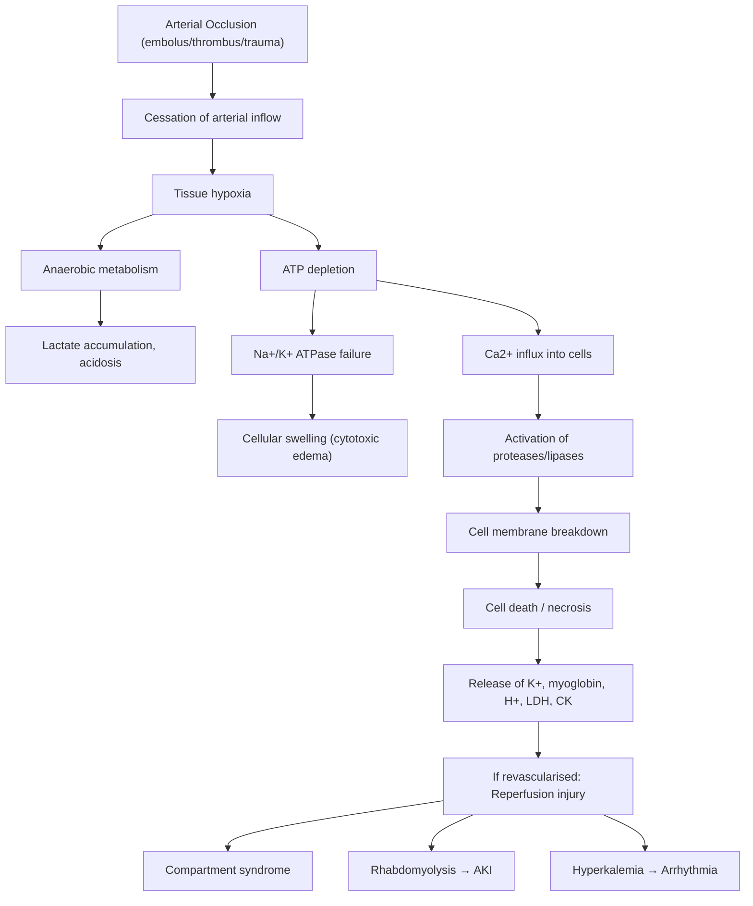

# Acute Limb Ischemia

## 1. Definition

Acute limb ischemia (ALI) is defined as a **sudden decrease in limb perfusion that causes a potential threat to limb viability** in a patient who presents within ***2 weeks*** of the acute event [1][2][3].

Let's break this down:
- **"Acute"** = sudden onset (< 2 weeks), as opposed to chronic limb ischemia (> 2 weeks) where collateral vessels have had time to develop.
- **"Limb ischemia"** = "isch-" (to hold back) + "haemia" (blood) — literally, blood is being held back from the limb.
- The 2-week cutoff matters clinically because it determines whether collateral circulation has had time to develop. In truly acute presentations, there are **no collaterals**, so the tissue is completely dependent on the now-occluded vessel.

> ***Acute & chronic occlusion are distinct entities*** [4]. This is a critical concept — they have different etiologies, different urgency, and different management strategies.

<Callout title="Critical Time Window">
***Irreversible damage occurs 4–6 hours after onset*** if adequate collateral circulation is absent [2]. Skeletal muscle can only withstand approximately 6 hours of ischemia before irreversible necrosis begins. Peripheral nerves are even more sensitive — they are the first structures to fail (hence paraesthesia appears before paralysis). This is why ALI is a ***surgical emergency (6 hours)*** [5].
</Callout>

**Key nuance**: Patients with **pre-existing peripheral vascular disease (PVD)** can often tolerate longer periods of ischemia because they have already developed collateral vessels around chronically stenotic segments [2]. This is why a patient with acute-on-chronic thrombosis may present less dramatically than someone with a fresh embolus to a previously normal artery.

---

## 2. Epidemiology

### Incidence
- ALI affects approximately 1.5 per 10,000 persons per year in Western populations.
- In Hong Kong, the aging population, high prevalence of diabetes mellitus, and increasing rates of atrial fibrillation make ALI a significant clinical entity seen in emergency departments and vascular surgery units.

### Demographics
- **Age**: Most common in the elderly (> 60 years), reflecting the high prevalence of atrial fibrillation and atherosclerosis in this group.
- **Sex**: Males are more commonly affected due to higher rates of atherosclerosis and smoking.
- ***Acute thrombotic occlusion of a pre-existing stenotic arterial segment (acute-on-chronic PVD)*** accounts for approximately ***60%*** of cases (the most common cause) [3].
- ***Embolism*** accounts for approximately ***30%*** of cases [3].
- **Arterial trauma** accounts for the remaining ~10%.

### Mortality
- 30-day mortality is approximately 15–20%, reflecting the fact that many ALI patients have significant underlying cardiovascular comorbidity (the same atrial fibrillation or myocardial infarction that caused the embolism also puts them at risk of death).
- Amputation rates remain significant at 10–30% despite modern revascularization techniques.

---

## 3. Risk Factors

Understanding risk factors requires mapping them to the three major etiological categories (embolism, thrombosis, trauma):

### For Embolic ALI
- ***Atrial fibrillation (AF)*** — by far the most common embolic source (cardiac origin accounts for ~80% of emboli) [3]
- **Recent myocardial infarction (MI)** — left ventricular mural thrombus forms over akinetic/dyskinetic wall segments
- **Valvular heart disease / prosthetic heart valves** — turbulent flow across abnormal valves promotes thrombus formation
- **Left ventricular aneurysm** — stasis within the aneurysm promotes thrombus
- **Infective endocarditis** — vegetations can embolize
- **Abdominal aortic aneurysm (AAA)** — thrombus lining the aneurysm wall can embolize distally, causing ***blue toe syndrome / trash foot*** [3]

### For Thrombotic ALI (Atherosclerotic Risk Factors)
These are the classic ***atherosclerotic occlusive disease risk factors*** [4]:
- ***Smoking*** — the single most modifiable risk factor; accelerates endothelial damage and promotes hypercoagulability
- ***Diabetes mellitus*** — promotes accelerated atherosclerosis, particularly of distal (tibial) vessels
- ***Hypertension*** — shear stress damages endothelium
- ***Hyperlipidemia*** — drives plaque formation
- ***Family history*** — genetic predisposition to atherosclerosis

### For Thrombotic ALI (Non-atherosclerotic)
- **Hypercoagulable states**: malignancy (especially adenocarcinoma secreting mucin), antiphospholipid syndrome (APLS), heparin-induced thrombocytopenia (HIT), sepsis [3]
- **Buerger's disease (thromboangiitis obliterans)** — ***young (30–40s), male, smokers*** [6]
- **Aortic dissection** — the dissection flap can occlude branch vessels
- **Prior vascular intervention** — bypass graft thrombosis, in-stent thrombosis

### For Traumatic ALI
- ***Penetrating trauma*** (stab wounds, gunshot wounds)
- ***Blunt trauma*** (fractures, dislocations — especially supracondylar humeral fracture → brachial artery, posterior knee dislocation → popliteal artery)
- ***Iatrogenic*** — endovascular diagnostic or interventional procedures (catheterization, angioplasty)

<Callout title="Hong Kong Context" type="idea">
In Hong Kong, the aging population with high rates of AF, diabetes, and hypertension makes thrombotic and embolic ALI common. Buerger's disease, while less common than in other parts of Asia, should still be considered in young male smokers presenting with digital ischemia. The high volume of percutaneous coronary interventions and endovascular procedures also contributes to iatrogenic cases.
</Callout>

---

## 4. Anatomy and Function

### Lower Limb Arterial System

Understanding the anatomy is essential because the **level of occlusion determines the clinical presentation** and the **surgical approach**.

#### Arterial Tree (Proximal → Distal)

```
Abdominal Aorta
├── Common Iliac Artery
│   ├── Internal Iliac (Hypogastric) → pelvis, gluteal region
│   └── External Iliac → crosses under inguinal ligament
│       └── Common Femoral Artery (CFA)
│           ├── Profunda Femoris (Deep Femoral) → important collateral
│           └── Superficial Femoral Artery (SFA)
│               └── Popliteal Artery (behind the knee)
│                   ├── Anterior Tibial Artery → Dorsalis Pedis
│                   ├── Posterior Tibial Artery → behind medial malleolus
│                   └── Peroneal (Fibular) Artery
```

#### ***Major Levels of Arterial Occlusion*** [4]

| Level | Vessels | Clinical Presentation |
|---|---|---|
| ***Aorto-iliac*** | ***Large vessels*** | ***Claudication (thigh and calf), impotence*** (Leriche syndrome if bilateral) |
| ***Femoro-popliteal*** | Medium vessels | ***Claudication (calf), tissue loss*** |
| ***Distal*** | ***Small vessels*** | ***Tissue loss*** (ulcers, gangrene) |

**Why does aorto-iliac disease cause impotence?** Because the internal iliac (hypogastric) arteries supply the pelvic organs including the erectile tissue. Bilateral aorto-iliac disease (Leriche syndrome) = buttock claudication + impotence + absent femoral pulses.

**Why does distal disease cause tissue loss rather than claudication?** Because the small distal vessels supply end-organ tissue (toes, skin), and when these occlude, there are very few collaterals at the most distal level. The metabolic demand of skin/subcutaneous tissue at rest is enough that occlusion causes ischemia even without exercise.

#### Key Anatomical Points for Embolism

***Emboli usually lodge at branching points*** because the vessel suddenly narrows [3]:
- ***Femoral bifurcation*** (CFA → SFA + profunda) — ***most common*** site
- ***Popliteal trifurcation*** (→ anterior tibial, posterior tibial, peroneal) — ***2nd most common***
- Aortic bifurcation ("saddle embolus") — causes bilateral limb ischemia
- Iliac bifurcation

#### Collateral Pathways

The profunda femoris (deep femoral artery) is the single most important collateral vessel in the lower limb. Even with complete SFA occlusion, the profunda can reconstitute the popliteal artery via genicular anastomoses. This is why patients with chronic SFA disease often have surprisingly good perfusion to the foot.

---

## 5. Etiology

***Acute arterial occlusion*** is caused by three main mechanisms [4][5]:
1. ***Acute embolism***
2. ***Acute thrombosis***
3. ***Trauma***

### 5.1 Arterial Embolism (~30%)

**Definition**: A blood clot (or other material) formed proximally travels through the arterial system and lodges at a point where the vessel narrows (typically bifurcations).

#### Sources of Emboli

| Source | Mechanism | Details |
|---|---|---|
| **Cardiac (80%)** | Thrombus forms in cardiac chambers/valves | ***AF*** (most common single cause), MI with mural thrombus, valvular heart disease, prosthetic valves, endocarditis, atrial myxoma |
| **Aortic** | Thrombus/debris from aortic pathology | ***AAA*** (thrombus lines aneurysm wall → fragments embolize), atherosclerotic debris ("trash foot" / ***blue toe syndrome***) [3] |
| **Paradoxical** | Venous thrombus crosses to arterial side | Via patent foramen ovale (PFO) or atrial septal defect (ASD) |
| **Unknown** | No identifiable source found | ~5–10% of cases |

#### Pathophysiology of Embolism
1. Thrombus forms at the source (e.g., left atrial appendage in AF due to stasis)
2. Thrombus dislodges and travels distally through the arterial tree
3. Thrombus lodges at a bifurcation point where the vessel caliber suddenly decreases
4. **Complete occlusion** occurs → no antegrade flow
5. Because the native artery was previously **healthy** (no pre-existing stenosis), **no collateral circulation** has developed
6. This is why ***embolism causes complete ischemia (no collaterals)*** — severity is typically worse than thrombosis [3]

<Callout title="Acute limb + chest pain" type="error">
***Acute limb ischemia with concurrent chest pain*** should immediately raise two diagnoses [3]:
1. **MI** → new-onset AF or mural thrombus → embolism to limb
2. **Aortic dissection** → dissection flap occluding limb vessels

Both are life-threatening and require different management. Always get an ***ECG and CXR*** to rule these out [7].
</Callout>

### 5.2 Arterial Thrombosis (~60%)

**Definition**: Thrombus forms in-situ on a diseased artery, usually at the site of a pre-existing atherosclerotic plaque.

***This is the most common cause of ALI*** [3] — "acute-on-chronic" PVD.

#### Mechanisms of Thrombosis

| Mechanism | Explanation |
|---|---|
| ***Acute plaque rupture in PVD*** | The fibrous cap of an atherosclerotic plaque ruptures → exposes thrombogenic subendothelial collagen and lipid core → platelet adhesion and aggregation → thrombus formation → vessel occlusion |
| **Progressive stenosis with low flow** | Severe narrowing → stasis → eventual thrombosis (Virchow's triad: stasis, endothelial injury, hypercoagulability) |
| **Intraplaque hemorrhage** | Bleeding within the plaque causes sudden expansion → luminal narrowing → thrombosis |
| ***Aortic dissection*** | Intimal flap creates false lumen → true lumen collapses → branch vessel occlusion [3] |
| ***Hypercoagulability*** | ***Malignancy, APLS, sepsis*** [3] — Virchow's hypercoagulable component |
| ***Buerger's disease*** | Non-atherosclerotic inflammatory vasculitis of small-medium arteries [3][6] |
| **Graft/stent thrombosis** | Previous vascular bypass graft or angioplasty/stent → thrombosis at the intervention site |

#### Pathophysiology of Thrombosis
1. Chronic atherosclerosis → progressive stenosis over months to years
2. During this time, **collateral vessels develop** as a compensatory mechanism
3. When the artery finally occludes completely (acute event), the collaterals partially maintain perfusion
4. This is why ***ischemia from thrombosis is usually less severe than from emboli*** — the collaterals "buffer" the impact [2]
5. However, the thrombosis can propagate proximally and distally from the occlusion site, potentially blocking collateral inflow/outflow points, worsening ischemia

### 5.3 Arterial Trauma (~10%)

#### Types of Vascular Trauma

***Vascular trauma*** [5]:
- ***Penetrating vs blunt***
- ***High index of suspicion***
- ***Recognize signs of acute ischemia***
- ***Arteriography if in doubt***

| Type | Mechanism | Example |
|---|---|---|
| ***Iatrogenic*** | Endovascular diagnostic or interventional procedures | Cardiac catheterization, angioplasty, intra-aortic balloon pump |
| ***Penetrating*** | Direct vessel injury → may lead to AV fistula that shunts blood away from the limb [2] | Stab wound, gunshot wound |
| ***Blunt*** | Fracture or dislocation → intimal tear with media and adventitia intact → thrombus forms at exposed collagen site [2] | Supracondylar fracture (brachial artery), knee dislocation (popliteal artery), high-energy trauma |

<Callout title="High-Energy Trauma and Vascular Injury">
In ***high-energy trauma***, always assess distal pulses and perform serial neurovascular checks. Certain fracture patterns carry high risk of vascular injury — posterior knee dislocation has up to 40% incidence of popliteal artery injury [8]. Delayed recognition is disastrous.
</Callout>

### 5.4 Other Causes
- **Popliteal artery entrapment syndrome** — anomalous musculoskeletal anatomy compresses the popliteal artery, usually in young athletes without atherosclerotic risk factors
- **Thoracic outlet syndrome (arterial type, aTOS)** — compression of subclavian artery → distal embolization → ***claudication, acute limb ischemia*** → management: ***embolectomy, surgical decompression*** [9]
- **Phlegmasia cerulea dolens** — massive iliofemoral DVT causing venous outflow obstruction so severe that arterial inflow is compromised (a differential, not a true arterial cause)

---

## 6. Relevant Classification

### 6.1 Distinguishing Embolism vs Thrombosis

***This distinction is critically important because different investigation and management*** [3]:

| Feature | ***Embolism*** | ***Thrombosis-in-situ*** |
|---|---|---|
| **Common causes** | ***Cardiac origin (80%) — AF, MI (LV mural thrombus), valvular disease/prosthesis; AAA (blue toe syndrome/trash foot)*** | ***Atherosclerosis: acute plaque rupture in PVD; Aortic dissection; Hypercoagulability: malignancy, APLS, sepsis; Buerger's disease*** |
| **Severity** | ***Complete ischemia (no collaterals)*** | ***Incomplete ischemia (collaterals)*** |
| **Onset** | ***Hyperacute (seconds to minutes)*** | ***Acute (hours or days)*** |
| **History and PE** | ***Embolic source identifiable (e.g., AF); Contralateral limb pulses present; Absent bruits*** | ***Previous claudication; PVD in contralateral limb (e.g., absent pulse); Present bruits*** |
| **Angiographic findings** | Minimal atherosclerosis, regular sharp cut-off, few collaterals [2] | Diffuse atherosclerosis, irregular cut-off, well-developed collaterals [2] |
| **Management** | ***Embolectomy, anticoagulation*** | ***Medical, bypass, thrombolysis*** |

<Callout title="Key Clinical Pearl" type="idea">
The quickest bedside way to differentiate: **Check the contralateral limb**. If the other leg has normal pulses → likely embolism (the underlying arteries are healthy). If the other leg also has absent/reduced pulses → likely thrombosis (bilateral atherosclerotic disease).
</Callout>

### 6.2 Rutherford Classification of Acute Limb Ischemia

This is the standard classification system that guides management decisions:

| Category | Prognosis | Sensory Loss | Motor Deficit | Arterial Doppler | Venous Doppler | Investigation | Management |
|---|---|---|---|---|---|---|---|
| ***I (Viable)*** | ***No immediate threat*** | ***None*** | ***None*** | ***Audible*** | ***Audible*** | ***CTA*** | ***Revascularisation*** |
| ***IIA (Marginally threatened)*** | ***Salvageable if promptly treated*** | ***Minimal (toes) or none*** | ***None*** | ***Inaudible*** | ***Audible*** | ***CTA*** | ***Revascularisation*** |
| ***IIB (Immediately threatened)*** | ***Salvageable only if immediately revascularised*** | ***More than toes, rest pain*** | ***Mild/moderate*** | ***Inaudible*** | ***Audible*** | ***CTA*** | ***Revascularisation (emergency)*** |
| ***III (Irreversible)*** | ***Inevitable limb loss*** | ***Profound*** | ***Paralysis*** | ***Inaudible*** | ***Inaudible*** | ***Not required*** | ***Amputation*** |

**How to interpret this table:**

- **Doppler signals are the most objective clinical tool.** An audible arterial Doppler signal means there is still some flow through or around the occlusion → the limb is viable. Inaudible arterial but audible venous means there is still venous return but no arterial inflow → the limb is threatened. When **both** are inaudible → the limb is dead.
- **Sensory loss before motor loss**: This reflects the differential sensitivity of tissues to ischemia. Nerve fibers (especially myelinated sensory fibers) are the most sensitive to ischemia, followed by skeletal muscle, then skin and bone. That's why paraesthesia (sensory) is an early sign and paralysis (motor) is a **late, ominous** sign.
- **Category III (Irreversible)** → The muscles are already infarcted. Attempting revascularization at this point is not only futile but **dangerous** — reperfusing necrotic muscle will release potassium, myoglobin, and acid into the systemic circulation → hyperkalemia, rhabdomyolysis, renal failure, cardiac arrest. **Amputation is the appropriate treatment.**

<Callout title="Exam Trap" type="error">
A common exam mistake is to think "we should always try to save the limb." In Rutherford III, revascularization is ***contraindicated*** — it will kill the patient via reperfusion syndrome. The correct answer is primary amputation.
</Callout>

### 6.3 Limb Color Progression (Time-Dependent)

***Limb colour progresses*** [3]:
- ***0–6 hours: "Marble white" pallor*** — arterial inflow is absent, the limb blanches
- ***6–12 hours: Blanchable mottling*** — deoxygenated blood pools in the capillary bed; pressing on the skin temporarily displaces this blood (blanching), then it refills
- ***> 12 hours: Fixed mottling (irreversible)*** — the capillary endothelium has died, blood has extravasated into the interstitium, and pressing no longer causes blanching → ***revascularization at this point might cause significant reperfusion injury*** [3]

**Why does this progression occur?**
1. Initially, absent arterial inflow → venous blood drains out → limb is pale/white
2. As capillary endothelium becomes ischemic, it becomes "leaky" → deoxygenated blood pools in the subdermal plexus → mottled appearance
3. If ischemia continues, capillary endothelium undergoes irreversible damage → blood extravasates and becomes fixed in the tissue → cannot be blanched away

---

## 7. Clinical Features

### Approach to the Patient

The clinical features of ALI are classically described by the ***"6 P's"*** [3][5]:

### 7.1 Symptoms

#### ***Pain*** (Early)
- ***Nerves are the most sensitive to ischemia*** [3] — this is why pain is usually the **earliest** symptom
- **Character**: Severe, sudden onset, constant, and unrelenting
- **Location**: Depends on the level of occlusion — e.g., calf pain with femoro-popliteal occlusion, forefoot pain with distal occlusion
- **Pathophysiology**: Ischemic nerve fibers fire pain signals; as ischemia progresses, metabolic waste products (lactate, H⁺, adenosine, bradykinin) accumulate in the tissue and directly stimulate nociceptors
- In **embolic** ALI: pain onset is ***hyperacute (seconds to minutes)*** because a previously well-perfused limb suddenly loses all blood flow
- In **thrombotic** ALI: pain onset is ***acute (hours or days)*** and may be superimposed on a background of chronic claudication pain

#### ***Paraesthesia*** (Early)
- "Para-" (abnormal) + "aesthesia" (sensation) = abnormal sensation
- Presents as tingling, numbness, or "pins and needles"
- **Pathophysiology**: Large myelinated sensory nerve fibers (Aβ fibers carrying light touch and proprioception) are extremely sensitive to ischemia and fail early. Unmyelinated C fibers (pain) are slightly more resistant, which is why the patient may paradoxically lose touch sensation before losing pain sensation.
- **Clinical significance**: Presence of sensory loss in the toes distinguishes Rutherford IIA from I; sensory loss extending beyond the toes suggests IIB.

#### ***Perishing cold***
- The affected limb feels **cold** to the patient
- **Pathophysiology**: Without arterial inflow, the limb cannot maintain its temperature. Heat dissipates through the skin surface, and the limb equilibrates toward room temperature. Normally, the arterial blood at ~37°C continuously warms the limb.

#### Rest Pain (in severe cases)
- Continuous burning pain in the forefoot/toes, often worse at night and when the limb is elevated
- **Why worse when elevated?** Gravity assists venous drainage but reduces the already-compromised arterial perfusion pressure. When the leg hangs dependent, gravity adds to the arterial pressure head, slightly improving perfusion.
- **Why worse at night?** Cardiac output falls during sleep, and the leg is typically elevated in bed → both reduce perfusion.

### 7.2 Signs

#### ***Pallor***
- The limb appears **white/pale** or waxy
- **Pathophysiology**: Absent arterial inflow → the cutaneous capillary bed empties of blood → skin loses its normal pink color
- Progresses to **mottling** (see color progression above) as ischemia worsens

#### ***Pulselessness***
- Absent or diminished pulse **distal** to the occlusion
- ***Can assess with handheld Doppler*** [3] — this is more sensitive than palpation
- **Pathophysiology**: The embolus/thrombus physically blocks the vessel lumen → no pressure wave is transmitted distally
- **Bilateral pulselessness** suggests aortic saddle embolus or bilateral iliac disease
- **Compare with the contralateral limb** — if the other side has normal pulses, this supports an embolic cause

#### ***Paralysis*** (Late — Poor Prognosis)
- ***Late sign indicating muscle infarction*** [3]
- **Pathophysiology**: Skeletal muscle undergoes irreversible ischemic necrosis → the muscle can no longer contract → motor function is lost
- Clinically: inability to dorsiflex/plantarflex the foot, inability to wiggle toes
- **This is an ominous sign** — it suggests the limb may be moving toward Rutherford Class III (irreversible)

#### Temperature Difference
- **Palpate both limbs simultaneously** — there will be a clear temperature demarcation at the level of occlusion
- The level of coolness often correlates with the level of arterial occlusion (e.g., cool from the mid-thigh down suggests SFA occlusion; cool from below the knee suggests popliteal occlusion)

#### Capillary Refill
- Prolonged capillary refill time ( > 2 seconds) in the affected limb
- **Pathophysiology**: With absent arterial inflow, the capillary bed cannot refill after blanching

#### Additional Signs on Examination
- **Absent bruits** in embolic disease (the underlying artery was healthy)
- **Present bruits** in thrombotic disease (turbulent flow through chronically stenosed vessels)
- **Irregularly irregular pulse** (AF) — suggests cardiac embolic source
- **Cardiac murmurs** — valvular disease as embolic source
- **Abdominal aortic aneurysm** — palpable pulsatile abdominal mass → source of distal embolization
- **Contralateral limb examination**: normal pulses (embolism) vs. absent pulses (thrombosis/bilateral PVD)

### 7.3 Systematic History Taking [2]

#### History of Presenting Illness (HPI)
- **Site**: Buttock/Thigh/Calf/Foot/Toes
- **Onset**: Sudden (seconds/minutes suggests embolism) vs. gradual (hours/days suggests thrombosis); < 2 weeks or > 2 weeks
- **Character**: Severity of pain, constant vs. intermittent; presence of pre-existing claudication
- **Radiation**: To other parts of body
- **Associated symptoms**: Sensory disturbances (tingling/numbness), motor disturbances (weakness/inability to move), color change, temperature change
- **Time course**: Progressive worsening
- **Exacerbating factors**: Worsened when raising the limb (gravity reduces arterial head pressure), worsened at night (reduced cardiac output during sleep)
- **Relieving factors**: Hanging leg over the side of the bed (gravity assists arterial inflow), analgesics
- **Severity**: Pain score 1–10, wakes patient from sleep
- **Functional outcomes**: Ability to walk, ADLs, wheelchair-bound

#### Past Medical History
- **Atrial fibrillation** — embolic source
- **Recent MI** — mural thrombus
- **Previous stroke/TIA** — shared atherosclerotic risk, may also indicate paradoxical embolism
- **Known PVD/claudication** — suggests thrombotic etiology
- **Diabetes mellitus, Hypertension, Hyperlipidemia** — atherosclerotic risk factors
- **Thrombophilic states** — malignancy, APLS, protein C/S deficiency, Factor V Leiden
- **Connective tissue disorders** — Marfan, Ehlers-Danlos (aortic dissection risk)

#### Surgical History
- Previous vascular revascularization (bypass, angioplasty, stenting) → graft/stent thrombosis
- Recent cardiac catheterization → iatrogenic vascular injury

#### Drug History
- Anticoagulants (warfarin, NOACs, heparin) — therapeutic compliance?
- Antiplatelet agents (aspirin, clopidogrel)
- Vasopressors/inotropes (in ICU patients) → can precipitate non-occlusive ischemia

#### Social History
- ***Smoking*** — the most important modifiable risk factor for atherosclerosis; also the key causative factor in Buerger's disease
- **Occupation** — prolonged immobility
- **Recent trauma** — blunt or penetrating injury to the limb

---

## 8. Pathophysiology Summary: From Occlusion to Tissue Death

Understanding the cascade from vessel occlusion to irreversible damage:



**Why are nerves affected first?**
Peripheral nerves have high metabolic demands and poor ischemic tolerance. Large myelinated fibers fail first (loss of touch, proprioception) → then unmyelinated fibers (loss of pain, temperature) → then motor neurons fail (paralysis). This explains the clinical progression: paraesthesia → anesthesia → paralysis.

**Why is muscle damage so dangerous?**
Skeletal muscle contains large quantities of myoglobin, potassium, and phosphate. When muscle cells necrose, these are released into the circulation. Myoglobin is freely filtered by the kidney but precipitates in acidic urine → tubular obstruction → acute kidney injury (AKI). Potassium release → hyperkalemia → cardiac arrhythmias → cardiac arrest.

---

## 9. Special Etiological Entities

### 9.1 Buerger's Disease (Thromboangiitis Obliterans) [6]

***Buerger's Disease (Thromboangiitis Obliterans)*** [6]:
- ***Young (30–40s), Male, Smokers***
- ***Pan-arteriitis***
- ***Medium & small sized arteries & veins***
- ***Lower limb > upper limbs***
- ***Rest pain, digital ulcer, gangrene***
- ***Clinical diagnosis***
- ***Arteriogram: "tree trunk"*** appearance (smooth tapering of vessels with corkscrew collaterals)
- ***Reconstruction seldom possible*** (because the disease affects small distal vessels not amenable to bypass)
- ***Stop smoking is effective*** — the single most important treatment; disease progression halts with smoking cessation

**Pathophysiology**: Unlike atherosclerosis (which is a lipid-driven process), Buerger's disease is an **inflammatory** vasculitis. There is segmental thrombotic occlusion of small and medium arteries and veins with intense inflammatory infiltrate involving all three vessel wall layers (hence "pan-arteriitis"). The exact mechanism is unclear but is strongly linked to tobacco exposure — possibly an autoimmune response triggered by tobacco antigens.

### 9.2 Aortic Dissection as a Cause of ALI

Aortic dissection can present with ALI when the dissection flap extends to occlude the iliac or femoral arteries. Key features:
- Chest/back pain (tearing, radiating) + acute limb ischemia
- **Pulse deficit** — weak or absent femoral pulse on the affected side
- **BP discrepancy** between arms
- **Must rule out aortic dissection before giving heparin** [7] — because anticoagulation in the setting of aortic dissection can be catastrophic (worsening hemorrhage into false lumen)

### 9.3 Blue Toe Syndrome / Atheroembolism

- Microemboli of cholesterol crystals and atherosclerotic debris from a proximal source (aorta, iliac arteries, AAA) shower distally
- Presents as painful, cyanotic (blue) toes with **palpable pedal pulses** (the main arteries are patent; it's the small digital arteries that are occluded)
- Often triggered by vascular procedures, anticoagulation (destabilizes thrombus overlying plaques), or spontaneously
- ***Blue toe syndrome: manage medically e.g., statins*** [7]

---

> **High Yield Exam Points:**
> - ALI = sudden decrease in perfusion threatening limb viability, presenting within **2 weeks**
> - **6 P's**: Pain, Paraesthesia, Pallor, Pulselessness, Paralysis, Perishing cold
> - Most common cause: acute-on-chronic thrombosis (60%); embolism (30%); trauma (10%)
> - Embolism → hyperacute, complete ischemia, no collaterals; Thrombosis → acute, incomplete ischemia, collaterals present
> - Emboli lodge at **bifurcation points** — femoral bifurcation (MC), popliteal trifurcation (2nd MC)
> - Cardiac source accounts for 80% of emboli; AF is the single most common cause
> - **Irreversible damage at 6 hours** — this is a surgical emergency
> - **Rutherford III = amputation**, NOT revascularization
> - **Paralysis is a late, ominous sign** indicating muscle infarction
> - Fixed mottling ( > 12h) = irreversible — revascularization risks lethal reperfusion injury
> - Always check the **contralateral limb** and get an **ECG** (looking for AF/MI)

<Callout title="High Yield Summary">

**Definition**: Sudden decrease in limb perfusion threatening viability, presenting within 2 weeks.

**6 P's**: Pain → Paraesthesia → Pallor → Pulselessness → Paralysis → Perishing cold (in order of sensitivity to ischemia: nerves first, then muscle).

**Etiology**: Thrombosis (60%, acute-on-chronic PVD) > Embolism (30%, cardiac 80%) > Trauma (10%).

**Emboli lodge at bifurcations**: Femoral bifurcation (MC), popliteal trifurcation (2nd MC).

**Embolism vs Thrombosis**: Check contralateral pulses (present = embolism; absent = bilateral PVD/thrombosis), history of claudication (absent = embolism), onset (hyperacute = embolism).

**Rutherford Classification**: I (viable) → IIA (marginally threatened) → IIB (immediately threatened) → III (irreversible). Key differentiators: sensory loss, motor deficit, Doppler signals. Category III = primary amputation.

**Time is muscle**: Irreversible damage at 6 hours. Paralysis and fixed mottling are late/irreversible signs.

**Always rule out aortic dissection** before anticoagulation (ECG + CXR).

**Buerger's disease**: Young male smokers, small/medium vessels, "tree trunk" arteriogram, stop smoking is curative.

</Callout>

---

<ActiveRecallQuiz
  title="Active Recall - Acute Limb Ischemia (Definition, Etiology, Clinical Features)"
  items={[
    {
      question: "What are the 6 P's of acute limb ischemia and which tissue is most sensitive to ischemia (fails first)?",
      markscheme: "Pain, Paraesthesia, Pallor, Pulselessness, Paralysis, Perishing cold. Nerves are most sensitive to ischemia (sensory loss before motor loss). Paralysis is a late, ominous sign indicating muscle infarction.",
    },
    {
      question: "A patient presents with sudden-onset left leg pain and pallor. The right leg has normal pulses. ECG shows AF. Is this more likely embolism or thrombosis? Explain three distinguishing features.",
      markscheme: "Embolism. (1) Identifiable embolic source: AF. (2) Contralateral limb pulses present: indicates underlying arteries are healthy. (3) Hyperacute onset (seconds to minutes). Also: no prior claudication history, absent bruits on affected side.",
    },
    {
      question: "Where do emboli most commonly lodge in the lower limb arterial tree, and why?",
      markscheme: "Femoral bifurcation (most common) and popliteal trifurcation (2nd most common). Emboli lodge at bifurcation points because the vessel caliber suddenly narrows, physically trapping the embolus.",
    },
    {
      question: "A patient with ALI has profound sensory loss, paralysis, and inaudible arterial and venous Doppler signals. What is the Rutherford classification and what is the appropriate management?",
      markscheme: "Rutherford III (irreversible). Management is primary amputation, NOT revascularization. Revascularization would cause lethal reperfusion injury (hyperkalemia, rhabdomyolysis, AKI) from reperfusing necrotic muscle.",
    },
    {
      question: "Why must aortic dissection be ruled out before giving heparin in a patient with acute limb ischemia?",
      markscheme: "Aortic dissection can present with limb ischemia (dissection flap occluding branch vessels). Anticoagulation with heparin in aortic dissection worsens hemorrhage into the false lumen and can be fatal. Rule out with ECG and CXR; CT angiography if clinical suspicion.",
    },
    {
      question: "Describe the limb color progression in ALI and the clinical significance of fixed mottling.",
      markscheme: "0-6h: marble white pallor; 6-12h: blanchable mottling (deoxygenated blood pools in capillaries but can still be displaced); >12h: fixed mottling (capillary endothelium dead, blood extravasated into interstitium, cannot be blanched). Fixed mottling indicates irreversible ischemia; revascularization at this stage risks significant reperfusion injury.",
    },
  ]}
/>

---

## References

[1] Rutherford RB, et al. Recommended standards for reports dealing with lower extremity ischemia. J Vasc Surg. 1997;26(3):517-538.
[2] Senior notes: felixlai.md (Acute arterial insufficiency section)
[3] Senior notes: maxim.md (Acute limb ischaemia section)
[4] Lecture slides: WCS 002 - Toe gangrene and leg ulcer - by Prof SWK Cheng.pdf (p2 — Arterial Occlusive Diseases)
[5] Lecture slides: WCS 002 - Toe gangrene and leg ulcer - by Prof SWK Cheng.pdf (p24, p26, p27 — Symptoms, Treatment, Complications)
[6] Lecture slides: WCS 002 - Toe gangrene and leg ulcer - by Prof SWK Cheng.pdf (p22 — Buerger's Disease)
[7] Senior notes: maxim.md (Management section — Initial management, rule out dissection)
[8] Lecture slides: GC 231. High Energy Trauma Open Fracture_Part 3.pdf
[9] Senior notes: maxim.md (Thoracic outlet syndrome section)
