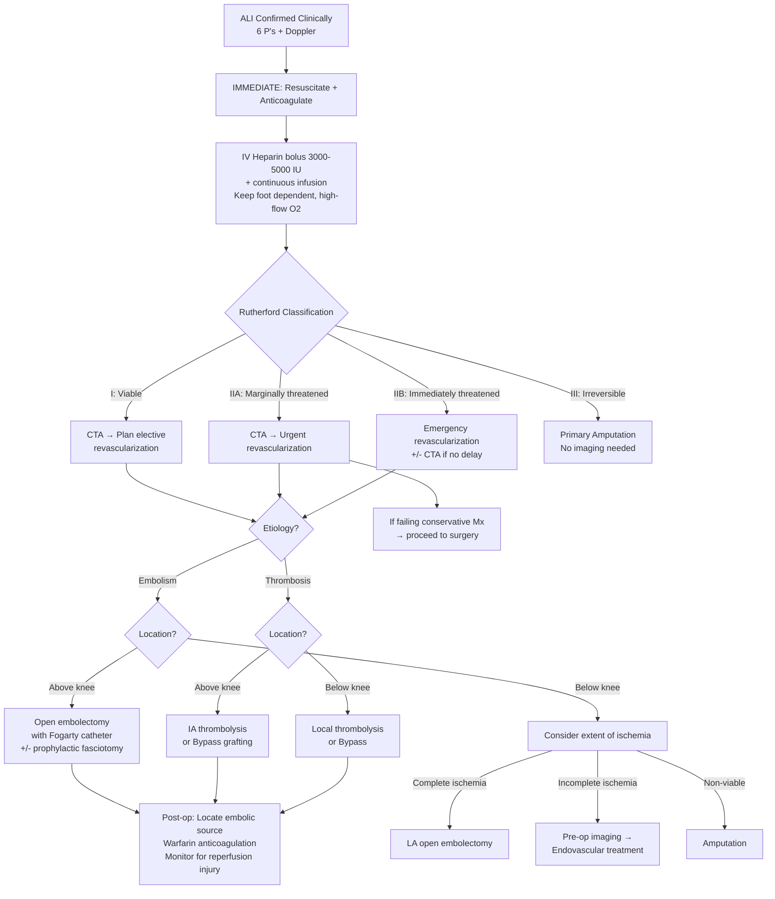

## Management of Acute Limb Ischemia

### Overview: The Treatment Framework

The management of ALI is driven by a single overarching principle: ***surgical emergency (6 hours)*** [5]. The lecture slides distil the treatment into a clear hierarchy [15]:

> ***Treatment of Lower Limb Ischemia*** [15]:
> - ***Asymptomatic → Do not treat***
> - ***Leg Pain → Acute Ischemia / Chronic Ischemia → Indications → Revascularization***
> - ***Tissue loss → Do not amputate*** (without first attempting revascularization)

This hierarchy embeds a critical pitfall: ***Toe amputation before revascularization*** is a common mistake [12]. Always revascularize first (restore inflow), THEN deal with the tissue loss. Amputating a toe without fixing the blood supply means the stump won't heal — you'll end up doing progressively higher amputations.

The management algorithm is dictated by **Rutherford classification** (determines urgency) and **etiology** (embolism vs thrombosis → determines surgical approach).

---

### Management Algorithm

---

### Step 1: Initial Management (ALL Patients)

These measures begin **immediately** upon clinical diagnosis, regardless of Rutherford category [3]:

#### 1A. Resuscitation and Supportive Measures

| Measure | Rationale |
|---|---|
| ***NPO*** [3] | Patient may need emergency surgery; fasting prevents aspiration during anaesthesia |
| ***IV fluids*** [3] | Maintain circulating volume; dehydration → low flow → thrombus propagation; also prepare for contrast-induced diuresis |
| ***Monitor BP/P, SpO₂*** [3] | Hemodynamic instability may indicate concurrent MI, aortic dissection, or sepsis from gangrene |
| ***Foley catheter for I/O*** [3] | Strict monitoring of urine output; anticipate myoglobin-induced AKI post-revascularization; target UO > 0.5 mL/kg/hr |
| ***High-flow O₂*** [2][3] | Maximize tissue oxygenation — even if PaO₂ is normal, increasing dissolved O₂ in plasma provides marginal benefit to ischemic tissue at the periphery |
| ***Keep foot dependent*** [2][3] | Gravity assists arterial inflow to the ischemic limb. **Never elevate** an acutely ischemic limb — this reduces arterial perfusion pressure (unlike venous disease where elevation helps) |
| **Correction of hypotension** [2] | Hypotension → reduced arterial driving pressure → worsens ischemia AND promotes stasis → further thrombosis. Fluid resuscitation ± vasopressors as needed |
| **Analgesia** [2] | Parenteral opioids (e.g., IV morphine) — the pain of ALI is severe. Adequate analgesia also reduces sympathetic vasoconstriction |

<Callout title="Never Elevate an Ischemic Limb" type="error">
A very common nursing error: elevating the legs "for circulation." In venous disease, elevation helps by reducing venous congestion. In **arterial** disease, elevation reduces the arterial perfusion pressure gradient and **worsens ischemia**. ***Keep foot dependent*** [3].
</Callout>

#### 1B. Anticoagulation — Heparin

***Anticoagulate*** [5] — this is one of the first things you do.

- ***ALL patients should be anticoagulated*** once the diagnosis of acute arterial ischemia due to emboli or thrombi is made, in the absence of contraindications [2]
- ***Heparin: IV bolus 3000–5000 IU + continuous infusion*** [3]
- ***Monitor APTT (60–80 seconds)*** [3], aiming for APTT 2–2.5× normal [2]

**Why heparin first?**
1. **Prevents further propagation of thrombus** — the initial embolus/thrombus acts as a nidus; stasis distal to the occlusion promotes secondary thrombus formation that can extend into collateral inflow/outflow points, worsening ischemia
2. **Protects collateral vessels** [3] — by preventing thrombosis of the small collateral channels that are providing whatever residual flow exists
3. **Prevents venous thrombosis** in the ischemic, immobilized limb

**Mechanism of heparin**: Unfractionated heparin (UFH) binds antithrombin III (AT-III) and potentiates its activity ~1000-fold. The heparin–AT-III complex inactivates thrombin (Factor IIa) and Factor Xa, blocking the coagulation cascade. UFH is preferred over LMWH in the acute setting because:
- It has a **short half-life** (~60–90 min) — can be reversed rapidly with protamine sulfate if the patient goes to the OR
- Its effect is **titratable** and monitored by APTT

<Callout title="Must Rule Out Aortic Dissection Before Giving Heparin" type="error">
***Must rule out aortic dissection before giving heparin*** [3]. Aortic dissection with branch vessel occlusion can mimic ALI perfectly. Giving heparin to a patient with aortic dissection worsens hemorrhage into the false lumen. Always get an **ECG + CXR** first. If high clinical suspicion (chest/back pain, BP discrepancy, pulse deficit), proceed to CTA before anticoagulation.
</Callout>

#### 1C. Urgent Investigations (Simultaneous)

While resuscitating and anticoagulating, send off [3]:
- ***CBC D/C, clotting, LRFT, T&S, CK*** (muscle injury)
- ***ECG and CXR***: rule out aortic dissection, identify AF/MI as embolic source
- ***Urgent CT angiogram***: confirm level of occlusion, assess run-off

---

### Step 2: Management by Rutherford Category

#### Rutherford I and IIA — Conservative Management (with Planned Revascularization)

***Indications: Rutherford I and IIA*** [3]

These patients have viable or marginally threatened limbs — there is still some perfusion (either through collaterals or incomplete occlusion). You have time to image and plan.

**Management**:
- Continue ***heparin infusion*** [3]
- Obtain ***CTA*** to map the occlusion and plan revascularization strategy
- If the limb **improves** on heparin (pain resolves, sensation returns, Doppler signals improve) → semi-elective revascularization can be planned
- If the limb **does not improve or worsens** on heparin → escalate to surgical management (treat as IIB) [3]

#### Rutherford IIB — Emergency Surgical Revascularization

***Indications: Rutherford IIB or IIA failing conservative management*** [3]

These patients have immediately threatened limbs. The treatment approach depends on **etiology** (embolism vs thrombosis) and **anatomy** (above-knee vs below-knee) [3].

#### Rutherford III — Primary Amputation

The limb is **irreversible** — muscles are infarcted, there is profound sensory and motor loss, and both arterial and venous Doppler signals are absent.

***Arteriography is NOT necessary*** since the level of amputation is determined by clinical findings and tissue viability at surgery [2].

***Delays in amputation of non-viable extremities can result in infection, myoglobinuria, acute renal failure and hyperkalemia*** [2]. The dead muscle is a ticking time bomb of toxic metabolites — the longer you wait, the more systemic poison leaks out.

---

### Step 3: Surgical Management — By Etiology and Anatomy

#### Overview of Treatment Modalities [2]

| | ***Surgical Revascularization*** | ***Endovascular Revascularization*** |
|---|---|---|
| **Modalities** | ***Embolectomy*** (OR), Bypass grafting, ± Prophylactic fasciotomy | ***IA Thrombolysis***, Angioplasty and stenting |
| **Indications** | ***Immediately threatened extremities***; ***Recent occlusion < 2 weeks*** | ***Viable or marginally threatened extremities***; ***Prolonged occlusion > 2 weeks*** (preferred in diseased vessels since it can be difficult to trawl out a clot in a stenosed vessel) |

#### Management According to Etiology and Anatomy [3]:

| | ***Embolic Cause*** | ***Thrombotic Cause*** |
|---|---|---|
| **Above knee** | ***Open embolectomy with Fogarty catheter +/- prophylactic fasciotomy*** (if ischemia > 6h) | ***IA thrombolysis or bypass grafting*** |
| **Below knee** | ***Consider extent of ischemia*** → Complete: LA open embolectomy; Incomplete: pre-op imaging → endovascular; Non-viable: amputation | ***Local thrombolysis or bypass*** |

---

### 3A. Open Embolectomy with Fogarty Catheter

This is the classic emergency operation for **embolic** ALI, and one of the most important procedures to know.

***Treatment of Acute Embolism*** [5]:
- ***Surgical emergency (6 hours)***
- ***Diagnosis is clinical***
- ***Anticoagulate***
- ***Surgery — embolectomy***
- ***Fogarty catheter***
- ***Thrombolysis in selected cases***

**The Fogarty Catheter** — named after Dr. Thomas Fogarty who invented it in 1963. It's an ingenious device:

***Fogarty Embolectomy Catheter*** [5]: A thin catheter with an inflatable balloon at the tip.

**Procedure** [2]:
1. **Arterotomy**: The involved artery is clamped and a small incision (arterotomy) is made — usually at the common femoral artery in the groin (easiest access point, and both proximal and distal clots can be retrieved from here)
2. **Catheter insertion**: The Fogarty balloon catheter is inserted **past the clot** (distal to the occlusion) while the balloon is deflated
3. **Balloon inflation**: The balloon is inflated with saline
4. **Clot retrieval**: The catheter is slowly withdrawn, and the inflated balloon "trawls" the clot out of the artery
5. **Flushing**: The artery is flushed with heparinized normal saline to clear residual debris
6. **Closure**: Arterotomy is closed with meticulous hemostasis
7. **Intraoperative angiography** is advisable to ascertain adequacy of clot removal and document distal patency [2]

**Why is embolectomy preferred for embolic ALI?** Because the underlying artery is **healthy** (the embolus came from elsewhere). The Fogarty balloon can easily pass through a normal-caliber vessel and cleanly extract the clot. In contrast, in thrombotic ALI, the artery is diseased and stenotic — trying to pass a balloon through a narrowed, irregular, plaque-laden vessel risks dissection, perforation, and incomplete clot removal [2].

#### Prophylactic Fasciotomy

***Fasciotomy*** should be routinely considered in any patient with ***> 6 hours of acute limb ischemia*** or in the presence of combined arterial and venous injuries [2].

***Compartment Syndrome and Fasciotomy*** [5]: The leg has distinct fascial compartments:
- ***Anterior compartment***
- ***Peroneal compartment***
- ***Posterior compartments*** (superficial and deep)

**Technique**: Two longitudinal incisions — **medial** and **lateral** — to decompress all four compartments of the lower leg. The wounds are left open and closed secondarily (delayed primary closure or skin grafting) once the swelling subsides.

**Why prophylactic?** After prolonged ischemia ( > 6 hours), reperfusion causes massive capillary leak into the interstitium (ischemia–reperfusion injury). The resulting swelling within the non-expansible fascial compartments can produce compartment syndrome — which would destroy the limb you just saved. Performing fasciotomy at the time of revascularization **prevents** this cascade.

#### Post-Operative Management After Embolectomy

- ***Locate source of emboli*** [5] — echocardiogram, Holter monitor, assess for AF, AAA
- **Conversion to warfarin anticoagulation**: Up-titrate warfarin until ***INR 2.0–2.5*** before heparin is stopped [2]. The overlap period is needed because warfarin initially is pro-thrombotic (it depletes protein C before factors II, IX, X).
- Monitor for reperfusion complications (see Complications section)

---

### 3B. Intra-Arterial (IA) Catheter-Directed Thrombolysis

This is the primary modality for **thrombotic** ALI, and an alternative to surgery in selected embolic cases.

***Potential to reduce morbidity and mortality while achieving limb salvage makes thrombolysis preferable to open surgery as 1st line treatment in patients with ALI*** [2] — particularly for thrombotic causes where the underlying vessel is diseased.

**Procedure** [2]:
1. **Pre-thrombolysis angiography** — DSA is performed to locate the exact site and extent of occlusion
2. **Catheter placement** — A thrombolysis catheter is inserted directly **into the clot** via percutaneous arterial access
3. **Thrombolytic infusion** — Recombinant tissue plasminogen activator (tPA) is infused (e.g., alteplase or reteplase)
   - **tPA mechanism**: "t" = tissue, "PA" = plasminogen activator. tPA converts plasminogen → plasmin, which directly digests fibrin clot. Catheter-directed delivery concentrates the drug at the clot, minimizing systemic bleeding risk compared to IV thrombolysis
4. **Post-thrombolysis angiography** — Check for residual clot and identify underlying lesions
5. **Balloon angioplasty ± stenting** — Can be performed in the same session after complete lysis to treat the underlying atherosclerotic stenosis that caused the thrombosis [2]

**Advantages** [2]:
- ***More gradual and complete clot lysis*** in branch vessels too small to access by embolectomy balloons — the drug diffuses into tiny collateral vessels that a balloon cannot reach
- ***More gradual clot dissolution decreases incidence of reperfusion syndrome*** compared to open surgery where rapid return of blood flow may precipitate compartment syndrome — the gradual restoration of flow allows the body to buffer the toxic metabolite washout

**Disadvantages** [2]:
- ***Higher risk of hemorrhagic stroke and major hemorrhage*** — tPA activates plasmin systemically despite catheter-directed delivery
- Takes **longer** than surgical embolectomy (hours of infusion vs immediate mechanical removal)
- Not suitable for immediately threatened (IIB) limbs where every minute counts

**Contraindications to Thrombolysis** [2][3]:
| Contraindication | Rationale |
|---|---|
| Cerebrovascular accident within past 2 months | Risk of hemorrhagic transformation of recent stroke |
| Intracranial hemorrhage within past 3 months | Risk of rebleeding |
| Intracranial malignancy or brain metastasis | Highly vascular tumors prone to hemorrhage |
| Active bleeding within past 10 days | Cannot lyse clot systemically in a patient who is actively bleeding |
| Major surgery or trauma within past 10 days | Disrupted surgical sites/wounds will bleed |
| Uncontrolled hypertension | Increased risk of intracranial hemorrhage |
| ***Previous stroke/TIA, recent GI bleed, bleeding tendency, pregnancy*** [3] | Additional contraindications |

<Callout title="Embolectomy vs Thrombolysis — When to Choose Which" type="idea">

**Embolectomy** is best for: **embolic** cause, **above-knee** location, **immediately threatened** limb (IIB), **recent occlusion** ( < 2 weeks), normal underlying artery.

**Thrombolysis** is best for: **thrombotic** cause (acute-on-chronic PVD), **below-knee** or **diffuse** disease, **viable/marginally threatened** limb (I/IIA), **prolonged occlusion** ( > 2 weeks), ***diseased vessels*** where Fogarty balloon would struggle [2].

Think of it this way: embolectomy is a plumber pulling a blockage out of a clean pipe. Thrombolysis is dissolving a blockage in a corroded, narrowed pipe where a plumbing tool would cause damage.
</Callout>

---

### 3C. Bypass Grafting

Bypass grafting is used when the occlusion is **extensive** or the artery is too diseased for simple clot removal/thrombolysis.

**Principle**: Create an alternative route for blood to bypass the occluded segment — like building a detour road around a blocked highway.

#### Types of Graft [2][14]

| Graft Type | Material | Best For | Key Features |
|---|---|---|---|
| **Autogenous vein graft** | Great saphenous vein (GSV), lesser saphenous vein (SSV), arm veins | **Smaller arteries** (femoro-popliteal, tibial) | Lined by endothelium → natural antithrombotic; more resistant to infection; valvulotome used to disrupt venous valves (so blood flows in the correct direction); best long-term patency below the knee [14] |
| **Prosthetic graft** | PTFE (polytetrafluoroethylene), Dacron | **Larger arteries** (aorto-iliac, aorto-femoral) | Comparable patency to vein grafts above the knee, but significantly lower patency distally [2]; +/- Miller cuff (vein cuff at distal anastomosis) to improve patency [14] |

#### Anatomical Reconstruction Options [2]

| Bypass | Indication | Notes |
|---|---|---|
| **Aorto-bifemoral bypass** | Symptomatic aorto-iliac occlusion | Preferred method; excellent patency; requires abdominal surgery |
| **Femoro-popliteal bypass** | SFA or proximal popliteal occlusion with patent popliteal artery having continuity with ≥ 1 tibial branch | Most common bypass in ALI/CLI |
| ***Femoro-femoral bypass*** [15] | Unilateral iliac occlusion with disease-free contralateral iliac/aorta | ***Can be performed under local anaesthesia*** [2]; extra-anatomical (no abdominal surgery needed) |
| ***Axillo-bifemoral bypass*** [15] | Bilateral aorto-iliac disease in patients unfit for major abdominal surgery | ***Neither thoracic nor abdominal cavity is violated***; ***can be performed under LA*** [2]; poorer patency than aorto-femoral bypass; reserved for high-risk patients |
| **Axillo-popliteal bypass** | Last resort before amputation | Used when groin is unavailable (infection, scarring, graft infection) [2] |

#### Complications of Bypass Surgery [14]
- **Graft failure**: Graft kink (early), neointimal hyperplasia (intermediate), atherosclerosis (late)
- **Graft infection** (especially prosthetic grafts)
- **Ureter injury** (during aorto-iliac bypass)
- **Autonomic nerve damage** → sexual dysfunction
- **Aortoenteric fistula** — erosion of graft into duodenum → GI bleed (rare but catastrophic)
- **Embolic complications**: renal impairment, ischemic bowel, spinal cord ischemia
- **Surveillance**: Serial Doppler USG; palpate for patency, auscultate for bruits

---

### 3D. Below-Knee Occlusion — Special Considerations [3]

Below-knee occlusions are trickier because the vessels are small and diseased:

- ***Complete ischemia***: Proceed to ***LA open embolectomy*** [3]
- ***Incomplete ischemia***: Obtain ***pre-op imaging if possible → endovascular treatments*** [3]
- ***Non-viable limb***: ***Amputation*** [3]
- ***Blue toe syndrome*** (microembolism from proximal source): ***Manage medically e.g., statins*** [3] — statins stabilize the proximal atherosclerotic plaque that is showering emboli; antiplatelet agents; address the source (AAA repair if indicated)

---

### Step 4: Amputation

When revascularization is not possible or the limb is non-viable, amputation is the definitive treatment.

#### Indications — ***"3D's"*** [3]

| Indication | Explanation |
|---|---|
| ***Dead*** | Ischemia and unsalvageable limb (Rutherford III); PVD causing gangrene |
| ***Dangerous*** | Infection (wet gangrene, necrotising fasciitis), ascending sepsis, malignancy |
| ***Damn nuisance*** | Un-reconstructable critical limb ischemia, paralysis, contracture, major trauma |

#### Principles of Amputation [3]
1. **Remove all infected tissue**
2. **Preserve as much length as safely possible** — more length = better rehabilitation outcomes
3. **Adequate blood supply to heal the amputation** — revascularization may be needed BEFORE amputation to ensure stump healing [3]

> ***Toe amputation before revascularization*** is a ***common pitfall*** [12]. Always restore inflow first.

#### Levels of Amputation [3]

| Level | Indication | Rehabilitation |
|---|---|---|
| **Toe / Ray amputation** | Isolated digital gangrene, recalcitrant osteomyelitis | Minimal functional impact |
| **Transmetatarsal** | Multiple toes involved, failed digital amputations | Preserves foot, custom shoe needed |
| **Syme's amputation** | Ankle joint | End-bearing stump, good for prosthetics |
| ***Below-knee amputation (BKA)*** | **Most common type** [2]; preserves knee joint | ***90% will walk again*** [2]; energy ↑ 40% (unilateral), 60–70% (bilateral) |
| ***Above-knee amputation (AKA)*** | Femoral pulse absent; heals more easily than BKA | ***50% will walk again*** [2]; energy ↑ 100% (unilateral) |

**Why preserve the knee?** The knee joint is critical for prosthetic ambulation. A BKA patient uses a prosthesis with a hinge at the anatomical knee, which is far more energy-efficient and natural than an AKA prosthesis where the entire knee mechanism must be artificial. That's why ***BKA*** is the most common amputation performed — surgeons fight to preserve the knee.

**Why does AKA heal more easily?** The thigh has much better blood supply (profunda femoris provides abundant collateral flow) compared to the calf (which depends on diseased tibial vessels). So the stump of an AKA is more likely to heal primarily.

#### Complications of Amputation [2][3]

| Timing | Complication |
|---|---|
| **Early** | Bleeding/hematoma, wound infection/dehiscence, **skin necrosis** (poor perfusion to stump), ***phantom limb pain*** (Mx: reassurance, amitriptyline, gabapentin [3]), DVT/PE |
| **Late** | Stump ulceration (pressure from prosthesis), stump neuroma, osteomyelitis, osteophyte formation, **fixed flexion deformity** |

**Phantom limb pain** — "phantom" = ghost. The brain's somatosensory cortex still has a representation of the amputated limb. Neural reorganization and ectopic firing of severed nerve endings produce the perception of pain in a limb that no longer exists. Treatment includes tricyclic antidepressants (amitriptyline — blocks norepinephrine and serotonin reuptake, modulating descending pain inhibition), gabapentin (blocks α2δ subunit of voltage-gated calcium channels, reducing neuronal excitability), and mirror therapy.

---

### Step 5: Post-Operative Management

After revascularization, the work isn't over. The post-operative period is critical [3]:

| Aspect | Action | Rationale |
|---|---|---|
| **Monitoring** | ***BP/P, UO, APTT, RFT, cardiac monitor*** [3] | Detect reperfusion complications early |
| **Anticoagulation** | Continue heparin → bridge to warfarin (INR 2.0–2.5) [2], or NOAC in AF patients | Prevent re-thrombosis; long-term anticoagulation if embolic source (AF) |
| **Electrolytes** | Serial K⁺, pH monitoring | Hyperkalemia from reperfusion can cause fatal arrhythmias |
| **Renal function** | Serial creatinine, urine myoglobin | Rhabdomyolysis → myoglobinuria → AKI |
| **CK monitoring** | Serial CK levels | Track degree of muscle injury; rising CK indicates ongoing damage |
| ***Locate source of emboli*** [5] | Echocardiogram, Holter monitor, assess for AF, AAA | Prevent recurrence — this is essential |
| **CV risk factor modification** | Statins, antihypertensives, diabetes control, **smoking cessation** | Address underlying atherosclerosis for long-term outcome |
| **Antiplatelet therapy** | Aspirin ± clopidogrel | Secondary prevention of cardiovascular events |

---

### Summary: Management Decision Matrix

| Rutherford | Etiology | Above Knee | Below Knee |
|---|---|---|---|
| **I / IIA** | Embolism | Heparin + CTA → embolectomy | Heparin + CTA → embolectomy or endovascular |
| **I / IIA** | Thrombosis | Heparin + CTA → thrombolysis or bypass | Heparin + CTA → local thrombolysis or bypass |
| **IIB** | Embolism | ***Emergency open embolectomy + Fogarty catheter +/- fasciotomy*** | LA embolectomy (if complete ischemia) |
| **IIB** | Thrombosis | Emergency bypass or thrombolysis | Local thrombolysis or bypass |
| **III** | Any | ***Primary amputation*** | ***Primary amputation*** |

---

<Callout title="High Yield Summary">

**Initial management (ALL patients)**: NPO, IV fluids, monitor vitals + UO, **heparin IV bolus + infusion** (prevent thrombus propagation, protect collaterals), high-flow O₂, keep foot dependent. **Rule out aortic dissection before heparin.**

**Rutherford I/IIA**: Conservative (heparin) + CTA → planned revascularization. Escalate to surgery if failing.

**Rutherford IIB**: Emergency revascularization. Embolic → **Fogarty embolectomy** +/- fasciotomy. Thrombotic → **IA thrombolysis or bypass**.

**Rutherford III**: **Primary amputation**. No imaging needed. Delay = infection + rhabdomyolysis + death.

**Embolectomy**: For emboli, above knee, normal vessel. Fogarty balloon catheter trawls clot out. Intra-op angiography to confirm clearance.

**Thrombolysis**: For thrombosis, diseased vessel, below knee, I/IIA. tPA via catheter into clot. More gradual reperfusion = less compartment syndrome. C/I: recent CVA, ICH, active bleeding, major surgery.

**Fasciotomy**: Prophylactic if > 6h ischemia. Two incisions (medial + lateral) to decompress all four compartments.

**Amputation**: 3D's (Dead, Dangerous, Damn nuisance). BKA most common (90% walk again). AKA if femoral pulse absent (50% walk again). **Always revascularize before amputating tissue loss.**

**Post-op**: Locate embolic source (echo, Holter), bridge to warfarin/NOAC, monitor for reperfusion injury (K⁺, CK, RFT, UO).

</Callout>

---

<ActiveRecallQuiz
  title="Active Recall - Management of Acute Limb Ischemia"
  items={[
    {
      question: "Describe the initial management steps for a patient presenting with ALI, including the rationale for each.",
      markscheme: "NPO (anticipate surgery), IV fluids (maintain volume, prevent stasis), monitor BP/P/SpO2/UO (detect instability, track renal function), IV heparin bolus 3000-5000 IU + continuous infusion (prevent thrombus propagation, protect collaterals; monitor APTT 60-80s), high-flow O2 (maximize tissue oxygenation), keep foot dependent (gravity assists arterial inflow). Must rule out aortic dissection before heparin (ECG + CXR).",
    },
    {
      question: "A patient with embolic ALI affecting the above-knee segment is classified as Rutherford IIB. What is the surgical procedure of choice? Describe the steps.",
      markscheme: "Open embolectomy with Fogarty catheter +/- prophylactic fasciotomy. Steps: (1) Clamp artery, make arterotomy at common femoral artery. (2) Insert deflated Fogarty balloon catheter past the clot. (3) Inflate balloon. (4) Withdraw catheter to trawl clot out. (5) Flush with heparinized saline. (6) Close arterotomy. (7) Intra-operative angiography to confirm complete clot removal and distal patency. Fasciotomy if ischemia > 6 hours.",
    },
    {
      question: "Why is catheter-directed thrombolysis preferred over embolectomy for thrombotic ALI in diseased vessels? Give two advantages and two contraindications.",
      markscheme: "In diseased (atherosclerotic) vessels, Fogarty balloon cannot easily pass through narrowed, irregular lumen - risks dissection and incomplete removal. Advantages: (1) More gradual and complete clot lysis in small branch vessels inaccessible to balloon. (2) Gradual reperfusion reduces incidence of compartment syndrome. Contraindications (any 2): CVA within 2 months, ICH within 3 months, intracranial malignancy, active bleeding within 10 days, major surgery/trauma within 10 days, uncontrolled hypertension, pregnancy.",
    },
    {
      question: "What are the indications for amputation in ALI? Use the 3D mnemonic and explain why delay in amputating a Rutherford III limb is dangerous.",
      markscheme: "3D's: Dead (ischemia, unsalvageable - Rutherford III, gangrene), Dangerous (wet gangrene, necrotising fasciitis, ascending sepsis, malignancy), Damn nuisance (un-reconstructable CLI, paralysis, contracture, major trauma). Delay is dangerous because necrotic muscle releases K+, H+, and myoglobin into systemic circulation causing hyperkalemia (cardiac arrest), metabolic acidosis, rhabdomyolysis, and acute renal failure (myoglobin precipitates in renal tubules).",
    },
    {
      question: "Compare BKA and AKA in terms of rehabilitation outcomes and explain why surgeons fight to preserve the knee joint.",
      markscheme: "BKA: 90% of patients walk again; energy expenditure increases by 40% (unilateral). AKA: only 50% walk again; energy expenditure increases by 100% (unilateral). The knee joint is critical for prosthetic ambulation - a BKA patient uses a prosthesis with a hinge at the anatomical knee, which is far more energy-efficient and natural. AKA requires an entirely artificial knee mechanism. However, AKA heals more easily due to better blood supply from profunda femoris at thigh level.",
    },
    {
      question: "What is the common pitfall mentioned in the lecture slides regarding tissue loss and amputation in arterial disease?",
      markscheme: "Toe amputation before revascularization. This is a common mistake - amputating a toe without first restoring arterial inflow means the stump will not heal due to inadequate blood supply, leading to progressively higher amputations. Always revascularize first, then address tissue loss.",
    },
  ]}
/>

---

## References

[2] Senior notes: felixlai.md (Acute arterial insufficiency — Management, Surgical treatment, Embolectomy, Thrombolysis, Amputation sections)
[3] Senior notes: maxim.md (Acute limb ischaemia — Initial management, Conservative management, Surgical management, Amputation sections)
[5] Lecture slides: WCS 002 - Toe gangrene and leg ulcer - by Prof SWK Cheng.pdf (p24, p26, p27 — Symptoms, Treatment of Acute Embolism, Complications)
[12] Lecture slides: WCS 002 - Toe gangrene and leg ulcer - by Prof SWK Cheng.pdf (p28 — Arterial Diseases: Common Pitfalls)
[14] Senior notes: maxim.md (Bypass surgery — Type of graft, Complications sections)
[15] Lecture slides: WCS 002 - Toe gangrene and leg ulcer - by Prof SWK Cheng.pdf (p29, p18 — Treatment of Lower Limb Ischemia, Surgery for Chronic Arterial Obstruction)
