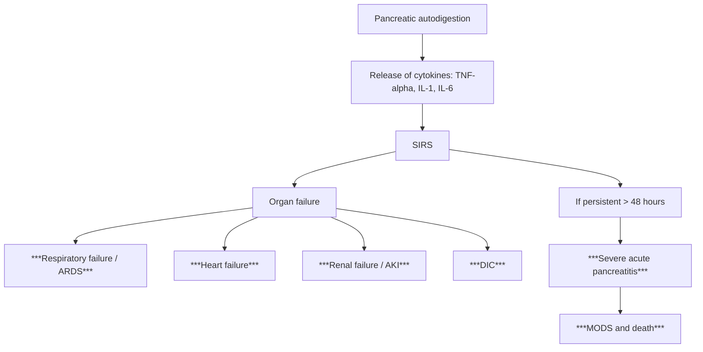

## Complications of Acute Pancreatitis

### Overview — The Natural History

The lecture slide gives a powerful snapshot of the clinical course [21]:

> ***Clinical course of acute pancreatitis (per 100 patients):***
> - ***70 patients with uneventful recovery (Mild pancreatitis)***
> - ***30 patients with complications***
>   - ***20 patients with prolonged hospital stay***
>   - ***10 patients died (Severe pancreatitis)*** [21]

So roughly **30%** of patients develop complications, and the overall mortality is about **10%**. This frames everything that follows — complications are common and can be lethal.

> ***Definition of severe pancreatitis: pancreatitis associated with organ failure and/or local complications e.g. necrosis, abscess formation, or pseudocyst*** [14]

Complications are broadly divided into **local** (things happening in and around the pancreas) and **systemic** (distant organ effects driven by the cytokine storm). I will explain each from first principles, connecting back to the pathophysiology.

---

### A. Local Complications

These arise because the pancreas sits in the retroperitoneum surrounded by vital structures (duodenum, CBD, splenic vessels, portal vein, SMA/SMV, colon, stomach). When autodigestion extends beyond the pancreas, it damages everything in its path.

***Local complications of acute pancreatitis*** [22]:
> 1. ***Pancreatic and/or peripancreatic necrosis and haemorrhage***
> 2. ***Pancreatic abscess***
> 3. ***Pseudocyst***
> 4. ***Gastric fistula***
> 5. ***Colonic fistula***
> 6. ***Duodenal fistula***
> 7. ***Duodenal obstruction***
> 8. ***Splenic vein thrombosis → left-sided portal hypertension***
> 9. ***SMV or SMA thrombosis → bowel infarction*** [22]

---

#### A1. Pancreatic Fluid Collections (Revised Atlanta Classification)

This is one of the most commonly tested topics. The key organising principle is a **2 × 2 matrix** — based on (1) whether necrosis is present and (2) whether it's early (< 4 weeks) or late (≥ 4 weeks) [2][3]:

| | **Interstitial oedematous pancreatitis (No necrosis)** | **Necrotising pancreatitis (Necrosis present)** |
|:---|:---|:---|
| **< 4 weeks** | **Acute Peripancreatic Fluid Collection (APFC)** | **Acute Necrotic Collection (ANC)** |
| **≥ 4 weeks** | ***Pancreatic Pseudocyst*** | **Walled-Off Necrosis (WON)** |

##### Acute Peripancreatic Fluid Collection (APFC) [3]

- **Timeline**: ***Early complication developing < 4 weeks*** after onset [3]
- **What it is**: Enzyme-rich fluid that leaks from the inflamed pancreas into the peripancreatic spaces
- **Key feature**: ***Does NOT have a well-defined wall*** — the fluid simply collects in anatomical spaces (lesser sac, anterior pararenal space) [3]
- **Imaging**: Anechoic collection on USG; fluid-density collection without a capsule on CT
- **Clinical significance**: ***Usually remains asymptomatic and resolves spontaneously*** without the need for drainage [3]
- **Management**: ***Observation — resolves within 7–10 days*** [3]

**Why does it resolve?** The inflammatory exudate is reabsorbed by the peritoneum and lymphatics as the acute inflammation settles. Intervention would introduce infection risk into a sterile, self-resolving process.

##### Pancreatic Pseudocyst [3][2][20]

"Pseudo" = false (Greek) — this is a "false cyst" because it lacks an epithelial lining (true cysts are lined by epithelium). It's walled by inflammatory fibrosis instead.

- **Timeline**: ***Late complication developing > 4 weeks*** after onset [3]
- **Definition**: ***Encapsulated collection of fluid with a well-defined inflammatory wall (without epithelial cells), usually outside the pancreas, with minimal or no necrosis*** [3]
- **Pathophysiology**: Pancreatic ductal disruption (partial or complete) → pancreatic juice leaks into the peripancreatic space → over weeks, the body walls off this fluid with granulation tissue and fibrosis → a defined "pseudocyst" forms
- **Risk factors**: ***Chronic pancreatitis > acute pancreatitis*** [2] — because ductal disruption is more common with chronic duct damage
- **Clinical features** [2]:
  - ***Persistent epigastric pain*** — the collection causes pressure on surrounding structures
  - ***Mass effect***: gastric outlet obstruction (GOO — the pseudocyst compresses the stomach/duodenum), ***obstructive jaundice*** (compresses the CBD)
  - Palpable epigastric mass on examination
- **Investigations**:
  - ***Amylase persistently elevated*** [2] — because the pseudocyst communicates with the pancreatic duct, so enzyme-rich fluid continuously leaks
  - ***CT abdomen with contrast***: well-defined, homogeneous, fluid-density collection with a distinct enhancing wall; NO solid component (unlike WON)
- **Management** [3][20]:
  - ***Observe — watchful waiting for 6 weeks*** to allow the wall to "mature" (thicken and become strong enough to hold sutures/stents). ***50% resolve spontaneously*** [2].
  - ***If cyst > 5 cm by 6 weeks → internal drainage*** [20]:
    - ***Cystogastrostomy (endoscopic or operative)*** — creates an opening between the pseudocyst and the stomach [20]
    - ***Cystoduodenostomy (operative)*** [20]
    - ***Cystojejunostomy (operative)*** — Roux-en-Y [20]
    - ***EUS-guided cystogastrostomy is first-line*** [2]
  - ***If cyst develops complications (e.g. bleeding, rupture, infection, obstruction) → external drainage*** [20]

<Callout title="Pseudocyst vs WON — The Critical Distinction">
A **pseudocyst** contains purely liquid (pancreatic juice) with NO necrotic debris. A **WON** contains solid necrotic material mixed with fluid. This distinction matters because pseudocysts can be drained with a simple stent, whereas WON may require necrosectomy (debridement of solid debris) in addition to drainage. CT or MRI can differentiate them — look for solid content within the collection.
</Callout>

##### Acute Necrotic Collection (ANC) [3]

- **Timeline**: ***Early complication developing < 4 weeks*** [3]
- **Definition**: ***Collection containing variable amounts of both fluid and necrosis*** associated with necrotising pancreatitis, ***with no defined wall*** [3]
- **Content**: ***Mix of semisolid and solid material*** — non-viable pancreatic parenchyma [2]
- **Key feature**: ***Necrosis can involve the pancreatic parenchyma or the peripancreatic tissues*** [3]
- **Imaging**: Heterogeneous collection on CT (mixture of fluid and non-enhancing solid tissue); no capsule
- **Management**: Usually conservative unless infected (see step-up approach in management section)

##### Walled-Off Necrosis (WON) [3][2]

- **Timeline**: ***Late complication developing > 4 weeks*** [3]
- **Definition**: ***Mature and encapsulated collection of pancreatic or peripancreatic necrosis that has developed a well-defined inflammatory wall*** [3]
- **Key feature**: Contains **solid necrotic debris** within a wall — this is what distinguishes it from a pseudocyst
- **Clinical features** [2]:
  - ***Mass effect***: ***palpable mass, GOO, obstructive jaundice*** [2]
- **Imaging**: ***CT abdomen with contrast — well-defined wall, can be intra-pancreatic or extra-pancreatic*** [2]; heterogeneous content (solid + liquid)
- **Management** [2]:
  - ***EUS/ERCP-guided transmural drainage ± necrosectomy (first-line)*** [2]
  - Percutaneous drainage (higher recurrence rate, risk of pancreatocutaneous fistula) [2]
  - ***Surgical debridement (open/lap) with external/internal drainage*** [2]

---

#### A2. Pancreatic Necrosis (Necrotising Pancreatitis) [3]

This is the most feared local complication and the main driver of mortality.

- **Definition**: ***Inflammation associated with pancreatic parenchymal necrosis or peripancreatic necrosis*** [3]
- **Pathophysiology**: Two mechanisms converge:
  1. ***Autodigestion*** — activated enzymes (trypsin, elastase, lipase) directly destroy pancreatic tissue [3]
  2. ***Hypoperfusion*** — volume depletion → pancreatic ischaemia → infarction. ***Reasons for progression: hypoperfusion of pancreas + persistent ampullary obstruction by stone*** [10]
- **Diagnosis**: ***Contrast-enhanced CT*** — necrotic areas show ***hypoenhancement*** (they have lost their blood supply and cannot take up contrast) [2]. ***Gas*** within necrotic areas on CT is ***suggestive of infected necrosis*** [3].

##### Sterile vs Infected Necrosis

| | Sterile Necrosis | Infected Necrosis |
|:--|:---|:---|
| **Frequency** | More common initially | ***Occurs in 5–10% of cases*** [3]; typically develops in week 2–4 |
| **Mechanism** | Direct enzyme damage + ischaemia | Gut bacterial translocation (mucosal barrier breakdown → *E. coli, Klebsiella* → colonise necrotic tissue) |
| **Diagnosis** | Non-enhancing areas on CT; no gas | Gas in necrosis on CT; clinical deterioration; ***FNA is the gold standard for diagnosing infected necrosis but is rarely necessary since treatment is based on clinical status and blood culture*** [3] |
| **Management** | Conservative (supportive) unless symptomatic | Step-up approach: IV carbapenem → drainage → delayed necrosectomy |

<Callout title="Why Does Necrosis Get Infected?">
Recall the pathophysiology: volume depletion → hypoperfusion of gut → mucosal barrier breakdown → bacterial translocation → endotoxaemia [9]. The bacteria (especially enteric Gram-negatives) seed into the avascular necrotic tissue, which has no blood supply to deliver immune cells or antibiotics. This is why: (1) carbapenems are chosen specifically for their ability to penetrate necrotic tissue, and (2) prevention of necrosis through aggressive fluid resuscitation is so critical.
</Callout>

---

#### A3. Peripancreatic Vascular Complications

The pancreas is surrounded by major vessels (splenic artery/vein, GDA, SMA/SMV, portal vein). Inflammation and enzyme leakage erode into these structures.

##### Splanchnic Venous Thrombosis [3][22]

- **Vessels affected**: ***Splenic vein***, ***portal vein***, or ***superior mesenteric vein (SMV)*** [3]
- **Mechanism**: Inflammatory phlebitis — the inflamed pancreas directly irritates the adjacent vein wall → endothelial injury → thrombosis (Virchow's triad: endothelial damage + stasis from compression + hypercoagulability from inflammation)
- **Consequences**:
  - ***Splenic vein thrombosis → left-sided (sinistral) portal hypertension*** [22] — this is a classic exam point. The splenic vein drains into the portal vein; when it's occluded, blood backs up through the short gastric veins → gastric fundal varices (NOT oesophageal varices, because the portal vein itself may be patent). Isolated gastric varices in a non-cirrhotic patient should prompt you to think of splenic vein thrombosis from pancreatitis.
  - ***SMV or SMA thrombosis → bowel infarction*** [22] — compromise of bowel perfusion → mesenteric ischaemia → gangrene
  - Portal vein thrombosis → ***hepatic decompensation*** [3]
- **Management**: ***Treatment should focus on the underlying pancreatitis as effective treatment may result in spontaneous resolution of thrombosis*** [3]. Anticoagulation is considered on a case-by-case basis (risk of haemorrhage in necrotic pancreatitis vs risk of bowel infarction from clot propagation).

##### Pseudoaneurysm [3][2]

"Pseudo" = false; "aneurysm" = dilation of a blood vessel. A pseudoaneurysm is NOT a true aneurysm (which involves all three vessel wall layers). It's a contained rupture — pancreatic enzymes (especially elastase) erode through the arterial wall, and blood is contained only by the adventitia and surrounding tissues.

- **Frequency**: ***Rare but serious complication***, ***most common in patients with necrotising pancreatitis*** [3]
- **Arteries commonly involved**: ***Gastroduodenal artery (GDA), left gastric artery, and splenic artery*** [3] — these arteries run in close proximity to the pancreas
  - ***Pancreatic pseudo-aneurysm: erosion into artery (especially GDA)*** [2]
- **Danger**: ***Rupture is a life-threatening emergency*** [3] — massive intra-abdominal or GI haemorrhage
- **Three clinical features suggesting pseudoaneurysm** [3]:
  1. ***Unexplained GI bleeding***
  2. ***Drop in haemoglobin (Hb) or haematocrit***
  3. ***Sudden expansion of a pancreatic fluid collection***
- **Diagnosis and Management**: ***Angiography is the first step — both diagnostic and therapeutic*** [3] (can embolise with radiological coils)
- **Critical safety rule**: ***Pseudoaneurysms are an ABSOLUTE contraindication to endoscopic drainage unless arterial embolisation is performed first*** [3] — ***Severe and fatal haemorrhage can occur following endoscopic drainage in patients with an unsuspected pseudoaneurysm*** [3]

---

#### A4. Fistulae [22]

Activated enzymes erode through the walls of adjacent hollow viscera:

| Fistula Type | Mechanism | Clinical Consequence |
|:-------------|:----------|:---------------------|
| ***Gastric fistula*** [22] | Enzyme erosion through the posterior gastric wall (which lies directly anterior to the pancreas) | GI bleeding, peritonitis |
| ***Colonic fistula*** [22] | Erosion into the transverse colon (which runs anterior to the pancreatic body) | Faeculent drainage, sepsis |
| ***Duodenal fistula*** [22] | Erosion into the C-loop of the duodenum (which cradles the pancreatic head) | Duodenal content leak, sepsis |

These are uncommon but severe complications, usually associated with necrotising pancreatitis. Management is typically conservative initially (NPO, TPN, drainage), with surgery reserved for failures.

---

#### A5. Duodenal Obstruction [22]

- ***Duodenal obstruction*** [22] — the inflamed/necrotic pancreatic head or a pseudocyst compresses the duodenum (C-loop), causing gastric outlet obstruction
- Symptoms: persistent vomiting, inability to tolerate oral intake, gastric distension
- Management: NG decompression, treat underlying pancreatitis, endoscopic duodenal stenting if persistent, surgical bypass (gastrojejunostomy) rarely needed

---

#### A6. Pancreatic Duct Disruption and Pancreatic Ascites

- **Mechanism**: Complete disruption of the main pancreatic duct (from necrosis or trauma) → pancreatic juice leaks freely into the peritoneal cavity → pancreatic ascites
- **Clinical features**: Progressive abdominal distension, shifting dullness
- **Diagnosis**: Ascitic fluid amylase is **massively elevated** (typically > 1000 U/L); protein is usually > 25 g/L (exudative)
- **Management**: ERCP with pancreatic duct stenting to bridge the disruption; surgical repair if ERCP fails

---

#### A7. Pancreatic Exocrine and Endocrine Insufficiency [2]

When significant pancreatic parenchyma is destroyed:

| Insufficiency | Threshold | Clinical Features | Mechanism |
|:-------------|:----------|:------------------|:----------|
| **Exocrine** | < 10% of exocrine function remaining | ***Steatorrhoea*** (fatty, malodorous, floating stools), malnutrition, fat-soluble vitamin deficiency (A, D, E, K → night blindness, osteoporosis, coagulopathy) | Loss of acinar cells → inadequate production of lipase, amylase, proteases → maldigestion of fats, carbohydrates, proteins |
| **Endocrine** | Islet cell mass destruction | ***Diabetes mellitus*** (hyperglycaemia), also risk of hypoglycaemia | Loss of β-cells → insulin deficiency; loss of α-cells → glucagon deficiency (risk of brittle diabetes with hypoglycaemia) |

<Callout title="Exocrine Before Endocrine" type="idea">
The exocrine pancreas is more vulnerable than the endocrine pancreas. Acinar cells (exocrine) are destroyed first because they directly produce the enzymes causing autodigestion. The islets of Langerhans (endocrine) are more resistant to injury — they are scattered islands surrounded by connective tissue that provides some protection. This is why steatorrhoea develops before diabetes in the course of progressive pancreatic destruction.
</Callout>

---

### B. Systemic Complications

Systemic complications are driven by the **cytokine storm** — the same NF-κB-dependent inflammatory cascade (TNF-α, IL-1, IL-6) that we discussed in pathophysiology. These cytokines enter the bloodstream and cause distant organ injury.

***Systemic Complications of acute pancreatitis*** [23]:

> 1. ***Heart failure***
> 2. ***Respiratory failure***
> 3. ***Renal failure***
> 4. ***Cholestasis***
> 5. ***DIC***
> 6. ***Hyperglycaemia***
> 7. ***Hypocalcaemia*** [23]

Let me explain each from first principles:

| Complication | Pathophysiology | Clinical Features | Management |
|:-------------|:---------------|:------------------|:-----------|
| ***Respiratory failure / ARDS*** [23][3] | Cytokines (TNF-α, IL-6) → pulmonary capillary endothelial damage → increased permeability → non-cardiogenic pulmonary oedema. Also: pleural effusions (transdiaphragmatic lymphatic drainage), diaphragmatic splinting from adjacent inflammation. Phospholipase A2 destroys surfactant. | Dyspnoea, hypoxaemia (PaO₂ < 60 mmHg), bilateral infiltrates on CXR, PaO₂/FiO₂ ≤ 300 | O₂ supplementation → mechanical ventilation; PEEP; lung-protective ventilation strategy |
| ***Heart failure*** [23][3] | (1) Myocardial depressant factors (TNF-α, IL-1 directly depress myocardial contractility). (2) High-output failure from SIRS-driven vasodilation. (3) Hypovolaemia → cardiogenic shock in severe cases. | Hypotension, tachycardia, elevated CVP, pulmonary oedema | Fluid resuscitation, inotropes (dobutamine), vasopressors (noradrenaline) |
| ***Renal failure / AKI*** [23][3] | (1) Prerenal: hypovolaemia from massive third-spacing → reduced renal perfusion. (2) Intrinsic: cytokine-mediated tubular injury, myoglobinuria if compartment syndrome develops. (3) Abdominal compartment syndrome → renal vein compression. | Oliguria, rising creatinine/BUN, metabolic acidosis | Aggressive IV fluids; if refractory → haemodialysis [2] |
| ***DIC*** [23][2] | Massive tissue damage → release of tissue factor → systemic activation of coagulation cascade → consumption of clotting factors and platelets → paradoxical bleeding AND thrombosis. "Disseminated" = widespread, "Intravascular" = inside vessels, "Coagulation" = clotting. | Bleeding from puncture sites, petechiae, oozing; lab: ↑PT/APTT, ↓fibrinogen, ↑D-dimer, ↓platelets, schistocytes on film | Treat the underlying cause (pancreatitis); supportive: FFP, cryoprecipitate, platelet transfusion |
| ***Cholestasis*** [23] | Oedema of the pancreatic head compresses the intrapancreatic portion of the CBD → obstructive jaundice | Jaundice, dark urine, pale stools, ↑ALP/GGT/conjugated bilirubin | Usually resolves as pancreatic oedema settles; ERCP if persistent |
| ***Hyperglycaemia*** [23][3] | Islet cell damage (β-cell destruction → insulin deficiency) + stress response (cortisol, glucagon, catecholamines → counter-regulatory hyperglycaemia) | Polyuria, polydipsia, elevated blood glucose; may progress to DKA or HHS | Insulin (sliding scale or infusion); avoid over-correction |
| ***Hypocalcaemia*** [23][3] | (1) Fat saponification — lipase causes fat necrosis → released fatty acids bind calcium → insoluble calcium soaps. (2) Hypoalbuminaemia from third-spacing → reduced total (but not necessarily ionised) calcium. (3) Possible ↓PTH response. | Tetany (Chvostek's sign, Trousseau's sign), perioral paraesthesia, prolonged QTc → risk of arrhythmia | IV calcium gluconate (10 mL of 10% solution); monitor ionised calcium and ECG |

**Additional systemic complications** [3]:

| Complication | Pathophysiology |
|:-------------|:---------------|
| ***Paralytic ileus*** [3] | Retroperitoneal inflammation → reflex inhibition of peristalsis via splanchnic nerves. The bowel "shuts down" as a protective mechanism. |
| ***Abdominal compartment syndrome*** [3][2] | Massive retroperitoneal oedema + ascites + ileus → markedly elevated intra-abdominal pressure (IAP > 20 mmHg with new organ failure) → compresses IVC (↓venous return → shock), renal veins (↓renal perfusion → AKI), diaphragm (↓ventilation → respiratory failure). A devastating complication requiring ***measurement of IAP*** [2] and potentially decompressive laparotomy. |
| ***Retroperitoneal bleeding*** [3] | Elastase erosion of retroperitoneal blood vessels → haemorrhage tracking to produce Cullen's/Grey Turner's/Fox's signs |

---

### C. Organ Failure and SIRS [3]

***Systemic inflammatory response syndrome (SIRS)*** — ***Pancreatic inflammation results in activation of a cytokine cascade that manifests clinically as SIRS*** [3]

The connection from local pancreatic inflammation to systemic organ failure:

***Organ failure may present as shock, acute respiratory failure, and renal failure*** [3]

The Modified Marshall Score defines organ failure (score ≥ 2 in any system):
- **Respiratory**: PaO₂/FiO₂ ≤ 300
- **Cardiovascular**: SBP < 90 mmHg not responding to fluids
- **Renal**: Creatinine ≥ 170 μmol/L

**Persistent organ failure ( > 48 hours)** = severe pancreatitis = 15–40% mortality.

---

### D. Temporal Framework of Complications

Understanding the timeline helps predict what complication to expect and when:

| Time | Phase | Complications |
|:-----|:------|:-------------|
| **Days 1–7** | Early inflammatory phase | SIRS, organ failure (ARDS, AKI, shock), APFC, ANC, paralytic ileus, electrolyte derangement (hypocalcaemia, hyperglycaemia) |
| **Weeks 2–4** | Transitional phase | Infected necrosis (peak incidence weeks 2–4 from bacterial translocation), persistent organ failure, splanchnic venous thrombosis, pseudoaneurysm |
| **> 4 weeks** | Late phase | Pseudocyst, WON, chronic pancreatic insufficiency (exocrine → endocrine), pancreatic duct stricture, fistulae |

<Callout title="The Two Peaks of Mortality in Acute Pancreatitis" type="error">
**Early mortality (week 1)**: Driven by SIRS and multi-organ failure from the cytokine storm — this is "sterile" and cannot be prevented by antibiotics.
**Late mortality (weeks 2–6)**: Driven by infected necrosis and sepsis from bacterial translocation — this is where antibiotics (carbapenems) and the step-up approach play their role. Understanding these two distinct mortality peaks explains why the management approach differs in the early vs late phases.
</Callout>

---

### E. Long-Term Sequelae

Even after recovery from acute pancreatitis, patients are at risk of:

| Sequela | Mechanism | Prevention |
|:--------|:----------|:-----------|
| **Recurrent pancreatitis** | Untreated aetiology (persistent gallstones, ongoing alcohol use) | Cholecystectomy for gallstone pancreatitis; alcohol abstinence counselling |
| **Chronic pancreatitis** | Repeated episodes of acute inflammation → fibrosis → ductal changes → calcification | Alcohol cessation; smoking cessation |
| **Pancreatic cancer** | Chronic inflammation is a risk factor for pancreatic ductal adenocarcinoma (2% lifetime risk with chronic pancreatitis) | Surveillance in high-risk patients; smoking/alcohol cessation |
| **Diabetes mellitus** | Permanent β-cell destruction from necrosis | Monitor blood glucose long-term; insulin as needed |

---

<Callout title="High Yield Summary">

**Local complications (Revised Atlanta classification of fluid collections):**
- **< 4 weeks, no necrosis**: APFC → observe (resolves in 7–10 days)
- **< 4 weeks, necrosis**: ANC → conservative unless infected
- **≥ 4 weeks, no necrosis**: Pseudocyst → observe 6 weeks, drain if > 5 cm and symptomatic (cystogastrostomy)
- **≥ 4 weeks, necrosis**: WON → EUS-guided drainage ± necrosectomy

**Vascular complications:**
- Splenic vein thrombosis → ***left-sided portal hypertension*** (isolated gastric varices)
- SMV/SMA thrombosis → ***bowel infarction***
- Pseudoaneurysm (GDA, splenic, left gastric) → ***ABSOLUTE contraindication to drainage until embolised***

**Infected necrosis** (5–10%): gas on CT is suggestive; step-up approach (antibiotics → drainage → delayed necrosectomy)

**Systemic complications** (from cytokine storm): ***ARDS, heart failure, renal failure, DIC, cholestasis, hyperglycaemia, hypocalcaemia***

**Two mortality peaks**: Early (week 1) = SIRS/organ failure; Late (weeks 2–6) = infected necrosis/sepsis

**Fistulae**: gastric, colonic, duodenal — from enzyme erosion into adjacent hollow viscera

**Long-term**: risk of chronic pancreatitis, diabetes, pancreatic cancer

</Callout>

---

<ActiveRecallQuiz
  title="Active Recall - Complications of Acute Pancreatitis"
  items={[
    {
      question: "Draw out the Revised Atlanta classification for pancreatic fluid collections as a 2x2 table. Name each entity and state the key distinguishing feature between a pseudocyst and walled-off necrosis.",
      markscheme: "Rows: less than 4 weeks vs 4 or more weeks. Columns: no necrosis (interstitial oedematous) vs necrosis present (necrotising). Less than 4 weeks, no necrosis = APFC; less than 4 weeks, necrosis = ANC; 4 or more weeks, no necrosis = pseudocyst; 4 or more weeks, necrosis = WON. Key distinction: pseudocyst contains purely liquid (no solid necrotic debris) whereas WON contains solid necrotic material within an inflammatory wall. This matters because WON may require necrosectomy in addition to drainage."
    },
    {
      question: "Explain why splenic vein thrombosis in pancreatitis causes isolated gastric varices rather than oesophageal varices.",
      markscheme: "The splenic vein runs along the posterior surface of the pancreas and is vulnerable to inflammatory thrombosis. When occluded, blood from the spleen cannot drain normally into the portal vein. It reroutes through the short gastric veins into the gastric fundal venous plexus, causing isolated gastric fundal varices. The portal vein itself remains patent, so there is no portal hypertension in the liver or oesophageal venous system. This is called left-sided (sinistral) portal hypertension."
    },
    {
      question: "List the 7 systemic complications of acute pancreatitis from the lecture slides and explain the pathophysiology of hypocalcaemia.",
      markscheme: "Seven systemic complications: (1) Heart failure, (2) Respiratory failure, (3) Renal failure, (4) Cholestasis, (5) DIC, (6) Hyperglycaemia, (7) Hypocalcaemia. Hypocalcaemia mechanism: pancreatic lipase causes peripancreatic fat necrosis, releasing fatty acids that bind (saponify/precipitate with) ionised calcium to form insoluble calcium soaps. Additionally, hypoalbuminaemia from third-spacing reduces total calcium. May also involve decreased PTH response."
    },
    {
      question: "A patient with necrotising pancreatitis develops unexplained GI bleeding and a sudden drop in haemoglobin. What complication should you suspect, how do you diagnose it, and what is the critical management caveat?",
      markscheme: "Suspect pseudoaneurysm (most commonly GDA, splenic, or left gastric artery). Diagnose with angiography (both diagnostic and therapeutic — can embolise with coils). Critical caveat: pseudoaneurysm is an ABSOLUTE contraindication to endoscopic drainage of any adjacent pancreatic fluid collection until arterial embolisation is performed first, because drainage can rupture the pseudoaneurysm causing fatal haemorrhage."
    },
    {
      question: "Explain the two peaks of mortality in acute pancreatitis and how they differ in mechanism and management.",
      markscheme: "Early peak (week 1): driven by SIRS and multi-organ failure from the cytokine storm (TNF-alpha, IL-6). This is sterile inflammation — antibiotics do NOT help. Management: aggressive fluid resuscitation, organ support in ICU. Late peak (weeks 2-6): driven by infected pancreatic necrosis from bacterial translocation (gut mucosal barrier breakdown from hypoperfusion allows enteric organisms to colonise necrotic tissue). Management: IV carbapenems, step-up approach (drainage then delayed necrosectomy)."
    },
    {
      question: "What is abdominal compartment syndrome in the context of acute pancreatitis, and how is it diagnosed?",
      markscheme: "Massive retroperitoneal oedema, ascites, and paralytic ileus cause markedly elevated intra-abdominal pressure (IAP). Defined as IAP greater than 20 mmHg with new organ failure. Diagnosed by measuring IAP via bladder pressure (Foley catheter transducer). Consequences: compression of IVC (reduced venous return, shock), renal veins (AKI), diaphragm (respiratory failure). May require decompressive laparotomy."
    }
  ]}
/>

---

## References

[2] Senior notes: maxim.md (Acute pancreatitis section)
[3] Senior notes: felixlai.md (Acute pancreatitis section)
[9] Lecture slides: Acute pancreatitis.pdf (p6 — Acute oedematous pancreatitis progression)
[10] Lecture slides: Acute pancreatitis.pdf (p7 — Reasons for progression to necrotising pancreatitis)
[14] Lecture slides: Acute pancreatitis.pdf (p11 — Definition of severe pancreatitis)
[20] Lecture slides: Acute pancreatitis.pdf (p44/p49 — Treatment strategy for pancreatic pseudocyst)
[21] Lecture slides: Acute pancreatitis.pdf (p2 — Clinical course of acute pancreatitis)
[22] Lecture slides: Acute pancreatitis.pdf (p18 — Local complications of acute pancreatitis)
[23] Lecture slides: Acute pancreatitis.pdf (p19 — Systemic complications of acute pancreatitis)
