## Differential Diagnosis of Acute Pancreatitis

The differential diagnosis of acute pancreatitis is essentially the differential of **severe acute epigastric pain** — and it's a critical list because misdiagnosis can be fatal. The reason the DDx is broad is that the epigastrium is a "crossroads" — it overlays the stomach, duodenum, pancreas, biliary tree, transverse colon, aorta, and even receives referred pain from the heart and lungs. You need a ***high level of clinical suspicion*** [11] and must systematically exclude dangerous mimics.

The approach to the DDx should be organ-system-based, thinking about what structures lie in the epigastrium and upper abdomen, plus any extra-abdominal causes that can refer pain there.

---

### Organising Framework

```mermaid
flowchart TD
    A["Acute Epigastric Pain"] --> B["Hepatobiliary"]
    A --> C["Gastroduodenal"]
    A --> D["Pancreatic"]
    A --> E["Vascular"]
    A --> F["Intestinal"]
    A --> G["Cardiac"]
    A --> H["Medical / Metabolic"]
    B --> B1["Choledocholithiasis"]
    B --> B2["Acute cholangitis"]
    B --> B3["Acute cholecystitis"]
    B --> B4["Hepatitis"]
    C --> C1["Peptic ulcer disease"]
    C --> C2["Perforated peptic ulcer"]
    D --> D1["Acute pancreatitis"]
    D --> D2["Pancreatic cancer"]
    D --> D3["Chronic pancreatitis flare"]
    E --> E1["Mesenteric ischaemia"]
    E --> E2["Ruptured AAA"]
    F --> F1["Intestinal obstruction"]
    G --> G1["Acute myocardial infarction"]
    G --> G2["Pericarditis"]
    H --> H1["DKA"]
    H --> H2["Hypercalcaemia"]
```

---

### Detailed Differential Diagnosis

The conditions listed below are taken from the senior notes [3][2] and supplemented with additional important mimics. For each, I explain *why* it mimics pancreatitis and the key distinguishing features.

#### 1. Peptic Ulcer Disease (PUD) [3]

- **Why it mimics pancreatitis**: Epigastric pain, nausea, vomiting. A posterior duodenal ulcer can even penetrate into the pancreas itself, causing a secondary pancreatitis and elevated amylase.
- **Key distinguishing features**:
  - PUD pain classically has a relationship with food (gastric ulcer = worsened by eating; duodenal ulcer = relieved by eating, worse on empty stomach — "hunger pain")
  - PUD pain is typically burning and more superficial; pancreatitis pain is deep, boring, and radiates to the back
  - No significant elevation of amylase/lipase to ≥ 3× ULN in uncomplicated PUD
  - Endoscopy (OGD) is diagnostic for PUD

#### 2. Perforated Peptic Ulcer (PPU) [2][12]

- **Why it mimics pancreatitis**: Sudden severe epigastric pain. Perforated duodenal ulcer fluid can track down the right paracolic gutter and even irritate the pancreas, causing secondary hyperamylasaemia.
- ***PPU is a key DDx because serum amylase can be elevated (false positive for pancreatitis)*** [2] — gastric/duodenal contents leaking into the peritoneum contain salivary amylase, and peritoneal irritation causes amylase reabsorption.
- **Key distinguishing features**:
  - PPU causes **sudden onset** "thunderclap" pain (the moment of perforation), whereas pancreatitis builds up over hours
  - ***Board-like rigidity and generalised peritonism*** — PPU causes chemical peritonitis from free gastric acid. In pancreatitis (retroperitoneal), peritoneal signs are often less marked initially.
  - ***CXR shows free air under the diaphragm (pneumoperitoneum)*** — this is absent in pancreatitis [2]
  - Valentino's sign: gastric contents from a PPU can track down to the RLQ, mimicking appendicitis [6]
  - CT abdomen with contrast is indicated when the ***diagnosis is uncertain (DDx PPU, gangrenous cholecystitis, ischaemic bowel)*** [2]

<Callout title="PPU vs Pancreatitis — The Amylase Trap" type="error">
Elevated serum amylase does NOT automatically mean pancreatitis. PPU, ruptured AAA, DKA, bowel ischaemia, and macroamylasaemia can all cause a raised amylase. Always check a CXR for pneumoperitoneum (erect or lateral decubitus) before committing to a diagnosis of pancreatitis. Serum lipase is more specific for pancreatitis.
</Callout>

#### 3. Choledocholithiasis / Acute Cholangitis [3][12]

- **Why it mimics pancreatitis**: RUQ/epigastric pain, jaundice, deranged LFTs. In fact, gallstone pancreatitis and cholangitis frequently *coexist* — a stone at the ampulla can cause both simultaneously.
- **Key distinguishing features**:
  - ***Charcot's triad*** (fever + abdominal pain + jaundice) or ***Reynolds' pentad*** (+ hypotension + confusion) points towards cholangitis [12]
  - Cholangitis presents with a predominantly **cholestatic** LFT pattern (↑ALP, ↑GGT, ↑conjugated bilirubin) with less dramatic transaminase rise
  - In pancreatitis, amylase/lipase ≥ 3× ULN is the hallmark; in cholangitis, amylase may be mildly elevated but usually < 3× ULN unless there is concurrent pancreatitis
  - USG shows dilated CBD (> 6 mm, or > 10 mm post-cholecystectomy) with possible stone visible
  - **Important**: if both cholangitis and pancreatitis are present (gallstone pancreatitis with cholangitis), ***ERCP within 24–72 hours*** is indicated [2]

#### 4. Acute Cholecystitis [3][12]

- **Why it mimics pancreatitis**: RUQ pain (which can radiate to the epigastrium), fever, nausea/vomiting, leukocytosis, and even mildly elevated amylase.
- **Key distinguishing features**:
  - Pain is predominantly **RUQ**, not epigastric. Positive ***Murphy's sign*** (inspiratory arrest on palpation of RUQ) — this sign is absent in pancreatitis
  - ***Biliary colic*** (gallbladder contraction against an impacted stone) lasts < 6 hours and resolves; cholecystitis pain persists > 6 hours with systemic inflammation [12]
  - USG shows gallbladder wall thickening (> 3 mm), pericholecystic fluid, distended gallbladder, and positive sonographic Murphy's sign
  - Amylase/lipase are usually normal or only mildly elevated in isolated cholecystitis

#### 5. Hepatitis [3]

- **Why it mimics pancreatitis**: Epigastric / RUQ pain, nausea, vomiting, jaundice, malaise. Acute viral hepatitis (especially HAV/HBV/HEV) can present with significant abdominal pain.
- **Key distinguishing features**:
  - **Hepatocellular** LFT pattern: massively elevated transaminases (ALT/AST often > 1000 U/L) with bilirubin rise; in pancreatitis, transaminases are only mildly elevated (in gallstone pancreatitis ALT may rise to a few hundred, but not thousands)
  - Viral serology (HBsAg, anti-HAV IgM, anti-HEV IgM) is diagnostic
  - Amylase/lipase are normal in hepatitis
  - Prodromal symptoms (fever, arthralgia, rash in HBV) may precede jaundice

#### 6. Mesenteric Ischaemia [3]

- **Why it mimics pancreatitis**: Severe epigastric/periumbilical pain, often out of proportion to physical findings (classically "pain out of proportion to exam"), nausea, vomiting, and can cause elevated amylase (from ischaemic bowel releasing amylase).
- **Key distinguishing features**:
  - Mesenteric ischaemia classically occurs in **elderly patients** with **atrial fibrillation** (embolic) or **atherosclerotic risk factors** (thrombotic), or post-prandially ("intestinal angina" in chronic mesenteric ischaemia)
  - ***Pain out of proportion to physical examination*** is the hallmark — the abdomen is initially soft with minimal tenderness despite agonising pain. In pancreatitis, there is usually epigastric tenderness on examination.
  - Metabolic (lactic) acidosis develops early
  - CT angiography shows mesenteric vessel occlusion or bowel wall changes (pneumatosis, portal venous gas)
  - CT abdomen with contrast is indicated when ***the diagnosis is uncertain (DDx PPU, gangrenous cholecystitis, ischaemic bowel)*** [2]

<Callout title="Mesenteric Ischaemia — The Silent Killer" type="error">
This is one of the most dangerous misdiagnoses. If you have an elderly AF patient with severe abdominal pain and a relatively benign abdominal exam, think mesenteric ischaemia FIRST. Don't anchor on "probably pancreatitis" just because the amylase is a bit raised — ischaemic bowel also raises amylase.
</Callout>

#### 7. Intestinal Obstruction [3]

- **Why it mimics pancreatitis**: Abdominal pain, vomiting, distension. Small bowel obstruction can cause a mildly elevated amylase (from mucosal ischaemia and reabsorption).
- **Key distinguishing features**:
  - Pain in obstruction is classically **colicky** (comes and goes in waves) — pancreatitis pain is **constant**
  - **Absolute constipation** (no flatus, no stool) in complete obstruction — not a feature of pancreatitis
  - High-pitched, tinkling bowel sounds in mechanical obstruction vs ***hypoactive/absent bowel sounds in pancreatitis*** (paralytic ileus)
  - AXR shows dilated bowel loops with air-fluid levels in a stepladder pattern; in pancreatitis, you see ***sentinel loop sign*** and ***colonic cut-off sign*** instead [2]

#### 8. Myocardial Infarction (MI) [3]

This is the one you **must not miss**. It was specifically highlighted with an asterisk in the senior notes [3].

- **Why it mimics pancreatitis**: An ***inferior MI*** can present as epigastric pain, nausea, and vomiting — because the inferior surface of the heart (supplied by the RCA) sits on the diaphragm, referring pain to the epigastrium via shared T5–T9 visceral afferents.
- **Key distinguishing features**:
  - Risk factors for coronary artery disease (smoking, diabetes, hypertension, hyperlipidaemia, family history)
  - Pain is more commonly described as **crushing**, **pressure-like**, with radiation to the left arm, jaw, or neck — though atypical presentations (especially in diabetics, elderly, women) may lack these classic features
  - ***ECG*** changes (ST elevation/depression, new LBBB, pathological Q waves)
  - ***Cardiac markers (troponin TnI/TnT)*** are elevated — this is exactly why ***troponin ± ECG is part of the workup for acute pancreatitis***, to **exclude MI** as a differential [3]
  - Amylase/lipase are normal in MI (unless there is concurrent mesenteric ischaemia from cardiogenic shock)

> ***Cardiac markers ± ECG*** should be checked in every patient presenting with acute epigastric pain to ***exclude myocardial infarction (MI)*** as a differential diagnosis [3].

#### 9. Ruptured Abdominal Aortic Aneurysm (rAAA) [2]

- **Why it mimics pancreatitis**: Severe abdominal/back pain (AAA rupture into the retroperitoneum causes intense back pain, just like pancreatitis). Both conditions can cause Cullen's sign and Grey Turner's sign (both are causes of retroperitoneal haemorrhage) [12].
- ***False positive elevated amylase*** can occur in ruptured AAA [2].
- **Key distinguishing features**:
  - rAAA presents with the **classic triad**: abdominal pain + hypotension + pulsatile abdominal mass (though all three are present in only ~50%)
  - Age > 65, male, smoking history, known AAA
  - Haemodynamic instability is typically more dramatic and earlier than in pancreatitis
  - CT angiography is diagnostic (retroperitoneal haematoma, contrast extravasation)

#### 10. Diabetic Ketoacidosis (DKA) [2]

- **Why it mimics pancreatitis**: DKA commonly presents with abdominal pain, nausea, and vomiting. Additionally, ***DKA can cause a false positive elevated serum amylase*** [2].
- **Key distinguishing features**:
  - Known diabetic (or new presentation of T1DM), polyuria, polydipsia, fruity breath (ketone bodies)
  - Blood glucose markedly elevated, ketonaemia/ketonuria, metabolic acidosis with high anion gap
  - Amylase elevation in DKA is usually salivary (not pancreatic) in origin — **serum lipase** is a better discriminator (normal in DKA, elevated in pancreatitis)
  - Abdominal pain in DKA resolves with correction of ketoacidosis; if pain persists after correction, consider true pancreatitis (which can be precipitated by hypertriglyceridaemia in DKA)

#### 11. Other Important Differentials

| Condition | Why It Mimics Pancreatitis | Key Differentiator |
|:----------|:---------------------------|:-------------------|
| **Pericarditis** | Epigastric/chest pain, worse lying flat, better leaning forward (same postural relief as pancreatitis!) | Pericardial friction rub; diffuse ST elevation with PR depression on ECG; troponin may be mildly elevated; amylase normal |
| **Lower lobe pneumonia / Pleuritis** | Referred pain to the upper abdomen via the phrenic nerve (C3–5 innervation of diaphragm) | CXR shows consolidation; cough, dyspnoea, productive sputum; amylase normal |
| **Acute appendicitis (early)** | Early appendicitis causes periumbilical visceral pain (T10 dermatome) that can overlap with epigastric pain; ***Valentino's sign*** = PPU fluid tracking to RLQ mimicking appendicitis [6] | Pain migrates to RLQ as parietal peritoneum becomes involved; McBurney's point tenderness, Rovsing's sign; amylase normal |
| **Gastric volvulus** | Severe epigastric pain with retching | Borchardt's triad: severe epigastric pain, retching without vomiting, inability to pass NG tube; CXR/AXR show distended stomach |
| **Boerhaave's syndrome** | Oesophageal rupture after forceful vomiting → severe epigastric/chest pain, mediastinitis | History of vomiting preceding the pain; subcutaneous emphysema; CXR shows pneumomediastinum; elevated salivary amylase in pleural fluid |

---

### Key Investigations to Differentiate

The differential is narrowed efficiently by a few targeted investigations:

| Investigation | What It Rules In/Out |
|:--------------|:---------------------|
| ***Serum amylase/lipase ≥ 3× ULN*** | Confirms pancreatitis (but remember false positives: PPU, rAAA, DKA, macroamylasaemia) [2] |
| **Serum lipase** | More specific than amylase — helps exclude non-pancreatic causes of hyperamylasaemia |
| ***CXR (erect)*** | Pneumoperitoneum → PPU; consolidation → pneumonia; mediastinal air → Boerhaave's [2] |
| ***ECG + Troponin*** | Excludes MI [3] |
| **LFT pattern** | Cholestatic (↑ALP, ↑GGT, ↑bilirubin) → biliary cause; hepatocellular (↑↑ALT/AST) → hepatitis |
| **Blood glucose + ketones + ABG** | DKA |
| ***USG abdomen*** | Gallstones → biliary pancreatitis vs cholecystitis; dilated CBD → choledocholithiasis/cholangitis |
| ***CT abdomen with contrast*** | Gold standard when ***diagnosis is uncertain*** — differentiates pancreatitis, PPU, gangrenous cholecystitis, mesenteric ischaemia, rAAA [2] |

---

### Life-Threatening Conditions NOT to Miss

From the senior notes, the ***life-threatening DDx of acute abdomen*** [6] that overlap with pancreatitis presentation:

- ***Perforated viscus (PPU)***
- ***Ruptured AAA***
- ***Acute mesenteric ischaemia***
- ***Severe pancreatitis*** (itself)
- ***Acute MI***
- ***DKA***

These require immediate recognition and management. Every patient with acute epigastric pain should have, at minimum: ECG, CXR, amylase/lipase, LFT, troponin, blood glucose, and ABG.

---

### Summary Table: Key Differentiators at a Glance

| Diagnosis | Pain Character | Key Sign | Key Investigation | Amylase |
|:----------|:---------------|:---------|:------------------|:--------|
| **Acute pancreatitis** | Constant, boring, radiates to back, relieved leaning forward | Cullen's/Grey Turner's (late) | Lipase ≥ 3× ULN; CT with contrast | ↑↑↑ (≥ 3× ULN) |
| **PPU** | Sudden "thunderclap", generalised | Board-like rigidity, absent bowel sounds | CXR: pneumoperitoneum | ↑ (false positive) |
| **Acute cholecystitis** | RUQ, constant | Murphy's sign positive | USG: wall thickening, pericholecystic fluid | Normal / mild ↑ |
| **Cholangitis** | RUQ/epigastric | Charcot's triad | USG: dilated CBD; cholestatic LFTs | Normal / mild ↑ |
| **Mesenteric ischaemia** | Severe, diffuse, out of proportion to exam | Surprisingly soft abdomen | CT angiography; lactate ↑ | ↑ (false positive) |
| **Inferior MI** | Crushing, pressure | Diaphoresis, dyspnoea | ECG: ST changes; Troponin ↑ | Normal |
| **Ruptured AAA** | Back/abdominal, sudden | Pulsatile mass, hypotension | CT angiography | ↑ (false positive) |
| **DKA** | Diffuse, crampy | Kussmaul breathing, fruity breath | Glucose ↑↑, ketones ↑, AG metabolic acidosis | ↑ (false positive) |
| **Intestinal obstruction** | Colicky, waves | Distension, tinkling bowel sounds | AXR: dilated loops, air-fluid levels | Normal / mild ↑ |

---

<Callout title="High Yield Summary">

**DDx of acute pancreatitis** = DDx of acute epigastric pain. The major differentials from the notes and slides are:

1. **Peptic ulcer disease / PPU** — CXR for pneumoperitoneum; PPU causes false-positive amylase
2. **Choledocholithiasis / Cholangitis / Cholecystitis** — cholestatic LFTs, Murphy's sign, USG
3. **Hepatitis** — massively elevated transaminases, viral serology
4. **Mesenteric ischaemia** — pain out of proportion, AF patient, CT angiography
5. **Intestinal obstruction** — colicky pain, absolute constipation, dilated loops on AXR
6. ***Myocardial infarction*** — ECG + troponin must be checked in ALL patients with epigastric pain
7. **Ruptured AAA** — pulsatile mass, hypotension, retroperitoneal haemorrhage (same Cullen's/Grey Turner's)
8. **DKA** — glucose, ketones, ABG

**Key principle**: Serum lipase is more specific than amylase for pancreatitis. Always check CXR (to exclude PPU), ECG + troponin (to exclude MI), and consider CT with contrast when the diagnosis is uncertain.

</Callout>

---

<ActiveRecallQuiz
  title="Active Recall - Differential Diagnosis of Acute Pancreatitis"
  items={[
    {
      question: "Name 6 important differential diagnoses for acute pancreatitis as listed in the senior notes.",
      markscheme: "Peptic ulcer disease, choledocholithiasis/cholangitis/cholecystitis, hepatitis, mesenteric ischaemia, intestinal obstruction, and myocardial infarction. Also accept: PPU, ruptured AAA, DKA."
    },
    {
      question: "Why must an ECG and troponin be performed in every patient presenting with epigastric pain suspected to be pancreatitis?",
      markscheme: "To exclude acute myocardial infarction (especially inferior MI), which can present with epigastric pain, nausea and vomiting due to shared visceral afferent innervation (T5-T9). The inferior surface of the heart sits on the diaphragm and refers pain to the epigastrium."
    },
    {
      question: "List 4 conditions that can cause a false positive elevation in serum amylase, mimicking pancreatitis.",
      markscheme: "Perforated peptic ulcer (PPU), ruptured AAA, diabetic ketoacidosis (DKA), and macroamylasaemia. Also accept: intestinal obstruction, bowel ischaemia, acute cholecystitis."
    },
    {
      question: "How do you distinguish acute pancreatitis from a perforated peptic ulcer at the bedside and on initial investigations?",
      markscheme: "PPU: sudden thunderclap onset, board-like rigidity and generalised peritonism (chemical peritonitis from free acid), absent bowel sounds. Pancreatitis: gradual onset over hours, pain radiates to back, relieved by leaning forward, less marked peritoneal signs (retroperitoneal). Key investigation: erect CXR showing pneumoperitoneum (free air under diaphragm) in PPU but absent in pancreatitis. Serum lipase is more specific for pancreatitis than amylase (amylase can be elevated in both)."
    },
    {
      question: "Why is mesenteric ischaemia a particularly dangerous mimic of acute pancreatitis, and what is its hallmark clinical feature?",
      markscheme: "Dangerous because it can cause elevated amylase (false positive for pancreatitis) from ischaemic bowel, and delayed diagnosis leads to bowel infarction and death. Hallmark: pain out of proportion to physical examination - the patient has agonising pain but the abdomen is initially soft and non-tender. Typically occurs in elderly patients with AF or atherosclerotic risk factors. Diagnosed by CT angiography and elevated lactate."
    }
  ]}
/>

---

## References

[2] Senior notes: maxim.md (Acute pancreatitis section)
[3] Senior notes: felixlai.md (Acute pancreatitis section)
[6] Senior notes: maxim.md (Acute abdomen section; Post-ERCP pancreatitis section)
[11] Lecture slides: Acute pancreatitis.pdf (p8 — Diagnosis of acute pancreatitis)
[12] Senior notes: felixlai.md (Cholangitis, Cholecystitis, and Ruptured AAA sections)
