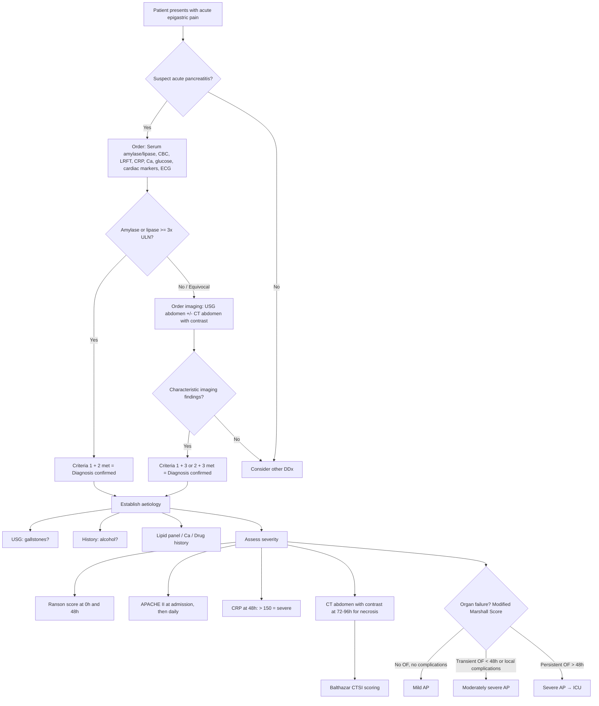

## Diagnostic Criteria

### The Revised Atlanta Diagnostic Criteria (2012)

This is the universally accepted standard. The diagnosis of acute pancreatitis requires **fulfilment of at least 2 out of 3 criteria** [2][3]:

| Criterion | Domain | Description |
|:----------|:-------|:------------|
| **1. Clinical** | History & Examination | ***Acute onset of persistent, severe, epigastric pain often radiating to the back*** [3] |
| **2. Biochemical** | Laboratory | ***Elevation of serum amylase or lipase to ≥ 3× upper limit of normal (ULN)*** [3] |
| **3. Radiological** | Imaging | ***Characteristic findings of acute pancreatitis on imaging — transabdominal USG, contrast-enhanced CT, or MRI*** [3] |

**Why 2 out of 3?** Because:
- If the clinical picture AND biochemistry are both classic (criteria 1 + 2), you do **not** need imaging to confirm the diagnosis — imaging is then reserved for assessing severity, identifying the aetiology, or detecting complications.
- If one criterion is equivocal (e.g., amylase only mildly raised, or the pain is atypical), imaging becomes essential to confirm the diagnosis.
- In practice, most patients are diagnosed clinically + biochemically, and imaging is added to assess severity rather than to make the diagnosis.

<Callout title="When Do You NEED Imaging to Diagnose?">
If both clinical and biochemical criteria are clearly met (classic pain + amylase/lipase ≥ 3× ULN), imaging is not strictly required for diagnosis. You order CT to (1) assess severity and complications, (2) when the diagnosis is uncertain, or (3) when the patient is not improving as expected. Do NOT delay treatment to wait for imaging.
</Callout>

---

## Diagnostic Algorithm

The following algorithm walks through the clinical decision-making from presentation to severity assessment:

---

## Investigation Modalities — Detailed Breakdown

I'll walk through each investigation systematically: *why* we order it, *what* we're looking for, and *how* to interpret the results.

### A. Baseline Bloods — "The Pancreatitis Panel"

Every patient with suspected acute pancreatitis should have the following ordered immediately [2][3]:

> ***CBC, LRFT, CRP, glucose, Ca, cardiac markers ± ECG, pancreatic enzymes*** [2]

---

#### A1. Pancreatic Enzymes (The Diagnostic Markers)

These are the cornerstone of biochemical diagnosis. The word "amylase" comes from Greek *amylon* = starch; it breaks down starch. "Lipase" from Greek *lipos* = fat; it breaks down triglycerides.

##### Serum Amylase [3][2]

| Parameter | Detail |
|:----------|:-------|
| **Diagnostic cut-off** | ***≥ 3× ULN*** (normal: 30–100 U/L) [2][3] |
| **Time course** | ***Rises within 6–12 hours*** of onset, ***peaks at 24 hours***, ***returns to normal within 3–5 days*** [2][3] |
| **Correlation with severity** | ***NO correlation between amylase level and severity*** [3] — a patient with amylase of 5000 can have mild disease, while one with 500 can be dying of necrotising pancreatitis |
| **Persistent elevation** | ***Should raise clinical suspicion of complications such as pseudocyst formation*** [3] |

**Why does amylase rise?** When acinar cells are damaged, they release their enzyme contents into the interstitial space → enzymes enter the bloodstream via lymphatics and venous drainage → measurable in serum.

***Limitations — false negatives*** (amylase may NOT reach 3× ULN) [3]:
- ***Alcoholic pancreatitis*** — chronic alcohol damage to the parenchyma reduces its capacity to produce amylase ("burnt-out" acinar cells)
- ***Hypertriglyceridaemia-associated pancreatitis*** — triglycerides interfere with the amylase detection assay (laboratory artefact)
- ***Delayed presentation*** — if the patient presents > 3–5 days after onset, serum amylase may have already normalised

***False positives*** (elevated amylase without pancreatitis) [2][3]:
- ***Perforated peptic ulcer (PPU)***
- ***Ruptured AAA***
- ***DKA***
- ***Macroamylasaemia*** (amylase bound to immunoglobulin → high MW complex → not renally cleared → accumulates in serum)
- Intestinal obstruction, bowel ischaemia
- Acute cholecystitis
- Salivary gland disease (parotitis — remember, salivary glands also produce amylase)

**Urine amylase** [3]:
- Useful when serum amylase is equivocal or in delayed presentation
- ***Rises within 24–48 hours and persists for up to 1 week*** even after serum amylase has normalised [3]
- Because amylase is renally excreted and has a longer "tail" in the urine

##### Serum Lipase [3][2]

| Parameter | Detail |
|:----------|:-------|
| **Diagnostic cut-off** | ***≥ 3× ULN*** (normal: 10–140 U/L) [2] |
| **Time course** | ***Rises within 4–8 hours*** of onset, ***peaks at 24 hours***, ***persists up to 2 weeks***, returns to normal within 8–14 days [3] |
| **Advantages over amylase** | (1) ***More sensitive in alcoholic pancreatitis*** (2) ***Rises earlier and lasts longer*** → useful in ***delayed presentation > 24 hours*** (3) ***More specific*** for pancreatic disease [2][3] |

**Why is lipase more specific?** Amylase is produced by many tissues (salivary glands, lungs, fallopian tubes, small intestine), so many non-pancreatic conditions raise amylase. Lipase is produced almost exclusively by the pancreas, so its elevation is more reliably pancreatic in origin.

***False positives for lipase*** [3]:
- Post-ERCP
- Pancreatic tumours
- Acute cholecystitis (mild elevation, usually < 3× ULN)

<Callout title="Amylase vs Lipase — What to Remember" type="idea">
**Lipase is the superior marker.** It is more sensitive (especially in alcoholic pancreatitis), more specific (fewer false positives), rises earlier, and lasts longer. If you can only order one test, order lipase. However, in practice, both are usually ordered together. ***Pancreatic enzymes are NOT indicative of severity*** [2] — a common exam pitfall.
</Callout>

| Feature | Serum Amylase | Serum Lipase |
|:--------|:-------------|:-------------|
| Onset of rise | 6–12 hours | 4–8 hours |
| Peak | 24 hours | 24 hours |
| Duration | 3–5 days | 8–14 days |
| Better for delayed presentation? | No (may have normalised) | ***Yes*** |
| Better for alcoholic pancreatitis? | No (low production) | ***Yes*** |
| Specificity | Lower (many sources) | ***Higher*** |
| Severity correlation | None | None |

---

#### A2. Full Blood Count (CBC with Differentials) [3]

| Finding | Interpretation / Pathophysiology |
|:--------|:--------------------------------|
| ***Leukocytosis*** [11] | Inflammatory response — cytokines (IL-6, TNF-α) stimulate bone marrow to release neutrophils. Part of SIRS criteria. |
| ***↑ Haematocrit*** | ***Haemoconcentration due to extravasation of intravascular fluid into 3rd spaces (sequestration of oedematous fluid in retroperitoneum)*** [3]. A rising Hct suggests inadequate resuscitation; a fall by ≥ 10% at 48h is a Ranson's criterion indicating significant fluid loss. |
| ↓ Haemoglobin (later) | If retroperitoneal haemorrhage occurs (necrotising pancreatitis, pseudoaneurysm rupture) |

---

#### A3. Liver Function Tests (LFT) [3]

The LFT pattern is crucial for **establishing aetiology** — specifically, is this biliary pancreatitis?

| Finding | Interpretation |
|:--------|:---------------|
| ***↑ Conjugated bilirubin*** | Obstruction of CBD by gallstone at ampulla, or compression by oedematous head of pancreas |
| ***↑ AST, ALT*** | Hepatocellular injury from biliary obstruction. **ALT > 150 U/L has a positive predictive value of > 85% for gallstone pancreatitis** (a very useful clinical rule) |
| ***↑ ALP*** | Cholestatic pattern — suggests biliary cause. ***Suspect gallstone pancreatitis if ↑ALP*** [2] |
| ***Normal LFTs do not rule out biliary aetiology*** [3] | The stone may have passed by the time bloods are drawn; LFTs can normalise rapidly |

---

#### A4. Renal Function Tests (RFT) [3]

| Finding | Interpretation |
|:--------|:---------------|
| ***↑ Creatinine and BUN*** | ***Severe fluid loss may lead to prerenal azotaemia*** — third-spacing of up to > 6 L into the retroperitoneum reduces effective circulating volume → reduced renal perfusion → rising creatinine and BUN [3]. BUN rising despite IV fluids is a Ranson's 48h criterion and indicates inadequate resuscitation or intrinsic renal injury. |

---

#### A5. Inflammatory Markers [3][13]

| Marker | Role |
|:-------|:-----|
| ***↑ CRP*** | Not useful for diagnosis, but critical for **severity assessment**. ***CRP > 150 mg/L at 48 hours predicts severe attack*** [2][13]. CRP is an acute-phase protein synthesised by the liver in response to IL-6 — it takes 24–48 hours to peak, which is why the 48-hour value is prognostic. |
| ***IL-6, IL-8, TNF-α*** | ***Biochemical markers for severity assessment*** [13] — research tools. IL-6 rises earlier than CRP (peaks at 24–36 hours) and drives CRP synthesis. ***Trypsinogen activation peptide (TAP)*** [13] is released when trypsinogen is activated to trypsin — a direct marker of disease activity, mainly in research settings. |

---

#### A6. Serum Glucose [3]

| Finding | Interpretation |
|:--------|:---------------|
| **Hyperglycaemia** | Islet cell damage → insulin deficiency; stress response → counter-regulatory hormones (cortisol, glucagon, catecholamines) → elevated glucose. Glucose > 11.1 mmol/L at admission is a Ranson's criterion. |
| **Hypoglycaemia** (rare) | Excessive insulin release from damaged islets (uncommon) |

---

#### A7. Serum Calcium [3]

| Finding | Interpretation |
|:--------|:---------------|
| ***Hypocalcaemia*** | ***Complexing with fatty acids (saponification/fat necrosis) produced by activated lipases, as well as hypoalbuminaemia*** [3]. Ca²⁺ < 2 mmol/L at 48 hours is a Ranson's criterion. Severe hypocalcaemia → tetany, prolonged QT interval. |

Always check **corrected calcium** (for albumin) or **ionised calcium** to assess true calcium status.

---

#### A8. Serum Triglycerides

| Finding | Interpretation |
|:--------|:---------------|
| **TG > 11.3 mmol/L** (> 1000 mg/dL) | Hypertriglyceridaemia as the aetiological cause. Note: very high TG can also **interfere with amylase assay** → false-negative amylase [3]. |

---

#### A9. Cardiac Markers ± ECG [3]

> ***Troponin (TnI, TnT) to exclude myocardial infarction (MI) as a differential diagnosis of epigastric pain*** [3]

This is mandatory in every patient with acute epigastric pain. An inferior MI can perfectly mimic pancreatitis. ECG may show ST changes in MI, or non-specific ST-T changes from the metabolic stress of severe pancreatitis itself.

---

#### A10. Arterial Blood Gas (ABG)

| Finding | Interpretation |
|:--------|:---------------|
| **Metabolic acidosis** | Lactic acidosis from hypovolaemia/hypoperfusion; base deficit > 4 mEq/L is a Ranson's 48h criterion |
| **Hypoxaemia** (PaO₂ < 8 kPa / 60 mmHg) | Ranson's 48h criterion; indicates ARDS, pleural effusion, or diaphragmatic splinting |
| **Respiratory alkalosis** (early) | Pain-driven tachypnoea → hyperventilation → CO₂ washout |

---

### B. Radiological Investigations

#### B1. Chest X-Ray (CXR) [2]

**Purpose**: ***Rule out perforation (PPU)*** — look for pneumoperitoneum (free air under diaphragm) — and identify other DDx [2].

| Finding | Interpretation |
|:--------|:---------------|
| **Pneumoperitoneum** | Perforated viscus (NOT pancreatitis) — this is the key reason to order a CXR |
| **Left-sided pleural effusion** | Transdiaphragmatic lymphatic drainage of enzyme-rich exudative fluid from the inflamed pancreas; also seen in ARDS |
| **Basal atelectasis** | Diaphragmatic splinting from adjacent inflammation |
| **Pulmonary infiltrates** | ARDS in severe cases |

---

#### B2. Abdominal X-Ray (AXR) [2][3]

AXR is a quick, cheap, widely available initial imaging. It does not diagnose pancreatitis directly, but shows supportive indirect signs and excludes other pathology.

| Finding | Description | Pathophysiological Basis |
|:--------|:------------|:-------------------------|
| ***Sentinel loop sign*** [2][3] | Localised dilated loop of small intestine (usually jejunum) in the LUQ/epigastrium | ***Localised ileus of a segment of small intestine*** adjacent to the inflamed pancreas — reflex inhibition of peristalsis via splanchnic nerves [3] |
| ***Colonic cut-off sign*** [2][3] | Paucity of air in the colon distal to the splenic flexure | ***Functional spasm of the descending colon secondary to pancreatic inflammation*** [3] — the inflamed pancreatic tail/body irritates the adjacent transverse/descending colon |
| ***Obliteration of psoas outline*** [2] | Loss of the normally visible psoas muscle shadow | ***Retroperitoneal fluid accumulation*** [2] — fluid from pancreatic inflammation dissects into the retroperitoneal space, obscuring the psoas shadow |
| **Ground-glass appearance** [3] | Hazy opacity in the abdomen | Indicates presence of ***acute peripancreatic fluid collection*** [3] — free fluid in the peritoneal/retroperitoneal space |
| **Absent pneumoperitoneum** | No free air under diaphragm | Helps exclude PPU |
| **Pancreatic calcifications** | Calcification at the level of L1–L2 | Suggests pre-existing **chronic pancreatitis** (not acute pancreatitis per se) |

---

#### B3. Ultrasound (USG) Abdomen [2][3]

USG is the **first-line imaging** in acute pancreatitis — not primarily to diagnose pancreatitis (which is usually biochemically confirmed), but to **identify the aetiology** (especially gallstones).

| Finding | Interpretation |
|:--------|:---------------|
| **Gallstones in gallbladder/CBD** | Biliary pancreatitis — this is the main reason to order USG |
| ***Swollen pancreas*** (diffusely enlarged, hypoechoic) [2] | Oedematous pancreatitis — however, ***pancreas is seen in only ~50% of cases*** [2] due to overlying bowel gas |
| ***Peripancreatic fluid collection*** (anechoic collection) [2][3] | Complication — acute peripancreatic fluid collection |
| **Dilated CBD** (> 6 mm, or > 10 mm post-cholecystectomy) | CBD obstruction — stone, tumour, or oedema of pancreatic head |
| **Associated cholecystitis** | Thickened gallbladder wall, pericholecystic fluid |

**Limitations** [3]:
- ***Distal (lower end) of CBD may be obscured by bowel gas*** — the intrapancreatic portion of the CBD sits behind the duodenum and is frequently not visualised
- ***Cannot clearly delineate extra-pancreatic spread of pancreatic inflammation or identify necrosis*** within the pancreas — USG lacks the resolution and penetration for this; CT is needed

<Callout title="USG in Pancreatitis — Know Its Role">
USG does NOT reliably diagnose pancreatitis (it misses the pancreas ~50% of the time due to bowel gas). Its primary role is to identify **gallstones** as the aetiology. Every patient with acute pancreatitis should have a USG abdomen to look for gallstones, even if the diagnosis is already confirmed biochemically.
</Callout>

---

#### B4. CT Abdomen with Contrast — ***The Gold Standard*** [3][2][13]

This is the most important imaging modality for acute pancreatitis. Let's break it down comprehensively.

**Why CT?** CT provides:
1. Diagnostic confirmation when clinical + biochemical criteria are equivocal
2. Severity assessment (necrosis, fluid collections)
3. Complication detection
4. Aetiological clues (gallstones, tumours)
5. Exclusion of other diagnoses

***Gold standard for the disease with Sensitivity = 90% and Specificity = 100%*** [3]

##### Key CT Findings

| Finding | Description | What It Means |
|:--------|:------------|:--------------|
| ***Focal or diffuse enlargement of pancreas*** [2][3] | Pancreas appears swollen, sometimes with loss of normal lobular architecture | Oedematous pancreatitis |
| ***Heterogeneous contrast enhancement*** [2][3] | Uneven enhancement pattern of the pancreatic parenchyma | Varying degrees of inflammation and oedema |
| ***Peripancreatic fat stranding*** [2] | Increased density/haziness of the fat surrounding the pancreas | Inflammation extending beyond the pancreas into peripancreatic tissues |
| ***Hypoenhancement on contrast CT*** [2] | Areas of the pancreas that do NOT take up IV contrast | ***Pancreatic necrosis*** — non-viable tissue has lost its blood supply and therefore cannot enhance. This is why ***contrast is essential*** [3] |
| ***Gas within areas of necrosis*** [2] | Air bubbles seen within necrotic pancreatic or peripancreatic tissue | Strongly suggestive of ***infected necrosis*** (gas produced by bacteria, usually Gram-negatives) |
| **Peripancreatic fluid collections** | Defined fluid collections adjacent to pancreas | APFC (< 4 weeks, no wall) vs pseudocyst (≥ 4 weeks, defined wall) |

##### Why Contrast Is Essential

> ***Contrast is essential to detect the presence of pancreatic necrosis*** [3]

Without IV contrast, you cannot distinguish viable (enhancing) pancreatic tissue from necrotic (non-enhancing) tissue. An unenhanced CT might show a swollen pancreas, but you would miss necrosis entirely — and necrosis is what determines the difference between interstitial oedematous pancreatitis (good prognosis) and necrotising pancreatitis (potentially fatal).

##### Timing of CT

- ***CT changes may NOT occur within the first 24 hours of presentation*** [3]
- ***Best done at 72–96 hours after admission*** to accurately assess the full extent of necrosis [2]
- **Earlier CT** (within 24–48h) is indicated if:
  - ***Organ failure*** is present [2]
  - ***Uncertain diagnosis*** (DDx PPU, gangrenous cholecystitis, ischaemic bowel) [2]
  - Clinical deterioration despite treatment

<Callout title="Don't CT Too Early!" type="error">
A CT done within the first 24 hours often underestimates the severity of pancreatitis because necrosis has not yet fully demarcated. The optimal window is 72–96 hours. However, if the patient has organ failure or you're not sure of the diagnosis, don't delay — CT early. Clinical judgment trumps timing rules.
</Callout>

##### Balthazar CT Severity Index (CTSI) [3][2][13]

This is a ***prognostic scale*** based on CT findings that combines the grade of pancreatitis with the extent of necrosis [3]:

***Score = Grade of pancreatitis (0–4) + Percentage of necrosis (0–6)*** [2]

**Grade of Pancreatitis:**

| Grade | CT Appearance | Points |
|:------|:-------------|:------:|
| A | Normal pancreas | 0 |
| B | Focal or diffuse enlargement | 1 |
| C | Pancreatic or peripancreatic inflammation | 2 |
| D | Single peripancreatic fluid collection | 3 |
| E | Multiple fluid collections or retroperitoneal air | 4 |

**Percentage of Necrosis:**

| Necrosis Extent | Points |
|:----------------|:------:|
| 0% (no necrosis) | 0 |
| < 30% | 2 |
| 30–50% | 4 |
| > 50% | 6 |

**Interpretation** [3]:
- CTSI 0–3: Low morbidity and mortality
- CTSI 4–6: Moderate morbidity
- ***CTSI 7–10: Morbidity 92%, mortality 17%*** [3]

---

#### B5. MRI / MRCP [3][13]

| Feature | Detail |
|:--------|:-------|
| **Advantages over CT** | ***Higher sensitivity for diagnosis of early acute pancreatitis***; ***better characterisation of pancreatic and bile duct anatomy and complications*** [3]; no ionising radiation; no need for iodinated contrast (safer in renal impairment or contrast allergy) |
| **MRCP** | ***Magnetic resonance cholangiopancreatography is comparable to ERCP for the detection of choledocholithiasis*** [3] — it provides a non-invasive "map" of the biliary and pancreatic duct system |
| **When to use** | When CT is contraindicated (contrast allergy, renal impairment), for detailed duct anatomy, or to look for subtle choledocholithiasis missed on USG |
| **Limitation** | Less widely available, takes longer, motion artefact in unwell/agitated patients |

---

#### B6. ERCP / MRCP [2]

***ERCP and MRCP are not routinely done*** because the culprit stone usually passes spontaneously [2]. However, they are indicated in specific situations:

| Indication | Modality |
|:-----------|:---------|
| ***Suspected biliary pancreatitis (stone found on USG, septic/cholangitis)*** | ***ERCP within 24–72 hours*** for therapeutic sphincterotomy and stone extraction [2] |
| Moderate suspicion of CBD stone but not confirmed | ***MRCP or EUS first*** to confirm before proceeding to ERCP (to avoid unnecessary ERCP risk) |
| ***Uncertain diagnosis / severe case (last resort)*** | ***ERCP*** [2] |

<Callout title="ERCP — Diagnostic vs Therapeutic" type="idea">
ERCP is primarily a **therapeutic** procedure in the context of biliary pancreatitis (sphincterotomy + stone extraction). For **diagnosis** of CBD stones, prefer non-invasive MRCP or EUS first — ERCP carries a 4% risk of post-ERCP pancreatitis, which is the last thing you want in someone who already has pancreatitis.
</Callout>

---

### C. Severity Assessment Tools — Consolidated

From the lecture slides [13]:

> ***Assessment of disease severity*** involves:
> - ***Clinical scoring systems: Ranson and Glasgow systems (require 48 hours for full assessment), APACHE II and APACHE-O***
> - ***Biochemical markers: C-reactive protein, Interleukin-8 or 6, Tumor necrosis factor, Trypsinogen activation peptide (TAP)***
> - ***Radiological studies: Dynamic contrast CT scan — pancreatic inflammation and peripancreatic fluid collection (Balthazar system), MRI*** [13]

#### Modified Marshall Scoring System (for defining organ failure)

This is the scoring system used in the Revised Atlanta Classification to define organ failure:

| Organ System | Score 0 | Score 1 | Score 2 (= Organ Failure) | Score 3 | Score 4 |
|:-------------|:--------|:--------|:--------------------------|:--------|:--------|
| **Respiratory** (PaO₂/FiO₂) | > 400 | 301–400 | **201–300** | 101–200 | ≤ 100 |
| **Renal** (Creatinine μmol/L) | < 134 | 134–169 | **170–310** | 311–439 | > 439 |
| **Cardiovascular** (SBP mmHg) | > 90 | < 90, responds to fluids | **< 90, not responding to fluids** | < 90, pH < 7.3 | < 90, pH < 7.2 |

- A score of **≥ 2 in any organ system** = **organ failure**
- **Transient** organ failure (resolving within 48 hours) = moderately severe
- **Persistent** organ failure ( > 48 hours) = ***severe acute pancreatitis*** [13]

> ***Definition of severe pancreatitis: pancreatitis associated with organ failure and/or local complications e.g. necrosis, abscess formation, or pseudocyst*** [14]

---

### D. Summary — Diagnostic Investigation Algorithm by Purpose

| Purpose | Investigation | Key Finding |
|:--------|:-------------|:------------|
| **Confirm diagnosis** | Serum amylase/lipase | ≥ 3× ULN |
| **Exclude DDx** | CXR (pneumoperitoneum → PPU), ECG + troponin (MI), blood glucose + ketones (DKA) | |
| **Identify aetiology** | USG (gallstones), LFTs (cholestatic pattern → biliary), TG level, Ca²⁺, drug history | |
| **Assess severity** | Ranson's (0h + 48h), APACHE II (admission + daily), CRP at 48h, CT at 72–96h | Ranson ≥ 3, APACHE II ≥ 8, CRP > 150, CTSI 7–10 |
| **Detect necrosis** | ***CT abdomen with contrast*** at 72–96h | Hypoenhancement, gas |
| **Detect CBD stones** | USG → MRCP / EUS → ERCP (therapeutic) | Dilated CBD, visible stone |
| **Detect complications** | CT with contrast; angiography if pseudoaneurysm suspected | Fluid collections, vascular complications |

---

<Callout title="High Yield Summary">

**Diagnostic Criteria (Revised Atlanta)**: 2 out of 3 — (1) Typical epigastric pain radiating to back, (2) Amylase or lipase ≥ 3× ULN, (3) Characteristic imaging findings.

**Pancreatic Enzymes**: Lipase is superior to amylase — more sensitive (especially alcoholic), more specific, rises earlier, lasts longer. ***Neither correlates with severity.***

**False positive amylase**: PPU, ruptured AAA, DKA, macroamylasaemia, bowel ischaemia.

**USG abdomen**: First-line imaging — primarily to identify gallstones as the aetiology. Pancreas only seen ~50% of the time.

**CT abdomen with contrast**: Gold standard (Sn 90%, Sp 100%). ***Contrast essential*** to detect necrosis (hypoenhancement). Best at 72–96 hours. Gas in necrosis = infected necrosis.

**AXR signs**: Sentinel loop sign (localised ileus), colonic cut-off sign (descending colon spasm), obliteration of psoas outline (retroperitoneal fluid).

**Severity assessment**: Ranson's (GALAW + CHOBBS, ≥ 3 = severe, needs 48h), APACHE II (≥ 8, can calculate daily), CRP > 150 at 48h, Balthazar CTSI (grade 0–4 + necrosis 0–6), Modified Marshall Score for organ failure.

**Always check**: ECG + troponin (exclude MI), CXR (exclude PPU).

</Callout>

---

<ActiveRecallQuiz
  title="Active Recall - Diagnosis of Acute Pancreatitis"
  items={[
    {
      question: "State the Revised Atlanta diagnostic criteria for acute pancreatitis and explain why imaging is not always needed.",
      markscheme: "Requires 2 out of 3: (1) Typical epigastric pain radiating to back, (2) Serum amylase or lipase at least 3x ULN, (3) Characteristic imaging findings on USG/CT/MRI. If criteria 1 and 2 are clearly met, imaging is not required for diagnosis - it is then used for severity assessment, aetiology, or complications."
    },
    {
      question: "Compare serum amylase and serum lipase as diagnostic markers for acute pancreatitis. Which is preferred and why?",
      markscheme: "Lipase is preferred. Advantages: (1) More sensitive, especially in alcoholic pancreatitis (chronic acinar damage reduces amylase production). (2) More specific - amylase is produced by many tissues (salivary glands, lungs, bowel). (3) Rises earlier (4-8h vs 6-12h) and lasts longer (8-14 days vs 3-5 days), making it better for delayed presentations. Neither enzyme correlates with disease severity."
    },
    {
      question: "Why must contrast be given when performing CT abdomen for acute pancreatitis, and what is the optimal timing?",
      markscheme: "Contrast is essential to detect pancreatic necrosis - necrotic tissue has lost its blood supply and appears as hypoenhancing areas, while viable tissue enhances normally. Without contrast, necrosis cannot be distinguished. Optimal timing is 72-96 hours after admission because CT changes may not be present in the first 24 hours and necrosis takes time to fully demarcate. Earlier CT is indicated if there is organ failure or diagnostic uncertainty."
    },
    {
      question: "Name three characteristic AXR findings in acute pancreatitis and explain the pathophysiological basis of each.",
      markscheme: "(1) Sentinel loop sign - localised ileus of adjacent small bowel due to reflex inhibition of peristalsis by retroperitoneal inflammation. (2) Colonic cut-off sign - paucity of gas distal to splenic flexure due to functional spasm of descending colon from adjacent pancreatic inflammation. (3) Obliteration of psoas outline - retroperitoneal fluid accumulation obscuring the psoas shadow."
    },
    {
      question: "A patient presents 4 days after onset of epigastric pain. Serum amylase is normal but you still suspect pancreatitis. What should you do and why?",
      markscheme: "Check serum lipase (persists for 8-14 days vs amylase 3-5 days, so still likely elevated at day 4). Check urine amylase (persists for up to 1 week after serum normalises). Also consider CT abdomen with contrast - imaging may confirm the diagnosis when biochemistry is equivocal (the third diagnostic criterion). Amylase can be falsely negative in delayed presentation, alcoholic pancreatitis, and hypertriglyceridaemia-associated pancreatitis."
    },
    {
      question: "State the Balthazar CT Severity Index scoring system and its prognostic significance.",
      markscheme: "Score = Grade of pancreatitis (0-4: A=normal 0, B=enlargement 1, C=peripancreatic inflammation 2, D=single fluid collection 3, E=multiple collections or retroperitoneal air 4) PLUS percentage of necrosis (0%=0, less than 30%=2, 30-50%=4, more than 50%=6). Total score 0-10. Score 7-10 is associated with morbidity of 92% and mortality of 17%."
    }
  ]}
/>

---

## References

[2] Senior notes: maxim.md (Acute pancreatitis section)
[3] Senior notes: felixlai.md (Acute pancreatitis section)
[11] Lecture slides: Acute pancreatitis.pdf (p8 — Diagnosis of acute pancreatitis)
[13] Lecture slides: Acute pancreatitis.pdf (p10 — Assessment of disease severity)
[14] Lecture slides: Acute pancreatitis.pdf (p11 — Definition of severe pancreatitis)
