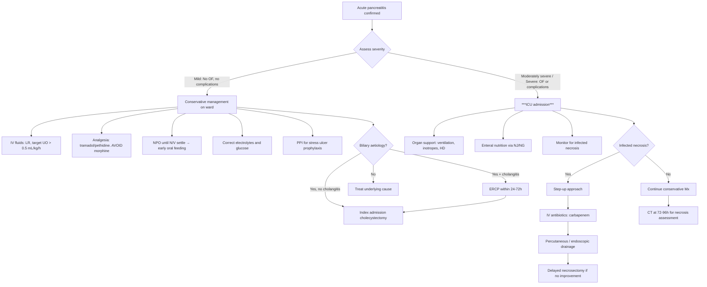
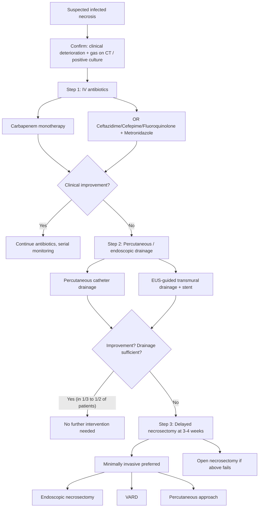

## Management of Acute Pancreatitis

### Overarching Principles

Before diving into specifics, the lecture slides frame two guiding principles beautifully [15]:

> ***Aim in treatment of acute pancreatitis:***
> 1. ***To identify patients with severe pancreatitis to institute directed therapy in the early phase of disease***
> 2. ***To prevent progression of disease from acute oedematous state to necrotising / haemorrhagic state*** [15]

Everything we do in management serves one of these two goals. The first is about *risk stratification* (scoring systems, CRP, CT). The second is about *maintaining pancreatic perfusion* (aggressive fluids) and *removing the inciting cause* (ERCP for gallstones). If you remember nothing else, remember: **fluids prevent necrosis, and necrosis kills**.

The management summary from the lecture slides [16]:

> ***Summary:***
> - ***Conservative management of uncomplicated acute pancreatitis***
> - ***Early ERCP and antibiotics to treat acute biliary pancreatitis and cholangitis***
> - ***IV carbapenem for necrotising pancreatitis***
> - ***Percutaneous / endoscopic / surgical drainage of infected pancreatic necrosis***
> - ***Endoscopic or (rarely) open cystogastrostomy for persistent large pseudocysts*** [16]

---

### Management Algorithm

---

### 1. General Supportive Management (All Patients)

This is the backbone of management — most patients with acute pancreatitis (80% with mild disease) recover with supportive care alone [16].

#### 1A. IV Fluid Resuscitation

This is the **single most important intervention** in acute pancreatitis. Here's why, explained from first principles:

**The problem**: Pancreatic inflammation → massive third-spacing of fluid into the retroperitoneum, peritoneal cavity, and interstitial spaces (up to > 6 litres in severe cases). This causes intravascular volume depletion → hypoperfusion of the pancreas → ischaemic necrosis (the very thing that converts mild disease into lethal necrotising disease) [15].

**The solution**: Aggressive early fluid resuscitation to maintain intravascular volume and pancreatic perfusion.

| Parameter | Detail |
|:----------|:-------|
| **Access** | Establish ***2 large-bore (16-Gauge) peripheral IV cannulae*** [3] |
| **Fluid choice** | ***Lactated Ringer's (LR) solution may be superior to normal saline (NS) in reducing SIRS*** [3] — LR is more physiological (contains lactate as a buffer, has lower chloride content, reducing risk of hyperchloraemic metabolic acidosis). Multiple RCTs now support LR as the fluid of choice. |
| **Rate** | Goal-directed: typically 5–10 mL/kg/hr initially in the first 12–24 hours, then titrated |
| **Target** | ***Urine output ≥ 0.5 mL/kg/hr*** — this is the minimum indicating adequate renal perfusion [3]. ***1.0 mL/kg/hr indicates optimal renal perfusion and function with good hydration*** [3]. |
| **Monitoring** | ***Foley catheter with Q1H monitoring*** [3] to track UO precisely |

<Callout title="Why Lactated Ringer's Over Normal Saline?">
NS has a supraphysiological chloride concentration (154 mEq/L vs plasma ~100 mEq/L). Large-volume NS resuscitation causes hyperchloraemic metabolic acidosis, which can worsen the metabolic derangement already present in pancreatitis. LR is buffered and more closely matches plasma composition. The anti-inflammatory effect of LR (via lactate metabolism to bicarbonate) also helps reduce SIRS.
</Callout>

#### 1B. Oxygen Supplementation [3]

- ***Pulse oximetry and ABG monitoring*** are necessary to assess oxygenation and acid-base status [3]
- Supplemental O₂ to maintain SpO₂ > 95%
- Why? Severe pancreatitis causes hypoxaemia through multiple mechanisms: pleural effusions, ARDS, diaphragmatic splinting, atelectasis

#### 1C. Correction of Electrolyte and Glucose Abnormalities [3][2]

- ***Correct electrolyte and glucose disturbances*** [2]
- **Hypocalcaemia**: Replete with IV calcium gluconate (monitor ECG — prolonged QTc is dangerous)
- **Hypokalaemia/Hypomagnasaemia**: Common from vomiting and third-spacing
- **Hyperglycaemia**: Sliding-scale insulin; avoid over-correction (risk of hypoglycaemia, especially if glucagon-producing α-cells are also damaged)

#### 1D. Nil Per Os (NPO) and Nasogastric Decompression [3]

| Intervention | Indication | Rationale |
|:-------------|:-----------|:----------|
| ***NPO*** | ***Only if necessary — until nausea and vomiting settle*** [3] | The old dogma of prolonged "pancreatic rest" (keeping patients nil by mouth for days) is **outdated**. Current evidence strongly favours early oral feeding when tolerated. |
| ***NG suction*** | ***If ileus or protracted vomiting*** [3][2] | Decompresses the stomach, reduces aspiration risk, and ***decreases neurohormonal stimulation of pancreatic secretion*** [3] (gastric distension triggers CCK and secretin release → stimulates pancreatic enzyme secretion → worsens the disease) |

#### 1E. Nutritional Support [3][2]

This is a **paradigm shift** in pancreatitis management. The old approach was "rest the pancreas" — starve the patient. This is wrong and harmful.

> ***It is NO longer acceptable to "rest the pancreas" by avoiding enteral nutrition*** [3]

**Why enteral feeding is critical:**
- ***Early enteral feeding is associated with lower rates of infection, surgical intervention, and length of stay*** [3]
- ***Delay in enteral feeding may contribute to the development of intestinal ileus and feeding intolerance*** [3]
- Enteral nutrition maintains gut mucosal barrier integrity → prevents bacterial translocation → reduces risk of infected necrosis (recall the pathophysiology: gut barrier breakdown → bacterial translocation → infected necrosis → sepsis → death)

**Route of enteral feeding:**

| Route | Detail |
|:------|:-------|
| **Oral** (first choice for mild AP) | ***Encourage early oral feeding if mild*** [2] — start with low-fat solid diet as tolerated |
| ***NG tube*** | ***Nasogastric feeding is safe and effective*** [3] — contrary to previous belief that NG feeding stimulates the pancreas. Multiple RCTs show NG is as good as NJ. |
| ***NJ tube*** | ***Nasojejunal feeding*** — bypasses the stomach and duodenum, theoretically providing less pancreatic stimulation. ***NJ tube can be attempted if there is evidence of feeding intolerance*** via NG [3]. |
| ***NG or NJ: similar efficacy and safety*** [2] | Start with NG; escalate to NJ if not tolerated |

**Parenteral nutrition (TPN):**
- ***Should only be considered if the enteral route is not available, not tolerated, or caloric requirements cannot be met*** [3]
- TPN has higher infection rates (line sepsis) and does not maintain gut mucosal barrier
- In the slides for severe pancreatitis: ***Nutritional support (TPN + early enteral feeding)*** [17] — meaning TPN is a supplement, not a replacement

**Recommended nutrient requirements in severe AP** [3]:

| Nutrient | Requirement |
|:---------|:------------|
| Energy | 25–35 kcal/kg/day |
| Protein | 1.2–1.5 g/kg/day |
| Carbohydrates | 3–6 g/kg/day |
| Lipids | 2 g/kg/day |

#### 1F. Monitoring [2]

- ***Monitor vitals, I/O, RFT, Ca, glucose ± ABG*** [2]
- Frequency: Vitals Q1–4H depending on severity; bloods at least daily initially
- Serial CRP (48-hour value is prognostic)
- Ranson's parameters at 48 hours

---

### 2. Medical Treatment

#### 2A. Analgesia

Pain control is essential — pancreatitis is excruciatingly painful, and uncontrolled pain causes tachycardia, hypertension, and splanchnic vasoconstriction (worsening pancreatic perfusion).

| Agent | Role | Notes |
|:------|:-----|:------|
| ***Tramadol / Pethidine (meperidine)*** [2] | First-line opioid analgesics | Tramadol is a weak μ-opioid agonist + serotonin/noradrenaline reuptake inhibitor. Pethidine has traditionally been preferred because it is said to cause less sphincter of Oddi spasm than morphine. |
| **Paracetamol** | Adjunctive, mild pain | Safe baseline analgesia, opioid-sparing effect |
| **NSAIDs** | ***Avoid*** [2] | ***NSAIDs worsen pancreatitis*** [2] — they impair renal blood flow (prostaglandin-dependent) in an already hypovolaemic patient, and may exacerbate mucosal injury. *Exception*: PR indomethacin is used for *prevention* of post-ERCP pancreatitis, but this is a specific prophylactic setting, not treatment of established pancreatitis. |
| **Morphine** | ***AVOID — potential to cause sphincter of Oddi spasm*** [3][2] | Morphine contracts the sphincter of Oddi → theoretically worsens pancreatic duct obstruction → worsens pancreatitis. Although the clinical significance is debated, it remains a standard teaching point and exam favourite. ***Avoid morphine; ↑ sphincter of Oddi pressure*** [2]. |

<Callout title="The Morphine Question" type="error">
In exams, the answer is: **avoid morphine in acute pancreatitis** because it causes sphincter of Oddi spasm. In real clinical practice, the evidence for this is weak, and some guidelines now consider morphine acceptable if other agents fail. But for HKUMed exams, stick with the teaching: ***morphine should be AVOIDED*** [3].
</Callout>

#### 2B. PPI (Proton Pump Inhibitor) [2]

- ***PPI for prophylaxis of acute stress ulcer*** [2]
- Why? Critically ill patients are at high risk of stress-related mucosal disease (Curling's ulcer in burns, Cushing's ulcer in raised ICP). In pancreatitis, haemodynamic instability and SIRS increase gastric acid-related mucosal injury risk. Omeprazole or pantoprazole IV covers this.

#### 2C. Antibiotics

This is one of the most commonly tested and nuanced topics in pancreatitis management.

**The key principle**: ***Prophylactic antibiotics are generally NOT recommended*** [3][2][16]

**Why not?** Most pancreatitis is a sterile inflammatory process. Routine antibiotics:
- Do not reduce mortality or infected necrosis in uncomplicated pancreatitis (multiple RCTs and meta-analyses)
- Promote antibiotic resistance and *Clostridioides difficile* infection
- May give a false sense of security

**When ARE antibiotics indicated?** [3][2]

| Indication | Antibiotic Choice | Rationale |
|:-----------|:------------------|:----------|
| ***Concurrent cholangitis*** (LFT shows cholestatic pattern) [2] | ***IV Augmentin (amoxicillin-clavulanate)*** [2] | Biliary sepsis from CBD stone causing both cholangitis and pancreatitis — treat the infection |
| ***Infected pancreatic necrosis*** [16] | ***IV carbapenem (imipenem or meropenem)*** [3][16] | ***IV carbapenem for necrotising pancreatitis*** [16]. Carbapenems are chosen because they **penetrate necrotic pancreatic tissue** well (good lipophilicity and tissue penetration). Target enteric Gram-negative organisms (*E. coli, Klebsiella*) that translocate from the gut. |
| ***Necrosis > 30% on CT*** (may be considered) [3] | Carbapenems, fluoroquinolones + metronidazole [3] | ***Antibiotics that are known to penetrate pancreatic necrosis should be used, including carbapenems, fluoroquinolones, and metronidazole*** [3] |
| ***SIRS with evidence suggesting infection*** [3] | Case-by-case | ***Increased CRP with other evidence supporting possibility of infection*** [3] |

**Why carbapenems specifically?**
- "Carba-" = carbapenem nucleus; "penem" = β-lactam subclass. These are the broadest-spectrum β-lactams, covering Gram-positives, Gram-negatives (including ESBL-producers), and anaerobes.
- Crucially, they achieve therapeutic concentrations in necrotic pancreatic tissue — most other antibiotics cannot penetrate avascular necrotic debris effectively.

<Callout title="Antibiotics in Pancreatitis — The Exam Rule">
**No prophylactic antibiotics for uncomplicated pancreatitis.** Give antibiotics ONLY for: (1) cholangitis, (2) infected necrosis, (3) SIRS with strong suspicion of infection. The drug of choice for infected necrosis is ***imipenem or meropenem*** (carbapenems).
</Callout>

---

### 3. Management of Biliary Pancreatitis

Biliary pancreatitis has specific additional management steps because the **cause is treatable** — remove the gallstones, and you prevent recurrence.

#### 3A. ERCP — Acute Phase

***Emergency ERCP for biliary pancreatitis*** [17]

> ***Treatment protocol of acute biliary pancreatitis: Emergency ERCP ± EPT (endoscopic papillotomy/sphincterotomy) → Elective cholecystectomy*** [18]

| Aspect | Detail |
|:-------|:-------|
| **Indications** [3][2] | ***Patients with jaundice, acute cholangitis, or evidence of persistent CBD stones leading to biliary pancreatitis*** — arrange ***within 24–72 hours*** after admission for endoscopic sphincterotomy and stone extraction [3][2] |
| | ***Patients with no identifiable cause*** — to rule out CBD stones, strictures, or neoplasms [3] |
| | ***Suspected pancreatic ductal disruption*** (e.g. traumatic pancreatitis) [3] |
| **What is done** | Endoscopic sphincterotomy (EPT = endoscopic papillotomy — cutting the sphincter of Oddi) + stone extraction with balloon or basket |
| **Contraindications** [3] | ***Gastric or bowel obstruction, altered anatomy in post-surgical state (e.g. gastrectomy with Billroth II or Roux-en-Y)*** [3] |
| **Important caveat** | ***ERCP is NOT indicated in the absence of CBD obstruction*** [3] — if there's no evidence of biliary obstruction (normal LFTs, no dilated CBD, no visible stone), ERCP is unnecessary and carries risk (post-ERCP pancreatitis ~4%) |

**Decision tree for suspected CBD stones** [3]:
- Clinical suspicion of CBD stone is ***high*** → ***ERCP***
- Clinical suspicion is ***moderate*** → ***MRCP or EUS*** to exclude CBD stones before proceeding to cholecystectomy
- Clinical suspicion is ***low*** → ***Cholecystectomy with intraoperative cholangiogram (IOC)*** during the procedure

#### 3B. PTBD (Percutaneous Transhepatic Biliary Drainage) [3][2]

- ***Decompress and drain the biliary system in biliary pancreatitis*** [3]
- ***Indicated in patients who are unable to perform ERCP*** [3] — e.g. post-Billroth II gastrectomy (the duodenum is not accessible endoscopically), failed ERCP, unstable patient
- ***Alternative: PTBD to decompress biliary tract if unfit*** for ERCP [2]

#### 3C. Exploration of Common Bile Duct (ECBD) [3]

- ***Open surgical drainage*** — ***rarely performed nowadays*** [3]
- Last resort when ERCP and PTBD are both impossible

#### 3D. Cholecystectomy — Definitive Prevention [3][2][18]

After resolving the acute episode, the gallbladder must be removed to **prevent recurrence** (recurrence rate without cholecystectomy is ~30–40% within 6 weeks).

> ***Elective cholecystectomy — laparoscopic or open*** [18]

| Scenario | Timing |
|:---------|:-------|
| ***Mild pancreatitis*** | ***Cholecystectomy can be performed safely within a week of recovery and in the same index hospitalisation*** [3][2] — ***Lap cholecystectomy within the same hospitalisation*** [2]. Delaying discharge without cholecystectomy risks recurrent pancreatitis before the outpatient surgery date. |
| ***Severe necrotising pancreatitis*** | ***Cholecystectomy should be delayed until active inflammation subsides and fluid collections resolve or stabilise (interval cholecystectomy)*** [3] — typically 6 weeks or more |

***Intraoperative cholangiography (IOC)*** is performed during cholecystectomy to ***rule out persistent choledocholithiasis*** [3].

---

### 4. Management of Severe Pancreatitis

***Principles of management of severe pancreatitis*** [17]:

> - ***Close monitoring (haemodynamic, urine output)***
> - ***Fluid resuscitation***
> - ***Cardiovascular support***
> - ***Renal support***
> - ***Mechanical ventilation***
> - ***Prophylactic potent antibiotic***
> - ***Emergency ERCP for biliary pancreatitis***
> - ***Nutritional support (TPN + early enteral feeding)*** [17]

#### 4A. ICU Admission [2]

***Consult ICU for organ support*** [2]:

| Organ System | Support |
|:-------------|:--------|
| ***GI*** | ***Enteral feeding (NJ) → TPN*** if intolerant [2] |
| ***CVS*** | ***CVP monitoring, inotropes*** (noradrenaline/vasopressin for vasodilatory shock from SIRS) [2] |
| ***Respiratory*** | ***Intubation and mechanical ventilation*** for ARDS or respiratory failure [2] |
| ***Renal*** | ***Haemodialysis (HD)*** for AKI unresponsive to fluid resuscitation [2] |
| ***Abdominal*** | ***Measure intra-abdominal pressure (IAP)*** for abdominal compartment syndrome [2] — IAP > 20 mmHg with new organ failure defines abdominal compartment syndrome, which may require decompressive laparotomy |

#### 4B. Indications for Surgery in Severe Pancreatitis [2]

> ***Surgery indicated if:***
> - ***Infected pancreatic necrosis***
> - ***Progressive clinical deterioration*** despite maximal conservative and ICU management [2]

---

### 5. Management of Infected Pancreatic Necrosis — The Step-Up Approach

This is one of the most important modern concepts in pancreatitis surgery. The key principle is **minimise surgical aggression** — infected necrosis is managed with a graduated ("step-up") approach rather than rushing to open necrosectomy.

#### The Step-Up Approach [3][2][19]

***Definitive treatment for infected pancreatic necrosis*** [19]:

> - ***Radiologically-guided drainage → Dilatation of tract and video-assisted retroperitoneal debridement (VARD)***
> - ***Endoscopic ultrasound drainage → Stent insertion ± endoscopic debridement***
> - ***Necrosectomy (surgical debridement) — Open (standard) or minimally invasive approaches (for selected cases)*** [19]

**Step 1: Antibiotics** [3]
- ***Empirical antibiotics that penetrate pancreatic necrosis*** [3]
- ***Carbapenem monotherapy (imipenem/meropenem)*** OR ***Ceftazidime/Cefepime/Fluoroquinolone + Metronidazole*** [3]

**Step 2: Drainage** [3]
- ***Percutaneous catheter drainage or endoscopic drainage is used as the first step to stabilise the patient's overall clinical status*** [3]
- ***Drainage "buys time" and allows the lesion to become more walled off and safer to treat*** [3]
- ***Primary percutaneous catheter drainage may be the only intervention required in 1/3 to 1/2 of patients*** [3]

**Step 3: Delayed necrosectomy** [3]
- ***Resection of necrosis by minimally-invasive or endoscopic means is performed as a second procedure 3–4 weeks later if necessary*** [3]
- ***Should be delayed to at least 3–4 weeks after onset*** [3] — why?
  - ***Allow sequestration and demarcation of the necrosis*** — necrotic tissue separates from viable tissue over time, making debridement easier and safer
  - ***Reduce risk of bleeding, disseminated infection, and collateral damage to adjacent organs*** [3]
  - ***Continued conservative treatment allows a minimally invasive debridement to be performed at a later date*** [3]
- ***Minimally invasive preferred: endoscopic or percutaneous > open*** [2]
- Open necrosectomy is reserved for patients who ***fail to improve*** with less invasive approaches [3]

<Callout title="Why Delay Surgery?">
Early open necrosectomy (within the first 2 weeks) carries mortality rates of 40–75% because the necrotic tissue is not yet demarcated from viable tissue — the surgeon ends up removing viable pancreas and causing massive haemorrhage. Waiting ≥ 4 weeks allows the necrosis to "wall off" (WON), creating a defined plane that can be safely debrided with much lower morbidity.
</Callout>

---

### 6. Management of Pancreatic Fluid Collections

This follows the **Revised Atlanta classification** timeline (< 4 weeks vs ≥ 4 weeks) and whether necrosis is present:

#### 6A. Acute Peripancreatic Fluid Collection (APFC) [3]

- ***Resolve spontaneously within 7–10 days without the need for drainage*** [3]
- Management: observation and serial imaging
- No intervention needed unless they become infected (rare)

#### 6B. Pancreatic Pseudocyst [3][20]

***Treatment strategy for pancreatic pseudocyst*** [20]:

> - ***Observe***
> - ***If cyst > 5 cm by 6 weeks → internal drainage***
> - ***If cyst develops complication (e.g. bleeding, rupture, infection, obstruction) → external drainage*** [20]

| Management | Detail |
|:-----------|:-------|
| **Watchful waiting** | ***Allow wall to "mature" (thicken) — 50% resolve spontaneously*** [2]. Wait at least 6 weeks for the wall to mature enough to hold sutures/stents. |
| **Internal drainage (preferred)** | For ***symptomatic "mature" pseudocyst with size > 5–6 cm*** [20][2]: |
| | ***Cystogastrostomy (endoscopic or operative)*** — creates a communication between the pseudocyst and the posterior gastric wall [20] |
| | ***Cystoduodenostomy (operative)*** — connects pseudocyst to duodenum [20] |
| | ***Cystojejunostomy (operative)*** — Roux-en-Y loop [20] |
| | ***EUS-guided cystogastrostomy is first-line*** [2] — avoids open surgery |
| **External drainage** | ***If cyst develops complications: bleeding, rupture, infection, obstruction*** [20] |
| | Percutaneous catheter drainage — higher recurrence rate, risk of pancreatocutaneous fistula [2] |

#### 6C. Walled-Off Necrosis (WON) [2][19]

| Management | Detail |
|:-----------|:-------|
| **If sterile + asymptomatic** | Conservative management with serial monitoring |
| **If symptomatic or infected** | ***EUS/ERCP-guided transmural drainage ± necrosectomy (first-line)*** [2] |
| | Percutaneous drainage (higher recurrence, fistula risk) [2] |
| | ***Surgical debridement (open/lap) with external/internal drainage*** [2] |

---

### 7. Management of Pseudoaneurysm [3]

This deserves special mention because of a critical safety rule:

- ***Angiography is the definitive diagnostic test*** and has been used increasingly to manage pseudoaneurysms by ***embolisation with radiological coils*** [3]
- ***Pseudoaneurysms are an ABSOLUTE contraindication to endoscopic drainage unless arterial embolisation is performed first*** [3]
- Why? ***Severe and fatal haemorrhage can occur following endoscopic drainage in patients with an unsuspected pseudoaneurysm*** [3]

> Before draining ANY pancreatic fluid collection, always consider whether a pseudoaneurysm might be present. If the Hb is dropping, the collection is expanding, or there's unexplained GI bleeding — do angiography FIRST.

---

### 8. Prevention of Recurrence [3]

#### 8A. Treatment of Underlying Risk Factors [3]
- **Hypertriglyceridaemia**: Fibrates, dietary modification, insulin infusion in acute setting
- **Hypercalcaemia**: Treat underlying hyperparathyroidism (parathyroidectomy)
- **Alcohol**: Absolute abstinence counselling
- **Offending drugs**: Discontinue causative medications

#### 8B. Gallstone Pancreatitis — Preventing Recurrence [3]

Already covered above — the critical point is:
- **ERCP** for CBD stones (if present)
- ***Cholecystectomy*** during index admission (mild) or after recovery (severe) [3]
- ***IOC*** to rule out residual CBD stones [3]

---

### Summary Table — Management by Severity

| Severity | Key Management Steps |
|:---------|:--------------------|
| ***Mild (uncomplicated)*** | ***Conservative***: IV LR fluids, analgesia (tramadol/pethidine), early oral feeding, correct electrolytes, PPI. USG for aetiology. Index admission cholecystectomy if biliary. |
| ***Moderately severe*** | As above + closer monitoring + NG/NJ feeding if oral not tolerated. CT at 72–96h. ERCP if biliary with cholangitis. |
| ***Severe*** | ***ICU***: organ support (ventilation, inotropes, HD), NJ feeding → TPN, IV carbapenem if infected necrosis, ERCP if biliary, monitor IAP. Step-up approach for infected necrosis. Delayed cholecystectomy. |

---

<Callout title="High Yield Summary">

**General**: IV Lactated Ringer's (target UO ≥ 0.5 mL/kg/h), analgesia (tramadol/pethidine — ***AVOID morphine*** and NSAIDs), early enteral nutrition (NG/NJ preferred over TPN), PPI, correct electrolytes.

**Antibiotics**: ***NOT prophylactic.*** Give ONLY for: cholangitis (Augmentin), infected necrosis (***IV carbapenem — imipenem/meropenem***), or SIRS with infection evidence.

**Biliary pancreatitis**: ***ERCP within 24–72h*** if cholangitis/CBD stone + ***index admission cholecystectomy*** (mild) or delayed cholecystectomy (severe).

**Infected necrosis**: ***Step-up approach*** — antibiotics → percutaneous/endoscopic drainage → delayed necrosectomy (≥ 3–4 weeks). ***Minimally invasive preferred over open.***

**Pseudocyst**: Observe 6 weeks; if > 5 cm and symptomatic → internal drainage (***endoscopic cystogastrostomy*** preferred). If complicated → external drainage.

**Pseudoaneurysm**: ***Absolute contraindication to endoscopic drainage*** until angiographic embolisation performed first.

**Lecture summary**: (1) Conservative for uncomplicated, (2) Early ERCP + antibiotics for biliary pancreatitis with cholangitis, (3) IV carbapenem for necrotising pancreatitis, (4) Drainage of infected necrosis, (5) Cystogastrostomy for persistent large pseudocysts.

</Callout>

---

<ActiveRecallQuiz
  title="Active Recall - Management of Acute Pancreatitis"
  items={[
    {
      question: "What is the fluid of choice for resuscitation in acute pancreatitis and why? What is the target urine output?",
      markscheme: "Lactated Ringer's solution — superior to normal saline in reducing SIRS because it is more physiological (buffered, lower chloride, avoids hyperchloraemic metabolic acidosis). Target urine output: at least 0.5 mL/kg/hr (minimum adequate renal perfusion); 1.0 mL/kg/hr is optimal."
    },
    {
      question: "Why should morphine be avoided in acute pancreatitis, and what analgesics are preferred?",
      markscheme: "Morphine causes sphincter of Oddi spasm, which theoretically worsens pancreatic duct obstruction and exacerbates pancreatitis. Preferred analgesics: tramadol or pethidine (meperidine). NSAIDs should also be avoided as they can worsen pancreatitis. Paracetamol can be used as adjunctive analgesia."
    },
    {
      question: "State the indications for antibiotics in acute pancreatitis, and name the antibiotic of choice for infected pancreatic necrosis.",
      markscheme: "Prophylactic antibiotics are NOT recommended. Indications: (1) Concurrent cholangitis — IV Augmentin, (2) Infected pancreatic necrosis — IV carbapenem (imipenem or meropenem), (3) SIRS with evidence suggesting infection. Carbapenems are chosen because they penetrate necrotic pancreatic tissue effectively and cover enteric Gram-negatives."
    },
    {
      question: "Describe the step-up approach for infected pancreatic necrosis.",
      markscheme: "Step 1: IV antibiotics (carbapenem monotherapy or ceftazidime/fluoroquinolone + metronidazole). Step 2: Percutaneous catheter drainage or EUS-guided endoscopic drainage to stabilise and buy time (sufficient in one-third to one-half of patients). Step 3: Delayed necrosectomy at 3-4 weeks if no improvement — minimally invasive methods preferred (endoscopic, VARD, percutaneous) over open surgery. Delay allows necrosis to demarcate and wall off, reducing surgical morbidity."
    },
    {
      question: "In gallstone pancreatitis, when should ERCP be performed and when should cholecystectomy be performed?",
      markscheme: "ERCP: within 24-72 hours if there is concurrent cholangitis, jaundice, or evidence of persistent CBD stone obstruction. NOT indicated without CBD obstruction. Cholecystectomy: in mild pancreatitis, perform during the same index hospitalisation (within 1 week of recovery). In severe necrotising pancreatitis, delay until inflammation subsides and fluid collections resolve (interval cholecystectomy, typically 6+ weeks)."
    },
    {
      question: "Why is a pseudoaneurysm an absolute contraindication to endoscopic drainage of a pancreatic fluid collection?",
      markscheme: "Pseudoaneurysms form when pancreatic enzymes (especially elastase) erode into arterial walls (commonly GDA, splenic, left gastric arteries). If endoscopic drainage is performed without first embolising the pseudoaneurysm, the drainage procedure can rupture it, causing severe and fatal haemorrhage. Management: angiographic embolisation with coils FIRST, then drainage can proceed safely."
    }
  ]}
/>

---

## References

[2] Senior notes: maxim.md (Acute pancreatitis section)
[3] Senior notes: felixlai.md (Acute pancreatitis section)
[15] Lecture slides: Acute pancreatitis.pdf (p9 — Aim in treatment of acute pancreatitis)
[16] Lecture slides: Acute pancreatitis.pdf (p50 — Summary)
[17] Lecture slides: Acute pancreatitis.pdf (p12 — Principles of management of severe pancreatitis)
[18] Lecture slides: Acute pancreatitis.pdf (p16 — Treatment protocol of acute biliary pancreatitis)
[19] Lecture slides: Acute pancreatitis.pdf (p24 — Definitive treatment for infected pancreatic necrosis)
[20] Lecture slides: Acute pancreatitis.pdf (p44/p49 — Treatment strategy for pancreatic pseudocyst)
