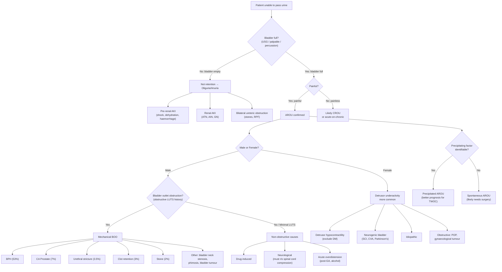

## Differential Diagnosis of Acute Retention of Urine

The differential diagnosis of AROU is really about answering two sequential questions:

1. **Is it actually urinary retention?** (i.e. is the bladder full?) — or is it something that *mimics* retention?
2. **If it is true retention, what is the underlying cause?** — this determines your definitive management.

Let's work through this systematically.

---

### 1. Is It True AROU? — Ruling Out Mimics

The first and most critical step is to ***differentiate between AROU and anuria*** [4]. This sounds basic, but it is a common pitfall — a patient who is "not passing urine" may have:

- **True urinary retention:** The kidneys are making urine, but it cannot get out → ***the bladder is full***
- **Oliguria / Anuria:** The kidneys are NOT making urine (or very little) → ***the bladder is empty***

These are entirely different clinical scenarios with entirely different management [2][3][4].

**Why does this matter?** If you assume "not passing urine = retention" and catheterise someone who is actually anuric from pre-renal AKI (e.g. shock from ruptured AAA), you will get almost no urine back and you've wasted time while the patient's renal function deteriorates. Conversely, if you assume "not passing urine = AKI" and start IV fluids in someone with AROU, you're just making the distended bladder worse.

**How to distinguish:**
- ***Bladder scan (USG):*** ≥ 300 mL in a patient unable to void suggests urinary retention; ≥ 1 L suggests chronic retention [2][3]
- ***First catheterised urine volume:*** If you catheterise and drain > 300–400 mL, it was true retention
- **Physical examination:** A ***palpable bladder ( > 200 mL)*** or ***dull to percussion ( > 150 mL)*** strongly suggests retention [5]

| Condition | Bladder | Kidneys | Key Clue |
|---|---|---|---|
| **AROU** | Full, distended, palpable | Working (producing urine) | Painful suprapubic mass, full on bladder scan |
| **Anuria / Oliguria** | Empty | Not working (pre-renal, renal, or bilateral post-renal obstruction) | No palpable bladder, empty on bladder scan |

<Callout title="Common Exam Mistake" type="error">
Students often forget to check the bladder volume before jumping to a diagnosis of AROU. The lecture slides and all senior notes emphasise: ***confirm urinary retention first*** — either by bladder USG or first catheterised volume — to ***rule out oliguria/anuria*** [2][3][4]. An empty bladder on scan redirects you toward pre-renal or renal causes of reduced urine output.
</Callout>

#### Causes of Anuria/Oliguria That Mimic AROU [4][7]

These conditions present with "not passing urine" but the bladder is **empty**:

| Category | Examples | Why the bladder is empty |
|---|---|---|
| **Pre-renal AKI** | ***Shock (e.g. ruptured AAA)***, ***dehydration***, haemorrhage, sepsis, cardiogenic shock | Inadequate renal perfusion → no filtrate produced |
| **Renal (intrinsic) AKI** | ***Acute renal failure*** (ATN, AIN, RPGN) | Parenchymal damage → no filtrate produced |
| **Bilateral ureteric obstruction** | Bilateral ureteric stones, retroperitoneal fibrosis, bilateral ureteric tumours | Urine is produced but obstructed *above* the bladder → bladder remains empty. Note: must be bilateral (or in a solitary kidney) to cause anuria [7] |

> **Key point:** Post-renal AKI from BPH/CA prostate causing AROU is technically also "post-renal" but the obstruction is at the bladder outlet level, so the bladder is *full*. Post-renal AKI from ureteric obstruction has an *empty* bladder because the block is above the bladder.

---

### 2. Is It Acute or Chronic?

Once you have confirmed that the bladder is full (true retention), the next step is to distinguish ***AROU from CROU*** [1][2][3]:

| Feature | ***AROU*** | ***CROU*** |
|---|---|---|
| Onset | ***Sudden onset*** | Gradual |
| Pain | ***Painful*** | ***Usually painless, vague lower abdominal distension*** |
| Typical cause | ***Benign prostatic obstruction*** (normal innervation) | ***Hypocontractile bladder*** (abnormal innervation, e.g. DM) |
| Bladder volume on scan | Usually 300–800 mL | Often ***≥ 1 L*** [2][3] |
| Overflow incontinence | Uncommon (too painful, presents early) | Common (bladder pressure exceeds outlet resistance → continuous dribbling) |

**Why does CROU not hurt?** In chronic retention, the bladder distends *slowly* over weeks to months. The sensory nerves adapt (or are already impaired, e.g. in diabetic neuropathy) and the bladder wall undergoes gradual stretching and remodelling. In AROU, the rapid distension activates nociceptive C-fibres before any accommodation can occur.

<Callout title="Clinical Pearl" type="idea">
A patient who presents with a palpable bladder to the umbilicus but *denies* significant pain is likely in **chronic** retention (or acute-on-chronic). Check for signs of chronicity: overflow incontinence, very large residual volume ( > 1 L), bilateral hydronephrosis on imaging, or elevated creatinine from chronic obstructive nephropathy.
</Callout>

---

### 3. Differential Diagnosis of the Underlying Cause of True AROU

Once you have confirmed true AROU, you need to determine *why* the patient cannot void. The differential is best organised by **mechanism**, which maps directly to the pathophysiology covered earlier [1][2][3][4][5]:

#### 3.1 Systematic Differential Organised by Mechanism

##### A. Bladder Outlet Obstruction (BOO) — Mechanical

**Mnemonic: think anatomically — Extramural → Mural → Intraluminal**

| Location | Differential | Key Distinguishing Features |
|---|---|---|
| **Extramural** | ***BPH*** | ***Commonest cause (53%)*** [1]. Male > 50, longstanding obstructive LUTS, DRE: smooth, enlarged, non-tender, median sulcus present |
| | ***CA Prostate*** | ***7%*** [1]. Hard, irregular, nodular prostate on DRE; loss of median sulcus; may have bone pain (metastases) |
| | ***Constipation / Faecal impaction*** | ***7.5%*** [1]. Loaded rectum on DRE; often a precipitant on top of BPH rather than a standalone cause [3] |
| | Pelvic organ prolapse | Female; cystocele, rectocele, uterovaginal prolapse; visible/palpable on pelvic exam |
| | Gynaecological tumours | Female; fibroids, ovarian masses; pelvic mass on examination |
| | Prostatitis | Acutely tender, boggy prostate on DRE; fever, perineal pain, dysuria |
| | Pregnancy | Gravid uterus; obvious on history |
| **Mural** | ***Urethral stricture*** | ***3.5%*** [1]. ***Iatrogenic (previous instrumentation) or infection/inflammation (STDs)*** [1]. History of catheterisation, cystoscopy, or gonococcal urethritis; gradual worsening of stream |
| | ***Bladder neck stenosis*** | ***Usually after previous prostate surgery*** [1]. History of TURP or radical prostatectomy |
| | Urethritis | Urethral discharge, dysuria; associated with STIs |
| | ***Bladder tumour*** | Haematuria (often painless), may obstruct bladder neck; suspect in smokers, aniline dye exposure |
| **Intraluminal** | ***Bladder/Urethral stone*** | ***2%*** [1]. Strangury, intermittent stream (stone acts as ball-valve), history of urolithiasis |
| | ***Clot retention*** | ***3%*** [1]. ***Severe gross haematuria*** [1] → clots fill the bladder and block the outlet; occurs post-procedure, in bladder/renal tumours, BPH |
| | Foreign body | Rare; iatrogenic (retained catheter fragments) or self-inserted |
| | ***Phimosis*** | ***Tight foreskin obstructing meatal orifice*** [1]. Visible on genital examination |

##### B. Bladder Outlet Obstruction (BOO) — Dynamic

| Cause | Mechanism | Key Features |
|---|---|---|
| ***Drug-induced (sympathomimetics)*** | ***α₁-agonists (phenylephrine, ephedrine — cold medications/cough mixtures)*** [4] ↑ smooth muscle tone at bladder neck | Recent intake of OTC cold remedies; AROU resolves after stopping the drug |
| Detrusor sphincter dyssynergia | Spinal cord lesion → simultaneous detrusor and sphincter contraction | Known SCI, MS; associated neurological signs |

##### C. Impaired Detrusor Contraction — Neurological

| Level of Lesion | Differentials | Key Features |
|---|---|---|
| **Brain** | ***Stroke / CVA, Parkinson's disease***, MS, NPH, MSA | Associated neurological deficit (hemiplegia, rigidity, tremor, cognitive decline) |
| **Spinal cord** | SCI (trauma), ***spinal cord compression (vertebral metastasis — must rule out)*** [5], spinal stenosis, transverse myelitis, epidural abscess/haematoma | ***Back pain, sensory level, lower limb weakness, reduced anal tone*** — RED FLAG for cauda equina |
| **Peripheral nerves** | ***Diabetic neuropathy*** (most common cause of CROU; ***exclude DM*** in females [1]), GBS, post-radical pelvic surgery, genital herpes (Elsberg syndrome) | Glove-and-stocking sensory loss, absent ankle jerks (DM); ascending weakness (GBS); vesicular rash (herpes) |

***Neurogenic bladder = bladder dysfunction associated with other neurological deficit*** [1].

##### D. Impaired Detrusor Contraction — Drug-Induced

| Drug Class | Examples | Mechanism |
|---|---|---|
| ***Anticholinergics*** | ***Atropine***, ipratropium, oxybutynin | Block M₃ on detrusor → ↓ contraction |
| ***Antipsychotics*** | Chlorpromazine, olanzapine | Anticholinergic side-effect |
| ***Antidepressants*** | TCAs (amitriptyline), SSRIs (less so) | Anticholinergic side-effect |
| Antihistamines | Diphenhydramine, chlorpheniramine | First-generation = potent anticholinergic |
| Opioids | Morphine, codeine | ↓ Detrusor tone + ↓ conscious level |
| ***Sympathomimetics (β-agonists)*** | ***Terbutaline, salbutamol*** | β₂/β₃ stimulation → detrusor relaxation |
| Class Ia antiarrhythmics | Disopyramide | Anticholinergic properties |

##### E. Acute Overdistension

| Cause | Mechanism |
|---|---|
| Post-anaesthesia (GA, epidural) | Suppressed afferent sensation + ↓ detrusor tone → silent overdistension |
| Post-operative / prolonged immobility | Poor voiding when supine + opioid analgesia |
| Excessive fluid intake (especially alcohol) | ↑ Urine production (diuresis) + CNS depression (↓ voiding urge) |
| Painful perianal pathologies | Thrombosed haemorrhoids, perianal abscess → reflex inhibition of voiding |

##### F. Female-Specific Differentials

***Common causes in females*** [1]:
- ***Detrusor hypocontractility — exclude DM***
- ***Neurogenic bladder***
- ***Idiopathic***
- Pelvic organ prolapse (cystocele)
- Gynaecological tumours (fibroids, ovarian masses)

---

### 4. Differential Diagnosis Algorithm

The following mermaid diagram illustrates the systematic approach to the differential diagnosis of a patient presenting with "inability to pass urine":

---

### 5. Key Differentiating Features by Cause

The table below summarises the most important clinical clues that help distinguish between the common causes:

| Cause | Age/Sex | Key History | Key Examination | Key Investigation |
|---|---|---|---|---|
| ***BPH*** | ***Male 50–80*** | Longstanding obstructive LUTS (hesitancy, weak stream); precipitant often identified | ***DRE: smooth, enlarged > 3FB, non-tender, median sulcus present*** [5] | Uroflowmetry: ↓Qmax; IPSS elevated |
| ***CA Prostate*** | Male > 60 | Obstructive LUTS + bone pain, weight loss; may present de novo | DRE: **hard, irregular, nodular; loss of median sulcus** | PSA elevated (but do NOT check in acute setting — ***AROU causes false elevation; check 4–6 weeks later*** [2][3]); MRI; TRUS biopsy |
| ***Urethral stricture*** | Any age male | ***History of instrumentation or STDs*** [1]; gradually worsening stream | May be unable to pass catheter; catheter gets stuck in penile urethra | Urethrogram; cystoscopy |
| ***Clot retention*** | Any age | ***Severe gross haematuria*** [1]; post-procedure or known bladder/renal tumour | Haematuria visible; bladder washout may be needed | Cystoscopy (after clot evacuation) |
| ***Bladder/Urethral stone*** | Any age | ***Strangury***; intermittent stream; history of urolithiasis | May feel stone on DRE or per urethra | KUB X-ray; CT KUB; cystoscopy |
| ***Drug-induced*** | Any age | ***Recent new medication*** (cold remedy, anticholinergic, opioid) | No prostatic enlargement; no neurological deficit | Resolves after drug cessation |
| ***Neurological (spinal cord compression)*** | Any age | ***Back pain, leg weakness, sensory changes, incontinence*** | ***Sensory level, ↓ lower limb power, ↓ anal tone*** | **Urgent MRI spine** |
| ***Diabetic neuropathy*** | Known DM | Longstanding DM; gradual onset; often presents as CROU | Peripheral neuropathy signs (glove-and-stocking, absent ankle jerks) | HbA1c; urodynamics |
| ***Post-operative / Post-GA*** | Any age | ***Recent surgery or anaesthesia*** | Often no other findings; full bladder discovered on routine post-op check | Bladder scan |
| ***Prostatitis*** | Young–middle-aged male | Fever, perineal pain, dysuria; may have recent UTI | ***DRE: tender, boggy, swollen prostate*** (examine gently!) | Urine C/ST; blood cultures if septic |
| ***Constipation*** | Elderly | Often co-exists with BPH; recent history of no bowel movement | Faecal loading on DRE; palpable stool on abdominal exam | AXR (faecal loading); KUB |

<Callout title="Must-Know: PSA in AROU" type="error">
***Do NOT check PSA during an episode of AROU*** — the acutely distended bladder and catheterisation cause ***false elevation*** of PSA. It should be checked ***4–6 weeks later*** once the acute episode has resolved [2][3]. Checking it acutely will lead to unnecessary anxiety and potentially unnecessary biopsies.
</Callout>

---

### 6. Differential Diagnosis of LUTS (Broader Context)

Since many AROU patients have a background of LUTS, it is worth knowing the broader differential of LUTS to avoid anchoring on BPH alone [4]:

| Category | Differentials | Predominant Symptom Type |
|---|---|---|
| **Bladder outlet obstruction** | ***BPH, CA prostate, urethral stricture, bladder neck contracture (post-surgery/radiotherapy), bladder stones, bladder cancer*** | Predominantly ***voiding (obstructive)*** symptoms |
| **Overactive bladder (detrusor overactivity)** | ***Neurogenic*** (stroke, SCI, MS, Parkinson's) or ***Non-neurogenic/idiopathic*** (may be secondary to BOO) | Predominantly ***storage (irritative)*** symptoms |
| **Other** | UTI, interstitial cystitis, ***ketamine cystitis*** (relevant in Hong Kong), bladder cancer, urethral diverticulum | Mixed |

> **Why is this relevant?** A patient presenting with AROU may have been experiencing LUTS for years. The pattern of LUTS (voiding-dominant vs storage-dominant) helps narrow the differential even before investigations.

---

### 7. Summary: Prioritised Differential Diagnosis Approach

When a patient presents with "cannot pass urine," think in this order:

1. **Is the bladder full?** → If no → it's anuria/oliguria, not retention. Investigate for AKI.
2. **Is it acute or chronic?** → Painful = AROU. Painless = CROU or acute-on-chronic.
3. **Is there a precipitant?** → Drugs, constipation, surgery/GA, alcohol, UTI → suggests precipitated AROU (treatable cause).
4. **Is it obstructive?** → History of obstructive LUTS? DRE findings? → BPH, CA prostate, stricture, stone, clot.
5. **Is it neurological?** → Any red flags (back pain, saddle anaesthesia, limb weakness, ↓ anal tone)? → ***Must rule out spinal cord compression*** [5]. Also think about DM neuropathy, stroke, Parkinson's.
6. **Is it drug-induced?** → Always check the drug chart. Sympathomimetics, anticholinergics, opioids.
7. **Is it post-operative/overdistension?** → Recent GA or prolonged immobility?

<Callout title="High Yield Summary">

**Key principles for AROU differential diagnosis:**

1. **First confirm it IS retention** — bladder scan/catheterised volume — rule out anuria/oliguria
2. **Then confirm it IS acute** — painful = AROU; painless = CROU
3. **In males, think BOO first:** BPH (53%) is the #1 cause; then CA prostate (7%), constipation (7.5%), urethral stricture (3.5%), clot retention (3%), stones (2%)
4. **In females, think detrusor underactivity first:** exclude DM; consider neurogenic bladder; idiopathic; or obstructive causes like POP / gynaecological tumours
5. **Always check for precipitants:** drugs, constipation, GA/surgery, alcohol, UTI, painful perianal conditions
6. **Always screen for neurological red flags:** cauda equina (back pain + saddle anaesthesia + ↓ anal tone) = emergency
7. **Do NOT check PSA acutely** — false elevation; check 4–6 weeks later
8. Drug-induced AROU is reversible — always review the drug chart

</Callout>

---

<ActiveRecallQuiz
  title="Active Recall - Differential Diagnosis of AROU"
  items={[
    {
      question: "A patient presents with inability to pass urine. What is the FIRST thing you must determine, and how?",
      markscheme: "Determine whether the bladder is full or empty (i.e. true retention vs anuria/oliguria). Use bladder ultrasound scan (>= 300 mL suggests retention) or first catheterised urine volume. If bladder is empty, investigate for pre-renal, renal, or bilateral ureteric obstruction causing AKI."
    },
    {
      question: "List the top 5 causes of AROU in males with their approximate percentages.",
      markscheme: "BPH (53%), constipation (7.5%), CA prostate (7%), urethral stricture (3.5%), clot retention (3%). Other: neurological (2%), post-operative (2%), calculus (2%), drugs (2%), infection (2%)."
    },
    {
      question: "What are the three commonest causes of AROU in females?",
      markscheme: "Detrusor hypocontractility (must exclude DM), neurogenic bladder (SCI, CVA, Parkinson's), and idiopathic. Obstructive causes (POP, gynaecological tumours) are less common."
    },
    {
      question: "Why should you NOT check PSA during an acute episode of AROU?",
      markscheme: "AROU and catheterisation cause false elevation of PSA. Should be checked 4-6 weeks after the acute episode has resolved to avoid unnecessary anxiety and biopsies."
    },
    {
      question: "What neurological red flags must be screened for in every AROU patient, and what do they suggest?",
      markscheme: "New back pain, saddle anaesthesia (S2-S4 perineal numbness), bilateral lower limb weakness, and reduced anal tone on DRE. These suggest cauda equina syndrome or spinal cord compression, which is a neurosurgical emergency requiring urgent MRI."
    },
    {
      question: "How do you distinguish AROU from CROU clinically?",
      markscheme: "AROU: sudden onset, painful, occurs with normal innervation (e.g. BPH), bladder typically 300-800 mL. CROU: gradual onset, painless/vague lower abdominal distension, abnormal innervation (e.g. DM neuropathy), bladder often >= 1 L, may have overflow incontinence."
    }
  ]}
/>

---

## References

[1] Lecture slides: GC 180. Benign prostatic hyperplasia, bladder outlet obstruction and urinary retention.pdf (p23, p25, p30, p31, p33)
[2] Senior notes: Ryan Ho Urogenital.pdf (p164–167)
[3] Senior notes: Ryan Ho Fundamentals.pdf (p349–352)
[4] Senior notes: felixlai.md (Acute retention of urine section, Differential diagnosis of LUTS section)
[5] Senior notes: maxim.md (AROU and BPH sections)
[7] Senior notes: Ryan Ho Critical Care.pdf (p25 — AKI aetiology)
