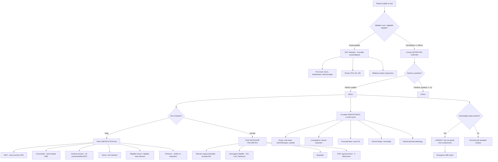

## Differential Diagnosis of Acute Retention of Urine

The differential diagnosis of AROU is really about answering two sequential questions:

1. **Does this patient truly have urinary retention?** — or is the problem actually that urine is not being *produced* (anuria/oliguria)?
2. **If it is retention, what is the underlying cause?** — obstruction, detrusor failure, neurological, drug-induced, or a combination?

This sounds simple, but in practice a distressed, oliguric elderly patient on a surgical ward can easily be mislabelled as "not passing urine" when they are actually in pre-renal AKI from dehydration, or conversely, a patient with overflow dribbling may be assumed to be voiding normally when in fact they have a massively distended bladder. The first branch in your differential thinking is therefore the most critical.

---

### 1. The First Branch: AROU vs Anuria/Oliguria

***AROU should be distinguished from anuria or oliguria → lack of urine production, not retention*** [2].

| Feature | AROU | Anuria / Oliguria |
|---|---|---|
| **Bladder** | Full, distended, palpable, tender | Empty, not palpable |
| **Pain** | Suprapubic pain and urgency | No suprapubic distension |
| **Bladder scan** | ***≥ 300 mL*** [2] | Minimal volume |
| **Urine output** | Patient *feels* urge but cannot void; may have overflow dribbling | Genuinely reduced or absent urine output |
| **Pathophysiology** | Outflow problem or detrusor failure (urine is produced but trapped) | Production problem (kidneys not making urine) |

**Causes of anuria/oliguria to rule out** [2][3]:
- ***Pre-renal ARF due to dehydration and shock*** — hypovolaemia (haemorrhage, vomiting, diarrhoea, burns, sepsis, cardiogenic shock) → ↓ renal perfusion → ↓ GFR → ↓ urine output [5]
- ***Renal ARF due to acute tubular necrosis, interstitial nephritis, glomerulonephritis*** — intrinsic renal damage → kidneys cannot filter [5]
- **Post-renal obstruction at the ureteric level** — bilateral ureteric stones, retroperitoneal fibrosis, bilateral ureteric tumours → urine cannot reach the bladder at all; bladder will be empty on scan

> The bedside bladder scan is your instant differentiator: a full bladder ( ≥ 300 mL) = retention; an empty bladder = look upstream (kidneys, ureters) or systemically (shock, dehydration).

<Callout title="Classic Exam Trap" type="error">
A post-operative patient has not passed urine for 8 hours. The surgical team assumes "AROU from anaesthesia" and calls for catheterisation. But the bladder scan shows only 50 mL. This is NOT retention — this is oliguria, likely pre-renal AKI from intra-operative blood loss or inadequate fluid resuscitation. Catheterising this patient will not help; they need volume resuscitation and assessment of renal function. ***Always scan the bladder before assuming retention.***
</Callout>

The differential for anuria/oliguria masquerading as AROU [3][5]:

| Cause | Mechanism | Key Clue |
|---|---|---|
| **Hypovolaemic shock** (e.g., ruptured AAA, GI bleed, trauma) | ↓ circulating volume → ↓ renal perfusion → ↓ GFR → oliguria | Hypotension, tachycardia, empty bladder, history of bleeding/trauma |
| **Dehydration** (vomiting, diarrhoea, poor intake) | Same as above — pre-renal mechanism | Dry mucous membranes, ↑ urea:creatinine ratio, concentrated urine |
| **Septic shock** | Distributive shock → ↓ effective circulating volume → pre-renal AKI | Fever, hypotension, source of infection |
| **Cardiogenic shock** | Pump failure → ↓ cardiac output → ↓ renal perfusion | Raised JVP, pulmonary oedema, hypotension |
| **Acute tubular necrosis (ATN)** | Ischaemic or nephrotoxic insult → tubular cell death → intrinsic renal failure | Follows prolonged hypotension or nephrotoxin exposure; muddy brown casts on urinalysis |
| **Bilateral ureteric obstruction** | Stones, tumour, retroperitoneal fibrosis → urine cannot reach bladder | Empty bladder; bilateral hydronephrosis on ultrasound |

---

### 2. The Second Branch: AROU vs Chronic Retention of Urine (CROU)

Once you have confirmed urinary retention (full bladder), you must determine whether this is ***acute*** or ***chronic*** [1]:

| Feature | ***AROU*** | ***CROU*** |
|---|---|---|
| Onset | ***Sudden*** | Gradual (weeks to months) |
| Pain | ***Painful*** | ***Usually painless, vague lower abdominal distension*** |
| Typical cause | ***Benign prostatic obstruction*** | ***Hypocontractile bladder*** (e.g., DM neuropathy) |
| Bladder volume | Typically 300–800 mL | Can be ***≥ 1 L*** [2] (sometimes > 2 L) |
| Innervation | Usually intact (that is why it hurts) | Often impaired (autonomic neuropathy → loss of bladder sensation → painless) |
| Overflow incontinence | Uncommon (too acute) | Common — constant dribbling, especially at night |

Why does AROU hurt but CROU doesn't? Because in AROU the sensory nerves (Aδ and C-fibres) are intact and firing intensely as the bladder rapidly distends. In CROU, the underlying cause often involves progressive neuropathy (e.g., diabetes) — the nerves that should signal pain are themselves damaged, so the bladder fills silently to enormous volumes.

<Callout title="Bladder Scan Volume Rule of Thumb" type="idea">
***Bladder scan ≥ 300 mL in a patient unable to void → suggests urinary retention*** [2]. ***≥ 1 L suggests chronic retention*** [2]. If you catheterise a patient expecting AROU and get 1.5 litres out, think CROU — and look for underlying neurological causes (DM neuropathy, cauda equina).
</Callout>

---

### 3. Differential Diagnosis of AROU by Cause — Organised by Mechanism

This is the core differential diagnosis table. Think of it as answering: "**Why can't this patient void?**"

#### 3.1 Obstructive Causes (Mechanical Bladder Outlet Obstruction)

These are by far the most common causes in males. Organised by anatomical location (extraluminal → intramural → intraluminal):

| Location | Cause | Why It Causes AROU | Key Differentiating Feature |
|---|---|---|---|
| **Extraluminal** | ***BPH*** | Transition zone hyperplasia compresses prostatic urethra; ***53% of all AROU*** [1] | Age ***50–80***; ***DRE: smooth enlarged > 3FB, non-tender, median sulcus present*** [4]; longstanding obstructive LUTS |
| | ***Cancer of prostate*** | Malignant infiltration/enlargement → urethral compression; ***7% of AROU*** [1] | ***DRE: hard, nodular, irregular, median sulcus obliterated***; may have bone pain (mets), weight loss, ↑ PSA |
| | **Constipation / faecal impaction** | Loaded rectum compresses prostatic urethra from posteriorly; ***7.5%*** [1] | Often a ***precipitating factor with background BPH*** rather than standalone cause [2]; palpable faecal loading on DRE/AXR |
| | **Pelvic tumours** | Mass effect compressing bladder neck | History of malignancy; palpable pelvic mass on bimanual/DRE |
| | **Prostatitis** | Acute prostatic oedema → urethral compression; also pain inhibits voiding reflex | Fever, ***tender boggy prostate on DRE***, dysuria, pyuria; younger patient (20–50) |
| | **Pelvic organ prolapse** (females) | Cystocele kinks urethra; rectocele/uterovaginal prolapse distorts anatomy | Sensation of vaginal bulge, worsens with standing; visible on pelvic exam |
| | **Gynaecological tumours** (females) | e.g., large fibroid compresses bladder neck/urethra | Palpable pelvic mass; menorrhagia history |
| | **Pregnancy** (females) | Gravid uterus compresses bladder outlet, especially retroverted uterus in 1st trimester | Positive pregnancy test; usually self-resolves as uterus rises out of pelvis |
| **Intramural** | ***Bladder neck stenosis*** | ***Usually after previous prostate surgery*** [1]; scarring narrows bladder neck | History of TURP, radical prostatectomy, or radiotherapy |
| | ***Urethral stricture*** | ***Iatrogenic or infection/inflammation*** [1]; fibrosis → luminal narrowing; ***3.5%*** [1] | History of catheterisation, urethral instrumentation, gonococcal urethritis; thin stream/spraying |
| | **Urethritis** | Mucosal oedema narrows lumen; pain causes reflex sphincter spasm | Urethral discharge, dysuria; history of STI |
| | ***Bladder tumour*** | Tumour at bladder neck physically occludes internal urethral orifice [1] | Painless haematuria; risk factors: smoking, occupational dye exposure |
| **Intraluminal** | ***Bladder/urethral stone*** | Stone lodges at bladder neck or along urethra → ball-valve obstruction; ***2%*** [1] | Strangury (painful straining to void small volumes); haematuria; history of urolithiasis |
| | ***Clot retention*** (***severe gross haematuria***) | Blood clots fill bladder and plug outlet; ***3%*** [1] | Obvious gross haematuria preceding retention; causes include bleeding BPH, bladder tumour, post-TURP |
| | **Foreign body** | Object inserted or migrated into urethra/bladder | Psychiatric history; embarrassed to disclose; visible on imaging |
| | ***Phimosis*** | Tight foreskin occludes external urethral meatus [1] | Visible on inspection; cannot retract foreskin; history of recurrent balanitis |

#### 3.2 Drug-Induced Causes

| Drug Class | Examples | Mechanism | Differentiating Clue |
|---|---|---|---|
| ***Sympathomimetics (α-agonists)*** | ***Phenylephrine, ephedrine*** (***cough mixture***) [4] | α₁ stimulation → contracts bladder neck/prostatic smooth muscle → ↑ outlet resistance | Recent cold/flu; started OTC cold remedy |
| **Sympathomimetics (β-agonists)** | Terbutaline, salbutamol | β₂/β₃ agonism → relaxes detrusor → ↓ contractile force | Recent asthma exacerbation with nebuliser use |
| ***Anticholinergics*** | ***Atropine*** [4], oxybutynin, ipratropium | Block M₃ muscarinic receptors → detrusor cannot contract | New anticholinergic medication; dry mouth, constipation, blurred vision (systemic anticholinergic features) |
| **Antipsychotics** | Chlorpromazine, olanzapine | Anticholinergic side effect | Psychiatric medication history |
| **Antidepressants** | TCAs (amitriptyline), SSRIs | TCAs: strong anticholinergic + α-adrenergic effects | Recent initiation or dose increase |
| **Antihistamines** | Diphenhydramine, chlorpheniramine | 1st-generation: significant anticholinergic effect | OTC allergy/sleep medication |
| **Opioids** | Morphine, codeine, tramadol | Central suppression of micturition reflex + smooth muscle effects | ***Post-operative*** setting [1]; recent analgesia |
| **MDMA (Ecstasy)** | Recreational | Sympathomimetic → α₁ agonism at bladder neck | Young patient, recreational drug use history |

#### 3.3 Neurological Causes

| Level | Cause | Why It Causes AROU | Differentiating Features |
|---|---|---|---|
| **Brain** | Stroke, Parkinson's disease, MS, NPH, MSA | Disruption of cortical/subcortical micturition control; acute stroke can cause initial retention before later developing overactivity | Focal neurological deficits; tremor/rigidity (PD); gait ataxia + dementia + incontinence (NPH triad) |
| **Spinal cord** | ***SCI***, vertebral metastasis, spinal stenosis, transverse myelitis, epidural abscess/metastasis | Interruption of descending pathways from PMC → DSD or loss of detrusor reflex | ***Sensory level on exam***; back pain; lower limb weakness; ↓ anal tone; ***must rule out spinal cord compression*** [4] |
| **Peripheral nerves** | DM neuropathy, radical pelvic surgery, GBS, genital herpes (sacral nerves) | Damage to pelvic parasympathetic efferents → areflexic detrusor | ***DM*** history (***exclude DM*** in females with hypocontractility) [1]; ascending weakness (GBS); vesicular rash in S2-4 dermatome (herpes) |

#### 3.4 Acute Overdistension / Functional

| Cause | Why It Causes AROU | Differentiating Features |
|---|---|---|
| ***Post-operative / post-anaesthesia*** | GA/epidural/spinal → blocks sacral parasympathetic outflow; + IV fluids → rapid filling; + opioid analgesia → central suppression of voiding reflex; ***2%*** [1] | Recent surgery/anaesthesia; no prior voiding symptoms |
| **Prolonged immobility** | Poor voiding efficiency in supine position; psychological difficulty voiding in bed | Hospitalised, bed-bound patient |
| **Excessive alcohol intake** | Diuresis (ADH suppression) + sedation (ignores urge) → overdistension | Binge drinking history; acute presentation |
| **Painful perianal conditions** | Thrombosed haemorrhoids, perianal abscess → reflex sphincter spasm from pain | Perianal tenderness; visible pathology on inspection |

---

### 4. Sex-Specific Differential Diagnosis Framework

Because the differential is so different between males and females, it is worth having a sex-specific mental framework:

#### Males — Think Obstruction First

***Common obstructive causes in males*** [1]:
- ***Benign Prostatic Hyperplasia (BPH)***
- ***Cancer of prostate***
- ***Bladder/Urethral stone***
- ***Bladder neck stenosis (usually after previous prostate surgery)***
- ***Urethral stricture (iatrogenic or infection/inflammation)***
- ***Phimosis***
- ***Bladder tumour***
- ***Clot retention (Severe gross haematuria)***

Then consider precipitants: drugs, constipation, alcohol, immobility, post-operative.

#### Females — Think Detrusor Failure First

***Common causes in females*** [1]:
- ***Detrusor hypocontractility — exclude DM***
- ***Neurogenic bladder***
- ***Idiopathic***

***Neurogenic bladder*** [1]:
- ***Bladder dysfunction associated with other neurological deficit***
- ***E.g., SCI, CVA, parkinsonism***

Then consider obstructive causes (less common): pelvic organ prolapse, gynaecological tumours, pregnancy.

---

### 5. Differential Diagnosis Algorithm

```mermaid
graph TD
    A["Patient unable to void"] --> B{"Bladder scan / palpable bladder?"}
    B -->|"Full bladder >= 300mL"| C["Urinary RETENTION confirmed"]
    B -->|"Empty bladder"| D["NOT retention - Consider anuria/oliguria"]
    
    D --> D1["Pre-renal: shock, dehydration, haemorrhage"]
    D --> D2["Renal: ATN, GN, AIN"]
    D --> D3["Bilateral ureteric obstruction"]
    
    C --> E{"Painful or painless?"}
    E -->|"Painful, sudden"| F["AROU"]
    E -->|"Painless, gradual, >= 1L"| G["CROU"]
    
    F --> H{"Sex of patient?"}
    
    H -->|"Male"| I["Think OBSTRUCTION first"]
    I --> I1["BPH - most common 53%"]
    I --> I2["CA prostate - hard nodular DRE"]
    I --> I3["Urethral stricture - Hx instrumentation/STD"]
    I --> I4["Stone / clot retention"]
    I --> I5["Bladder tumour / bladder neck stenosis"]
    I --> I6["Phimosis - visible on inspection"]
    
    H -->|"Female"| J["Think DETRUSOR FAILURE first"]
    J --> J1["Detrusor hypocontractility - exclude DM"]
    J --> J2["Neurogenic bladder - SCI, CVA, Parkinson"]
    J --> J3["Idiopathic"]
    J --> J4["POP / gynae tumour - if obstructive"]
    
    F --> K["Consider PRECIPITANTS in both sexes"]
    K --> K1["Drugs: cold meds, anticholinergics, opioids"]
    K --> K2["Constipation / faecal impaction"]
    K --> K3["Post-operative / post-GA"]
    K --> K4["Alcohol binge / immobility"]
    K --> K5["Painful perianal pathology"]
    
    F --> L{"Neurological signs present?"}
    L -->|"Yes"| M["URGENT: rule out spinal cord compression"]
    M --> M1["Emergency MRI spine"]
    L -->|"No"| N["Proceed with standard workup"]
```

---

### 6. How to Differentiate at the Bedside — A Practical Approach

When faced with AROU in the emergency department, here is how you systematically narrow the differential:

#### Step 1: Confirm Retention
- **Bladder scan** or abdominal palpation/percussion → ***bladder palpable > 200 mL, dull to percussion > 150 mL*** [4]
- If bladder empty → not retention → investigate for anuria/oliguria

#### Step 2: Acute or Chronic?
- Ask about **pain** (AROU is painful; CROU is painless)
- Ask about **duration** and **previous episodes**
- Catheterised volume: ***≥ 1 L suggests CROU*** [2]

#### Step 3: Look for the Cause

| Assessment | What You're Looking For | Differential Narrowed |
|---|---|---|
| **Drug history** | New cold meds, anticholinergics, opioids, antipsychotics, bronchodilators | Drug-induced |
| **Surgical history** | Recent surgery/GA, previous prostate surgery, urethral instrumentation | Post-operative retention, bladder neck stenosis, urethral stricture |
| **LUTS history** | Longstanding hesitancy, weak stream, nocturia (IPSS) | BPH (if obstructive predominant) |
| **DRE** | Smooth enlarged = BPH; hard nodular = CA prostate; tender boggy = prostatitis; faecal loading = constipation; ↓ anal tone = neurological | Narrows obstructive cause + screens for neurological |
| **External genitalia** | Phimosis visible; blood at meatus = urethral injury; discharge = urethritis/STI | Phimosis, urethral trauma, urethritis |
| ***Neurological exam*** | ***Sensory level***, lower limb weakness, absent perineal sensation, ↓ bulbocavernosus reflex | Spinal cord compression, cauda equina, DM neuropathy |
| **Constitutional symptoms** | Weight loss, bone pain, anorexia | Malignancy (CA prostate, bladder CA, pelvic tumour) |
| **Haematuria** | Preceding gross haematuria with clots | Clot retention; underlying cause = bladder tumour, bleeding BPH |
| **Pelvic exam** (females) | Prolapse, pelvic mass | POP, gynaecological tumour |

#### Step 4: Red Flags Requiring Urgent Action

| Red Flag | Concern | Action |
|---|---|---|
| ***New neurological deficit (sensory level, weakness, ↓ anal tone)*** | ***Spinal cord compression / cauda equina*** | ***Emergency MRI spine*** |
| **Fever + tender prostate** | Acute prostatitis / prostatic abscess | Avoid aggressive DRE; antibiotics; avoid catheterisation if possible (suprapubic catheter preferred) |
| **Blood at urethral meatus / high-riding prostate** | Urethral trauma (e.g., pelvic fracture) | ***Contraindication for urethral catheterisation*** → suprapubic catheter or retrograde urethrogram first |
| **Grossly elevated creatinine** | Obstructive nephropathy / post-renal AKI | Urgent decompression + nephrology input |
| **Fever + rigors + retention** | Urosepsis | Urgent catheterisation + blood cultures + empirical IV antibiotics |

---

### 7. Differential Diagnosis of LUTS — Broader Context

AROU does not occur in isolation. Most patients presenting with AROU have a background of LUTS. Understanding the differential of LUTS helps you understand what the underlying disease is:

***Bladder outlet obstruction typically presents with predominantly voiding symptoms*** [3]:
- **Bladder causes**: bladder stones, bladder cancer, bladder neck contracture (scarring from surgery/radiotherapy), interstitial cystitis, ketamine cystitis
- **Prostate causes**: ***BPH, prostatic cancer***
- **Urethral causes**: ***urethral stricture*** (urinary instrumentation)

***Overactive bladder (detrusor overactivity) typically presents with predominantly storage symptoms*** [3]:
- ***Neurogenic***: stroke, SCI, MS, Parkinson's disease
- ***Non-neurogenic (idiopathic)***: post-operative pelvic surgery; secondary to BOO itself (overactive bladder can be secondary to bladder outlet obstruction — the detrusor hypertrophies to overcome obstruction and becomes unstable)

---

### 8. The "DELIRIUM" Mnemonic Connection

Interestingly, ***retention of urine*** appears in the differential diagnosis of delirium [6]:

***D***rugs, ***E***lectrolytes/Ears/Eyes, ***L***ow oxygen, ***I***nfection, ***R***etention of urine or faeces, ***I***ctogenic, ***U***nderhydration/Undernutrition, ***M***etabolic

This reminds us that AROU itself can *cause* delirium in elderly patients — the pain, discomfort, and autonomic disturbance from a grossly distended bladder can precipitate an acute confusional state. Always check for urinary retention in a delirious patient, and always consider delirium in a patient with retention who becomes confused.

---

<Callout title="High Yield Summary">

1. **First differentiate AROU from anuria/oliguria** — bladder scan is the key: full bladder = retention; empty bladder = production problem (pre-renal/renal/bilateral ureteric obstruction)
2. **Then differentiate AROU from CROU** — AROU is painful (intact innervation, rapid distension); CROU is painless (impaired innervation, gradual distension); ***≥ 1 L on catheterisation suggests CROU***
3. **In males, think obstruction first** — ***BPH is #1 (53%)*** → then CA prostate, constipation, stricture, clot retention, stone, phimosis, bladder tumour, bladder neck stenosis
4. **In females, think detrusor failure first** — ***detrusor hypocontractility (exclude DM), neurogenic bladder, idiopathic***
5. **Always consider precipitants** — drugs (cold meds, anticholinergics, opioids), constipation, post-GA, alcohol, immobility, perianal pain
6. ***Neurological red flags mandate emergency MRI*** — sensory level, lower limb weakness, loss of anal tone → spinal cord compression until proven otherwise
7. **Blood at meatus / high-riding prostate** → urethral trauma → ***contraindication for urethral catheterisation***
8. **DRE is the single most important bedside differentiating examination** — smooth enlarged = BPH; hard nodular = CA prostate; tender boggy = prostatitis; faecal loading = constipation; ↓ anal tone = neurological
9. ***Do NOT check PSA during AROU*** — it will be falsely elevated; defer 4–6 weeks [2]
10. AROU can cause delirium in elderly — and delirium workup should include checking for retention

</Callout>

---

<ActiveRecallQuiz
  title="Active Recall - Differential Diagnosis of AROU"
  items={[
    {
      question: "A patient is reported as 'not passing urine' post-operatively. What is the single most important bedside test to differentiate AROU from oliguria, and what volume cutoffs do you use?",
      markscheme: "Bedside bladder scan (or bedside ultrasound). Full bladder >= 300 mL = urinary retention. Empty bladder = not retention, consider oliguria/anuria (pre-renal, renal, or bilateral ureteric obstruction). >= 1 L on catheterisation suggests chronic retention."
    },
    {
      question: "List the top 5 obstructive causes of AROU in males with approximate percentages from the classic Murray et al. study.",
      markscheme: "BPH (53%), constipation (7.5%), CA prostate (7%), urethral stricture (3.5%), clot retention (3%). BPH is overwhelmingly the most common."
    },
    {
      question: "In females presenting with AROU, what are the three most common causes and what condition must you specifically exclude?",
      markscheme: "Three common causes: (1) detrusor hypocontractility, (2) neurogenic bladder, (3) idiopathic. Must specifically exclude DM (diabetic autonomic neuropathy causing detrusor underactivity)."
    },
    {
      question: "A 72-year-old man presents with AROU, bilateral leg weakness, and saddle anaesthesia. What is the most important differential to rule out, what examination finding confirms your suspicion, and what is the urgent investigation?",
      markscheme: "Cauda equina syndrome / spinal cord compression. Key findings: sensory level, lower limb weakness, reduced anal tone, absent bulbocavernosus reflex, saddle anaesthesia. Urgent investigation: emergency MRI spine."
    },
    {
      question: "Why is AROU painful but CROU painless? Explain the pathophysiological basis.",
      markscheme: "In AROU, sensory innervation is intact (Ad and C-fibres functioning normally), and the bladder distends rapidly, intensely activating stretch/pain receptors. In CROU, the underlying cause often involves progressive autonomic neuropathy (e.g., DM) damaging afferent nerves, so bladder sensation is impaired; additionally, the bladder distends slowly over weeks allowing gradual accommodation."
    },
    {
      question: "Name three clinical findings on DRE that help differentiate between BPH, CA prostate, and prostatitis as causes of AROU.",
      markscheme: "BPH: smooth, enlarged (> 3 finger-breadths), non-tender, rubbery, median sulcus preserved. CA prostate: hard, nodular, irregular, median sulcus obliterated, non-tender (unless locally advanced). Prostatitis: tender, boggy, warm, may be normal size or slightly enlarged."
    }
  ]}
/>

---

## References

[1] Lecture slides: GC 180. Benign prostatic hyperplasia, bladder outlet obstruction and urinary retention.pdf (pp. 23, 24, 25, 27, 30, 31, 33)
[2] Senior notes: Ryan Ho Urogenital.pdf (pp. 164–167); Ryan Ho Fundamentals.pdf (pp. 349–352)
[3] Senior notes: felixlai.md (AROU section, differential diagnosis of LUTS section)
[4] Senior notes: maxim.md (AROU section, BPH section)
[5] Senior notes: Ryan Ho Critical Care.pdf (p. 25 — AKI aetiology)
[6] Senior notes: Ryan Ho Psychiatry.pdf (p. 74 — DELIRIUM mnemonic)
