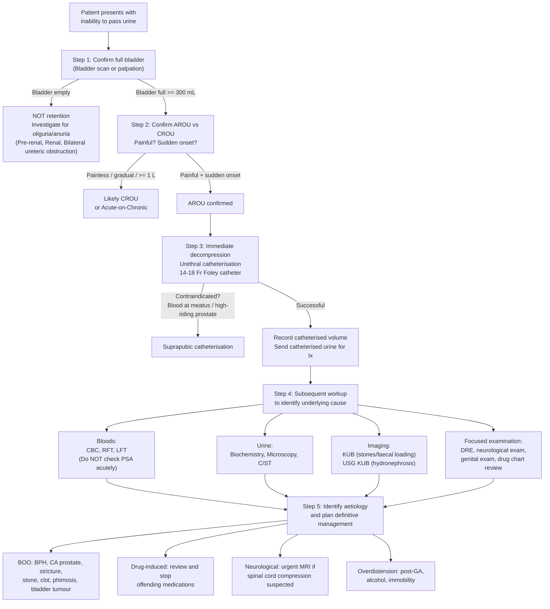

## Diagnostic Criteria, Diagnostic Algorithm, and Investigations for Acute Retention of Urine

---

### 1. Diagnostic Criteria

AROU does not have formal "diagnostic criteria" in the way that, say, rheumatoid arthritis or heart failure does. Instead, the diagnosis is **clinical + confirmatory**. Let me walk you through the logic:

#### 1.1 Clinical Diagnosis (Presumptive)

The diagnosis of AROU is ***presumed*** when all three elements are present [2][3][4]:

| Criterion | Explanation | How to Confirm |
|---|---|---|
| **1. Inability to void** | Patient reports they cannot pass urine at all, or can only pass tiny volumes | History |
| **2. Sudden onset** | Distinguishes AROU from CROU — the patient was voiding normally (or with some difficulty) and then suddenly could not | History: ask when they last voided normally |
| **3. Painful suprapubic distension** | The full bladder stretches the bladder wall → nociceptive C-fibre activation → suprapubic pain. This differentiates AROU (painful, normal innervation) from CROU (painless, often abnormal innervation) | History + examination (tender palpable suprapubic mass) |

#### 1.2 Confirmatory Diagnosis

Clinical suspicion must be **confirmed** by demonstrating a full bladder [2][3]:

- ***Bladder scan (USG): ≥ 300 mL in a patient unable to void suggests urinary retention*** [2][3]
- ***≥ 1 L suggests chronic retention of urine*** [2][3]
- Alternatively: ***first catheterised urine volume*** — if you drain > 300–400 mL upon catheterisation, this confirms retention

<Callout title="Can You Skip the Bladder Scan?">
Yes — if the ***history and physical examination strongly suggest a diagnosis of AROU*** (i.e. classic story of sudden inability to void + painful palpable bladder), ***you can proceed to catheterisation directly*** [4]. The catheterised volume then serves as both confirmation and treatment. In practice, a bedside bladder scan takes seconds and is non-invasive, so it is usually done first in most Hong Kong hospitals.
</Callout>

#### 1.3 What Does NOT Constitute AROU

| Condition | Why It Is Not AROU |
|---|---|
| Oliguria/anuria (pre-renal or renal AKI) | Bladder is **empty** — the kidneys are not producing urine, not retaining it |
| Chronic retention of urine | Painless, gradual onset, often with overflow incontinence; bladder often > 1 L |
| Acute-on-chronic retention | Background CROU with acute exacerbation — may have features of both (large volume, some pain) |
| Overactive bladder with urgency | Patient is voiding frequently (small volumes) — the opposite of retention |

---

### 2. Diagnostic Algorithm

The diagnostic approach to AROU follows a clear, stepwise logic. I'll present this as a flowchart and then explain each step:

Let me now explain the rationale behind each step:

#### Step 1: Confirm Full Bladder
**Why?** Because the entire management diverges based on whether the bladder is full or empty. A patient with "no urine output" may have pre-renal AKI (dehydration, shock) or renal AKI (ATN) — both have an **empty** bladder and need entirely different management (fluid resuscitation, not catheterisation) [2][3].

#### Step 2: Confirm Acute vs Chronic
**Why?** Because CROU and AROU have different aetiologies, different urgency profiles, and different management pathways. CROU patients need cautious decompression (risk of post-obstructive diuresis is higher), and the underlying cause is more likely neurological [1][2][3].

#### Step 3: Immediate Decompression
**Why catheterise first, investigate later?** Because AROU is an emergency — the acutely distended bladder is painful, and prolonged distension damages the detrusor (overdistension injury → impaired contractility → more retention). Additionally, the back-pressure can cause bilateral hydronephrosis and post-renal AKI. Relief is both therapeutic and diagnostic (the catheterised volume confirms the diagnosis).

#### Step 4: Subsequent Workup
**Why investigate after decompression?** Because the emergency (pain, bladder distension) has been addressed. Now you need to find the *cause* to prevent recurrence and plan definitive treatment.

#### Step 5: Identify Aetiology
**Why does this matter?** Because a patient with drug-induced AROU needs drug cessation; a patient with BPH needs α-blockers ± TWOC ± surgery; a patient with spinal cord compression needs emergency MRI and neurosurgical decompression. The management is entirely cause-dependent.

---

### 3. Investigation Modalities

The investigations for AROU are divided into **immediate** (at presentation, before/during catheterisation) and **subsequent** (after decompression, to identify the cause) [2][3][4][5].

#### 3.1 Immediate Investigations

##### A. Bladder Ultrasound Scan (Bedside)

| Aspect | Detail |
|---|---|
| **Purpose** | ***Confirmation of diagnosis*** [4][5] — demonstrates a full bladder |
| **Findings** | ***≥ 300 mL = suggests urinary retention; ≥ 1 L = suggests chronic retention*** [2][3] |
| **Advantages** | Non-invasive, bedside, rapid, no radiation, no contrast |
| **When to skip** | ***Can proceed to catheterisation directly if history and physical examination strongly suggest AROU*** [4] |

**Why 300 mL?** Normal bladder capacity is ~400–600 mL. At 300 mL, most people feel a strong urge to void. If a patient cannot void despite having ≥ 300 mL, something is wrong. At ≥ 1 L, the bladder has far exceeded its normal capacity, suggesting it has been filling for a long time (chronic) or the patient has lost sensation (neurogenic).

##### B. First Catheterised Volume

| Aspect | Detail |
|---|---|
| **Purpose** | Confirms retention and quantifies severity |
| **Interpretation** | > 300–400 mL confirms significant retention; > 800 mL–1 L suggests acute-on-chronic or chronic retention |
| **Why record it?** | The volume has prognostic significance — very large volumes suggest chronicity and higher risk of post-obstructive diuresis |

#### 3.2 Subsequent Blood Investigations

##### A. Complete Blood Count (CBC)

| Aspect | Detail |
|---|---|
| **Purpose** | ***Leukocytosis*** → suspected ***infection*** (UTI, prostatitis, urosepsis) [4][5] |
| **Why?** | UTI is both a cause (painful urethritis → reflex retention) and complication (stasis → bacterial growth) of AROU |
| **Other findings** | Anaemia may suggest chronic disease (CA prostate, CA bladder) or chronic renal failure |

##### B. Renal Function Test (RFT)

| Aspect | Detail |
|---|---|
| **Purpose** | ***Obstructive nephropathy*** [2][3][8][9] — detect post-renal AKI from bilateral back-pressure |
| **Key findings** | ↑ Creatinine, ↑ Urea (disproportionate urea rise in post-renal obstruction), ↑ K⁺ |
| **Why important?** | ***High serum creatinine level can result from bladder outlet obstruction or underlying renal disease which should prompt an USG*** [4]. If creatinine is elevated, you MUST check for bilateral hydronephrosis — it changes the urgency of intervention |
| **In acute-on-chronic** | ***Indicated in patients with acute-on-chronic urinary retention to evaluate for renal failure*** [4] |

##### C. Liver Function Test (LFT)

| Aspect | Detail |
|---|---|
| **Purpose** | Baseline assessment; part of pre-operative workup if surgery is anticipated |
| **Relevance** | If CA prostate is suspected → liver metastases may cause deranged LFT |

##### D. Serum PSA — ***Do NOT Check Acutely***

This is a critical teaching point that appears in every source [2][3][4][5][8][9]:

| Aspect | Detail |
|---|---|
| **Rule** | ***Do NOT take PSA → AROU can cause false elevation (to be done 4–6 weeks later)*** [2][3] |
| **Why?** | PSA (Prostate-Specific Antigen) is released into the bloodstream when prostatic tissue is disrupted. AROU causes ↑ intravesical pressure → prostatic tissue compression → PSA leaks into the blood. Catheterisation itself also traumatises the prostate. The result is a falsely elevated PSA that might trigger unnecessary biopsy |
| **Lecture slide** | ***DO NOT CHECK PSA during retention or UTI*** [8] |
| **When to check** | ***4–6 weeks after the acute episode has resolved*** [2][3] |
| **Additional notes** | PSA is ***prostate-specific but NOT prostate-cancer specific*** [4]. PSA is also elevated in BPH, prostatitis, vigorous cycling, recent ejaculation < 48h, DRE [5] |
| **Interpretation** (when eventually checked) | ***PSA < 4 ng/mL = Normal; PSA ≥ 4 ng/mL = cutoff for diagnostic prostate biopsy; PSA 4–10 ng/mL = 20% chance of cancer; PSA ≥ 10 ng/mL = 50% chance of cancer*** [4] |

<Callout title="Exam Trap: PSA in AROU" type="error">
This is one of the most commonly tested points. If an exam question asks what investigation you should do in AROU and "serum PSA" is an option — it is a **wrong** answer in the acute setting. PSA should be **deferred 4–6 weeks**. Checking it acutely gives a **false positive** result that leads to unnecessary anxiety and invasive biopsy [2][3][8].
</Callout>

#### 3.3 Subsequent Urine Investigations

##### A. Catheterised Urine Sample

Once the catheter is in, send the catheterised urine for [2][3][4][5]:

| Test | Purpose | Key Findings |
|---|---|---|
| ***Urinalysis (dipstick)*** | ***Detect presence of blood, bacteria and WBC*** [4] | Leucocyte esterase / nitrites → UTI; Blood → haematuria (stones, tumour, BPH) |
| ***Urine microscopy*** | Quantify WBCs, RBCs, casts, crystals | Pyuria ( > 5 WBC/HPF) → UTI/prostatitis; RBC morphology → glomerular vs non-glomerular source |
| ***Urine culture and sensitivity (C/ST)*** | ***Rule out UTI*** [5][8][9] | Identify organism and guide antibiotic therapy |
| Urine biochemistry | Baseline; can calculate FENa if AKI suspected | Helps differentiate pre-renal from renal AKI |

##### B. Urine Cytology (Selected Cases)

| Aspect | Detail |
|---|---|
| **When** | ***Indicated if bladder cancer is suspected in patients presenting with haematuria and predominantly irritative symptoms*** [4] |
| **Purpose** | Detect malignant urothelial cells |
| **Sensitivity** | Overall ~50%; highest for high-grade TCC and CIS; low for low-grade cancers [2] |
| **Requirement** | Fresh urine sample |

#### 3.4 Subsequent Imaging Investigations

##### A. KUB (Plain Radiograph of Kidneys, Ureters, Bladder)

| Aspect | Detail |
|---|---|
| **Purpose** | ***KUB for stones or faecal loading*** [2][3] |
| **Key findings** | Radio-opaque stones (calcium-containing stones are visible; uric acid stones are NOT); faecal loading in the colon/rectum (constipation as precipitant) |
| **Why useful?** | Quick, cheap, readily available; identifies two common and treatable causes/precipitants of AROU |
| **Limitations** | Cannot see uric acid stones, soft tissue masses, or hydronephrosis |

##### B. USG Kidneys, Ureters, and Bladder (USG KUB)

| Aspect | Detail |
|---|---|
| **Purpose** | ***USG kidney/ureter for hydronephrosis/hydroureter*** [5] |
| **When indicated** | ***If large residual volume, haematuria, or history of stone*** [2][9]; If RFT is deranged (to check for bilateral hydronephrosis as cause of obstructive nephropathy) |
| **Key findings** | **Hydronephrosis** (dilated renal pelvis/calyces) → indicates significant back-pressure from chronic/severe obstruction; **Hydroureter** → dilated ureter; Bladder wall thickening → chronic BOO; Intravesical mass → bladder tumour; Bladder stones |
| **Why important?** | Hydronephrosis in the setting of AROU indicates that the obstruction has been significant enough to cause upper tract damage. This changes the urgency of management and necessitates monitoring for post-obstructive diuresis after catheterisation |

##### C. Transrectal Ultrasound of Prostate (TRUS)

| Aspect | Detail |
|---|---|
| **Purpose** | ***Assess size of prostate*** [5][9] |
| **When indicated** | ***Before starting 5α-reductase inhibitors for prostate > 30–40cc; before surgery to decide modality of surgical intervention*** [8][9] |
| **Not done acutely** | This is a planned investigation for definitive management, not for the emergency presentation |
| **Key findings** | Prostate volume (mL); presence of intravesical prostatic protrusion (IPP) — protrusion of the median lobe into the bladder, which predicts poorer response to medical therapy and higher likelihood of needing surgery |

##### D. CT KUB / CT Urogram (Selected Cases)

| Aspect | Detail |
|---|---|
| **When** | If haematuria is a prominent feature (to evaluate for urothelial malignancy); if urolithiasis is suspected but KUB is inconclusive |
| **Key findings** | Stones (including radiolucent uric acid stones); renal/ureteric/bladder masses; lymphadenopathy |
| **CT urogram** | Includes delayed phase to opacify the collecting system — detects urothelial tumours |

##### E. Intravenous Urogram (IVU) — Largely Replaced by CT

| Aspect | Detail |
|---|---|
| **Principle** | ***IV non-ionic contrast injected → excreted by kidneys → opacifies and visualises urinary system*** [10] |
| **Historical use** | Haematuria workup, loin pain |
| **Post-micturition film** | ***Can detect urinary retention*** [10] |
| **Current status** | Largely replaced by CT urogram in most centres; still occasionally used |
| **Contraindications** | ***Pregnancy (radiation); previous serious reaction to contrast media; diabetes with renal insufficiency (risk of AKI)*** [10] |

##### F. MRI Spine (If Neurological Red Flags)

| Aspect | Detail |
|---|---|
| **When** | ***Must rule out spinal cord compression*** [5] — any patient with AROU + new back pain + lower limb neurological deficit + saddle anaesthesia + reduced anal tone |
| **Key findings** | Vertebral metastasis compressing the cord; epidural abscess; disc prolapse compressing the cauda equina |
| **Urgency** | EMERGENCY — arrange within hours, not days |

#### 3.5 Specialised Urological Investigations (Not Done Acutely — For Subsequent Workup)

These are performed *after* the acute episode has been managed, typically in the outpatient urology clinic:

##### A. International Prostate Symptom Score (IPSS)

| Aspect | Detail |
|---|---|
| **What it is** | A validated 7-question self-administered questionnaire that quantifies LUTS severity [2][3][4][8][9] |
| **Components** | ***Voiding symptoms*** (incomplete emptying, intermittency, weak stream, straining) + ***Storage symptoms*** (frequency, urgency, nocturia) + ***Quality of life (QoL) measure*** [2][9] |
| **Interpretation** | ***Mild: 1–7; Moderate: 8–19; Severe: 20–35*** [2][9] |
| **Use** | ***Quantify severity of LUTS, predict treatment response, guide treatment decision, and monitor response to treatment*** [2][9]. ***NOT a diagnostic tool*** — it does not tell you *what* is causing the LUTS, only how bad it is |
| **Role in AROU** | Retrospectively quantifies severity of pre-existing LUTS; helps guide definitive treatment after the acute episode |
| **Lecture slide** | ***IPSS and QoL scores: assess severity (guide treatment); risk factor for progression*** [8] |

##### B. Voiding Diary / Frequency-Volume Chart

| Aspect | Detail |
|---|---|
| **What it is** | Patient records timing and volume of all fluid intake and all voids over ***at least 3 days*** [5] |
| **Purpose** | Differentiates true frequency from polyuria; identifies nocturnal polyuria; assesses voiding pattern |
| **When** | After AROU has resolved; especially useful if frequency/nocturia are prominent symptoms |

##### C. Uroflowmetry

| Aspect | Detail |
|---|---|
| **What it is** | ***Non-invasive investigation of maximal flow, voided volume, and residual volume (by USG)*** [4][2][3] |
| **Procedure** | Patient urinates into a device that measures volume/time of urine accumulation → generates a flow curve [2][3] |
| **Validity** | ***Voided volume must be > 150 mL to be representative of usual voiding habit*** [5][8] |
| **Key findings** | |

| Parameter | Normal | Abnormal | Interpretation |
|---|---|---|---|
| ***Flow pattern*** | ***Bell-shaped*** | ***↓ peak (BPH)***, ***plateaued (urethral stricture)***, ***multiple peaks (abdominal straining)*** [2][3] | Shape of the curve tells you about the nature of obstruction |
| ***Peak flow rate (Qmax)*** | ***> 15 mL/s (male); > 30 mL/s (female)*** | ***< 15 mL/s = diagnostic of BOO; < 10 mL/s = better outcome after TURP (prognostic)*** [5] | Lower Qmax = more likely obstructed |
| ***Post-void residual (PVR)*** | ***< 50 mL (normal); accept up to 100–200 mL in elderly*** [2][3] | ***< 150 mL (BPH context)*** [5]; > 200 mL is abnormal | High PVR = either BOO or detrusor underactivity |

**Correlation between Qmax and obstruction** (from lecture slides) [8]:

| ***Qmax*** | ***Probability of BOO*** |
|---|---|
| ***< 10 mL/s*** | ***~90% obstructed*** |
| ***10–15 mL/s*** | ***~60% obstructed*** |
| ***> 15 mL/s*** | ***~30% obstructed (i.e. 90% no BOO if > 15 mL/s)*** [2][3][8] |

<Callout title="Important Caveat About Uroflowmetry" type="error">
***Uroflowmetry alone is NOT sufficient to diagnose outflow obstruction*** [4][2][3]. **Why?** Because a low Qmax can result from either (a) outlet obstruction OR (b) poor detrusor contractility (detrusor underactivity, DUA). Both produce a weak stream. ***It cannot distinguish between outflow obstruction and poor detrusor contractility*** [4]. Additionally, ***a normal maximal flow rate does NOT exclude outflow obstruction*** — ***18% have obstruction despite Qmax > 15 mL/s*** [2][3]. To definitively diagnose BOO, you need **urodynamic studies**.
</Callout>

##### D. Urodynamic Study (Gold Standard for Diagnosing BOO)

| Aspect | Detail |
|---|---|
| **What it is** | The gold standard for diagnosing bladder outlet obstruction [2][3][9] |
| **What it measures** | ***Uroflow rate, bladder volume, intravesical and rectal pressure, sphincter function*** [4] |
| **How it works** | A catheter with a pressure transducer is placed in the bladder, and another in the rectum. The bladder is slowly filled with saline while pressures are continuously recorded. Then the patient voids while pressures and flow are simultaneously measured |
| **Key finding** | ***Outflow obstruction is characterised by HIGH pressure LOW flow*** [4] — the detrusor is generating high pressure (trying to push past the obstruction) but flow is still low (because the outlet is blocked) |
| **Detrusor underactivity** | LOW pressure LOW flow — the detrusor cannot generate enough pressure, so flow is low even though the outlet may be open |
| **Why not done routinely?** | Invasive, uncomfortable, time-consuming, expensive |
| **Indications** | ***Atypical age, suspected neurogenic bladder, history of spinal/pelvic surgery, failed intervention*** [9]; uncertain diagnosis where uroflowmetry is equivocal; before surgery in equivocal cases |

**Interpretation matrix:**

| | High Pdet (detrusor pressure) | Low Pdet |
|---|---|---|
| **Low Qmax** | ***BOO*** (high pressure, low flow) | ***DUA*** (low pressure, low flow) |
| **Normal/High Qmax** | Normal or compensated obstruction | Normal |

> **Why is this the gold standard?** Because it simultaneously measures *both* the "push" (detrusor pressure) and the "flow" (uroflow rate). This is the only way to distinguish BOO from DUA — uroflowmetry only measures flow and cannot tell you *why* the flow is low.

##### E. Flexible Cystoscopy (Selected Cases)

| Aspect | Detail |
|---|---|
| **When** | ***Haematuria*** (to visualise the bladder mucosa and urethra); suspected bladder tumour; suspected urethral stricture; recurrent UTI [8][9] |
| **Key findings** | Bladder tumour, CIS, bladder stones, urethral stricture, bladder trabeculation (chronic BOO), intravesical prostatic protrusion |
| **Not done acutely** | Usually planned after the acute episode |

#### 3.6 Summary Table of Investigations — Timing and Purpose

| Timing | Investigation | Purpose | Key Findings / Interpretation |
|---|---|---|---|
| **Immediate** | ***Bladder USG (scan)*** | ***Confirm diagnosis*** | ***≥ 300 mL = retention; ≥ 1 L = chronic*** |
| **Immediate** | First catheterised volume | Confirm + quantify | > 300–400 mL = retention confirmed |
| **After catheterisation** | ***CBC*** | ***Infection*** | ***Leukocytosis*** |
| **After catheterisation** | ***RFT*** | ***Obstructive nephropathy*** | ↑ Cr, ↑ Urea, ↑ K⁺ |
| **After catheterisation** | LFT | Baseline / metastatic workup | Deranged → liver mets (CA prostate) |
| **After catheterisation** | ***Catheterised urine: urinalysis, microscopy, C/ST*** | ***Rule out UTI*** | Pyuria, bacteriuria, organisms |
| **After catheterisation** | ***KUB*** | ***Stones or faecal loading*** | Radio-opaque calculi; faecal loading |
| **After catheterisation** | ***USG KUB*** | ***Hydronephrosis/hydroureter*** | Dilated calyces/pelvis; hydroureter |
| **DO NOT check acutely** | ***PSA*** | ***False elevation in AROU*** | ***Check 4–6 weeks later*** |
| **Outpatient** | ***IPSS*** | ***Quantify LUTS severity*** | ***Mild 1–7; Moderate 8–19; Severe 20–35*** |
| **Outpatient** | Voiding diary | Characterise voiding pattern | At least 3 days |
| **Outpatient** | ***Uroflowmetry + PVR*** | ***Screen for BOO*** | ***Qmax < 10 = 90% obstructed*** |
| **Outpatient** | ***TRUS*** | ***Prostate size*** | ***Before 5-ARI or surgery planning*** |
| **Selected** | ***Urodynamic study*** | ***Gold standard for BOO*** | ***High pressure low flow = BOO*** |
| **Selected** | ***Cystoscopy*** | ***Haematuria workup*** | Bladder tumour, stones, stricture |
| **EMERGENCY** | MRI spine | Rule out spinal cord compression | Cord compression, cauda equina |

---

### 4. Special Considerations During Investigation

#### 4.1 DRE Findings and Their Interpretation

***DRE is part of the physical examination, not a "lab test," but its findings directly guide investigations*** [4][5]:

| DRE Finding | Suggests | Next Step |
|---|---|---|
| ***Smooth, enlarged > 3FB, non-tender, median sulcus present*** | BPH | IPSS, uroflowmetry, consider TRUS |
| Hard, irregular, nodular; loss of median sulcus | CA Prostate | PSA (after 4–6 weeks), MRI prostate, TRUS biopsy |
| Tender, boggy, swollen | Acute prostatitis | Urine C/ST, blood cultures; AVOID prostate massage/biopsy |
| Faecal loading | Constipation (precipitant) | Disimpaction, laxatives |
| ***Reduced anal tone, loss of perineal sensation*** | ***Neurological cause (cauda equina)*** | ***Urgent MRI spine*** |
| Rectal mass | Rectal carcinoma compressing urethra | CT abdomen/pelvis, biopsy |

<Callout title="DRE Pitfalls" type="error">
Two important caveats from the senior notes [4]:
1. ***A normal prostate examination does NOT exclude BPH as a cause of obstruction*** — the prostate may enlarge predominantly into the bladder (median lobe / intravesical prostatic protrusion) without being palpable on DRE.
2. ***BPH does NOT necessarily cause outflow obstruction*** — many men have enlarged prostates on DRE but never develop significant BOO. The correlation between prostate size and symptom severity is imperfect.
</Callout>

#### 4.2 Contraindications to Urethral Catheterisation

Before attempting catheterisation (which is also part of the diagnostic workup since it gives you the catheterised volume and urine for analysis), check for contraindications [2][3][5]:

- ***Blood at urethral meatus*** → suspect urethral injury
- ***High-riding prostate on DRE*** → suspect urethral disruption (posterior urethral injury)
- Recent urological surgery

If any contraindication is present → proceed to ***suprapubic catheterisation (SPC)*** instead [2][3].

---

<Callout title="High Yield Summary">

**Diagnostic approach to AROU — key points:**

1. **Diagnosis is clinical + confirmatory:** inability to void + painful suprapubic distension + full bladder on scan (≥ 300 mL)
2. **Always confirm full bladder** before diagnosing AROU — rule out oliguria/anuria (empty bladder = AKI, not retention)
3. **≥ 1 L on bladder scan** suggests chronic retention
4. **Immediate management = catheterisation** (14–18 Fr Foley) → simultaneously confirms diagnosis (catheterised volume) and provides treatment
5. **Subsequent bloods:** CBC (infection), RFT (obstructive nephropathy), LFT (baseline)
6. **DO NOT CHECK PSA ACUTELY** — false elevation; check 4–6 weeks later
7. **Subsequent urine:** urinalysis, microscopy, C/ST → rule out UTI
8. **Subsequent imaging:** KUB (stones, faecal loading); USG KUB (hydronephrosis) especially if RFT deranged or large residual
9. **Outpatient investigations:** IPSS (quantify LUTS severity), uroflowmetry (screen for BOO), TRUS (prostate size for surgery planning), voiding diary
10. **Uroflowmetry caveat:** cannot distinguish BOO from DUA; Qmax < 10 = 90% obstructed; Qmax > 15 = 90% NOT obstructed
11. **Urodynamic study** is the gold standard for diagnosing BOO: **high pressure + low flow = BOO**
12. **Urgent MRI spine** if any neurological red flags (back pain, sensory level, ↓ anal tone)

</Callout>

---

<ActiveRecallQuiz
  title="Active Recall - Diagnosis and Investigation of AROU"
  items={[
    {
      question: "What bladder scan volume suggests urinary retention, and what volume suggests chronic retention?",
      markscheme: ">=300 mL in a patient unable to void suggests urinary retention. >=1 L suggests chronic retention of urine."
    },
    {
      question: "Why should PSA NOT be checked during an acute episode of AROU? When should it be checked instead?",
      markscheme: "AROU causes raised intravesical pressure and catheterisation traumatises prostatic tissue, both leading to false elevation of PSA. PSA should be checked 4-6 weeks after the acute episode has resolved."
    },
    {
      question: "What are the key subsequent blood and urine investigations after catheterisation for AROU, and what is each looking for?",
      markscheme: "Bloods: CBC (leukocytosis for infection), RFT (obstructive nephropathy), LFT (baseline). Urine: urinalysis/dipstick (blood, WBC, nitrites), microscopy (pyuria, RBCs), C/ST (rule out UTI). Also KUB for stones and faecal loading."
    },
    {
      question: "Why is uroflowmetry alone NOT sufficient to diagnose bladder outlet obstruction?",
      markscheme: "Uroflowmetry measures flow rate only. Low Qmax can result from either BOO or detrusor underactivity (DUA) - it cannot distinguish between them. Also, 18% of patients with BOO have Qmax >15 mL/s (false negative). Urodynamic study (measuring both pressure and flow simultaneously) is the gold standard: high pressure + low flow = BOO."
    },
    {
      question: "What is the correlation between Qmax on uroflowmetry and the probability of BOO?",
      markscheme: "Qmax <10 mL/s: approximately 90% obstructed. Qmax 10-15 mL/s: approximately 60% obstructed. Qmax >15 mL/s: approximately 30% obstructed (i.e. 90% NOT obstructed if >15 mL/s)."
    },
    {
      question: "What finding on urodynamic study is characteristic of bladder outlet obstruction vs detrusor underactivity?",
      markscheme: "BOO: HIGH detrusor pressure + LOW flow rate (bladder pushing hard but flow is blocked). DUA: LOW detrusor pressure + LOW flow rate (bladder cannot generate enough force, outlet may be open)."
    }
  ]}
/>

---

## References

[1] Lecture slides: GC 180. Benign prostatic hyperplasia, bladder outlet obstruction and urinary retention.pdf (p23, p24, p30, p33)
[2] Senior notes: Ryan Ho Urogenital.pdf (p161, p162, p164, p165, p167, p170, p171, p173)
[3] Senior notes: Ryan Ho Fundamentals.pdf (p347, p349, p350, p352, p355, p356)
[4] Senior notes: felixlai.md (Acute retention of urine section; BPH section)
[5] Senior notes: maxim.md (AROU section; Prostate cancer section)
[8] Lecture slides: Benign Prostatic Hyperplasia.pdf (p12, p18)
[9] Lecture slides: Benign Prostatic Hyperplasia.pdf (p18 — optional investigations)
[10] Senior notes: Ryan Ho Diagnostic Radiology.pdf (p17 — IVU)
