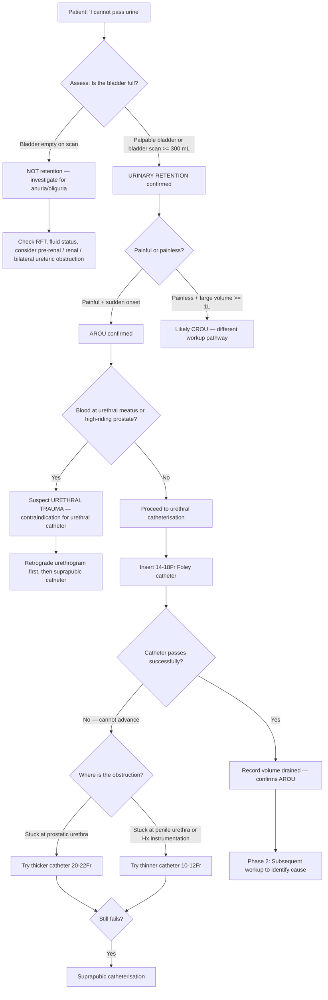
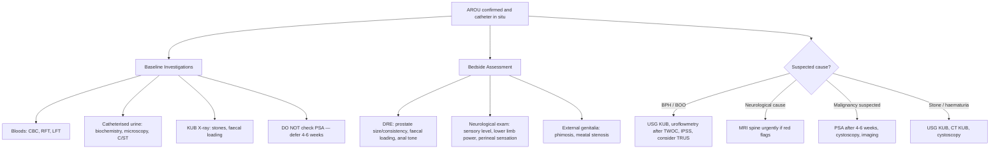

## Diagnostic Criteria, Diagnostic Algorithm, and Investigation Modalities

---

### 1. Diagnostic Criteria for AROU

AROU does not have formal "diagnostic criteria" in the way that, say, rheumatoid arthritis or heart failure do. Instead, it is a **clinical diagnosis** confirmed by a simple objective measurement. The diagnosis rests on three pillars:

| Pillar | How to Confirm | Rationale |
|---|---|---|
| **1. Inability to void** | Patient reports inability to pass urine despite urge | The defining symptom — urine is trapped |
| **2. Full bladder** | ***Bladder scan ≥ 300 mL in a patient unable to void suggests urinary retention*** [2] | Confirms that the bladder is full (urine produced but not expelled) rather than empty (anuria/oliguria). This is THE key differentiator |
| **3. Acute and painful** | Sudden onset + painful suprapubic distension | Distinguishes from CROU (painless, gradual, ***≥ 1 L suggests chronic retention***) [2] |

So in practical terms:

> **AROU is diagnosed when**: a patient presents with sudden painful inability to void **AND** the bladder is confirmed to be distended (bladder scan ≥ 300 mL, or palpable/percussible suprapubic mass, or first catheterised volume ≥ 300 mL).

<Callout title="Can You Skip the Bladder Scan?">
***Can proceed to catheterisation directly if history and physical examination strongly suggest a diagnosis of AROU*** [3]. In practice, if you have a distressed elderly man who cannot void, has a palpable tender suprapubic mass, and has known BPH, you do not need to wait for a bladder scan — go ahead and catheterise. But in ambiguous cases (post-operative patient, uncertain history, no palpable bladder), a quick bedside bladder scan takes 30 seconds and can save you from an unnecessary catheterisation in an anuric patient.
</Callout>

---

### 2. The Diagnostic Algorithm — Step by Step

The approach to diagnosing and working up AROU happens in **two phases**: the **acute phase** (confirm diagnosis + immediate decompression) and the **subsequent workup** (identify the underlying cause).

#### Phase 1: Acute Diagnosis and Immediate Management

```mermaid
graph TD
    A["Patient: 'I cannot pass urine'"] --> B{"Assess: Is the bladder full?"}
    B -->|"Palpable bladder or bladder scan >= 300 mL"| C["URINARY RETENTION confirmed"]
    B -->|"Bladder empty on scan"| D["NOT retention — investigate for anuria/oliguria"]
    D --> D1["Check RFT, fluid status, consider pre-renal / renal / bilateral ureteric obstruction"]
    
    C --> E{"Painful or painless?"}
    E -->|"Painful + sudden onset"| F["AROU confirmed"]
    E -->|"Painless + large volume >= 1L"| G["Likely CROU — different workup pathway"]
    
    F --> H{"Blood at urethral meatus or high-riding prostate?"}
    H -->|"Yes"| I["Suspect URETHRAL TRAUMA — contraindication for urethral catheter"]
    I --> I1["Retrograde urethrogram first, then suprapubic catheter"]
    H -->|"No"| J["Proceed to urethral catheterisation"]
    
    J --> K["Insert 14-18Fr Foley catheter"]
    K --> L{"Catheter passes successfully?"}
    L -->|"Yes"| M["Record volume drained — confirms AROU"]
    L -->|"No — cannot advance"| N{"Where is the obstruction?"}
    N -->|"Stuck at prostatic urethra"| O["Try thicker catheter 20-22Fr"]
    N -->|"Stuck at penile urethra or Hx instrumentation"| P["Try thinner catheter 10-12Fr"]
    O --> Q{"Still fails?"}
    P --> Q
    Q -->|"Yes"| R["Suprapubic catheterisation"]
    
    M --> S["Phase 2: Subsequent workup to identify cause"]
```

#### Phase 2: Subsequent Workup to Identify the Underlying Cause

```mermaid
graph TD
    S["AROU confirmed and catheter in situ"] --> T["Baseline Investigations"]
    T --> T1["Bloods: CBC, RFT, LFT"]
    T --> T2["Catheterised urine: biochemistry, microscopy, C/ST"]
    T --> T3["KUB X-ray: stones, faecal loading"]
    T --> T4["DO NOT check PSA — defer 4-6 weeks"]
    
    S --> U["Bedside Assessment"]
    U --> U1["DRE: prostate size/consistency, faecal loading, anal tone"]
    U --> U2["Neurological exam: sensory level, lower limb power, perineal sensation"]
    U --> U3["External genitalia: phimosis, meatal stenosis"]
    
    S --> V{"Suspected cause?"}
    V -->|"BPH / BOO"| W["USG KUB, uroflowmetry after TWOC, IPSS, consider TRUS"]
    V -->|"Neurological cause"| X["MRI spine urgently if red flags"]
    V -->|"Malignancy suspected"| Y["PSA after 4-6 weeks, cystoscopy, imaging"]
    V -->|"Stone / haematuria"| Z["USG KUB, CT KUB, cystoscopy"]
```

---

### 3. Investigation Modalities — Comprehensive Breakdown

Investigations in AROU serve two purposes: (A) **confirm the diagnosis** and (B) **identify the underlying cause and assess for complications**. Let's go through each modality systematically.

---

#### 3.1 Bedside Investigations

##### Bladder Scan (Portable Ultrasound)

- **What it does**: Non-invasive estimation of bladder volume using portable ultrasound
- **Why it matters**: This is your **first-line diagnostic tool** — it instantly distinguishes retention (full bladder) from anuria (empty bladder)
- ***≥ 300 mL in a patient unable to void suggests urinary retention; ≥ 1 L suggests chronic retention of urine*** [2]
- **Interpretation**: If the bladder is distended (≥ 300 mL) and the patient is in pain and cannot void → AROU confirmed
- **Caveat**: You can skip this if the clinical picture is unambiguous (palpable tender bladder + cannot void) → proceed directly to catheterisation [3]

##### First Catheterised Urine Volume

- **What it does**: The volume of urine drained on initial catheterisation serves as both a diagnostic and therapeutic measure
- **Why it matters**: Confirms the diagnosis objectively; the volume gives you a clue about acuity:
  - 300–800 mL → typical AROU
  - ***≥ 1 L → think CROU*** [2] (or acute-on-chronic)
- Also: **send the catheterised urine sample for analysis** (see below)

##### Digital Rectal Examination (DRE)

- **When**: Should be done in ***both men and women*** [3]
- **What you are assessing**:

| Finding | Interpretation |
|---|---|
| ***Prostate: smooth, symmetrically enlarged > 3FB, no nodules, intact median groove, firm consistency*** [7] | BPH |
| Hard, nodular, irregular, median sulcus obliterated | CA prostate |
| Tender, boggy, warm | Acute prostatitis |
| Faecal impaction / loaded rectum | Constipation as precipitant |
| ***Anal sphincter tone + perineal sensation*** | Neurological integrity; ↓ tone suggests cauda equina / sacral nerve pathology [3][7] |
| Pelvic mass | Rectal/pelvic tumour |

- **Precautions** [3]:
  - ***Normal prostate examination does NOT exclude BPH as a cause of obstruction*** — BPH primarily involves the transition zone which is internal; DRE mainly palpates the posterior peripheral zone. A prostate can feel "normal" on DRE yet have significant transition zone enlargement compressing the urethra
  - ***BPH does NOT necessarily cause outflow obstruction*** — prostate size alone does not predict symptoms; it is the relationship between prostate, urethra, and detrusor function that matters

##### Neurological Examination

- ***Mandatory in every patient with AROU*** [4]
- Assess: ***sensory level*** [4], lower limb muscle tone, power, reflexes, perineal sensation (S2-4 dermatomes), bulbocavernosus reflex, anal tone
- **Why**: To rule out spinal cord compression / cauda equina syndrome, which is a neurosurgical emergency. If a sensory level or new neurological deficit is found → **emergency MRI spine**

---

#### 3.2 Blood Investigations

***Investigations after catheterisation*** [2]:

| Test | What You Are Looking For | Why / Interpretation |
|---|---|---|
| ***CBC*** [2][4][8] | ***Leukocytosis*** | Suggests UTI, prostatitis, or urosepsis as a precipitant or complication. Anaemia may indicate chronic disease/malignancy |
| ***Clotting profile*** [8] | Coagulopathy | ***To prepare for surgery*** [8] if intervention is anticipated; also relevant if considering suprapubic catheterisation |
| ***RFT (Renal Function Test)*** [2][3][4][8] | Elevated creatinine, elevated urea, hyperkalaemia | ***Obstructive uropathy / obstructive nephropathy*** [2][8] — back-pressure from retention → bilateral hydronephrosis → post-renal AKI. A rising creatinine mandates urgent decompression and renal imaging. ***High serum creatinine can result from bladder outlet obstruction or underlying renal disease — should prompt USG*** [3] |
| ***LFT*** [2] | Baseline | General workup; hepatorenal involvement in chronic disease |
| ***PSA*** | **DO NOT CHECK** | ***Do NOT take PSA → AROU can cause false elevation (to be done 4–6 weeks later)*** [2][8]. Why? Prostatic distension and inflammation during AROU cause prostate cells to release PSA into the bloodstream artefactually. ***PSA: only for patients with life expectancy > 10 years and after detailed counselling. DO NOT CHECK PSA during retention or UTI*** [8]. The half-life of PSA is 2–3 days [3], so it takes weeks to normalise after the acute event |

<Callout title="PSA Trap — Extremely High Yield" type="error">
***Do NOT check PSA during an episode of AROU*** [2][8]. This is a classic exam mistake. AROU causes false elevation of PSA due to prostatic distension and ischaemia. Checking it will give a misleadingly high value, causing unnecessary patient anxiety and potentially triggering invasive investigations (biopsy) for a falsely elevated result. **Defer PSA measurement to 4–6 weeks after the acute episode** [2].

***Causes of elevated PSA*** [3]:
- Prostatitis
- BPH
- Prostate cancer
- Prostate biopsy
- AROU (artefactual)
- DRE (transiently, minimally)

***PSA is prostate-specific but NOT prostate-cancer-specific*** [3].
</Callout>

---

#### 3.3 Urine Investigations

***Catheterised urine: biochemistry, microscopy, C/ST*** [2][4]

| Test | What You Are Looking For | Why / Interpretation |
|---|---|---|
| ***Urinalysis (dipstick)*** [3][4] | Blood, WBCs, nitrites, protein, glucose | Quick screen for haematuria (stone, tumour, infection), pyuria (UTI), glycosuria (undiagnosed DM — relevant as DM neuropathy is a cause of detrusor underactivity) |
| ***Urine microscopy*** [3][4] | WBC/HPF, RBC/HPF, casts, crystals, organisms | ***Detect presence of blood, bacteria and WBC*** [3]. Pyuria ( > 5 WBC/HPF) with significant bacteriuria → UTI as precipitant. RBC morphology can hint at glomerular vs non-glomerular source |
| ***Urine C/ST (culture and sensitivity)*** [3][4] | Organisms and antibiotic sensitivities | Confirms UTI; guides antibiotic choice. Critical because UTI can be both a precipitant and complication of AROU |
| ***Urine cytology*** [3] | Malignant cells | ***Indicated if bladder cancer is suspected in patients presenting with haematuria and predominantly irritative symptoms*** [3]. Sensitivity ~50%; highest for high-grade transitional cell carcinoma and carcinoma in situ; low detection rate for low-grade cancer |

---

#### 3.4 Radiological Investigations

##### KUB (Plain Radiograph of Kidneys, Ureters, and Bladder)

- ***KUB for stones or faecal loading*** [2][8]
- **What it shows**: Radio-opaque calculi (calcium oxalate, calcium phosphate stones are visible; uric acid stones are radiolucent and will be missed), faecal loading in the rectosigmoid
- **Why**: Identifies urolithiasis as a cause of obstruction; confirms constipation/faecal impaction as a precipitant
- **Limitations**: Cannot detect radiolucent stones, soft tissue masses, or upper tract obstruction

##### USG Bladder + USG Kidney/Ureter

***USG bladder (confirm diagnosis) + USG kidney/ureter (hydronephrosis/hydroureter)*** [4]

| Component | What It Shows | Why It Matters |
|---|---|---|
| **USG bladder** | Bladder volume, wall thickness, intravesical masses, stones, post-void residual | Confirms retention; thick bladder wall (detrusor hypertrophy) suggests chronic obstruction; intravesical mass suggests tumour or large median lobe of prostate |
| **USG kidney/ureter** | Hydronephrosis, hydroureter, renal cortical thinning, renal/ureteric stones | ***Upper tract imaging indicated if large residual volume, haematuria, or history of stone*** [7]. Hydronephrosis = back-pressure from obstruction → risk of obstructive nephropathy. Cortical thinning suggests chronic damage |

##### CT KUB (Non-Contrast CT)

- **When**: If stone disease is suspected and KUB is inconclusive
- **What it shows**: Gold standard for detecting urinary stones (including radiolucent uric acid stones); also shows pelvic masses
- **Not first-line** in straightforward AROU but important if stone is the suspected cause

##### Intravenous Urogram (IVU) [9]

- ***IV non-ionic contrast injected → excreted by kidneys → opacifies and visualises urinary system*** [9]
- **Common indications**: haematuria, loin pain
- ***Post-micturition film can detect urinary retention*** [9]
- Largely superseded by CT urogram in modern practice, but still used in some centres
- ***Contraindications: pregnancy (radiation), previous serious contrast reactions, diabetes with renal insufficiency (risk of contrast-induced AKI)*** [9]

##### MRI Spine

- **When**: Urgently indicated if neurological red flags are present (new sensory level, lower limb weakness, saddle anaesthesia, ↓ anal tone)
- **What it shows**: Spinal cord compression (disc, tumour, abscess, haematoma), cauda equina syndrome
- **Why urgent**: Delay in decompression → permanent neurological damage and bladder dysfunction

##### Transrectal Ultrasound of Prostate (TRUS) [8]

***TRUS*** [8]:
- ***Before starting 5α-reductase inhibitors for prostate > 30–40cc***
- ***Before surgery to decide modality of surgical intervention***
- Measures prostate volume accurately; detects intravesical prostatic protrusion (IPP) which predicts treatment response
- **Not done in the acute phase** — this is part of the subsequent elective workup

---

#### 3.5 Specialised / Elective Investigations (After Acute Phase)

These are performed once the acute episode has resolved and the catheter has been managed, to determine the underlying cause and guide definitive treatment.

##### International Prostate Symptom Score (IPSS)

***IPSS*** [2][7][8]:
- ***Use: quantify severity of LUTS, predict treatment response, guide treatment decision and monitor response to treatment (NOT a diagnostic tool)*** [7]
- ***Involves*** [7]:
  - ***Voiding symptoms: incomplete emptying, intermittency, weak stream, straining***
  - ***Storage symptoms: frequency, urgency, nocturia***
  - ***Quality of life measure***
- ***Interpretation: mild (1–7), moderate (8–19), severe (20–35)*** [7]
- ***IPSS and QoL scores: assess severity (guide treatment); risk factor for progression*** [8]
- **When to use**: After the acute episode; helps quantify baseline LUTS severity and guides whether patient needs watchful waiting, medical therapy, or surgery

##### Voiding Diary / Frequency-Volume Chart

- Record time and volume of each void + fluid intake for ***at least 3 days*** [4]
- Especially useful if frequency/nocturia are prominent features
- Helps differentiate nocturnal polyuria (large volume, few voids) from overactive bladder (small volumes, many voids)

##### Uroflowmetry [3][7][8]

***Uroflowmetry***: non-invasive investigation of maximal flow, voided volume, and residual volume [3]

| Parameter | Normal | Abnormal | Interpretation |
|---|---|---|---|
| ***Voided volume*** | ***> 150 mL to be representative*** [7] | < 150 mL | Invalid test if volume too low |
| ***Peak flow rate (Qmax)*** | ***> 15 mL/s (male); > 30 mL/s (female)*** [7] | ***< 10 mL/s*** | ***< 10 mL/s: 90% obstructed; 10–15 mL/s: 60% obstructed; > 15 mL/s: only 30% obstructed*** [8] |
| **Flow pattern** | Bell-shaped curve | ***↓ peak (BPH) vs plateaued (urethral stricture)*** [7] | Plateaued = fixed narrowing (stricture); ↓ peak = compressive obstruction (BPH) or detrusor underactivity |
| ***Post-void residual (PVR)*** | ***< 50 mL (normal); up to 100–200 mL acceptable in elderly*** [7] | > 200 mL | Suggests either BOO or detrusor underactivity; large PVR → risk of UTI, stones, upper tract damage |

**Critical caveats** [3][7]:
- ***Normal maximal flow rate does NOT exclude outflow obstruction*** — 18% of patients with BOO have Qmax > 15 mL/s [7]
- ***Uroflowmetry is NOT sufficient to diagnose outflow obstruction since it cannot distinguish between outflow obstruction and poor detrusor contractility*** [3] — both give ↓ Qmax. To distinguish them, you need urodynamics

##### Urodynamic Study [3][7][8]

***Urodynamics: gold-standard for diagnosis of BOO*** [7]

***Investigation of*** [3]:
- ***Uroflow rate***
- ***Bladder volume***
- ***Intravesical and rectal pressure*** (to calculate detrusor pressure = P_ves − P_abd)
- ***Sphincter function*** (EMG)

***Outflow obstruction is characterised by high pressure, low flow*** [3]

| Pattern | Detrusor Pressure | Flow Rate | Diagnosis |
|---|---|---|---|
| **High pressure, low flow** | ↑↑ (detrusor working hard) | ↓↓ | **BOO** — detrusor is trying to push through an obstruction |
| **Low pressure, low flow** | ↓ | ↓↓ | **Detrusor underactivity (DUA)** — the problem is not obstruction but a weak pump |
| **Normal pressure, normal flow** | Normal | Normal | No BOO, no DUA (consider other causes of symptoms) |

Why does this matter? Because the treatment is completely different. BOO → relieve obstruction (α-blockers, 5-ARI, TURP). DUA → improve detrusor function (cholinergics, intermittent self-catheterisation). If you do TURP on a patient with DUA, you will not fix anything — the obstruction was never the problem.

***Indications for urodynamics*** [8]:
- ***Atypical age*** for BPH
- ***Suspected neurogenic bladder***
- ***History of spinal/pelvic surgery***
- ***Failed intervention*** (e.g., persistent symptoms after TURP)
- Uncertain diagnosis where uroflowmetry alone cannot distinguish BOO from DUA

##### Cystoscopy [7][8]

***Flexible cystoscopy*** [8]:
- **Indications**: ***Haematuria*** [8] (to rule out bladder tumour), suspected urethral stricture, bladder stones, bladder cancer
- **What it shows**: Direct visualisation of urethra, prostate (median lobe protrusion), bladder mucosa (tumours, trabeculation from chronic obstruction, diverticula, stones)
- Bladder trabeculation = thickened detrusor muscle bundles visible as ridges — indicates chronic BOO with compensatory hypertrophy

##### CT Urogram / USG Urogram [8]

***USG / CT urogram: haematuria*** [8]
- Indicated when haematuria is present — to evaluate the entire urinary tract for tumour, stone, or other pathology
- CT urogram = CT with IV contrast in nephrographic and excretory phases → visualises kidneys, ureters, bladder

---

### 4. Investigation Summary Table — What, When, Why

| Timing | Investigation | Key Findings / Interpretation |
|---|---|---|
| **ACUTE** | **Bladder scan** | ***≥ 300 mL = retention; ≥ 1 L = chronic*** [2] |
| | **Catheterisation** (diagnostic + therapeutic) | Volume drained confirms diagnosis; send urine for analysis |
| | **DRE** | Prostate (size/consistency/tenderness), faecal loading, anal tone |
| | **Neurological exam** | Sensory level, perineal sensation, lower limb power/reflexes |
| **AFTER CATHETERISATION** | ***CBC*** | Leukocytosis (infection/urosepsis) |
| | ***RFT*** | Elevated creatinine → obstructive nephropathy |
| | ***LFT*** | Baseline |
| | ***Catheterised urine: biochemistry, microscopy, C/ST*** | UTI, haematuria, crystals |
| | ***KUB*** | ***Stones or faecal loading*** [2] |
| | **DO NOT** check PSA | ***False elevation during AROU — defer 4–6 weeks*** [2][8] |
| **ELECTIVE (after acute episode)** | ***IPSS*** | Quantify LUTS severity; guide treatment |
| | ***Uroflowmetry + PVR*** | Screen for BOO; ***Qmax < 10 = 90% obstructed*** [8] |
| | **USG kidney/ureter** | ***If large PVR, haematuria, or Hx stone*** [7] |
| | ***TRUS*** | ***Before 5-ARI or surgery*** [8] |
| | ***Cystoscopy*** | ***Haematuria, suspected stricture/tumour*** [8] |
| | ***Urodynamics*** | ***Gold-standard for BOO; atypical cases, suspected neurogenic bladder, failed intervention*** [7][8] |
| | **PSA** (4–6 weeks later) | ***Only if life expectancy > 10 years + counselled*** [8]; r/o CA prostate |
| | **MRI spine** | ***Urgently if neurological red flags*** |

<Callout title="Investigation Pitfalls to Remember" type="error">

1. ***PSA during AROU = false elevation*** → defer 4–6 weeks [2][8]
2. ***Normal uroflowmetry does NOT exclude BOO*** — 18% still obstructed despite Qmax > 15 mL/s [7]
3. ***Uroflowmetry cannot distinguish BOO from DUA*** — both give low Qmax; need urodynamics to differentiate [3][7]
4. ***Normal DRE does NOT exclude BPH*** — transition zone enlargement is not palpable from the rectum [3]
5. ***Uroflowmetry requires voided volume > 150 mL*** to be a valid test [7]
6. ***BPH does NOT necessarily cause outflow obstruction*** — size alone doesn't determine symptoms [3]
</Callout>

---

### 5. PSA — A Deeper Dive (Elective Context)

Since PSA is so commonly tested in exams and frequently misunderstood, here is a comprehensive summary for the elective workup phase:

***PSA (Prostate-Specific Antigen)*** [3]:
- ***Prostate-specific but NOT prostate-cancer-specific*** [3]
- ***Half-life = 2–3 days*** [3]
- ***PSA > 1.5 ng/mL is a useful marker for prostatic enlargement and predicts increased risk of BPH progression*** [3]

***Interpretation*** [3]:
- ***PSA < 4 ng/mL = Normal***
- ***PSA ≥ 4 ng/mL = Cutoff for diagnostic prostate biopsy***
- ***PSA 4–10 ng/mL = 20% chance of cancer*** (the "grey zone")
- ***PSA ≥ 10 ng/mL = 50% chance of cancer***

***When NOT to check PSA*** [3][8]:
- During AROU or UTI (false elevation)
- ***If patients have < 10 years of life expectancy*** (unless clinically obvious disease like palpable nodule on DRE) [3]

---

<Callout title="High Yield Summary">

1. **AROU is a clinical diagnosis**: inability to void + full bladder (***scan ≥ 300 mL***) + painful + sudden onset
2. **Bladder scan** is the first-line differentiator: full = retention; empty = anuria/oliguria
3. ***≥ 1 L on catheterisation suggests CROU*** — look for neurological cause
4. **Acute investigations**: CBC, RFT, LFT, catheterised urine (biochemistry, microscopy, C/ST), KUB
5. ***DO NOT CHECK PSA during AROU*** — causes false elevation; defer 4–6 weeks
6. **DRE**: must do in all patients; assesses prostate, faecal loading, anal tone; ***normal DRE does NOT exclude BPH***
7. ***Uroflowmetry***: screening for BOO; valid only if voided > 150 mL; ***Qmax < 10 = 90% obstructed***; but ***cannot distinguish BOO from DUA***
8. ***Urodynamics***: gold standard for BOO; **high pressure + low flow = BOO; low pressure + low flow = DUA**
9. ***Outflow obstruction = high pressure, low flow*** on urodynamics [3]
10. **TRUS**: before 5-ARI or surgical planning; **cystoscopy**: for haematuria, suspected stricture/tumour
11. **MRI spine**: urgently if neurological red flags (sensory level, weakness, ↓ anal tone)
12. ***IPSS***: quantifies LUTS severity (mild 1–7, moderate 8–19, severe 20–35); guides treatment but is NOT a diagnostic tool

</Callout>

---

<ActiveRecallQuiz
  title="Active Recall - Diagnosis and Investigations of AROU"
  items={[
    {
      question: "What bladder scan volume threshold suggests urinary retention, and what volume suggests chronic retention?",
      markscheme: ">=300 mL in a patient unable to void suggests urinary retention. >=1 L suggests chronic retention of urine. These thresholds help differentiate acute from chronic and retention from anuria."
    },
    {
      question: "Why should you NOT check PSA during an episode of AROU, and when should it be checked instead?",
      markscheme: "AROU causes prostatic distension and ischaemia, leading to artefactual release of PSA into the bloodstream giving a falsely elevated result. PSA should be deferred 4-6 weeks after the acute episode. Also should not check during UTI. Only check in patients with life expectancy >10 years after counselling."
    },
    {
      question: "A patient with AROU has a uroflowmetry Qmax of 8 mL/s. Can you confidently diagnose BOO? Why or why not, and what investigation would confirm it?",
      markscheme: "No, cannot confidently diagnose BOO from uroflowmetry alone. Uroflowmetry cannot distinguish BOO from detrusor underactivity (DUA) - both give low Qmax. Need urodynamic study (gold standard for BOO diagnosis). BOO = high detrusor pressure + low flow. DUA = low detrusor pressure + low flow."
    },
    {
      question: "List two important caveats about DRE findings in the context of suspected BPH causing AROU.",
      markscheme: "(1) Normal prostate on DRE does NOT exclude BPH as cause of obstruction - DRE palpates peripheral zone but BPH affects the transition zone which is internal and not readily palpable. (2) BPH does NOT necessarily cause outflow obstruction - prostate size alone does not predict symptoms; depends on relationship between prostate, urethra and detrusor function."
    },
    {
      question: "Name four indications for urodynamic study in the workup of LUTS/AROU.",
      markscheme: "Four indications: (1) Atypical age for BPH. (2) Suspected neurogenic bladder. (3) History of spinal or pelvic surgery. (4) Failed previous intervention (e.g. persistent symptoms after TURP). Also: uncertain diagnosis where uroflowmetry cannot distinguish BOO from DUA; before major surgical intervention."
    },
    {
      question: "What are the contraindications for urethral catheterisation in AROU, and what is the alternative?",
      markscheme: "Contraindications: (1) Urethral trauma (signs: blood at urethral meatus, high-riding prostate on DRE). (2) Recent urological surgery. Alternative: suprapubic catheterisation (SPC). For suspected urethral trauma, a retrograde urethrogram should be performed first to assess urethral integrity before any instrumentation."
    }
  ]}
/>

---

## References

[1] Lecture slides: GC 180. Benign prostatic hyperplasia, bladder outlet obstruction and urinary retention.pdf (pp. 23, 24, 30, 33)
[2] Senior notes: Ryan Ho Urogenital.pdf (pp. 164–167, 170–173); Ryan Ho Fundamentals.pdf (pp. 349–352, 355–356)
[3] Senior notes: felixlai.md (AROU section – diagnosis, physical examination, biochemical tests, specific tests; BPH section – PSA interpretation)
[4] Senior notes: maxim.md (AROU section – physical examination, investigations)
[5] Senior notes: Ryan Ho Critical Care.pdf (p. 25 — AKI aetiology)
[7] Senior notes: Ryan Ho Urogenital.pdf (pp. 170–173); Ryan Ho Fundamentals.pdf (pp. 355–356) — uroflowmetry, IPSS, urodynamics, BPH workup
[8] Lecture slides: Benign Prostatic Hyperplasia.pdf (pp. 12, 18)
[9] Senior notes: Ryan Ho Diagnostic Radiology.pdf (p. 17 — IVU)
