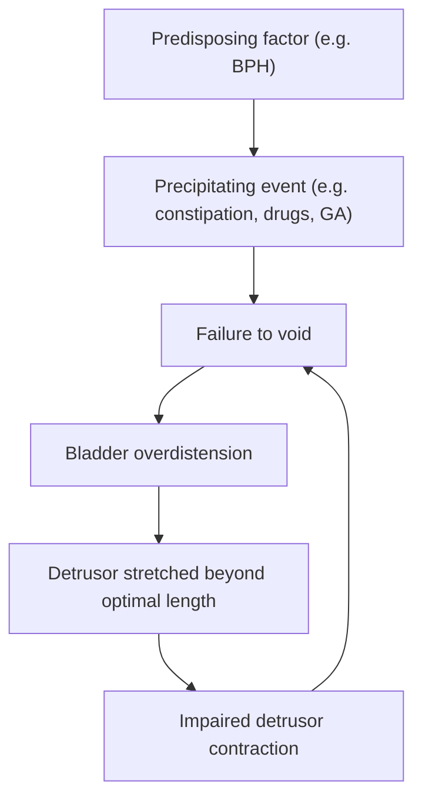

# Acute Retention of Urine (AROU)

---

## 1. Definition

***Acute retention of urine (AROU)*** — also called ***acute urinary retention (AUR)*** — is defined as the ***sudden inability to pass urine*** despite having a full bladder, presenting with ***sudden onset, painful*** suprapubic distension [1][2].

Let's break down the name:
- **Acute** = sudden onset (as opposed to chronic, which is gradual)
- **Retention** = urine is *produced* but *cannot be expelled*
- This is fundamentally different from **anuria/oliguria**, where the kidneys fail to produce urine

<Callout title="Critical Distinction: Retention vs. Anuria" type="error">
AROU = full bladder that cannot empty (post-renal problem at the level of the bladder outlet or below). Anuria/oliguria = no/little urine is being made (pre-renal or renal problem). Always confirm with a **bladder ultrasound** or **first catheterised urine volume** — if you catheterise and get < 200 mL, it was probably not true retention [2][3].
</Callout>

The distinction between acute and chronic retention is important [1][2]:

| Feature | ***AROU*** | Chronic Retention of Urine (CROU) |
|---|---|---|
| Onset | ***Sudden*** | Gradual |
| Pain | ***Painful*** | Usually **painless**, vague lower abdominal distension |
| Innervation | ***Typically normal*** (e.g. BPH) | Often abnormal (e.g. diabetic neuropathy) |
| Bladder | Acutely distended, tense | Chronically distended, large volume, may have overflow incontinence |
| Urgency | ***Most common urological emergency*** [2][3] | Presents more insidiously |

---

## 2. Epidemiology

### 2.1 Incidence and Prevalence

***AROU is the most common urological emergency*** and a ***common reason for hospital admission in Urology*** [1][2].

**In males** [1][2][3]:
- ***About 7 per 1,000 men per year***
- ***Overall cumulative probability of AUR in 4 years = 3%***
- Over a 5-year period:
  - ***10% of men in their 70s will have AUR***
  - ***~30% of men in their 80s will have AUR***
- Cited from the ***Olmsted County Study*** (Jacobsen et al., J Urol 1997) [1]

**In females** [2][3]:
- Much rarer: approximately **~3 per 100,000 women per year**
- The reason is simple: women lack a prostate, so bladder outlet obstruction (BOO) is far less common

### 2.2 Risk Factors

***Risk factors for male AUR (from the Olmsted County Study)*** [1]:

| Risk Factor | Explanation |
|---|---|
| ***Increasing age*** | Prostate enlarges with age; detrusor function declines |
| ***Increasing prostate size*** | Greater mechanical obstruction of the prostatic urethra |
| ***Increasing BPH symptoms*** | Reflects severity of obstruction |
| ***Decreasing maximal urine flow rate*** | Low Qmax reflects BOO; the lower the flow, the closer to retention |

For females [2][3]:
- Bladder outlet obstruction is **less common**
- Some may have **detrusor underactivity** (the bladder muscle simply cannot generate enough pressure to void)
- Key risk factors include neurological disease (DM neuropathy, spinal cord injury), pelvic organ prolapse, and pelvic masses

### 2.3 Sex Differences — Why AROU Behaves Differently Between Males and Females

This is an important conceptual point [2][3]:

| | Male | Female |
|---|---|---|
| **Bladder outlet resistance** | ***↑ physiological bladder outlet resistance*** (prostatic urethra is long, surrounded by prostate) | ***↓ physiological bladder outlet resistance*** (shorter urethra, no prostate) |
| **Voiding mechanism** | ***Voiding depends more on detrusor contraction*** | ***Voiding depends more on pelvic floor relaxation*** |
| **Detrusor contraction strength** | ***Usually stronger (~60 cmH₂O)*** — needs to overcome higher resistance | ***Usually weaker (~20 cmH₂O)*** — doesn't need as much force |
| **Common cause of AROU** | ***BOO more common*** (BPH, CA prostate, stricture) | ***Detrusor underactivity more common*** (hypocontractile bladder, neurogenic) |

> **Why does this matter?** In men, AROU is usually about something **blocking the exit**. In women, AROU is usually about the bladder **not squeezing hard enough**. This fundamentally changes your differential diagnosis approach.

---

## 3. Anatomy and Physiology of Micturition

To understand *why* someone retains urine, you must first understand *how* normal voiding works. The lecture specifically outlines this [1].

### 3.1 Anatomy of the Lower Urinary Tract

**Components** [2][3]:
- **Male:** Bladder → Prostatic urethra (through prostate) → Membranous urethra → Penile urethra
- **Female:** Bladder → Short urethra (3–4 cm)

**Sphincter mechanisms** [3]:
- **Proximal sphincter mechanism (PSM):** Located at the **bladder neck**; under **autonomic (involuntary) control**
  - Sympathetic (T10–L2 via hypogastric nerve) → α₁-adrenergic receptors on smooth muscle → contraction of bladder neck → maintains continence during storage
- **Distal sphincter mechanism (DSM):** The **external urethral sphincter (rhabdosphincter)**; under **somatic (voluntary) control**
  - Pudendal nerve (S2–S4) → nicotinic receptors on striated muscle → voluntary contraction

### 3.2 Two Phases of Bladder Function

***The bladder has two functions: storage and emptying*** [1][3]:

#### A. Storage Phase
- ***Accommodation of urine at low pressure with appropriate sensation***
- ***Bladder outlet remains closed at rest or despite ↑ intra-abdominal pressure***
- ***No involuntary bladder contraction (i.e. no detrusor overactivity)***

**How does the bladder store urine at low pressure?** This is explained by **Laplace's Law** [3]:

$$T = \frac{P_{ves} \times R}{2d}$$

Where:
- T = wall tension
- P_ves = intravesical pressure
- R = radius of the bladder
- d = wall thickness

As the bladder fills and R increases, **receptive relaxation** occurs — the detrusor muscle actively decreases its tone (↓T) to keep P_ves low despite increasing volume. This is mediated by:
- **β₃-adrenergic receptors** on the detrusor → sympathetic stimulation during storage → relaxation
- Simultaneous **α₁-adrenergic** stimulation at the bladder neck → closure

> *Think of it like inflating a balloon that actively becomes more stretchy as you blow it up — that's receptive relaxation.*

**During storage, the sympathetic nervous system dominates:**
- β₃ receptors (detrusor) → relaxation → bladder fills
- α₁ receptors (bladder neck/prostate) → contraction → outlet closed

#### B. Emptying (Voiding) Phase
- ***Coordinated contraction of bladder smooth muscles at adequate magnitude and duration***
- ***↓ resistance at bladder outlet*** (both PSM and DSM relax)
- ***No anatomical obstruction***

**Voiding is initiated by the pontine micturition centre (PMC):**
1. Afferent signals from bladder wall stretch receptors (via **Aδ fibres** for distension; **C-fibres** for pain/irritation) travel along **pelvic nerves** to the spinal cord and up to the PMC
2. When cortical centres "permit" voiding, the PMC coordinates:
   - **Parasympathetic activation** (S2–S4 via pelvic nerve) → **M₃ muscarinic receptors** on detrusor → **contraction**
   - **Sympathetic inhibition** → bladder neck relaxes
   - **Somatic inhibition** → external sphincter relaxes (pudendal nerve)
3. The detrusor contracts against a relaxed outlet → urine flows

### 3.3 Innervation Summary

| Nerve | Origin | Receptor | Target | Function |
|---|---|---|---|---|
| **Hypogastric nerve** (sympathetic) | T10–L2 | α₁-adrenergic | Bladder neck, prostate | **Contraction** (closes outlet during storage) |
| **Hypogastric nerve** (sympathetic) | T10–L2 | β₃-adrenergic | Detrusor | **Relaxation** (accommodates urine during storage) |
| **Pelvic nerve** (parasympathetic) | S2–S4 | M₃ muscarinic | Detrusor | **Contraction** (empties bladder during voiding) |
| **Pudendal nerve** (somatic) | S2–S4 | Nicotinic | External sphincter | **Voluntary contraction** (maintains continence) |
| **Afferent** (sensory) | Along pelvic, hypogastric, pudendal | — | Higher centres | Detects distension (Aδ) and pain/irritation (C-fibres) |

<Callout title="Key Concept: Detrusor Sphincter Dyssynergia (DSD)">
***DSD*** occurs when there is ***interruption of descending control by the pontine micturition centre*** (e.g. ***spinal cord injury, pontine stroke***). This leads to ***failure of detrusor-sphincter coordination*** → ***synchronous contraction of both detrusor and sphincters*** → the bladder tries to push urine out while the sphincter clamps down. The consequence is ***↑↑ urinary tract pressure → upper tract damage*** (hydronephrosis, renal failure) [2][3].
</Callout>

---

## 4. Etiology

***The pathogenesis of AROU is often a mixture of factors*** [2][3]. The aetiology can be systematically divided into:

1. **Mechanical bladder outlet obstruction (BOO)**
2. **Drug-induced**
3. **Neurological causes (neurogenic bladder)**
4. **Acute overdistension of the bladder**

### 4.1 Mechanical Bladder Outlet Obstruction

This is the most common category, especially in males. Think of it anatomically — what can physically block urine from getting out? Classify by location relative to the urethral wall [2][3]:

#### Extramural (Outside the wall — compressing from outside)
| Cause | Notes |
|---|---|
| ***BPH*** | ***Commonest cause overall (53%)*** [1]. Transitional zone hyperplasia compresses the prostatic urethra |
| ***CA Prostate*** | ***7%*** [1]. Locally advanced disease can obstruct the urethra |
| ***Constipation / Faecal impaction*** | ***7.5%*** [1]. A loaded rectum compresses the prostatic urethra posteriorly. ***Usually NOT a standalone cause but rather a precipitating factor with background prostatic enlargement*** [3] |
| Pelvic tumours | Gynaecological (e.g. fibroids, ovarian masses), rectal masses |
| ***Prostatitis*** | Acute inflammation → oedema of prostate tissue → dynamic obstruction |
| Pregnancy | Gravid uterus compresses the bladder base/urethra |
| ***Pelvic organ prolapse*** | Cystocele, rectocele, uterovaginal prolapse — more common in females |

#### Mural (Within the wall)
| Cause | Notes |
|---|---|
| ***Urethral stricture*** | ***3.5%*** [1]. Due to ***previous instrumentation (iatrogenic) or infection/inflammation (STDs)*** |
| ***Bladder neck tumour*** | Transitional cell carcinoma at the bladder neck |
| ***Urethritis*** | Gonococcal or non-gonococcal → urethral oedema |
| ***Bladder neck stenosis*** | ***Usually after previous prostate surgery*** (e.g. post-TURP scarring) [1] |

#### Intraluminal (Inside the lumen)
| Cause | Notes |
|---|---|
| ***Bladder/Urethral stones*** | ***2%*** [1]. Stone impacts at the bladder neck or urethra |
| ***Clot retention*** | ***3%*** [1]. ***Severe gross haematuria*** (from any cause: bladder cancer, BPH, post-procedure) → blood clots fill the bladder and block the outlet |
| Foreign bodies | Rare; iatrogenic or self-inserted |
| ***Phimosis*** | Tight foreskin obstructs the urethral meatus [1] |

### 4.2 Drug-Induced

Drugs are a common and **reversible** cause of AROU. Understanding the pharmacology is key [2][3]:

#### Sympathomimetics
- **Mechanism:** Stimulate α₁-adrenergic receptors at the bladder neck/prostate → ↑ smooth muscle tone → ↑ outlet resistance → retention
- ***α-agonists:*** ***Phenylephrine, ephedrine*** (commonly found in ***cold medications / cough mixtures*** — very relevant in Hong Kong where OTC cold remedies are widely used!)
- ***β-agonists:*** ***Terbutaline, salbutamol*** (bronchodilators) — these relax the detrusor via β₂/β₃ receptors → ↓ detrusor contraction → retention
- ***MDMA (ecstasy)*** — sympathomimetic recreational drug [3]

#### Anticholinergics
- **Mechanism:** Block M₃ muscarinic receptors on the detrusor → ↓ detrusor contraction → inability to void
- ***Atropine, anticholinergic bronchodilators*** (ipratropium)
- ***Antipsychotics*** (chlorpromazine, olanzapine — these have anticholinergic side effects)
- ***Antihistamines*** (diphenhydramine, chlorpheniramine — first-generation antihistamines have significant anticholinergic properties)
- ***Antidepressants*** (tricyclic antidepressants like amitriptyline are potent anticholinergics)
- ***Antispasmodics / Opioids*** (morphine → ↓ detrusor motility plus ↓ conscious level)
- ***Disopyramide*** (class Ia antiarrhythmic with anticholinergic properties) [3]

<Callout title="Hong Kong Clinical Pearl" type="idea">
In Hong Kong, elderly patients presenting with AROU are commonly on **polypharmacy**. Always check the drug history — especially for **cold remedies containing pseudoephedrine/phenylephrine**, **anticholinergic medications** (antihistamines, TCAs, antipsychotics), and **opioids**. These are often the precipitating cause on top of underlying BPH.
</Callout>

### 4.3 Neurological Causes (Neurogenic Bladder)

***Neurogenic bladder*** = ***bladder dysfunction associated with other neurological deficit*** [1][2][3].

The key is to localise the lesion along the neural pathway:

#### Brain (Suprapontine)
| Cause | Mechanism |
|---|---|
| ***Stroke / CVA*** | Loss of cortical inhibition → may cause either retention (if PMC is involved) or overactivity |
| ***Parkinson's disease*** | Basal ganglia dysfunction → loss of tonic inhibition on PMC → usually overactivity, but advanced disease can cause retention |
| ***Multiple sclerosis (MS)*** | Demyelination affecting any level of the neuraxis |
| ***Normal pressure hydrocephalus (NPH)*** | Stretching of periventricular fibres controlling bladder function |
| ***Multiple system atrophy (MSA)*** | Neurodegeneration of Onuf's nucleus (sacral motor neurons to external sphincter) |

#### Spinal Cord
| Cause | Mechanism |
|---|---|
| ***Spinal cord injury / Trauma*** | Disrupts communication between PMC and sacral micturition centre → DSD, retention |
| ***Vertebral / Epidural metastasis*** | **Must rule out** in any patient with AROU + back pain/neurological deficit! Compression of the spinal cord → cauda equina syndrome |
| ***Spinal stenosis*** | Chronic compression of nerve roots |
| ***Transverse myelitis*** | Inflammatory demyelination of a spinal cord segment |
| ***Spinal cord haematoma / abscess*** | Acute compression → neurological emergency |
| ***Spinal cord tumour*** | Gradual compression |

#### Peripheral Nerves
| Cause | Mechanism |
|---|---|
| ***Diabetic neuropathy*** | Autonomic neuropathy affecting pelvic splanchnic nerves → impaired detrusor contraction. DM is the most common cause of CROU and should be ***excluded*** in females with AROU [1] |
| ***Radical pelvic surgery*** | Damage to pelvic autonomic plexus (e.g. radical hysterectomy, abdominoperineal resection) |
| ***Guillain-Barré syndrome (GBS)*** | Ascending demyelinating polyneuropathy → can involve autonomic nerves including bladder |
| ***Genital herpes (HSV)*** | ***Sacral nerve involvement*** (S2–S4) → Elsberg syndrome → acute urinary retention, especially in young women [4] |

<Callout title="Red Flag: Cauda Equina Syndrome" type="error">
Any patient with acute urinary retention + **new back pain** + **saddle anaesthesia** + **bilateral leg weakness/numbness** + **reduced anal tone** → suspect **cauda equina syndrome** until proven otherwise. This is a **neurosurgical emergency** requiring urgent MRI and decompression. Missing this diagnosis can result in permanent incontinence and paralysis.
</Callout>

### 4.4 Acute Overdistension of the Bladder

**Mechanism:** When the bladder is allowed to overdistend beyond a critical volume, the detrusor muscle fibres are stretched beyond their ***optimal length of action (optimal overlap between actin and myosin on the length-tension curve)*** → ***ineffective contraction*** → retention [3][4].

This is essentially the **Frank-Starling mechanism in reverse** — just as the heart fails when overstretched, the detrusor fails when overstretched.

**Causes of overdistension** [2][3]:

| Factor | Mechanism |
|---|---|
| ***↑ Urine production*** | ***Excessive fluid intake, especially alcohol*** (alcohol is a diuretic + CNS depressant → produces more urine + suppresses urge to void) |
| ***Post-anaesthesia (GA, epidural)*** | Anaesthesia inhibits afferent sensation (you don't feel the urge to void) + suppresses detrusor contraction → bladder fills silently → overdistension |
| ***Analgesics (especially opioids)*** | ↓ Detrusor tone + ↓ conscious level |
| ***Painful peri-anal pathologies*** | ***Thrombosed haemorrhoids, perianal abscess*** → reflex inhibition of voiding due to pain |
| ***Prolonged immobility*** | ***Poor voiding when supine*** (harder to void lying flat due to loss of gravity-assisted emptying + psychological inhibition) |

### 4.5 Common Precipitating Factors

In practice, AROU often occurs in a patient with ***background predisposing factors*** (e.g. BPH) who then encounters a ***precipitating event***. The lecture notes and senior notes [1][2][3] emphasise these ***common precipitating factors***:

- ***Constipation***
- ***UTI (pain → reflex inhibition)***
- ***Anaesthesia or analgesia***
- ***Immobility (poor voiding when supine)***
- ***Painful perianal conditions (thrombosed haemorrhoids, perianal abscess)***
- ***Excessive fluid intake (especially alcohol)***
- ***Drugs*** (sympathomimetics, anticholinergics)

### 4.6 Aetiology Table from Lecture Slides

The following ***aetiological breakdown*** was specifically presented on lecture slides [1]:

| ***Cause*** | ***Percentage*** |
|---|---|
| ***Benign prostatic hyperplasia*** | ***53%*** |
| ***Constipation*** | ***7.5%*** |
| ***Carcinoma of the prostate*** | ***7%*** |
| ***Urethral stricture*** | ***3.5%*** |
| ***Clot retention*** | ***3%*** |
| ***Neurological disorders*** | ***2%*** |
| ***Post-operative*** | ***2%*** |
| ***Calculus*** | ***2%*** |
| ***Drugs*** | ***2%*** |
| ***Infection*** | ***2%*** |
| ***Miscellaneous/unknown*** | ***16%*** |

*(Murray K, Massey A, Feneley RC, 1984)* [1]

### 4.7 Female-Specific Causes

***Common causes in females*** [1][2]:
- ***Detrusor hypocontractility — exclude DM***
- ***Neurogenic bladder***
- ***Idiopathic***
- Other obstructive causes: ***pelvic organ prolapse (cystocele)***, ***gynaecological tumours (fibroids)***

---

## 5. Pathophysiology

***The pathogenesis of AROU is often a mixture of factors*** [2][3]. There are three broad pathophysiological mechanisms:

### 5.1 Outflow Obstruction

**Mechanical obstruction** [2][3]:
- ***Physical narrowing of the urethral channel*** → increased resistance to flow
- Classified as ***extramural, mural, or intraluminal*** (as detailed above)
- Example: BPH → transition zone hyperplasia compresses the prostatic urethra → the detrusor must generate higher pressures to void → eventually, the detrusor cannot overcome the resistance → acute retention

**Dynamic obstruction** [2][3]:
- ***Increased muscle tone within and around the urethra***
- α₁-adrenergic receptor stimulation → smooth muscle contraction in the prostate/bladder neck
- Example: taking a cold medication containing pseudoephedrine → ↑ α₁ stimulation → ↑ urethral resistance → tips the balance into retention

> ***BPH has both static and dynamic components*** [5]:
> - ***Static component:*** Stromal hyperplasia mediated by ***dihydrotestosterone (DHT) via 5α-reductase*** → this is targeted by ***5α-reductase inhibitors (5-ARI)*** like finasteride
> - ***Dynamic component:*** ***Smooth muscle*** hypertrophy and contraction mediated by ***α₁ receptors*** → this is targeted by ***α₁-blockers*** like tamsulosin

### 5.2 Impaired Detrusor Contraction

**Neurological causes** [2][3]:
- ***Interruption of sensory or motor nerve supply to detrusor muscle***
- If sensory: patient does not feel bladder fullness → no voiding reflex initiated → bladder overdistends
- If motor: detrusor cannot contract even when voiding is initiated
- ***Incomplete relaxation of urinary sphincter mechanism (dyssynergia)*** → ***↑ voiding pressure*** + ***↑ post-void residual volume***

**Drug-induced** [2][3]:
- Anticholinergics: block M₃ receptors on detrusor → ↓ contractility
- Sympathomimetics: α₁ agonists → ↑ outlet resistance; β agonists → ↓ detrusor tone

**Acute overdistension** [2][3][4]:
- ***Overdistension can stretch detrusor muscles beyond their optimal length of action, leading to ineffective contraction***
- The length-tension relationship of smooth muscle: there is an optimal sarcomere length where actin-myosin overlap is maximal. Beyond this, overlap decreases → force generation drops precipitously
- ***This can result from excessive urinary production and ↓ voiding due to ↓ conscious level or other reasons*** [3]

### 5.3 The Vicious Cycle

Once retention begins, a vicious cycle can develop:

This explains why some patients who develop post-operative AROU may have persistent retention even after the precipitant is removed — the detrusor has been damaged by overdistension.

---

## 6. Classification

### 6.1 By Acuity

| | Acute (AROU) | Chronic (CROU) |
|---|---|---|
| Onset | Sudden | Gradual |
| Pain | Painful | Painless |
| Bladder | Tense, distended | Large, floppy, may have overflow incontinence |
| Typical innervation | Normal | Often abnormal |
| Post-void residual | Very high (often > 500 mL) | Persistently elevated |

### 6.2 By Mechanism

1. **Obstructive** (BOO) — mechanical or dynamic
2. **Non-obstructive** — neurogenic, drug-induced, overdistension

### 6.3 By "Precipitated" vs "Spontaneous"

This classification is clinically useful because it has prognostic implications [2][3]:

- **Precipitated AROU:** A clear precipitating event can be identified (e.g. post-operative, drug-induced, constipation). Removing the precipitant → higher chance of successful trial without catheter (TWOC)
- **Spontaneous AROU:** No clear precipitant; likely represents end-stage decompensation of a chronically obstructed bladder. Lower chance of successful TWOC → more likely to need surgical intervention

---

## 7. Clinical Features

### 7.1 Symptoms

| Symptom | Pathophysiological Basis |
|---|---|
| **Inability to void / complete inability to pass urine** | Fundamental symptom — either the outlet is blocked or the detrusor cannot contract |
| ***Sudden onset of suprapubic pain*** | Acute distension of the bladder stretches the bladder wall → activates **Aδ and C-fibre afferents** → pain perceived in the suprapubic region (T10–L1 dermatome via hypogastric nerve). Pain distinguishes AROU from CROU (in chronic retention, slow stretching allows accommodation) |
| **Suprapubic fullness / distension** | The bladder is physically full and distended above the symphysis pubis |
| **Restlessness and agitation** | Severe visceral pain from an acutely distended bladder → sympathetic activation |
| **Sensation of incomplete emptying** | In partial/early retention, patient may pass small amounts but feels the bladder is still full |
| **Previous LUTS (obstructive):** ***hesitancy, weak stream, straining, dribbling, incomplete emptying*** | These suggest pre-existing BOO (e.g. BPH). ***Hesitancy*** = delay initiating stream (detrusor must build higher pressure to overcome resistance); ***weak stream*** = reduced flow rate; ***straining*** = using abdominal muscles to aid voiding; ***terminal dribbling*** = post-void dribbling as detrusor contraction wanes |
| **Previous LUTS (irritative):** frequency, urgency, nocturia, urge incontinence | Suggest detrusor instability/overactivity secondary to chronic BOO. The obstructed detrusor hypertrophies → becomes "irritable" → involuntary contractions during filling |
| **Gross haematuria** | Complication of BPH (ruptured dilated bladder neck veins), bladder tumour, or stones |
| ***Fever, dysuria*** | Suggest concurrent UTI — a common precipitant and complication |
| **Strangury** | ***Painful, frequent urination of small volumes, expelled slowly only by straining despite severe urgency and feeling of incomplete emptying*** [3] — suggests bladder/urethral stones or severe irritation |
| **Urinary overflow incontinence** | In late/decompensated retention: bladder pressure exceeds urethral resistance → continuous dribbling. Patient thinks they are "incontinent" but is actually in overflow retention |
| **Back pain / leg weakness / saddle anaesthesia** | RED FLAG: suggests spinal cord compression / cauda equina syndrome → neurological emergency |
| **Uraemic symptoms** (nausea, lethargy, confusion, pruritus) | Late complication: bilateral upper tract obstruction → post-renal AKI → uraemia |

### 7.2 Signs

#### General Inspection
| Sign | Pathophysiological Basis |
|---|---|
| Patient in distress, restless | Visceral pain from acute bladder distension |
| Agitation, confusion (in elderly) | Pain + possible uraemia if bilateral obstruction |

#### Vital Signs
| Sign | Pathophysiological Basis |
|---|---|
| Tachycardia, hypertension | Pain-mediated sympathetic response |
| Fever | Concurrent UTI/prostatitis |

#### Abdominal Examination
| Sign | Pathophysiological Basis |
|---|---|
| ***Bladder dull on percussion (> 150 mL)*** | Fluid-filled viscus has a dull percussion note compared to surrounding gas-filled bowel [5] |
| ***Palpable bladder (> 200 mL)*** | A distended bladder rises above the symphysis pubis and can be palpated as a smooth, tense, midline suprapubic mass arising from the pelvis [5] |
| Tender suprapubic mass | Acute distension → pain on palpation. In CROU, the bladder may be palpable but non-tender |
| Cannot "get below" the mass | The mass arises from the pelvis, so you cannot insinuate your fingers between it and the symphysis pubis (unlike an abdominal mass) |

#### Digital Rectal Examination (DRE)

***DRE is essential in every patient with AROU*** [5]:

| Finding | Significance |
|---|---|
| ***Prostate size*** | BPH: smooth, enlarged > 3 finger-breadths. CA prostate: hard, irregular, nodular |
| ***Prostate tenderness*** | Acute prostatitis (swollen, boggy, exquisitely tender — be gentle!) |
| ***Median sulcus*** | Present in BPH (diffuse enlargement); obliterated in CA prostate |
| ***Anal tone*** | Reduced in cauda equina syndrome / neurological cause of AROU |
| ***Rectal masses / faecal loading*** | Constipation or rectal carcinoma as contributing factor |

#### Genital Examination
| Finding | Significance |
|---|---|
| ***Phimosis*** | Tight foreskin → meatal obstruction |
| Paraphimosis | Retracted foreskin trapped behind glans → urethral compression |
| Blood at urethral meatus | **Contraindication to catheterisation** — suspect urethral trauma |
| Urethral discharge | Urethritis/STI |

#### Neurological Examination
| Finding | Significance |
|---|---|
| ***Sensory level*** | Spinal cord compression → sensation normal above lesion, absent/reduced below |
| Saddle anaesthesia (S2–S4) | Cauda equina syndrome → loss of sensation in perineal/perianal region |
| Lower limb weakness | Spinal cord compression |
| Absent bulbocavernosus reflex | S2–S4 arc interrupted → neurogenic bladder |
| Absent anal wink | S4–S5 arc interrupted |

### 7.3 Summary of Clinical Approach to History-Taking

The lecture notes and senior notes [2][3] provide a systematic clinical approach to history:

1. **Is it true AROU?**
   - ***Confirm urinary retention*** → check ***bladder USG / first catheterised urine volume*** → ***rule out oliguria/anuria***
   - ***Confirm AROU*** → ask for ***painful suprapubic distension*** → ***rule out chronic ROU***

2. **How is the AROU like?**
   - ***Characterise current episode***
   - ***First time or recurrent?***
   - ***Any precipitating events?***: ***recent surgery, new medications, pelvic trauma, immobilisation, alcohol consumption, genitourinary instrumentations***

3. **Is it bladder outlet obstruction?** — Ask about previous LUTS
   - ***Obstructive LUTS: hesitancy, weak stream, straining, dribbling, incomplete emptying***
   - ***IPSS (International Prostate Symptom Score)*** can be used for males

4. **Is it BPH?** — Ask about other symptoms/complications of BPH
   - ***Gross haematuria***
   - ***UTI: fever, dysuria***
   - ***Bladder/urethral stones: strangury***
   - ***Renal impairment: uraemic symptoms***

5. **Is there a neurological cause?** — Ask about:
   - Back pain, limb weakness, sensory changes, bowel disturbance
   - History of DM, stroke, Parkinson's, MS, spinal cord disease

6. **Drug history** — specifically ask about:
   - Cold medications, bronchodilators, anticholinergics, antipsychotics, antidepressants, opioids, antihistamines

---

## 8. BPH — The Most Common Cause of AROU

Since ***BPH accounts for 53% of AROU cases*** [1], it deserves special attention.

### 8.1 Definition and Pathology

***BPH = proliferation of the stromal component in the transitional zone of the prostate*** [5][6].

- The **transitional zone** surrounds the prostatic urethra → hyperplasia here directly compresses the urethra
- Histologically, it is **stromal** (smooth muscle + fibrous tissue) >> glandular hyperplasia
- Aetiology: ***unknown***, but requires **androgens (DHT)** and **ageing**

### 8.2 Natural History

- ***Prostate starts to increase in size at age 40 — usually becomes symptomatic at ~50 years old*** [5]
- ***Typical age: 50–80*** [5]

### 8.3 Risk Factors for BPH [6]

***Etiology and risk factors:***
1. ***Age***
2. ***Race***
3. ***Diet***
4. ***Metabolic syndrome***
5. ***Genetics (role unclear)***
6. ***Growth factors (basic fibroblastic GF, insulin-like GF, etc.)***

### 8.4 Pathophysiology of BPH

***BPH causes obstruction via two components*** [5]:
- ***Static component:*** ***Stromal hyperplasia mediated by dihydrotestosterone (DHT) via 5α-reductase*** → physical narrowing → target with ***5α-reductase inhibitors (5-ARI)***
- ***Dynamic component:*** ***Smooth muscle hypertrophy and contraction by α₁ receptors*** → increased tone → target with ***α₁-blockers***

Additionally:
- ***Irritation:*** Detrusor instability causing overactive bladder (compensatory detrusor hypertrophy → involuntary contractions)
- ***Complications:*** ***↑ residual urine, causing infection and stones***

### 8.5 Clinical Features of BPH

- ***LUTS: both obstructive and irritative symptoms (obstructive >> irritative)*** [5]
- ***Complications:***
  - **Prostate level:** Bleeding (ruptured dilated bladder neck veins)
  - **Bladder level:** ***AROU, recurrent UTI, bladder stone***, diverticulum, chronic ROU ± overflow incontinence
  - **Upper tract:** ***Recurrent hydronephrosis***, obstructive uropathy, renal failure

- ***DRE: smooth enlarged > 3 finger-breadths, non-tender, median sulcus present, anal tone intact*** [5]

---

<Callout title="High Yield Summary">

1. **AROU = sudden, painful inability to void despite a full bladder** — the most common urological emergency
2. **Much more common in males** (7/1000/year) vs females (~3/100,000/year) — because men have prostates
3. **BPH is the #1 cause (53%)** — always ask about pre-existing LUTS
4. **Three pathophysiological mechanisms:** (a) Bladder outlet obstruction (mechanical/dynamic), (b) Impaired detrusor contraction (neurogenic, drug-induced), (c) Acute overdistension (post-GA, alcohol)
5. **Common precipitants in a patient with background BOO:** constipation, UTI, anaesthesia, immobility, painful perianal conditions, alcohol, drugs (sympathomimetics, anticholinergics)
6. **Always rule out:** (a) Oliguria/anuria (not retention — check bladder volume), (b) Cauda equina syndrome (back pain + saddle anaesthesia + reduced anal tone = emergency), (c) Drug causes (reversible!)
7. **Clinical approach:** Confirm AROU → characterise episode → check for BOO/LUTS history → check for BPH complications → neurological screen → drug history → DRE
8. **BPH pathophysiology:** Static (DHT/5α-reductase → 5-ARI) + Dynamic (α₁ smooth muscle → α₁-blockers)
9. **Key signs:** Palpable bladder ( > 200 mL), dull to percussion ( > 150 mL), DRE findings, neurological examination findings
10. **Female AROU:** Think detrusor underactivity (exclude DM), neurogenic bladder, or pelvic organ prolapse rather than BOO

</Callout>

---

<ActiveRecallQuiz
  title="Active Recall - Acute Retention of Urine"
  items={[
    {
      question: "What is the definition of AROU and how does it differ from CROU?",
      markscheme: "AROU: sudden, painful inability to void despite full bladder (normal innervation, e.g. BPH). CROU: gradual, painless, vague lower abdominal distension (often abnormal innervation, e.g. DM neuropathy). AROU is the most common urological emergency."
    },
    {
      question: "What is the commonest cause of AROU? List the top 5 causes with their approximate percentages.",
      markscheme: "BPH (53%), constipation (7.5%), CA prostate (7%), urethral stricture (3.5%), clot retention (3%). From Murray et al., 1984."
    },
    {
      question: "Name four common precipitating factors for AROU in a patient with background BPH.",
      markscheme: "Any 4 of: constipation, UTI, anaesthesia/analgesia, immobility, painful perianal conditions (thrombosed haemorrhoids, perianal abscess), excessive fluid intake (especially alcohol), drugs (sympathomimetics, anticholinergics)."
    },
    {
      question: "Explain the two components of obstruction in BPH and the pharmacological agents that target each.",
      markscheme: "Static component: stromal hyperplasia mediated by DHT via 5-alpha-reductase, targeted by 5-alpha-reductase inhibitors (finasteride/dutasteride). Dynamic component: smooth muscle contraction mediated by alpha-1 adrenergic receptors, targeted by alpha-1 blockers (tamsulosin/alfuzosin)."
    },
    {
      question: "Why does overdistension of the bladder lead to ineffective detrusor contraction?",
      markscheme: "Overdistension stretches detrusor smooth muscle fibres beyond their optimal length on the length-tension curve, reducing actin-myosin overlap and thus reducing force generation. This creates a vicious cycle where retention begets further retention."
    },
    {
      question: "What neurological red flag must be excluded in every patient with AROU, and what are the key clinical features?",
      markscheme: "Cauda equina syndrome. Key features: acute urinary retention + new back pain + saddle anaesthesia (S2-S4) + bilateral lower limb weakness/numbness + reduced anal tone. Requires urgent MRI and neurosurgical decompression."
    }
  ]}
/>

---

## References

[1] Lecture slides: GC 180. Benign prostatic hyperplasia, bladder outlet obstruction and urinary retention.pdf (p22–33)
[2] Senior notes: Ryan Ho Urogenital.pdf (p162–165)
[3] Senior notes: Ryan Ho Fundamentals.pdf (p349–350)
[4] Senior notes: felixlai.md (Acute retention of urine section)
[5] Senior notes: maxim.md (BPH and AROU sections)
[6] Lecture slides: Benign Prostatic Hyperplasia.pdf (p5)
