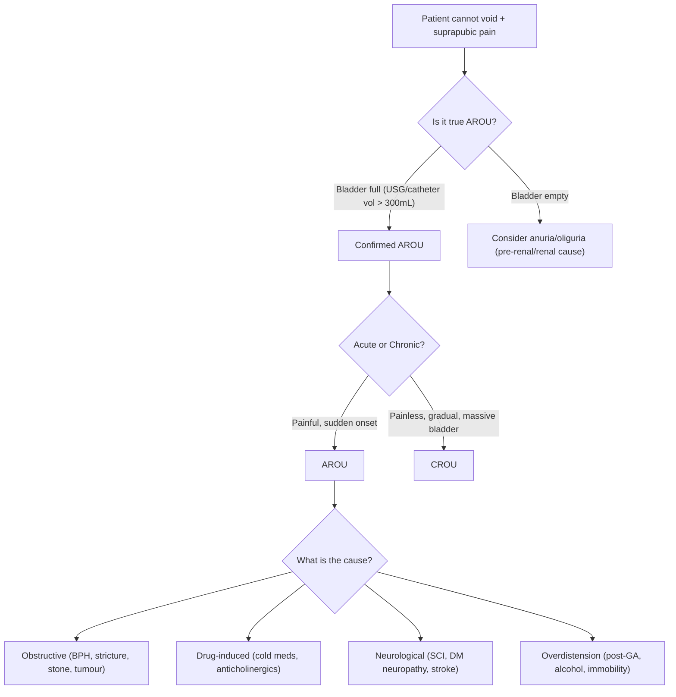

# Acute Retention of Urine (AROU)

---

## 1. Definition

***Acute urinary retention (AUR / AROU)*** is defined as the ***sudden inability to pass urine*** despite having a full bladder [1]. It is a **painful** condition — the patient is acutely distressed, with a palpable, tense bladder and a desperate urge to void but physically cannot.

Let's break the name down:
- **Acute** = sudden onset (hours, not weeks)
- **Retention** = urine is *produced* but *cannot be expelled* — the bladder is full
- **Of Urine** = distinguishing it from bowel/other retention

This is fundamentally different from **anuria/oliguria**, where the kidneys are simply not producing urine (pre-renal or renal failure). In AROU, the kidneys are working fine — the problem is *downstream*, at the level of the bladder outlet or detrusor muscle [2][3].

<Callout title="AROU vs CROU vs Anuria – Don't Confuse Them" type="error">

| | AROU | CROU | Anuria/Oliguria |
|---|---|---|---|
| Onset | ***Sudden*** | Gradual | Variable |
| Pain | ***Painful*** (innervation intact) | Usually ***painless*** (innervation often abnormal) | No suprapubic pain |
| Bladder | Distended, tense | Distended, may be massive | Not distended |
| Mechanism | BOO / acute detrusor failure | Chronic BOO / detrusor underactivity | Failure of urine production |
| Classic cause | BPH (males) | DM neuropathy | Shock, ATN, GN |

Students often confuse AROU with oliguria on the wards. The key distinguishing feature: **in AROU, the bladder is full and palpable; in oliguria, the bladder is empty** [2][3].
</Callout>

---

## 2. Epidemiology

### 2.1 Incidence and Prevalence

- ***AROU is the most common urological emergency*** [1][2][3]
- ***Common reason for hospital admission in Urology*** [1]

**In Males:**
- ***About 7 per 1,000 men per year*** [1]
- ***Overall cumulative probability of AUR in 4 years = 3%*** [1]
- ***Over 5 years*** [1]:
  - ***10% of men in their 70s will have AUR***
  - ***~30% of men in their 80s will have AUR***
- Overwhelmingly more common in men because of the prostate gland — an organ that females simply do not have, and which progressively enlarges with age

**In Females:**
- Much rarer: approximately ***~3 per 100,000 women per year*** [2]
- When it occurs in females, it is more commonly due to **detrusor underactivity** rather than outlet obstruction [1][2]
- Female bladder outlet obstruction is less common because females lack a prostate and have a shorter, wider urethra

### 2.2 Sex Differences – Why the Massive Discrepancy?

This is best understood through physiology:

| Feature | Male | Female |
|---|---|---|
| ***Physiological bladder outlet resistance*** | ***Higher*** (prostate surrounds urethra) | ***Lower*** (no prostate, shorter urethra) |
| ***Voiding depends more on*** | ***Detrusor contraction*** | ***Pelvic floor relaxation*** |
| ***Detrusor contraction strength*** | ***Stronger (~60 cmH₂O)*** | ***Weaker (~20 cmH₂O)*** |
| Common AROU mechanism | ***BOO more common*** | ***Detrusor underactivity more common*** |

Because males have higher outlet resistance (prostate), their detrusor muscle must generate more force to void. This means any additional increase in outlet resistance (e.g., BPH) can tip the balance into retention. Females have low baseline resistance, so obstruction is rarely the issue — instead, their weaker detrusor is more susceptible to underactivity [2].

---

## 3. Risk Factors

### 3.1 Risk Factors for Male AUR (Olmsted County Study) [1]

> ***Rates of AUR found to be increased with:***
> - ***Increasing age***
> - ***Increasing prostate size***
> - ***Increasing BPH symptoms***
> - ***Decreasing maximal urine flow rate*** [1]

These four risk factors reflect the progressive nature of BPH — as the prostate enlarges, symptoms worsen, flow rate drops, and eventually the detrusor can no longer overcome the obstruction.

### 3.2 Risk Factors for Female AUR

- Bladder outlet obstruction is less common
- Some may have ***detrusor underactivity*** [2]
- Risk factors include: diabetes mellitus (autonomic neuropathy), pelvic organ prolapse, pelvic surgery, neurological disease

### 3.3 Common Precipitating Factors [2]

These are the "last straw" triggers that push a patient with borderline compensation into overt retention:

| Precipitating Factor | Mechanism |
|---|---|
| **Constipation** | Faecal impaction in the rectum mechanically compresses the prostatic urethra/bladder neck from posteriorly (constipation is usually ***not a standalone aetiology but a precipitating factor*** with background prostatic enlargement) [2] |
| **UTI** | Pain and inflammation cause reflex urethral sphincter spasm; mucosal oedema further narrows the urethra |
| **Anaesthesia or analgesia** | GA and epidural/spinal anaesthesia block the sacral parasympathetic outflow (S2-4) → detrusor cannot contract; opioid analgesics also suppress the micturition reflex centrally |
| **Immobility** | Patients find it difficult to void when supine; prolonged recumbency reduces voiding efficiency |
| **Painful perianal conditions** | Thrombosed haemorrhoids, perianal abscess → reflex spasm of pelvic floor and urethral sphincter (pain inhibits micturition reflex) |
| **Excessive fluid intake (especially alcohol)** | Alcohol is a diuretic (suppresses ADH) → rapidly fills the bladder; alcohol also has a sedating/CNS depressant effect → patient may not respond to urge to void → overdistension |
| **Drugs** | See drug-induced aetiology below |

---

## 4. Anatomy and Physiology of Micturition

Understanding AROU requires understanding normal voiding. Think of it as a hydraulic system with a pump (detrusor), two valves (sphincters), and a pipe (urethra), all under neural control.

### 4.1 Lower Urinary Tract Anatomy

***The lower urinary tract consists of*** [1][2]:
- ***Male: bladder, prostate, urethra***
- ***Female: bladder, urethra***

Key structures:
- **Detrusor muscle**: the smooth muscle wall of the bladder; the "pump" that contracts to expel urine
- **Proximal sphincter mechanism (PSM)**: at the bladder neck; composed of smooth muscle; under **autonomic** control (sympathetic)
- **Distal sphincter mechanism (DSM)**: external urethral sphincter; composed of striated muscle; under **somatic** (voluntary) control via the pudendal nerve (S2-4)
- **Prostate** (males): surrounds the prostatic urethra; acts as a secondary continence device but is also the most common site of obstruction in men

### 4.2 Two Phases of Bladder Function [1][2]

***Storage phase:***
- ***Accommodation of urine at low pressure with appropriate sensation***
- ***Bladder outlet remains closed at rest or despite increased intra-abdominal pressure***
- ***No involuntary bladder contraction (detrusor overactivity)***

***Emptying phase:***
- ***Coordinated contraction of bladder smooth muscles at adequate magnitude and duration***
- ***Decreased resistance at bladder outlet***
  - ***Proximal sphincter mechanism (PSM) at bladder neck by autonomic control***
  - ***Distal sphincter mechanism (DSM) by somatic control***
- ***No anatomical obstruction***

### 4.3 Receptive Relaxation — Laplace's Law Applied to the Bladder [1][2]

***Laplace's law: T = P_ves × R / 2d***

Where:
- T = wall tension
- P_ves = intravesical pressure
- R = radius of the bladder
- d = wall thickness

***To store urine at the same pressure, increasing volume must be accompanied by decreasing tension.*** This is achieved by ***receptive relaxation*** — the ability of the detrusor muscle to accommodate increasing volume without a proportionate rise in pressure.

In pathological conditions (e.g., radiation cystitis, chronic obstruction with fibrosis), the bladder becomes ***hypocompliant*** → ***markedly increased pressure during filling*** → risk of upper tract damage [1][2].

### 4.4 Innervation of the Lower Urinary Tract

This is critical to understanding both normal voiding and neurogenic causes of AROU.

***Afferent pathways*** [1][2]:
- ***Aδ fibres for signals of distension*** (normal filling sensation)
- ***C-fibres for signals of irritation/pain*** (normally silent; become active in pathological states like infection or neuropathy)
- Travel along ***hypogastric, pelvic (majority), and pudendal nerves***
- Target: ***higher centres*** (pontine micturition centre → cerebral cortex)

**Efferent pathways** — three key nerve supplies:

| Nerve | Origin | Neurotransmitter / Receptor | Target | Function |
|---|---|---|---|---|
| **Hypogastric nerve** (sympathetic) | T10-L2 | Noradrenaline → **α₁ receptors** (bladder neck/prostate) and **β₃ receptors** (detrusor) | Bladder neck smooth muscle, detrusor | **Storage**: α₁ → contracts bladder neck (↑ outlet resistance); β₃ → relaxes detrusor (↓ tone during filling) |
| **Pelvic nerve** (parasympathetic) | S2-S4 | Acetylcholine → **M₃ muscarinic receptors** | Detrusor muscle | **Voiding**: contracts detrusor |
| **Pudendal nerve** (somatic) | S2-S4 (Onuf's nucleus) | Acetylcholine → **nicotinic receptors** | External urethral sphincter (striated muscle) | **Voluntary continence**: contracts external sphincter; relaxes during voiding |

### 4.5 Normal Micturition Reflex — Step by Step

1. **Filling**: Urine fills bladder → stretch receptors (Aδ fibres) fire → signal travels via pelvic nerve to sacral spinal cord → ascends to **pontine micturition centre (PMC)** → cortex
2. **Decision to void**: Cortex decides it is socially appropriate → signal sent down to PMC
3. **Voiding initiation** (PMC coordinates):
   - **Parasympathetic activation** (pelvic nerve, S2-4) → ACh at M₃ receptors → detrusor contracts
   - **Sympathetic inhibition** (hypogastric nerve) → α₁ receptors de-activated → bladder neck relaxes
   - **Somatic inhibition** (pudendal nerve) → external sphincter relaxes
4. **Coordinated voiding**: detrusor contracts AND sphincters relax simultaneously → low-pressure urination

<Callout title="Why Understanding Innervation Matters for AROU">
Every cause of AROU can be mapped back to a disruption of one of these steps:
- **Obstruction** = urethra/bladder neck physically blocked (step 4 impossible)
- **Sympathomimetics** = α₁ stimulation → bladder neck won't relax
- **Anticholinergics** = M₃ blockade → detrusor won't contract
- **Spinal cord lesion** = pathway between PMC and sacral cord interrupted → dyssynergia
- **Post-GA** = sacral parasympathetic output suppressed → no detrusor contraction
</Callout>

### 4.6 Detrusor Sphincter Dyssynergia (DSD) [1][2]

***Cause: spinal cord injury, pontine stroke***

***Mechanism: interruption of descending control by pontine micturition centre***
→ ***Failure of detrusor-sphincter coordination***
→ ***Synchronous contraction of both detrusor AND sphincters***

***Consequence: markedly increased urinary tract pressure → upper tract damage***

In DSD, the detrusor contracts (sacral reflex arc is intact) but the sphincter also contracts simultaneously (because the PMC, which normally coordinates sphincter relaxation, cannot send its signals down). This creates a functional obstruction with dangerously high pressures — like trying to pump water through a closed valve.

---

## 5. Aetiology

The aetiology of AROU can be divided into three major pathophysiological categories: **obstruction**, **detrusor failure**, and **neurological impairment**. In practice, it is often a ***mixture of factors*** [2].

### 5.1 Tabular Breakdown of Aetiologies from Epidemiological Data [1]

***Table 2: Aetiology of AUR (Murray et al., 1984)*** [1]:

| ***Cause*** | ***Percentage*** |
|---|---|
| ***Benign prostatic hyperplasia*** | ***53%*** |
| ***Constipation*** | ***7.5%*** |
| ***Carcinoma of the prostate*** | ***7%*** |
| ***Urethral stricture*** | ***3.5%*** |
| ***Clot retention*** | ***3%*** |
| ***Neurological disorders*** | ***2%*** |
| ***Post-operative*** | ***2%*** |
| ***Calculus*** | ***2%*** |
| ***Drugs*** | ***2%*** |
| ***Infection*** | ***2%*** |
| ***Miscellaneous/unknown*** | ***16%*** |

> BPH accounts for over half of all AROU cases. This is extremely high-yield.

### 5.2 Mechanical Bladder Outlet Obstruction (BOO) [1][2][3]

Think of it as: where is the blockage? **Extramural** (outside the tube), **mural** (in the wall), or **intraluminal** (inside the tube)?

#### ***Common obstructive causes in males*** [1]:

| Category | Causes | Pathophysiological Basis |
|---|---|---|
| **Extramural** | ***BPH*** | Transition zone hyperplasia → compresses prostatic urethra from outside. The prostate wraps around the urethra like a doughnut — as it grows, the "hole" gets smaller |
| | ***Cancer of prostate*** | Malignant infiltration/enlargement of prostate → compresses and invades urethra |
| | **Constipation / Faecal impaction** | Loaded rectum directly posterior to prostate → mechanical compression of prostatic urethra against pubic symphysis |
| | **Pelvic tumours** | Mass effect compressing bladder neck/urethra |
| | **Prostatitis** | Acute inflammation → oedema of prostate → compression of prostatic urethra; also painful voiding reflexly inhibits detrusor |
| | **Pregnancy** (females) | Gravid uterus compresses bladder neck |
| | **Pelvic organ prolapse** (females) | Cystocele kinks the urethra; rectocele/uterovaginal prolapse distorts anatomy |
| | **Gynaecological tumours** (females) | e.g., fibroids compressing bladder neck |
| **Mural** | ***Bladder neck stenosis*** (***usually after previous prostate surgery***) | Post-operative scarring/fibrosis at bladder neck → stricture |
| | ***Urethral stricture*** (***iatrogenic or infection/inflammation***) | Previous catheterisation, instrumentation, or STDs (especially gonococcal urethritis) → fibrosis → narrowing of urethral lumen |
| | **Urethritis** | Inflammation → mucosal oedema → narrowing; also painful → reflex sphincter spasm |
| | ***Bladder tumour*** | Tumour at bladder neck can physically obstruct the internal urethral orifice |
| **Intraluminal** | ***Bladder/Urethral stone*** | Stone lodges at bladder neck or urethra → ball-valve obstruction |
| | ***Clot retention (severe gross haematuria)*** | Blood clots fill the bladder and obstruct the bladder outlet — the bladder becomes full of clot and cannot empty |
| | **Foreign bodies** | Rare; inserted objects or migrated devices |
| | ***Phimosis*** | Tight foreskin → cannot retract → obstructs external urethral meatus. "Phimosis" from Greek *phimos* = muzzle |

#### ***Common causes in females*** [1]:

***Detrusor underactivity more common:***
- ***Detrusor hypocontractility – exclude DM***
- ***Neurogenic bladder***
- ***Idiopathic***

***Neurogenic bladder*** [1]:
- ***Bladder dysfunction associated with other neurological deficit***
- ***E.g., SCI, CVA, parkinsonism***

Other obstructive causes in females: pelvic organ prolapse (cystocele), gynaecological tumours (fibroid) [2]

### 5.3 Drug-Induced AROU [2][3]

Drugs are a **very common precipitant** — always ask about new medications!

| Drug Class | Examples | Mechanism |
|---|---|---|
| **Sympathomimetics – α-agonists** | ***Phenylephrine*** (in cold/cough medications, nasal decongestants), ephedrine, pseudoephedrine | α₁ agonism → contracts smooth muscle at bladder neck and prostatic urethra → ↑ outlet resistance → cannot void |
| **Sympathomimetics – β-agonists** | ***Terbutaline, salbutamol*** (bronchodilators), ***isoproterenol*** | β₂/β₃ agonism → relaxes detrusor smooth muscle → bladder cannot generate enough contraction force; also some β₃ effect directly relaxes detrusor |
| **Anticholinergics** | ***Atropine***, ipratropium (bronchodilators), oxybutynin, tolterodine | Block M₃ muscarinic receptors on detrusor → bladder cannot contract. This is literally the same receptor that parasympathetic nerves use to trigger voiding |
| **Antipsychotics** | Chlorpromazine, haloperidol, risperidone | Anticholinergic side effects → same as above |
| **Antidepressants** | TCAs (amitriptyline), SSRIs (less common) | TCAs have strong anticholinergic properties; also α-adrenergic effects |
| **Antihistamines** | Diphenhydramine, chlorpheniramine | First-generation antihistamines have significant anticholinergic effects |
| **Opioids** | Morphine, codeine, tramadol | Central suppression of micturition reflex + smooth muscle spasm + anticholinergic-like effects |
| **Antispasmodics** | Various | Anticholinergic effect |
| **Disopyramide** | Class Ia antiarrhythmic | Strong anticholinergic side effect |
| **MDMA (Ecstasy)** | Recreational drug | Sympathomimetic → α₁ agonism at bladder neck |

<Callout title="Exam Pearl: The Cold Medicine Trap" type="idea">
A classic exam scenario: elderly man with known BPH takes an over-the-counter cold remedy containing pseudoephedrine (α-agonist) and chlorpheniramine (antihistamine/anticholinergic) → double hit: ↑ outlet resistance + ↓ detrusor contraction → AROU. Always ask about OTC medications!
</Callout>

### 5.4 Neurological Causes (Neurogenic Bladder) [2][3]

| Level of Lesion | Causes | Mechanism |
|---|---|---|
| **Brain** | Stroke, Parkinson's disease, multiple sclerosis (MS), normal pressure hydrocephalus (NPH), multiple system atrophy (MSA) | Disruption of cortical/subcortical inhibition of micturition reflex. In stroke, may initially get retention (acute "spinal shock"-like phase) before later developing detrusor overactivity |
| **Spinal cord** | Trauma, vertebral metastasis, spinal stenosis, transverse myelitis, spinal cord haematoma/abscess, spinal cord tumour, epidural abscess, epidural metastasis | Interruption between PMC and sacral micturition centre → **DSD** (detrusor contracts but sphincter won't relax) OR loss of detrusor contraction in acute phase. **Must rule out spinal cord compression** — this is a surgical emergency! |
| **Peripheral nerves** | Diabetic neuropathy, radical pelvic surgery (damage to pelvic plexus), Guillain-Barré syndrome (GBS), genital herpes (sacral nerve involvement) | Damage to pelvic parasympathetic nerves → detrusor cannot contract (areflexic/hypotonic bladder). In DM, insidious autonomic neuropathy → progressive loss of bladder sensation and detrusor tone |

<Callout title="Red Flag: Spinal Cord Compression" type="error">
In any patient presenting with AROU + new neurological deficits (limb weakness, sensory level, saddle anaesthesia, loss of anal tone), you **must** urgently rule out spinal cord compression. This requires emergency MRI spine. Delay can lead to permanent paralysis and bladder dysfunction. ***A neurological exam including assessment of sensory level is mandatory in every AROU patient*** [3].
</Callout>

### 5.5 Acute Overdistension of the Bladder [2]

This is the mechanism behind post-operative and post-anaesthetic AROU.

**Increased urine production:**
- ***Excessive fluid intake (especially alcohol)*** — alcohol inhibits ADH → massive diuresis; patient may also be sedated and ignore urge to void

**Decreased voiding:**
- ***Post-anaesthesia (GA, epidural)*** — GA depresses the micturition reflex centrally; epidural/spinal blocks the sacral parasympathetic outflow directly → detrusor paralysis
- ***Analgesics (opioids)*** — central suppression of voiding reflex
- ***Painful perianal pathologies*** — reflex sphincter spasm
- ***Prolonged immobility*** — voiding is inefficient when supine; psychologically difficult for many patients to void in bed

***Overdistension can stretch detrusor muscles beyond their optimal length of action, leading to ineffective contraction*** [2]. This is essentially the **Frank-Starling mechanism applied to the bladder**: if the muscle fibres are stretched beyond the optimal overlap of actin and myosin filaments, contraction force drops dramatically. The bladder becomes a floppy, atonic bag — even after the initial cause is removed, the detrusor may take days to recover.

### 5.6 Aetiology Summary Table — Comprehensive

| Category | Subcategory | Specific Causes |
|---|---|---|
| **Mechanical BOO** | Extramural | BPH, CA prostate, constipation, pelvic tumours, prostatitis, pregnancy, POP, gynae tumours |
| | Mural | Urethral stricture, bladder neck stenosis, urethritis, bladder tumour |
| | Intraluminal | Stones, clot retention, foreign bodies, phimosis |
| **Drug-induced** | Sympathomimetics | α-agonists (cold meds), β-agonists (bronchodilators), MDMA |
| | Anticholinergics | Atropine, antihistamines, antipsychotics, TCAs, antispasmodics, opioids, disopyramide |
| **Neurological** | Brain | Stroke, Parkinson's, MS, NPH, MSA |
| | Spinal cord | Trauma, mets, stenosis, myelitis, abscess, tumour |
| | Peripheral | DM neuropathy, radical pelvic surgery, GBS, genital herpes |
| **Acute overdistension** | ↑ production | Excessive fluid/alcohol, IV fluids |
| | ↓ voiding | Post-GA/epidural, opioids, immobility, perianal pain |

---

## 6. Classification

### 6.1 Acute vs Chronic Retention [1][2]

| Feature | ***Acute (AROU)*** | ***Chronic (CROU)*** |
|---|---|---|
| Onset | ***Sudden*** | Gradual (weeks–months) |
| Pain | ***Painful*** (intact innervation, rapid distension) | ***Usually painless*** (slow distension, often abnormal innervation) |
| Typical cause | ***BPH*** | ***Hypocontractile bladder (e.g., DM neuropathy)*** |
| Bladder | Tense, tender, palpable | Large, non-tender, may be massive |
| Can lead to | Acute post-renal AKI if untreated | Overflow incontinence, chronic renal impairment |

### 6.2 By Mechanism

1. **Obstructive** — physical or dynamic blockage of urine outflow
2. **Non-obstructive** — failure of detrusor contraction (neurogenic, drug-induced, overdistension)
3. **Mixed** — most real-world cases; e.g., elderly man with BPH (partial obstruction) who takes a cold remedy (drug-induced ↓ contraction + ↑ resistance) after drinking alcohol (overdistension)

### 6.3 Spontaneous vs Precipitated AROU

- **Spontaneous**: occurs without an identifiable trigger; usually indicates more severe underlying obstruction (e.g., larger prostate → worse prognosis for trial without catheter)
- **Precipitated**: clear trigger identified (e.g., post-op, drugs, constipation); generally better prognosis as removing the precipitant may allow voiding to resume

---

## 7. Pathophysiology — Bringing It All Together

***Pathophysiology of Urinary Retention*** [1] — the lecture specifically dedicates a section to this.

### 7.1 The Three Mechanisms

***The pathogenesis is often a mixture of factors*** [2]:

#### Mechanism 1: Outflow Obstruction [2]

***Outflow obstruction: may be***
- ***Mechanical (physical narrowing): extramural, mural, luminal***
- ***Dynamic (increased muscle tone)***, e.g., ***DSD leading to incomplete relaxation of sphincters***

**Mechanical obstruction**: Physical narrowing of the urethral channel by tissue (BPH, stricture, stone, tumour). The detrusor must generate increasingly higher pressures to overcome the resistance. Eventually, the detrusor cannot generate enough force → retention.

**Dynamic obstruction**: Increased smooth muscle tone in the prostatic urethra and bladder neck, mediated by ***α₁-adrenergic receptors***. This is the rationale for α₁-blockers (e.g., tamsulosin) in BPH — they reduce dynamic obstruction by relaxing smooth muscle.

In BPH, *both* components contribute:
- ***Static component***: stromal hyperplasia mediated by ***dihydrotestosterone (DHT) via 5α-reductase*** → physical enlargement → mechanical obstruction [3]
- ***Dynamic component***: ***smooth muscle hypertrophy and contraction by α₁ receptors*** → functional obstruction [3]

#### Mechanism 2: Decreased Detrusor Contraction [2]

***Decreased detrusor contraction: may be***
- ***Neurological***, e.g., ***DM neuropathy, stroke, SCI***
- ***Drug-induced***, e.g., ***sympathomimetics, anticholinergics***
- ***Acute overdistension***, e.g., ***post-GA, immobilization***

The detrusor is a smooth muscle — it needs intact parasympathetic innervation (S2-4, pelvic nerve, ACh at M₃ receptors) to contract. Anything that interrupts this pathway = retention.

***Overdistension*** is a particularly insidious mechanism: the detrusor is stretched beyond the optimal length-tension relationship for its actin-myosin cross-bridges → contraction force plummets → a vicious cycle where the more distended it gets, the less it can contract [2].

#### Mechanism 3: Detrusor-Sphincter Dyssynergia [2]

In suprasacral spinal cord lesions, the sacral reflex arc is intact (so the detrusor contracts) but the coordinating signal from the PMC is lost (so the sphincter also contracts simultaneously). High pressures are generated but urine cannot flow — this is particularly dangerous for the upper tracts.

### 7.2 Consequences of AROU (if untreated)

1. **Immediate**: Pain, distress, autonomic dysreflexia (in SCI patients — dangerous hypertension)
2. **Hours**: Bladder overdistension → detrusor damage
3. **Days**: Post-renal AKI — bilateral ureteric obstruction (backpressure) or severe unilateral in single kidney
4. **Chronic if unrelieved**: Hydronephrosis → obstructive uropathy → chronic kidney disease

### 7.3 BPH-Specific Pathophysiology Leading to AROU [3]

***BPH pathophysiology*** [3]:
- ***Obstruction***:
  - ***Static component: stromal hyperplasia mediated by dihydrotestosterone (DHT) via 5α-reductase → 5α-reductase inhibitors (5-ARI)***
  - ***Dynamic component: smooth muscle hypertrophy and contraction by α₁ receptors → α₁-blockers***
- ***Irritation: detrusor instability causing overactive bladder***
- ***Complications: increased residual urine, causing infection and stone***

The progression from BPH to AROU:
1. Prostate enlarges (transition zone) → urethral compression
2. Detrusor compensates by hypertrophy → initially maintains flow
3. Over time, detrusor decompensates → ↑ residual urine → ↑ risk of retention
4. Precipitating event (cold, constipation, drugs, alcohol) → tips balance → AROU

***Complications of BPH*** [3]:
- **Prostate level**: bleeding (***ruptured dilated bladder neck veins***)
- **Bladder level**: ***AROU, recurrent UTI, bladder stone***, diverticulum, chronic ROU ± overflow incontinence
- **Upper tract**: ***Recurrent hydronephrosis***, obstructive uropathy, renal failure

---

## 8. Clinical Features

### 8.1 Symptoms

| Symptom | Pathophysiological Basis |
|---|---|
| **Acute suprapubic pain** | Rapid bladder distension stretches the bladder wall → activates C-fibre nociceptors and Aδ afferents → severe visceral pain. This is the hallmark symptom distinguishing AROU from CROU (where innervation is often impaired, so pain is absent) |
| **Inability to void** | The defining symptom. Urine is being produced but cannot exit — either because of outlet obstruction or detrusor failure |
| **Sensation of fullness / urgency** | Stretch receptors in the bladder wall (Aδ fibres) are firing constantly, generating an overwhelming urge to void — but the patient cannot |
| **Restlessness and agitation** | Severe pain and sympathetic activation from visceral distension |
| **Overflow dribbling** (may occur) | If intravesical pressure exceeds urethral resistance at any point, small amounts of urine may leak out — patients may paradoxically appear to be passing urine despite retention. Don't be fooled! |
| **Previous LUTS (in BPH)** | ***Obstructive LUTS: hesitancy, weak stream, straining, dribbling, incomplete emptying*** → these suggest pre-existing BOO (especially BPH) that has now decompensated into complete retention [2] |
| **Haematuria** (in some causes) | ***Gross haematuria*** may occur: prostatic venous congestion → ruptured vessels; or bladder tumour; or clot retention causing AROU |
| **Fever + dysuria** (if associated UTI) | Stagnant urine is a perfect culture medium for bacteria → UTI is both a complication and a precipitant of AROU |
| **Uraemic symptoms** (if prolonged retention) | Bilateral obstruction → post-renal AKI → nausea, confusion, pruritus, anorexia |
| **Strangury** (if stone) | ***Strangury = painful, frequent urination of small volumes, expelled slowly only by straining despite severe urgency and feeling of incomplete emptying*** [2] — characteristic of bladder/urethral stones |

### 8.2 History Taking — Systematic Approach [2]

***Is it true AROU?*** [2]
- ***Confirm urinary retention*** → check bladder USG / first catheterised urine volume → ***rule out oliguria/anuria***
- ***Confirm AROU*** → ask for ***painful suprapubic distension*** → ***rule out chronic ROU***

***How is the AROU like?*** [2]
- ***Characterise current episode***
- ***First time or recurrent?***
- ***Any precipitating events?***: ***recent surgery, new medications, pelvic trauma, immobilisation, alcohol consumption, genitourinary instrumentations***

***Is it bladder outlet obstruction?*** — ***ask about previous LUTS*** [2]
- ***Obstructive LUTS: hesitancy, weak stream, straining, dribbling, incomplete emptying***
- ***IPSS (International Prostate Symptom Score) can be used for male*** [2]

***Is it BPH?*** — ***ask about other symptoms/complications of BPH*** [2]:
- ***Gross haematuria***
- ***UTI: fever, dysuria***
- ***Bladder/urethral stones: strangury***
- ***Renal impairment: uraemic symptoms***

**Additional history to elicit:**
- **Drug history** (especially cold remedies, anticholinergics, opioids, bronchodilators)
- **Bowel history** (constipation)
- **Neurological symptoms** (limb weakness, numbness, back pain, saddle anaesthesia, loss of anal tone — suggesting spinal cord compression)
- **Past surgical history** (previous prostate surgery → bladder neck stenosis; previous urethral instrumentation → stricture)
- **DM and other medical history** (DM neuropathy, Parkinson's, MS)
- **Sexual and STI history** (gonococcal urethritis → stricture)

### 8.3 Signs — Physical Examination

| Sign | How to Elicit | Pathophysiological Basis |
|---|---|---|
| **Palpable bladder** | Suprapubic palpation — a smooth, rounded, tense mass arising from the pelvis; cannot get below it | ***Bladder palpable when > 200 mL*** [3]. A full, distended bladder rises above the pubic symphysis and becomes palpable abdominally |
| **Suprapubic dullness to percussion** | Percuss from umbilicus downward — dull note over distended bladder | ***Bladder dull on percussion when > 150 mL*** [3]. Fluid-filled bladder transmits sound differently from surrounding air-filled bowel |
| **Suprapubic tenderness** | Palpation elicits pain | Acute distension stretching the peritoneum overlying the bladder dome → somatic pain |
| **Vital signs** | Tachycardia, hypertension (pain response); may have fever if associated UTI/prostatitis | Sympathetic activation from pain; sepsis if infected |
| ***DRE findings*** [3] | ***Prostate size/tenderness, masses, anal tone*** | Enlarged smooth prostate = BPH; hard nodular prostate = CA prostate; tender boggy prostate = prostatitis; ↓ anal tone = neurological cause (cauda equina); rectal mass = constipation/tumour |
| **Neurological examination** | ***Sensory level*** [3]; assess lower limb power, reflexes, perineal sensation (S2-4), bulbocavernosus reflex, anal tone | A sensory level suggests spinal cord compression; absent perineal sensation suggests cauda equina syndrome; absent bulbocavernosus reflex suggests sacral nerve damage |
| **External genitalia** | Inspect for ***phimosis*** (tight foreskin covering meatus), paraphimosis, meatal stenosis, urethral discharge, blood at meatus | Blood at urethral meatus is a **contraindication** for urethral catheterisation — suggests urethral trauma. ***Phimosis*** can physically obstruct the external meatus |
| **Abdominal examination** | Check for masses, scars (previous surgery), signs of renal failure | Flank tenderness may suggest hydronephrosis |

<Callout title="Examination Checklist for AROU — Don't Forget!">

1. **Vitals** — pain response, sepsis?
2. **Abdomen** — palpable/percussible bladder, tenderness, scars, masses
3. ***DRE*** — prostate (size, consistency, tenderness, median sulcus), rectal mass, anal tone
4. **External genitalia** — phimosis, blood at meatus, discharge
5. ***Neurological exam*** — sensory level, lower limb power/reflexes, perineal sensation, anal tone

These are all explicitly mentioned in the lecture slides [1] and senior notes [2][3] and are classic OSCE stations.
</Callout>

---

## 9. BPH-AROU Connection: The Most Common Scenario in Hong Kong

Given that BPH accounts for ***53%*** of all AROU cases [1], and Hong Kong has an ageing population, BPH-related AROU is overwhelmingly the most tested scenario.

***BPH key points*** [3]:
- ***Definition: proliferation of stromal component in transitional zone of prostate***
- ***Prostate starts to increase in size at age 40 — usually becomes symptomatic at ~50 years old***
- ***Typical age: 50–80***
- ***LUTS: both obstructive and irritative symptoms (obstructive >> irritative)***
- ***DRE: smooth enlarged > 3 finger-breadths, non-tender, median sulcus present, anal tone intact***

***Etiology and risk factors of BPH*** [4]:
1. ***Age***
2. ***Race***
3. ***Diet***
4. ***Metabolic syndrome***
5. ***Genetics (role unclear)***
6. ***Growth factors (basic fibroblastic GF, insulin-like GF, etc.)***

***Investigations for BPH*** [3]:
- ***IPSS (International Prostate Symptom Score)***: quantify LUTS (obstructive + irritative + QoL)
- ***Voiding diary / Frequency-volume chart: at least 3 days***, especially if frequency/nocturia
- ***Urinalysis***, microscopy, C/ST (rule out UTI)
- ***Uroflowmetry***: to confirm obstruction
  - Volume voided > 150 mL to be representative
  - ***Peak urine flow rate (Qmax)***: diagnostic ( < 15 mL/sec), prognostic ( < 10 mL/sec: better outcome after TURP)
  - Abnormal strain pattern (multiple peaks)
  - Post-void residual volume: < 150 mL
- Bloods: RFT, PSA (rule out CA prostate)
- TRUS: assess size of prostate

---

## 10. Approach Summary — Putting It All Together

When a patient presents with AROU, your thinking should be:

```mermaid
graph TD
    A["Patient cannot void + suprapubic pain"] --> B{"Is it true AROU?"}
    B -->|"Bladder full (USG/catheter vol > 300mL)"| C["Confirmed AROU"]
    B -->|"Bladder empty"| D["Consider anuria/oliguria (pre-renal/renal cause)"]
    C --> E{"Acute or Chronic?"}
    E -->|"Painful, sudden onset"| F["AROU"]
    E -->|"Painless, gradual, massive bladder"| G["CROU"]
    F --> H{"What is the cause?"}
    H --> I["Obstructive (BPH, stricture, stone, tumour)"]
    H --> J["Drug-induced (cold meds, anticholinergics)"]
    H --> K["Neurological (SCI, DM neuropathy, stroke)"]
    H --> L["Overdistension (post-GA, alcohol, immobility)"]
```

---

<Callout title="High Yield Summary">

1. ***AROU = sudden, painful inability to void despite full bladder*** — most common urological emergency
2. **Epidemiology**: predominantly males > 60; ***7/1000 men/year***; ***10% in 70s, 30% in 80s over 5 years***; very rare in females (~3/100k)
3. ***BPH is the #1 cause (53%)*** — always the first differential in an elderly male
4. **Three mechanisms**: (a) outflow obstruction (mechanical + dynamic), (b) ↓ detrusor contraction (drugs, neurological, overdistension), (c) DSD
5. ***Drug-induced AROU***: α-agonists (cold meds) ↑ outlet resistance; anticholinergics ↓ detrusor contraction — **always ask about new medications**
6. ***Constipation is usually a precipitating factor, not standalone cause*** — mechanical compression of prostatic urethra
7. ***Acute overdistension damages detrusor*** by stretching beyond optimal actin-myosin overlap → vicious cycle
8. **Key exam signs**: palpable bladder ( > 200 mL), dull to percussion ( > 150 mL), DRE for prostate, neurological exam for sensory level and anal tone
9. ***Must rule out spinal cord compression*** in any AROU with neurological deficits — emergency MRI
10. ***AROU ≠ anuria*** — in AROU the bladder is full; in anuria the bladder is empty
11. ***Distinguish AROU (painful) from CROU (painless)*** — innervation status determines this
12. **BPH pathophysiology**: static component (DHT/5α-reductase → physical enlargement) + dynamic component (α₁ receptors → smooth muscle tone) → rationale for 5-ARI + α-blockers

</Callout>

---

<ActiveRecallQuiz
  title="Active Recall - Acute Retention of Urine"
  items={[
    {
      question: "What is the definition of AROU and how does it differ from anuria?",
      markscheme: "AROU = sudden painful inability to void despite full bladder (urine produced but cannot be expelled). Anuria = no urine production (bladder empty). Key distinguishing feature: bladder is full and palpable in AROU, empty in anuria."
    },
    {
      question: "Name the top 3 causes of AROU in males with their approximate percentages.",
      markscheme: "BPH (53%), constipation (7.5%), CA prostate (7%). BPH is overwhelmingly the most common cause."
    },
    {
      question: "Explain how cold medications can precipitate AROU in a patient with BPH, naming the specific drug classes and their mechanisms.",
      markscheme: "Cold meds often contain: (1) alpha-agonists (pseudoephedrine/phenylephrine) which stimulate alpha-1 receptors at bladder neck causing smooth muscle contraction and increased outlet resistance; (2) antihistamines (chlorpheniramine/diphenhydramine) which have anticholinergic properties blocking M3 receptors on detrusor preventing contraction. Double hit: increased resistance + decreased contraction in already compromised system."
    },
    {
      question: "Explain the mechanism of post-anaesthetic urinary retention, including the role of detrusor overdistension.",
      markscheme: "GA depresses micturition reflex centrally; epidural/spinal blocks sacral parasympathetic outflow (S2-4) directly paralysing detrusor. Patient receives IV fluids but cannot void. Bladder fills beyond capacity. Overdistension stretches detrusor muscle fibres beyond optimal actin-myosin overlap (length-tension relationship) leading to ineffective contraction. Vicious cycle: more distension leads to less contraction force."
    },
    {
      question: "What are the essential components of physical examination in AROU and what does each finding suggest?",
      markscheme: "Five components: (1) Vitals - pain response, sepsis; (2) Abdominal exam - palpable bladder (>200mL), dull to percussion (>150mL); (3) DRE - prostate size/consistency/tenderness (BPH vs CA vs prostatitis), anal tone (neurological), rectal masses; (4) External genitalia - phimosis, blood at meatus (contraindication for catheterisation if urethral trauma); (5) Neurological exam - sensory level, lower limb power/reflexes, perineal sensation to rule out spinal cord compression/cauda equina."
    },
    {
      question: "Explain the static and dynamic components of BPH obstruction and the pharmacological rationale for treating each.",
      markscheme: "Static component: stromal hyperplasia driven by DHT (converted from testosterone by 5-alpha-reductase) causing physical enlargement of prostate and mechanical compression of urethra. Treated with 5-alpha-reductase inhibitors (finasteride/dutasteride) which reduce DHT and shrink prostate. Dynamic component: smooth muscle hypertrophy and contraction mediated by alpha-1 adrenergic receptors in prostatic stroma and bladder neck. Treated with alpha-1 blockers (tamsulosin/alfuzosin) which relax smooth muscle and reduce functional obstruction."
    }
  ]}
/>

---

## References

[1] Lecture slides: GC 180. Benign prostatic hyperplasia, bladder outlet obstruction and urinary retention.pdf (pp. 3, 22–33, 62)
[2] Senior notes: Ryan Ho Urogenital.pdf (pp. 159, 162–165); Ryan Ho Fundamentals.pdf (pp. 347–350)
[3] Senior notes: maxim.md (sections on AROU and BPH); felixlai.md (AROU section)
[4] Lecture slides: Benign Prostatic Hyperplasia.pdf (p. 5)
[5] Senior notes: Ryan Ho Critical Care.pdf (p. 25 — post-renal AKI)
