# History Taking: Acute Retention of Urine (AROU)

---

## Master Framework Diagram

```mermaid
graph TD
    A["Patient presents with inability to pass urine"] --> B["1. Is it TRUE AROU?"]
    B --> B1["Confirm retention vs anuria/oliguria"]
    B --> B2["Painful (acute) vs Painless (chronic)"]
    
    A --> C["2. Characterize the Episode"]
    C --> C1["Onset, duration, first vs recurrent"]
    C --> C2["Precipitating events:<br/>surgery, medications, alcohol,<br/>immobilization, trauma"]
    
    A --> D["3. Identify the Underlying Cause"]
    D --> D1["Bladder Outlet Obstruction?<br/>Obstructive LUTS (IPSS)"]
    D --> D2["BPH complications?<br/>Haematuria, UTI, stones, renal impairment"]
    D --> D3["Neurological cause?<br/>Back pain, limb weakness,<br/>saddle anaesthesia, incontinence"]
    D --> D4["Drug-induced?<br/>Sympathomimetics, anticholinergics,<br/>antipsychotics, opioids"]
    D --> D5["Malignancy?<br/>Weight loss, bone pain,<br/>haematuria"]
    
    A --> E["4. Background History"]
    E --> E1["PMHx: BPH, DM, stroke,<br/>STDs, malignancy"]
    E --> E2["PSHx: Prostate/pelvic/spinal surgery"]
    E --> E3["Medications & Allergies"]
    E --> E4["Family Hx: Prostate CA"]
    E --> E5["Social Hx: Smoking, alcohol,<br/>IVDU, sexual history, ADLs"]
    
    A --> F["5. Red Flags & Escalation"]
    F --> F1["Spinal cord compression signs"]
    F --> F2["Uraemia / renal impairment"]
    F --> F3["Sepsis / infected retention"]
    F --> F4["Bilateral hydronephrosis"]
```

---

## 1. Confirming True AROU — "Is this really acute retention?"

This is your first job. Before you launch into differential diagnosis, you need to establish that the patient actually has a full bladder they cannot empty, rather than simply not producing urine.

### Key Questions

| Question | Why It Matters | Cantonese Phrasing |
|----------|---------------|-------------------|
| "When did you last pass urine?" | Establishes timeline and acuity | 你上一次小便係幾時？(nei5 soeng6 jat1 ci3 siu2 bin6 hai6 gei2 si4?) |
| "Is your lower tummy swollen and painful?" | ***Painful*** suprapubic distension = AROU; ***painless*** = CROU [1][2] | 你個肚下面有冇脹住痛？(nei5 go3 tou5 haa5 min6 jau5 mou5 zoeng3 zyu6 tung3?) |
| "Are you still producing urine at all — even small amounts or dribbling?" | Differentiates retention from anuria/oliguria [2][3] | 你仲有冇少少尿出到？(nei5 zung6 jau5 mou5 siu2 siu2 niu6 ceot1 dou2?) |
| "Is this the first time, or has this happened before?" | First episode vs recurrent — recurrent suggests progressive pathology [1] | 係第一次定之前都試過？(hai6 dai6 jat1 ci3 ding6 zi1 cin4 dou1 si3 gwo3?) |

<Callout title="AROU vs Anuria — Don't confuse them" type="error">
***AROU should be distinguished from anuria or oliguria → lack of urine production, not retention*** [2][3]. A patient in shock (e.g. ruptured AAA) or dehydration may also not be passing urine, but the bladder will be empty. Always confirm with a bladder scan (≥300mL unable to void suggests retention; ≥1L suggests chronic retention) [2].
</Callout>

---

## 2. Characterizing the Current Episode

### Onset & Timing
- **"When exactly did you stop being able to pass urine?"** — Pin down the hour/day. Sudden onset over hours = acute. Gradual worsening over days-weeks with vague fullness = more likely chronic with acute-on-chronic overlay.
- **"What were you doing when it started?"** — Post-operative retention is extremely common after GA or epidural anaesthesia [3][4].

### Precipitating Factors
This is a high-yield area in the OSCE. There is almost always a precipitant on top of a background predisposition.

| Precipitant | Question to Ask | Cantonese |
|-------------|----------------|-----------|
| ***Recent surgery / anaesthesia*** | "Have you had any operations recently?" | 你最近有冇做過手術？(nei5 zeoi3 gan6 jau5 mou5 zou6 gwo3 sau2 seot6?) |
| ***New medications*** | "Have you started any new medications — especially cold medicines, painkillers, or psychiatric drugs?" | 你有冇食新藥？特別係傷風藥、止痛藥？(nei5 jau5 mou5 sik6 san1 joek6?) |
| ***Alcohol*** | "Have you been drinking large amounts of alcohol recently?" | 你最近有冇飲好多酒？(nei5 zeoi3 gan6 jau5 mou5 jam2 hou2 do1 zau2?) |
| Constipation / faecal impaction | "When did you last open your bowels?" | 你上次大便幾時？(nei5 soeng6 ci3 daai6 bin6 gei2 si4?) |
| Prolonged immobility | "Have you been bedbound or less mobile recently?" | 你最近有冇長時間臥床？ |
| Pelvic trauma | "Have you had any injury to your lower tummy, back passage, or groin?" | 你有冇撞親下面？ |

<Callout title="Cold medications — a classic OSCE trap" type="idea">
***Sympathomimetics such as α-agonists found in cold medications (e.g. phenylephrine, pseudoephedrine) and β-agonists in bronchodilators*** can precipitate AROU by increasing outflow resistance [2][3][4]. This is a favourite viva question: "What over-the-counter drugs can cause urinary retention?"
</Callout>

---

## 3. Identifying the Underlying Cause

### A. Bladder Outlet Obstruction — Obstructive LUTS

Ask about ***preceding Lower Urinary Tract Symptoms (LUTS)*** [1][5]. Use the IPSS framework:

**Voiding (Obstructive) Symptoms** — point to outlet obstruction:
- ***Hesitancy*** (遲遲先開始 ci4 ci4 sin1 hoi1 ci2) — "Do you have to wait a long time before urine starts flowing?"
- ***Weak stream*** (尿流好細 niu6 lau4 hou2 sai3) — "Is your urine stream weaker than before?"
- ***Straining*** — "Do you have to push or strain to start urinating?"
- ***Intermittency / Dribbling*** — "Does your stream stop and start?"
- ***Incomplete emptying*** — "After you finish, do you feel like your bladder is still not empty?"

**Storage (Irritative) Symptoms** — may coexist:
- ***Frequency*** — "How many times do you go during the day?" (>8/day is abnormal)
- ***Urgency*** — "Do you get a sudden strong urge that's hard to hold?"
- ***Nocturia*** — "How many times do you wake at night to pass urine?" (夜尿幾多次 je6 niu6 gei2 do1 ci3)

> **Why IPSS matters:** ***IPSS can be used for males*** [2] to quantify symptom severity (0–7 mild, 8–19 moderate, 20–35 severe) [4]. This helps grade BPH severity and guides management decisions.

### B. BPH Complications

***BPH is the most common cause of AROU in males (53%)*** [2][3]. Ask about complications:

| Complication | Question | Why |
|-------------|----------|-----|
| ***Gross haematuria*** | "Have you noticed blood in your urine?" (有冇血尿 jau5 mou5 hyut3 niu6) | Suggests BPH, CA bladder, or CA prostate [1] |
| ***UTI (fever/dysuria)*** | "Any burning when you pass urine? Any fever?" | Stasis predisposes to infection [1] |
| ***Bladder/urethral stone*** | "Any sudden sharp pain when urinating that makes you stop mid-stream?" (strangury) | Stones can cause BOO or complicate BPH [1] |
| ***Renal impairment*** | "Any nausea, loss of appetite, itching, or fatigue?" (uraemic symptoms) | Obstructive nephropathy from chronic retention [1][2] |

### C. Neurological Causes — ***Must Rule Out Spinal Cord Compression***

This is the one you cannot miss. ***Neurogenic bladder*** can present as AROU, and if spinal cord compression is the cause, delay in diagnosis → irreversible paraplegia [3][4][6].

| Question | What You're Looking For | Cantonese |
|----------|------------------------|-----------|
| "Any back pain?" | Vertebral metastasis, epidural abscess, disc prolapse | 有冇背脊痛？(jau5 mou5 bui3 zek3 tung3?) |
| "Any weakness or numbness in your legs?" | Motor/sensory deficit from cord compression | 對腳有冇冇力或者痺？(deoi3 goek3 jau5 mou5 mou5 lik6 waak6 ze2 bei3?) |
| "Any numbness around your back passage/saddle area?" | Saddle anaesthesia → cauda equina syndrome | 屎窟附近有冇痺？ |
| "Any problems with bowel control?" | Faecal incontinence = red flag for cauda equina | 有冇失禁？ |

### D. Drug-Induced Causes

***Drug-induced AROU*** is extremely common and very testable [2][3][4]:

| Drug Class | Mechanism | Examples |
|-----------|-----------|---------|
| ***Sympathomimetics (α-agonists)*** | ↑Urethral smooth muscle tone → ↑outflow resistance | ***Phenylephrine (cold medications)***, pseudoephedrine |
| ***Sympathomimetics (β-agonists)*** | Detrusor relaxation | ***Terbutaline, salbutamol (bronchodilators)*** |
| ***Anticholinergics*** | Impair detrusor contractility | ***Atropine, ipratropium, tiotropium, antihistamines (promethazine), antispasmodics (opioids)*** |
| ***Antipsychotics*** | Anticholinergic side effects | Chlorpromazine, olanzapine |
| ***Antidepressants*** | Anticholinergic / serotonergic effects | TCAs (amitriptyline), SSRIs |
| ***Disopyramide*** | Anticholinergic (class Ia antiarrhythmic) | Disopyramide |
| ***MDMA (Ecstasy)*** | Sympathomimetic | Recreational drug use |

> Ask specifically: "Are you taking any cold medicines, cough syrups, asthma inhalers, sleeping tablets, pain medications, or psychiatric medications?" (你有冇食傷風藥、咳藥水、哮喘噴劑、安眠藥、止痛藥、精神科藥？)

### E. Malignancy Screen

| Question | Target |
|----------|--------|
| "Any unexplained weight loss or loss of appetite?" | Constitutional symptoms for CA prostate, CA bladder [4] |
| "Any bone pain, especially in the back or hips?" | Bony metastases from prostate CA |
| "Any blood in your urine — when does it appear?" | ***Haematuria*** — beginning = lower tract, throughout = above bladder, terminal = prostate/bladder neck [7] |
| "Have you ever worked with chemicals, dyes, or rubber?" | Occupational risk for bladder CA |

---

## 4. Targeted Systems Review

| System | Questions | Relevance |
|--------|----------|-----------|
| Urological | Dysuria, haematuria, urethral discharge, scrotal pain | UTI, STD, urethritis causing urethral oedema |
| GI | Constipation, change in bowel habit, rectal bleeding | ***Constipation (7.5% of male AROU)*** [2]; rectal mass |
| Neurological | Back pain, limb weakness, sensory changes, gait difficulty | Cord compression, cauda equina, MS, GBS |
| Constitutional | Fever, weight loss, night sweats, fatigue | Infection, malignancy |
| Gynaecological (females) | Pelvic heaviness, prolapse symptoms, vaginal bleeding | ***Pelvic organ prolapse (cystocele, rectocele)***, gynaecological tumours [2][3] |

---

## 5. Background History

### Past Medical History
- **BPH** — duration, previous IPSS, previous treatment (alpha-blockers, 5-ARI)
- **Diabetes mellitus** — ***DM neuropathy*** is a key cause of neurogenic bladder [1][2][6]
- **Stroke / Parkinson's disease / Multiple sclerosis** — neurogenic bladder [2]
- **STDs** — urethral stricture from previous gonococcal urethritis [2]
- **Malignancy** — especially prostate, bladder, any pelvic/spinal tumour
- **Pelvic trauma**

### Past Surgical History
- ***Prostate surgery*** (TURP, radical prostatectomy) — bladder neck stenosis is a recognised sequela [1][5]
- ***Pelvic surgery*** (hernia repair, gynaecological) — nerve injury
- ***Spinal surgery*** — neurogenic bladder
- ***Urethral instrumentation*** — stricture formation [2]

### Medications & Allergies
- Go through the drug classes above systematically
- **Drug allergies** — especially to local anaesthetics and antibiotics (relevant for catheterization and treatment)

### Family History
- ***Family history of prostate cancer*** [5] — first-degree relative with prostate CA doubles risk
- BPH tends to run in families

### Social History
- **Smoking** — risk factor for bladder CA [7]
- **Alcohol** — ***excessive fluid intake (especially alcohol)*** can precipitate AROU by acute bladder overdistension [2][3]
- **IVDU** — risk of epidural abscess → cord compression [4]
- **Sexual history** — STDs → urethral stricture; genital herpes → sacral nerve involvement [4]
- **Occupation** — exposure to arylamines/dyes (bladder CA risk) [7]
- **Functional baseline / ADLs** — mobility, continence pre-admission, living situation, carers

---

## 6. Differentiating Questions — Distinguishing Key Alternatives

| Diagnosis | Key Differentiating Question | Expected Finding |
|-----------|------------------------------|------------------|
| **BPH** | Long history of progressive obstructive LUTS, nocturia | Most common; older male, gradual worsening |
| **CA Prostate** | Bony pain (back, hips), weight loss, haematuria | Rapid progression, hard irregular prostate on DRE |
| **Urethral stricture** | History of previous catheterization, urethral instrumentation, STDs | Young/middle-aged male, very slow stream |
| **Drug-induced** | New medication started within days/weeks | Temporal relationship; resolves when drug stopped |
| **Constipation/faecal impaction** | Not opened bowels for days, abdominal distension | Common precipitant in elderly, often overlooked |
| **Spinal cord compression** | Back pain + leg weakness + sensory level + bowel dysfunction | EMERGENCY — needs urgent MRI |
| **Cauda equina syndrome** | Saddle anaesthesia, bilateral leg pain, bowel/bladder dysfunction | EMERGENCY — needs urgent MRI and decompression |
| **Post-operative** | Recent GA/epidural, onset within hours of surgery | ***Bladder overdistension from reduced detrusor function post-anaesthesia*** [3][4] |
| **Genital herpes** | Painful vesicular lesions around genitalia | Sacral nerve involvement [4] |

---

## 7. Red-Flag Findings & Escalation Triggers

<Callout title="Red Flags — Escalate Immediately" type="error">

- ***Bilateral lower limb weakness + sensory level + back pain*** → **Spinal cord compression** — URGENT MRI, call neurosurgery/spinal team
- ***Saddle anaesthesia + faecal incontinence*** → **Cauda equina syndrome** — EMERGENCY surgical decompression
- **Fever + rigors + retention** → **Infected retention / urosepsis** — urgent catheterization + IV antibiotics + sepsis protocol
- **Raised creatinine + bilateral hydronephrosis** → **Obstructive nephropathy** — needs urgent decompression, monitor for ***post-obstructive diuresis*** [4]
- **First catheterized volume >1000mL** → Likely ***chronic retention of urine*** rather than pure AROU, suggesting chronic obstruction with potential renal damage [2][4]
- **Blood at urethral meatus / high-riding prostate** → **Urethral injury** — do NOT attempt urethral catheterization; call urology for suprapubic catheter [2]

</Callout>

---

## 8. Common Pitfalls in History-Taking

<Callout title="Pitfalls Students Often Fall Into" type="error">

1. **Forgetting to differentiate AROU from anuria** — A patient not passing urine ≠ retention. Always check if the bladder is full. If the bladder is empty, think pre-renal or renal causes of oliguria/anuria [2][3].
2. **Not asking about medications** — Drug-induced AROU is a top cause and the most reversible. Students frequently skip this. Go through cold medicines, inhalers, psychiatric meds, and opioids systematically.
3. **Ignoring constipation** — ***Constipation accounts for 7.5% of AROU in males*** [2]. Always ask about bowels.
4. **Failing to screen for neurological red flags** — If you miss spinal cord compression, the patient may end up paraplegic. Always ask about back pain, leg weakness, saddle anaesthesia, and bowel dysfunction.
5. **Ordering PSA in the acute setting** — ***PSA is NOT required during an episode of AROU as it is expected to be elevated (false positive)*** [4]. PSA should be done 4–6 weeks later [2].
6. **Assuming normal prostate on DRE excludes BPH** — ***A normal prostate examination does NOT exclude BPH as a cause of obstruction*** [4]. The median lobe may protrude into the bladder without enlarging the gland externally.
7. **Not assessing for chronic-on-acute retention** — If the patient has been dribbling with a vague sense of fullness for weeks, this is not purely acute. First catheterized volume >1L is the clue [2].

</Callout>

---

## 9. High-Yield Exam Interpretation Tips

| What You Ask | Why It Matters for the OSCE |
|-------------|----------------------------|
| Painful vs painless | ***Acute = painful (innervation intact, e.g. BPH); Chronic = painless (innervation abnormal, e.g. DM neuropathy)*** [1][2] — this is a classic opening viva question |
| First catheterized volume | >500mL = genuine AROU; >1000mL = likely chronic retention [4] |
| IPSS score | Quantifies LUTS severity; mild 0–7, moderate 8–19, severe 20–35 [4][5] — shows you understand grading |
| Drug history | Demonstrates clinical reasoning — if you identify a culprit drug, you can propose stopping it as first-line management |
| Neurological symptoms | Shows you are thinking about dangerous differentials — examiners love this |
| Constitutional symptoms | Demonstrates you are screening for malignancy — a must in any urological history |
| Sexual history / STDs | Links to urethral stricture — shows depth of knowledge |
| Bowel history | Shows you know about constipation as a precipitant — a subtle but important point |

---

## 10. Model Reporting Script

> **"Mr Chan is a 72-year-old gentleman with a background of hypertension, type 2 diabetes mellitus, and benign prostatic hyperplasia (on tamsulosin), who presented this evening to Queen Mary Hospital with a 6-hour history of inability to pass urine associated with severe suprapubic pain and distension.**
>
> **In terms of his presenting complaint, he reports progressive lower urinary tract symptoms over the past 2 years, including hesitancy, weak stream, nocturia three times per night, and a sensation of incomplete emptying. His IPSS score is approximately 22 out of 35, indicating severe symptoms. He denies any prior episodes of retention. He denies haematuria, dysuria, fever, or weight loss. There are no neurological symptoms — no back pain, no leg weakness, no saddle anaesthesia, and no change in bowel control. He has been constipated for the past 4 days and has not opened his bowels. He was started on a new cold medication (containing pseudoephedrine) by his GP 3 days ago for an upper respiratory tract infection.**
>
> **His past medical history includes hypertension, type 2 diabetes mellitus (well controlled, HbA1c 6.8%), BPH diagnosed 3 years ago, and hyperlipidaemia. He has no history of STDs, stroke, malignancy, or neurological disease. He has no previous surgical history.**
>
> **His regular medications are tamsulosin 0.4mg daily, metformin 500mg BD, amlodipine 5mg daily, and atorvastatin 20mg daily. The new pseudoephedrine-containing cold medication was started 3 days ago. He has no known drug allergies.**
>
> **His family history is significant for his father being diagnosed with prostate cancer at age 78.**
>
> **Socially, he is a retired bus driver, lives with his wife, is independently mobile, and manages all activities of daily living. He is a non-smoker and drinks 1–2 beers per week. He denies any illicit drug use.**
>
> **In summary, this is a case of acute retention of urine in an elderly gentleman with known BPH and severe baseline LUTS, likely precipitated by the combination of constipation and a recently commenced sympathomimetic cold medication. I would like to confirm the diagnosis with a bladder scan, proceed with urethral catheterization for bladder decompression, stop the pseudoephedrine, manage his constipation, check bloods including RFT and CBC, and send catheterized urine for microscopy and culture. PSA should be deferred for 4–6 weeks."**

---

<Callout title="High Yield Summary">

**AROU = sudden, painful inability to void despite a full bladder. It is the most common urological emergency.**

**History-taking framework — ask yourself 5 questions in order:**
1. **Is it true AROU?** — Confirm full bladder (painful suprapubic distension), rule out anuria/oliguria, differentiate from chronic retention (painless)
2. **What characterizes this episode?** — First vs recurrent, precipitants (surgery, drugs, alcohol, constipation, immobility)
3. **Is there underlying BOO?** — Preceding obstructive LUTS using IPSS; BPH complications (haematuria, UTI, stones, renal impairment)
4. **Is there a neurological cause?** — MUST rule out spinal cord compression (back pain, leg weakness, sensory level, saddle anaesthesia, bowel dysfunction)
5. **What drugs might be responsible?** — Sympathomimetics (cold meds), anticholinergics, antipsychotics, antidepressants, opioids

**Critical pearl: Do NOT check PSA during an acute episode — it will be falsely elevated. Defer 4–6 weeks.**

**Most common cause in males: BPH (53%). In females: detrusor underactivity / neurogenic bladder.**

</Callout>

---

<ActiveRecallQuiz
  title="Active Recall - History Taking"
  items={[
    {
      question: "How do you differentiate AROU from anuria?",
      markscheme: "AROU = full bladder with painful suprapubic distension but unable to void; Anuria = no urine production, bladder is empty. Confirm with bladder scan or first catheterized urine volume. Think of pre-renal (shock, dehydration) or renal causes for anuria.",
    },
    {
      question: "Name four drug classes that can precipitate acute retention of urine and give an example of each.",
      markscheme: "1) Sympathomimetics/alpha-agonists (phenylephrine in cold medications) — increase urethral tone; 2) Beta-agonists (terbutaline/salbutamol) — relax detrusor; 3) Anticholinergics (atropine, ipratropium, antihistamines) — impair detrusor contractility; 4) Antipsychotics/antidepressants (chlorpromazine, amitriptyline) — anticholinergic side effects.",
    },
    {
      question: "What neurological red flags must you screen for in AROU, and what diagnosis are you trying to exclude?",
      markscheme: "Back pain, bilateral lower limb weakness, sensory level, saddle anaesthesia, and faecal incontinence. You are trying to exclude spinal cord compression or cauda equina syndrome, which requires urgent MRI and surgical decompression.",
    },
    {
      question: "Why should PSA NOT be measured during an episode of AROU?",
      markscheme: "AROU causes false elevation of PSA due to bladder distension and prostatic congestion. PSA should be deferred until 4-6 weeks after the episode has resolved to get an accurate reading.",
    },
    {
      question: "A 75-year-old male with AROU is catheterized and 1200mL of urine is drained. What does this volume suggest and what complication should you monitor for?",
      markscheme: "Volume >1000mL suggests chronic retention of urine rather than pure AROU (acute-on-chronic). Monitor for post-obstructive diuresis — a physiological diuresis that occurs after decompression as the kidneys excrete retained fluid. Also check RFT for obstructive nephropathy. Replace fluid with isotonic saline if patient cannot keep up orally.",
    },
    {
      question: "What is the most common cause of AROU in males and what are three complications of BPH you should ask about?",
      markscheme: "BPH accounts for 53% of male AROU. Three complications to ask about: 1) Gross haematuria; 2) Recurrent UTI (fever, dysuria); 3) Bladder/urethral stones (strangury); Also consider renal impairment with uraemic symptoms.",
    },
  ]}
/>

---

## References

[1] Lecture slides: GC 180. Benign prostatic hyperplasia, bladder outlet obstruction and urinary retention.pdf (p23, p24, p30, p33, p37)
[2] Senior notes: Ryan Ho Urogenital.pdf (p162–167)
[3] Senior notes: Ryan Ho Fundamentals.pdf (p347–352)
[4] Senior notes: felixlai.md (Acute retention of urine section, p770–774)
[5] Lecture slides: Benign Prostatic Hyperplasia.pdf (p10)
[6] Lecture slides: GC 183. Common urological malignancies and their presentations - Nov 7.pdf
[7] Senior notes: maxim.md (Urology section, p635–658)
