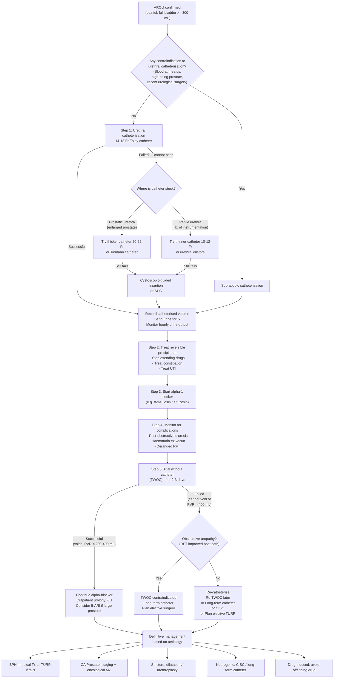

## Management of Acute Retention of Urine

The management of AROU follows a clear temporal sequence: **emergency decompression first, then identify and treat the cause, then plan definitive management to prevent recurrence.** Let's walk through each phase.

---

### 1. Management Algorithm — Overview

---

### 2. Step 1 — Emergency Bladder Decompression

This is the **immediate priority**. A patient in AROU is in pain, and prolonged distension damages the detrusor and can cause bilateral hydronephrosis with post-renal AKI. ***Immediate bladder decompression*** is required [2][3][4][5].

#### 2.1 Urethral Catheterisation (First-Line)

***Urethral catheterisation is the first-line method of bladder decompression*** [2][3][5].

**Catheter selection** [4][2][3]:

| Patient | Size | Rationale |
|---|---|---|
| ***Males*** | ***14–18 Fr*** (start with 14 Fr) | Male urethra is longer (~20 cm) and passes through the prostate; smaller catheters are more comfortable and less traumatic |
| ***Females*** | ***12–14 Fr*** | Shorter urethra (~4 cm); smaller catheters suffice |

> **What does "Fr" mean?** French gauge (Fr) = circumference of the catheter in millimetres. So 14 Fr = ~4.7 mm diameter. Larger Fr = stiffer catheter.

**Procedure** (step-by-step) [2][3][5]:

1. **Consent** — explain the procedure to the patient
2. **Aseptic technique** — ***clean the patient's genital area with aqueous hibitane (chlorhexidine)***, drape surrounding areas [2][3]
3. **Intraurethral local anaesthesia** — ***apply xylocaine (lidocaine) jelly around the meatal opening → milk the jelly down the urethra → wait 5 minutes*** [2][3] (this numbs the urethra and lubricates it)
4. **Insertion** — ***use forceps to hold the 14 Fr Foley's catheter → insert all the way down using no-touch technique*** [2][3] (no-touch = the catheter shaft never touches non-sterile surfaces)
5. **Confirm placement** — observe for urine flow from the catheter
6. **Fixation** — ***inject 10 mL of water (WFI) into the balloon → withdraw catheter until resistance is encountered*** [2][3] (the inflated balloon sits at the bladder neck, holding the catheter in place)
7. **Connect to drainage bag** — record the first catheterised volume

**First catheterised volume interpretation** [4]:
- ***Volume > 500 mL indicates genuine AROU***
- ***Volume > 1000 mL indicates possible chronic retention of urine***

**Contraindications to urethral catheterisation** [2][3][4][5]:

| Type | Contraindications | Why |
|---|---|---|
| ***Absolute*** | ***Urethral injury*** — signs: ***blood at urethral meatus, high-riding prostate*** on DRE [2][3][5] | Passing a catheter through a disrupted urethra can create a false passage, worsen the injury, and convert a partial tear into a complete transection |
| ***Relative*** | ***Recent urological surgery*** (radical prostatectomy, urethral reconstruction), ***presence of artificial sphincter*** [4] | Risk of disrupting the surgical repair or device |
| ***Relative*** | ***Acute prostatitis*** [4] | Risk of bacteraemia/sepsis from instrumentation through infected tissue |
| ***Relative*** | ***Urethral stricture*** [4] | Risk of false passage; may need smaller catheter or specialist guidance |

<Callout title="What If the Catheter Won't Pass?" type="idea">
This is a common clinical scenario. The approach depends on WHERE the catheter gets stuck [5]:

| ***Situation*** | ***Likely cause*** | ***Management*** |
|---|---|---|
| ***Catheter stuck at prostatic urethra*** | ***Enlarged prostate (BPH)*** | ***Use a thicker catheter (20–22 Fr)*** — stiffer, less likely to coil; or ***Tiemann catheter*** (curved tip designed for BPH) [5] |
| ***Catheter stuck proximally in penile urethra, Hx of instrumentation/TURP*** | ***Urethral stricture*** | ***Use a thinner catheter (10–12 Fr)*** to negotiate the narrow segment; or ***urethral dilators*** [5] |
| Still fails | — | ***Cystoscopic-guided Foley insertion*** or ***suprapubic catheterisation (SPC)*** [5] |

**Why a thicker catheter for BPH?** It seems counterintuitive — wouldn't a thinner tube be easier to pass? No: in BPH, the enlarged prostate creates a tortuous channel. A thin, floppy catheter tends to coil up and kink in the prostatic urethra. A thicker catheter is stiffer and maintains its course through the channel.

**Why a thinner catheter for stricture?** A stricture is a narrow segment. You need a smaller-diameter catheter to physically fit through the narrowed lumen.
</Callout>

#### 2.2 Suprapubic Catheterisation (SPC)

***SPC is indicated when urethral catheterisation has failed or is contraindicated*** [2][3][4][5].

**Indications** [2][3]:
- ***Failed urethral catheterisation***
- ***History of urethral trauma (e.g. straddle injury)***
- ***Long-term bladder drainage expected ( > 3 weeks)*** — SPC is more comfortable, avoids urethral trauma, and allows trial of voiding without removing the catheter

**Procedure** [2][3]:
1. ***Local anaesthesia injected 2 finger-breadths above the pubic symphysis***
2. ***Small incision made in skin and fascia***
3. ***Insert trocar-type suprapubic tube → catheter advanced over the trocar → sutured in place***
4. ***Look for gush of urine*** — confirms correct placement

**Contraindications to SPC** [2][3][4]:
- ***Non-distended bladder*** — if the bladder is not full and palpable, you risk missing it entirely and injuring surrounding structures
- ***Uncorrected bleeding tendency*** — risk of haemorrhage
- ***Known or suspected urothelial carcinoma*** — risk of tumour seeding along the catheter tract

**Complications of SPC** [2][3]:
- ***Bowel perforation*** — if the trocar overshoots or bowel loops are interposed (especially in patients with previous abdominal surgery causing adhesions)
- ***Rectal injury (overshooting)***
- ***Haematuria***
- Wound infection

**Advantages of SPC over urethral catheter** [4]:
- Avoids urethral trauma and stricture formation
- Prevents periurethral abscess
- Reduces risk of catheter-associated UTI (CAUTI)
- Allows trial of voiding: patient can attempt to void per urethra while the SPC is clamped — if successful, the SPC can be removed; if not, it can be unclamped to drain the bladder again

#### 2.3 Catheter Types Summary

| Type | Duration | Material | When to Use |
|---|---|---|---|
| **Indwelling urethral** (Foley) | ***Short-term < 3 weeks*** [4] | Latex (max 2 weeks) or Silicone (max 4 weeks) [4] | First-line for AROU |
| **Intermittent** (CIC/CISC) | Repeated as needed | Single-use PVC | Neurogenic bladder; chronic retention; post-TWOC failure if patient can self-catheterise |
| **Suprapubic** | ***Long-term drainage*** [4] | Silicone | Failed urethral, urethral trauma, long-term drainage > 3 weeks |
| **3-way Foley** | As needed | — | ***Clot retention / haematuria*** — allows continuous bladder irrigation [4] |

---

### 3. Step 2 — Treat Reversible Precipitants

After decompression, immediately address any identifiable precipitating cause [5]:

| Precipitant | Management | Rationale |
|---|---|---|
| ***Offending drugs*** | ***Stop sympathomimetics, anticholinergics, opioids*** | Removes the pharmacological cause of ↑ outlet resistance or ↓ detrusor contraction |
| ***Constipation*** | ***Fleet enema, disimpaction, laxatives*** [5] | Loaded rectum compresses prostatic urethra |
| ***UTI*** | Appropriate antibiotics based on C/ST | UTI causes urethral oedema and pain → reflex inhibition of voiding |
| Post-GA/immobility | Mobilise patient, wait for anaesthetic to wear off | Detrusor function recovers as anaesthesia clears |
| Painful perianal conditions | Treat thrombosed haemorrhoids, drain perianal abscess | Removes reflex inhibition |

> **Why treat these first?** Because if the precipitant was the sole cause of AROU (e.g. a patient on a new cold medication containing pseudoephedrine), removing it may be all that is needed — the patient may void successfully on TWOC without needing surgery.

---

### 4. Step 3 — Start α₁-Adrenergic Blocker

***Prescribe an alpha blocker*** before attempting TWOC [5]. This is the single most important pharmacological intervention in the acute setting.

#### 4.1 α₁-Adrenergic Blockers

**Mechanism:** α₁-adrenergic receptors are concentrated in the smooth muscle of the prostate and bladder neck. Blocking these receptors → ***relaxes smooth muscles in the prostate and bladder neck*** → ↓ dynamic component of BOO → ↓ outlet resistance → easier to void [5].

"α₁-blocker" literally means: blocking the α₁ receptor that would otherwise cause smooth muscle contraction.

**Drug selection** [5]:

| Subtype | Drug Examples | Key Properties | Side Effects |
|---|---|---|---|
| ***Non-selective α₁-blockers*** | ***Prazosin (Minipress), Terazosin (Hytrin), Doxazosin (Cardura), Alfuzosin (Xatral)*** [5] | Block all α₁ subtypes (α₁A, α₁B, α₁D) → also affect vascular smooth muscle | ***More orthostatic hypotension, nasal congestion, dizziness, tiredness*** [5] (because α₁B in blood vessels is also blocked → vasodilation → postural drop) |
| ***Selective α₁A-blockers*** | ***Tamsulosin (Harnal), Silodosin (Rapaflo)*** [5] | Selectively block ***α₁A subtype*** (predominant in prostate/bladder neck) → fewer vascular side effects | ***More retrograde ejaculation*** [5] (α₁A mediates seminal vesicle/vas deferens contraction; blocking it → semen goes backwards into bladder during ejaculation) |

**Practical tips** [5]:
- ***To reduce side effects: slow titration, subtype-selective (α₁A), slow-release formulations***
- In AROU context: ***alfuzosin (Xatral)*** is commonly used in Hong Kong — it is a non-selective blocker but with uroselective pharmacokinetics (less postural hypotension than prazosin)
- Start the α-blocker **as soon as the catheter is in** — it takes 24–48 hours to reach full effect, so starting early means it is working by the time you attempt TWOC

<Callout title="Why α₁-Blocker Before TWOC?">
The α₁-blocker reduces the dynamic component of bladder outlet resistance. Without it, the patient's chances of voiding successfully after catheter removal are significantly lower. Multiple RCTs have shown that α₁-blocker use before TWOC increases the success rate of TWOC from ~30–40% to ~50–60%. It is standard practice to give at least 48 hours of α₁-blocker before attempting TWOC [5].
</Callout>

#### 4.2 Other Medical Therapies (Not for Acute Phase — for Subsequent Management)

These are used in the longer-term management of the underlying BPH, not in the acute emergency:

##### 5α-Reductase Inhibitors (5-ARI)

| Aspect | Detail |
|---|---|
| **Drugs** | ***Finasteride, Dutasteride*** [5] |
| **Mechanism** | ***Reduce DHT → decrease size of prostate + decrease vascularity (less bleeding) + progression prevention*** [5]. DHT (dihydrotestosterone) is the active metabolite of testosterone in the prostate, produced by 5α-reductase. Blocking this enzyme → less DHT → prostate shrinks over months |
| **Onset** | ***Slow: 3–6 months for maximum effect*** [5] — this is NOT an acute treatment |
| **Indications** | ***2nd line / in combination with α₁-blockers; preferred for larger glands ≥ 30–40 mL (TRUS) / IPSS ≥ 12*** [5] |
| **Side effects** | ***Erectile dysfunction (10%), gynaecomastia*** [5] |
| **PSA effect** | ***50% decrease in PSA: multiply PSA by 2 when screening for CA prostate*** [5] — because a smaller prostate produces less PSA; if you don't correct for this, you may miss a cancer |

##### PDE5 Inhibitors

| Aspect | Detail |
|---|---|
| **Drug** | ***Tadalafil (Cialis)*** [5] |
| **Mechanism** | PDE5 inhibition → ↑ cGMP → smooth muscle relaxation in prostate, bladder neck, and urethra; also improves blood flow. ***Exact mechanism unknown — PDE5-mediated reduction in smooth muscle and endothelial cell proliferation; increases smooth muscle relaxation and perfusion to prostate and bladder*** [4] |
| **Indication** | ***Moderate-to-severe LUTS, especially useful for patients who also have erectile dysfunction*** [2][4][5] |
| **Contraindication** | ***Avoid if using nitrates*** [5] (both cause vasodilation via cGMP → synergistic hypotension → potentially fatal) |
| **Side effects** | ***Hypotension, blue/blurred vision (cross-reaction with PDE6 in retina), hearing loss, flushing, headache, dyspepsia*** [4] |

##### Muscarinic Antagonists / β₃-Agonists (For Storage Symptoms)

| Aspect | Detail |
|---|---|
| **Drugs** | ***Anticholinergics: Oxybutynin, Solifenacin; β₃-agonist: Mirabegron*** [5] |
| **Indication** | ***Storage-predominant moderate-to-severe LUTS; residual storage symptoms after α₁-blocker/PDE5I treatment*** [2] |
| **Caution** | ***If post-void residual volume > 150 mL*** — anticholinergics can worsen retention! [2][5] |
| **β₃-agonist advantage** | ***Mirabegron does not have the same concern for urinary retention as anticholinergic medications*** [4] — it relaxes the detrusor via β₃ receptors during storage but does not impair voiding |

#### 4.3 Medical Management Summary Table (EAU Guidelines) [2]

| ***Treatment*** | ***Involves*** | ***Indications*** |
|---|---|---|
| ***Watchful waiting*** | ***Lifestyle advice only*** | ***Mild/moderate symptoms, not bothersome*** |
| ***α₁-blockers / PDE5 inhibitors*** | Relax smooth muscle | ***Moderate-to-severe LUTS (not storage-predominant); PDE5I especially useful for those with erectile dysfunction*** |
| ***5α-reductase inhibitor (5-ARI)*** | Shrink prostate | ***Moderate-to-severe LUTS + large prostate ( > 40 mL)*** |
| ***α₁-blocker + 5-ARI combination*** | Both mechanisms | ***Moderate-to-severe LUTS + ↑ risk of disease progression*** |
| ***Muscarinic blocker / β₃-agonist*** | Reduce detrusor overactivity | ***Storage-predominant moderate-to-severe LUTS; residual storage symptoms after α₁B/PDE5I; caution if PVR > 150 mL*** |

---

### 5. Step 4 — Monitor for Complications of Decompression

After catheterisation, monitor for specific complications [4][5]:

#### 5.1 Post-Obstructive Diuresis

| Aspect | Detail |
|---|---|
| **Definition** | ***Diuresis > 200 mL/hr for ≥ 2 hours that persists after decompression of the bladder*** [4][5] |
| **Mechanism** | ***Represents an appropriate attempt to excrete excess fluid and solutes (urea, sodium) retained during the period of obstruction*** [4]. The kidneys were under back-pressure → accumulated solutes act as osmotic diuretic once obstruction is relieved → massive diuresis |
| **Risk** | ***Primarily a problem of chronic (not acute) urinary retention*** [4] — because chronic obstruction leads to more solute/fluid accumulation and more tubular damage (impaired concentrating ability) |
| **Monitoring** | Hourly urine output (Q1H); daily weight; electrolytes (Na⁺, K⁺) |
| **Management** | ***Patients usually can manage the increase in urine output by increasing oral fluid intake*** [4]. ***Isotonic saline replacement is indicated if patients are unable to increase fluid intake*** [4] (e.g. elderly, confused, NBM). Replace ~50–75% of hourly urine output with IV 0.9% NaCl |
| **Key rule** | ***Do NOT remove the Foley catheter during post-obstructive diuresis*** — it may lead to hydronephrosis [4] |

<Callout title="Post-Obstructive Diuresis — When to Worry" type="error">
Most post-obstructive diuresis is **physiological** — the body is simply getting rid of excess fluid. It becomes **pathological** when it persists beyond 48–72 hours or when the patient becomes haemodynamically unstable (dehydration, hypotension, electrolyte disturbances). The danger is **over-replacement** — if you match urine output mL-for-mL with IV fluids, you perpetuate the diuresis. Replace **50–75%** of urine output, not 100%.
</Callout>

#### 5.2 Other Complications of Decompression

| Complication | Mechanism | Management |
|---|---|---|
| ***Haematuria (haemorrhage ex vacuo)*** | ***Transient haematuria due to mucosal disruption*** [5] — when the overdistended bladder suddenly decompresses, the collapsed mucosa bleeds from small mucosal vessels | Usually self-limiting; continuous bladder irrigation if persistent; 3-way catheter if clot retention develops |
| ***Transient hypotension*** | Sudden decompression of a large bladder → release of sympathetic tone → vasovagal response; also ↓ intra-abdominal pressure → venous pooling in abdomen | IV fluids; gradual decompression (clamp catheter intermittently — though evidence for this is debated) |
| ***Urethral stricture*** | Traumatic catheterisation → urethral injury → fibrosis | Prevent by using appropriate technique and catheter size |
| ***UTI / CAUTI*** | Foreign body (catheter) in the urinary tract → biofilm formation → bacterial colonisation | Maintain closed drainage system; remove catheter as soon as possible; daily reassessment of catheter need |

---

### 6. Step 5 — Trial Without Catheter (TWOC)

***TWOC is the pivotal step that determines whether the patient can void independently or needs further intervention*** [5].

**Timing:** Usually attempted ***after 2–3 days*** of catheter drainage + α₁-blocker therapy [4][5].

**Procedure** [5]:
1. Remove the catheter (usually in the morning — allows the whole day to observe voiding)
2. Patient attempts to void
3. **Observe urine output** — patient should void within 4–6 hours
4. ***Perform post-void bladder scan***

**Interpretation** [5]:

| Outcome | Criteria | Action |
|---|---|---|
| **TWOC successful** | Patient voids spontaneously; PVR < 200–400 mL | ***Continue alpha-blocker; outpatient urology follow-up; consider 5-ARI if large prostate*** |
| **TWOC failed** | Patient cannot void; or PVR > 400 mL | ***Re-catheterise*** [5] → options: re-TWOC later, long-term Foley, CISC, or plan elective surgery (TURP) |

**Contraindication to TWOC** [5]:
- ***TWOC is contraindicated if obstructive uropathy is present*** (i.e. ***RFT improved after Foley insertion***) — this means the obstruction was causing bilateral hydronephrosis and post-renal AKI. Removing the catheter would allow back-pressure to recur and damage the kidneys again. These patients need long-term catheterisation until definitive surgery.

> **Why does improved RFT after catheterisation contraindicate TWOC?** If creatinine drops significantly after the catheter is inserted, it proves that the obstruction was causing renal impairment. Removing the catheter (TWOC) risks re-obstruction → re-accumulation of back-pressure → further renal damage. These patients should keep the catheter in situ until definitive surgery (e.g. TURP) is arranged.

---

### 7. Step 6 — Definitive Management (Cause-Specific)

#### 7.1 BPH — The Most Common Scenario

##### A. Conservative / Watchful Waiting [2]
- ***Lifestyle advice only: avoid caffeine/tea, avoid drinking water a few hours before sleep, double voiding, avoid constipation***
- ***Indication: mild/moderate symptoms, not bothersome***

##### B. Medical Therapy (see Section 4 above)

##### C. Minimally Invasive Therapies [5]

| ***Therapy*** | ***Mechanism*** |
|---|---|
| ***Thermotherapy: HIFU, TUMT (transurethral microwave therapy)*** | Heat-induced tissue necrosis |
| ***UroLift*** | ***Implants to hold different parts of the prostate away from the prostatic urethra*** — mechanical opening |
| ***Steam treatment (Rezūm)*** | ***Induce coagulative necrosis*** of prostatic tissue using water vapour |
| ***Prostatic artery embolisation (PAE)*** | ***Reduce part of blood supply to the prostate*** → ischaemic shrinkage |

##### D. Surgical Management [2][4][5]

***Indications for surgery*** [2][4]:
- ***Absolute indication: complications of BPH*** — ***refractory AROU (failed TWOC), bladder stones, recurrent UTI, obstructive uropathy*** [2]
- ***Relative indication: bothersome symptoms despite medical treatment*** [2]
- ***Recurrent haematuria*** [4]
- ***Renal insufficiency secondary to BPH*** [4]

**Timing:** ***Elective TURP 4–6 weeks after AROU (lower intra-operative risk)*** [5] — operating on an acutely inflamed, congested prostate carries higher bleeding risk.

| ***Procedure*** | ***Prostate Size*** | ***Details*** |
|---|---|---|
| ***TUIP (Transurethral incision of prostate)*** | ***Small prostate < 30 mL + no middle lobe*** [2] | Longitudinal incision widens bladder neck without tissue removal; ↓ morbidity |
| ***TURP (Transurethral resection of prostate)*** — ***gold standard*** | ***Moderate prostate 30–80 mL*** [2] | Resectoscope scrapes tissue under direct vision; monopolar or bipolar |
| ***Transurethral enucleation (HoLEP / ThuLEP)*** | ***Large prostate > 80 mL*** [2] | Laser enucleation + morcellation; suitable for very large prostates where TURP would take too long |
| Ablative techniques (PVP / Green Laser) | Variable | ***Less bleeding, no histological specimen, ↓ durability compared to TURP; especially useful in patients with bleeding tendency or poor operative risk*** [2] |

##### TURP — Detailed Procedure and Complications [4][5]

**Procedure** [4][5]:
- ***Spinal anaesthesia, lithotomy position***
- ***Cystoscopy first to inspect bladder***
- **Monopolar TURP:** ***Resectoscope loaded with monopolar diathermy loop inserted into the bladder; continuous irrigation using non-conductive glycine solution*** (to distend the bladder and wash away blood and tissue) [4]
  - ***Glycine is better than distilled water as non-conductive irrigant since it causes less TUR syndrome***
  - ***Saline CANNOT be used for monopolar resection because it is a good conductor of electricity, diffuses power and does not allow cutting or cauterisation*** [4]
- **Bipolar TURP:** ***Saline is used as the irrigant, which eliminates the risk of hyponatremia in TUR syndrome*** [4]; more expensive; slower
- Post-operatively: ***3-way Foley catheter post-op to irrigate bladder with NS to avoid clot retention*** [5]

**Complications of TURP** [4][5]:

| Complication | Mechanism / Detail |
|---|---|
| ***Bleeding (haematuria)*** | ***Secondary to trauma or infection; bleeding requiring blood transfusion ~1%*** [4] |
| ***TUR syndrome (Post-prostatectomy syndrome)*** | ***Hyponatremia due to systemic absorption of hypotonic irrigating fluid (glycine) used in monopolar TURP*** [4][5] |
| ***Retrograde ejaculation*** | ***70–80% due to resection of the bladder neck*** [5] — semen enters the bladder instead of being expelled. This is the most common long-term complication |
| ***Urethral stricture*** | Due to urethral instrumentation [5] |
| ***Incontinence*** | ***1%: urge incontinence (early) / stress incontinence (late)*** [5] |
| ***Erectile dysfunction*** | Nerve damage during resection |
| ***Perforation*** | ***Can form fistula*** [5] |

<Callout title="TUR Syndrome — Must-Know for Exams" type="error">
***TUR syndrome*** is a potentially life-threatening complication of monopolar TURP.

**Pathophysiology:** ***Dilutional hyponatremia + fluid overload + glycine toxicity*** [5]. During monopolar TURP, glycine irrigant is absorbed through open prostatic venous sinuses into the systemic circulation → dilutes serum sodium → cerebral oedema.

**Risk factors:** ***Long operating time, massive prostate*** [5]

**Signs/symptoms:** ***Nausea (first symptom), confusion, cerebral oedema, visual disturbance*** [5] (glycine is an inhibitory neurotransmitter → visual cortex toxicity → transient blindness)

**Management:** ***Manage as hyponatremia (electrolytes, serum osmolality, volume status), hypertonic saline*** [5]

**Prevention:** ***Use bipolar TURP (NS as irrigating fluid); limit glycine volume < 1 L and irrigation pressure < 60 mmHg*** [5]
</Callout>

#### 7.2 Other Aetiologies — Definitive Management

| Aetiology | Definitive Management |
|---|---|
| **CA Prostate** | Staging workup (PSA after 4–6 weeks, MRI prostate, bone scan) → radical prostatectomy / radiotherapy / hormonal therapy depending on stage |
| **Urethral stricture** | Urethral dilatation, optical urethrotomy, or open urethroplasty |
| **Clot retention** | Bladder washout / irrigation with 3-way catheter; treat underlying cause of haematuria; cystoscopic clot evacuation if large clot burden |
| **Bladder/Urethral stone** | Cystolitholapaxy (endoscopic stone fragmentation) or open cystolithotomy |
| **Neurogenic bladder** | ***Clean intermittent self-catheterisation (CISC)*** — the gold standard for long-term management; ± α-blocker; ± botulinum toxin to sphincter for DSD |
| **Drug-induced** | Avoid the offending drug permanently; counsel about OTC cold medications |
| **Post-operative** | Expectant management — detrusor function usually recovers within days; CISC if persistent |

#### 7.3 Long-Term Catheterisation Options (When Surgery Is Not Feasible)

For patients unfit for surgery or who decline it [5]:

| Option | Detail |
|---|---|
| ***Long-term Foley catheter*** | Changed every 4–6 weeks; risk of CAUTI, encrustation, urethral erosion |
| ***Suprapubic catheter*** | More comfortable for long-term use; less urethral damage |
| ***Clean intermittent self-catheterisation (CISC)*** | Patient self-catheterises 4–6 times daily; lowest infection rate; preserves bladder cycling; requires patient dexterity and motivation |
| ***Metallic stent*** | ***Temporary for very unfit patients*** [5] — a mesh stent placed in the prostatic urethra to hold it open; temporary measure only |

---

### 8. Special Situation: Management of Obstructive Uropathy / Post-Renal AKI

If AROU has caused bilateral hydronephrosis with deranged RFT [7][11]:

1. **Catheter decompression** is both diagnostic and therapeutic — if RFT improves after catheterisation, it confirms post-renal AKI
2. **Monitor for post-obstructive diuresis** (more likely in this setting)
3. **TWOC is contraindicated** — keep catheter in situ until definitive surgery
4. **If upper tract drainage is needed** (e.g. ureteric obstruction causing hydronephrosis):

| ***Option*** | ***Preferred When*** | ***Advantages*** |
|---|---|---|
| ***Percutaneous nephrostomy (PCN)*** | ***Tumour obstruction; infective cases (drain pus); monitoring U/O*** [5] | ***Quicker access, higher success rate, access for anterograde pyelogram*** |
| ***JJ stent*** | ***Acute stone obstruction; less dilated system; bleeding tendency*** [5] | ***More convenient, no prone positioning or sedation needed*** |

---

<Callout title="High Yield Summary">

**Management of AROU — the key steps:**

1. **Immediate:** Urethral catheterisation (14–18 Fr Foley) — this is BOTH treatment AND diagnosis
2. **Contraindications to urethral catheter:** blood at meatus, high-riding prostate (urethral injury) → SPC instead
3. **If catheter won't pass:** BPH → thicker catheter (20–22 Fr) or Tiemann; Stricture → thinner catheter (10–12 Fr); Still fails → cystoscopic-guided or SPC
4. **SPC contraindications:** non-distended bladder, bleeding tendency, urothelial CA
5. **After decompression:** treat precipitants (stop drugs, treat constipation/UTI), start α₁-blocker, monitor for post-obstructive diuresis
6. **Post-obstructive diuresis:** UO > 200 mL/hr for ≥ 2h; replace 50–75% with IV NaCl; do NOT remove catheter
7. **TWOC** after 2–3 days on α₁-blocker; contraindicated if obstructive uropathy (RFT improved post-cath)
8. **TWOC fails → re-catheterise → options:** re-TWOC, CISC, long-term catheter, elective TURP
9. **TURP indications (absolute):** failed TWOC / recurrent AROU, bladder stones, recurrent UTI, obstructive uropathy, refractory LUTS
10. **TURP complication to know:** TUR syndrome = dilutional hyponatraemia + fluid overload + glycine toxicity → prevented by bipolar TURP
11. **PSA:** do NOT check acutely — wait 4–6 weeks
12. **Elective TURP:** 4–6 weeks after AROU (lower intra-op risk)

</Callout>

---

<ActiveRecallQuiz
  title="Active Recall - Management of AROU"
  items={[
    {
      question: "What are the contraindications to urethral catheterisation in AROU, and what do you do instead?",
      markscheme: "Absolute: urethral injury (blood at urethral meatus, high-riding prostate on DRE). Relative: recent urological surgery (radical prostatectomy, urethral reconstruction), acute prostatitis, urethral stricture. If contraindicated or failed, proceed to suprapubic catheterisation (SPC)."
    },
    {
      question: "A Foley catheter will not pass into the bladder. The patient has known BPH. What catheter change should you try first, and why?",
      markscheme: "Use a thicker catheter (20-22 Fr) or a Tiemann catheter (curved tip). In BPH, the enlarged prostate creates a tortuous prostatic urethra; a thin floppy catheter coils up, while a thicker stiffer catheter maintains its course. If history of instrumentation/stricture instead, use a thinner catheter (10-12 Fr)."
    },
    {
      question: "What is post-obstructive diuresis, when is it most likely, and how should it be managed?",
      markscheme: "Definition: urine output >200 mL/hr for >=2 hours persisting after decompression. Most likely in chronic retention (accumulated solutes act as osmotic diuretic). Management: monitor hourly UO and electrolytes; patients usually manage with increased oral intake; if unable, replace 50-75% of UO with IV 0.9% NaCl. Do NOT remove the catheter."
    },
    {
      question: "When is TWOC contraindicated after AROU?",
      markscheme: "When obstructive uropathy is present, evidenced by RFT improvement after Foley insertion. This means the obstruction was causing post-renal AKI. Removing the catheter risks re-obstruction and further renal damage. The catheter should remain until definitive surgery."
    },
    {
      question: "List the absolute indications for surgical management (TURP) in BPH.",
      markscheme: "Complications of BPH: (1) refractory AROU / failed TWOC, (2) bladder stones, (3) recurrent UTI, (4) obstructive uropathy / renal insufficiency secondary to BPH, (5) recurrent haematuria, (6) bothersome LUTS refractory to medical treatment."
    },
    {
      question: "What is TUR syndrome? Explain its pathophysiology, key symptoms, and prevention.",
      markscheme: "Pathophysiology: systemic absorption of hypotonic glycine irrigant during monopolar TURP through open prostatic venous sinuses, causing dilutional hyponatraemia + fluid overload + glycine toxicity. Symptoms: nausea (first), confusion, cerebral oedema, visual disturbance. Prevention: use bipolar TURP (saline irrigant), limit glycine volume <1 L, irrigation pressure <60 mmHg, minimise operating time."
    }
  ]}
/>

---

## References

[1] Lecture slides: GC 180. Benign prostatic hyperplasia, bladder outlet obstruction and urinary retention.pdf (p54)
[2] Senior notes: Ryan Ho Urogenital.pdf (p162, p167, p173, p176)
[3] Senior notes: Ryan Ho Fundamentals.pdf (p347, p349, p352)
[4] Senior notes: felixlai.md (Urinary catheterisation section; AROU treatment section; BPH treatment section)
[5] Senior notes: maxim.md (AROU section; BPH management section; TURP section)
[7] Senior notes: Ryan Ho Critical Care.pdf (p26 — AKI management)
[11] Senior notes: Ryan Ho Diagnostic Radiology.pdf (p83 — PCN)
