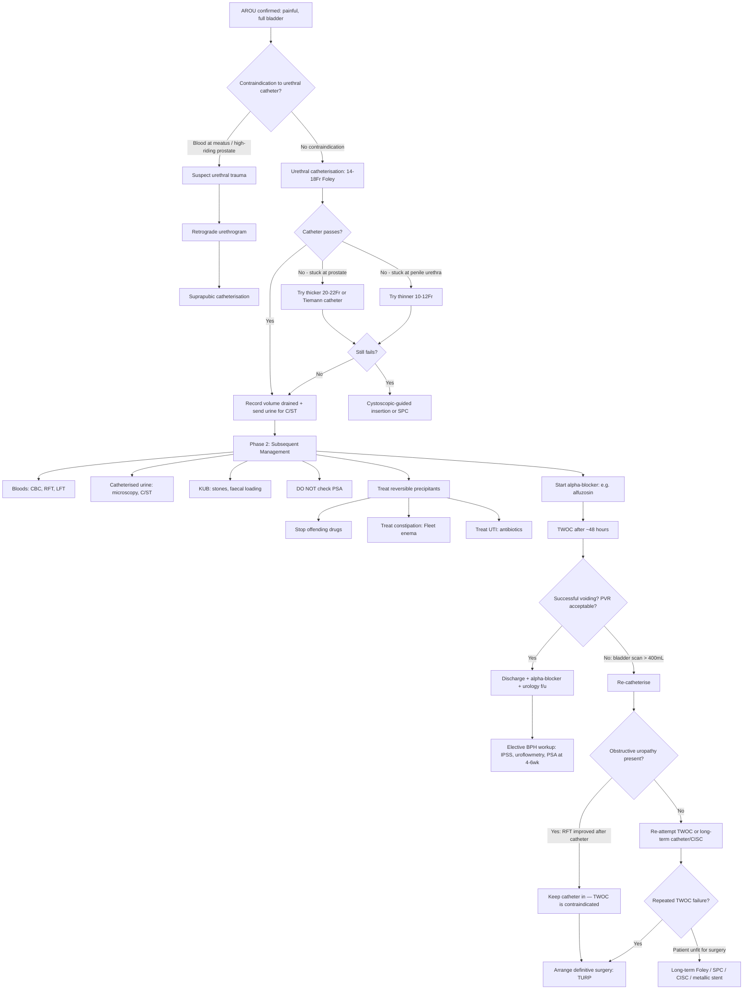
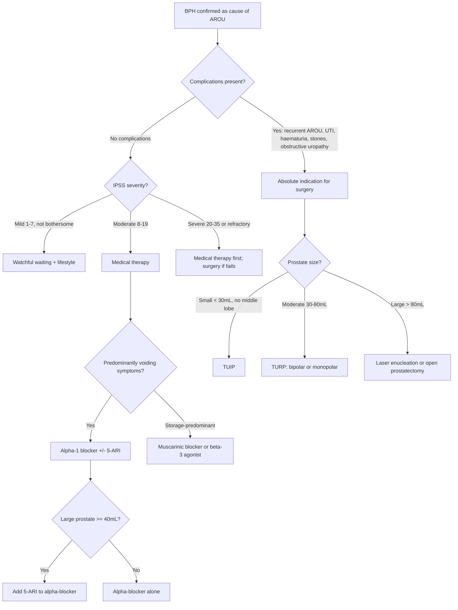

## Management Algorithm and Treatment Modalities

---

### 1. Overview — Management Philosophy

The management of AROU has **two distinct phases** that must be understood sequentially:

1. **Phase 1 — Acute management**: Relieve the patient's distress by decompressing the bladder. This is an emergency. The patient is in pain, the bladder is at risk of further damage, and post-renal AKI may be developing. You decompress first, ask questions later.

2. **Phase 2 — Subsequent management**: Once the catheter is in and the patient is comfortable, you work out the underlying cause, treat reversible precipitants, and plan for either trial without catheter (TWOC) or definitive surgical management.

***Clinical Management of Urinary Retention*** [1] — the lecture dedicates a specific section to this.

---

### 2. Phase 1: Acute Bladder Decompression

This is the **immediate priority**. Think of it like chest compressions in a cardiac arrest — do it first, everything else follows.

#### 2.1 Urethral Catheterisation (First-Line)

***Immediate bladder decompression by urethral catheterisation (first-line) by 14–18Fr Foley's catheter*** [2]

##### The Procedure — Step by Step [2][4]

1. **Check for contraindications** first (see below)
2. **Aseptic technique**: clean genital area with aqueous hibitane (chlorhexidine), drape surrounding areas [2][4]
3. **Intraurethral local anaesthetic**: apply xylocaine (lignocaine) jelly around meatal opening → milk jelly down urethra → wait 5 minutes for anaesthesia to take effect [2]
4. **Insertion**: use forceps to hold 14Fr Foley's catheter → ***insert all the way down*** using no-touch technique [2] — the key point is to insert the full length, especially in males with a long urethra, before inflating the balloon. If you inflate prematurely while the tip is still in the prostatic urethra, you will cause severe urethral trauma
5. **Confirm position**: observe for urine flow from the catheter
6. **Fixation**: inject ***10 mL of water*** (water for injection, NOT saline) into balloon → withdraw catheter until resistance is felt (balloon sits at bladder neck) [2]
7. **Connect** to urine drainage bag
8. **Record the volume drained** — this is diagnostically important:
   - ***Volume > 500 mL indicates genuine AROU*** [3]
   - ***Volume > 1000 mL indicates possible chronic retention of urine*** [2][3]
9. **Send catheterised urine** for biochemistry, microscopy, C/ST [2]
10. **Monitor hourly urine output** (Q1H) — important for detecting post-obstructive diuresis [3]

##### Catheter Size Selection

| Sex | Standard Size | Rationale |
|---|---|---|
| ***Males*** | ***14 or 16 Fr*** [3] (range 14–18Fr [2]) | Male urethra is longer (~20 cm) and passes through the prostate; 14Fr is comfortable yet large enough for adequate drainage |
| ***Females*** | ***12 or 14 Fr*** [3] | Female urethra is shorter (~4 cm) and wider; smaller catheter suffices |

**Catheter material** [3]:
- **Latex** = short-term use (***maximum 2 weeks***) — yellow tube
- **Silicone** = long-term use (***maximum 4 weeks***) — transparent tube

**Types of catheter** [3]:
- **Standard 2-way**: one port for urine drainage, one for balloon inflation — standard for AROU
- **3-way (triple-lumen)**: additional irrigation channel for **clot retention** — used for ***haematuria with clot formation*** to allow continuous bladder irrigation [3]

##### When Catheterisation Fails — Troubleshooting

***Failure to pass into bladder can be due to*** [2][4]:

| Situation | Likely Cause | Solution | Why It Works |
|---|---|---|---|
| ***Cannot advance past prostatic urethra*** | ***Enlarged prostate (BPH)*** | ***Use thicker catheter (20–22 Fr)*** [2][4] | A thicker catheter is **stiffer** — it has more rigidity to navigate through the compressed prostatic urethra. Think of it like a garden hose vs a limp straw — the stiffer one pushes through better |
| ***Catheter stuck proximally along penile urethra / Hx of instrumentation or TURP*** | ***Urethral stricture*** | ***Use thinner catheter (10–12 Fr)*** [2][4] | The urethral lumen is narrowed by fibrosis — a thinner catheter can squeeze through the tight segment |

**If standard troubleshooting fails** [4]:
- ***Tiemann catheter***: curved-tip catheter specifically designed for BPH — the angled tip navigates the elevated prostatic urethra
- ***Cystoscopic-guided Foley insertion***: pass a flexible cystoscope first, then railroad the catheter over a guidewire
- ***Urethral dilators***: for strictures — progressively dilate the narrowed segment
- ***Suprapubic catheterisation*** (SPC): the definitive fallback (see below)

##### Contraindications to Urethral Catheterisation

| Type | Contraindication | Rationale |
|---|---|---|
| ***Absolute*** | ***Urethral injury*** — signs: ***blood at urethral meatus, high-riding prostate*** on DRE [2][3][4] | Passing a catheter through an injured urethra can convert a partial tear into a complete transection → devastating complication. If you suspect urethral injury (e.g., pelvic fracture + blood at meatus), do a **retrograde urethrogram first** |
| ***Relative*** | ***Urethral stricture*** [3] | Risk of creating false passage; may need specialist guidance or SPC |
| ***Relative*** | ***Recent urinary tract surgery***: radical prostatectomy, urethral reconstruction, presence of artificial sphincter [3] | Fresh anastomoses can be disrupted by catheter passage → urethral damage, incontinence |
| ***Relative*** | **Acute prostatitis** [3] | Catheterisation through an acutely inflamed prostate is painful and may worsen infection; SPC is preferred in severe prostatitis |

#### 2.2 Suprapubic Catheterisation (SPC)

***Suprapubic catheterisation (SPC)*** [2]

***Indications*** [2][3]:
- ***Failed urethral catheterisation***
- ***History of urethral trauma (e.g., straddle injury)***
- ***Long-term bladder drainage expected ( > 3 weeks)*** [2]

**Why SPC over long-term urethral catheter?** [3]:
- Prevents urethral trauma and stricture formation
- Prevents periurethral abscess
- Prevents urinary sphincter dysfunction leading to incontinence
- Reduces catheter-associated UTI (CAUTI)
- Allows assessment of patient's ability to void before removing catheter (can clamp SPC and let patient try to void naturally through the urethra)

***Procedure*** [2]:
- ***LA injected 2 finger-breadths (2FB) above pubic symphysis*** (~2 fingers above pubic symphysis [4])
- ***Small incision made in skin/fascia → insert trocar-type suprapubic tube → catheter advanced over trocar → sutured in place***
- ***Look for gush of urine*** [2]

***Contraindications to SPC*** [2][3]:
- ***Non-distended bladder*** — if the bladder is empty/small, you risk missing it entirely and perforating bowel instead
- ***Uncorrected bleeding tendency*** — procedure involves a skin incision and puncture through the abdominal wall
- ***Known or suspected urothelial cancer*** — risk of tumour seeding along the catheter tract

***Complications of SPC*** [2]:
- ***Bowel perforation*** (if bladder not adequately distended and bowel loops interposed)
- ***Rectal injury*** (overshooting)
- ***Haematuria***
- Wound infection

<Callout title="SPC Safety Rule" type="error">
**Never perform SPC on a non-distended bladder.** The bladder must be palpable and confirmed on ultrasound to be adequately full. If the bladder is empty, the SPC trocar will pass straight through an empty pelvic space and into bowel or rectum.
</Callout>

---

### 3. Phase 2: Subsequent Management

Once the catheter is in and the patient is stabilised, the management pivots to:
1. Treat reversible precipitants
2. Start medical therapy (α-blocker)
3. Plan trial without catheter (TWOC)
4. Address definitive management of the underlying cause

#### 3.1 Treat Reversible Precipitants

***Treat reversible causes: stop offending drugs, treat constipation (e.g., Fleet enema) and UTI*** [4]

| Precipitant | Management |
|---|---|
| **Offending drugs** (cold meds, anticholinergics, opioids) | Stop or switch medications |
| **Constipation/faecal impaction** | Fleet enema, lactulose, manual disimpaction if needed |
| **UTI** | Appropriate antibiotics based on C/ST results |
| **Immobility** | Mobilise patient as early as possible |
| **Post-operative (anaesthesia-related)** | Often self-resolving once anaesthetic wears off; TWOC usually successful |

#### 3.2 Medical Therapy — Start an Alpha-Blocker

***Prescribe alpha-blocker (e.g., Xatral/alfuzosin) + trial wean-off catheter (TWOC) later*** [4]

The rationale: α₁-adrenergic receptors are abundant in the smooth muscle of the prostate stroma and bladder neck. Blocking these receptors relaxes the smooth muscle → reduces the **dynamic component** of bladder outlet obstruction → makes it easier for the detrusor to overcome the remaining obstruction when the catheter is removed.

Starting an α-blocker **before TWOC** significantly improves the success rate of TWOC — studies show ~50–60% success with α-blocker vs ~30–40% without.

#### 3.3 Trial Without Catheter (TWOC)

***TWOC*** is the pivotal management decision after the acute episode. The catheter is typically left in for ***~2 days*** [3], during which time the α-blocker takes effect, precipitants are corrected, and the overdistended detrusor has time to recover some contractile function.

**Process** [4]:
1. Remove the catheter (usually in the early morning to allow the whole day for voiding assessment)
2. ***Observe urine output and perform post-void bladder scan*** [4]
3. Patient attempts to void naturally
4. Check post-void residual (PVR) by bladder scan

**Outcomes**:

| Outcome | Next Step |
|---|---|
| **Successful TWOC** (patient voids with acceptable PVR < 200–400 mL) | Discharge with α-blocker; follow-up in urology OPD for definitive BPH management |
| ***Re-catheterise if bladder scan > 400 mL*** [4] | ***Re-TWOC / long-term Foley / clean intermittent self-catheterisation (CISC)*** [4] |
| **Failed repeated TWOC** | Arrange definitive surgical intervention (e.g., TURP) |

***TWOC is contraindicated if obstructive uropathy present (RFT improves after Foley insertion)*** [4] — if the creatinine drops significantly after catheterisation, this means the obstruction was causing bilateral back-pressure → post-renal AKI → upper tract damage. Removing the catheter would re-obstruct and cause further renal injury. These patients need to keep the catheter in until definitive surgery.

<Callout title="Why Not Just Remove the Catheter Immediately?">
The overdistended detrusor needs time to recover. Remember, overdistension stretches actin-myosin beyond optimal overlap → ineffective contraction. Leaving the catheter in for 48–72 hours (while on an α-blocker) gives the muscle fibres time to recover their length-tension relationship. Additionally, α-blockers need ~48 hours to reach therapeutic effect.
</Callout>

#### 3.4 Long-Term Catheter Options (if TWOC Fails)

If the patient fails TWOC and is not fit for surgery (or while awaiting surgery):

| Option | Description | Preferred When |
|---|---|---|
| ***Long-term indwelling Foley catheter*** | Indwelling urethral catheter, changed every 4–6 weeks | Short-term bridging; patient preference |
| ***Suprapubic catheter (SPC)*** | Preferred for ***long-term drainage > 3 weeks*** [2] | Better for long-term use; fewer urethral complications |
| ***Clean intermittent self-catheterisation (CISC)*** | Patient self-catheterises 4–6× daily using a clean single-use catheter | Gold standard for long-term bladder management in neurogenic bladder; requires adequate dexterity and cognition |

---

### 4. Definitive Management of the Underlying Cause — BPH

Since BPH accounts for ***53%*** of AROU [1], BPH management is the most commonly tested definitive treatment.

#### 4.1 Conservative / Watchful Waiting [7]

***Indications: symptoms do not bother patient; mild/moderate symptoms, not bothersome*** [7]

***Lifestyle modifications*** [3][4]:
- ***Avoid fluids prior to bedtime or before going out***
- ***Reduce consumption of caffeine and alcohol***
- ***Double voiding to empty bladder more completely***

#### 4.2 Medical Treatment

***Medical therapy indications*** [4][7]:

| Drug Class | Drug Examples | Mechanism | Indications | Key Side Effects | Contraindications/Cautions |
|---|---|---|---|---|---|
| ***α₁-adrenergic blockers (most commonly used)*** | **Non-selective**: ***prazosin (Minipress), terazosin (Hytrin), doxazosin (Cardura), alfuzosin (Xatral)*** [4] **Selective (α₁A)**: ***tamsulosin (Harnal), silodosin (Rapaflo)*** [4] | ***Relax smooth muscles in prostate and bladder neck (NOT bladder body)*** [4] → reduces dynamic obstruction → improves flow within days | ***Moderate-to-severe LUTS (not storage-predominant)*** [7] | **Non-selective**: ***more orthostatic hypotension, nasal congestion, dizziness, tiredness*** [4] **Selective (α₁A)**: ***more retrograde ejaculation*** [4] | ***To reduce side effects: slow titration, subtype-selective (α₁A), slow-release formulations*** [4] |
| ***5α-reductase inhibitors (5-ARI)*** | ***Finasteride, dutasteride*** [4] | ***Reduce DHT → decrease size of prostate + decrease vascularity (less bleeding) + progression prevention*** [4]. DHT is the active androgen that drives prostatic stromal growth; blocking its production causes prostate to shrink by ~20–30% over 6–12 months | ***Moderate-to-severe LUTS + large prostate ( ≥ 30–40 mL on TRUS) / IPSS ≥ 12*** [4] ***2nd line or in combination with α₁-blockers*** [4] | ***Erectile dysfunction (10%), gynaecomastia*** [4] ***50% decrease in PSA*** → must ***multiply PSA by 2*** when screening for CA prostate [4] | ***Slow onset: 3–6 months for maximum effect*** [4] — not useful for acute symptom relief; mainly for long-term disease modification |
| ***α₁-blocker + 5-ARI combination*** | Above drugs combined | Dual mechanism: immediate α₁-blockade + long-term prostate shrinkage | ***Moderate-to-severe LUTS + increased risk of disease progression*** [7] | Combination of above side effects | Large prostate with significant symptoms and risk factors for progression |
| ***PDE5 inhibitors*** | ***Tadalafil (Cialis)*** [4] | PDE5-mediated reduction in smooth muscle and endothelial cell proliferation; increases smooth muscle relaxation and perfusion to prostate and bladder [3] | ***Especially useful for those with erectile dysfunction*** [7]; moderate-to-severe LUTS | Hypotension, blue/blurred vision, hearing loss, flushing, headache, dyspepsia [3] | ***Avoid if using nitrate*** [4] (severe hypotension risk) |
| ***Muscarinic blockers / β₃ agonists*** | Oxybutynin, solifenacin / ***Mirabegron (β₃ agonist)*** [3] | Muscarinic blockers: block M₃ on detrusor → reduce involuntary contractions β₃ agonists: activate β₃ receptors → relax detrusor during filling | ***Storage-predominant moderate-to-severe LUTS; residual storage symptoms after α₁-blocker/PDE5I treatment*** [7] | Anticholinergics: dry mouth, constipation, **urinary retention** β₃ agonists: hypertension, UTI | ***Caution if post-void residual > 150 mL*** [7] — anticholinergics can worsen retention! ***β₃ agonist (Mirabegron) does not have the same concern for urinary retention*** as anticholinergics [3] |

<Callout title="Why α-Blockers Work Fast but 5-ARIs Take Months" type="idea">
α-blockers relax **smooth muscle** (the dynamic component) — this is like turning off a switch. The effect is almost immediate (days). 5-ARIs reduce the **physical size of the prostate** (the static component) — this requires blocking DHT-driven growth and waiting for prostate tissue to involute. Tissue remodelling takes months. This is why the two drugs are complementary: α-blockers for immediate relief, 5-ARIs for long-term disease modification.
</Callout>

#### 4.3 Minimally Invasive Therapies [4]

| Modality | Mechanism |
|---|---|
| **Thermotherapy: HIFU, TUMT** (transurethral microwave therapy) | Heat-induced coagulative necrosis of prostate tissue |
| **UroLift** | Mechanical implants that hold prostatic lobes apart, away from the urethra |
| **Steam treatment (Rezum)** | Inject water vapour into prostate → induces coagulative necrosis |
| **Prostatic artery embolisation (PAE)** | Reduce part of the blood supply to the prostate → ischaemic shrinkage |

#### 4.4 Surgical Treatment

***Indications for surgery*** [3][4][7]:

***Absolute indications (complications of BPH)*** [7]:
- ***Recurrent acute retention of urine (AROU) — failed TWOC*** [3]
- ***Recurrent urinary tract infection (UTI)*** [3]
- ***Recurrent haematuria*** [3]
- ***Renal insufficiency secondary to BPH (obstructive uropathy)*** [3]
- ***Bladder stones*** [7]

***Relative indication*** [7]:
- ***Bothersome LUTS refractory to or cannot tolerate medical treatment*** [3]

##### Transurethral Resection of Prostate (TURP) — Gold Standard [3][4][7]

***TURP decreases urinary symptom score (IPSS), decreases PVR and increases maximal urinary flow rate*** [3]

***Surgical procedure*** [3][4]:

**Monopolar TURP** [3]:
- ***Resectoscope loaded with monopolar diathermy loop is introduced into bladder***
- ***Continuous irrigation using non-conductive solution containing glycine*** is used to distend the bladder and wash away blood and tissue fragments
- ***Glycine is better than distilled water*** as non-conductive irrigant since it causes less TUR syndrome comparatively
- ***Saline solution CANNOT be used for monopolar resection because it is a good conductor of electricity, diffuses power and does not allow cutting or cauterisation of tissue*** [3]
- Strips of prostate tissue are resected under direct vision until the prostatic fibrous capsule is reached
- Prostate chips evacuated and bleeding controlled with electrocautery
- ***Post-operative: 3-way Foley to irrigate bladder with NS to avoid clot retention*** [4]

**Bipolar TURP** [3][4]:
- ***Saline is used as the irrigant in bipolar — eliminates the risk of hyponatraemia in TUR syndrome*** [3]
- ***More expensive than monopolar TURP*** [3]
- Process is slower due to smaller probe size; ***poorer haemostasis*** [7]
- ***Usually only use bipolar for larger prostates*** [7]

***Surgical modality by prostate size*** [7]:

| Prostate Size | Recommended Procedure |
|---|---|
| ***Small prostate < 30 mL + no middle lobe*** | ***TUIP (Transurethral Incision of Prostate)*** — longitudinal incision to widen bladder neck without removing tissue; lower morbidity [7] |
| ***Moderate prostate 30–80 mL*** | ***Bipolar or monopolar TURP*** [7] |
| ***Large prostate > 80 mL*** | ***Transurethral enucleation (e.g., Holmium/Thulium laser enucleation)*** [7] or open prostatectomy |

##### TURP Complications [3][4]

| Complication | Mechanism / Details | Incidence |
|---|---|---|
| **Bleeding / haematuria** | Trauma to prostatic venous sinuses; secondary infection (prostatitis) | ***Bleeding requiring transfusion: ~1%*** [3] |
| ***TUR syndrome (Post-prostatectomy syndrome)*** | ***Hyponatraemia due to systemic absorption of hypotonic irrigating fluid (glycine)*** [3][4] ***Pathophysiology: dilutional hyponatraemia + fluid overload + glycine toxicity*** [4] ***Risk factors: long operating time, e.g., massive prostate*** [4] ***Signs/symptoms: nausea (first symptom), confusion, cerebral oedema, visual disturbance*** [4] ***Management: manage as hyponatraemia (electrolytes, serum osmolality, volume status), hypertonic saline*** [4] ***Prevention: use bipolar (NS as irrigating fluid), limit volume < 1 L and irrigation pressure < 60 mmHg*** [4] | Variable |
| ***Retrograde ejaculation*** | ***70–80% — due to resection of bladder neck*** [4]; semen enters bladder instead of exiting via urethra because the bladder neck can no longer close during ejaculation | Very common |
| ***Urethral stricture*** | ***Urethral instrumentation*** [4] causes scarring | Variable |
| ***Urinary incontinence*** | ***~1%*** [3]; urge incontinence (early, due to detrusor irritability) / stress incontinence (late, due to sphincter damage) [4] |  |
| **Erectile dysfunction** | Thermal injury to neurovascular bundle adjacent to prostate | Variable |

<Callout title="TUR Syndrome — Why Monopolar TURP Is Dangerous in Large Prostates" type="error">
During monopolar TURP, the irrigant must be non-conductive (glycine). The prostatic venous sinuses are opened during resection, and glycine is absorbed directly into the bloodstream. Longer operating time (larger prostate) = more absorption = greater risk. Glycine causes: (1) dilutional hyponatraemia (water follows glycine osmotically), (2) fluid overload (absorbed volume), (3) direct neurotoxicity from glycine metabolites (ammonia → visual disturbance, confusion). **Bipolar TURP uses saline, eliminating this risk entirely**, which is why it is preferred for larger prostates [3][4][7].
</Callout>

##### Other Surgical Options [7]

| Technique | Description | Advantage | Indication |
|---|---|---|---|
| ***Transurethral enucleation (Holmium/Thulium laser)*** | Laser enucleation of adenoma → morcellation for removal | Saline irrigant (no TUR syndrome); less bleeding; effective for large prostates | ***Large prostate > 80 mL*** [7] |
| **Ablative techniques** (PVP/Green Laser, RFA, Rezum) | Tissue destruction without removal | ***Less bleeding; alternative to TURP in patients with bleeding tendency or poor operative risk*** [7]; less post-op irritative symptoms | ***No histological specimen obtained; decreased durability*** [7] |
| **Open / robotic prostatectomy** | Open surgical enucleation of adenoma via suprapubic or retropubic approach | Gold standard for very large prostates ( > 80–100 mL); complete removal | Very large prostates; failed TURP |
| ***Metallic stent*** | Temporary urethral stent to keep prostatic urethra open | Avoids surgery | ***Very unfit patients*** [4] |

---

### 5. Management of Specific Scenarios

#### 5.1 Clot Retention

- **Cause**: Severe haematuria (from BPH bleeding, bladder tumour, post-TURP) → blood clots fill bladder → outlet obstruction
- **Management**: ***3-way Foley catheter*** [3] → continuous bladder irrigation with normal saline to wash out clots → investigate and treat the source of bleeding
- If clots are too large for irrigation: manual bladder washout with bladder syringe; cystoscopy with clot evacuation if refractory

#### 5.2 Neurogenic AROU (Spinal Cord Compression)

- **Immediate**: catheterise to decompress bladder
- **Urgent**: MRI spine → if cord compression confirmed → neurosurgical decompression
- **Long-term**: clean intermittent self-catheterisation (CISC) is the gold standard for neurogenic bladder management

#### 5.3 Post-Operative AROU

- Usually self-limiting once anaesthesia wears off
- TWOC typically successful within 24–48 hours
- If recurrent: investigate for underlying BOO (may unmask subclinical BPH)

#### 5.4 Drug-Induced AROU

- Stop the offending drug
- Catheterise and TWOC after drug has been discontinued
- Usually resolves; if recurrent, investigate for underlying BPH

---

### 6. Comprehensive Management Algorithm

```mermaid
graph TD
    A["AROU confirmed: painful, full bladder"] --> B{"Contraindication to urethral catheter?"}
    B -->|"Blood at meatus / high-riding prostate"| C["Suspect urethral trauma"]
    C --> C1["Retrograde urethrogram"]
    C1 --> C2["Suprapubic catheterisation"]
    
    B -->|"No contraindication"| D["Urethral catheterisation: 14-18Fr Foley"]
    D --> E{"Catheter passes?"}
    E -->|"Yes"| F["Record volume drained + send urine for C/ST"]
    E -->|"No - stuck at prostate"| G["Try thicker 20-22Fr or Tiemann catheter"]
    E -->|"No - stuck at penile urethra"| H["Try thinner 10-12Fr"]
    G --> I{"Still fails?"}
    H --> I
    I -->|"Yes"| J["Cystoscopic-guided insertion or SPC"]
    I -->|"No"| F
    
    F --> K["Phase 2: Subsequent Management"]
    K --> K1["Bloods: CBC, RFT, LFT"]
    K --> K2["Catheterised urine: microscopy, C/ST"]
    K --> K3["KUB: stones, faecal loading"]
    K --> K4["DO NOT check PSA"]
    
    K --> L["Treat reversible precipitants"]
    L --> L1["Stop offending drugs"]
    L --> L2["Treat constipation: Fleet enema"]
    L --> L3["Treat UTI: antibiotics"]
    
    K --> M["Start alpha-blocker: e.g. alfuzosin"]
    
    M --> N["TWOC after ~48 hours"]
    N --> O{"Successful voiding? PVR acceptable?"}
    O -->|"Yes"| P["Discharge + alpha-blocker + urology f/u"]
    P --> P1["Elective BPH workup: IPSS, uroflowmetry, PSA at 4-6wk"]
    O -->|"No: bladder scan > 400mL"| Q["Re-catheterise"]
    Q --> R{"Obstructive uropathy present?"}
    R -->|"Yes: RFT improved after catheter"| S["Keep catheter in — TWOC is contraindicated"]
    S --> T["Arrange definitive surgery: TURP"]
    R -->|"No"| U["Re-attempt TWOC or long-term catheter/CISC"]
    U --> V{"Repeated TWOC failure?"}
    V -->|"Yes"| T
    V -->|"Patient unfit for surgery"| W["Long-term Foley / SPC / CISC / metallic stent"]
```

---

### 7. Elective Definitive Management Decision Tree (BPH)

***Management is guided by symptom severity (IPSS), prostate size, and presence of complications*** [4][7]:

```mermaid
graph TD
    A["BPH confirmed as cause of AROU"] --> B{"Complications present?"}
    B -->|"Yes: recurrent AROU, UTI, haematuria, stones, obstructive uropathy"| C["Absolute indication for surgery"]
    B -->|"No complications"| D{"IPSS severity?"}
    D -->|"Mild 1-7, not bothersome"| E["Watchful waiting + lifestyle"]
    D -->|"Moderate 8-19"| F["Medical therapy"]
    D -->|"Severe 20-35 or refractory"| G["Medical therapy first; surgery if fails"]
    
    F --> F1{"Predominantly voiding symptoms?"}
    F1 -->|"Yes"| F2["Alpha-1 blocker +/- 5-ARI"]
    F1 -->|"Storage-predominant"| F3["Muscarinic blocker or beta-3 agonist"]
    F2 --> F4{"Large prostate >= 40mL?"}
    F4 -->|"Yes"| F5["Add 5-ARI to alpha-blocker"]
    F4 -->|"No"| F6["Alpha-blocker alone"]
    
    C --> H{"Prostate size?"}
    H -->|"Small < 30mL, no middle lobe"| I["TUIP"]
    H -->|"Moderate 30-80mL"| J["TURP: bipolar or monopolar"]
    H -->|"Large > 80mL"| K["Laser enucleation or open prostatectomy"]
```

---

### 8. Complications of Decompression

These occur *after* catheterisation and must be anticipated and managed:

| Complication | Definition / Mechanism | Management |
|---|---|---|
| ***Post-obstructive diuresis*** | ***Diuresis > 200 mL/h for ≥ 2 hours*** [3][4] after decompression. Represents the body's attempt to excrete excess fluid, solutes (urea, Na⁺), and water retained during the period of obstruction. Also due to osmotic diuresis from accumulated urea and loss of medullary concentrating gradient. ***Primarily a problem of chronic (not acute) retention*** [3] | ***Monitor hourly urine output closely***. ***Patients usually can manage by increasing oral fluid intake*** [3]. ***Isotonic saline replacement is indicated if patients are unable to increase fluid intake*** [3]. Monitor electrolytes (risk of hyponatraemia, hypokalaemia). ***Do NOT remove Foley catheter — may lead to hydronephrosis*** [3] |
| ***Haemorrhage ex vacuo*** | ***Transient haematuria due to mucosal disruption*** [4] when the overdistended bladder suddenly decompresses. Small mucosal blood vessels that were compressed by the full bladder begin to bleed when pressure is released | Usually self-limiting; maintain catheter drainage; if persistent, consider continuous bladder irrigation with 3-way catheter |
| **Transient hypotension** [3] | Sudden decompression of a large-volume bladder → abrupt ↓ intra-abdominal pressure → venous pooling in the splanchnic bed → ↓ preload → ↓ BP. Also vagal response from relief of pain | IV fluids; gradual decompression (some advocate clamping catheter after every 500 mL and releasing — though evidence for this is debated) |
| **UTI / CAUTI** | Catheter itself is a foreign body that acts as a nidus for biofilm and bacterial colonisation | Aseptic insertion technique; remove catheter as soon as possible; avoid long-term catheterisation if possible |
| **Urethral stricture** (late) | Repeated or traumatic catheterisation causes urethral mucosal injury → fibrosis → stricture | Minimise catheter duration; use appropriate size; consider SPC for long-term |

<Callout title="Post-Obstructive Diuresis — Don't Panic, But Don't Ignore It">
Post-obstructive diuresis is expected after relieving chronic or severe acute retention. It is the kidneys' way of dumping retained solutes and water. The danger is not the diuresis itself — it is **under-replacement** leading to dehydration and electrolyte disturbance. Monitor Q1H urine output and match IV fluid replacement if the patient cannot drink enough. The diuresis typically resolves within 24–48 hours once the excess is cleared.
</Callout>

---

### 9. Management Summary — At a Glance

| Phase | Action |
|---|---|
| **Immediate** | Urethral catheterisation (14–18Fr Foley) → record volume → send urine |
| **If catheter fails** | Troubleshoot (thicker/thinner catheter, Tiemann) → SPC if all fail |
| **Post-catheterisation** | Bloods (CBC, RFT), catheterised urine (C/ST), KUB; **NOT** PSA |
| **Treat precipitants** | Stop offending drugs, treat constipation, treat UTI |
| **Start α-blocker** | Alfuzosin/tamsulosin — reduces dynamic obstruction |
| **Monitor** | Q1H urine output → watch for post-obstructive diuresis |
| **TWOC** | ~48 hours later; re-catheterise if PVR > 400 mL |
| **Failed TWOC** | Re-TWOC / long-term catheter / CISC |
| **Definitive** | Elective TURP ***4–6 weeks after AROU*** [4] (lower intra-operative risk than emergency) |
| **Ongoing BPH** | IPSS, uroflowmetry, PSA (4–6 weeks), TRUS → guide long-term management |

---

<Callout title="High Yield Summary">

1. **Acute management priority = bladder decompression** via urethral catheterisation (14–18Fr Foley); SPC if urethral route fails or is contraindicated
2. **Contraindications to urethral catheter**: blood at meatus, high-riding prostate (urethral injury); recent urological surgery; severe prostatitis
3. **SPC contraindications**: non-distended bladder, bleeding tendency, urothelial cancer
4. **Catheter troubleshooting**: stuck at prostate → thicker catheter (20–22Fr); stuck at penile urethra → thinner catheter (10–12Fr)
5. **After catheterisation**: treat reversible precipitants (drugs, constipation, UTI), start α-blocker, plan TWOC at ~48 hours
6. ***TWOC contraindicated if obstructive uropathy present*** (RFT improves after catheterisation) — keep catheter, proceed to surgery
7. **α-blockers** (alfuzosin, tamsulosin): relax prostatic smooth muscle → immediate relief; **5-ARIs** (finasteride, dutasteride): shrink prostate → 3–6 months to work
8. ***TURP indications***: recurrent AROU (failed TWOC), recurrent UTI, recurrent haematuria, renal insufficiency from BPH, bladder stones, refractory LUTS
9. ***TUR syndrome***: dilutional hyponatraemia + fluid overload + glycine toxicity; prevented by bipolar TURP (uses saline)
10. **Post-obstructive diuresis**: > 200 mL/h for ≥ 2h; monitor Q1H urine output; replace fluids if patient cannot drink
11. **Elective TURP best done 4–6 weeks after AROU** (not emergency) — lower intra-operative risk
12. **Long-term options if unfit for surgery**: long-term Foley/SPC, CISC, metallic stent

</Callout>

---

<ActiveRecallQuiz
  title="Active Recall - Management of AROU"
  items={[
    {
      question: "A 75-year-old man with AROU has a urethral catheter inserted and 1200 mL is drained. Over the next 4 hours, urine output is 300 mL/hour. What is happening, and how do you manage it?",
      markscheme: "Post-obstructive diuresis (defined as >200 mL/h for >=2 hours). Occurs because body is excreting excess retained fluid and solutes (urea, Na) accumulated during obstruction, plus loss of medullary concentrating gradient. Management: monitor Q1H urine output, encourage oral fluid intake, give IV isotonic saline if patient cannot drink, monitor electrolytes (risk of hypoNa, hypoK). Do NOT remove catheter. Primarily a problem of chronic retention."
    },
    {
      question: "You attempt urethral catheterisation in a man with AROU but the 14Fr catheter will not pass. What are the two troubleshooting strategies depending on where the catheter gets stuck?",
      markscheme: "Stuck at prostatic urethra (enlarged prostate/BPH): try thicker catheter (20-22Fr) - stiffer and easier to navigate compressed prostatic urethra. Also consider Tiemann catheter (curved tip). Stuck at penile urethra with history of instrumentation/TURP (urethral stricture): try thinner catheter (10-12Fr). If both fail: cystoscopic-guided insertion, urethral dilators, or suprapubic catheterisation."
    },
    {
      question: "List three absolute contraindications to suprapubic catheterisation and explain the rationale for each.",
      markscheme: "(1) Non-distended bladder: trocar may miss empty bladder and perforate bowel. (2) Uncorrected bleeding tendency: procedure involves skin incision and abdominal wall puncture, risk of haemorrhage. (3) Known or suspected urothelial cancer: risk of tumour seeding along the catheter tract."
    },
    {
      question: "Why does monopolar TURP use glycine irrigation and not normal saline? What complication does this cause and how is it prevented?",
      markscheme: "Monopolar TURP requires a non-conductive irrigant because saline conducts electricity, which would diffuse the monopolar diathermy power and prevent cutting/cauterisation. Glycine is non-conductive. Complication: TUR syndrome - glycine absorbed through opened prostatic venous sinuses causing dilutional hyponatraemia + fluid overload + glycine neurotoxicity (nausea first, then confusion, cerebral oedema, visual disturbance). Prevention: use bipolar TURP (saline irrigant), limit operating time, limit irrigation volume <1L, keep irrigation pressure <60mmHg."
    },
    {
      question: "When is TWOC contraindicated after catheterisation for AROU, and why?",
      markscheme: "TWOC is contraindicated when obstructive uropathy is present, evidenced by improvement in RFT after Foley insertion (i.e. creatinine drops after catheterisation). This means the obstruction was causing bilateral back-pressure leading to post-renal AKI and upper tract damage. Removing the catheter would re-obstruct and cause further renal injury. These patients need to keep catheter until definitive surgery."
    },
    {
      question: "Compare alpha-1 blockers and 5-alpha-reductase inhibitors in BPH management in terms of mechanism, onset of action, and indications.",
      markscheme: "Alpha-1 blockers (tamsulosin, alfuzosin): block alpha-1 adrenergic receptors on smooth muscle in prostate and bladder neck, reducing dynamic obstruction. Onset: days (immediate relief). Indication: moderate-severe LUTS. 5-ARIs (finasteride, dutasteride): inhibit 5-alpha-reductase enzyme that converts testosterone to DHT, reducing prostate size (static component). Onset: 3-6 months for maximum effect. Indication: large prostate >=30-40mL. Often used in combination for men with large prostates and high risk of progression."
    }
  ]}
/>

---

## References

[1] Lecture slides: GC 180. Benign prostatic hyperplasia, bladder outlet obstruction and urinary retention.pdf (p. 54)
[2] Senior notes: Ryan Ho Urogenital.pdf (pp. 167, 176); Ryan Ho Fundamentals.pdf (p. 352)
[3] Senior notes: felixlai.md (AROU treatment section, urinary catheterisation section, TURP section)
[4] Senior notes: maxim.md (AROU subsequent management, BPH management, TURP complications)
[5] Senior notes: Ryan Ho Critical Care.pdf (p. 26 — AKI management)
[7] Senior notes: Ryan Ho Urogenital.pdf (pp. 173, 176); Ryan Ho Fundamentals.pdf (pp. 355–356) — BPH treatment algorithm, surgical indications
