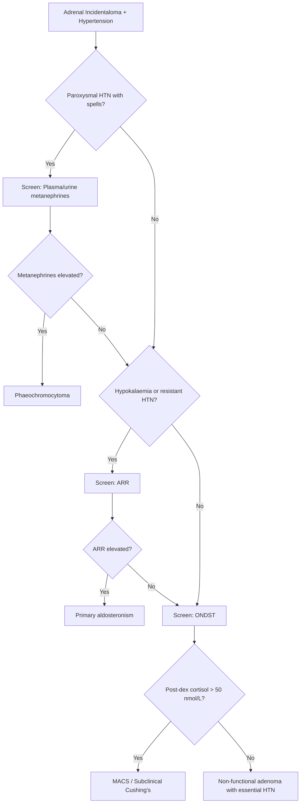
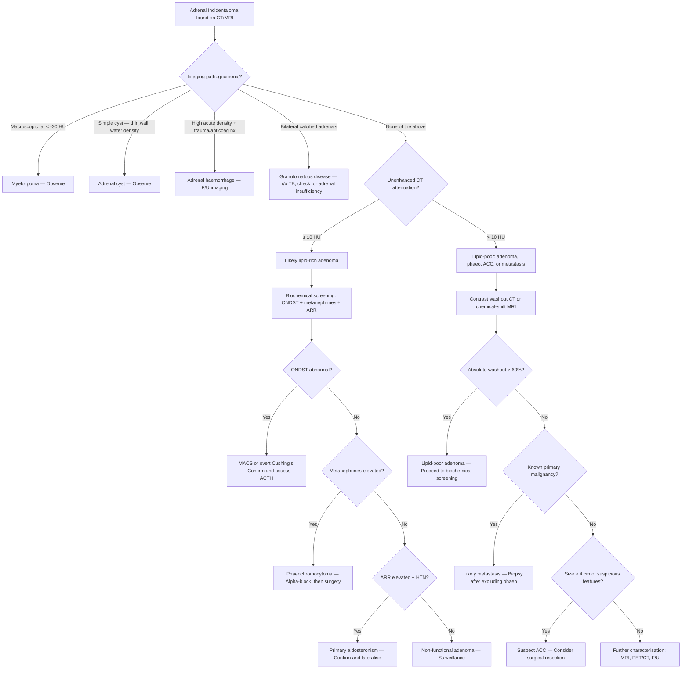

## Differential Diagnosis of Adrenal Incidentaloma

The differential diagnosis (DDx) of an adrenal incidentaloma is essentially asking: **"What is this mass?"** The answer is determined by working through the two cardinal questions systematically — *Is it functional?* and *Is it benign or malignant?* — using clinical features, biochemistry, and imaging in combination.

Think of it this way: you are standing in front of a locked door with two keys. One key is "functional status" (biochemistry), the other is "malignant potential" (imaging). You need both to decide what to do next.

---

### Systematic Framework for the DDx

The differential can be organised by **anatomical origin** (cortex vs. medulla vs. non-adrenal), **functional status**, and **benign vs. malignant**. This mirrors how you think clinically.

#### Master Differential Table

| Category | Diagnosis | Functional? | Malignant? | Key Distinguishing Features |
|:---|:---|:---|:---|:---|
| **Cortical — Benign** | ***Non-functioning adenoma*** | No | No | **Most common (~75–85%)**; lipid-rich (≤ 10 HU); homogeneous; < 4 cm; rapid contrast washout (> 60% absolute) [2][3] |
| | **Subclinical Cushing's / MACS** | Yes (cortisol) | No | Abnormal ONDST (post-dex cortisol > 50 nmol/L); may have metabolic syndrome features without classic Cushingoid phenotype; low ACTH [1][2] |
| | **Aldosterone-producing adenoma (Conn's)** | Yes (aldosterone) | No | Hypertension ± hypokalaemia; elevated ARR; usually small (< 2 cm); unilateral on CT; confirmed by salt loading/saline suppression test [1][5][6] |
| | Androgen/oestrogen-secreting adenoma | Yes (androgens/oestrogens) | No (rare in benign) | Virilisation in women or feminisation in men; elevated DHEA-S, testosterone; **if rapid-onset virilisation → think ACC instead** |
| **Cortical — Malignant** | ***Adrenocortical carcinoma (ACC)*** | Often (cortisol ± androgens ~60%) | **Yes** | **> 4 cm** (often > 6 cm); heterogeneous with necrosis/calcification; > 10 HU; slow washout; local invasion (IVC, renal vein); mixed hormone secretion [2][3] |
| **Medullary** | ***Phaeochromocytoma*** | Yes (catecholamines) | Usually no (~10–13%) | ***Classic triad: headache + sweating + palpitations***; paroxysmal/sustained HTN + orthostatic hypotension; elevated plasma/urine fractionated metanephrines; > 10 HU on CT; bright on T2 MRI ("light-bulb sign"); **must exclude before biopsy** [1][4][8] |
| | Ganglioneuroma | No | No | Benign neural crest tumour; well-defined, homogeneous; may calcify; typically in young adults |
| | Neuroblastoma | Sometimes (catecholamines) | **Yes** | Almost exclusively in children (< 5 y); elevated urine HVA/VMA; calcification common; crosses midline |
| **Non-adrenal primary** | Myelolipoma | No | No | Pathognomonic **macroscopic fat** on CT (negative HU values, < −30 HU); contains haematopoietic tissue; no enhancement needed; manage conservatively unless large/symptomatic [1][2] |
| | Adrenal cyst | No | No | Thin-walled, homogeneous, near-water density (~0–20 HU); no internal enhancement; simple vs pseudocyst |
| | Adrenal haemorrhage/haematoma | No | No | History of trauma, anticoagulation, sepsis, or post-surgical; high density acutely (50–70 HU); decreases on follow-up; may calcify chronically |
| | Granulomatous disease (TB, histoplasmosis, sarcoidosis) | May cause adrenal insufficiency if bilateral | No | **TB important in Hong Kong**; bilateral adrenal enlargement → later atrophy + calcification; check for active TB; may present with Addison's disease [7] |
| **Metastatic** | ***Adrenal metastasis*** | Rarely (only if bilateral and destroying > 90% of tissue → adrenal insufficiency) | **Yes** | **Most common malignant adrenal lesion** in patients with known cancer; common primaries: ***lung, breast, RCC, melanoma, lymphoma, HCC***; bilateral in ~50%; lipid-poor (> 10 HU); irregular; **biopsy indicated here (after excluding phaeochromocytoma biochemically)** [2][3] |
| **Other rare** | Lymphoma (primary adrenal) | Rarely | **Yes** | Very rare; bilateral in ~50%; homogeneous, large; consider if bilateral adrenal masses + B symptoms |
| | Haemangioma | No | No | Rare; peripheral enhancement with centripetal fill-in (like hepatic haemangioma) |

[1][2][3][4][6]

---

### Logical Approach to Narrowing the DDx

The DDx narrows substantially once you have three pieces of information: (1) **imaging characteristics**, (2) **biochemical screening results**, and (3) **clinical context** (age, cancer history, genetic syndromes).

#### Step 1: Imaging — Is the Diagnosis Already Clear?

Some diagnoses are essentially made on imaging alone:

| Imaging Finding | Diagnosis | Why? |
|:---|:---|:---|
| **Macroscopic fat (< −30 HU)** | **Myelolipoma** | Only adrenal lesion with bulk fat; mature adipocytes mixed with haematopoietic elements |
| **Near-water density, thin-walled, non-enhancing** | **Adrenal cyst** | Simple fluid collection; no solid component |
| **Calcified, bilateral, atrophic adrenals** | **Granulomatous disease (TB)** | Chronic granulomatous inflammation → fibrosis → dystrophic calcification [7] |
| **Acute high density (50–70 HU), history of trauma/anticoagulation** | **Adrenal haemorrhage** | Fresh blood is dense; resolves on follow-up imaging |

> If none of the above patterns are present, you must further characterise the lesion using the lipid content and contrast washout characteristics.

#### Step 2: CT Attenuation — Lipid-Rich vs. Lipid-Poor

| Unenhanced CT Attenuation | Interpretation | Next Step |
|:---|:---|:---|
| **≤ 10 HU** (lipid-rich) | **Very likely benign adenoma** (98% specificity) | Proceed to biochemical screening; if non-functional and < 4 cm → surveillance |
| **> 10 HU** (lipid-poor) | Could be: lipid-poor adenoma (~30% of adenomas), **phaeochromocytoma**, ACC, metastasis | **Contrast-enhanced washout CT** or **chemical-shift MRI** to further differentiate |

***Why this threshold?*** Cortical adenomas accumulate intracytoplasmic cholesterol esters (the raw material for steroidogenesis). These lipids attenuate X-rays less than water, giving a characteristically low Hounsfield Unit value. Malignant lesions and phaeochromocytomas are lipid-poor (their cells are dedicated to rapid proliferation or catecholamine synthesis, not lipid storage) [2][3].

#### Step 3: Contrast Washout — Distinguishing Lipid-Poor Adenomas from Malignancy

| Parameter | Adenoma | Non-Adenoma (ACC, Metastasis, Phaeochromocytoma) |
|:---|:---|:---|
| **Absolute washout at 15 min** | **> 60%** | **< 60%** |
| **Relative washout at 15 min** | **> 40%** | **< 40%** |

***Why do adenomas wash out faster?*** Adenomas have a rich, well-organised capillary network with fenestrated endothelium (similar to normal adrenal cortex). Contrast enters quickly and exits quickly. Malignant tumours have chaotic neovasculature with immature, leaky vessels → contrast enters but gets trapped in the interstitium → slow washout [2][3].

#### Step 4: Biochemical Screening — Is It Functional?

***Standard screening: ONDST + 24h urine fractionated metanephrines + ARR (if hypertensive)*** [1][2]

| Screening Test | What It Detects | Positive Result | What to Do Next |
|:---|:---|:---|:---|
| ***1 mg ONDST*** | Autonomous cortisol secretion (MACS / Cushing's) | Post-dex cortisol **> 50 nmol/L** (possible MACS); **> 138 nmol/L** (definite MACS) | Confirm with 24h UFC, midnight salivary cortisol, or LDDST; check ACTH [1][9] |
| ***24h urine fractionated metanephrines*** (or plasma free metanephrines) | Phaeochromocytoma | > 2× upper limit of normal highly suspicious; sensitivity ~96–99% for plasma, ~98% for urine | Localisation with CT/MRI; functional imaging (MIBG, ⁶⁸Ga-DOTATATE PET/CT) [4][10] |
| ***Plasma aldosterone-to-renin ratio (ARR)*** | Primary aldosteronism (Conn's) | Elevated ARR (aldosterone ↑, renin ↓) | Confirm with salt loading test or saline suppression test; lateralise with adrenal venous sampling [1][5][6] |
| **Androgen profile** (DHEA-S, testosterone, androstenedione) | Androgen-secreting tumour (ACC) | Elevated, especially DHEA-S | If elevated + large mass → strongly suspect ACC |

<Callout title="When to Order Which Test" type="idea">
- **ONDST**: Do on every incidentaloma > 1 cm — subclinical Cushing's is the most common functional diagnosis.
- **Metanephrines**: Do on every incidentaloma > 1 cm, but **especially** if CT attenuation > 10 HU (phaeochromocytomas are lipid-poor and therefore usually > 10 HU). Some guidelines suggest metanephrines can be omitted if the lesion is clearly lipid-rich (≤ 10 HU) and the patient is normotensive with no symptoms, but the safest approach is to screen everyone [2].
- **ARR**: Only if the patient is **hypertensive or has unexplained hypokalaemia** — there is no point screening a normotensive, normokalaemic patient for Conn's.
- **Androgens**: Only if the patient is a **virilised woman** or if the mass has features suspicious for ACC (large, lipid-poor, heterogeneous).
</Callout>

#### Step 5: Clinical Context — Key Modifiers

| Clinical Scenario | Most Likely DDx | Why? |
|:---|:---|:---|
| **Known extra-adrenal malignancy** (especially lung, breast, RCC, melanoma) | **Metastasis** (but ~50% are still benign adenomas) | Adrenals are common metastatic sites due to rich sinusoidal blood supply; must characterise — a benign adenoma in a cancer patient does not change staging |
| **Young patient (< 40 y), large mass, virilisation** | **ACC** | ACC has bimodal age distribution; often co-secretes cortisol + androgens |
| **Family history of MEN2, VHL, NF1, SDHx** | **Phaeochromocytoma/paraganglioma** | Up to 40% are familial; genetic testing indicated [4][8] |
| **Bilateral adrenal masses** | Metastases, congenital adrenal hyperplasia, bilateral phaeochromocytoma (MEN2, VHL), lymphoma, TB, bilateral cortical hyperplasia | Bilateral involvement significantly changes the DDx — less likely to be a simple unilateral adenoma [7] |
| **Patient from TB-endemic area (e.g. Hong Kong), bilateral calcified adrenals** | **TB** → Addison's disease | Granulomatous destruction of > 90% of both glands → adrenal insufficiency [7] |
| **Hypertension + hypokalaemia** | **Conn's syndrome** (APA or bilateral adrenal hyperplasia) | Screen with ARR [5][6] |
| **Resistant hypertension + paroxysmal symptoms** | **Phaeochromocytoma** | Screen with fractionated metanephrines [4] |

---

### Differential Diagnosis of Specific Overlapping Presentations

Because many adrenal pathologies present similarly (hypertension, incidental mass), it's helpful to consider the DDx from the perspective of the **presenting feature**.

#### DDx of an Adrenal Mass WITH Hypertension

#### DDx of Episodic Sweating and/or Flushing

This is a classic exam question. The DDx includes [4]:

| Condition | Key Differentiating Feature |
|:---|:---|
| ***Phaeochromocytoma*** | ***Sweating but NOT flushing (pallor during spells)*** — α₁ vasoconstriction causes pallor, not vasodilation |
| **Carcinoid syndrome** | **Flushing** (serotonin/bradykinin-mediated vasodilation) + diarrhoea + wheezing; check 24h urine 5-HIAA |
| **Thyrotoxicosis** | Heat intolerance + sweating, but **not usually episodic**; continuous hypermetabolic state |
| **Oestrogen/testosterone deficiency** (menopause, castration) | Hot flushes — vasomotor instability from hypothalamic thermoregulatory dysfunction |
| **Systemic mastocytosis** | Flushing from histamine release; urticaria pigmentosa; check serum tryptase |
| **Panic disorder / anxiety** | Sweating + palpitations + tremor — mimics phaeochromocytoma closely; diagnosis of exclusion after biochemical screening is negative |

[4]

<Callout title="Exam Pitfall" type="error">
***Phaeochromocytoma causes pallor, NOT flushing.*** This is because α₁-receptor activation causes cutaneous vasoconstriction. Students commonly confuse this with carcinoid syndrome (which causes flushing from serotonin-mediated vasodilation). If the question describes "flushing" → think carcinoid. If it describes "pallor during spells" → think phaeochromocytoma [4].
</Callout>

#### DDx of Bilateral Adrenal Masses

Bilateral adrenal involvement significantly narrows the differential:

| Diagnosis | Clue |
|:---|:---|
| **Metastases** | Known primary malignancy; bilateral, irregular, lipid-poor |
| **Bilateral phaeochromocytoma** | MEN2, VHL; bilateral bright T2 lesions on MRI; elevated metanephrines |
| **Congenital adrenal hyperplasia (CAH)** | Bilateral adrenal hyperplasia; elevated 17-OH-progesterone; virilisation in females |
| **Bilateral macronodular adrenal hyperplasia (BMAH)** | Bilateral large nodular adrenals; cortisol excess; often ACTH-independent |
| **TB / granulomatous disease** | Endemic area; calcification; features of adrenal insufficiency [7] |
| **Lymphoma** (primary adrenal) | B symptoms; bilateral homogeneous masses; PET-avid |
| **Adrenal haemorrhage** (bilateral) | Anticoagulation, sepsis (Waterhouse-Friderichsen in meningococcaemia), DIC |
| **ACTH-dependent Cushing's** (bilateral hyperplasia) | Elevated ACTH; diffuse bilateral adrenal enlargement (not discrete masses) |

---

### How to Distinguish Key DDx Pairs

#### Non-Functioning Adenoma vs. Adrenocortical Carcinoma

This is the most important distinction because it determines whether the patient needs surgery or surveillance.

| Feature | Benign Adenoma | ACC |
|:---|:---|:---|
| **Size** | Usually < 4 cm | Usually **> 4 cm** (often > 6 cm) |
| **Unenhanced CT** | **≤ 10 HU** (lipid-rich) | **> 10 HU** (lipid-poor) |
| **Margins** | Smooth, well-defined, homogeneous | Irregular, heterogeneous, necrosis, haemorrhage, calcification |
| **Contrast washout** | **Absolute > 60%** | **Absolute < 60%** |
| **Growth** | Stable on surveillance | **Growing > 0.5–1 cm over 6–12 months** [1] |
| **Hormonal** | Non-functional or single-hormone excess | **Mixed secretion** (cortisol + androgens) — nearly pathognomonic |
| **Histology** | Not helpful (benign and malignant look similar!) | **Weiss score ≥ 3** — but this is on resection specimen, NOT biopsy [2][3] |
| **Invasion** | None | IVC/renal vein invasion, lymphadenopathy, distant metastases |

> ***Histology is NOT useful in differentiating benign from malignant primary adrenal tumours on needle biopsy*** — they look the same. This is why biopsy is NOT indicated for primary adrenal lesions [2][3].

#### Adrenal Adenoma (Conn's) vs. Bilateral Idiopathic Adrenal Hyperplasia (BIAH)

Both cause primary aldosteronism, but management is completely different — APA → surgery; BIAH → medical therapy [5][6].

| Feature | Aldosterone-Producing Adenoma (APA) | Bilateral Idiopathic Adrenal Hyperplasia (BIAH) |
|:---|:---|:---|
| **Laterality** | Unilateral | Bilateral |
| **Aldosterone regulation** | **ACTH-dependent** (paradoxical ↓ with posture as ACTH falls at noon) | **Angiotensin-dependent** (↑ with upright posture due to ↑ renin) |
| **Postural test** | ***↓ aldosterone in 70–90%*** (follows ACTH circadian rhythm) | ***↑ aldosterone in 90%*** (exaggerated response to angiotensin II on standing) [6] |
| **Biochemical severity** | Usually more severe (very low K⁺, very high aldosterone) | Usually less severe |
| **CT** | Unilateral adrenal nodule | Normal or bilaterally enlarged |
| **Adrenal venous sampling** | ***↑ ipsilaterally, ↓ contralaterally*** | ***↑ bilaterally*** [6] |
| **Management** | ***Unilateral laparoscopic adrenalectomy*** (after pre-op spironolactone) | ***Medical: mineralocorticoid receptor antagonist (spironolactone/eplerenone)*** [5][6] |

[5][6]

#### Phaeochromocytoma vs. Panic Disorder

A classic clinical dilemma — both present with episodic palpitations, sweating, tremor, and anxiety.

| Feature | Phaeochromocytoma | Panic Disorder |
|:---|:---|:---|
| **Hypertension during spells** | **Yes** — often severe, paroxysmal | May have mild tachycardia but BP usually normal |
| **Pallor** | **Yes** — α₁ vasoconstriction | No — may have flushing |
| **Postural hypotension between spells** | Often present (volume contraction + receptor downregulation) | Not present |
| **Duration of spells** | Usually < 1 hour | Often > 10 minutes, up to hours |
| **Triggers** | Physical triggers (position change, abdominal palpation, anaesthesia, drugs) | Psychosocial stress, situational |
| **Biochemistry** | ***Elevated fractionated metanephrines*** | Normal metanephrines |
| **Weight** | Often weight loss (hypermetabolism) | Usually stable |

---

### Decision Algorithm: Comprehensive DDx Flowchart

---

### Special Considerations in the Hong Kong Context

1. **Tuberculosis**: Hong Kong has an intermediate TB incidence (~50–60 per 100,000). Bilateral adrenal calcification or bilateral adrenal masses in an at-risk patient (elderly, immunocompromised, close contacts) should prompt TB workup (sputum AFB, Quantiferon, CT chest) [7].

2. **Hepatocellular carcinoma (HCC)**: HK has high hepatitis B prevalence → high HCC incidence. HCC can metastasise to the adrenals. An adrenal mass in an HBV carrier with known HCC is likely metastatic until proven otherwise.

3. **Lung cancer**: Leading cancer in HK by incidence. Lung cancer metastases to the adrenal are very common — up to 40% of advanced lung cancer patients will develop adrenal metastases.

4. **Nasopharyngeal carcinoma (NPC)**: Endemic in Southern China/HK. Advanced NPC can metastasise to adrenals, though this is less common than lung.

---

<Callout title="High Yield Summary">

**Most common adrenal incidentaloma**: Non-functioning cortical adenoma (~85%). Characterised by ≤ 10 HU on unenhanced CT, homogeneous, < 4 cm, rapid contrast washout > 60%.

**Two critical questions for every incidentaloma**: (1) Functional? (2) Malignant?

**Standard biochemical screening panel**: ONDST + 24h urine fractionated metanephrines + ARR (if hypertensive).

**Imaging red flags for malignancy**: > 4 cm, > 10 HU, irregular margins, heterogeneous, necrosis/calcification, slow washout (< 60%), local invasion, growth > 1 cm on follow-up.

**Pathognomonic imaging findings**: Macroscopic fat = myelolipoma; bilateral calcified = TB/granulomatous; thin-walled water density = cyst.

**Phaeochromocytoma DDx pearl**: Causes PALLOR (not flushing) during spells — distinguish from carcinoid (flushing). DDx of episodic sweating: phaeochromocytoma, carcinoid, thyrotoxicosis, menopause, mastocytosis, panic disorder.

**Biopsy rule**: NEVER biopsy primary adrenal tumour (histology can't distinguish benign vs malignant; risk of phaeo crisis). Only biopsy for suspected metastasis AFTER excluding phaeochromocytoma biochemically.

**Bilateral masses DDx**: Metastases, bilateral phaeo (MEN2/VHL), CAH, BMAH, TB, lymphoma, bilateral haemorrhage.

**Conn's subtyping**: APA (unilateral, ACTH-dependent aldo, paradoxical ↓ on posture, surgery) vs BIAH (bilateral, angiotensin-dependent aldo, ↑ on posture, medical Tx with MRA).
</Callout>

---

<ActiveRecallQuiz
  title="Active Recall - Differential Diagnosis of Adrenal Incidentaloma"
  items={[
    {
      question: "A 55-year-old woman with known breast cancer has a 3 cm adrenal mass found on staging CT. The mass is lipid-poor (25 HU) with absolute washout of 40%. What is the most likely diagnosis, and what is the next step before proceeding with biopsy?",
      markscheme: "Most likely adrenal metastasis from breast cancer. Before biopsy, must exclude phaeochromocytoma biochemically with plasma or 24h urine fractionated metanephrines. Biopsy of unsuspected phaeochromocytoma can cause fatal hypertensive crisis.",
    },
    {
      question: "Explain why a benign cortical adenoma appears at 10 HU or less on unenhanced CT, whereas a phaeochromocytoma is typically above 10 HU.",
      markscheme: "Cortical adenomas are rich in intracytoplasmic cholesterol esters (steroidogenesis precursors), which are lipid and attenuate X-rays less than water, giving low HU values. Phaeochromocytomas arise from chromaffin cells dedicated to catecholamine synthesis, not lipid storage, so they are lipid-poor and higher in HU.",
    },
    {
      question: "List four causes of bilateral adrenal masses and state one distinguishing clinical or imaging feature for each.",
      markscheme: "(1) Metastases - known primary malignancy, irregular, lipid-poor. (2) Bilateral phaeochromocytoma - MEN2/VHL family history, elevated metanephrines. (3) TB - endemic area (e.g. Hong Kong), bilateral calcification, may have adrenal insufficiency. (4) Congenital adrenal hyperplasia - elevated 17-OH-progesterone, virilisation. Other acceptable: lymphoma (B symptoms, PET-avid), bilateral haemorrhage (anticoagulation/sepsis).",
    },
    {
      question: "A patient with an adrenal incidentaloma has paroxysmal episodes of headache, sweating, and pallor. What is the key feature that distinguishes this from carcinoid syndrome, and what screening test would you order?",
      markscheme: "Phaeochromocytoma causes pallor during spells (alpha-1 mediated vasoconstriction), whereas carcinoid syndrome causes flushing (serotonin/bradykinin-mediated vasodilation). Screening test: plasma free metanephrines or 24-hour urine fractionated metanephrines.",
    },
    {
      question: "How do you distinguish an aldosterone-producing adenoma from bilateral idiopathic adrenal hyperplasia on a postural stimulation test, and why?",
      markscheme: "APA: aldosterone paradoxically decreases with upright posture (because APA aldosterone production is ACTH-dependent, and ACTH falls in the afternoon following its circadian rhythm). BIAH: aldosterone increases with upright posture (because BIAH is angiotensin-dependent, and renin/angiotensin increases on standing). This difference guides management: APA = surgery, BIAH = medical therapy.",
    },
    {
      question: "Why is histological biopsy NOT useful for differentiating benign from malignant primary adrenocortical tumours?",
      markscheme: "Benign cortical adenomas and adrenocortical carcinomas have overlapping histological appearance on needle biopsy. Definitive histological diagnosis of malignancy (Weiss score) requires the complete resection specimen to assess invasion, mitoses, and architecture. Additionally, biopsy risks tumour seeding along the needle tract for primary adrenal cancers.",
    },
  ]}
/>

## References

[1] Senior notes: maxim.md (section on Adrenal incidentaloma)
[2] Senior notes: Ryan Ho Endocrine.pdf (section 3.5 Adrenal Incidentaloma and Adrenal Surgery)
[3] Senior notes: Ryan Ho Fundamentals.pdf (p438, Adrenal Incidentaloma)
[4] Senior notes: Ryan Ho Endocrine.pdf (p66, Phaeochromocytoma — clinical features, DDx of episodic sweating)
[5] Senior notes: maxim.md (section on Conn's syndrome, DDx and management)
[6] Senior notes: Ryan Ho Endocrine.pdf (p57–59, Primary aldosteronism — APA vs BIAH)
[7] Senior notes: Ryan Ho Chemical Path.pdf (p32, Workup on PAI — TB, granulomatous disease)
[8] Senior notes: felixlai.md (Rule of 10, epidemiology of phaeochromocytoma)
[9] Senior notes: Ryan Ho Chemical Path.pdf (p29, Diagnosis of Cushing Syndrome)
[10] Senior notes: Ryan Ho Diagnostic Radiology.pdf (p71–72, MIBG scan and functional imaging)
