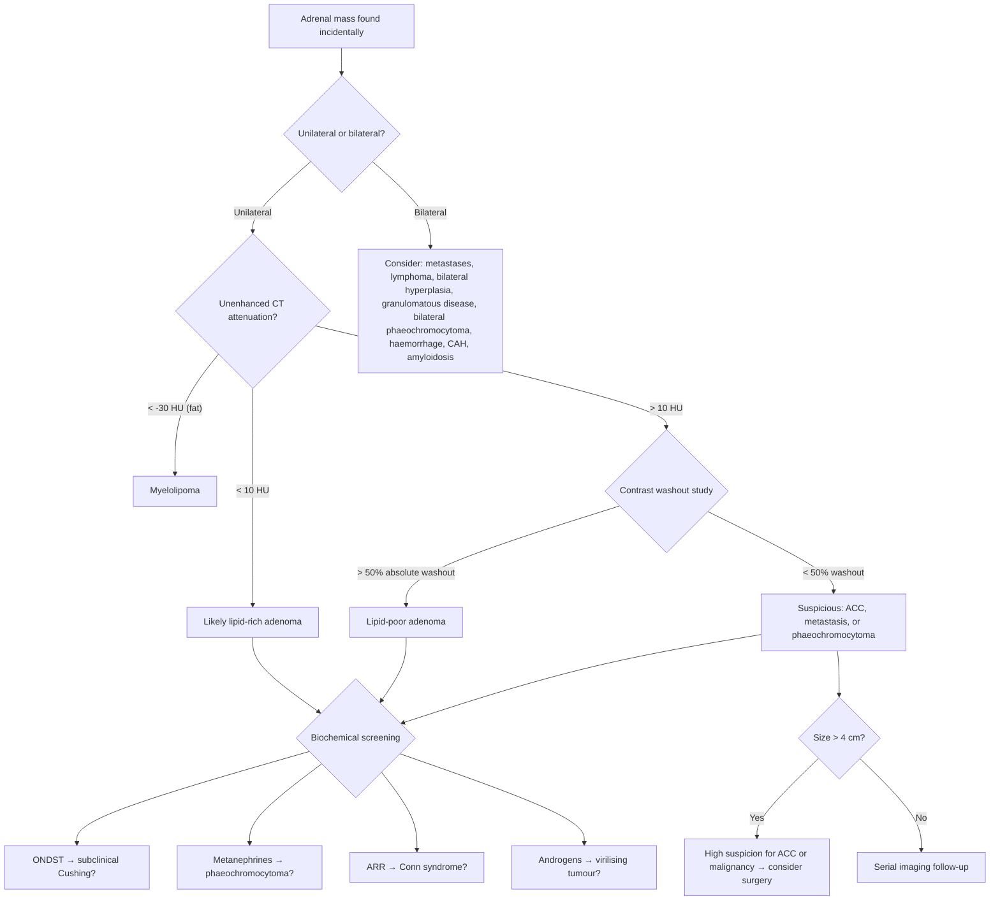

## Differential Diagnosis of Adrenal Incidentaloma

The differential diagnosis of an adrenal incidentaloma is essentially the differential of **"what can this adrenal mass be?"** You are not diagnosing a disease from symptoms — you are characterising a mass that was found by accident. The DDx is therefore structured around the two fundamental questions: **Is it functional? Is it malignant?** [1][2][3]

Think of it systematically by **tissue of origin** within the adrenal gland, then add extrinsic/non-adrenal mimics.

---

### Organising Framework

The adrenal gland has two compartments (cortex and medulla), and masses can also arise from surrounding structures or arrive via the bloodstream. This anatomy-based framework ensures you don't miss anything:

```mermaid
graph TD
    A["Adrenal Incidentaloma"] --> B["Adrenal Cortex"]
    A --> C["Adrenal Medulla"]
    A --> D["Other Adrenal Tissue"]
    A --> E["Non-Adrenal / Extrinsic"]

    B --> B1["Benign: Non-functioning adenoma (most common)"]
    B --> B2["Functional: Cortisol-secreting (subclinical Cushing)"]
    B --> B3["Functional: Aldosterone-secreting (Conn)"]
    B --> B4["Functional: Androgen-secreting"]
    B --> B5["Malignant: Adrenocortical carcinoma"]

    C --> C1["Phaeochromocytoma"]
    C --> C2["Ganglioneuroma / Ganglioneuroblastoma"]
    C --> C3["Neuroblastoma (children)"]

    D --> D1["Myelolipoma"]
    D --> D2["Adrenal cyst / pseudocyst"]
    D --> D3["Adrenal haemorrhage"]
    D --> D4["Granulomatous disease (TB, sarcoid, histoplasmosis)"]
    D --> D5["Amyloidosis"]

    E --> E1["Metastasis (lung, breast, melanoma, RCC, lymphoma)"]
    E --> E2["Lymphoma (primary adrenal or secondary)"]
    E --> E3["Retroperitoneal mass mimicking adrenal (e.g. upper pole renal mass, pancreatic tail lesion)"]
```

---

### Detailed Differential Diagnosis Table

| Category | Diagnosis | Frequency Among Incidentalomas | Key Distinguishing Features | Functional? |
|:---|:---|:---|:---|:---|
| **Cortical — Benign** | ***Non-functioning adenoma*** | ***~85% (most common)*** [1][2][3] | ***Lipid-rich → < 10 HU on unenhanced CT***, homogeneous, ***smooth border***, < 4 cm, rapid contrast washout ( > 50% absolute at 15 min) [2][3] | No |
| **Cortical — Functional** | ***Subclinical Cushing's / Autonomous cortisol secretion*** | ***~5-20%*** (often underdiagnosed) [1] | ***ONDST > 50 nmol/L***; may have subtle metabolic syndrome, osteoporosis, DM without overt Cushingoid features. ACTH suppressed. Contralateral adrenal may atrophy. [1][4] | Yes — cortisol |
| **Cortical — Functional** | ***Conn's syndrome (aldosterone-producing adenoma)*** | ***~1-2%*** [1] | ***Resistant HTN + hypokalaemia + metabolic alkalosis***; ***ARR elevated*** [1][5]; small ( < 2 cm) and lipid-rich. ***Adrenal venous sampling*** needed to lateralise before surgery [6][7] | Yes — aldosterone |
| **Cortical — Functional** | **Androgen-secreting adenoma** | Rare | Virilisation in women (hirsutism, deepening voice, clitoromegaly); elevated DHEA-S, testosterone | Yes — androgens |
| **Cortical — Malignant** | ***Adrenocortical carcinoma (ACC)*** | ***~2-5%*** [2][3] | ***Large ( > 4 cm, often > 6 cm)***, heterogeneous, irregular margins, ***contrast retention***, calcification, necrosis, local invasion (IVC thrombus). ~60% functional (cortisol ± androgens). Mixed cortisol + androgen secretion is a red flag. Rapid virilisation in women highly suspicious. | Often (mixed cortisol + androgens) |
| **Medullary** | ***Phaeochromocytoma*** | ***~5-7%*** [1][2] | ***Classic triad: paroxysmal headache + sweating + palpitations*** [1][8][9]; ***5 P's: Pressure, Pain, Palpitation, Perspiration, Pallor*** [8][9]; ***Postural hypotension despite HTN*** [8]; CT shows heterogeneous enhancing mass, often > 10 HU, may show cystic/haemorrhagic change ("light bulb" bright on T2 MRI). ***24h urine/plasma fractionated metanephrines*** for screening [1][2]. ***MIBG scan: sensitivity 85%, specificity 95%*** [10] | Yes — catecholamines |
| **Medullary** | **Ganglioneuroma** | Rare | Benign, well-circumscribed, slow-growing. Non-functional. Homogeneous on CT with gradual enhancement. Usually in younger patients. | No |
| **Medullary** | **Neuroblastoma** | Rare (children) | The most common extracranial solid tumour of childhood. Elevated urinary VMA/HVA. Calcification on CT, crosses midline. | Catecholamine metabolites elevated |
| **Other adrenal** | ***Myelolipoma*** | ~5-7% | ***Very low (fat) attenuation on CT (often < −30 HU)*** — essentially pathognomonic. Contains mature fat + haematopoietic elements. Non-functional. Only resect if large ( > 6 cm) or symptomatic (haemorrhage). | No |
| **Other adrenal** | **Adrenal cyst / pseudocyst** | ~4-5% | Well-defined, thin-walled, fluid-density on CT (0-20 HU), no enhancement of cyst contents. Subtypes: endothelial cyst, pseudocyst, parasitic (echinococcal — consider in endemic regions). | No |
| **Other adrenal** | **Adrenal haemorrhage** | Variable | Acute: high attenuation on unenhanced CT ( > 50 HU); chronic: may calcify. History of trauma, anticoagulation, sepsis (Waterhouse-Friderichsen), postoperative, neonatal stress. Can cause adrenal insufficiency if bilateral. | No (but can cause insufficiency) |
| **Other adrenal** | ***Granulomatous disease (TB, histoplasmosis, sarcoidosis)*** | Uncommon but important in HK [2][3] | Bilateral adrenal enlargement, ± calcification (especially old TB). May present as **Addison's disease** (primary adrenal insufficiency) if enough gland is destroyed. In Hong Kong, TB remains an important cause. | No (but may → insufficiency) |
| **Extrinsic** | ***Metastasis*** | Highly variable; ***up to 50-75% of adrenal masses in patients with known extra-adrenal malignancy*** | ***Most common primaries: lung (most common), breast, melanoma, RCC, lymphoma***. Usually > 10 HU, heterogeneous, may be bilateral. Often grows on serial imaging. ***Biopsy is reserved for confirmation of adrenal metastasis*** — the main valid indication for adrenal biopsy [2][3]. Usually non-functional but bilateral extensive disease can → adrenal insufficiency. | Usually no |
| **Extrinsic** | **Primary adrenal lymphoma** | Very rare | Usually bilateral, large, homogeneous soft-tissue density. Associated with adrenal insufficiency. Consider in elderly with bilateral adrenal masses + B symptoms. | No |
| **Extrinsic** | **Retroperitoneal mass mimicking adrenal** | Rare | Upper pole renal mass, pancreatic tail lesion, retroperitoneal sarcoma, or lymphadenopathy can mimic an adrenal mass on imaging. Thin-slice CT or MRI with multiplanar reconstruction can clarify the organ of origin. | N/A |

---

### How to Differentiate: A Logical Approach

The differential diagnosis is narrowed by integrating three streams of information:

#### 1. Clinical Context

- **Patient with no cancer history**: non-functioning adenoma is overwhelmingly most likely (~85%). But you MUST still screen for function and assess imaging characteristics.
- **Patient with known malignancy**: the probability of metastasis jumps to 50-75%, but ~25-50% are still benign adenomas — so imaging characterisation is still essential before assuming metastasis.
- **Young patient with hypertension**: think phaeochromocytoma, Conn's syndrome, or RAS.
- **Woman with rapid virilisation**: think ACC or androgen-secreting adenoma.
- **Patient with genetic syndrome** (NF1, MEN2, VHL): phaeochromocytoma is high on the list.

#### 2. Imaging Characteristics

This is the most powerful tool for narrowing the DDx non-invasively:

| Imaging Finding | Favoured Diagnosis | Why |
|:---|:---|:---|
| ***< 10 HU unenhanced CT*** | ***Lipid-rich adenoma*** [2][3] | Adenomas are packed with intracellular cholesterol/lipid droplets (precursors for steroidogenesis) → low attenuation |
| **< −30 HU (macroscopic fat)** | **Myelolipoma** | Contains mature adipose tissue — the only adrenal tumour with macroscopic fat |
| **Fluid density (0-20 HU), no enhancement** | **Adrenal cyst** | Simple fluid-filled cavity |
| **> 50 HU unenhanced, acute setting** | **Adrenal haemorrhage** | Fresh blood is hyperdense on CT |
| ***> 10 HU, slow contrast washout*** | ***Malignant (ACC or metastasis) or phaeochromocytoma*** [2][3] | Malignant masses have disordered, leaky vasculature that retains contrast; phaeochromocytomas are also lipid-poor |
| ***> 4 cm, heterogeneous, irregular*** | ***ACC or metastasis*** [2][3] | ***90% of malignant adrenal tumours are > 4 cm*** [2][3] |
| **Bilateral enlargement** | **Metastases, lymphoma, bilateral cortical hyperplasia, congenital adrenal hyperplasia, granulomatous disease, bilateral phaeochromocytoma (genetic syndrome)** | The bilateral pattern immediately narrows the DDx and raises concern for systemic disease |
| **"Light bulb" bright on T2-weighted MRI** | **Phaeochromocytoma** (classic but not universal) | High water content and vascularity of chromaffin tumour tissue |
| **Calcification** | **Old granulomatous disease (TB), haemorrhage, ACC, neuroblastoma** | Chronic inflammation → dystrophic calcification; ACC and neuroblastoma may have irregular calcification |

<Callout title="Exam Favourite: How to Distinguish Adenoma from Metastasis on CT">
This is a very common exam question. The key discriminator is **unenhanced CT attenuation**:
- **< 10 HU** = lipid-rich adenoma (specificity ~98%) → safe to follow up
- **> 10 HU** = indeterminate → perform **contrast-enhanced CT with washout study**:
  - **Absolute washout > 50% at 15 min** = adenoma (even if lipid-poor)
  - **Absolute washout < 50%** = suspicious for metastasis, ACC, or phaeochromocytoma
- **Chemical-shift MRI** (in-phase/opposed-phase) can also identify lipid-rich adenomas: signal drop on opposed-phase images indicates intracellular lipid (adenoma). Metastases and phaeochromocytomas do NOT show this signal drop.
</Callout>

#### 3. Biochemical Screening

***Screening tests for functional tumours: ONDST + spot ARR + 24h urine metanephrines*** [1]

| Test | What It Detects | Result Suggesting Functionality |
|:---|:---|:---|
| ***1 mg ONDST*** [1][4] | Autonomous cortisol secretion | ***Cortisol > 50 nmol/L (1.8 µg/dL)*** |
| ***24h urine free cortisol*** [1][4] | Cushing's syndrome | Elevated above upper limit of normal |
| ***Midnight salivary cortisol*** [1][4] | Loss of circadian rhythm (Cushing's) | Elevated (loss of nadir) |
| ***ARR*** [1][5] | Primary hyperaldosteronism | Elevated ratio (varies by assay; typically aldosterone > 15 ng/dL with renin suppressed) |
| ***24h urine fractionated metanephrines*** [1][8] | Phaeochromocytoma | ***Elevated metanephrine/normetanephrine (most sensitive screening marker)*** [8][9] |
| ***Plasma fractionated metanephrines*** [8] | Phaeochromocytoma | ***Sensitivity 96-100%, specificity 85-89%*** [8] |
| **Androgen profile** (DHEA-S, testosterone) [2] | Androgen-secreting tumour/ACC | Elevated; particularly important if virilisation present |

<Callout title="Why Screen ALL Incidentalomas for Phaeochromocytoma?" type="error">
Even if the mass looks benign on CT, **phaeochromocytoma must be excluded before any invasive procedure** (including biopsy and surgery). An undiagnosed phaeochromocytoma manipulated during biopsy or surgery can cause a ***fatal hypertensive crisis*** [2][3]. This is non-negotiable. The screening test (plasma/urine metanephrines) is cheap and non-invasive — there is no excuse to skip it.
</Callout>

---

### Differential Diagnosis of Specific Presentations

Beyond "what is this mass?", certain clinical presentations triggered by the incidentaloma have their own differential:

#### DDx of Episodic Sweating and/or Flushing

This comes up when phaeochromocytoma is suspected but you need to consider mimics [8]:

| Condition | Key Differentiating Feature |
|:---|:---|
| ***Phaeochromocytoma*** | ***Sweating but do NOT flush (pallor instead, due to vasoconstriction)*** [8] |
| ***Carcinoid syndrome*** | ***Flushing + diarrhoea + wheeze*** (serotonin + histamine-mediated vasodilation) [8] |
| ***Thyrotoxicosis*** | ***Not usually episodic***; warm, moist skin, heat intolerance, weight loss, tremor [8] |
| ***Oestrogen/testosterone deficiency (e.g. menopause, castration)*** | Hot flushes, age-appropriate, no hypertension [8] |
| ***Systemic mastocytosis*** | Histamine release → flushing, urticaria, pruritus, GI symptoms; elevated serum tryptase [8] |
| **Allergy / anaphylaxis** | Temporal relationship with allergen exposure [8] |
| **Panic disorder / anxiety** | Psychiatric history, situational triggers, no hypertension during episodes |
| **Medullary thyroid carcinoma** | Calcitonin-mediated flushing + diarrhoea; consider if FHx of MEN2 |

<Callout title="Clinical Pearl: Pallor vs. Flushing">
A key exam discriminator: **phaeochromocytoma causes pallor** (α₁-mediated vasoconstriction), whereas **carcinoid causes flushing** (serotonin/histamine-mediated vasodilation). If the patient says they go **pale** during attacks — think phaeochromocytoma. If they go **red** — think carcinoid.
</Callout>

#### DDx of Resistant Hypertension with Adrenal Mass

When the incidentaloma is found in the workup for resistant hypertension, the differential for the hypertension itself includes [5][7]:

| Cause | Frequency | Screening | Key Features |
|:---|:---|:---|:---|
| ***Primary aldosteronism (Conn's)*** | ***8-20%*** [5] | ***Plasma ARR*** [1][5] | ***Resistant HTN, hypokalaemia, alkalosis, muscle cramps, arrhythmias (esp AF with hypoK)*** [5] |
| ***Phaeochromocytoma/paraganglioma*** | ***0.1-0.6%*** [5] | ***24h urine fractionated metanephrines, plasma metanephrines*** [5] | ***Paroxysmal HTN/crisis, spells of headache + sweating + palpitations + pallor, adrenal incidentaloma, NF stigmata*** [5] |
| ***Cushing's syndrome*** | ***< 0.1%*** [5] | ***1 mg ONDST*** [5] | ***Central obesity, Cushingoid features, proximal myopathy, hyperglycaemia*** [5] |
| **Renal artery stenosis** | 5-34% | Renal duplex USG, MRA, CT | Abrupt onset/worsening HTN, flash pulmonary oedema, renal bruit [5] |
| **Renal parenchymal disease** | 1-2% | Renal USG, urinalysis, biopsy | Haematuria, proteinuria, recurrent UTI, polycystic kidney disease [5] |
| **OSA** | 25-50% | Polysomnography | Snoring, restless sleep, daytime sleepiness, obesity [5] |
| **Coarctation of aorta** | 0.1% | Echo, CTA/MRA thorax | Young HTN < 30y, UL > LL BP, radiofemoral delay, continuous murmur [5] |

#### DDx of Bilateral Adrenal Masses

This subset is particularly important because it narrows the differential significantly:

| Diagnosis | Why Bilateral? |
|:---|:---|
| **Metastases** | Haematogenous spread to both glands (lung, breast, melanoma most common) |
| **Lymphoma** | Systemic disease, bilateral involvement |
| **Bilateral adrenal hyperplasia** | ACTH-dependent (Cushing's disease, ectopic ACTH) or bilateral idiopathic hyperaldosteronism (BIAH) |
| **Congenital adrenal hyperplasia** | Enzyme deficiency → ACTH drive → bilateral hyperplasia |
| **Granulomatous disease (TB, sarcoid, histoplasmosis)** | Bilateral infiltration |
| **Bilateral phaeochromocytoma** | Strongly suggests **genetic syndrome** (MEN2, VHL, NF1); sporadic bilateral is very rare |
| **Amyloidosis** | Bilateral infiltration |
| **Bilateral haemorrhage** | Anticoagulation, meningococcal sepsis (Waterhouse-Friderichsen), DIC |
| **ACTH-independent macronodular adrenal hyperplasia** | Rare cause of Cushing's; bilateral large nodules |

<Callout title="Bilateral Adrenal Masses = Think Systemic">
If the CT shows **bilateral** adrenal masses, you should immediately think of systemic processes: metastases, lymphoma, granulomatous disease, bilateral haemorrhage, congenital adrenal hyperplasia, or a genetic phaeochromocytoma syndrome. A solitary unilateral mass is much more likely to be a benign adenoma.
</Callout>

---

### Differentiating Conn's Adenoma from Bilateral Idiopathic Adrenal Hyperplasia (BIAH)

This is a critical sub-differential within primary hyperaldosteronism because management differs completely [6][11]:

| Feature | ***Aldosterone-Producing Adenoma (APA)*** | ***Bilateral Idiopathic Adrenal Hyperplasia (BIAH)*** |
|:---|:---|:---|
| **Laterality** | ***Unilateral*** [6][11] | ***Bilateral*** [6][11] |
| **Regulation** | ***ACTH-dependent*** [6][11] | ***Angiotensin-dependent*** [6][11] |
| **Biochemical severity** | ***More significant disturbance (very low K, very high Ald)*** [6][11] | ***Less significant disturbance*** [6][11] |
| **Postural test** | ***↓Ald in 70-90% (paradoxical — due to ↓ACTH drive at noon)*** [6][11] | ***↑Ald in 90% (exaggerated response to ↑Ang II in erect posture)*** [6][11] |
| **Adrenal venous sampling** | ***↑ipsilaterally, ↓contralaterally*** [11] | ***↑bilaterally*** [11] |
| **CT/MRI** | ***Unilateral tumour*** [11] | ***Normal or slightly enlarged bilateral*** [11] |
| **Management** | ***Unilateral laparoscopic adrenalectomy*** (after medical pre-op with spironolactone) [6][11] | ***Medical treatment: aldosterone antagonist (spironolactone/eplerenone), K-sparing diuretics (amiloride)*** — bilateral adrenalectomy would cause adrenal crisis [6][11] |

> **Why does the postural test work?** In a normal person, standing up activates the RAAS → aldosterone rises. In an APA, aldosterone production is driven by ACTH (not angiotensin II), so aldosterone paradoxically **falls** at noon as ACTH follows its circadian decline. In BIAH, aldosterone is angiotensin-sensitive, so it **rises** exaggeratedly with posture. [6][11]

---

### Summary Flowchart: DDx Narrowing Algorithm

---

<Callout title="High Yield Summary — Differential Diagnosis of Adrenal Incidentaloma">

**Most common cause overall**: Non-functioning cortical adenoma (~85%).

**Most common functional cause**: Subclinical autonomous cortisol secretion (5-20%).

**Most common malignant cause in patients WITH known cancer**: Metastasis (50-75% of adrenal masses in cancer patients).

**Most common malignant cause in patients WITHOUT known cancer**: Adrenocortical carcinoma (2-5%).

**Key CT discriminators**: < 10 HU = adenoma; < −30 HU = myelolipoma; > 10 HU with slow washout = suspicious (ACC, metastasis, phaeochromocytoma).

**Size matters**: > 4 cm = 90% chance of malignancy among malignant tumours → surgical indication.

**Bilateral masses**: Think systemic — metastases, lymphoma, granulomatous disease, bilateral hyperplasia, genetic phaeochromocytoma syndrome, haemorrhage.

**Phaeochromocytoma**: Pallor (NOT flushing), paroxysmal HTN, classic triad of headache + sweating + palpitations.

**Conn's adenoma vs. BIAH**: Postural test — APA shows paradoxical ↓aldosterone (ACTH-dependent); BIAH shows ↑aldosterone (angiotensin-dependent). Management differs: surgery for APA, medical for BIAH.

**Always exclude phaeochromocytoma** (metanephrines) before biopsy or surgery.

**Biopsy only for suspected metastasis** — not for primary adrenal tumours.

</Callout>

---

<ActiveRecallQuiz
  title="Active Recall - Differential Diagnosis of Adrenal Incidentaloma"
  items={[
    {
      question: "A patient with known lung cancer has a new 3 cm adrenal mass with unenhanced CT attenuation of 5 HU. What is the most likely diagnosis and why?",
      markscheme: "Lipid-rich adrenal adenoma. Despite the history of lung cancer, an unenhanced CT attenuation less than 10 HU has approximately 98% specificity for a benign adenoma (intracellular lipid from cholesterol). About 25-50% of adrenal masses in cancer patients are still benign adenomas. However, clinical correlation and follow-up imaging are still warranted.",
    },
    {
      question: "How does the postural stimulation test differentiate an aldosterone-producing adenoma from bilateral idiopathic adrenal hyperplasia?",
      markscheme: "In APA, aldosterone production is ACTH-dependent, so aldosterone paradoxically falls at noon (as ACTH follows its circadian decline from morning to midday). In BIAH, aldosterone production is angiotensin II-dependent, so aldosterone rises exaggeratedly with upright posture (which activates RAAS). APA: aldosterone decreases in 70-90%. BIAH: aldosterone increases in 90%.",
    },
    {
      question: "Name three conditions in the differential diagnosis of episodic sweating that can be distinguished from phaeochromocytoma by the presence of flushing rather than pallor.",
      markscheme: "Carcinoid syndrome (serotonin/histamine-mediated flushing plus diarrhoea and wheeze), menopausal hot flushes (oestrogen deficiency), and systemic mastocytosis (histamine release causing flushing and urticaria). Phaeochromocytoma causes pallor due to alpha-1 vasoconstriction, not flushing.",
    },
    {
      question: "What are the causes to consider when bilateral adrenal masses are found on CT?",
      markscheme: "Metastases (most common in patients with known cancer), lymphoma, bilateral cortical hyperplasia (ACTH-dependent Cushing or BIAH), congenital adrenal hyperplasia, granulomatous disease (TB, sarcoidosis, histoplasmosis), bilateral phaeochromocytoma (suggests genetic syndrome such as MEN2, VHL, NF1), bilateral haemorrhage, and amyloidosis.",
    },
    {
      question: "An adrenal mass on unenhanced CT shows attenuation of less than negative 30 HU. What is the diagnosis and what is the mass composed of?",
      markscheme: "Myelolipoma. It is composed of mature adipose tissue and haematopoietic elements. The very low (fat) attenuation below negative 30 HU on CT is essentially pathognomonic. It is benign and non-functional. Surgery only needed if greater than 6 cm or symptomatic (e.g. haemorrhage).",
    },
  ]}
/>

## References

[1] Senior notes: maxim.md (Adrenal incidentaloma section, pp. 432-434)
[2] Senior notes: Ryan Ho Endocrine.pdf (Section 3.5 Adrenal Incidentaloma, p. 68)
[3] Senior notes: Ryan Ho Fundamentals.pdf (Section B: Adrenal Incidentaloma, p. 438)
[4] Senior notes: Ryan Ho Chemical Path.pdf (Section 4.1 Diagnosis of Cushing Syndrome, p. 29)
[5] Senior notes: Ryan Ho Cardiology.pdf (Secondary hypertension table, p. 178)
[6] Senior notes: maxim.md (Conn's syndrome section, pp. 434-435)
[7] Senior notes: Ryan Ho Diagnostic Radiology.pdf (Interventional radiology — adrenal venous sampling, p. 79)
[8] Senior notes: Ryan Ho Endocrine.pdf (Phaeochromocytoma — clinical features and DDx, pp. 66-67)
[9] Senior notes: felixlai.md (Phaeochromocytoma clinical manifestation and diagnosis, pp. 1536-1537)
[10] Senior notes: Ryan Ho Diagnostic Radiology.pdf (MIBG scan, p. 71)
[11] Senior notes: Ryan Ho Endocrine.pdf (Conn's — adenoma vs. hyperplasia, p. 59)
