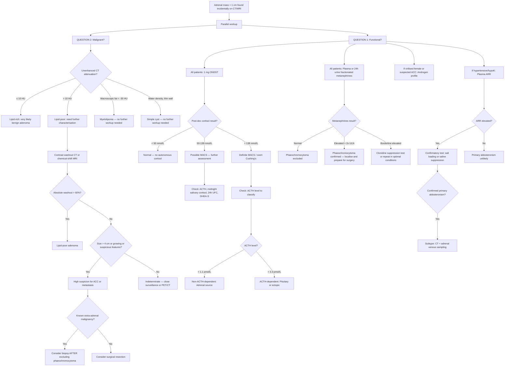

## Diagnostic Criteria and Algorithm for Adrenal Incidentaloma

There is no single "diagnostic criterion" for an adrenal incidentaloma the way there is for, say, rheumatoid arthritis or diabetes. Instead, the diagnosis is straightforward — you see a mass on imaging — and the real diagnostic challenge is **characterising** that mass. The entire diagnostic framework revolves around systematically answering the two cardinal questions and then acting on the answers.

Let me walk you through this the way you'd approach it on the wards, step by step.

---

## The Two Cardinal Questions — Reiterated as a Diagnostic Framework

> ***Question 1: Is it functional?*** → Answered by **biochemical screening**
>
> ***Question 2: Is it benign or malignant?*** → Answered by **imaging characterisation** (± biopsy in select cases)

These two questions are assessed **in parallel**, not sequentially. You order the imaging characterisation and the biochemical workup at the same time.

---

## Master Diagnostic Algorithm

---

## Investigation Modalities — Detailed Breakdown

### A. Biochemical Screening (Functional Assessment)

Every adrenal incidentaloma **> 1 cm** with benign-looking imaging features requires biochemical screening [1][2][3]. The rationale is that functional tumours — even when clinically "silent" — carry significant morbidity (cardiovascular risk in MACS, catastrophic hypertensive crisis in phaeochromocytoma) and may require surgery.

---

#### 1. Overnight Dexamethasone Suppression Test (ONDST) — Screening for Cushing's / MACS

***The 1 mg ONDST is the first-line screening test for autonomous cortisol secretion in adrenal incidentaloma*** [1][2][9].

**Principle from first principles:**
- In a normal person, the HPA axis works via negative feedback: hypothalamus (CRH) → pituitary (ACTH) → adrenal cortex (cortisol) → cortisol feeds back to suppress CRH and ACTH.
- **Dexamethasone** is a potent synthetic glucocorticoid. When given exogenously, it activates glucocorticoid receptors in the hypothalamus and pituitary → suppresses CRH and ACTH → the normal adrenal glands stop producing cortisol.
- In **autonomous cortisol secretion** (adrenal adenoma), the adenoma produces cortisol regardless of ACTH levels. ACTH is already suppressed (by the adenoma's cortisol output). Giving dexamethasone cannot further suppress an already-suppressed ACTH, and the adenoma doesn't care about ACTH anyway → cortisol remains unsuppressed [9][11].

**Procedure** [9][11]:
1. Basal cortisol at 09:00h (optional but useful)
2. Patient takes **1 mg dexamethasone orally at 23:00h** (midnight)
3. Serum cortisol measured at **09:00h the following morning**

**Interpretation** [1][2][9]:

| Post-Dex Cortisol | Interpretation | Action |
|:---|:---|:---|
| ***< 50 nmol/L (1.8 μg/dL)*** | ***Normal suppression*** — no autonomous cortisol | Cushing's/MACS excluded |
| ***50–138 nmol/L*** | ***Possible MACS*** (mild autonomous cortisol secretion) | Further tests: ACTH, midnight salivary cortisol, 24h UFC, DHEA-S; assess for metabolic comorbidities |
| ***> 138 nmol/L (5 μg/dL)*** | ***Definite MACS or overt Cushing's syndrome*** | Full Cushing's workup: ACTH to classify as ACTH-dependent vs independent |

<Callout title="Why 50 nmol/L and not a higher threshold?">
The Endocrine Society (2016) and ESE/ENSAT (2016) guidelines lowered the threshold to 50 nmol/L (previously 138 nmol/L) to increase **sensitivity** — catching more cases of MACS. The trade-off is lower specificity (more false positives). For an incidentaloma, you want high sensitivity because missing a functional tumour has real consequences.
</Callout>

***False positives (failed suppression without Cushing's)*** [9]:
- **CYP3A4 enzyme inducers** (anticonvulsants — phenytoin, carbamazepine, phenobarbital; rifampicin) → accelerate dexamethasone metabolism → lower dex levels → inadequate suppression. *Tip: check serum dexamethasone level if suspected.*
- **Oestrogen** (OCP, pregnancy, HRT) → ↑cortisol-binding globulin (CBG) → ↑total cortisol measured → apparent failure to suppress. *Should stop OCP ≥ 6 weeks before test.*
- ***Severe depression (30–50%)*** or ***systemic illness (10–20%)*** → physiological hypercortisolism (pseudo-Cushing's) [9]
- **Chronic alcohol abuse** → pseudo-Cushing's
- **Renal failure** on dialysis
- **Marked obesity**

***False negatives (rare, < 2%)*** [9]:
- Cyclical Cushing's syndrome (intermittent cortisol secretion)
- Slow metabolism of dexamethasone → paradoxically high dex levels → over-suppression

---

#### 2. Plasma / 24h Urine Fractionated Metanephrines — Screening for Phaeochromocytoma

***24h urine fractionated metanephrines: Sensitivity ~98%, Specificity ~98%*** [4]
***Plasma free fractionated metanephrines: Sensitivity ~96–100%, Specificity ~85–89%*** [4]

**Principle from first principles:**
- Phaeochromocytoma cells contain COMT (catechol-O-methyltransferase), which **continuously** metabolises catecholamines to metanephrines *within the tumour*.
- Even between symptomatic spells (when the tumour isn't actively secreting catecholamines into the blood), the intratumoral metabolism is ongoing → metanephrines leak out into the circulation at a constant rate.
- This makes metanephrines a **far more sensitive** marker than catecholamines themselves (which are episodic and rapidly cleared) or VMA (a downstream metabolite with poor sensitivity) [4][8].

**Which test to use?**
- ***24h urine fractionated metanephrines*** are preferred in many centres (including Hong Kong Hospital Authority) — they are robust, widely available, and have excellent sensitivity AND specificity [1][4].
- **Plasma free metanephrines** are slightly more sensitive (~99%) but less specific (~85–89%) → more false positives. Best used when you want to **rule out** phaeochromocytoma with near certainty (e.g. MEN2 genetic carrier surveillance) [4].

**Precautions before urine collection** [8]:
- ***Avoid dietary caffeine, chocolate, bananas*** before the test (contain catecholamine precursors)
- ***Stop interfering drugs***: TCAs, methyldopa, labetalol, sotalol, decongestants (pseudoephedrine), levodopa, amphetamines, α-agonists — these can cause **false positives** [4][8]
- Urine specimen should be **kept refrigerated** during collection and transport

**Interpretation:**

| Result | Interpretation |
|:---|:---|
| Normal | Phaeochromocytoma effectively excluded |
| ***> 2× upper limit of normal*** | ***Highly diagnostic of phaeochromocytoma*** (~100% PPV) |
| Borderline elevation (1–2× ULN) | May be false positive; repeat in optimal conditions or perform **clonidine suppression test** |

**Clonidine suppression test** (confirmation for borderline results) [1]:
- **Principle**: Clonidine is a central α₂-agonist → suppresses sympathetic outflow → in normal people, plasma normetanephrine falls. In phaeochromocytoma, the tumour produces catecholamines autonomously and is not affected by central sympatholytic agents → normetanephrine remains elevated.
- **Procedure**: Clonidine 300 μg PO → measure plasma normetanephrine at 0 and 3 hours
- **Finding**: Failure to suppress normetanephrine → confirms phaeochromocytoma

---

#### 3. Plasma Aldosterone-to-Renin Ratio (ARR) — Screening for Conn's Syndrome

***Screen with ARR only if the patient is hypertensive or has unexplained hypokalaemia*** [1][2][6].

**Principle from first principles:**
- In primary aldosteronism, the adrenal autonomously secretes aldosterone → Na⁺ retention → volume expansion → suppresses renin (via negative feedback on juxtaglomerular cells) → low renin.
- So you have: **high aldosterone + low renin → very high ARR**.
- In secondary hyperaldosteronism (e.g. renal artery stenosis, heart failure), renin is HIGH → both aldosterone and renin are elevated → ARR is normal or low.

**Precautions before testing:**
- **Stop interfering medications** for at least 2–4 weeks:
  - **Spironolactone/eplerenone**: ↑renin, ↓aldosterone → false negative ARR. Stop ≥ 4–6 weeks.
  - **ACEi, ARB, direct renin inhibitors**: ↑renin → ↓ARR → false negative
  - **β-blockers**: ↓renin → ↑ARR → false positive
  - **Dihydropyridine CCBs and α-blockers** are acceptable antihypertensives during testing (least interference)
- **Correct hypokalaemia** first: hypokalaemia itself suppresses aldosterone release → may mask primary aldosteronism (false negative)
- **Posture**: Sample in the morning after patient has been upright for ≥ 2 hours

**Interpretation:**
| Finding | Interpretation |
|:---|:---|
| ARR elevated (threshold varies by assay; commonly aldosterone > 416 pmol/L AND ARR > 70) | Positive screen → proceed to confirmatory test |
| ARR normal | Primary aldosteronism unlikely |

**Confirmatory tests** [1][5][6]:

| Test | Principle | Positive Result |
|:---|:---|:---|
| ***Salt loading test*** (oral NaCl 200 mmol/d for 3 days → 24h urine aldosterone on day 3) | High salt intake → volume expansion → should suppress aldosterone via ↓renin | ***Failure to suppress urinary aldosterone*** (> 33 nmol/day or > 12 μg/day) |
| ***Saline suppression test*** (2L 0.9% NaCl IV over 4h → measure plasma aldosterone post-infusion) | Same principle but IV loading; more standardised | ***Failure to suppress plasma aldosterone*** (> 280 pmol/L post-infusion) |
| Fludrocortisone suppression test | Exogenous mineralocorticoid + salt loading → maximal volume expansion | Aldosterone not suppressed + renin suppressed |

**Subtype differentiation** (critical because it determines surgical vs medical management) [5][6][12]:

| Test | Aldosterone-Producing Adenoma | Bilateral Idiopathic Adrenal Hyperplasia |
|:---|:---|:---|
| ***Postural test (8am supine → 12pm erect)*** | ***↓ Aldosterone in 70–90%*** (ACTH-dependent; ACTH falls at noon → aldo falls) | ***↑ Aldosterone in 90%*** (angiotensin-dependent; renin rises on standing → aldo rises) [5][6] |
| ***Adrenal venous sampling (AVS)*** | ***↑ ipsilaterally, ↓ contralaterally*** → lateralised | ***↑ bilaterally*** → non-lateralised [5][6][10] |
| CT/MRI | Unilateral adrenal nodule | Normal or bilaterally enlarged |

<Callout title="Why is Adrenal Venous Sampling the Gold Standard for Lateralisation?" type="idea">
CT alone can be misleading — a non-functioning adenoma (incidentaloma) on one side might coexist with bilateral hyperplasia, leading to incorrect lateralisation. AVS directly measures aldosterone output from each adrenal vein, providing functional lateralisation. ***AVS is performed from the femoral vein, with catheterisation of both adrenal veins and measurement of aldosterone and cortisol*** [10][12]. A lateralisation ratio of > 4:1 (corrected for cortisol) confirms a unilateral source amenable to surgery.
</Callout>

---

#### 4. Androgen Profile — If Suspected ACC or Virilised Female

***Check DHEA-S, testosterone, androstenedione*** in [2][3]:
- Any virilised woman (hirsutism, deepening voice, clitoromegaly, male-pattern baldness)
- Any adrenal mass suspicious for ACC (> 4 cm, lipid-poor, heterogeneous)

**Why?**
- Adrenocortical carcinoma frequently co-secretes **cortisol + androgens** (~60% are functional). Isolated androgen excess with a large adrenal mass is virtually pathognomonic for ACC.
- **DHEA-S** is almost exclusively of adrenal origin → markedly elevated DHEA-S with an adrenal mass = adrenal source of androgen excess confirmed.

---

#### 5. Additional Biochemical Tests

| Test | When | Purpose |
|:---|:---|:---|
| **ACTH level** | After abnormal ONDST | Classify as ACTH-dependent (pituitary/ectopic) vs ***ACTH-independent (adrenal source)*** [2][11] |
| **24h urinary free cortisol (UFC)** | If ONDST abnormal | Supportive evidence of cortisol excess; 3–4× ULN strongly suggests Cushing's [1] |
| **Late-night salivary cortisol** | If ONDST abnormal | Exploits loss of diurnal cortisol rhythm in Cushing's/MACS [9][11] |
| **Serum DHEA-S** | If MACS confirmed | Suppressed DHEA-S suggests chronic ACTH suppression from autonomous cortisol → supports MACS diagnosis |
| **RFT + electrolytes** | All patients | Hypokalaemia (Conn's), renal function baseline |
| **Fasting glucose / HbA1c** | All patients | Diabetes screening (Cushing's, phaeochromocytoma) |
| **Serum 17-OH-progesterone** | If bilateral adrenal hyperplasia | Elevated in congenital adrenal hyperplasia (CYP21 deficiency) [7] |

---

### B. Imaging Characterisation (Malignancy Assessment)

#### 1. Unenhanced CT — The Starting Point

Most incidentalomas are discovered on CT, so you often already have this data. The **key measurement** is the **Hounsfield Unit (HU) attenuation** on the unenhanced (non-contrast) phase [2][3].

| CT Feature | Benign Adenoma | Suspicious for Malignancy |
|:---|:---|:---|
| ***Size*** | ***< 4 cm*** | ***> 4 cm*** (90% of malignant adrenal tumours are > 4 cm) [2][3] |
| ***Unenhanced attenuation*** | ***≤ 10 HU (lipid-rich)*** — 98% specific for adenoma | ***> 10 HU (lipid-poor)*** — requires further characterisation |
| ***Configuration*** | ***Homogeneous, smooth borders*** | ***Heterogeneous, irregular borders, necrosis, haemorrhage, calcification*** [2][3] |
| ***Enhancement pattern*** | Rapid washout | ***Malignant tumours tend to retain contrast*** [2][3] |

**Why does lipid content matter?**
Cortical adenomas are packed with intracytoplasmic cholesterol ester droplets (the precursor for steroidogenesis). Fat attenuates X-rays less than water → **low HU**. Malignant cells (ACC, metastases) and chromaffin cells (phaeochromocytoma) have far less intracytoplasmic lipid → **higher HU** [2][3].

<Callout title="The 10 HU Threshold">
An unenhanced CT attenuation of ≤ 10 HU has a **sensitivity of ~71%** and **specificity of ~98%** for benign adenoma. About 30% of adenomas are "lipid-poor" (> 10 HU) — these need further workup but are still benign. The threshold is deliberately set for **high specificity** (few false positives = you can confidently call it benign if ≤ 10 HU).
</Callout>

---

#### 2. Contrast-Enhanced CT with Washout — For Lipid-Poor Lesions (> 10 HU)

If the unenhanced attenuation is > 10 HU, you need a **delayed contrast washout protocol** to differentiate a lipid-poor adenoma from a malignant lesion [2][3].

**Protocol:**
1. Unenhanced CT → record HU (pre-contrast, HU_pre)
2. Contrast-enhanced CT at ~60–90 seconds → record HU (enhanced, HU_enh)
3. **Delayed phase at 15 minutes** → record HU (delayed, HU_del)

**Calculations:**

> **Absolute percentage washout (APW)** = [(HU_enh − HU_del) / (HU_enh − HU_pre)] × 100
>
> **Relative percentage washout (RPW)** = [(HU_enh − HU_del) / HU_enh] × 100
> *(Used when unenhanced images are not available)*

**Interpretation:**

| Parameter | Adenoma | Non-Adenoma |
|:---|:---|:---|
| ***Absolute washout*** | ***> 60%*** | ***< 60%*** |
| ***Relative washout*** | ***> 40%*** | ***< 40%*** |

**Why do adenomas wash out faster?** Adenomas have a well-organised, fenestrated capillary network (similar to normal adrenal cortex) → contrast enters and exits efficiently. Malignant tumours have chaotic, immature neovasculature → contrast leaks into the interstitium and gets trapped → slower washout [2][3].

---

#### 3. Chemical-Shift MRI — Alternative to CT Washout

**Principle**: Uses the difference in resonance frequency between water and fat protons.
- **In-phase images**: Water and fat signals add up.
- **Out-of-phase (opposed-phase) images**: Water and fat signals cancel out.
- A lipid-rich adenoma will show **signal drop on out-of-phase images** compared to in-phase images (because the intracellular fat signal cancels the water signal).
- A malignant lesion (lipid-poor) will show **no signal drop**.

**When to use?**
- Patient with iodinated contrast allergy
- Young patients (avoid radiation)
- Pregnant patients
- When CT washout is equivocal

**Limitation**: Cannot reliably differentiate phaeochromocytoma from ACC.

---

#### 4. MRI T2 — "Light-Bulb Sign" for Phaeochromocytoma

- Phaeochromocytomas classically appear ***very bright (hyperintense) on T2-weighted MRI*** — the so-called **"light-bulb sign"** [10].
- **Why?** The high water content and vascularity of phaeochromocytomas produce long T2 relaxation times.
- **Caveat**: Not all phaeochromocytomas are T2-bright (sensitivity ~65–70%), and some other lesions (ACC, haemangioma) can also be T2-bright. So it's suggestive but not diagnostic.

---

#### 5. FDG PET/CT — For Indeterminate Lesions or Known Malignancy

**Principle**: ¹⁸F-fluorodeoxyglucose (FDG) is a glucose analogue taken up by metabolically active cells. Malignant cells have increased glycolysis (Warburg effect) → ↑FDG uptake → "light up" on PET [13].

**Use in adrenal incidentaloma:**
- **Indeterminate lesion** on CT/MRI after washout protocol — FDG-PET can help distinguish benign from malignant.
- **Known primary malignancy** — staging to determine if adrenal lesion is a metastasis.
- **SUVmax > adrenal-to-liver ratio > 1.5** is suggestive of malignancy (but thresholds vary).

**Limitation**: Phaeochromocytomas can also be FDG-avid (high metabolic rate). Benign adenomas can occasionally show mild uptake.

---

#### 6. Functional Imaging for Phaeochromocytoma

Once phaeochromocytoma is biochemically confirmed, **functional imaging** is used for localisation (especially for extra-adrenal paraganglioma or metastatic disease) [10]:

| Modality | Principle | Sensitivity/Specificity | Indication |
|:---|:---|:---|:---|
| ***¹²³I or ¹³¹I-MIBG scan*** | ***MIBG is a norepinephrine analogue → taken up by chromaffin cells*** via norepinephrine transporter | ***Sensitivity 85%, Specificity 95%*** [10] | First-line functional imaging for phaeochromocytoma; staging; planning ¹³¹I-MIBG therapy |
| ***⁶⁸Ga-DOTATATE PET/CT*** | Binds somatostatin receptors (SSTR2) expressed on phaeochromocytoma/paraganglioma | Sensitivity ~92–98% | **Now preferred over MIBG** by many centres (higher sensitivity, especially for SDHx-related and metastatic disease) |
| ¹⁸F-FDG PET/CT | Glucose metabolism | Variable (~74–85%) | Best for aggressive/metastatic disease; good for SDHB-mutated tumours |
| ¹⁸F-FDOPA PET/CT | Amino acid analogue → uptake by APUD cells | Sensitivity ~80–90% | Alternative; more specific for sporadic phaeochromocytoma |
| ¹⁸F-FDA PET | Fluorodopamine analogue → specific for catecholamine-producing cells | High sensitivity | Limited availability |

***MIBG scan*** [10]:
- **Radiopharmaceutical**: ¹³¹I-meta-iodobenzylguanidine (MIBG)
- **Mechanism**: MIBG is structurally similar to norepinephrine → reuptake into norepinephrine-secreting cells (sympathetic nerve endings, adrenal medullary chromaffin cells)
- **Physiological uptake**: Liver, spleen, myocardium, salivary glands, thyroid, normal adrenals, bladder, colon
- ***Thyroid blockade*** (e.g. Lugol's iodine) ***must be given*** before MIBG scan — the radioiodine (¹³¹I) in MIBG can be taken up by thyroid and destroy glandular tissue [10]
- **Advantages**: Highly specific; can also be therapeutic (¹³¹I-MIBG therapy for malignant/metastatic phaeochromocytoma)
- **Limitation**: Lower sensitivity than ⁶⁸Ga-DOTATATE PET/CT, especially for extra-adrenal and SDHx-mutated tumours

---

#### 7. Adrenal Venous Sampling (AVS)

***AVS is the gold standard for lateralisation in primary aldosteronism*** [10][12].

**Principle**: Catheterise both adrenal veins (from femoral vein → IVC → right adrenal vein; and → left renal vein → left adrenal vein) and measure **aldosterone and cortisol** from each side plus a peripheral sample.

**Cortisol is measured to confirm successful catheterisation** — the adrenal vein cortisol should be significantly higher than the peripheral cortisol (selectivity index > 2 without ACTH, > 5 with ACTH stimulation). If it's not, the catheter tip isn't in the adrenal vein.

**Lateralisation ratio**: Aldosterone/cortisol ratio from one side compared to the other. A ratio **> 4:1** (with ACTH stimulation) = lateralised → unilateral adrenalectomy indicated.

**Why not just use CT?**
- CT can miss small adenomas or misidentify non-functioning incidentalomas as the source.
- In patients > 35–40 years, non-functioning adrenal nodules are common — the nodule seen on CT may not be the one producing aldosterone.
- AVS provides **functional** (not just anatomical) lateralisation [6][10].

---

#### 8. Adrenal Biopsy — Highly Restricted Indications

***Biopsy is rarely indicated for adrenal incidentaloma*** [2][3]:

| Indication | Rationale |
|:---|:---|
| **Confirmation of adrenal metastasis** in a patient with known extra-adrenal malignancy where it would change management | Changes staging and management (e.g. resectable vs. non-resectable lung cancer) |

| Contraindication | Reason |
|:---|:---|
| ***Phaeochromocytoma not excluded biochemically*** | ***Risk of fatal hypertensive crisis from catecholamine release during needle manipulation*** [2][3] |
| Primary adrenal tumour (suspected ACC) | ***Histology cannot differentiate benign from malignant*** on needle biopsy; risk of tumour seeding along needle tract [2][3] |

---

### C. Summary of Full Investigation Panel

| Investigation | What It Assesses | Key Findings | When to Order |
|:---|:---|:---|:---|
| **Unenhanced CT + contrast washout** | Malignancy risk | ≤ 10 HU = adenoma; APW > 60% = adenoma; > 4 cm, irregular, slow washout = suspicious | All incidentalomas |
| ***1 mg ONDST*** | Autonomous cortisol secretion | Post-dex cortisol > 50 nmol/L = possible MACS | ***All incidentalomas > 1 cm*** [1][2] |
| ***24h urine fractionated metanephrines*** | Phaeochromocytoma | > 2× ULN = diagnostic | ***All incidentalomas > 1 cm*** [1][2] |
| ***Plasma ARR*** | Primary aldosteronism | High aldo + low renin + high ARR | ***Only if hypertensive or hypoK*** [1][2] |
| **DHEA-S, testosterone, androstenedione** | Androgen-secreting tumour / ACC | Elevated DHEA-S | If virilised or mass suspicious for ACC |
| **ACTH** | Classify cortisol excess | Low = adrenal; high = pituitary/ectopic | If ONDST abnormal |
| **RFT, electrolytes, fasting glucose** | Metabolic assessment | HypoK (Conn's), hyperglycaemia (Cushing's, phaeo) | All |
| **Chemical-shift MRI** | Lipid content | Signal drop on opposed-phase = adenoma | If CT washout equivocal or contrast allergy |
| ***MIBG scan*** | Phaeochromocytoma localisation | ***Uptake in adrenal/extra-adrenal = phaeo*** (85% sens, 95% spec) | Confirmed phaeochromocytoma [10] |
| **⁶⁸Ga-DOTATATE PET/CT** | Phaeo/paraganglioma localisation | SSTR uptake | Preferred over MIBG in many centres |
| **FDG PET/CT** | Malignancy; staging | FDG-avid = malignant | Indeterminate lesion; known malignancy staging |
| ***Adrenal venous sampling*** | Lateralise primary aldosteronism | Lateralisation ratio > 4:1 = unilateral source | Confirmed primary aldosteronism prior to surgery [10][12] |
| **Adrenal biopsy** | Confirm metastasis | Histology/cytology of metastatic tumour | ***Only after excluding phaeochromocytoma; only for suspected metastasis*** [2][3] |

---

### D. Cushing's Syndrome Localisation — If ONDST Abnormal

If the ONDST is abnormal and ACTH is measured, the subsequent workup depends on the ACTH level:

**Summary of Biochemical Findings in Cushing's Syndrome** [2][11][12]:

| | ***Cushing's Disease (Pituitary)*** | ***Ectopic ACTH*** | ***Adrenal Adenoma/Carcinoma*** | ***Iatrogenic*** |
|:---|:---|:---|:---|:---|
| **Physiology** | Loss of circadian rhythm; HPA feedback intact but at ↑ set-point | Loss of circadian rhythm; HPA feedback completely lost | Autonomous monoclonal cortisol secretion | Exogenous steroid → HPA suppression |
| **Cortisol** | ↑ | ↑ | ↑ | ↓ (endogenous) |
| **LDDST** | No suppression | No suppression | No suppression | N/A |
| ***ACTH*** | ***Normal-high*** | ***Usually high (occ normal)*** | ***Almost invariably undetectable*** | ***Low*** |
| ***HDDST*** | ***Usually suppressed (> 50% ↓)*** | ***Usually NOT suppressed*** | No suppression | N/A |
| ***CRH test*** | ***Exaggerated rise in cortisol (> 20%) and ACTH (> 50%)*** | ***No significant rise*** | N/A | N/A |
| **Localisation** | Pituitary adenoma on MRI ± IPSS | Tumour on CT/PET | Adrenal tumour on CT | +ve drug history |

[2][11][12]

<Callout title="Interpreting ACTH in the Incidentaloma Context" type="idea">
In adrenal incidentaloma, if the ONDST is abnormal and ACTH is **suppressed (< 1.1 pmol/L)**, you have confirmed a **non-ACTH-dependent** (adrenal) source of cortisol excess. The adrenal mass IS the cause. You do not need HDDST or CRH testing — those are for differentiating pituitary from ectopic ACTH sources. In the incidentaloma setting, the pathway is usually straightforward: abnormal ONDST → low ACTH → the adenoma is autonomously secreting cortisol → decide on surgery vs surveillance based on clinical impact.
</Callout>

---

### E. Surveillance Protocol for Non-Functional, Benign-Appearing Incidentalomas

For incidentalomas that are **non-functional** AND **benign-appearing** (≤ 10 HU, < 4 cm, homogeneous), the ESE/ENSAT 2016 and 2023 guidelines recommend [1][2]:

| Monitoring | Schedule | Action Threshold |
|:---|:---|:---|
| ***Imaging: CT abdomen*** | ***At 6–12 months, then annually for up to 4 years*** if no change | ***Growth > 1 cm*** (some say > 0.5 cm in 6 months) → consider surgery [1] |
| ***Biochemical: ONDST + metanephrines*** | ***Annually for up to 4 years*** | New biochemical abnormality → re-evaluate |

**After 4 years of stability**: If the lesion has not grown and remains non-functional, further imaging and biochemical follow-up can be stopped (ESE/ENSAT 2016). The risk of an initially benign-appearing, small, non-functional adenoma transforming into something significant after 4 years is extremely low.

<Callout title="2023 Update — Streamlined Surveillance" type="idea">
The most recent European guidelines (ESE 2023) suggest that **for clearly benign-looking adenomas (≤ 10 HU, homogeneous, < 4 cm)**, routine imaging follow-up may not be necessary if the initial characterisation is confident. This is to reduce unnecessary radiation and patient anxiety. However, **biochemical follow-up for at least 4 years is still recommended** given the risk of developing MACS over time.
</Callout>

---

<Callout title="High Yield Summary">

**Standard screening panel for all incidentalomas > 1 cm**: 1 mg ONDST (Cushing's/MACS) + 24h urine fractionated metanephrines (phaeochromocytoma) + ARR if hypertensive (Conn's).

**ONDST interpretation**: Post-dex cortisol < 50 nmol/L = normal; 50–138 nmol/L = possible MACS; > 138 nmol/L = definite MACS/Cushing's. False positives: CYP3A4 inducers, OCP/oestrogen, depression, alcohol, severe illness.

**Metanephrine interpretation**: > 2× ULN = phaeochromocytoma. Borderline = repeat or clonidine suppression test. Must stop interfering drugs (TCAs, methyldopa, labetalol) beforehand.

**CT criteria**: ≤ 10 HU = lipid-rich adenoma (98% specific). > 10 HU requires contrast washout: absolute washout > 60% = adenoma; < 60% = suspicious. Size > 4 cm, irregular, heterogeneous, necrosis = suspect ACC.

**Phaeochromocytoma localisation**: MIBG scan (sensitivity 85%, specificity 95%) or ⁶⁸Ga-DOTATATE PET/CT (higher sensitivity, now preferred). MRI T2 shows "light-bulb sign."

**Conn's lateralisation**: Postural test (APA: aldo paradoxically falls; BIAH: aldo rises) + adrenal venous sampling (gold standard, lateralisation ratio > 4:1).

**Biopsy**: Only for suspected metastasis AFTER excluding phaeochromocytoma. Never for primary adrenal lesions.

**Cushing's localisation**: ACTH level → if suppressed = adrenal source (done). If elevated → HDDST + CRH test → pituitary (suppresses on HDDST, exaggerated response to CRH) vs ectopic (does not suppress, no CRH response).

**Surveillance of benign non-functional adenoma**: Imaging Q6–12m + biochemistry annually for 4 years. Growth > 1 cm → surgery.
</Callout>

---

<ActiveRecallQuiz
  title="Active Recall - Diagnosis of Adrenal Incidentaloma"
  items={[
    {
      question: "A patient takes 1 mg dexamethasone at 23:00h. The next morning at 09:00h, serum cortisol is 85 nmol/L. Interpret this result and state two common causes of false positive ONDST.",
      markscheme: "Cortisol 85 nmol/L is between 50-138 nmol/L, indicating possible MACS (mild autonomous cortisol secretion). Two common false positives: (1) CYP3A4 inducers (e.g. phenytoin, carbamazepine, rifampicin) which accelerate dexamethasone metabolism, and (2) oestrogen/OCP use which increases cortisol-binding globulin leading to elevated total cortisol measurement.",
    },
    {
      question: "Why are fractionated metanephrines more sensitive than direct catecholamine measurements for diagnosing phaeochromocytoma?",
      markscheme: "Phaeochromocytoma cells contain COMT which continuously metabolises catecholamines to metanephrines within the tumour, even between symptomatic spells. Catecholamines themselves are only released episodically and are rapidly cleared from the circulation. Therefore metanephrines provide a constant, steady-state marker with much higher sensitivity (96-99%).",
    },
    {
      question: "An adrenal mass has unenhanced CT attenuation of 22 HU. After IV contrast, the enhanced HU is 100 and the 15-minute delayed HU is 55. Calculate the absolute washout and interpret the result.",
      markscheme: "Absolute washout = (100-55) / (100-22) x 100 = 45/78 x 100 = 57.7%. This is below 60%, indicating the lesion is NOT a typical adenoma. It is suspicious for malignancy (ACC, metastasis, or phaeochromocytoma) and requires further workup.",
    },
    {
      question: "Why is adrenal venous sampling considered the gold standard for lateralisation in primary aldosteronism rather than CT alone?",
      markscheme: "CT can show non-functioning adenomas (incidentalomas) that are not the aldosterone source, and can miss small aldosterone-producing adenomas. AVS provides functional lateralisation by directly measuring aldosterone output from each adrenal vein. A lateralisation ratio > 4:1 confirms unilateral source, guiding surgical decision. Cortisol is co-measured to confirm successful catheterisation.",
    },
    {
      question: "State the ACTH level pattern in adrenal Cushing's syndrome and explain from first principles why it occurs.",
      markscheme: "ACTH is almost invariably undetectable (suppressed). The adrenal adenoma autonomously produces cortisol independent of ACTH stimulation. The elevated cortisol feeds back to the hypothalamus and pituitary via the HPA negative feedback loop, suppressing CRH and ACTH secretion. The contralateral normal adrenal also atrophies due to chronic ACTH suppression.",
    },
    {
      question: "What thyroid precaution must be taken before an MIBG scan and why?",
      markscheme: "Thyroid blockade (e.g. Lugol's iodine or potassium iodide) must be given before MIBG scan. MIBG is labelled with radioiodine (131-I or 123-I), which can be taken up by the thyroid gland and cause radiation-induced thyroid destruction. Pre-treatment with stable iodine saturates the iodine transporter and prevents radioiodine uptake.",
    },
  ]}
/>

## References

[1] Senior notes: maxim.md (section on Adrenal incidentaloma — screening tests table)
[2] Senior notes: Ryan Ho Endocrine.pdf (section 3.5 Adrenal Incidentaloma — approach, imaging criteria, biopsy)
[3] Senior notes: Ryan Ho Fundamentals.pdf (p438, Adrenal Incidentaloma — approach, imaging, biopsy)
[4] Senior notes: Ryan Ho Endocrine.pdf (p66, Phaeochromocytoma — diagnosis, metanephrines)
[5] Senior notes: maxim.md (section on Conn's syndrome — DDx, postural test, salt loading)
[6] Senior notes: Ryan Ho Endocrine.pdf (p57–59, Primary aldosteronism — APA vs BIAH, postural test, AVS)
[7] Senior notes: Ryan Ho Chemical Path.pdf (p32, Workup on PAI — 17-OH-progesterone, 21-hydroxylase Ab)
[8] Senior notes: felixlai.md (Phaeochromocytoma diagnosis — urine collection precautions, metanephrines)
[9] Senior notes: Ryan Ho Chemical Path.pdf (p29–30, Diagnosis of Cushing Syndrome — ONDST, false positives/negatives)
[10] Senior notes: Ryan Ho Diagnostic Radiology.pdf (p71–72, MIBG scan, functional imaging for adrenal tumours; p79, adrenal venous sampling)
[11] Senior notes: Ryan Ho Endocrine.pdf (p63, High-dose DST, CRH test, biochemical summary table)
[12] Senior notes: Ryan Ho Fundamentals.pdf (p434–437, Cushing's approach, biochemical summary, Conn's subtype differentiation, AVS)
[13] Senior notes: Ryan Ho Respiratory.pdf (p144, FDG PET/CT principle — Warburg effect, SUVmax)
