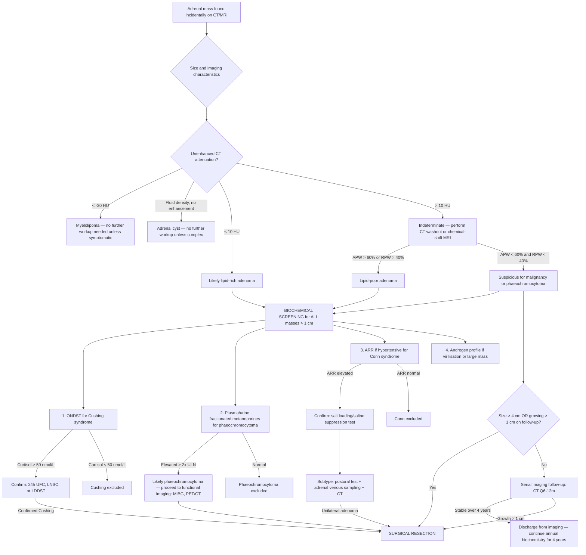

## Diagnostic Criteria and Algorithm for Adrenal Incidentaloma

### Overarching Principle

Unlike many medical conditions, adrenal incidentaloma does not have a single set of "diagnostic criteria" in the traditional sense (like the Jones criteria for rheumatic fever or the McDonald criteria for MS). Instead, the diagnosis **is** the radiological finding itself — an adrenal mass > 1 cm found incidentally. The real diagnostic challenge is the **characterisation** of that mass along two axes:

1. **Functional status**: Does it secrete hormones autonomously?
2. **Malignant potential**: Is it benign, indeterminate, or malignant?

The diagnostic algorithm is therefore a systematic characterisation pathway, not a "rule-in/rule-out" framework. Let's work through this step by step, the way you'd approach it on the ward.

---

## Step 1: Confirm the Finding and Assess Imaging Characteristics

### Unenhanced CT Attenuation — The First Branch Point

The single most useful initial discriminator is the **Hounsfield Unit (HU) attenuation on unenhanced CT**. Why? Because it directly reflects the tissue composition of the mass.

**Why does this work from first principles?**
- Adrenal cortical adenomas are packed with intracellular **lipid droplets** (cholesterol esters — the raw material for steroidogenesis). Lipid is low-density → low CT attenuation.
- Malignant tumours (ACC, metastases) and phaeochromocytomas have cellular, vascular, necrotic tissue with minimal intracellular lipid → higher attenuation.
- Myelolipomas contain macroscopic mature fat → very low attenuation (even negative HU values).

***Key CT imaging criteria for characterisation:*** [2][3]

| CT Feature | Finding | Interpretation | Why |
|:---|:---|:---|:---|
| ***Unenhanced attenuation*** | ***< 10 HU*** | ***Lipid-rich adenoma*** (sensitivity ~71%, specificity ~98%) [2][3] | Intracellular cholesterol/lipid lowers X-ray attenuation |
| Unenhanced attenuation | < −30 HU | Myelolipoma (pathognomonic) | Macroscopic mature adipose tissue |
| Unenhanced attenuation | > 10 HU | Indeterminate — needs washout study | Could be lipid-poor adenoma, phaeochromocytoma, metastasis, or ACC |
| Unenhanced attenuation | 0–20 HU, no enhancement | Adrenal cyst | Simple fluid |
| Unenhanced attenuation | > 50 HU (acute) | Adrenal haemorrhage | Fresh blood is hyperdense |
| ***Size*** | ***> 4 cm*** | ***High suspicion for malignancy*** [2][3] | ***90% of malignant adrenal tumours are > 4 cm*** [2][3] |
| ***Configuration*** | ***Homogeneous, smooth border*** | ***More likely benign*** [2][3] | Benign tumours grow slowly and concentrically without invading |
| ***Configuration*** | Heterogeneous, irregular, necrosis, calcification | Suspicious for malignancy [2][3] | Rapid growth → outstrips blood supply → necrosis; invasion → irregular border |
| ***Contrast enhancement*** | ***Malignant tumours tend to retain contrast*** [2][3] | Delayed washout = suspicious | Malignant tumours have leaky, disorganised neovascularisation → contrast pools and washes out slowly |

### Contrast-Enhanced CT Washout Study

If unenhanced attenuation is > 10 HU (the mass is "lipid-poor" and therefore indeterminate), a **CT washout protocol** is performed. This is a three-phase CT:

1. **Unenhanced phase** (baseline attenuation)
2. **Enhanced phase** (~60-90 seconds post-contrast)
3. **Delayed phase** (~15 minutes post-contrast)

Then calculate:

**Absolute percentage washout (APW)**:
$$
APW = \frac{Enhanced - Delayed}{Enhanced - Unenhanced} \times 100\%
$$

**Relative percentage washout (RPW)** (used if no unenhanced scan available):
$$
RPW = \frac{Enhanced - Delayed}{Enhanced} \times 100\%
$$

| Washout | Cut-off | Interpretation |
|:---|:---|:---|
| **Absolute washout** | **> 60%** | Adenoma (even lipid-poor) |
| **Absolute washout** | **< 60%** | Suspicious (ACC, metastasis, phaeochromocytoma) |
| **Relative washout** | **> 40%** | Adenoma |
| **Relative washout** | **< 40%** | Suspicious |

> **Why does washout work?** Adenomas have well-organised, fenestrated capillary beds → contrast enters and exits quickly (rapid washout). Malignant tumours have chaotic, leaky neovascularisation → contrast pools in the interstitium and is slow to wash out. Phaeochromocytomas are also highly vascular with slow washout.

<Callout title="Exam Pearl: The Two CT Criteria">
For the exam, remember the two key numbers for CT characterisation:
1. **Unenhanced < 10 HU** → adenoma (high specificity)
2. **Absolute washout > 60% at 15 min** → adenoma (even if lipid-poor on unenhanced)

If BOTH criteria are negative (> 10 HU AND < 60% washout), the lesion is indeterminate and requires further workup (MRI, PET/CT, or surgical resection depending on size).
</Callout>

### Chemical-Shift MRI — The Alternative to CT Washout

If CT washout is equivocal or unavailable, **chemical-shift MRI** (also called in-phase/opposed-phase MRI) can detect intracellular lipid:

- **Principle**: Water and fat protons precess at slightly different frequencies. At specific echo times, their signals are either **in-phase** (additive) or **opposed-phase** (cancel out). If a voxel contains both water and fat (as in a lipid-rich adenoma), the signal **drops** on opposed-phase images.
- **Finding**: Signal intensity index (SII) > 16.5% drop on opposed-phase = adenoma
- **Advantage**: No radiation, no contrast needed; good for pregnancy or contrast allergy
- **Limitation**: Cannot detect macroscopic fat (myelolipoma is better characterised on CT); phaeochromocytomas and metastases do NOT show signal drop (no intracellular lipid)

| MRI Feature | Classic Phaeochromocytoma Finding | Why |
|:---|:---|:---|
| **T2-weighted** | "Light bulb" bright (hyperintense) — classic but not universal (~65%) | High water content, hypervascular, cystic/necrotic areas |
| **Chemical shift** | No signal drop on opposed-phase | No intracellular lipid |
| **Post-gadolinium** | Avid heterogeneous enhancement | Highly vascular tumour |

---

## Step 2: Biochemical Screening for Hormonal Function

This is performed **in parallel** with imaging characterisation. ***All adrenal incidentalomas > 1 cm should undergo biochemical screening*** — even those that look radiologically benign — because subtle hormonal excess (particularly autonomous cortisol secretion) has metabolic and cardiovascular consequences that may change management.

### The Triple Screening Panel

***Screening tests for functional tumours: ONDST + spot ARR + 24h urine metanephrines*** [1]

| Condition | Screening Test | Cut-off / Interpretation | Confirmatory Test |
|:---|:---|:---|:---|
| ***Cushing's syndrome*** | ***1 mg ONDST*** | ***> 50 nmol/L = abnormal*** [1][4][12] | ***Low-dose DST (48h 0.5 mg Q6H)*** [1] |
| | ***24h urine free cortisol (UFC) ×2*** [4][12] | > Upper limit of normal | |
| | ***Midnight salivary cortisol ×2*** [1][4][12] | Elevated (loss of nadir) | |
| ***Conn's syndrome*** | ***Aldosterone:Renin Ratio (ARR)*** [1][5] | Elevated (typically Ald > 15 ng/dL + PRA < 1 ng/mL/h) | ***Salt loading test / Saline suppression test*** [1][13] |
| | ***RFT for hypoK*** [1] | Hypokalaemia | |
| ***Phaeochromocytoma*** | ***24h urine fractionated metanephrines*** [1][9] | ***> 2× upper limit of normal is highly suggestive*** | ***Clonidine suppression test*** [1] |
| | ***Plasma fractionated metanephrines*** [8] | ***Sensitivity 96-100%, specificity 85-89%*** [8] | |

Let's go through each in detail.

---

### A. Screening for Autonomous Cortisol Secretion

#### 1 mg Overnight Dexamethasone Suppression Test (ONDST)

This is the **first-line** screening test for Cushing's syndrome in the incidentaloma setting [1][2][4][12].

***Principle:*** [4][12]
- ***Normal: dexamethasone suppresses ACTH secretion → ↓adrenal cortisol secretion*** [12]
- ***Cushing's syndrome: incomplete suppression*** [12]

***Procedure:*** [12]
- ***PO 1 mg dexamethasone at 2300h***
- ***Plasma cortisol measured at 0900h the following morning***

***Interpretation:*** [12]
- ***Normal: cortisol suppressed to < 50 nmol/L*** (1.8 µg/dL)
- ***> 50 nmol/L but < 138 nmol/L*** → **"possible autonomous cortisol secretion"** (per 2016 ESE/ENSAT guidelines)
- ***> 138 nmol/L*** (5 µg/dL) → **"autonomous cortisol secretion"** (high confidence)
- ***CS: cortisol rarely adequately suppressed*** [12]

***False positives (failed suppression in non-CS):*** [12]
- ***Enzyme-inducing drugs (e.g., anti-epileptics, rifampicin)*** → ↑dexamethasone clearance via CYP3A4 induction
- ***Women on OCP or pregnancy*** → ↑corticosteroid-binding globulin (CBG) → total cortisol appears elevated
- ***Severe depression (30-50%) or systemic illnesses (10-20%)*** → stress-related HPA activation
- ***Renal failure on dialysis***
- ***Chronic alcohol abuse*** ("pseudo-Cushing's")
- ***Marked obesity***

***False negatives (suppression despite CS; very rare < 2%):*** [12]
- ***Cyclical Cushing's syndrome*** (cortisol secretion waxes and wanes)
- ***Slow metabolism of dexamethasone*** → ↑drug level → excessive suppression

<Callout title="Why 1 mg DST Works">
Dexamethasone is a **synthetic glucocorticoid** that binds glucocorticoid receptors in the hypothalamus and pituitary → suppresses CRH and ACTH secretion → normal adrenals stop producing cortisol overnight. In Cushing's, the feedback loop is broken: either the pituitary is autonomous (Cushing's disease), the ACTH source is ectopic, or the adrenal itself is autonomous → cortisol remains elevated despite dexamethasone. The 1 mg dose is enough to suppress a normal HPA axis but NOT enough to suppress an autonomous one — that's the sweet spot for screening.
</Callout>

#### Additional Cortisol Tests

| Test | Principle | Key Points |
|:---|:---|:---|
| ***24h UFC ×2*** [4][12] | Measures total free cortisol excreted over 24h; eliminates pulsatility artefact | ***Caveat: does not distinguish physiological hypercortisolism (depression, obesity)*** [13]; problems with under-/over-collection [12] |
| ***Late-night salivary cortisol ×2*** [4][12] | Exploits loss of circadian rhythm in CS; normal nadir occurs at ~midnight | ***Caveat: not readily available*** [13]; requires LC-MS for accurate measurement; ***not suitable for shift workers*** [12] |

***Diagnostic criteria for Cushing's syndrome: ≥2 tests abnormal → diagnostic*** [1][4][13]
- ***1 mg ONDST > 50 nmol/L***
- ***24h UFC ×3*** (some say ×2)
- ***LDDST / Late-night salivary cortisol ×2 / Late-night plasma cortisol***
- ***OR: 24h UFC > 3-4× ULN*** (highly specific) [1]

#### Determining the CAUSE of Cushing's (if confirmed)

Once Cushing's is confirmed, the next step is to determine whether it is ACTH-dependent or ACTH-independent:

***Plasma ACTH:*** [8][13][14]
- ***< 1.1 pmol/L → non-ACTH-dependent CS*** (adrenal source) [14]
- ***> 3.3 pmol/L → ACTH-dependent CS*** (pituitary or ectopic) [14]

For an **adrenal incidentaloma** with confirmed Cushing's + suppressed ACTH → the diagnosis is **adrenal Cushing's** (the incidentaloma is the autonomous cortisol-secreting adenoma or carcinoma). No further localisation needed — the mass IS the source.

If ACTH is NOT suppressed (i.e., ACTH-dependent), the incidentaloma may be a coincidental finding, and you need to pursue pituitary/ectopic workup:

***Summary of biochemical findings for ACTH-dependent vs. ACTH-independent Cushing's:*** [8][13][14]

| | ***Cushing's Disease*** | ***Ectopic ACTH*** | ***Adrenal Adenoma/Carcinoma*** | ***Iatrogenic CS*** |
|:---|:---|:---|:---|:---|
| **Physiology** | ***Loss of circadian rhythm; HPA axis -ve feedback intact but at ↑set-point*** | ***Loss of circadian rhythm; -ve feedback completely lost*** | ***Loss of circadian rhythm; monoclonal cortisol-secreting tumour*** | ***Exogenous steroids → suppression of HPA axis*** |
| **Cortisol** | ***↑cortisol*** | ***↑cortisol*** | ***↑cortisol*** | ***↓cortisol (endogenous)*** |
| **LDDST** | ***No suppression*** | ***No suppression*** | ***No suppression*** | / |
| **ACTH** | ***Normal-high*** | ***Usually high (occ normal)*** | ***Almost invariably undetectable*** | ***Low*** |
| **HDDST** | ***Usually suppressed*** | ***Usually no suppression*** | ***No suppression*** | / |
| **CRH test** | ***Exaggerated rise*** | ***No significant rise above basal*** | / | / |
| **Localisation** | ***Pituitary adenoma on MRI*** | ***ACTH-secreting tumour on PET/CT*** | ***Adrenal tumour on CT abdomen*** | ***+ve drug Hx*** |

***High-dose DST:*** [8][13][14]
- ***Usually done before pituitary MRI to avoid picking up a pituitary incidentaloma*** [8]
- ***Procedure: 2 mg dexamethasone Q6H for 2 days → measure serum cortisol***
- ***Cushing's disease: ACTH secretion responsive to -ve feedback → ACTH suppressed (< 50% basal)***
- ***Ectopic ACTH: not responsive → ACTH NOT suppressed***

***CRH stimulation test (if HDDST non-diagnostic):*** [8][13][14]
- ***Procedure: 1 µg/kg CRH IV → serial ACTH and cortisol for 2h***
- ***Cushing's disease → exaggerated rise in cortisol (> 20% of baseline) and ACTH (> 50%)***
- ***Ectopic ACTH → no significant rise***

---

### B. Screening for Phaeochromocytoma

***24h urine fractionated metanephrines*** is the most commonly used screening test [1][8][9].

| Test | Sensitivity | Specificity | Notes |
|:---|:---|:---|:---|
| ***24h urine fractionated metanephrines*** | ***~98%*** | ***~98%*** [8] | Measures normetanephrine + metanephrine separately; more accurate than total catecholamines or VMA |
| ***Plasma fractionated metanephrines*** | ***96-100%*** | ***85-89%*** [8] | Highest sensitivity (best for ruling out); slightly lower specificity → more false positives |
| Urinary VMA | Lower | Lower | ***Now superseded as less accurate*** [8] |
| Urinary fractionated catecholamines | Good | Good | Measured alongside metanephrines in many labs |

***Precautions before testing:*** [8][9]
- ***Stop drugs affecting catecholamine secretion: TCAs, levodopa, α-agonists, amphetamines, methyldopa, labetalol, sotalol*** [8][9]
- ***Avoid dietary intake of caffeine, chocolate, bananas before urine collection*** [9]
- ***Urine specimen should be kept refrigerated during collection*** [9]
- Blood should be drawn **supine** for plasma metanephrines (30 min rest) to reduce false positives from sympathetic activation

**Why metanephrines rather than catecholamines?** Catecholamines are released episodically (paroxysmal), so a random sample may miss the peak. Metanephrines are produced **continuously** within the chromaffin tumour cells by COMT (catechol-O-methyltransferase) — they are always elevated if a tumour is present, regardless of paroxysms. This gives metanephrines much higher sensitivity.

***Confirmatory test: Clonidine suppression test*** [1]
- **Principle**: Clonidine is a central α₂-agonist → suppresses sympathetic outflow → lowers plasma catecholamines/metanephrines in normal individuals. In phaeochromocytoma, catecholamine production is autonomous (not centrally regulated) → NO suppression.
- **Procedure**: Baseline plasma catecholamines/normetanephrine → 300 µg clonidine PO → repeat at 3 hours
- **Positive (phaeochromocytoma)**: Failure to suppress normetanephrine by > 40% or levels remain above upper limit of normal

---

### C. Screening for Primary Hyperaldosteronism (Conn's Syndrome)

***Only performed if patient has hypertension and/or unexplained hypokalaemia*** [1][2][5]

***Plasma Aldosterone:Renin Ratio (ARR):*** [1][5]
- **Principle**: In primary hyperaldosteronism, aldosterone is autonomously elevated while renin is suppressed (because volume expansion from Na⁺ retention suppresses the RAAS feedback loop). A high ratio reflects this disconnect.
- **Interpretation**: Elevated ARR (varies by assay; general guide: aldosterone > 15 ng/dL AND ARR > 30 in conventional units) → proceed to confirmatory testing
- **Drug interference**: Many antihypertensives interfere — ideally withdraw beta-blockers, ACEi, ARBs, spironolactone, diuretics for 2-4 weeks before testing (use verapamil or doxazosin as "safe" alternatives during washout)

***RFT for hypokalaemia:*** [1]
- Classic finding but only present in ~9-37% of cases in modern series
- If present, supports diagnosis but absence does not exclude it

***Confirmatory test: Salt loading test / Saline suppression test*** [1][13]
- ***Procedure: 0.9% NaCl IV (500 mL/h) for 4h in sitting/recumbent position*** [13]
- ***Monitor BP/P and watch for signs of fluid overload*** [13]
- ***Measure renin + aldosterone post-salt loading***
- ***Normal: suppression of renin and aldosterone***
- ***Primary hyperaldosteronism: failure or inadequate suppression*** [13]

***Subtype differentiation: Adenoma vs. Bilateral Idiopathic Adrenal Hyperplasia (BIAH)*** — crucial because management differs completely [6][11][13]:

| Investigation | Adenoma (APA) | Hyperplasia (BIAH) |
|:---|:---|:---|
| ***Postural test (9 am supine → 12 nn erect)*** | ***↓Ald in 70-90% (paradoxical: ↓ACTH drive at noon)*** [11][13] | ***↑Ald in 90% (exaggerated response to ↑Ang II in erect posture)*** [11][13] |
| ***Adrenal venous sampling*** [7][11][13] | ***↑ipsilaterally, ↓contralaterally*** | ***↑bilaterally*** |
| ***CT/MRI*** [11] | ***Unilateral tumour*** | ***Normal or slightly enlarged*** |

***Adrenal venous sampling (AVS):*** [7][13]
- ***Performed from the femoral vein*** [7]
- ***Gold standard for lateralisation*** in primary hyperaldosteronism
- Technically demanding (especially right adrenal vein which drains directly into IVC — short and difficult to cannulate)
- Measures aldosterone:cortisol ratio from each adrenal vein and compares to peripheral blood
- A lateralisation ratio > 4:1 indicates a unilateral source (adenoma) → suitable for adrenalectomy

---

### D. Screening for Androgen-Secreting Tumours

***Androgen profile*** (DHEA-S, testosterone, androstenedione): ***only if virilisation present in women or if ACC suspected*** [2][3]

- DHEA-S is the most useful marker — it is almost exclusively adrenal in origin
- Very high DHEA-S ( > 700 µg/dL) in combination with a large adrenal mass is highly suspicious for ACC
- Mixed cortisol + androgen elevation is a hallmark of ACC

---

### E. Assessment for Adrenal Insufficiency

***Only relevant if:***
- Bilateral adrenal masses are found (risk of bilateral destruction → insufficiency)
- History of bilateral adrenal metastases, TB, haemorrhage, or infiltrative disease

***Tests for adrenal insufficiency:*** [15][16]
- ***Basal plasma ACTH + cortisol***: Primary insufficiency → ↑ACTH + ↓cortisol; Secondary → ↓ACTH + ↓cortisol
- ***Short Synacthen Test (SST)***: ***250 µg synacthen IV/IM bolus → serum cortisol at 0, 30, 60 min*** [15][16]
  - ***Peak cortisol > 550 nmol/L = normal***
  - ***< 400 nmol/L = abnormal (adrenal insufficiency)***
  - 400-550 nmol/L = borderline → may need insulin tolerance test

---

## Step 3: Functional Imaging (When Indicated)

### MIBG Scan

***Clinical indications:*** [10]
- ***Diagnosis of phaeochromocytoma, neuroblastoma, or other APUD cell tumours***
- ***Staging and follow-up***
- ***Detection of metastasis and recurrent disease***
- ***Plan for MIBG therapy***

***Principle:*** [10]
- ***MIBG (meta-iodobenzylguanidine) is an analogue of norepinephrine***
- ***Reuptake into norepinephrine-secreting cells*** (sympathetic nerve endings, adrenal medullary cells)
- Radiopharmaceutical: ***131I-MIBG*** or ***123I-MIBG***

***Performance for phaeochromocytoma:*** [10]
- ***Sensitivity 85%, specificity 95%***
- ***CT/MRI more accurate in primary tumours but MIBG more sensitive for extra-adrenal tumours*** [10]

***Physiological distribution:*** [10]
- ***Liver and spleen, myocardium, salivary glands and thyroid, normal adrenals, nasal mucosa, bladder, colon***
- ***Thyroid blockade should be used*** (e.g., Lugol's iodine) to prevent thyroid damage from radioiodine [10]

### PET/CT

***Radiopharmaceuticals used:*** [10]
- ***SPECT tracers: 123I or 131I-MIBG, In-111 octreotide***
- ***PET/CT tracers: 18F-FDA, 18F-DOPA, 11C-epinephrine, 18F-FDG, 68Ga-DOTATATE***

| Tracer | Best For | Principle |
|:---|:---|:---|
| **18F-FDG** | ACC, metastases, aggressive/malignant phaeochromocytoma | Glucose analogue taken up by metabolically active (malignant) cells |
| **68Ga-DOTATATE** | Neuroendocrine tumours with somatostatin receptors | Binds somatostatin receptors → identifies well-differentiated NETs |
| **18F-DOPA** | Paragangliomas, phaeochromocytoma | Amino acid precursor taken up by catecholamine-producing cells |

---

## Step 4: Biopsy (Rarely Indicated)

***Biopsy: rarely indicated*** [2][3]
- ***Usually only reserved for confirmation of adrenal metastasis*** (in patients with known extra-adrenal malignancy and an indeterminate adrenal mass where the result would change management)
- ***NOT for primary adrenal tumours*** [2][3]

***Why NOT biopsy primary adrenal tumours:*** [2][3]
1. ***Histology is NOT useful in differentiating benign from malignant adrenal cortical tumours*** (they look the same microscopically — the Weiss score requires the whole resection specimen)
2. ***Risk of precipitation of HTN crisis*** if the mass is an undiagnosed phaeochromocytoma
3. ***Risk of tumour seeding*** along the biopsy tract (especially concerning for ACC)

***Contraindications to adrenal biopsy:*** [7]
- ***Uncorrected bleeding diathesis (platelet < 50,000/mm³ or INR > 1.5)***
- ***Inaccessible lesion***
- ***Uncooperative or unwilling patient***
- **Phaeochromocytoma not excluded** (must check metanephrines first)

<Callout title="The Biopsy Rule" type="error">
Never biopsy an adrenal mass until **phaeochromocytoma has been biochemically excluded**. Never biopsy if the clinical question is "adenoma vs. ACC" — histology cannot answer this reliably on a needle sample. The only valid indication is **confirming metastatic disease** when this would change the management of the primary cancer.
</Callout>

---

## Master Diagnostic Algorithm

---

## Follow-Up Protocol for Non-Operated Incidentalomas

For masses that are **non-functional AND radiologically benign AND < 4 cm**:

***Imaging follow-up:*** [1]
- ***CT abdomen Q6 months for 4 years*** (some guidelines: repeat at 6-12 months, then annually if stable)
- If any ***growth > 1 cm*** → surgical resection [1][2][3]
- If ***> 0.5 cm growth in 6 months*** → highly suspicious → consider surgery [1]

***Biochemical follow-up:*** [1]
- ***Annual biochemical screening (ONDST, metanephrines, ± ARR) for 4 years*** [1]
- Rationale: Some non-functional adenomas can develop autonomous secretion over time (estimated ~5-20% over 5 years)

***After 4 years:*** If mass has been stable in size and non-functional throughout → low risk of subsequent change → can consider discharge from follow-up (per 2016 ESE/ENSAT guidelines). Some clinicians continue annual biochemistry indefinitely if the mass persists.

---

## Summary: Investigations at a Glance

| Investigation Category | Specific Test | Purpose | Key Finding |
|:---|:---|:---|:---|
| **Imaging — Initial** | Unenhanced CT attenuation | Characterise tissue composition | < 10 HU = adenoma; < −30 HU = myelolipoma |
| **Imaging — Washout** | CT washout protocol | Discriminate adenoma from non-adenoma | APW > 60% = adenoma |
| **Imaging — MRI** | Chemical-shift MRI | Detect intracellular lipid | Signal drop on opposed-phase = adenoma |
| **Imaging — MRI** | T2-weighted MRI | Characterise phaeochromocytoma | "Light bulb" hyperintensity |
| **Biochemistry — Cortisol** | 1 mg ONDST | Screen for Cushing's | Cortisol > 50 nmol/L = abnormal |
| **Biochemistry — Cortisol** | 24h UFC, LNSC | Confirm Cushing's | Elevated |
| **Biochemistry — Cortisol** | Plasma ACTH | Determine ACTH-dependent vs. independent | < 1.1 pmol/L = adrenal; > 3.3 pmol/L = pituitary/ectopic |
| **Biochemistry — Catecholamines** | 24h urine fractionated metanephrines | Screen for phaeochromocytoma | Elevated normetanephrine/metanephrine |
| **Biochemistry — Catecholamines** | Plasma fractionated metanephrines | Screen for phaeochromocytoma | Sensitivity 96-100% |
| **Biochemistry — Aldosterone** | Plasma ARR | Screen for Conn's (if HTN) | Elevated ratio |
| **Biochemistry — Aldosterone** | Salt loading / saline suppression | Confirm Conn's | Failure to suppress aldosterone |
| **Biochemistry — Androgens** | DHEA-S, testosterone | Screen for androgen excess / ACC | Elevated |
| **Functional Imaging** | 123I/131I-MIBG scan | Localise phaeochromocytoma, extra-adrenal disease | Uptake in tumour; Sens 85%, Spec 95% |
| **Functional Imaging** | 18F-FDG PET/CT | Detect malignancy, metastases | Avid uptake in aggressive tumours |
| **Functional Imaging** | 68Ga-DOTATATE PET/CT | NETs, paragangliomas | Uptake at somatostatin receptor-expressing tumours |
| **Interventional** | Adrenal venous sampling | Lateralise aldosterone source in Conn's | Lateralisation ratio > 4:1 = unilateral |
| **Interventional** | CT-guided biopsy | Confirm metastasis ONLY | Only if known primary malignancy and result changes management |
| **Adrenal insufficiency** | Short Synacthen Test | Assess adrenal reserve (bilateral masses) | Peak cortisol > 550 nmol/L = normal |

---

<Callout title="High Yield Summary — Diagnosis of Adrenal Incidentaloma">

**Two parallel assessments**: (1) Imaging characterisation for malignant potential. (2) Biochemical screening for hormonal function.

**CT attenuation is the first branch point**: < 10 HU = lipid-rich adenoma (specificity ~98%). > 10 HU = indeterminate → CT washout (APW > 60% = adenoma) or chemical-shift MRI.

**Triple biochemical screen for ALL incidentalomas > 1 cm**: 1 mg ONDST + plasma/urine metanephrines + ARR (if hypertensive).

**ONDST interpretation**: Cortisol < 50 nmol/L = normal. 50-138 nmol/L = possible autonomous cortisol secretion. > 138 nmol/L = autonomous cortisol secretion.

**Plasma ACTH determines the source of Cushing's**: < 1.1 pmol/L = adrenal (non-ACTH-dependent). > 3.3 pmol/L = pituitary or ectopic (ACTH-dependent).

**Metanephrines must ALWAYS be checked before biopsy or surgery** — undiagnosed phaeochromocytoma can cause fatal crisis.

**Biopsy**: ONLY for confirming metastasis. NOT for primary adrenal lesions. Histology cannot differentiate benign from malignant adrenal cortical tumours on needle biopsy.

**Follow-up for non-operated masses**: CT Q6-12 months + annual biochemistry for 4 years. Growth > 1 cm → surgery.

**Adrenal venous sampling**: Gold standard for lateralising aldosterone source in Conn's syndrome.

</Callout>

---

<ActiveRecallQuiz
  title="Active Recall - Diagnostic Criteria and Algorithm for Adrenal Incidentaloma"
  items={[
    {
      question: "A 55-year-old woman has a 2.5 cm adrenal mass found incidentally on CT. Unenhanced attenuation is 4 HU. What is the most likely diagnosis and what biochemical tests would you order?",
      markscheme: "Most likely a lipid-rich adrenal adenoma (attenuation less than 10 HU, sensitivity 71%, specificity 98%). Biochemical screening: (1) 1 mg overnight dexamethasone suppression test for Cushing syndrome, (2) 24h urine or plasma fractionated metanephrines for phaeochromocytoma, (3) aldosterone-to-renin ratio if hypertensive for Conn syndrome. Androgen profile only if virilisation.",
    },
    {
      question: "Explain the principle behind CT contrast washout for adrenal mass characterisation. What are the cut-offs for absolute and relative percentage washout?",
      markscheme: "Adenomas have well-organised capillary beds so contrast enters and exits quickly (rapid washout). Malignant tumours have leaky disorganised neovascularisation causing contrast to pool and wash out slowly. Absolute percentage washout greater than 60% at 15 minutes suggests adenoma. Relative percentage washout greater than 40% suggests adenoma.",
    },
    {
      question: "Why are metanephrines superior to catecholamines for screening phaeochromocytoma?",
      markscheme: "Catecholamines are released episodically/paroxysm so a single sample may miss the peak. Metanephrines are produced continuously within chromaffin tumour cells by COMT metabolism, so they are constantly elevated regardless of paroxysms. This gives metanephrines much higher sensitivity (96-100% for plasma, 98% for 24h urine).",
    },
    {
      question: "List the causes of false positive results on the 1 mg overnight dexamethasone suppression test.",
      markscheme: "Enzyme-inducing drugs (anti-epileptics, rifampicin) increasing dexamethasone clearance; OCP or pregnancy (increased CBG raising measured total cortisol); severe depression (30-50%); systemic illness (10-20%); renal failure on dialysis; chronic alcohol abuse (pseudo-Cushing); marked obesity.",
    },
    {
      question: "A patient with an adrenal incidentaloma has a confirmed elevated ARR and failure to suppress aldosterone on salt loading test. What further investigation is essential before deciding on surgery, and what result would indicate a unilateral adenoma?",
      markscheme: "Adrenal venous sampling (AVS) is essential for lateralisation. A lateralisation ratio greater than 4:1 (aldosterone:cortisol ratio from one adrenal vein compared to the other) indicates a unilateral aldosterone-producing adenoma suitable for adrenalectomy. Also perform a postural test: paradoxical decrease in aldosterone at noon (ACTH-dependent) supports adenoma versus increase (angiotensin-dependent) supporting BIAH.",
    },
    {
      question: "In the follow-up protocol for a non-operated adrenal incidentaloma, what imaging and biochemical intervals are recommended, and what triggers surgical resection?",
      markscheme: "Imaging: CT abdomen every 6-12 months for approximately 4 years. Biochemical: annual ONDST and metanephrines (plus ARR if hypertensive) for 4 years. Triggers for surgery: (1) mass grows more than 1 cm on follow-up, (2) mass develops new functional activity, (3) mass develops suspicious radiological features (increasing heterogeneity, loss of smooth borders, contrast retention).",
    },
  ]}
/>

## References

[1] Senior notes: maxim.md (Adrenal incidentaloma section, pp. 432-434)
[2] Senior notes: Ryan Ho Endocrine.pdf (Section 3.5 Adrenal Incidentaloma, p. 68)
[3] Senior notes: Ryan Ho Fundamentals.pdf (Section B: Adrenal Incidentaloma, p. 438)
[4] Senior notes: Ryan Ho Chemical Path.pdf (Section 4.1 Diagnosis of Cushing Syndrome, p. 29)
[5] Senior notes: Ryan Ho Cardiology.pdf (Secondary hypertension table, p. 178)
[6] Senior notes: maxim.md (Conn's syndrome DDx, pp. 434-435)
[7] Senior notes: Ryan Ho Diagnostic Radiology.pdf (Interventional radiology and adrenal venous sampling, p. 79)
[8] Senior notes: Ryan Ho Endocrine.pdf (Phaeochromocytoma diagnosis, pp. 66-67)
[9] Senior notes: felixlai.md (Phaeochromocytoma diagnosis, pp. 1536-1537)
[10] Senior notes: Ryan Ho Diagnostic Radiology.pdf (MIBG scan and functional imaging, pp. 71-72)
[11] Senior notes: Ryan Ho Endocrine.pdf (Conn's adenoma vs. hyperplasia, p. 59)
[12] Senior notes: Ryan Ho Chemical Path.pdf (1 mg ONDST — procedure and interpretation, p. 30)
[13] Senior notes: Ryan Ho Fundamentals.pdf (Cushing's syndrome workup and Conn's subtyping, pp. 434-437)
[14] Senior notes: Adrian Lui Pediatrics.pdf (Cushing's syndrome approach and biochemical summary, pp. 286-287)
[15] Senior notes: Ryan Ho Endocrine.pdf (Adrenal insufficiency diagnosis and Synacthen test, p. 71)
[16] Senior notes: Adrian Lui Pediatrics.pdf (Adrenal insufficiency diagnosis, p. 280)
