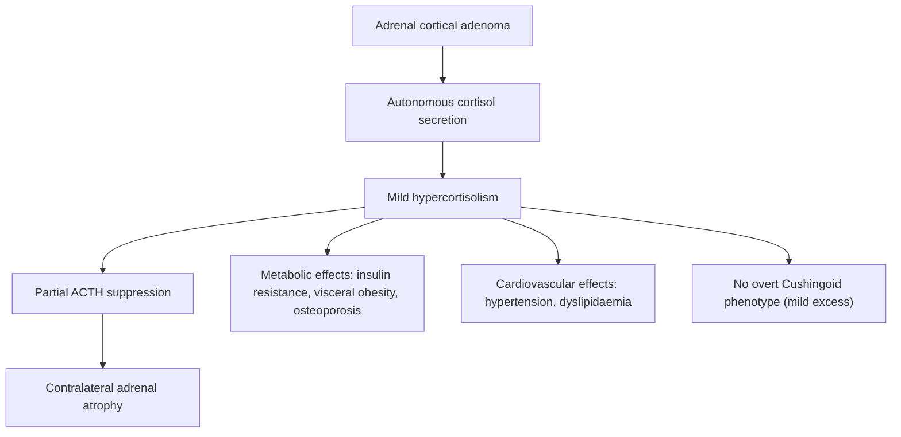
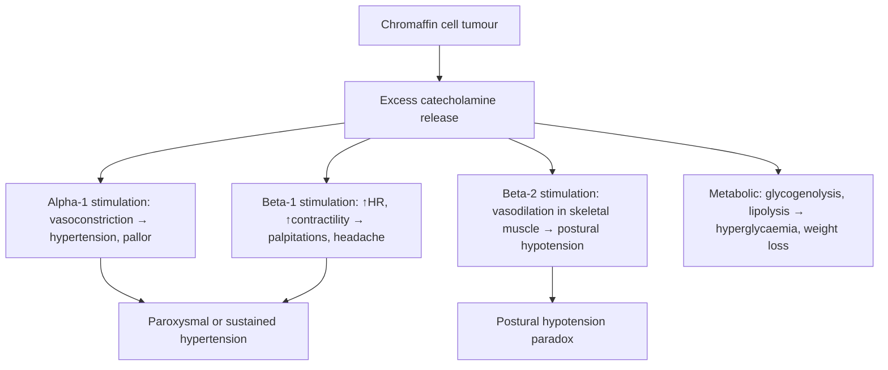
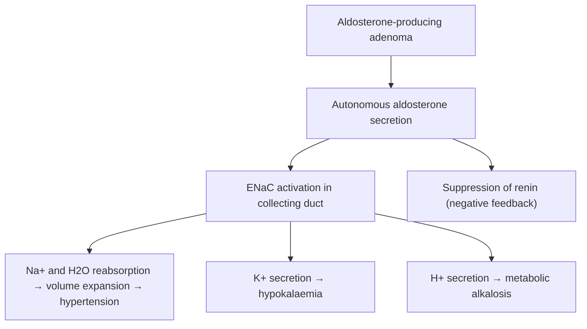

## Definition

**Adrenal incidentaloma** is defined as an ***adrenal mass > 1 cm in diameter incidentally found on radiological investigation*** (CT, MRI, or other imaging) performed for a reason **unrelated** to suspected adrenal disease [1][2].

Let's break the name down:
- "Adrenal" = relating to the adrenal (Latin: *ad-* = near, *renes* = kidney) glands sitting atop each kidney.
- "Incidentaloma" = "incidental" + "-oma" (tumour/mass) — a mass found *by accident*.

The term is a **radiological diagnosis**, not a pathological one. It encompasses a heterogeneous group of lesions — the clinical challenge is determining two critical questions:

1. **Is it functional?** (i.e., does it secrete hormones autonomously?)
2. **Is it malignant?** (i.e., does it need surgical removal?)

<Callout title="The Two Big Questions">
Every adrenal incidentaloma must be evaluated for **hormonal function** and **malignant potential**. This drives the entire diagnostic and management algorithm. ***"Functional? Malignant potential?"*** [1]
</Callout>

---

## Epidemiology

### Prevalence
- ***Present in up to 10% of adults*** on imaging studies, and **~2-4% in autopsy studies** (10-15% bilateral at autopsy) [2][3]
- ***Incidence on CT: 0.5–4.5%*** — this rises with age [1]
- Prevalence increases markedly with age:
  - < 30 years: ~1%
  - 50–60 years: ~3-4%
  - \> 70 years: ~7-10%
- With the explosion of cross-sectional imaging (CT scans for trauma, staging, abdominal pain, etc.), adrenal incidentalomas are discovered with increasing frequency — a modern "epidemic" of incidental findings.

### Demographics
- Slight **female preponderance** for non-functioning adenomas
- No clear ethnic predisposition, though studies from Hong Kong and East Asia report similar prevalence figures to Western data
- In Hong Kong, the high utilisation of CT for cancer staging and health screening means adrenal incidentalomas are commonly encountered in clinical practice

### Key Epidemiological Context
- ***Most are asymptomatic*** — the mass is usually found during imaging for an unrelated condition [2][3]
- ***Non-functioning adenoma accounts for ~85% of cases*** [2][3]
- The probability of malignancy depends heavily on patient context:
  - In patients **without** known extra-adrenal malignancy: primary adrenal carcinoma is **rare** (~2-5%)
  - In patients **with** known extra-adrenal malignancy (e.g., lung, breast, melanoma, renal): up to **50-75%** of adrenal masses may be metastases

---

## Risk Factors

| Risk Factor | Explanation |
|:---|:---|
| **Increasing age** | Prevalence of adrenal adenomas rises with age due to cumulative somatic mutations and nodular cortical hyperplasia |
| **Obesity / Metabolic syndrome** | Associated with subclinical autonomous cortisol secretion (previously called "subclinical Cushing's") |
| **Hypertension / Diabetes** | Higher detection rate in these populations (both from more frequent imaging AND from functional tumours causing these conditions) |
| **Known extra-adrenal malignancy** | Lung, breast, melanoma, RCC, lymphoma are the most common cancers to metastasise to the adrenal glands |
| **Genetic syndromes** | MEN2, VHL, NF-1, Carney complex, Li-Fraumeni, Beckwith-Wiedemann → hereditary adrenal tumours |
| **Frequent imaging** | Health screening CT, trauma CT, cancer staging → more incidental findings |

---

## Anatomy and Function of the Adrenal Glands

Understanding adrenal incidentalomas requires a solid grasp of adrenal anatomy, because the **location within the gland determines the type of tumour and the hormones it may secrete**.

### Gross Anatomy
- The adrenal glands are **paired retroperitoneal organs** sitting on the superomedial aspect of each kidney
- **Right adrenal**: pyramidal/triangular shape, sits posterior to the IVC and right lobe of liver, above the right kidney
- **Left adrenal**: semilunar/crescent shape, sits medial to the upper pole of left kidney, posterior to the pancreatic tail and splenic vessels
- Each gland weighs ~4-6 g and measures ~3 × 5 cm
- Blood supply: superior (from inferior phrenic artery), middle (from aorta), inferior (from renal artery) adrenal arteries
- Venous drainage: **right adrenal vein → IVC directly** (short, ~1 cm — important for adrenal vein sampling and surgery); **left adrenal vein → left renal vein**

<Callout title="Surgical Anatomy Pearl" type="idea">
The **right adrenal vein drains directly into the IVC** — this makes right adrenalectomy slightly more dangerous (risk of IVC injury). The **left adrenal vein** drains into the left renal vein — remember this for adrenal vein sampling in Conn's syndrome and for surgical planning.
</Callout>

### Histological Zones

The adrenal gland has two embryologically distinct regions:

**Adrenal Cortex** (mesoderm-derived, ~90% of gland mass):

| Zone | Hormone | Regulator | Mnemonic |
|:---|:---|:---|:---|
| **Zona Glomerulosa** (outermost) | Aldosterone (mineralocorticoid) | Renin-Angiotensin-Aldosterone System (RAAS), K⁺ | **G**lomerulosa = **G**o for salt (aldosterone) |
| **Zona Fasciculata** (middle, thickest) | Cortisol (glucocorticoid) | ACTH (from pituitary, driven by CRH from hypothalamus) | **F**asciculata = **F**uel (cortisol for metabolism) |
| **Zona Reticularis** (innermost) | Androgens (DHEA, DHEA-S, androstenedione) | ACTH | **R**eticularis = **R**eally sexy (androgens) |

> Mnemonic for layers (superficial → deep): **GFR** (like the renal GFR) = Glomerulosa, Fasciculata, Reticularis
> Mnemonic for hormones: **Salt, Sugar, Sex** (from outside in)

**Adrenal Medulla** (neural crest-derived):
- Composed of **chromaffin cells** — modified postganglionic sympathetic neurons
- Secretes **catecholamines**: mainly **adrenaline (epinephrine, ~80%)** and **noradrenaline (norepinephrine, ~20%)**
- Catecholamine synthesis pathway: Tyrosine → DOPA → Dopamine → **Norepinephrine** → (via PNMT, a ***cortisol-induced enzyme***) → **Epinephrine** [1]
- Catecholamine metabolism: Norepinephrine → **Normetanephrine**; Epinephrine → **Metanephrine** (via COMT = catechol-O-methyltransferase) — these **metanephrines** are measured in screening for phaeochromocytoma

<Callout title="Why Is PNMT Important?">
Phenylethanolamine N-methyltransferase (PNMT) converts norepinephrine to epinephrine and is **induced by cortisol**. The adrenal medulla is bathed in high-concentration cortisol from the overlying cortex via the portal venous system. This is why **adrenal** phaeochromocytomas can produce epinephrine, but **extra-adrenal** paragangliomas (which lack this cortisol-rich environment) typically produce only norepinephrine.
</Callout>

### Functional Relevance to Incidentalomas

- **Cortical tumours** → may secrete cortisol (Cushing's), aldosterone (Conn's), or androgens
- **Medullary tumours** → may secrete catecholamines (phaeochromocytoma)
- **Non-functioning tumours** → no hormone excess; still need assessment for malignancy
- **Metastases** → usually non-functional but can rarely destroy enough gland to cause adrenal insufficiency

---

## Aetiology

This is the core of understanding adrenal incidentalomas. The causes span a wide spectrum from completely benign, non-functional lesions to aggressive malignancies.

### Overview of Causes

***Benign:***
- ***Non-functional ~90%***: ***adenoma (most common)***, *cyst, haematoma/haemorrhage, haemangioma, myelolipoma, ganglioneuroma* [1]
- ***Functional***: ***subclinical Cushing's syndrome (~6%), phaeochromocytoma (~5%), Conn's syndrome (~1%)*** [1]

***Malignant:***
- ***Primary***: *adrenocortical carcinoma (ACC), malignant phaeochromocytoma* [1]
- ***Secondary (more common than primary malignancy)***: *metastases from lung, breast, melanoma, RCC, lymphoma* [1]

### Detailed Aetiology by Category

#### A. Non-Functioning Cortical Adenoma (Most Common, ~85%)
- Benign clonal proliferation of adrenocortical cells
- Usually unilateral, < 4 cm, well-circumscribed, homogeneous
- **Lipid-rich** (intracellular cholesterol and lipid droplets used for steroidogenesis) → characteristically **low attenuation on unenhanced CT ( < 10 HU)** and rapid contrast washout ( > 50% absolute washout at 15 minutes)
- Pathophysiology: Somatic mutations in various genes (e.g., CTNNB1 for β-catenin, PRKACA for cortisol-secreting ones) drive clonal expansion. Most remain non-functional.

#### B. Subclinical Autonomous Cortisol Secretion (Formerly "Subclinical Cushing's Syndrome," ~5-20%)
- Autonomous cortisol production **without the overt clinical phenotype** of Cushing's syndrome
- Modern terminology (per 2016 ESE/ENSAT guidelines and 2023 updates): **"autonomous cortisol secretion" (ACS)** or **"possible ACS"** rather than "subclinical Cushing's"
- Important because it is associated with increased cardiovascular risk, metabolic syndrome, osteoporosis, and increased mortality even without overt Cushing's
- Pathophysiology: Cortical adenoma cells express constitutively active ACTH-independent cortisol production → mild cortisol excess → partial suppression of ACTH → contralateral adrenal may atrophy

#### C. Phaeochromocytoma (~5-7%)
- Catecholamine-secreting tumour from **chromaffin cells of the adrenal medulla**
- "Phaeo" (Greek *phaios*) = dusky/dark, "chromo" = colour, "cytoma" = cell tumour — named because the tumour cells turn dark brown when stained with chromium salts (chromaffin reaction)

***Epidemiology — "Rule of 10" (traditional, now considered outdated):*** [4][5]
- ***10% Children***
- ***10% Familial (MEN2/VHL/NF-1)*** (***up to 24-40%***)
- ***10% Extra-adrenal (paraganglioma)*** (***up to 15-20%***)
- ***10% Bilateral***
- ***10% Malignant*** (***up to 8-36%***)
- ***10% Not associated with hypertension***
- ***10% Recurrence***

> The ***"traditional rule of 10 is no longer valid"*** [5] — genetic testing has revealed much higher familial rates (~40%), and malignancy/extra-adrenal rates are also higher than traditionally taught.

***Aetiology of phaeochromocytoma:*** [5][6]
- ***Sporadic (most common)***
- ***Familial (AD inheritance):***
  - ***NF1*** (neurofibromatosis type 1)
  - ***MEN2 (RET oncogene):*** ***MEN2A*** (phaeochromocytoma + medullary thyroid carcinoma + parathyroid hyperplasia), ***MEN2B*** (phaeochromocytoma + MTC + mucosal neuromas) [4]
  - ***Von Hippel-Lindau disease*** (retinal and cerebral haemangioblastoma, cystic RCC, phaeochromocytoma) [5]
  - ***Carney triad*** (***GIST + pulmonary chondroma + paragangliomas***): *succinate dehydrogenase gene mutation* [6]
  - ***Paraganglioma syndrome (PGL) types 1-4***: H&N paragangliomas [5]

***Paraganglioma definition:*** [6]
- ***Paraganglioma: tumour arising from chromaffin cells of sympathetic / parasympathetic nervous system***
  - ***Sympathetic paraganglioma***: usually catecholamine-secreting (i.e., "extra-adrenal phaeochromocytoma"), located along the sympathetic chain
  - ***Parasympathetic paraganglioma***: usually **non-functional**, located in neck / skull base
- ***Extra-adrenal sites: para-aortic (75%), urinary bladder (10%), thorax (10%), skull base / neck / pelvis (5%)*** [6]
- The **Organ of Zuckerkandl** (para-aortic body at the aortic bifurcation) is the most common extra-adrenal site [6]

#### D. Primary Hyperaldosteronism / Conn's Syndrome (~1%)
- Aldosterone-producing adenoma (APA) in the zona glomerulosa
- Causes **hypertension + hypokalaemia + metabolic alkalosis**
- Pathophysiology: Autonomous aldosterone secretion → Na⁺/H₂O retention → volume expansion → hypertension; K⁺ wasting → hypokalaemia; H⁺ wasting → metabolic alkalosis

#### E. Adrenocortical Carcinoma (ACC, ~2-5% of incidentalomas)
- Rare but aggressive malignancy of the adrenal cortex
- Incidence: ~0.7-2 per million per year
- Bimodal age distribution: children < 5 years and adults 40-50 years
- ~60% are functional (cortisol ± androgens most common; pure androgen-secreting or oestrogen-secreting tumours also occur)
- Usually large ( > 4 cm, often > 6 cm) at diagnosis
- Pathophysiology: Associated with TP53 mutations (Li-Fraumeni syndrome), IGF-2 overexpression, Wnt/β-catenin pathway activation, Beckwith-Wiedemann syndrome (11p15 imprinting defect)
- Poor prognosis: 5-year survival ~35-60% overall, < 15% if metastatic

#### F. Adrenal Metastases
- The adrenal gland is a **common site for metastatic disease** — the third most common site after lung and liver
- Most common primaries: **lung (most common), breast, melanoma, RCC, lymphoma**
- In patients with known extra-adrenal malignancy and a new adrenal mass, the probability of metastasis is **50-75%**
- Usually non-functional, but bilateral extensive metastases can rarely cause **adrenal insufficiency** (Addisonian crisis)
- Pathophysiology: Rich arterial blood supply of the adrenal glands + sinusoidal vascular architecture facilitates haematogenous tumour seeding

#### G. Myelolipoma
- Benign tumour composed of mature adipose tissue and haematopoietic elements
- Characteristic appearance: **very low (fat) attenuation on CT (often < -30 HU)** — essentially diagnostic
- Non-functional, usually incidental
- Only requires surgical intervention if very large ( > 6 cm) or symptomatic (haemorrhage)

#### H. Adrenal Cysts and Haemorrhage
- Adrenal cysts: endothelial cysts, pseudocysts, parasitic cysts (echinococcus in endemic areas)
- Adrenal haemorrhage: can occur in trauma, anticoagulation, sepsis (Waterhouse-Friderichsen syndrome in meningococcal sepsis), postoperative, or neonatal stress

#### I. Other Rare Causes
- **Ganglioneuroma**: benign tumour of the sympathetic ganglia, usually non-functional
- **Granulomatous disease**: TB (important in Hong Kong), histoplasmosis, sarcoidosis — can cause bilateral adrenal enlargement and eventually adrenal insufficiency
- **Congenital adrenal hyperplasia**: bilateral adrenal hyperplasia in untreated or under-treated CAH
- **Amyloidosis**: infiltrative, can cause adrenal insufficiency

<Callout title="Hong Kong Context" type="idea">
In Hong Kong, consider **TB** as an important cause of bilateral adrenal enlargement/calcification. Adrenal TB can present as Addison's disease and is still seen, especially in elderly patients or those from endemic areas. Also, given the high prevalence of hepatocellular carcinoma and lung cancer in Hong Kong, adrenal **metastases** are commonly encountered.
</Callout>

---

## Pathophysiology of Key Functional Adrenal Incidentalomas

### Autonomous Cortisol Secretion (Subclinical Cushing's)

- Why no overt Cushing's? The cortisol excess is **mild and chronic** — insufficient to produce florid clinical features but enough to contribute to metabolic syndrome and cardiovascular morbidity over years.

### Phaeochromocytoma

- **Why postural hypotension in a hypertensive tumour?** Chronic catecholamine excess causes: (1) **volume contraction** from pressure natriuresis, (2) **downregulation of adrenergic receptors**, and (3) **desensitisation of baroreceptors**. When the patient stands, the reflex compensatory mechanisms are blunted → orthostatic drop.

### Conn's Syndrome (Primary Hyperaldosteronism)

---

## Classification of Adrenal Incidentalomas

### By Functional Status

| Category | Examples | Approximate Frequency |
|:---|:---|:---|
| **Non-functional** | Adenoma, myelolipoma, cyst, haematoma, ganglioneuroma | ~75-85% |
| **Functional** | Subclinical Cushing's (5-20%), Phaeochromocytoma (5-7%), Conn's (1-2%), Androgen-secreting (rare) | ~15-25% |

### By Malignant Potential

| Category | Examples |
|:---|:---|
| **Benign** | Adenoma, myelolipoma, cyst, ganglioneuroma, haematoma |
| **Malignant — Primary** | Adrenocortical carcinoma, malignant phaeochromocytoma |
| **Malignant — Secondary** | Metastases (lung, breast, melanoma, RCC, lymphoma) |
| **Indeterminate** | Lesions with atypical imaging features requiring follow-up or further workup |

### By Imaging Characteristics (CT-Based)

| Feature | Likely Benign Adenoma | Suspicious for Malignancy |
|:---|:---|:---|
| **Size** | < 4 cm | ***> 4 cm (90% malignant tumours are > 4 cm)*** [2][3] |
| **Configuration** | ***Homogeneous, smooth border*** [2][3] | Irregular margins, heterogeneous, necrosis, calcification |
| **Lipid content (HU)** | ***< 10 HU on unenhanced CT (lipid-rich)*** [2][3] | > 10 HU (lipid-poor) |
| **Contrast washout** | ***Rapid washout (> 50% absolute, > 40% relative at 15 min)*** | Slow washout (contrast retention) → ***malignant tumours tend to retain contrast*** [2][3] |
| **Growth** | Stable over time | ***> 1 cm growth → suspicious*** [2][3] |

<Callout title="Key CT Features for Benign vs. Malignant" type="error">
A common exam mistake is forgetting the specific HU cut-off. **Unenhanced CT attenuation < 10 HU** strongly suggests a **lipid-rich adenoma** (sensitivity ~71%, specificity ~98%). If > 10 HU, contrast washout studies or chemical-shift MRI are needed. **Size > 4 cm is the most important size threshold** for considering surgical resection. ***90% of malignant adrenal tumours are > 4 cm*** [2][3].
</Callout>

---

## Clinical Features

### Important Principle

***Most adrenal incidentalomas are asymptomatic*** — that's the definition (found incidentally). However, a thorough history and examination must be performed to detect subtle signs of hormone excess or malignancy that may have been previously overlooked.

### A. Symptoms

#### 1. Symptoms Suggesting Cushing's Syndrome / Autonomous Cortisol Secretion

| Symptom | Pathophysiological Basis |
|:---|:---|
| **Weight gain (central)** | Cortisol promotes visceral adipogenesis via upregulation of lipoprotein lipase in visceral fat; also causes insulin resistance → hyperinsulinaemia → lipogenesis |
| **Proximal muscle weakness** | Cortisol causes protein catabolism in skeletal muscle → myopathy |
| **Easy bruising** | Cortisol inhibits collagen synthesis → thin, fragile capillaries and skin |
| **Mood changes, depression, insomnia** | Cortisol crosses BBB, affects hippocampal and limbic system glucocorticoid receptors |
| **Polyuria, polydipsia** | Hyperglycaemia (cortisol → gluconeogenesis + insulin resistance) → osmotic diuresis; also cortisol inhibits ADH |
| ***Diabetes*** | ***Cortisol promotes hepatic gluconeogenesis + peripheral insulin resistance*** [1] |
| **Menstrual irregularity (women)** | Cortisol suppresses GnRH pulsatility → ↓LH/FSH |
| **Recurrent infections** | Cortisol is immunosuppressive (↓T-cell function, ↓inflammatory cytokines) |

#### 2. Symptoms Suggesting Phaeochromocytoma

| Symptom | Pathophysiological Basis |
|:---|:---|
| ***Classic triad: paroxysmal headache + sweating + palpitations*** [1][5][6] | **Headache**: sudden hypertension → ↑intracranial arterial pressure. **Sweating (perspiration)**: direct sympathetic activation of eccrine sweat glands. **Palpitations**: β₁-adrenergic stimulation → ↑HR and ↑contractility |
| ***Episodic/paroxysmal hypertension*** [5][6] | Intermittent catecholamine release → α₁-mediated vasoconstriction |
| **Anxiety, tremor, panic-like episodes** | β-adrenergic stimulation of CNS and peripheral sympathetic system; especially common in **adrenaline-producing** tumours (adrenaline has greater β₂ effects → tremor, anxiety) [5] |
| **Pallor during attacks** | α₁-mediated cutaneous vasoconstriction (note: NOT flushing — this is a classic distinguishing feature from carcinoid) [6] |
| **Weight loss** | Catecholamine-driven hypermetabolism (↑basal metabolic rate, ↑lipolysis, ↑glycogenolysis) |
| ***Pressor response during procedures or with certain drugs (TCA, IV contrast) or food (cheese)*** [6] | Tyramine-containing foods, drugs that block noradrenaline reuptake (TCAs), or contrast agents can precipitate massive catecholamine release from tumour |

> ***The "5 P's" of Phaeochromocytoma: Pressure (HT), Pain (headache, chest pain), Palpitation, Perspiration, Pallor (vasoconstriction)*** [6]

***Phaeochromocytoma crisis: APO, ICH*** — acute pulmonary oedema (from catecholamine-induced cardiomyopathy + afterload) and intracranial haemorrhage (from severe hypertension) [6]

#### 3. Symptoms Suggesting Conn's Syndrome (Primary Hyperaldosteronism)

| Symptom | Pathophysiological Basis |
|:---|:---|
| ***Hypertension (often resistant)*** | Aldosterone → Na⁺/H₂O retention → volume expansion |
| **Muscle cramps, weakness** | Hypokalaemia → impaired muscle cell repolarisation |
| **Polyuria, nocturia** | Hypokalaemia → nephrogenic diabetes insipidus (impaired renal concentrating ability via downregulation of aquaporin-2) |
| **Fatigue** | Hypokalaemia → generalised cellular dysfunction |
| **Paraesthesias** | Hypokalaemia → altered nerve excitability |

#### 4. Symptoms Suggesting Androgen Excess (Virilisation)

| Symptom | Pathophysiological Basis |
|:---|:---|
| **Hirsutism, acne (in women)** | Excess adrenal androgens → peripheral conversion to DHT → stimulation of pilosebaceous units |
| **Deepening of voice (in women)** | Androgen effect on laryngeal cartilage growth |
| **Menstrual irregularity** | Androgen excess disrupts HPG axis |
| **Rapid virilisation** | Particularly concerning for **adrenocortical carcinoma** if acute onset |

#### 5. Symptoms Suggesting Malignancy

| Symptom | Pathophysiological Basis |
|:---|:---|
| **Constitutional symptoms**: weight loss, malaise, anorexia, night sweats | Tumour-related cytokine production (TNF-α, IL-6) |
| **Abdominal/flank pain or fullness** | Large mass causing local compression or capsular stretching |
| **Symptoms of primary malignancy** | If metastatic disease: cough (lung), breast lump, skin lesion (melanoma), haematuria (RCC) |

#### 6. Family and Drug History (Critical)

***History of MEN should be sought:*** [1][4]

| Syndrome | Gene | Associated Tumours |
|:---|:---|:---|
| ***MEN1*** | ***MEN1 (encoding menin)*** | ***Pancreatic endocrine tumour, Pituitary tumour (prolactinoma), Parathyroid hyperplasia*** |
| ***MEN2A*** | ***RET*** | ***Medullary thyroid carcinoma, Phaeochromocytoma, Parathyroid hyperplasia*** |
| ***MEN2B*** | ***RET*** | ***Medullary thyroid carcinoma, Phaeochromocytoma, Mucosal neuroma / intestinal ganglioneuroma*** |

- ***FHx / Hx of endocrine tumours (MEN)*** [1]
- ***History of hypertension (all functional tumours), diabetes (Cushing's)*** [1]
- Drug history: steroids (iatrogenic Cushing's), herbal medicines, OTC drugs, TCAs, tyramine-containing foods

### B. Signs

#### 1. General Examination

| Sign | What It Suggests | Pathophysiological Basis |
|:---|:---|:---|
| **Blood pressure** — bilateral arms, supine and standing | All functional tumours cause HTN; postural hypotension in phaeochromocytoma | See above |
| ***H'stix (blood glucose)*** [1] | Cushing's or phaeochromocytoma | Cortisol → gluconeogenesis; catecholamines → glycogenolysis |
| **BMI and body habitus** | Central obesity in Cushing's | Cortisol-driven visceral fat deposition |

#### 2. Signs Suggesting Cushing's Syndrome

| Sign | Pathophysiological Basis |
|:---|:---|
| ***Moon face*** [1] | Fat redistribution to face (cortisol-driven visceral/facial adipogenesis) |
| ***Buffalo hump*** [1] | Fat deposition in dorsocervical area |
| ***Central obesity with thin limbs*** [1] | Visceral fat deposition + peripheral muscle wasting |
| ***Proximal muscle wasting*** [1] | Cortisol-induced protein catabolism in type II muscle fibres |
| ***Purple striae (> 1 cm wide)*** [1] | Cortisol weakens collagen in dermis → skin thins → subcutaneous blood vessels visible; stretching from obesity further tears weakened skin |
| ***Hirsutism*** [1] | Adrenal androgen co-secretion (DHEA-S) |
| ***Easy bruising, thin skin*** [1] | Cortisol → ↓collagen and connective tissue → capillary fragility |
| **Plethora (facial)** | Thinning of facial skin revealing underlying vasculature |
| **Supraclavicular fat pads** | Additional site of cortisol-driven fat redistribution |
| **Hyperpigmentation** | Only in ACTH-dependent Cushing's (ACTH shares a precursor — POMC — with MSH) — NOT typical in adrenal Cushing's (ACTH is suppressed) |

<Callout title="Exam Pearl: Pigmentation in Adrenal vs. Pituitary Cushing's" type="error">
Hyperpigmentation occurs in **ACTH-dependent** Cushing's (pituitary or ectopic) because ACTH is derived from POMC (pro-opiomelanocortin), which is also cleaved to produce α-MSH. In **adrenal Cushing's** (adenoma/carcinoma), ACTH is **suppressed** by negative feedback → **NO pigmentation**. This is a classic exam discriminator.
</Callout>

#### 3. Signs Suggesting Phaeochromocytoma

| Sign | Pathophysiological Basis |
|:---|:---|
| **Hypertension** (sustained or paroxysmal) | Catecholamine-mediated vasoconstriction |
| ***Postural hypotension*** [5] | Chronic catecholamine excess → volume depletion + receptor downregulation + impaired baroreflexes |
| **Tachycardia** | β₁ stimulation |
| **Pallor (during spells)** | α₁ cutaneous vasoconstriction |
| **Tremor** | β₂ stimulation |
| **Diaphoresis** | Sympathetic cholinergic activation of eccrine glands |
| ***Neurofibromatosis skin stigmata*** | Association with NF1 (café-au-lait spots, neurofibromas, axillary freckling) [7] |

#### 4. Signs Suggesting Conn's Syndrome

| Sign | Pathophysiological Basis |
|:---|:---|
| **Hypertension (often severe/resistant)** | Volume expansion from Na⁺/H₂O retention |
| **Hypokalaemia-related signs**: ↓reflexes, muscle weakness, ***arrhythmias (esp AF)*** [7] | K⁺ depletion → impaired muscle and cardiac cell repolarisation |
| **No oedema** (typically) | Aldosterone escape phenomenon: initial Na⁺ retention → volume expansion → ↑ANP + pressure natriuresis → re-establishes Na⁺ balance (but K⁺ wasting continues because it is not subject to this escape) |

#### 5. Signs Suggesting Adrenocortical Carcinoma

| Sign | Pathophysiological Basis |
|:---|:---|
| ***Abdominal mass*** [1] | ACC is often large ( > 6 cm) at presentation |
| **Signs of virilisation in women** | Androgen-secreting ACC |
| **Feminisation in men** | Oestrogen-secreting ACC (rare) |
| **Mixed Cushingoid + virilisation** | ACC often co-secretes cortisol + androgens |
| **Cachexia, lymphadenopathy** | Advanced/metastatic disease |

#### 6. Signs Suggesting Underlying Genetic Syndrome

| Sign | Syndrome |
|:---|:---|
| **Café-au-lait spots, neurofibromas, axillary freckling** | NF1 |
| ***Thyroid mass*** [1] | MEN2 (medullary thyroid carcinoma) |
| **Retinal haemangioblastoma** | VHL |
| **Mucosal neuromas (lips, tongue)** | MEN2B |

### C. Summary: Systematic History and Examination Approach

***History taking for adrenal incidentaloma should cover:*** [1]
1. ***History of hypertension (all functional tumours), diabetes (Cushing's)***
2. ***S/S of Cushing's syndrome: weight gain, striae***
3. ***Triad of phaeochromocytoma: episodic headache, sweating, palpitations***
4. ***FHx / Hx of endocrine tumours (MEN)***
5. Drug history (exogenous steroids, herbal medicines)
6. Symptoms of androgen excess (women)
7. Symptoms suggesting malignancy (weight loss, known cancer history)

***Physical examination should include:*** [1]
1. ***BP, H'stix (blood glucose)***
2. ***Cushingoid features: moon face, buffalo hump, proximal muscle wasting, central obesity, striae, hirsutism, easy bruising***
3. ***Abdominal mass***
4. ***Thyroid mass***
5. Skin examination (NF1 stigmata, pigmentation)
6. Postural blood pressure

---

## Investigations — Screening for Functional Status

<Callout title="The Triple Screen">
***Every adrenal incidentaloma > 1 cm that appears benign on imaging should be screened with: ONDST + spot ARR + 24h urine metanephrines*** [1]. This covers the three most common functional tumours (Cushing's, Conn's, phaeochromocytoma).
</Callout>

### Summary of Screening and Confirmatory Tests [1]

| Condition | Screening Test | Confirmatory Test |
|:---|:---|:---|
| ***Cushing's syndrome*** | ***1 mg ONDST ( > 50 nmol/L abnormal)*** | ***Low-dose DST*** |
| | ***24h urine free cortisol*** | |
| | ***Midnight salivary cortisol*** | |
| ***Conn's syndrome*** | ***Aldosterone:Renin Ratio (ARR)*** | ***Salt loading test*** |
| | ***RFT for hypoK*** | ***Saline suppression test*** |
| ***Phaeochromocytoma*** | ***24h urine metanephrines*** | ***Clonidine suppression test*** |

### Additional Points on Screening

- **ONDST (Overnight 1 mg Dexamethasone Suppression Test)**: Give 1 mg dexamethasone at 11 pm, measure serum cortisol at 8 am next morning. Normal response: cortisol < 50 nmol/L (1.8 µg/dL). Failure to suppress = autonomous cortisol secretion. This is the **most sensitive** screening test for Cushing's.
  - ***If cortisol > 50 nmol/L but < 138 nmol/L → "possible autonomous cortisol secretion"***
  - ***If cortisol > 138 nmol/L (5 µg/dL) → "autonomous cortisol secretion"***
  - Per 2016 ESE/ENSAT guidelines (still current in 2025-2026)

- **24h urine fractionated metanephrines and/or plasma free metanephrines**: Should be performed on ALL adrenal incidentalomas before any invasive procedure (including biopsy). Metanephrines are the metabolites of catecholamines and are produced **continuously** by chromaffin tumour cells (not just during paroxysms), making them more sensitive than measuring catecholamines themselves.
  - Plasma free metanephrines have the **highest sensitivity (~96-99%)** — best to rule out phaeochromocytoma

- **ARR (Aldosterone:Renin Ratio)**: Only needed if the patient has **hypertension** and/or **hypokalaemia**. Elevated ratio suggests autonomous aldosterone secretion.
  - Multiple drugs interfere (beta-blockers, ACEi, ARBs, spironolactone, diuretics) — ideally withdraw interfering medications 2-4 weeks before testing

- **Androgen profile** (DHEA-S, testosterone): Only if clinical features of **virilisation** in women or if ACC is suspected (mixed secretion)

<Callout title="Critical Safety Rule" type="error">
***Phaeochromocytoma must ALWAYS be excluded BEFORE any surgical intervention or biopsy of an adrenal mass.*** Biopsy or manipulation of an undiagnosed phaeochromocytoma can precipitate a ***life-threatening hypertensive crisis***. ***Histology is NOT useful in differentiating benign/malignant adrenal tumours*** (same appearance). ***Biopsy may cause precipitation of HTN crisis and tumour seeding if the tumour is a phaeochromocytoma or primary adrenal cancer.*** [2][3]
</Callout>

### Assessment of Malignant Potential — Imaging

***Radiological features of malignancy on CT/MRI:*** [2][3]
1. ***Size: 90% malignant tumours > 4 cm in diameter***
2. ***Configuration: homogeneous, smooth border → more likely benign***
3. ***Lipid content: adenomas usually lipid-rich → fat attenuation ( < 10 HU) on CT***
4. ***Enhancement: malignant tumours tend to retain contrast***

***Biopsy:*** [2][3]
- ***Rarely indicated***
- ***Usually only reserved for confirmation of adrenal metastasis*** (in patients with known extra-adrenal malignancy)
- ***NOT for primary adrenal tumours*** — because:
  1. ***Histology is NOT useful in differentiating benign from malignant adrenal cortical tumours*** (they look similar)
  2. ***Risk of hypertensive crisis if phaeochromocytoma***
  3. ***Risk of tumour seeding***

### Functional Imaging

For suspected phaeochromocytoma or metastatic disease: [8]
- ***MIBG scan (123I or 131I-MIBG)***: MIBG = meta-iodobenzylguanidine, an analogue of norepinephrine → taken up by norepinephrine-secreting cells (chromaffin cells). ***Sensitivity 85%, specificity 95%*** for phaeochromocytoma. [8]
  - ***CT/MRI is more accurate for primary tumours but MIBG is more sensitive for extra-adrenal and metastatic disease*** [8]
- ***PET/CT tracers***: ***18F-FDG*** (for aggressive/malignant tumours), ***68Ga-DOTATATE*** (for somatostatin receptor-expressing neuroendocrine tumours), ***18F-DOPA*** (for paragangliomas)
- ***SPECT tracers***: ***123I/131I-MIBG***, ***In-111 octreotide*** [8]

---

<Callout title="High Yield Summary">

**Definition**: Adrenal mass > 1 cm found incidentally on imaging for an unrelated indication.

**Two key questions**: (1) Is it functional? (2) Is it malignant?

**Most common cause**: Non-functioning cortical adenoma (~85%).

**Functional causes**: Subclinical Cushing's (5-20%), phaeochromocytoma (5-7%), Conn's (~1-2%).

**Malignant causes**: Primary (adrenocortical carcinoma 2-5%), secondary metastases (lung, breast, melanoma, RCC — more common than primary in patients with known cancer).

**Triple screen** for all incidentalomas > 1 cm: **ONDST + plasma/urine metanephrines + ARR (if hypertensive)**.

**CT features of benign adenoma**: < 4 cm, homogeneous, smooth border, < 10 HU unenhanced, rapid contrast washout.

**CT features suggesting malignancy**: > 4 cm, heterogeneous, irregular margins, > 10 HU, slow contrast washout.

**Biopsy**: Almost never indicated for primary adrenal lesions (cannot distinguish benign from malignant cortical tumours, risk of hypertensive crisis if phaeochromocytoma). Only for confirming metastasis.

**Always exclude phaeochromocytoma before surgery or biopsy** to avoid hypertensive crisis.

**Phaeochromocytoma rule of 10 is outdated** — familial rate is up to 40%, malignancy up to 36%.

**Surgical indications**: Functional tumour, > 4 cm, radiologically suspicious, or growing > 1 cm on follow-up.

</Callout>

---

<ActiveRecallQuiz
  title="Active Recall - Adrenal Incidentaloma (Definition to Clinical Features)"
  items={[
    {
      question: "What are the two critical questions that must be answered for every adrenal incidentaloma?",
      markscheme: "(1) Is it functional (hormone-secreting)? (2) Is it malignant? These determine the diagnostic workup and management strategy.",
    },
    {
      question: "Name the triple biochemical screening tests recommended for all adrenal incidentalomas greater than 1 cm.",
      markscheme: "1mg overnight dexamethasone suppression test (ONDST) for Cushing syndrome; 24h urine or plasma fractionated metanephrines for phaeochromocytoma; Aldosterone-to-renin ratio (ARR) if hypertensive for Conn syndrome.",
    },
    {
      question: "What CT features on unenhanced imaging suggest a benign adrenal adenoma versus a malignant lesion?",
      markscheme: "Benign adenoma: size less than 4 cm, homogeneous, smooth border, low attenuation less than 10 HU (lipid-rich), rapid contrast washout more than 50% absolute at 15 min. Malignant: size more than 4 cm, heterogeneous, irregular, more than 10 HU, contrast retention.",
    },
    {
      question: "Why should adrenal biopsy be avoided in suspected primary adrenal tumours?",
      markscheme: "Three reasons: (1) Histology cannot reliably distinguish benign from malignant adrenal cortical tumours. (2) Risk of precipitating hypertensive crisis if the lesion is an undiagnosed phaeochromocytoma. (3) Risk of tumour seeding along the biopsy tract.",
    },
    {
      question: "Explain why postural hypotension occurs in phaeochromocytoma despite the tumour causing hypertension.",
      markscheme: "Chronic catecholamine excess causes (1) volume contraction from pressure natriuresis, (2) downregulation of adrenergic receptors, and (3) desensitisation of baroreceptors. On standing, impaired compensatory vasoconstriction leads to orthostatic hypotension.",
    },
    {
      question: "Why does hyperpigmentation NOT occur in adrenal Cushing syndrome but does occur in pituitary Cushing disease?",
      markscheme: "In adrenal Cushing syndrome, autonomous cortisol secretion suppresses ACTH via negative feedback, so ACTH and its co-product alpha-MSH (both from POMC) are low. In pituitary Cushing disease, ACTH is elevated, and increased POMC cleavage produces excess alpha-MSH causing pigmentation.",
    },
  ]}
/>

## References

[1] Senior notes: maxim.md (Adrenal incidentaloma section, pp. 432-434)
[2] Senior notes: Ryan Ho Endocrine.pdf (Section 3.5 Adrenal Incidentaloma, p. 68)
[3] Senior notes: Ryan Ho Fundamentals.pdf (Section B: Adrenal Incidentaloma, p. 438)
[4] Senior notes: felixlai.md (MEN table, pp. 1469-1533)
[5] Senior notes: Ryan Ho Endocrine.pdf (Section on Phaeochromocytoma, p. 66)
[6] Senior notes: maxim.md (Phaeochromocytoma section, p. 435)
[7] Senior notes: Ryan Ho Cardiology.pdf (Secondary hypertension table, p. 178)
[8] Senior notes: Ryan Ho Diagnostic Radiology.pdf (Functional imaging for adrenal tumours, pp. 71-72)
