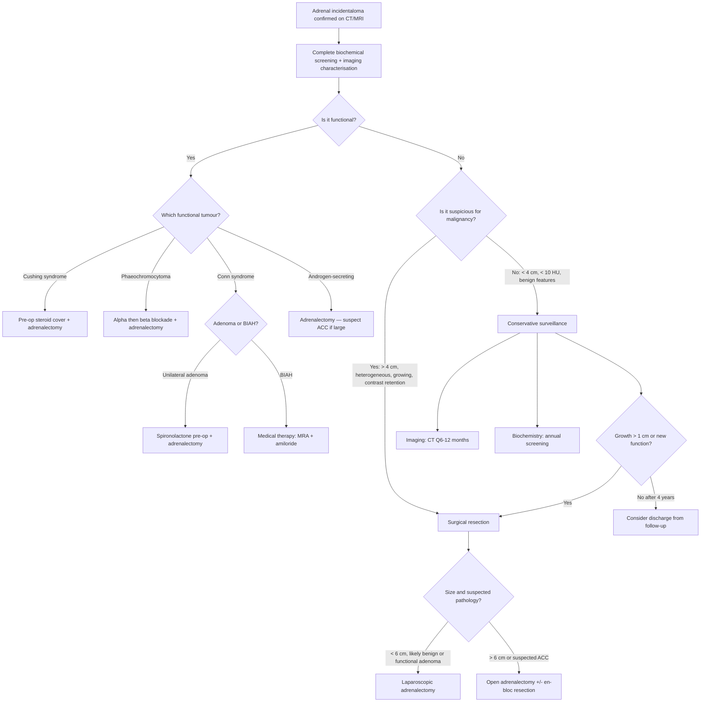

## Management Overview

The management of adrenal incidentaloma flows directly from the two questions we have been asking all along: **Is it functional? Is it malignant?** The answers determine whether the patient needs **surgery**, **conservative surveillance**, or **specific medical therapy** before surgery. Let's build this from first principles.

***Basic principles of endocrine surgery*** (applicable to all adrenal incidentaloma management) [17]:
1. ***Confirm endocrine diagnosis***
2. ***Localization of tumour***
3. ***Render patient medically fit***
4. ***Establish need to operate***
5. ***Surgical tactics***

This framework reminds us that endocrine surgery is never "just cut it out" — you need biochemical confirmation, precise localisation, meticulous pre-operative preparation (especially for functional tumours where operative manipulation can trigger life-threatening crises), and a clear rationale for operating.

---

## Master Management Algorithm

---

## Indications for Surgery

***Surgical removal is indicated if the incidentaloma is unilateral AND any of the following:*** [1][2][3]

| Indication | Rationale |
|:---|:---|
| ***Functioning tumour*** (Cushing's, phaeochromocytoma, Conn's adenoma, androgen-secreting) [1][2][3] | Autonomous hormone secretion causes ongoing end-organ damage (CVS, metabolic, bone) that will not resolve without removing the source |
| ***Radiologically suspicious for malignancy*** [1][2][3] | Features: heterogeneous, irregular borders, ***contrast retention ( < 60% APW)***, ***> 10 HU***, calcification, necrosis, local invasion [1] |
| ***Size > 4 cm*** [1][2][3] | ***90% of malignant adrenal tumours are > 4 cm*** — the risk-benefit ratio favours resection even if imaging otherwise looks benign |
| ***Growth > 1 cm on serial imaging*** [2][3] | Rapid growth is suspicious for malignancy; ***growing > 0.5 cm over 6 months*** is also a trigger in some guidelines [1] |

***Additional surgical indications:*** [1][17]
- ***Adrenal malignancy*** (ACC, malignant phaeochromocytoma)
- ***Cushing's disease persistent after transsphenoidal resection*** (bilateral adrenalectomy as last resort)

---

## Surgical Approaches

### Laparoscopic vs. Open Adrenalectomy

***Approach: open vs MIS*** — the choice depends on: [17]
- ***Size and location***
- ***Pathology of tumour***
- ***Surgical expertise***
- ***Concomitant procedure***

| Approach | Indication | Details |
|:---|:---|:---|
| ***Laparoscopic trans-peritoneal approach*** [1][17] | ***Mass < 6 cm***, benign-appearing, functional adenoma | ***Lateral decubitus position, ipsilateral side up*** [1]. Choices include transabdominal (anterior or lateral) and ***retroperitoneal (posterior or lateral)*** [17] |
| ***Open adrenalectomy*** [1] | ***Mass > 6 cm or suspected malignancy (ACC)*** [1] | Open allows wider exposure for en-bloc resection, vascular control, and lymph node dissection. Choices: ***anterior transabdominal, lateral extraperitoneal, posterior lumbar*** [17] |

***Nowadays usually prefer MIS approach*** because of [17]:
- ***Safety and efficacy***
- ***↓Hospital stay***
- ***↓Analgesic requirement***
- ***Hasten return to normal activities***
- ***↑Overall patient satisfaction***

> **Why open for large or malignant tumours?** Adrenocortical carcinoma has a propensity for local invasion (IVC, kidney, liver, diaphragm) and capsular breach during surgery can cause peritoneal seeding. Open surgery provides better control of the vascular pedicle, allows en-bloc resection of invaded structures, and minimises the risk of capsular violation. The 2024 ESE/ENSAT guidelines continue to recommend open surgery for suspected ACC.

---

## Pre-operative Preparation by Functional Type

This is the **highest-yield section** for exams. Each functional tumour requires specific preparation before the anaesthesia team will agree to proceed. The principle is simple: **neutralise the hormone excess before surgery so that operative manipulation does not trigger a crisis**.

### A. Phaeochromocytoma: α-Blockade → β-Blockade → Volume Expansion

This is the most critical pre-operative preparation because failure to do it properly can cause **intraoperative death** from hypertensive crisis, arrhythmia, or cardiovascular collapse.

***Medical therapy: pre-operative prevention of crisis by combined α/β-blockade*** [8][9][17]

**The sequence matters — it is exam gold:**

***α-blocker should be given 10-14 days before operation*** for adequate blockade to normalize BP and ***expand the contracted blood volume*** [9]

***β-blocker should be given 2-3 days before operation*** after adequate α-blockade has been achieved to relieve the tachycardia caused by α-blocker [9]

<Callout title="NEVER Start β-Blocker First!" type="error">
***NEVER start β-blocker first since blockade of peripheral vasodilatory β-adrenergic receptors will lead to vasoconstriction with unopposed α-adrenergic activity*** (when α-blocker is not started) ***will further elevate the BP*** [9]. This is because β₂ receptors in skeletal muscle vasculature mediate vasodilation; blocking them leaves α₁-mediated vasoconstriction completely unopposed → can precipitate a hypertensive crisis. This is a classic exam question.
</Callout>

**Why does this sequence work from first principles?**

| Step | Drug | Receptor Target | Physiological Effect | Purpose |
|:---|:---|:---|:---|:---|
| **Step 1: α-blockade** | ***Phenoxybenzamine*** (non-selective, long-acting, irreversible) [8][9] or Doxazosin/Terazosin/Prazosin (selective α₁) | α₁ (and α₂ for phenoxybenzamine) | Blocks catecholamine-mediated vasoconstriction → ↓TPR → ↓BP; allows intravascular volume re-expansion (reverses chronic pressure natriuresis) | Prevent intraoperative hypertensive crisis during tumour manipulation |
| **Step 2: β-blockade** | ***Propranolol*** (non-selective β-blocker) [8][9] | β₁ and β₂ | ↓HR, ↓contractility → controls reflex tachycardia from α-blockade | Prevent tachycardia and arrhythmias; only safe after adequate α-blockade |
| **Step 3: Volume expansion** | ***↑Na ( > 5 g/d) diet and fluid intake*** [8] | N/A | Reverses catecholamine-induced intravascular volume contraction | Prevent severe postoperative hypotension (once catecholamine source is removed, the patient's α-blocked, volume-depleted circulation can collapse) |

***BP targets: < 120/80 when seated and SBP > 90 mmHg on standing*** [9]

***Side effects of α-blockers:*** [9]
- ***Postural hypotension*** (expected — shows adequate blockade)
- ***Palpitations (reflex tachycardia)*** → reason for subsequent β-blockade
- ***Flushing, nasal congestion***

***Alternative agents:*** [8]
- ***Calcium channel blockers (dipine class, e.g. nifedipine, amlodipine)***: alternative if α-blockers poorly tolerated
- ***Metyrosine (α-methyltyrosine)***: inhibits tyrosine hydroxylase → ↓catecholamine synthesis at source. Used as adjunct in refractory cases.

***Adequate α-blockade is indicated by postural BP drop*** [8] — if the patient's standing SBP drops by > 10 mmHg compared to sitting, α-blockade is adequate.

| Pre-op Checklist Item | Target |
|:---|:---|
| BP sitting | < 120/80 mmHg (or < 130/80 in some protocols) |
| BP standing | SBP > 90 mmHg (no severe postural drop) |
| Heart rate | < 80-100 bpm |
| No ST changes on ECG | Stable |
| Volume status | Euvolaemic (adequate oral fluid/Na intake for 7-14 days) |

<Callout title="Why Postoperative Hypotension Occurs">
During surgery, once the phaeochromocytoma is removed, the catecholamine source is abruptly eliminated. The patient has been chronically volume-depleted (from pressure natriuresis) AND α-blocked → profound vasodilation with no catecholamine drive → severe hypotension. This is why pre-operative volume expansion and careful intraoperative fluid management are critical. Post-op, you may need vasopressors (noradrenaline infusion) temporarily.
</Callout>

***Postoperative monitoring:*** [8]
- ***BP and HR*** closely (ICU level for 24-48h)
- ***H'stix*** (blood glucose) — ***rebound hypoglycaemia*** can occur because catecholamines normally drive glycogenolysis and gluconeogenesis; when the source is removed, insulin action is unopposed → hypoglycaemia
- Watch for hypotension (see above)

---

### B. Cushing's Syndrome (Adrenal): Steroid Cover + Infection/VTE Prophylaxis

When removing a cortisol-secreting adrenal adenoma, the contralateral adrenal gland has been **chronically suppressed** by negative feedback (low ACTH from pituitary because the adenoma was producing cortisol autonomously). After removal of the adenoma, the remaining adrenal cannot immediately ramp up cortisol production → the patient is effectively **adrenally insufficient** post-operatively.

***Pre-operative and peri-operative cautions:*** [1][17][18]

| Action | Rationale |
|:---|:---|
| ***Peri-op steroid cover*** [1] | ***Normal HPA axis usually suppressed*** → risk of adrenal crisis on removal of cortisol source |
| ***Prophylactic antibiotics*** [1] | Chronic hypercortisolism → immunosuppression → ***high risk of infections*** |
| ***Prophylactic anticoagulation*** [1] | Cushing's syndrome → hypercoagulable state (↑factor VIII, ↑VWF, ↑PAI-1) → ***high risk of VTE*** |
| ***Post-op glucocorticoid ± mineralocorticoid supplement*** [1] | ***Until HPA axis recovers ~1 year later*** — taper gradually based on morning cortisol and SST |
| Control HTN, DM, hypokalaemia pre-op [18] | Reduce perioperative cardiovascular risk |

***Steroid cover protocol (typical):*** [8]
- ***50-100 mg IV hydrocortisone on-call to theatre***
- Post-op: rapid taper over 3 days to maintenance ***15-25 mg/day PO hydrocortisone***
- Continue maintenance and taper gradually (over months to ~1 year) guided by morning cortisol and SST recovery

***Medical therapy for pre-operative control of hypercortisolism*** (if severe or surgery delayed) [18]:
- ***Metyrapone: first-line*** — CYP11B1 (11β-hydroxylase) inhibitor → ↓cortisol synthesis; short-acting, effective within 2h
- ***Ketoconazole***: azole antifungal that inhibits cortisol and androgen synthesis; S/E: hepatotoxicity, ↓androgen (gynecomastia)
- ***Mitotane***: cytotoxic to adrenal cortex → "medical adrenalectomy"; used as adjuvant for ACC (see below)
- ***Block-and-replace strategy***: total cortisol ablation with drugs + replacement hydrocortisone (used when cortisol production is highly variable) [18]

<Callout title="Risk of Nelson's Syndrome" type="error">
***Risk of Nelson's syndrome (8-25% adults, > 50% children) following bilateral adrenalectomy*** [1][18]. This occurs when both adrenals are removed (e.g., for refractory pituitary-dependent Cushing's disease) → complete loss of cortisol negative feedback → corticotroph pituitary adenoma enlarges aggressively → hyperpigmentation (very high ACTH/MSH), visual field defects, headache. This is why bilateral adrenalectomy is reserved as a last resort and patients need lifelong pituitary MRI surveillance.
</Callout>

---

### C. Conn's Syndrome (Primary Hyperaldosteronism): Electrolyte Correction

***Management depends on subtype:*** [1][6][11]

| Subtype | Management | Pre-op | Why |
|:---|:---|:---|:---|
| ***Aldosterone-producing adenoma (APA)*** | ***Laparoscopic adrenalectomy*** [1][6] | ***Correct electrolyte imbalance, especially K⁺*** [1]; ***4 weeks pre-op spironolactone to correct hypoK*** [6] | Need to replenish total body K⁺ stores before surgery; spironolactone also helps control BP |
| ***Bilateral idiopathic adrenal hyperplasia (BIAH)*** | ***Medical treatment: MRA (spironolactone/eplerenone) ± amiloride*** [6] | N/A — no surgery | ***Bilateral adrenalectomy would lead to adrenal crisis*** — the cure is worse than the disease; medical management controls aldosterone effects without removing essential cortisol-producing tissue [6] |

***Post-operative management after adrenalectomy for Conn's:*** [11]
- ***Monitor K⁺ for rebound hyperK*** due to contralateral adrenal suppression (the remaining adrenal gland has been suppressed by volume expansion → temporarily ↓aldosterone → K⁺ retention)
- ***Monitor aldosterone for test of cure***
- ***Continue treatment of hypertension*** — ***HTN can remain in 40-65%*** due to ?irreversible damage to systemic microcirculation (especially hypertensive nephrosclerosis) [11]

***Medical therapy agents:*** [11]
- ***Aldosterone antagonist (1st line)***: spironolactone (S/E gynecomastia, menstrual irregularity), eplerenone (more expensive but fewer anti-androgenic S/Es)
- ***K⁺-sparing diuretics (2nd line)***: amiloride, triamterene — ***less preferred as they do not counteract the deleterious cardiovascular effects of aldosterone excess*** [11] (aldosterone directly causes myocardial fibrosis and vascular remodelling independent of BP)

---

### D. Androgen-Secreting Tumour / Suspected ACC

- If androgen excess is confirmed and the mass is large → highly suspicious for **adrenocortical carcinoma**
- ***Surgery: open adrenalectomy ± en-bloc resection of kidney/spleen (if invaded)*** [19]
- ***Adjuvant mitotane for at least 2 years*** [19] — mitotane is directly **cytotoxic to adrenal cortical tissue** (disrupts mitochondrial membranes in adrenocortical cells) and also disrupts cortisol synthesis
  - ***Mitotane induces CYP3A4 → rapid metabolism of glucocorticoids*** [19] → patients on mitotane need ***high-dose glucocorticoid replacement*** (typically 40-60 mg hydrocortisone/day or equivalent dexamethasone, which is less affected by CYP3A4)
- ***FNA biopsy is NOT indicated*** for ACC [19]: cannot differentiate benign from malignant cortical lesions, risk of tumour seeding
- ***Chemotherapy for refractory disease*** [19] — typically EDP-M (etoposide, doxorubicin, cisplatin + mitotane)

---

### E. Adrenal Metastases

- Management is guided by the **primary cancer** and overall staging
- If the adrenal is the **only site of metastasis** and the primary is controlled → adrenalectomy (metastasectomy) may be considered for improved survival (especially in lung cancer, RCC)
- If widespread metastatic disease → systemic therapy directed at primary cancer
- If bilateral metastases causing **adrenal insufficiency** → glucocorticoid and mineralocorticoid replacement

---

### F. Malignant Phaeochromocytoma

- ***Histologically and biochemically indistinguishable from benign disease; defined by metastasis*** [19]
- Management: [19]
  - ***Surgical excision (tumour debulking)*** to control catecholamine excess
  - ***Symptomatic relief: α-blockers***
  - ***Mitotane: adjuvant/palliative treatment***
  - ***131I-MIBG therapy***: targeted radionuclide therapy for MIBG-avid metastatic disease
  - ***Chemotherapy (CVD regimen)***: cyclophosphamide, vincristine, dacarbazine for progressive disease
- ***Prognosis: 5-year survival 95% for benign, 40% for malignant*** [8]

---

## Conservative Surveillance Protocol

For incidentalomas that are **non-functional, < 4 cm, and radiologically benign**:

***Conservative management:*** [1]
- ***Imaging: CT abdomen Q6 months for 4 years*** [1]
- ***Biochemical: annual screening (ONDST, metanephrines, ± ARR) for 4 years*** [1]

***Triggers for converting to surgical management during surveillance:*** [1][2][3]
- ***Growth > 0.5 cm in 6 months*** [1] or ***> 1 cm on any follow-up*** [2][3]
- Development of new hormonal function on biochemical screening
- Development of suspicious imaging features (new heterogeneity, loss of smooth borders, contrast retention)

After 4 years of stability → risk of subsequent change is very low → consider discharge (per 2016 ESE/ENSAT guidelines, still current 2025-2026).

---

## Complications of Adrenalectomy

Understanding complications requires knowledge of the surgical anatomy and the specific functional tumour being operated on.

### General Complications of Adrenalectomy [1][17]

| Timing | Complication | Mechanism / Explanation |
|:---|:---|:---|
| ***Intra-operative*** | ***Haemodynamic instability (phaeochromocytoma)*** [1][17] | Tumour manipulation → massive catecholamine release → hypertensive crisis, tachyarrhythmia; alternatively, after tumour removal → sudden catecholamine withdrawal → hypotension |
| ***Intra-operative*** | ***Intraoperative haemorrhage: adrenal capsular, IVC*** [17] | Rich arterial supply + close proximity of right adrenal vein to IVC (short, ~1 cm) → risk of IVC injury especially on right side |
| ***Intra-operative*** | ***Adrenal insufficiency (Conn's, Cushing's)*** [1] | Contralateral adrenal suppressed by chronic autonomous secretion → cannot produce adequate cortisol/aldosterone immediately → ***IV hydrocortisone upon removal of adrenal gland*** [1] |
| ***Intra-operative*** | ***Injury to surroundings:*** | Anatomical proximity |
| | ***Right adrenalectomy: IVC, right lobe of liver*** [1] | Right adrenal sits behind IVC and under right hepatic lobe |
| | ***Left adrenalectomy: pancreatic tail, spleen*** [1] | Left adrenal sits anterior to left crus, medial to spleen, posterior to pancreatic tail |
| ***Intra-operative*** | ***Pneumothorax*** [9][17] | Diaphragmatic injury (adrenal glands sit immediately beneath the diaphragm) |
| ***Early post-op*** | ***Adrenal insufficiency*** [1] | As above — requires ***PO hydrocortisone post-op*** [1] |
| ***Early post-op*** | ***Rebound hypoglycaemia*** (phaeochromocytoma) [8] | Loss of catecholamine-driven glycogenolysis/gluconeogenesis → unopposed insulin action |
| ***Early post-op*** | ***Hypotension*** (phaeochromocytoma) [8] | Loss of catecholamine vasoconstriction + volume depletion + residual α-blockade |
| ***Early post-op*** | ***Rebound hyperkalaemia*** (Conn's) [11] | Contralateral adrenal suppression → temporary ↓aldosterone → K⁺ retention |
| ***Early post-op*** | ***Electrolyte disturbances*** [17] | Shift in mineralocorticoid/glucocorticoid balance |
| ***Late*** | ***Persistent hypertension*** [1] | Renal artery injury during surgery [1]; or irreversible hypertensive end-organ damage (nephrosclerosis) |
| ***Late*** | ***Nelson's syndrome*** (bilateral adrenalectomy only) [1][18] | Loss of cortisol feedback → uninhibited corticotroph growth → enlarging pituitary tumour + hyperpigmentation |
| ***Late*** | ***Lifelong steroid dependence*** (bilateral adrenalectomy) | No adrenal tissue → no endogenous cortisol or aldosterone → permanent replacement |

---

## Adrenal Receptor Summary

Understanding the adrenergic receptor effects clarifies the pre-operative drug rationale [9]:

| Receptor | Location | Effect of Stimulation | Relevance to Phaeochromocytoma |
|:---|:---|:---|:---|
| ***α₁*** | Vascular smooth muscle, iris dilator | ***↑TPR → vasoconstriction, mydriasis, urinary sphincter closure*** [9] | **Primary driver of hypertension** → blocked by phenoxybenzamine/doxazosin |
| ***α₂*** | Pre-synaptic nerve terminals, pancreatic β-cells | ***↓insulin release, inhibition of NE release*** [9] | Pre-synaptic feedback; phenoxybenzamine blocks this too (can paradoxically ↑NE release) |
| ***β₁*** | Heart (SA node, myocardium) | ***↑HR, ↑myocardial contractility, ↑lipolysis, ↑renin release*** [9] | **Drives tachycardia and arrhythmia** → blocked by propranolol (only AFTER α-blockade) |
| ***β₂*** | Vascular smooth muscle (skeletal muscle), bronchi, liver, uterus | ***↓TPR → vasodilation, bronchodilation, ↑glycogenolysis, ↑glucagon release, relax uterine smooth muscle*** [9] | β₂ in vasculature mediates **vasodilation** → blocking β₂ BEFORE α₁ → unopposed α₁ vasoconstriction → crisis |

---

## Summary: Management by Diagnosis

| Diagnosis | Management | Key Pre-op | Key Post-op |
|:---|:---|:---|:---|
| **Non-functional, < 4 cm, benign** | ***Conservative: CT Q6m + biochemistry Q1y for 4 years*** [1] | N/A | Growth > 1 cm → surgery |
| **Autonomous cortisol secretion** | ***Adrenalectomy*** [1][2] | ***Steroid cover, Abx prophylaxis, VTE prophylaxis*** [1] | ***Hydrocortisone replacement until HPA recovery (~1 year)*** [1] |
| **Phaeochromocytoma** | ***Adrenalectomy*** [2][8] | ***α-blockade 10-14 days → β-blockade 2-3 days → volume expansion*** [8][9] | Monitor BP, HR, glucose; treat hypotension/hypoglycaemia |
| **Conn's adenoma** | ***Laparoscopic adrenalectomy*** [1][6] | ***Spironolactone 4 weeks, correct hypoK*** [6] | Monitor K⁺ (rebound hyperK), continue HTN Rx |
| **Conn's — BIAH** | ***Medical: spironolactone/eplerenone ± amiloride*** [6] | N/A | Lifelong medical management |
| **ACC** | ***Open adrenalectomy ± en-bloc resection + adjuvant mitotane ≥ 2 years*** [19] | Address functional excess if present | High-dose glucocorticoid replacement (mitotane induces CYP3A4) [19] |
| **Metastasis** | Treat primary; ± metastasectomy if isolated | Depends on primary cancer | Steroid replacement if bilateral adrenal destruction |
| **Malignant phaeochromocytoma** | ***Debulking surgery + α-blockers + 131I-MIBG/chemo*** [19] | As per phaeochromocytoma | Long-term catecholamine monitoring |

---

<Callout title="High Yield Summary — Management of Adrenal Incidentaloma">

**Surgical indications**: Functional tumour, size > 4 cm, radiologically suspicious for malignancy, or growth > 1 cm on follow-up.

**Approach**: Laparoscopic for < 6 cm and benign; open for > 6 cm or suspected ACC.

**Phaeochromocytoma pre-op**: α-blockade FIRST (phenoxybenzamine, 10-14 days) → β-blockade SECOND (propranolol, 2-3 days before) → volume expansion. NEVER β before α.

**Cushing's pre-op**: Steroid cover, antibiotics, anticoagulation. Post-op hydrocortisone until HPA recovers (~1 year).

**Conn's pre-op**: Spironolactone for 4 weeks to correct hypokalaemia. Adenoma → surgery. BIAH → medical (do NOT operate bilaterally).

**ACC**: Open adrenalectomy ± en-bloc resection + adjuvant mitotane ≥ 2 years. Mitotane induces CYP3A4 → need high-dose steroid replacement.

**Conservative surveillance**: CT Q6-12 months + annual biochemistry for 4 years if non-functional, < 4 cm, benign.

**Key complications**: Intraoperative HTN crisis (phaeochromocytoma), adrenal insufficiency (Cushing's/Conn's post-op), IVC/organ injury, post-op hypoglycaemia and hypotension (phaeochromocytoma), Nelson's syndrome (bilateral adrenalectomy).

</Callout>

---

<ActiveRecallQuiz
  title="Active Recall - Management of Adrenal Incidentaloma"
  items={[
    {
      question: "Explain why alpha-blockade must be initiated before beta-blockade in pre-operative preparation for phaeochromocytoma. What are the target BP parameters?",
      markscheme: "Beta-2 receptors in skeletal muscle vasculature mediate vasodilation. If beta-blockers are given first, beta-2-mediated vasodilation is blocked, leaving alpha-1-mediated vasoconstriction completely unopposed, which can precipitate a hypertensive crisis. Alpha-blockade is started 10-14 days pre-op (phenoxybenzamine), followed by beta-blockade 2-3 days pre-op (propranolol). Target: BP less than 120/80 seated, SBP greater than 90 standing.",
    },
    {
      question: "A patient undergoes unilateral adrenalectomy for a cortisol-secreting adenoma. Why does adrenal insufficiency occur post-operatively and how is it managed?",
      markscheme: "The autonomous cortisol secretion from the adenoma chronically suppresses ACTH via negative feedback, causing the contralateral adrenal to atrophy. Upon removal of the adenoma, the suppressed contralateral adrenal cannot produce adequate cortisol. Management: peri-operative IV hydrocortisone (50-100 mg on call), then taper to oral hydrocortisone 15-25 mg/day maintenance, gradually reducing over approximately 1 year as HPA axis recovers (guided by morning cortisol and Synacthen test).",
    },
    {
      question: "List the three main complications that should be monitored in the immediate post-operative period after adrenalectomy for phaeochromocytoma, and explain the mechanism of each.",
      markscheme: "(1) Hypotension: abrupt removal of catecholamine source plus chronic volume depletion plus residual alpha-blockade leads to vasodilation and cardiovascular collapse. (2) Rebound hypoglycaemia: loss of catecholamine-driven glycogenolysis and gluconeogenesis with unopposed insulin action. (3) Hypertensive crisis: if tumour manipulation during surgery releases a bolus of catecholamines, or incomplete resection.",
    },
    {
      question: "Why is bilateral adrenalectomy avoided in bilateral idiopathic adrenal hyperplasia causing Conn syndrome, and what is the preferred treatment?",
      markscheme: "Bilateral adrenalectomy would remove all cortisol-producing tissue, causing permanent adrenal crisis requiring lifelong glucocorticoid and mineralocorticoid replacement. The preferred treatment is medical therapy with aldosterone antagonists (spironolactone or eplerenone as first-line) plus potassium-sparing diuretics (amiloride) as second-line. Amiloride alone is less preferred because it does not counteract the direct deleterious cardiovascular effects of aldosterone excess (myocardial fibrosis, vascular remodelling).",
    },
    {
      question: "What is Nelson syndrome, when does it occur, and what is its pathophysiology?",
      markscheme: "Nelson syndrome occurs after bilateral adrenalectomy for Cushing disease (8-25% in adults, more than 50% in children). Pathophysiology: removal of both adrenals eliminates all cortisol production, completely removing negative feedback on the pituitary corticotroph adenoma. The tumour then enlarges aggressively, producing very high ACTH and MSH (from POMC cleavage), causing hyperpigmentation, headache, visual field defects, and cranial nerve palsies. Prevention: lifelong pituitary MRI surveillance after bilateral adrenalectomy.",
    },
    {
      question: "Describe the role of mitotane in adrenocortical carcinoma management and its important drug interaction.",
      markscheme: "Mitotane is directly cytotoxic to adrenocortical cells (disrupts mitochondrial membranes) and also inhibits cortisol synthesis. Used as adjuvant therapy for at least 2 years after surgery for ACC. Key drug interaction: mitotane induces CYP3A4, leading to rapid metabolism and inactivation of glucocorticoids. Therefore, patients on mitotane require high-dose glucocorticoid replacement (e.g. 40-60 mg hydrocortisone/day) to prevent adrenal insufficiency.",
    },
  ]}
/>

## References

[1] Senior notes: maxim.md (Adrenal incidentaloma and adrenalectomy sections, pp. 432-434)
[2] Senior notes: Ryan Ho Endocrine.pdf (Section 3.5 Adrenal Incidentaloma, p. 68)
[3] Senior notes: Ryan Ho Fundamentals.pdf (Section B: Adrenal Incidentaloma, p. 438)
[5] Senior notes: Ryan Ho Cardiology.pdf (Secondary hypertension table, p. 178)
[6] Senior notes: maxim.md (Conn's syndrome management, pp. 434-435)
[8] Senior notes: Ryan Ho Endocrine.pdf (Phaeochromocytoma management, pp. 66-67)
[9] Senior notes: felixlai.md (Phaeochromocytoma treatment and adrenergic receptor table, pp. 1537-1538)
[11] Senior notes: Ryan Ho Endocrine.pdf (Conn's adenoma vs. hyperplasia management, p. 59)
[17] Senior notes: Ryan Ho Endocrine.pdf (Adrenal surgery — indications, approaches, complications, p. 69)
[18] Senior notes: Ryan Ho Endocrine.pdf (Cushing's syndrome management, p. 64)
[19] Senior notes: maxim.md (Malignant phaeochromocytoma and adrenocortical carcinoma, p. 438)
