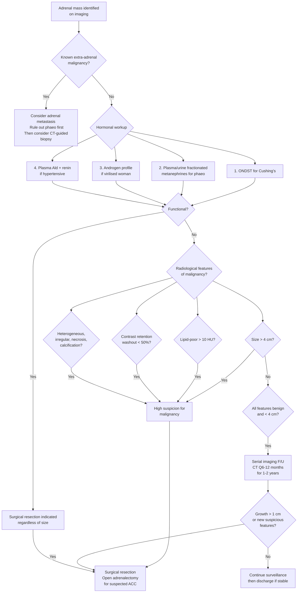

## Differential Diagnosis of Adrenocortical Carcinoma

When a patient presents with an adrenal mass — whether found incidentally on imaging, or detected during workup for hormonal excess — the critical clinical question is always the same two-part question: ***"Is it functional? Is it malignant?"*** [2][6]. ACC sits at the intersection of both: it is a primary adrenal malignancy that is often functional. But the differential diagnosis is broad, and systematically working through it is essential to avoid missing a treatable condition or, worse, performing an unnecessary biopsy on a phaeochromocytoma.

Let me walk you through this the way you'd approach it on the ward.

---

### Conceptual Framework: Why Is the DDx Structured This Way?

The adrenal gland has two embryologically and functionally distinct components:
- **Cortex** (mesodermal origin) → produces steroids (cortisol, aldosterone, androgens)
- **Medulla** (neural crest origin) → produces catecholamines (adrenaline, noradrenaline)

Any mass in or around the adrenal can be:
1. **Primary adrenal** — arising from the cortex or medulla
2. **Secondary (metastatic)** — the adrenal is a common site for metastases because of its rich arterial blood supply
3. **Non-neoplastic** — cysts, haemorrhage, infection, infiltration

The DDx also depends on **how the patient presents**:
- **As an adrenal incidentaloma** (most common scenario — the mass is found on imaging done for another reason)
- **With hormonal excess** (Cushing's, virilisation, feminisation, Conn's, catecholamine excess)
- **With mass effect / pain** (large tumour causing local symptoms)
- **With known extra-adrenal malignancy** (is this a metastasis?)

---

### 1. Differential Diagnosis of an Adrenal Mass (The Incidentaloma Framework)

This is the most clinically relevant framework because ACC is most commonly encountered during the workup of an adrenal incidentaloma [1][2][6].

<Callout title="The Two Fundamental Questions for Any Adrenal Incidentaloma" type="idea">

***"Is it functional? Is it malignant?"*** — Every adrenal incidentaloma must be assessed for both hormonal activity and malignant potential. These two axes are independent: a mass can be functional and benign (e.g., Conn's adenoma), non-functional and malignant (e.g., adrenal metastasis), or both functional and malignant (e.g., ACC with Cushing's) [1][2][6].

</Callout>

#### A. Benign Adrenal Cortical Lesions

| Condition | Key Features | Why It's in the DDx |
|---|---|---|
| ***Non-functioning adrenal adenoma*** **(85% of incidentalomas)** [1][2][6] | Small (< 4 cm), homogeneous, smooth borders, ***lipid-rich (< 10 HU on unenhanced CT)***, ***rapid contrast washout (> 50% at 10 min)*** [2][6] | By far the most common adrenal mass. The main challenge is distinguishing this from early/small ACC. Size, lipid content, and washout characteristics are key differentiators. |
| **Functioning cortical adenoma** (Cushing's, Conn's) | Usually < 3 cm, single hormone produced efficiently. **Conn's adenoma**: HTN + hypokalaemia + ↑ARR [1]; **Cortisol-producing adenoma**: subclinical or overt Cushing's with suppressed ACTH | ACC also produces cortisol, but adenomas produce a **single hormone efficiently** whereas ACC often shows **mixed/inefficient steroidogenesis** with elevated steroid precursors (DHEA-S, 11-deoxycortisol). |
| **Adrenal myelolipoma** | Contains macroscopic fat (very low HU, often < -30 HU on CT) — pathognomonic. Benign hamartoma of fat and haematopoietic elements. | Can be large (> 4 cm) and mimic ACC on size criteria alone, but the **macroscopic fat on CT** is diagnostic. ACC does not contain macroscopic fat. |
| **Adrenal cyst** | Thin-walled, fluid density (0–20 HU), no enhancement. Types: endothelial (lymphangiomatous), epithelial, parasitic, pseudocyst (post-haemorrhagic). | Usually straightforward on imaging. However, a cystic degeneration of ACC can rarely mimic a benign cyst — look for thick, irregular walls and enhancing solid components. |
| **Adrenal haemorrhage** | History of trauma, anticoagulation, stress (e.g., sepsis, post-surgical). Acute: hyperdense (50–70 HU). Subacute/chronic: decreasing density over weeks. No enhancement. | Acute adrenal haemorrhage can look alarming on CT. Lack of enhancement and clinical context (anticoagulation, critical illness) help distinguish it. Follow-up imaging shows resolution. |
| **Granulomatous disease** (TB, histoplasmosis, sarcoidosis) | Often **bilateral**, may show calcification. TB adrenalitis is an important cause of **Addison's disease** in Hong Kong / East Asia. | Bilateral adrenal enlargement with calcification in a patient from an endemic area should raise suspicion for TB. Unlike ACC, granulomatous disease does not produce hormonal excess (it destroys cortical tissue → insufficiency). |

#### B. Adrenal Medullary Lesions

| Condition | Key Features | Why It's in the DDx |
|---|---|---|
| ***Phaeochromocytoma*** | Catecholamine-secreting tumour from chromaffin cells of adrenal medulla [1][7]. Classic triad: ***paroxysmal headache, sweating, palpitations*** [1]. 10% rule: 10% bilateral, 10% extra-adrenal, 10% malignant [1]. CT: often > 3 cm, heterogeneous with cystic/necrotic areas, very bright on T2W MRI. ***Screen with 24h urine fractionated metanephrines / plasma metanephrines*** [1][2][6]. | **Must always be excluded before any biopsy or surgical manipulation** — undiagnosed phaeochromocytoma can cause fatal hypertensive crisis during anaesthesia or biopsy. This is one of the main reasons ***FNA biopsy is NOT indicated for primary adrenal tumours*** [2][6]. |
| **Malignant phaeochromocytoma** | ***Histologically and biochemically indistinguishable from benign disease, defined only by the presence of metastasis*** [1]. | Can mimic ACC on imaging. Biochemical catecholamine profile distinguishes it from ACC (which produces steroids, not catecholamines). |
| **Neuroblastoma** (paediatric) | Malignant tumour of neural crest cells. Most common extracranial solid tumour in children. Elevated urinary VMA/HVA. Often calcified on CT. | In children with an adrenal mass, the DDx between neuroblastoma, ACC, and Wilms' tumour (renal origin, not adrenal) is critical. Neuroblastoma arises from the medulla; ACC from the cortex [7]. |

#### C. Malignant Lesions — Primary

| Condition | Key Features | Why It's in the DDx |
|---|---|---|
| **Adrenocortical carcinoma** | The subject of these notes. Large (> 4–6 cm), heterogeneous, ***lipid-poor (> 10 HU)***, ***retains contrast (< 50% washout)*** [2][6], often with necrosis/haemorrhage/calcification. May be functional (mixed hormones, elevated DHEA-S). | — |
| **Primary adrenal lymphoma** | Extremely rare. Usually bilateral (70%). Often in immunocompromised or elderly patients. Homogeneous soft-tissue density mass on CT. Associated with elevated LDH. | Bilateral adrenal masses + adrenal insufficiency + elevated LDH in an elderly patient should raise suspicion. Unlike ACC, lymphoma responds to chemotherapy — tissue biopsy is indicated here (one of the few situations where adrenal biopsy is justified). |
| **Adrenal sarcoma** (angiosarcoma, leiomyosarcoma) | Exceedingly rare. Aggressive, large, heterogeneous masses. No hormonal secretion. | Indistinguishable from ACC on imaging alone; histopathology required (at surgery, not by biopsy). |

#### D. Malignant Lesions — Secondary (Metastatic)

<Callout title="Adrenal Metastases Are More Common Than Primary Adrenal Malignancies" type="error">

In a patient with a **known extra-adrenal malignancy** and a new adrenal mass, the most likely diagnosis is **adrenal metastasis**, not ACC. The adrenal gland is the **4th most common site for metastases** after lung, liver, and bone. ***Biopsy is usually only reserved for confirmation of adrenal metastasis*** [2][6] — this is one of the few situations where adrenal biopsy is appropriate (after phaeochromocytoma has been excluded).

</Callout>

| Primary Cancer | Notes |
|---|---|
| **Lung cancer** (most common source of adrenal mets) | CT thorax coverage ***must include liver and adrenals*** [8]. Often bilateral. In Hong Kong, lung cancer is extremely common (both smoking-related and non-smoking adenocarcinoma in women). |
| **Breast cancer** | Can cause hypervascular adrenal metastases [9]. |
| **Renal cell carcinoma** | ***RCC uniquely invades into the renal vein, IVC*** [10][7] and can directly extend to the ipsilateral adrenal. Also haematogenous metastasis to the contralateral adrenal. |
| **Melanoma** | High propensity for adrenal metastasis. Often bilateral, enhancing masses. |
| **Colorectal cancer, gastric cancer, HCC** | HCC and colorectal cancer are particularly relevant in the Hong Kong setting [5]. |
| **Lymphoma** | As above — usually bilateral, may present with adrenal insufficiency. |

#### E. Non-Neoplastic Mimics

| Condition | Key Features |
|---|---|
| **Adrenal hyperplasia** (bilateral) | Diffuse or nodular bilateral adrenal enlargement. Seen in Cushing's disease (ACTH-driven bilateral hyperplasia), congenital adrenal hyperplasia (CAH), or ACTH-independent macronodular hyperplasia. Not a discrete mass — both glands are enlarged. |
| **Adrenal haemorrhage** | As above. Can be unilateral or bilateral. Important cause in neonates (birth trauma), anticoagulated patients, and Waterhouse-Friderichsen syndrome (meningococcal sepsis → bilateral adrenal haemorrhagic necrosis). |
| **Adrenal abscess** | Rare. Fever, leucocytosis, rim-enhancing lesion on CT. Usually in immunocompromised patients. |
| **Extramedullary haematopoiesis** | Bilateral adrenal enlargement in patients with chronic haemolytic anaemia (e.g., thalassaemia — relevant in Hong Kong's Southeast Asian population). |

---

### 2. Differential Diagnosis by Clinical Presentation

#### A. Presenting with Cushing's Syndrome

If the patient presents with features of cortisol excess, the DDx is broader than just adrenal lesions:

| Category | Cause | Key Distinguishing Feature |
|---|---|---|
| **Iatrogenic** (most common overall) [4][11] | Exogenous glucocorticoids, including ***herbal medicines, OTC drugs for arthritis*** [4] | History of steroid use. Must always be excluded first [11]. |
| **ACTH-dependent (80% of endogenous)** | ***Cushing's disease (pituitary adenoma, 65–70%)*** [4] | Suppressed by high-dose DST. MRI pituitary shows adenoma. |
| | ***Ectopic ACTH (10–15%)*** — SCLC, carcinoid, thymic NET [4][8] | Very high ACTH, severe hypokalaemia, not suppressed by high-dose DST. Often rapid onset with marked metabolic derangement. |
| **Non-ACTH-dependent (20%)** | ***Adrenal adenoma (15%)*** [4] | Low ACTH, single hormone, small (< 4 cm), lipid-rich mass. |
| | ***Adrenocortical carcinoma (~5%)*** [4] | Low ACTH, mixed hormones (cortisol + androgens), large mass, elevated DHEA-S. |
| | Bilateral macronodular adrenal hyperplasia, primary pigmented nodular adrenal disease (Carney complex) | Bilateral, often aberrant receptor expression. |

> ***ACTH is the single most important initial test*** in a patient with confirmed Cushing's syndrome. If ACTH is **suppressed (< 10 pg/mL)**, the cause is **adrenal** → image the adrenals. If ACTH is **elevated or normal-high**, the cause is **ACTH-dependent** → proceed to pituitary MRI and high-dose DST / CRH test / IPSS [4][11].

#### B. Presenting with Virilisation / Hyperandrogenism in Women

| Category | Cause | Key Distinguishing Feature |
|---|---|---|
| **Adrenal** | ACC (most common adrenal cause of rapid virilisation) | Very high DHEA-S (> 600 μg/dL), large adrenal mass, rapid onset |
| | Androgen-secreting adenoma (rare) | Mild DHEA-S elevation, small mass, slow onset |
| | Non-classic CAH (21-hydroxylase deficiency) | Elevated 17-OH-progesterone, no mass, bilateral adrenal hyperplasia |
| **Ovarian** | Sertoli-Leydig cell tumour, hilus cell tumour | Normal DHEA-S, elevated testosterone, ovarian mass on pelvic imaging |
| | PCOS (most common cause overall) | Mild hyperandrogenism, oligo-ovulation, polycystic ovaries. Slow onset. |
| **Other** | Exogenous androgens | Drug history (anabolic steroids, testosterone therapy) |

> **Key point**: A **very high serum DHEA-S** (> 600 μg/dL or > 15.5 μmol/L) points to an **adrenal source** (DHEA-S is almost exclusively adrenal in origin). A **very high testosterone with normal DHEA-S** points to an **ovarian source**. ***Androgen profile should be checked for androgen-secreting tumours in virilized women*** [2][6].

#### C. Presenting with an Adrenal Mass on Imaging (Incidentaloma)

This is covered in the table in Section 1 above. The key algorithmic approach is summarised in the flow diagram below.

---

### 3. Diagnostic Approach Algorithm — Mermaid Diagram

<Callout title="Key Point: Never Biopsy a Primary Adrenal Tumour">

***FNA biopsy is NOT indicated*** for suspected primary adrenal lesions (ACC or phaeochromocytoma). Reasons: (1) ***histology is NOT useful in differentiating between benign/malignant adrenal tumours (same appearance)*** [2][6]; (2) risk of ***tumour seeding*** along the needle tract; (3) risk of ***precipitation of HTN crisis*** if phaeochromocytoma [2][6]. Biopsy is ***usually only reserved for confirmation of adrenal metastasis*** in patients with known extra-adrenal cancer [2][6].

</Callout>

---

### 4. Key Differentiating Features — Summary Table

| Feature | Adrenal Adenoma | Adrenocortical Carcinoma | Phaeochromocytoma | Adrenal Metastasis |
|---|---|---|---|---|
| **Frequency** | ***85% of incidentalomas*** [2][6] | ***2–5% of incidentalomas*** [2] | ~5% | Variable (depends on cancer Hx) |
| **Size** | Usually < 4 cm | Usually > 4 cm (often > 6 cm) | Variable (often 3–5 cm) | Variable |
| **Unenhanced CT (HU)** | ***< 10 HU (lipid-rich)*** [2][6] | > 10 HU (lipid-poor) | > 10 HU (lipid-poor) | > 10 HU |
| **Contrast washout** | ***> 50% absolute washout*** [2][6] | ***< 50% (retains contrast)*** [2][6] | Variable | < 50% |
| **Homogeneity** | ***Homogeneous, smooth*** [2][6] | ***Heterogeneous*** (necrosis, haemorrhage, calcification) | Heterogeneous (cystic, necrotic) | Variable |
| **T2W MRI** | Isointense to liver | Heterogeneous, high signal | ***Very bright ("light-bulb sign")*** | Variable |
| **Hormones** | Single, efficient | Mixed, inefficient; ↑DHEA-S, steroid precursors | Catecholamines (metanephrines) | Usually none |
| **Bilateral** | Can be | Rarely | 10% | Often |
| **Biopsy role** | ***NOT indicated*** [2][6] | ***NOT indicated*** [2][6] | ***Absolutely contraindicated*** [2][6] | Indicated (after excluding phaeo) |

---

### 5. Special Considerations in Hong Kong

- **Hepatitis B prevalence**: HCC is extremely common in Hong Kong. HCC can metastasise to the adrenals, and the adrenal mass may be the first presentation. Always check HBsAg and AFP in a patient with a suspicious adrenal mass [5][9].
- **Lung cancer**: Very high incidence of both smoking-related and non-smoking lung adenocarcinoma. ***CT thorax coverage must include liver and adrenals*** [8] — an adrenal mass found during lung cancer staging is most likely a metastasis.
- **Tuberculosis**: Hong Kong is an intermediate-endemic area for TB. Bilateral adrenal enlargement with calcification should raise suspicion for TB adrenalitis, which causes adrenal insufficiency (Addison's disease), not hormonal excess.
- **RCC**: ***RCC uniquely invades into renal vein, IVC*** [10] and may involve the ipsilateral adrenal by direct extension. A mass that appears to involve both the kidney and adrenal on imaging may be RCC with adrenal invasion rather than a primary ACC.

---

<Callout title="High Yield Summary - Differential Diagnosis of ACC">

1. **Most common adrenal mass**: Non-functioning adenoma (85% of incidentalomas). Distinguished from ACC by size (< 4 cm), lipid-rich (< 10 HU), rapid contrast washout (> 50%), smooth/homogeneous.

2. **Most dangerous mimic to miss before intervention**: Phaeochromocytoma — always screen with plasma/urine metanephrines before any biopsy or surgery.

3. **Most common malignant adrenal mass overall**: Adrenal metastasis (not ACC) — especially from lung, breast, RCC, melanoma. Biopsy is appropriate here (after excluding phaeo).

4. **FNA biopsy is NOT indicated for suspected primary adrenal tumours** — cannot differentiate benign from malignant cortical tumours, risks seeding and hypertensive crisis.

5. **Red flags for ACC over adenoma**: Size > 4 cm, mixed hormone secretion (cortisol + androgens), elevated DHEA-S or steroid precursors, lipid-poor on CT (> 10 HU), contrast retention, heterogeneous with necrosis/calcification.

6. **In Cushing's syndrome**: Suppressed ACTH → adrenal cause → image adrenals. Mixed cortisol + androgens or rapid-onset virilisation → think ACC.

7. **In virilised women**: Very high DHEA-S (adrenal source) vs. high testosterone with normal DHEA-S (ovarian source).

</Callout>

---

<ActiveRecallQuiz
  title="Active Recall - DDx of Adrenocortical Carcinoma"
  items={[
    {
      question: "An adrenal incidentaloma is found on CT. State the two fundamental questions you must answer and the screening investigations for each functional tumour.",
      markscheme: "Q1: Is it functional? Screen with: (1) ONDST for Cushing's, (2) plasma/urine fractionated metanephrines for phaeochromocytoma, (3) androgen profile if virilised woman, (4) plasma aldosterone and renin if hypertensive. Q2: Is it malignant? Assess by CT features: size > 4 cm, HU > 10, contrast retention (washout < 50%), heterogeneity, irregular borders, calcification."
    },
    {
      question: "A patient with known lung cancer has a 3 cm homogeneous adrenal mass found on staging CT. What is the most likely diagnosis, and what is the appropriate next step?",
      markscheme: "Most likely adrenal metastasis (adrenals are the 4th most common site for metastases; lung cancer is the most common source). Next step: exclude phaeochromocytoma with metanephrines, then consider CT-guided biopsy if it would change management. FNA biopsy is acceptable here because this is a suspected secondary (metastatic) lesion, not a primary adrenal tumour."
    },
    {
      question: "List 3 CT features on unenhanced and contrast-enhanced CT that help distinguish a benign adrenal adenoma from adrenocortical carcinoma.",
      markscheme: "(1) Unenhanced CT density: adenoma < 10 HU (lipid-rich) vs ACC > 10 HU (lipid-poor). (2) Contrast washout: adenoma > 50% absolute washout at 10 min vs ACC < 50% (contrast retention). (3) Morphology: adenoma is homogeneous with smooth borders vs ACC is heterogeneous with irregular borders, necrosis, haemorrhage, and/or calcification."
    },
    {
      question: "A 38-year-old woman presents with rapid-onset hirsutism, acne, deepening voice, and amenorrhoea over 3 months. Her serum DHEA-S is markedly elevated at 900 microg/dL. CT shows a 7 cm left adrenal mass. What is the most likely diagnosis and why does the DHEA-S level localise the source?",
      markscheme: "Most likely adrenocortical carcinoma. DHEA-S is almost exclusively produced by the adrenal cortex (zona reticularis), so a markedly elevated DHEA-S (> 600 microg/dL) localises the androgen source to the adrenal gland rather than the ovary. The large size, rapid onset, and very high DHEA-S are all red flags for ACC rather than a benign adenoma."
    },
    {
      question: "Why is it absolutely essential to screen for phaeochromocytoma before performing any invasive procedure on an adrenal mass?",
      markscheme: "Manipulation (surgical or biopsy) of an undiagnosed phaeochromocytoma can trigger massive catecholamine release, causing life-threatening hypertensive crisis, arrhythmias, pulmonary oedema, or cardiovascular collapse. Screening with plasma or 24h urine fractionated metanephrines must be performed first. If positive, alpha-blockade must be initiated before any intervention."
    }
  ]}
/>

## References

[1] Senior notes: maxim.md (Section: Adrenal incidentaloma, Phaeochromocytoma, Adrenocortical carcinoma)
[2] Senior notes: Ryan Ho Endocrine.pdf (Section 3.5 — Adrenal Incidentaloma, p. 68)
[4] Senior notes: Ryan Ho Endocrine.pdf (Section 3.3.2 — Cushing's Syndrome, p. 60)
[5] Lecture slides: Advanced liver surgery for HBP malignancy_ACY Chan.pdf
[6] Senior notes: Ryan Ho Fundamentals.pdf (Section B — Adrenal Incidentaloma, p. 438)
[7] Senior notes: felixlai.md (Classification of adrenal tumours; Renal cell carcinoma)
[8] Senior notes: Ryan Ho Respiratory.pdf (Metastatic spread of lung cancer, p. 142–143)
[9] Senior notes: Ryan Ho GI.pdf (Appearance of liver mass lesions on triphasic CT, p. 263)
[10] Senior notes: Ryan Ho Urogenital.pdf (Section 7.3 — Renal Cell Carcinoma, p. 145–147)
[11] Senior notes: Ryan Ho Chemical Path.pdf (Section 4.1 — Diagnosis of Cushing Syndrome, p. 29)
