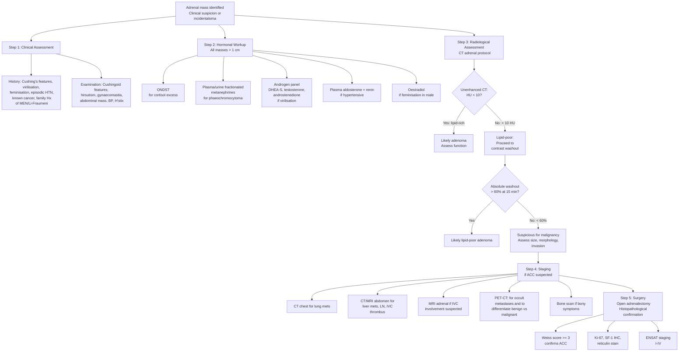
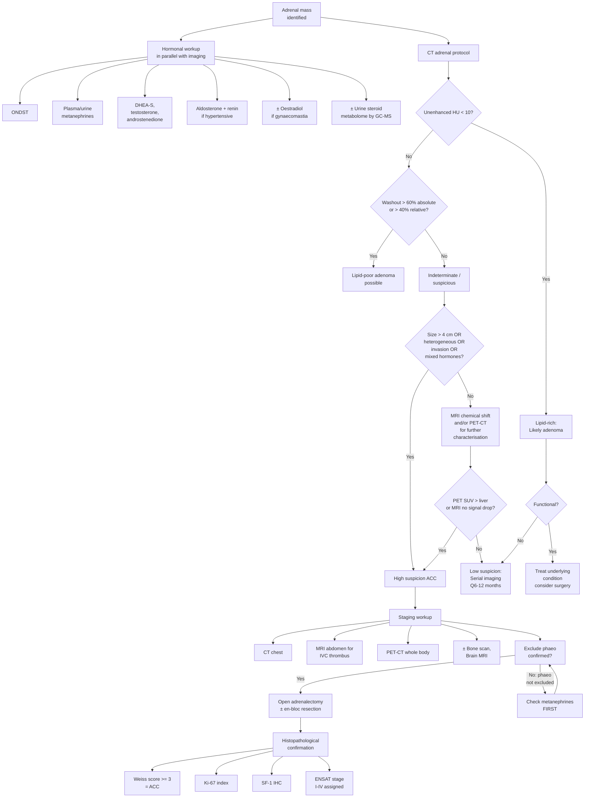

## Diagnosis of Adrenocortical Carcinoma: Criteria, Algorithm, and Investigations

### Overview of Diagnostic Philosophy

There is no single "diagnostic criterion" for ACC the way there is for, say, rheumatoid arthritis or diabetes. Instead, the diagnosis of ACC is built on **converging evidence** from three pillars:

1. **Hormonal workup** — Is the mass functional? Does it show the chaotic, multi-hormone secretion pattern typical of ACC?
2. **Radiological characterisation** — Does the mass have imaging features of malignancy?
3. **Histopathology** (at surgical resection, **not by biopsy**) — Does the specimen meet criteria for carcinoma on the Weiss scoring system?

The diagnosis is typically **suspected pre-operatively** on hormonal + radiological grounds and **confirmed post-operatively** on histopathology. Let me walk you through each step systematically.

---

### 1. Diagnostic Criteria

#### 1A. Pre-operative Diagnostic Criteria (Clinical + Radiological Suspicion)

There is no formal "diagnostic criteria checklist" that definitively confirms ACC pre-operatively. Instead, ACC is **strongly suspected** when the following features converge:

| Domain | Findings Suggestive of ACC |
|---|---|
| **Size** | ***> 4 cm*** (***90% of malignant adrenal tumours are > 4 cm***) [1][2][6] |
| **Growth** | ***> 0.5 cm growth over 6 months*** on serial imaging [1] |
| **CT density** | ***> 10 HU on unenhanced CT*** (lipid-poor → not a typical adenoma) [1][2][6] |
| **Contrast washout** | ***< 40% relative washout or < 60% absolute washout*** on delayed phase [1]. Alternatively expressed as ***< 50% absolute washout at 10–15 min*** [2][6] — malignant tumours retain contrast because of their dense, disorganised vasculature and lack of lipid-rich cytoplasm. |
| **Morphology** | ***Irregular shape, heterogeneous, ill-defined borders, hypervascularity, central necrosis*** [1], calcification (~30%) |
| **Local invasion** | ***Vascular and adjacent organ invasion*** on contrast CT/MRI [1][12] |
| **Hormonal pattern** | Mixed hormone secretion (cortisol + androgens), very elevated DHEA-S, elevated steroid precursors (11-deoxycortisol, 17-OHP), oestrogen secretion in males |
| **ACTH** | ***Almost invariably undetectable*** if the tumour secretes cortisol (non-ACTH-dependent Cushing's) [4][6][13] |

<Callout title="Why Can't We Diagnose ACC by Biopsy Pre-operatively?">

This is a critical concept. ***FNA biopsy is NOT indicated: cannot differentiate between benign and malignant mass, risk of tumor seeding*** [1][12]. The reason is two-fold:

1. **Histological limitation**: Individual adrenocortical cells from an adenoma and a carcinoma can look identical on cytology. The diagnosis of malignancy depends on **architectural features** (capsular invasion, sinusoidal invasion, necrosis pattern, mitotic count across 50 HPF) that require a **complete surgical specimen**, not a needle aspirate.

2. **Safety concern**: Needle biopsy risks **tumour seeding** along the needle tract (converting a potentially curable localised disease into incurable peritoneal carcinomatosis) and may precipitate a **hypertensive crisis** if the mass turns out to be a phaeochromocytoma [2][6].

The only exception is biopsy for ***confirmation of adrenal metastasis*** in a patient with a known extra-adrenal malignancy [2][6], and even then, phaeochromocytoma must be excluded first with metanephrines.
</Callout>

#### 1B. Histopathological Diagnostic Criteria — The Weiss Scoring System (Post-operative)

The definitive diagnosis of ACC is made on the **surgical specimen** using the **Weiss system**. This was developed by Dr. Lawrence Weiss in 1984 and remains the gold standard:

| # | Criterion | Rationale |
|---|---|---|
| 1 | **High nuclear grade** (Fuhrman III/IV) | Severe nuclear atypia indicates loss of differentiation — hallmark of malignancy |
| 2 | **Mitotic rate > 5 per 50 HPF** | High proliferative activity — tumour cells are dividing rapidly |
| 3 | **Atypical mitotic figures** | Abnormal spindle formations (tripolar, ring) → genomic instability |
| 4 | **Clear cells ≤ 25% of tumour** | Normal adrenocortical cells are lipid-rich (clear cytoplasm); loss of lipid content reflects dedifferentiation |
| 5 | **Diffuse architecture > 33%** | Loss of the normal trabecular/nested architecture of the adrenal cortex → disorganised growth |
| 6 | **Tumour necrosis** | Tumour outgrowing its blood supply → central ischaemic necrosis |
| 7 | **Venous invasion** | Invasion into veins → capacity for haematogenous spread |
| 8 | **Sinusoidal invasion** | Invasion into adrenal sinusoidal spaces → local aggressive behaviour |
| 9 | **Capsular invasion** | Breaching the tumour capsule → risk of local recurrence and peritoneal dissemination |

> **Score ≥ 3 out of 9 = adrenocortical carcinoma.** Sensitivity ~96%, specificity ~99% for malignancy in adult adrenocortical tumours.

<Callout title="High Yield: Weiss Score ≥ 3 = ACC" type="idea">
Remember "**3 of 9**" — any three of the nine Weiss criteria are sufficient for a diagnosis of ACC. The **mitotic rate** (criterion 2) is particularly important: Ki-67 proliferation index > 10% and mitotic rate > 20/50 HPF are associated with the worst prognosis and guide decisions about adjuvant therapy.
</Callout>

**Supplementary/Alternative Histopathological Tools:**
- **Ki-67 proliferation index**: > 10% suggests aggressive behaviour; used for prognostication (not part of Weiss criteria but increasingly used in clinical decision-making regarding adjuvant mitotane).
- **Reticulin staining**: disruption of the reticulin framework is a sensitive marker for ACC (reticulin algorithm by Duregon et al.).
- **SF-1 (steroidogenic factor 1) immunohistochemistry**: a nuclear transcription factor specific to adrenocortical origin. Positive in ACC, negative in metastases, phaeochromocytoma, and RCC. Useful when the origin of the tumour is uncertain.
- **Wieneke criteria**: used instead of Weiss in **paediatric ACC** (Weiss over-diagnoses malignancy in children).

---

### 2. Comprehensive Diagnostic Algorithm

The diagnostic workup of a suspected ACC follows a logical sequence. Let me explain the reasoning behind each step before presenting the algorithm:

**Step 1 — Clinical Assessment**: History and physical examination for signs of hormonal excess (Cushing's, virilisation, feminisation, Conn's-like features) and mass effect. Also assess for features of known extra-adrenal cancer (is this a metastasis?).

**Step 2 — Hormonal Workup (Functional Assessment)**: Every adrenal mass > 1 cm requires hormonal screening [1][2][6]. This is done in parallel with imaging, not sequentially, because the results affect both differential diagnosis and surgical planning.

**Step 3 — Radiological Assessment (Malignancy Assessment)**: CT adrenal protocol is the cornerstone. MRI and PET-CT are adjuncts for specific scenarios.

**Step 4 — Staging (if ACC suspected)**: Once ACC is suspected, staging determines operability and guides the extent of surgery and adjuvant therapy.

**Step 5 — Histopathological Confirmation (post-operative)**: Definitive diagnosis at resection. Weiss scoring, Ki-67, SF-1 IHC.

---

### 3. Investigation Modalities — Detailed Breakdown

#### 3A. Hormonal Investigations

The purpose is two-fold: (1) determine if the tumour is functional (affects surgical planning — need steroid cover perioperatively if cortisol-secreting), and (2) identify the pattern of hormone secretion (mixed secretion = red flag for ACC).

##### i. Screening for Cortisol Excess (Cushing's Syndrome)

***Screening tests for functional tumors: ONDST + spot ARR + 24h urine metanephrines*** [1]

| Test | Procedure | Interpretation | Why This Test? |
|---|---|---|---|
| ***1 mg Overnight Dexamethasone Suppression Test (ONDST)*** [1][11] | Give 1 mg dexamethasone PO at 11 pm → measure serum cortisol at 8 am next morning | ***Normal: cortisol < 50 nmol/L (1.8 μg/dL)*** = HPA axis appropriately suppressed. ***Abnormal: > 50 nmol/L*** = failure of suppression → cortisol is being produced autonomously [1][11] | Dexamethasone is a synthetic glucocorticoid that should suppress ACTH via negative feedback → ↓cortisol. In autonomous cortisol production (adenoma or ACC), the tumour ignores the feedback signal. |
| **24h Urinary Free Cortisol (UFC)** ×2 [1][11] | Collect all urine for 24 hours; measure free cortisol (unbound, filtered fraction) | > 3–4× ULN strongly suggests Cushing's; 1–3× ULN is indeterminate | Directly measures total daily cortisol output. Elevated in any cause of hypercortisolism. Caveats: incomplete collection (underfill), renal impairment, very high cortisol can saturate binding protein giving falsely ↑ free fraction. |
| **Late-night salivary cortisol** ×2 [1][11] | Saliva sample collected at 11 pm–midnight | Elevated = loss of circadian nadir (normally cortisol is lowest at midnight) | Only free cortisol enters saliva (ultrafiltration). Tests whether the normal diurnal rhythm is preserved. Not suitable for shift workers. |

> **Confirmation of Cushing's**: ***2 out of 3 screening tests positive ± high pre-test probability*** [1]. Then proceed to **ACTH level** to determine ACTH-dependent vs. non-ACTH-dependent cause.

##### ii. ACTH Level — The Pivotal Test

| ACTH Level | Interpretation | Implication for ACC |
|---|---|---|
| ***Almost invariably undetectable (< 5–10 pg/mL)*** [4][6][13] | **Non-ACTH-dependent** Cushing's — the cortisol is coming from the adrenal itself, suppressing pituitary ACTH via negative feedback | This is the expected finding in **ACC secreting cortisol** and in cortisol-producing adenoma. Distinguishes from pituitary (normal-high ACTH) and ectopic ACTH (high ACTH). |
| Normal to high (> 20 pg/mL) | **ACTH-dependent** — cortisol production is being driven by ACTH (pituitary or ectopic) | Argues against a primary adrenal cortisol-secreting tumour. The adrenal mass may be: (a) an incidental non-functioning adenoma with a separate pituitary cause; (b) bilateral adrenal hyperplasia from ACTH excess. |

<Callout title="Biochemical Fingerprint of ACC vs Other Causes of Cushing's">

| | Cushing's Disease | Ectopic ACTH | ***Adrenal Adenoma or Carcinoma*** | Iatrogenic |
|---|---|---|---|---|
| **Cortisol** | ↑ | ↑↑ | ***↑*** | ↓ |
| **LDDST** | No suppression | No suppression | ***No suppression*** | / |
| **ACTH** | Normal-high | Very high | ***Almost invariably undetectable*** | Low |
| **HDDST** | Usually suppressed | Usually NOT suppressed | ***No suppression*** | / |
| **CRH test** | Exaggerated rise | No significant rise | ***/ (not applicable)*** | / |
| **Localisation** | Pituitary adenoma on MRI | ACTH-secreting tumour on PET/CT | ***Adrenal tumour on CT abdomen*** | +ve drug Hx |

*Source: [4][6][13]* — This table is ***extremely high yield*** for exams.

</Callout>

##### iii. Adrenal Steroid Profile — The ACC-Specific Panel

This is where you distinguish ACC from a benign adenoma. ACC cells have **deranged steroidogenic enzyme expression** → they produce hormones inefficiently → accumulation of **steroid precursors** and **multiple hormone classes simultaneously**.

| Analyte | Expected in ACC | Expected in Adenoma | Why? |
|---|---|---|---|
| **DHEA-S** (dehydroepiandrosterone sulphate) | ***Markedly elevated*** (often > 600 μg/dL) | Normal or mildly elevated | DHEA-S is produced almost exclusively by the zona reticularis. Massive elevation indicates adrenal cortical overproduction, and very high levels (> 600 μg/dL) are almost pathognomonic of ACC. |
| **11-Deoxycortisol** | Elevated | Normal | An intermediate in cortisol synthesis (converted to cortisol by 11β-hydroxylase/CYP11B1). Accumulates when the tumour has deficient 11β-hydroxylase activity — a feature of malignant dedifferentiation. |
| **17-Hydroxyprogesterone (17-OHP)** | Often elevated | Normal | Another steroid precursor that accumulates due to inefficient enzyme activity. |
| **Androstenedione** | Elevated | Normal | Adrenal androgen; elevated in androgen-secreting ACC. |
| **Testosterone** (in women) | Elevated | Normal or slightly elevated | Direct production by ACC or peripheral conversion from androstenedione. |
| **Oestradiol** (in men) | May be elevated | Normal | Oestrogen-producing ACC (rare but pathognomonic in males). Due to aromatase activity within the tumour converting androgens to oestrogens. |
| **Urine steroid metabolome (GC-MS)** | Characteristic "fingerprint" with elevations of multiple steroid metabolites including tetrahydro-11-deoxycortisol (THS) | Normal | Emerging diagnostic tool with ~90% sensitivity and specificity for ACC vs adenoma. Not yet universally available but increasingly used in specialist centres (ESE/ENSAT 2024 guidelines). |

<Callout title="High Yield: The Urine Steroid Metabolome" type="idea">
Gas chromatography–mass spectrometry (GC-MS) of a 24-hour urine sample can produce a **steroid metabolite fingerprint** that distinguishes ACC from adenoma with high accuracy (~90% sensitivity, ~90% specificity). The hallmark is elevation of **tetrahydro-11-deoxycortisol (THS)**, reflecting the accumulation of 11-deoxycortisol due to deficient CYP11B1 in malignant tissue. This is recommended by the 2024 ESE/ENSAT guidelines for all indeterminate adrenal masses and is increasingly becoming a standard of care in high-volume centres.
</Callout>

##### iv. Screening for Phaeochromocytoma

***Must exclude phaeochromocytoma before any biopsy or surgery*** [1][2][6].

| Test | Procedure | Interpretation |
|---|---|---|
| ***24h urine fractionated metanephrines*** (normetanephrine + metanephrine) [1][2][6] | 24-hour urine collection | > 2× ULN is highly suggestive; values within reference range effectively exclude phaeochromocytoma (NPV > 99%) |
| **Plasma free metanephrines** | Single blood draw (patient supine for 30 min) | Higher sensitivity (~99%) but lower specificity than urine. Any elevation requires further workup. |
| ***Clonidine suppression test*** [1] | Confirmatory test: give clonidine (central α2-agonist) → measure plasma normetanephrine/noradrenaline at 3h | Normal: clonidine suppresses sympathetic outflow → ↓catecholamines. Phaeochromocytoma: autonomous secretion → no suppression |

> **Why fractionated metanephrines and not total catecholamines?** Metanephrines (normetanephrine and metanephrine) are metabolites of catecholamines produced **continuously** within chromaffin cells by COMT. They are more stable, less affected by episodic secretion, and have higher sensitivity than measuring the catecholamines themselves (which are secreted in paroxysms and have very short half-lives).

##### v. Screening for Conn's Syndrome (if Hypertensive)

| Test | Procedure | Interpretation |
|---|---|---|
| ***Spot aldosterone:renin ratio (ARR)*** [1][2][6] | Morning blood sample (seated for 15 min); stop interfering drugs if possible (diuretics, β-blockers, ACEi, ARBs) for ≥ 2 weeks; α-blockers and CCBs are acceptable [6] | ***Elevated ARR*** (usually aldosterone > 15 ng/dL and renin suppressed) → primary hyperaldosteronism |
| **Confirmatory**: ***Salt loading test / Saline suppression test*** [1] | IV 0.9% NaCl 2L over 4h, then measure aldosterone | Aldosterone remains > 10 ng/dL → confirms autonomous aldosterone secretion |

> **Note**: Aldosterone-secreting ACC is rare (< 5% of functional ACCs). If present, the mass is usually large and has other features of malignancy.

---

#### 3B. Radiological Investigations

##### i. CT Abdomen with Adrenal Protocol — The Cornerstone

This is the **single most important imaging modality** for adrenal mass characterisation and should be the first-line imaging [1][2][6][12].

**Protocol**: Unenhanced → arterial phase → portal venous phase → **15-minute delayed phase**

| Phase | What It Shows | Key Findings in ACC |
|---|---|---|
| **Unenhanced** | Baseline density (HU) — assesses lipid content | ***> 10 HU*** (lipid-poor). Most adenomas are lipid-rich with ***< 10 HU*** (intracytoplasmic fat droplets attenuate X-rays less) [1][2][6]. ACC cells lose their lipid content as they dedifferentiate → higher density. |
| **Arterial/Portal venous** | Enhancement pattern, tumour vascularity, invasion | Heterogeneous enhancement; ***look for vascular and adjacent organ invasion*** [12] — renal vein/IVC tumour thrombus, invasion of kidney, liver, diaphragm, spleen, pancreatic tail |
| **15-minute delayed** | Contrast washout calculation | ***< 40% relative washout or < 60% absolute washout*** [1]. Adenomas have fenestrated capillaries → contrast washes out quickly. Malignant tumours have dense, chaotic neovasculature → contrast is retained. |

**Washout Calculation Formulas:**

$$\text{Absolute washout} = \frac{\text{Enhanced HU} - \text{Delayed HU}}{\text{Enhanced HU} - \text{Unenhanced HU}} \times 100\%$$

$$\text{Relative washout} = \frac{\text{Enhanced HU} - \text{Delayed HU}}{\text{Enhanced HU}} \times 100\%$$

- ***Absolute washout > 60% or relative washout > 40%*** → likely adenoma [1]
- ***Absolute washout < 60% or relative washout < 40%*** → indeterminate/suspicious → further workup needed

**Additional CT Features of ACC:**
- ***Size > 4 cm*** [1][2][6] (***90% of malignant adrenal tumours are > 4 cm***) [2][6]
- ***Irregular shape, heterogeneous, ill-defined borders, hypervascularity, central necrosis*** [1]
- ***Calcification*** (~30% of ACCs)
- ***Para-aortic lymphadenopathy*** [1]
- ***Contralateral adrenal involvement*** [1]
- ***Local invasion*** of adjacent structures [1][12]

##### ii. MRI Abdomen

**When to use**: Adjunct to CT, particularly useful for:
- **Chemical shift imaging** (in-phase and opposed-phase sequences): Adenomas contain intracellular lipid → signal drop on opposed-phase. ACC does not drop signal (lipid-poor). This is an alternative to unenhanced CT HU measurement.
- ***Assessment of IVC tumour thrombus***: MRI is superior to CT for delineating the cranial extent of IVC thrombus (critical for surgical planning — determines whether cardiopulmonary bypass is needed).
- **Characterisation of indeterminate lesions** on CT.
- **Patients who cannot receive iodinated contrast** (e.g., contrast allergy, severe renal impairment).

| MRI Feature | Adenoma | ACC |
|---|---|---|
| **Chemical shift (opposed-phase signal drop)** | Yes (> 20% signal drop) | No signal drop (lipid-poor) |
| **T2W signal** | Isointense to liver | Heterogeneous, often hyperintense |
| **Gadolinium enhancement** | Homogeneous, rapid washout | Heterogeneous, persistent enhancement |
| **IVC assessment** | N/A | Tumour thrombus clearly delineated |

> ***MRI adrenal: compare signal intensity with spleen*** [1] — on chemical shift imaging, if the adrenal mass drops signal intensity compared to the spleen on opposed-phase images, it is lipid-rich and likely benign.

##### iii. PET-CT

***PET-CT: ↑Sn & ↑Sp to differentiate benign vs malignant lesion; compare SUV with liver*** [1]

| PET Tracer | Role | Interpretation |
|---|---|---|
| **18F-FDG PET/CT** | Differentiating benign from malignant; staging for distant metastases | ***Compare SUV of adrenal mass with liver***: if adrenal SUVmax > liver SUVmax → suspicious for malignancy (sensitivity ~89%, specificity ~94% for ACC vs adenoma). Also detects occult lung, bone, and liver metastases that would change management (upstage to Stage IV → no curative surgery). |
| **68Ga-DOTATATE PET/CT** | If phaeochromocytoma or neuroendocrine tumour suspected | Somatostatin receptor–positive tumours light up. Not typically used for ACC (ACC is DOTATATE-negative). Helps differentiate ACC from a neuroendocrine tumour. |
| **11C-Metomidate PET** | Research/specialist use: highly specific for adrenocortical tissue | Metomidate binds to CYP11B enzymes (specific to adrenal cortex). Positive in adenoma AND ACC (both adrenocortical origin). Not useful for differentiating benign from malignant, but can confirm adrenocortical origin if uncertain. |

##### iv. Chest CT

- **Required for staging** once ACC is suspected.
- Lungs are the **most common site of distant metastasis** from ACC.
- Low-dose non-contrast CT chest is acceptable for screening; contrast-enhanced CT chest is done if pulmonary nodules are found.

##### v. Bone Scan / MRI Spine

- **Not routine**; indicated if the patient has bone pain, elevated ALP, or known advanced disease.
- ACC can metastasise to bone (osteolytic lesions).

##### vi. Fine Needle Aspiration (FNA) Biopsy

***FNA biopsy is NOT indicated: cannot differentiate between benign and malignant mass, risk of tumor seeding*** [1][12]

***Biopsy: rarely indicated. Usually only reserved for confirmation of adrenal metastasis. NOT for primary adrenal tumours (esp avoid if phaeochromocytoma)*** [2][6]

| Scenario | Biopsy Indicated? | Rationale |
|---|---|---|
| **Suspected primary adrenal tumour (ACC, adenoma)** | ***NO*** | ***Histology is NOT useful in differentiating between benign/malignant adrenal tumours (same appearance)*** [2][6]; risk of tumour seeding; risk of hypertensive crisis if undiagnosed phaeochromocytoma |
| **Known extra-adrenal malignancy + new adrenal mass** | **YES** (after excluding phaeochromocytoma) | This is the one scenario where adrenal biopsy is justified — to confirm metastasis and guide systemic therapy. **Must check metanephrines first.** |
| **Suspected adrenal lymphoma** | **YES** | Lymphoma is treated with chemotherapy, not surgery. Tissue diagnosis is essential for subtyping and treatment planning. |
| **Suspected adrenal infection (TB, fungal)** | **Consider** | Culture and histology of aspirate can confirm diagnosis and guide antimicrobial therapy. |

---

#### 3C. Staging Investigations (ENSAT Staging)

Once ACC is suspected or confirmed, staging determines the extent of disease and guides treatment:

| Investigation | What It Assesses | Findings That Affect Staging |
|---|---|---|
| **CT chest** | Pulmonary metastases | Pulmonary nodules → Stage IV |
| **CT/MRI abdomen** | Local extent, lymph nodes, liver metastases, IVC thrombus | Periadrenal invasion → Stage III; Liver mets → Stage IV |
| **MRI with IVC assessment** | Tumour thrombus extent | Renal vein/IVC involvement → Stage III |
| **18F-FDG PET/CT** | Whole-body metastatic survey | Detects occult distant metastases → upstages to Stage IV |
| **Bone scan / MRI spine** | Skeletal metastases (if symptomatic) | Bone mets → Stage IV |
| **Brain MRI** | Brain metastases (if neurological symptoms) | Brain mets → Stage IV (rare in ACC, unlike lung cancer) |

**ENSAT Staging Criteria (2009)** — for reference (previously covered in Part 1):

| Stage | Criteria |
|---|---|
| **I** | Tumour ≤ 5 cm, confined to adrenal |
| **II** | Tumour > 5 cm, confined to adrenal |
| **III** | Any size + local invasion (periadrenal fat, adjacent organs) OR regional lymph nodes OR tumour thrombus in renal vein/IVC |
| **IV** | Distant metastases |

---

#### 3D. Laboratory Investigations — Baseline and Supportive

| Investigation | Purpose | Expected Findings in ACC |
|---|---|---|
| **CBC** | Baseline; assess for polycythaemia, anaemia | Polycythaemia (cortisol stimulates erythropoiesis); or anaemia of chronic disease in advanced ACC |
| **RFT (renal function)** | Baseline; assess for hypokalaemia | ***Hypokalaemic metabolic alkalosis*** if cortisol excess overwhelms 11β-HSD2 |
| **LFT** | Baseline; assess for liver metastases | Elevated ALP, GGT, transaminases if liver involvement |
| **Glucose / HbA1c** | Screen for DM (cortisol-induced insulin resistance) | Hyperglycaemia / new-onset DM |
| **Coagulation profile** | VTE risk assessment (cortisol → hypercoagulability) | May show ↑fibrinogen; ACC + Cushing's = very high VTE risk |
| **Calcium, phosphate** | Metabolic assessment | Usually normal in ACC (unlike hypercalcaemia of malignancy from PTHrP-secreting tumours) |
| **CRP / ESR** | Inflammatory markers | May be elevated in advanced disease |

---

#### 3E. Genetic Testing

| When | What | Why |
|---|---|---|
| **Age < 40 years** | TP53 germline testing (Li-Fraumeni) | Paediatric and young adult ACC has high prevalence of TP53 mutations; affects cancer surveillance for patient and family |
| **Clinical features of Beckwith-Wiedemann** | 11p15 methylation analysis | Macrosomia, macroglossia, omphalocele, hemihyperplasia — increased risk of childhood ACC |
| **Suspected MEN1** | MEN1 gene (menin) | Multiple endocrine tumours in patient/family (parathyroid, pituitary, pancreatic NET) |
| **Suspected Lynch syndrome** | Mismatch repair genes (MLH1, MSH2, MSH6, PMS2) | Personal/family history of colorectal, endometrial, ovarian cancers |
| **Any ACC at diagnosis** | Consider genetic counselling referral | ESMO/ENSAT 2024 guidelines recommend considering germline genetic testing for all ACC patients, as ~5–10% harbour a pathogenic germline variant |

---

### 4. Integrated Diagnostic Algorithm — Summary Mermaid Diagram

---

<Callout title="High Yield Summary - Diagnosis of ACC">

**Pre-operative diagnosis is based on converging hormonal + radiological evidence:**

1. **Hormonal red flags for ACC**: Mixed cortisol + androgen secretion; very high DHEA-S (> 600 μg/dL); elevated steroid precursors (11-deoxycortisol); suppressed ACTH (non-ACTH-dependent); oestrogen secretion in males.

2. **CT adrenal protocol features of ACC**: Size > 4 cm; > 10 HU unenhanced (lipid-poor); < 60% absolute washout (contrast retention); heterogeneous with necrosis/haemorrhage/calcification; irregular borders; local invasion.

3. **FNA biopsy is NEVER indicated for suspected primary adrenal tumours** — cannot distinguish benign from malignant; risks tumour seeding and hypertensive crisis.

4. **Definitive diagnosis**: Post-operative histopathology using **Weiss score ≥ 3/9 = ACC**. Ki-67 > 10% indicates aggressive behaviour.

5. **Staging**: ENSAT system (I–IV). CT chest, MRI abdomen (IVC), PET-CT for metastatic survey.

6. **Key screening tests for adrenal incidentaloma**: ONDST + plasma/urine metanephrines + ARR (if HTN) + androgen profile (if virilised).

7. **Biochemical hallmark of adrenal Cushing's (adenoma or ACC)**: Elevated cortisol, no suppression on LDDST, ACTH almost invariably undetectable, no suppression on HDDST.

</Callout>

---

<ActiveRecallQuiz
  title="Active Recall - Diagnosis of Adrenocortical Carcinoma"
  items={[
    {
      question: "State the Weiss scoring system threshold for diagnosing adrenocortical carcinoma and list 4 of the 9 Weiss criteria.",
      markscheme: "Score 3 or more out of 9 criteria = ACC. Any 4 of: (1) High nuclear grade Fuhrman III/IV, (2) Mitotic rate > 5/50 HPF, (3) Atypical mitoses, (4) Clear cells 25% or less of tumour, (5) Diffuse architecture > 33%, (6) Tumour necrosis, (7) Venous invasion, (8) Sinusoidal invasion, (9) Capsular invasion."
    },
    {
      question: "Explain the washout calculation on CT adrenal protocol. What thresholds distinguish adenoma from a suspicious mass?",
      markscheme: "Absolute washout = (Enhanced HU - Delayed HU) / (Enhanced HU - Unenhanced HU) x 100%. Relative washout = (Enhanced HU - Delayed HU) / Enhanced HU x 100%. Adenoma: absolute washout > 60% or relative washout > 40%. Suspicious for malignancy: absolute washout < 60% or relative washout < 40%. Adenomas have fenestrated capillaries allowing rapid contrast exit; malignant tumours have chaotic neovasculature retaining contrast."
    },
    {
      question: "A patient has confirmed Cushing's syndrome with undetectable ACTH. CT shows a 6 cm heterogeneous adrenal mass with elevated DHEA-S and 11-deoxycortisol. What is the most likely diagnosis and why does the steroid precursor elevation support it?",
      markscheme: "Adrenocortical carcinoma. Undetectable ACTH confirms non-ACTH-dependent Cushing's (adrenal source). Elevated DHEA-S (adrenal androgen) plus elevated 11-deoxycortisol (cortisol precursor that accumulates due to deficient CYP11B1 in malignant tissue) indicates inefficient, disorganised steroidogenesis characteristic of ACC, not the efficient single-hormone production of a benign adenoma."
    },
    {
      question: "In what specific clinical scenario is FNA biopsy of an adrenal mass appropriate? What must be excluded first?",
      markscheme: "Biopsy is appropriate when a patient has a known extra-adrenal malignancy and a new adrenal mass, to confirm adrenal metastasis if it would change management. Phaeochromocytoma must be excluded first by checking plasma or urine fractionated metanephrines, because biopsy of an undiagnosed phaeochromocytoma can trigger a life-threatening catecholamine crisis."
    },
    {
      question: "On PET-CT for an indeterminate adrenal mass, how do you interpret the FDG uptake to differentiate benign from malignant?",
      markscheme: "Compare the SUVmax of the adrenal mass with the SUVmax of the liver. If adrenal SUVmax exceeds liver SUVmax, the mass is suspicious for malignancy (sensitivity approximately 89%, specificity approximately 94% for ACC vs adenoma). Benign adenomas typically show FDG uptake less than or equal to the liver."
    },
    {
      question: "List the complete hormonal screening panel recommended for an adrenal incidentaloma > 1 cm. For each test, state what condition it screens for.",
      markscheme: "(1) 1 mg overnight dexamethasone suppression test (ONDST) - screens for Cushing's syndrome / autonomous cortisol secretion. (2) Plasma or 24h urine fractionated metanephrines - screens for phaeochromocytoma. (3) Plasma aldosterone and renin ratio (ARR) - screens for primary hyperaldosteronism / Conn's syndrome (only if hypertensive). (4) Androgen profile including DHEA-S and testosterone - screens for androgen-secreting tumour (only if virilised woman). Optional: oestradiol if feminisation in male."
    }
  ]}
/>

## References

[1] Senior notes: maxim.md (Section: Adrenal incidentaloma — Investigations, CT features, management criteria)
[2] Senior notes: Ryan Ho Endocrine.pdf (Section 3.5.1 — Adrenal Incidentaloma, p. 68)
[4] Senior notes: Ryan Ho Endocrine.pdf (Section 3.3.2 — Cushing's Syndrome, biochemical summary table, p. 63)
[6] Senior notes: Ryan Ho Fundamentals.pdf (Section B — Adrenal Incidentaloma, p. 438)
[11] Senior notes: Ryan Ho Chemical Path.pdf (Section 4.1 — Diagnosis of Cushing Syndrome, p. 29)
[12] Senior notes: maxim.md (Section: Adrenocortical carcinoma — Investigations and Treatment)
[13] Senior notes: Ryan Ho Fundamentals.pdf (Section: Cushing's syndrome biochemical summary, p. 437); Adrian Lui Pediatrics.pdf (Section 8.3.2, biochemical summary table, p. 287)
