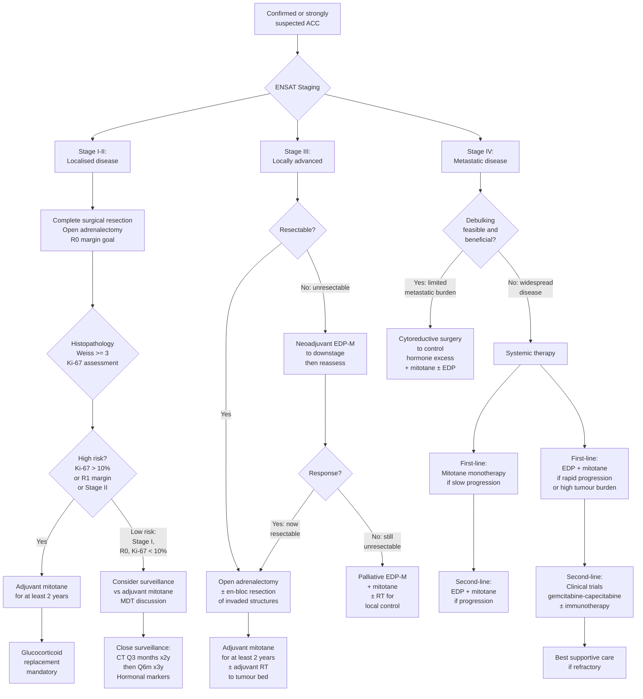

## Management of Adrenocortical Carcinoma

### Guiding Principles

Before diving into the specifics, let's establish the management philosophy for ACC. Think of it in three layers:

1. **Surgery is the only curative modality** — complete (R0) surgical resection is the single most important prognostic factor. Everything else is adjunctive.
2. **Mitotane is the cornerstone of adjuvant/palliative systemic therapy** — it is the only drug specifically approved for ACC. It is both **adrenolytic** (destroys adrenal cortical cells) and **steroidogenesis inhibitor**.
3. **Cytotoxic chemotherapy is reserved for advanced/refractory disease** — the standard regimen is EDP-M (etoposide, doxorubicin, cisplatin + mitotane).

The management approach is **stage-dependent**, guided by the ENSAT staging system established in the prior section.

---

### 1. Management Algorithm — Overview

---

### 2. Surgical Management — The Cornerstone

#### 2A. Principles of Surgery

***Surgery: open adrenalectomy ± en-bloc resection of kidney / spleen (if invaded)*** [12]

> ***Basic principles of endocrine surgery: (1) Confirm endocrine diagnosis, (2) Localization of tumour, (3) Render patient medically fit, (4) Establish need to operate, (5) Surgical tactics*** [2]

The goal of surgery in ACC is **complete macroscopic and microscopic resection (R0)** — this is the single most important determinant of long-term survival. Let me break down the surgical considerations:

##### i. Approach: Open vs Laparoscopic

| Approach | When to Use | Rationale |
|---|---|---|
| ***Open adrenalectomy*** [1][12][14] | ***Preferred if mass > 6 cm or malignant*** [1] | ACC tumours are typically large, locally invasive, and friable. Open surgery allows: (1) direct visualisation and tactile assessment of tumour extent; (2) en-bloc resection of invaded adjacent structures; (3) complete lymph node dissection; (4) avoidance of tumour capsule rupture (which would upstage to Stage III and dramatically worsen prognosis). |
| ***Laparoscopic approach*** [1][14] | Only if tumour is ***< 6 cm*** and imaging shows **no evidence of local invasion** | Laparoscopic adrenalectomy is standard for benign adrenal lesions. However, for known or suspected ACC, laparoscopic resection carries a **higher risk of incomplete resection, tumour capsule rupture, and port-site metastasis** — particularly for larger tumours. The 2024 ESE/ENSAT guidelines recommend **open surgery for all confirmed or suspected ACC**, unless the tumour is small, appears confined, and is being resected at a high-volume centre with expertise. |

<Callout title="Why Open and Not Laparoscopic for ACC?" type="error">

This is a common exam mistake. Students often default to "laparoscopic is better because it's minimally invasive." For ACC, this is wrong. The risk of **tumour capsule rupture** during laparoscopic mobilisation converts a potentially curable R0 resection into an R2 (macroscopic residual disease) with peritoneal seeding — essentially converting Stage I/II into incurable Stage IV. The **ADIUVO trial** and multiple retrospective series have shown that laparoscopic resection of ACC > 6 cm is associated with higher recurrence rates. ***Open approach is preferred for suspected ACC.*** [1][14]

</Callout>

##### ii. Extent of Resection

| Scenario | Surgical Procedure | Rationale |
|---|---|---|
| **Localised ACC (Stage I–II)** | Open radical adrenalectomy with wide periadrenal fat excision | Remove the entire adrenal gland with an intact capsule and wide margin of surrounding fat to achieve R0 |
| **Locally invasive ACC (Stage III)** | ***Open adrenalectomy ± en-bloc resection of kidney / spleen (if invaded)*** [12] | If the tumour invades adjacent structures, en-bloc resection of those structures is mandatory to achieve R0. Right-sided: may require right nephrectomy, partial hepatectomy, IVC resection/thrombectomy. Left-sided: may require left nephrectomy, distal pancreatectomy, splenectomy. |
| **IVC tumour thrombus** | Adrenalectomy + IVC thrombectomy ± vascular reconstruction | Similar to RCC with IVC thrombus — the extent of thrombus (infrahepatic, intrahepatic, suprahepatic/intra-atrial) determines the surgical complexity (may require liver mobilisation, Pringle manoeuvre, or even cardiopulmonary bypass with hypothermic circulatory arrest for intra-atrial thrombus). |
| **Regional lymph nodes** | Ipsilateral regional lymphadenectomy | Lymph node involvement occurs in ~20–30% of ACC. Routine regional lymphadenectomy is recommended by 2024 ENSAT guidelines for accurate staging and potential therapeutic benefit. |

##### iii. Surgical Complications

***Complications of adrenalectomy*** [1][2][14]:

| Timing | Complication | Mechanism | Prevention/Management |
|---|---|---|---|
| **Intra-op** | ***Intraoperative haemorrhage: adrenal capsular, IVC*** [14] | Rich arterial supply; short right adrenal vein drains directly into IVC | Meticulous technique; vascular surgical support for IVC involvement |
| **Intra-op** | ***Injury to organs: spleen, liver, pneumothorax*** [14] | ***Right adrenalectomy: IVC, right lobe of liver. Left adrenalectomy: pancreatic tail, spleen*** [1] | Knowledge of anatomical relationships; en-bloc resection if already invaded |
| **Intra-op** | ***Adrenal insufficiency*** [1][14] | In cortisol-secreting ACC: the contralateral adrenal is suppressed by chronic cortisol excess (HPA axis suppression). On removal of the tumour, cortisol drops precipitously → Addisonian crisis | ***IV hydrocortisone upon removal of adrenal gland*** [1]; then taper to PO replacement |
| **Intra-op** | Tumour rupture / spillage | Friable, necrotic tumour capsule; excessive manipulation | Open approach; minimal tumour handling; immediate washout if rupture occurs |
| **Early post-op** | ***Acute adrenal insufficiency*** [1][14] | As above — HPA axis takes months to recover | ***PO hydrocortisone post-op*** [1]; may need replacement for 6–18 months |
| **Early post-op** | ***Electrolyte disturbances*** [14] | Loss of aldosterone if bilateral; hypokalaemia correction in previously Cushing's patients | Monitor K⁺, Na⁺ closely; mineralocorticoid replacement if bilateral |
| **Late** | Local recurrence | Microscopic residual disease (R1/R2), capsule violation | Adjuvant mitotane; adjuvant radiotherapy to tumour bed |

---

#### 2B. Pre-operative Preparation — Critical Steps

Pre-operative optimisation is essential in ACC, particularly when the tumour is functional. The adage applies: ***"Render patient medically fit"*** before surgery [2][14].

| Issue | Pre-operative Management | Rationale |
|---|---|---|
| **Cortisol-secreting ACC (Cushing's)** | ***Peri-op steroid cover, antibiotic prophylaxis*** [1]; ***Control and correct HTN, DM, hypoK*** [6]; Consider pre-op **metyrapone** to reduce cortisol levels | Chronic hypercortisolism causes: immunosuppression (↑infection risk), poor wound healing, hypercoagulability (↑VTE risk), hyperglycaemia, and hypokalaemia. Steroid cover is needed because the HPA axis is suppressed → patient cannot mount a stress cortisol response post-op. |
| **VTE prophylaxis** | ***Prophylaxis for DVT*** [6]; LMWH pre-op and post-op; compression stockings | ACC with Cushing's has one of the **highest VTE rates of any cancer** (~20–30% perioperative VTE risk) — due to cortisol-induced ↑factor VIII, ↑vWF, ↑PAI-1, ↓fibrinolysis |
| **Hypokalaemia** | Aggressive K⁺ replacement pre-op; target K⁺ > 3.5 mmol/L | Hypokalaemia from mineralocorticoid effect of excess cortisol → risk of cardiac arrhythmias under anaesthesia |
| **Hyperglycaemia** | Insulin sliding scale or protocol to target normoglycaemia | Cortisol-induced insulin resistance → hyperglycaemia → impaired wound healing and ↑infection risk |
| **Exclude phaeochromocytoma** | Confirm metanephrines are **negative** before surgery | A co-existing or misdiagnosed phaeochromocytoma would cause fatal intra-operative catecholamine crisis |
| ***Aldosterone-secreting ACC*** | ***Correct electrolyte imbalance, e.g. K*** [1]; spironolactone 4 weeks pre-op | Pre-op MRA normalises potassium and blood pressure |

<Callout title="Perioperative Steroid Management — Step by Step" type="idea">

For a cortisol-secreting ACC undergoing adrenalectomy:

1. **Pre-op**: Continue monitoring cortisol; consider metyrapone to reduce levels. Prepare IV hydrocortisone.
2. **Intra-op**: ***IV hydrocortisone 50–100 mg on-call*** [4][14], then 50 mg Q8h.
3. **Post-op Day 1–3**: Rapid taper from 50 mg Q8h → 25 mg Q8h → 15–25 mg/day (physiological replacement).
4. **Long-term**: ***Post-op glucocorticoid ± mineralocorticoid supplement until HPA axis recovers ~1 year later*** [1]. Taper guided by 8 am cortisol and/or ACTH stimulation testing.

If the patient is started on **adjuvant mitotane** post-op, they will need **higher-than-physiological glucocorticoid doses** because mitotane both destroys the contralateral adrenal tissue AND induces CYP3A4 → accelerated cortisol metabolism (see below).

</Callout>

---

### 3. Adjuvant Mitotane — The Central Systemic Agent

***Adjuvant mitotane for at least 2 years (disrupt cortisol synthesis)*** [12]

#### 3A. Pharmacology of Mitotane

Let's break this drug down from first principles because it is unique and important:

**Mitotane** (o,p'-DDD or 1,1-dichloro-2-(o-chlorophenyl)-2-(p-chlorophenyl)ethane) — originally an **insecticide derivative** related to DDT. It was discovered to be **selectively toxic to adrenal cortical cells** in the 1960s.

| Property | Detail | Clinical Implication |
|---|---|---|
| **Mechanism 1: Adrenolytic** | Directly toxic to zona fasciculata and reticularis cells → mitochondrial destruction → cell death | Destroys both tumour and normal adrenocortical tissue → **mandatory glucocorticoid replacement** |
| **Mechanism 2: Steroidogenesis inhibition** | Inhibits multiple steroidogenic enzymes (CYP11A1, CYP11B1, CYP11B2) → blocks cholesterol side-chain cleavage and 11β-hydroxylation | Rapidly reduces cortisol production — useful in functional ACC with Cushing's |
| **Mechanism 3: CYP3A4 induction** | Potent inducer of hepatic CYP3A4 | ***High-dose glucocorticoid replacement: mitotane induces CYP3A4 → rapid activation [i.e., metabolism/clearance] of glucocorticoids*** [12]. Patients need 2–3× physiological hydrocortisone doses (or use dexamethasone, which is not a CYP3A4 substrate) |
| **Pharmacokinetics** | Highly lipophilic → stored in adipose tissue → very long half-life (18–159 days). Therapeutic window is narrow. | Requires **therapeutic drug monitoring (TDM)**: target plasma mitotane level **14–20 mg/L**. Takes 2–3 months to reach therapeutic levels. Below 14 mg/L = subtherapeutic. Above 20 mg/L = toxicity. |

#### 3B. Indications for Adjuvant Mitotane

| Indication | Evidence/Rationale |
|---|---|
| **Stage I with high-risk features (Ki-67 > 10%, R1 margin, Weiss score high)** | Reduces recurrence risk in high-risk resected ACC. The **ADIUVO trial (2024)** was the first RCT of adjuvant mitotane — it showed a **non-significant trend toward improved recurrence-free survival** in the overall population, but a **significant benefit in the high-risk subgroup** (Ki-67 > 10%). Therefore, current guidelines (ESMO/ENSAT 2024) recommend mitotane for patients with **Ki-67 > 10%** or other high-risk features. |
| **Stage II–III after R0/R1 resection** | Standard recommendation — ***adjuvant mitotane for at least 2 years*** [12]. Most guidelines recommend continuing for 2–5 years if tolerated and therapeutic levels are maintained. |
| **Any ACC with R1/Rx margin** | Microscopic positive margin → high recurrence risk → mitotane is recommended. |
| **Functional ACC with persistent hormonal excess post-op** | Mitotane controls cortisol hypersecretion even if residual/recurrent disease is present — acts as medical adrenalectomy. |
| **Metastatic ACC (Stage IV)** | Used as part of systemic therapy (monotherapy for slow progression or combined with EDP for rapid progression). |

#### 3C. Mitotane — Side Effects and Monitoring

| Side Effect | Mechanism | Management |
|---|---|---|
| **GI: nausea, vomiting, diarrhoea, anorexia** (most common, ~80%) | Direct GI irritation; central effects | Take with fatty food (↑absorption of lipophilic drug); antiemetics; dose titration |
| **Adrenal insufficiency** (inevitable at therapeutic doses) | Adrenolytic — destroys normal adrenal cortex | Mandatory glucocorticoid replacement; consider fludrocortisone for mineralocorticoid replacement |
| **Neurological: dizziness, ataxia, confusion, lethargy** | CNS toxicity at supratherapeutic levels (> 20 mg/L) | TDM — keep levels 14–20 mg/L; dose reduction if neurological symptoms |
| **Hepatotoxicity** | Direct hepatic toxicity + CYP induction | Monitor LFTs regularly |
| **Hypercholesterolaemia, hypertriglyceridaemia** | Mitotane stimulates hepatic VLDL/LDL production | Monitor lipids; statins if needed (avoid simvastatin — CYP3A4 substrate, levels reduced by mitotane) |
| **Thyroid dysfunction** | Increases TBG → may lower free T4 levels | Monitor TSH and free T4 |
| **↑CBG (cortisol-binding globulin)** | Hepatic stimulation → total cortisol measurement unreliable | Monitor free cortisol or use clinical assessment + ACTH stimulation test for adequacy of replacement |
| **Gynaecomastia, hypogonadism** | Anti-androgenic effects | Monitor gonadal function |
| **Teratogenicity** | Toxic to fetal adrenal glands | **Absolutely contraindicated in pregnancy**; women of childbearing age need reliable contraception; long washout period (months after stopping) due to lipophilic accumulation |

<Callout title="Critical Drug Interaction: Mitotane + Glucocorticoid Replacement">

***Mitotane induces CYP3A4 → rapid clearance of glucocorticoids*** [12]. Therefore:
- **Hydrocortisone** doses must be **2–3× physiological** (e.g., 40–60 mg/day instead of 15–25 mg/day).
- Alternatively, use **dexamethasone** (0.5–1 mg/day), which is NOT a major CYP3A4 substrate and therefore maintains more reliable levels.
- Many centres prefer dexamethasone for simplicity and reliability during mitotane therapy.
- Always educate the patient about **sick day rules** (double/triple the dose during illness) and provide a **steroid emergency card** — they are functionally adrenally insufficient.

</Callout>

---

### 4. Cytotoxic Chemotherapy

***Chemotherapy for refractory disease*** [12]

#### 4A. First-line: EDP-Mitotane (the FIRM-ACT Regimen)

The landmark **FIRM-ACT trial (Fassnacht et al., NEJM 2012)** established the standard first-line chemotherapy for advanced ACC:

| Component | Drug | Dose (per cycle) | Mechanism |
|---|---|---|---|
| **E** | Etoposide | 100 mg/m² D2–4 | Topoisomerase II inhibitor → DNA strand breaks → apoptosis |
| **D** | Doxorubicin | 40 mg/m² D1 | Intercalates DNA + topoisomerase II inhibitor → DNA damage |
| **P** | Cisplatin | 40 mg/m² D3–4 | Platinum cross-links DNA → prevents replication |
| **+ M** | Mitotane | Continuous, target 14–20 mg/L | Adrenolytic + steroidogenesis inhibitor + synergistic with cytotoxic agents (mitotane reverses multidrug resistance by inhibiting P-glycoprotein) |

- **Cycle**: Repeated every 4 weeks for up to 6 cycles.
- **FIRM-ACT results**: EDP-M was superior to streptozotocin-mitotane in terms of **response rate (23% vs 9%)** and **progression-free survival (5.0 vs 2.1 months)**, though overall survival was not significantly different (~15 months in both arms for advanced disease).

| Indication | Scenario |
|---|---|
| **First-line for rapidly progressive metastatic ACC** | High tumour burden, rapidly growing metastases, symptomatic disease |
| **Neoadjuvant therapy for locally advanced, initially unresectable ACC** | Stage III tumour that encases major vessels or invades structures making R0 resection impossible → EDP-M to downstage → reassess for surgery |
| **Adjuvant chemotherapy (EDP + mitotane)** | May be considered in very high-risk resected ACC (Stage III with R1 margin, Ki-67 > 30%) — not standard, but discussed in MDT |

#### 4B. Second-line and Beyond

| Regimen | Evidence | Role |
|---|---|---|
| **Gemcitabine + capecitabine (± mitotane)** | Retrospective data; response rate ~10–15% | Second-line after EDP-M failure |
| **Streptozotocin + mitotane** | FIRM-ACT comparator arm; inferior to EDP-M | Historical; rarely used as first-line now |
| **Temozolomide** | Limited data; modest activity in some cases | Third-line / salvage |
| **Immunotherapy (pembrolizumab, nivolumab ± ipilimumab)** | Emerging evidence; MSI-high or TMB-high ACC may respond | Clinical trials preferred; may consider if MSI-H (rare in ACC, ~3%) or high TMB; limited efficacy in unselected patients (~10% response rate) |

---

### 5. Radiation Therapy

ACC was traditionally considered "radioresistant," but modern data has nuanced this view:

| Indication | Type | Rationale |
|---|---|---|
| **Adjuvant RT to tumour bed** | External beam RT (50–60 Gy in 25–30 fractions) | For patients with **R1/Rx margin** or **local recurrence risk** (Stage III). Retrospective data suggests ↓local recurrence rates from ~70% to ~30–40% with adjuvant RT. Recommended by ENSAT/ESMO 2024 guidelines for R1 resection and Stage III disease. |
| **Palliative RT** | Various schedules | For symptomatic bone metastases (pain relief), brain metastases, or local symptoms from unresectable primary (pain, compression) |
| **Stereotactic body RT (SBRT)** | Ablative doses to oligometastases | For limited metastatic disease (e.g., 1–3 lung metastases) where surgery is not feasible. Emerging role; limited evidence but growing use. |

> **Why was ACC thought to be radioresistant?** Old data used suboptimal doses and techniques. Modern conformal RT and IMRT can deliver adequate doses to the tumour bed while sparing surrounding structures. The issue is not true radioresistance but rather the high propensity for distant metastasis — local RT cannot prevent haematogenous spread.

---

### 6. Medical Management of Hormonal Excess

#### 6A. Pre-operative Control of Cushing's

***Medical Mx for preoperative Mx of hypercortisolism*** [4][6][14]

| Agent | Mechanism | Notes |
|---|---|---|
| ***Metyrapone: first-line*** [4][6] | ***CYP11B (11β-hydroxylase) inhibitor → ↓cortisol synthesis*** [4] | ***Short-acting, effective within 2h but requires BD/TDS dosing*** [4]. Rapidly controls cortisol. Side effect: accumulation of 11-deoxycortisol and androgens → hirsutism in women. |
| ***Ketoconazole*** [4] | Azole antifungal; inhibits multiple CYP enzymes in steroidogenesis (CYP17, CYP11A1, CYP11B1) | ***S/E: hepatotoxicity, ↓androgen (gynaecomastia, ↓libido, impotence)*** [4]. Second-line due to hepatotoxicity risk. |
| **Osilodrostat** (newer agent, 2020) | CYP11B1 and CYP11B2 inhibitor (more selective than metyrapone) | Approved for Cushing's syndrome (any cause). Potent, oral, BD dosing. S/E: adrenal insufficiency, hypokalaemia (via CYP11B2 inhibition → ↑aldosterone precursors), hirsutism. |
| ***Mitotane*** [4][12] | ***Cytotoxic to adrenal → adjunct "medical" adrenalectomy for CA adrenal*** [4] | Used both pre-operatively (to control cortisol) and as definitive adjuvant therapy. Slow onset (~2–3 months to therapeutic levels). |
| ***Etomidate*** (IV) | Inhibits CYP11B1 at subanaesthetic doses | **Only for emergency use** in severe Cushing's-related crises (e.g., Cushing's crisis with sepsis, psychosis, severe hypokalaemia) — requires ICU monitoring. Given as continuous IV infusion at subanaesthetic dose (0.03 mg/kg/h). |

#### 6B. Block-and-Replace vs Normalisation

***Two approaches to pre-operative cortisol control*** [4]:

| Approach | Method | When to Use |
|---|---|---|
| ***Block-and-replace*** | Total ablation of cortisol with high-dose steroidogenesis inhibitor + exogenous hydrocortisone replacement | ***Used in patients with wide variability in cortisol production and UFC*** [4]. Gives more stable cortisol levels. Easier to manage. Preferred in ACC (cortisol secretion is often erratic and unpredictable). |
| ***Normalisation*** | Titrate steroidogenesis inhibitor to achieve normal cortisol levels without replacement | ***Used in patients with relatively invariable hypercortisolism*** [4]. More physiological but requires frequent monitoring and dose adjustment. |

---

### 7. Management of Recurrent Disease

ACC has a very high recurrence rate — **~50–80% of patients recur even after R0 resection**. Recurrence is managed as follows:

| Scenario | Management |
|---|---|
| **Isolated local recurrence** | Re-resection if R0 feasible + adjuvant RT to tumour bed + mitotane |
| **Isolated/oligometastatic distant recurrence** | Metastasectomy (e.g., pulmonary metastasectomy) if complete resection feasible + mitotane |
| **Widespread recurrence/progression** | Systemic therapy: EDP-M if not previously used, or second-line regimens |

---

### 8. Surveillance Post-Resection

| Modality | Schedule | Rationale |
|---|---|---|
| **CT chest/abdomen/pelvis** | ***Q3 months for first 2 years*** → ***Q6 months for years 3–5*** → annually thereafter | Detects recurrence early; most recurrences occur within 2 years |
| **Hormonal markers** (if previously functional) | At each imaging visit | Rising hormone levels (cortisol, DHEA-S, urine steroid metabolome) often precede radiological recurrence by weeks to months → early biochemical detection |
| **Mitotane levels** (if on adjuvant mitotane) | Q4–8 weeks until therapeutic; then Q3 months | Maintain 14–20 mg/L; dose adjust accordingly |

---

### 9. Summary Table: Management by Stage

| Stage | Surgery | Adjuvant Mitotane | Adjuvant Chemo | Adjuvant RT | Prognosis (5-year OS) |
|---|---|---|---|---|---|
| **I** | Open adrenalectomy, R0 | Consider if Ki-67 > 10% or other high-risk features | No | No | ~65–80% |
| **II** | Open adrenalectomy, R0 | ***At least 2 years*** [12] | No (unless very high risk) | Consider if R1 | ~50–70% |
| **III** | ***Open adrenalectomy ± en-bloc resection*** [12]; regional LN dissection | ***At least 2 years*** [12] | Consider EDP-M if very high risk | Recommended if R1/Rx | ~20–40% |
| **IV** | Cytoreductive surgery if feasible (to control hormone excess / limited mets) | Yes (continuous) | EDP-M first-line for rapid progression; mitotane alone for slow progression | Palliative RT for symptoms | ~0–15% |

---

<Callout title="High Yield Summary — Management of ACC">

**Surgical Principles:**
- ***Open adrenalectomy*** is preferred for confirmed/suspected ACC (***NOT laparoscopic for masses > 6 cm or malignant***) [1].
- ***En-bloc resection of kidney/spleen if invaded*** [12]; regional lymphadenectomy recommended.
- Goal is **R0 resection** — the single most important prognostic factor.

**Perioperative Management:**
- ***Steroid cover*** (HPA axis suppressed), ***antibiotic prophylaxis***, ***DVT prophylaxis*** [1][6].
- ***IV hydrocortisone upon removal of adrenal gland*** → taper to PO replacement [1].
- Correct ***HTN, DM, hypokalaemia*** pre-operatively [6].

**Adjuvant Mitotane:**
- ***At least 2 years*** for Stage II–III and high-risk Stage I [12].
- ***Disrupts cortisol synthesis*** and is adrenolytic [12].
- ***High-dose glucocorticoid replacement mandatory*** because mitotane ***induces CYP3A4 → rapid clearance of glucocorticoids*** [12].
- Therapeutic drug monitoring: target **14–20 mg/L**.

**Chemotherapy:**
- ***Chemotherapy for refractory disease*** [12]: EDP-M regimen (FIRM-ACT trial).
- First-line for rapidly progressive or high-burden metastatic ACC.

**Pre-operative Cortisol Control:**
- ***Metyrapone: first-line*** (CYP11B inhibitor) [4].
- ***Mitotane: cytotoxic to adrenal — adjunct "medical" adrenalectomy for CA adrenal*** [4].
- Block-and-replace or normalisation approach [4].

</Callout>

---

<ActiveRecallQuiz
  title="Active Recall - Management of Adrenocortical Carcinoma"
  items={[
    {
      question: "Why is open adrenalectomy preferred over laparoscopic for suspected adrenocortical carcinoma? What is the critical risk of laparoscopic surgery?",
      markscheme: "Open approach preferred because ACC tumours are typically large, locally invasive, and friable. Laparoscopic surgery carries risk of tumour capsule rupture leading to peritoneal seeding, converting potentially curable localised disease into incurable metastatic disease. Open surgery allows direct visualisation, en-bloc resection of invaded structures, and regional lymphadenectomy. Laparoscopic approach only considered if tumour is less than 6 cm with no evidence of local invasion."
    },
    {
      question: "Explain the mechanism of mitotane and why patients on mitotane require higher-than-physiological glucocorticoid replacement doses.",
      markscheme: "Mitotane has three mechanisms: (1) Adrenolytic - directly toxic to adrenal cortical cells via mitochondrial destruction, destroying both tumour and normal adrenal tissue. (2) Steroidogenesis inhibitor - blocks CYP11A1, CYP11B1, CYP11B2. (3) CYP3A4 inducer - upregulates hepatic CYP3A4 which accelerates metabolism and clearance of exogenous glucocorticoids (hydrocortisone, prednisolone). Therefore patients need 2-3x physiological doses of hydrocortisone, or use dexamethasone which is not a major CYP3A4 substrate."
    },
    {
      question: "A patient with cortisol-secreting ACC is scheduled for open adrenalectomy tomorrow. List the key perioperative management steps.",
      markscheme: "Pre-op: (1) Correct hypokalaemia to > 3.5 mmol/L, (2) Control hyperglycaemia with insulin, (3) Control hypertension, (4) Antibiotic prophylaxis (immunosuppressed from cortisol excess), (5) DVT prophylaxis with LMWH (very high VTE risk), (6) Confirm phaeochromocytoma excluded. Intra-op: (7) IV hydrocortisone 50-100 mg on-call, then 50 mg Q8h (HPA axis suppressed - cannot mount stress response). Post-op: (8) Taper hydrocortisone to 15-25 mg/d maintenance over days, (9) Monitor for adrenal insufficiency, electrolytes, glucose."
    },
    {
      question: "State the first-line cytotoxic chemotherapy regimen for advanced ACC, name the trial that established it, and explain why mitotane is given concurrently.",
      markscheme: "EDP-M regimen: Etoposide + Doxorubicin + Cisplatin + Mitotane (continuous). Established by the FIRM-ACT trial (Fassnacht et al., NEJM 2012) which showed EDP-M was superior to streptozotocin-mitotane in response rate (23% vs 9%) and progression-free survival. Mitotane is given concurrently because: (1) it has direct antitumour activity via adrenolytic effect; (2) it reverses multidrug resistance by inhibiting P-glycoprotein on tumour cells, thereby enhancing sensitivity to cytotoxic agents."
    },
    {
      question: "For a patient with Stage II ACC who has undergone R0 open adrenalectomy, outline the adjuvant therapy and surveillance plan.",
      markscheme: "Adjuvant therapy: Mitotane for at least 2 years with therapeutic drug monitoring targeting plasma levels of 14-20 mg/L. Mandatory glucocorticoid replacement (2-3x physiological due to CYP3A4 induction). Consider mineralocorticoid replacement. Surveillance: CT chest/abdomen/pelvis every 3 months for 2 years, then every 6 months for years 3-5, then annually. Hormonal markers (cortisol, DHEA-S, urine steroid metabolome if previously functional) at each imaging visit. Mitotane levels every 4-8 weeks until stable, then every 3 months."
    },
    {
      question: "Name two medical agents used for pre-operative control of cortisol excess in ACC. For each, state the mechanism and a key side effect.",
      markscheme: "(1) Metyrapone - first-line; CYP11B / 11-beta-hydroxylase inhibitor that blocks cortisol synthesis; short-acting, effective within 2 hours. Key S/E: accumulation of androgens and 11-deoxycortisol causing hirsutism in women. (2) Ketoconazole - azole antifungal that inhibits multiple CYP enzymes (CYP17, CYP11A1, CYP11B1) in steroidogenesis. Key S/E: hepatotoxicity; also anti-androgenic causing gynaecomastia and decreased libido in men."
    }
  ]}
/>

## References

[1] Senior notes: maxim.md (Section: Adrenalectomy — Indications, Approach, Pre-op preparation, Complications; Cushing's syndrome — Perioperative cautions)
[2] Senior notes: Ryan Ho Endocrine.pdf (Section 3.5.1 — Adrenal Incidentaloma, p. 68; Section 3.5.2 — Adrenal Surgery, p. 69)
[4] Senior notes: Ryan Ho Endocrine.pdf (Section 3.3 — Cushing's Syndrome: Medical Mx, p. 64); Adrian Lui Pediatrics.pdf (Section 8.3.2 — Cushing's Syndrome: Medical Mx, p. 288)
[6] Senior notes: Ryan Ho Fundamentals.pdf (Section: Cushing's syndrome management — Perioperative management, p. 437; Section B — Adrenal Incidentaloma, p. 438)
[12] Senior notes: maxim.md (Section: Adrenocortical carcinoma — Treatment)
[14] Senior notes: Ryan Ho Endocrine.pdf (Section 3.5.2 — Adrenal Surgery: Indications, Approach, Complications, p. 69)
