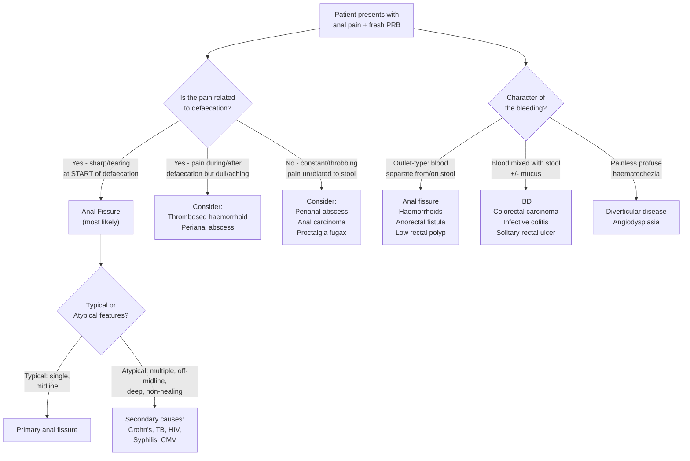

## Differential Diagnosis of Anal Fissure

The presentation of anal fissure — **pain on defaecation + fresh per-rectal bleeding (PRB)** — overlaps with several other anorectal and colorectal conditions. The differential diagnosis can be thought of in two clinical scenarios:

1. **"Painful anal/perianal condition"** — what else causes pain in this area?
2. **"Fresh PR bleeding (outlet-type)"** — what else causes bright red blood separate from stool?

A good clinician must systematically consider and exclude these before settling on a diagnosis of anal fissure. Let's remember what the lecture slides emphasise: ***common anorectal conditions are mostly benign*** but ***colorectal neoplasm needs to be excluded*** [1].

---

### Approach to Differential Diagnosis

---

### Differential Diagnosis Table

I'll organise this by the **two cardinal symptoms** of anal fissure and explain how each differential mimics or differs from it.

#### A. Differentials for Anal/Perianal Pain

| Condition | Key Distinguishing Features | Why It Mimics Fissure | How to Tell It Apart |
|---|---|---|---|
| **Thrombosed external haemorrhoid** (perianal haematoma) | Sudden onset of a ***painful bluish perianal mass*** [6]; constant pain, worse with sitting | Both cause acute anal pain | Haemorrhoid presents as a visible **bluish, tense, tender lump** at the anal verge. Pain is **constant**, not specifically at the start of defaecation. No linear tear visible. |
| **Perianal abscess** | ***Constant throbbing pain*** not necessarily associated with bowel movements; fever, malaise; tender fluctuant swelling [8] | Both cause perianal pain | Abscess pain is **constant and progressive**, with systemic features (fever). There is a palpable tender swelling with warmth and erythema — not a linear tear. |
| **Anorectal fistula** | ***Intermittent perianal discharge (purulent) + pain*** that decreases with drainage [1][9]; palpable cord-like tract on PR exam | Both cause pain on defaecation and PRB | Fistula has a visible **external opening** with discharge. Pain **improves** when pus drains (opposite to fissure where pain persists). History of previous perianal abscess. ***PR exam: induration with cord-like structure*** [1]. |
| **Anal carcinoma** | ***Painful PR bleeding, pruritus, palpable mass*** [10]; risk factors include HPV, HIV, smoking | Can mimic chronic fissure with pain + bleeding | Mass is palpable on DRE; often in older patients or immunocompromised. Non-healing ulcer that doesn't respond to fissure treatment. **Biopsy is diagnostic**. |
| **Proctalgia fugax** | ***Brief attacks of severe rectal pain at night, unrelated to defaecation*** [10] | Both cause severe anal pain | Proctalgia fugax occurs in **young anxious men**, lasts only **minutes**, occurs at **night**, and is completely **unrelated to defaecation** — no bleeding, no visible pathology. |
| **Perianal Crohn's disease** | ***Non-midline, multiple, deep, wide fissures*** + perianal hypertrophic skin tags + may have fistulae/abscesses [1][3][11] | Can present as anal fissure(s) | Look for associated GI symptoms (chronic diarrhoea, abdominal pain, weight loss) and extra-intestinal manifestations (joints, eyes, skin). Fissures are **atypical in position and number**. |
| **Perianal herpes simplex (HSV)** | Painful vesicles/ulcers in the perianal region; may be multiple shallow ulcers | Painful perianal lesions + bleeding | Vesicular appearance, clustering of lesions, history of sexual contact, may have systemic viral prodrome. Viral swab/PCR is diagnostic. |

#### B. Differentials for Fresh Per-Rectal Bleeding

| Condition | Key Distinguishing Features | Why It Mimics Fissure | How to Tell It Apart |
|---|---|---|---|
| **Haemorrhoids** | ***Fresh outlet-type bleed, perianal mass/pain, constipation*** [5]; typically **painless** unless thrombosed | Both cause bright red PRB associated with defaecation | Haemorrhoid bleeding is classically **painless** (internal haemorrhoids are above dentate line → visceral innervation). Blood drips into toilet bowl or is on paper. Prolapsing mass may be noted. |
| ***Colorectal carcinoma (CRC)*** | ***Constitutional symptoms, change in bowel habits, change in stool calibre, tenesmus, IO symptoms, family history*** [5] | Both can cause PRB | CRC bleeding is typically **mixed with stool** (not outlet-type), associated with **weight loss, altered bowel habit, tenesmus**. Older age group. ***Must always be excluded*** [1]. |
| **Solitary rectal ulcer syndrome** | A benign ulcer on the anterior rectal wall, associated with straining and rectal prolapse [2] | Both cause PRB and pain on defaecation | Usually presents with **mucus discharge**, **straining**, and **sensation of incomplete evacuation**. Diagnosis is on proctoscopy/sigmoidoscopy — ulcer is on the **anterior rectal wall**, not at the anal verge. |
| ***Diverticular disease*** | ***Painless profuse haematochezia*** [5][7] | Both cause PRB | Diverticular bleeding is **painless** and **profuse** — a completely different clinical picture from fissure. Occurs in older patients. Right-sided diverticula more common in Asian populations [7]. |
| **Angiodysplasia** | ***Usually anaemic symptoms, associated with aortic stenosis and vascular malformations*** [5] | Both cause PRB | Bleeding is typically **occult** (chronic iron deficiency anaemia) or **painless**. In older patients ( > 65). Diagnosed on colonoscopy/angiography. |
| **IBD (Ulcerative Colitis)** | ***Joint, liver, eye, skin manifestations*** [5]; bloody diarrhoea with mucus | Both cause PRB | UC presents with **bloody diarrhoea** (blood mixed with stool), **urgency**, **tenesmus**, and systemic features. Continuous mucosal inflammation on colonoscopy. |
| **Infective colitis** | ***Fever, chills/rigors, recent antibiotic usage (C. diff), TB exposure, travel history*** [5] | Both cause PRB | Acute onset with **diarrhoea**, **fever**, **systemic toxicity**. Stool culture is diagnostic. |
| ***Rectal polyp / low colorectal polyp*** | Painless bleeding, may be palpable on DRE | Both cause outlet-type PRB | Bleeding is **painless**. Polyp may be palpable on DRE or visible on proctoscopy. Common cause of painless PRB in children (juvenile polyps) [12]. |
| **Rectal prolapse** | Protruding mass through anus with **circumferential folds**, mucous discharge, faecal incontinence [6] | Both can cause PRB and perianal symptoms | Prolapse presents with a visible **circumferential mass** (unlike the radial folds of prolapsed haemorrhoids). Associated with incomplete evacuation and incontinence. |

<Callout title="The Cardinal Rule" type="error">

***Colorectal neoplasm needs to be excluded*** [1]. Even if the clinical picture is classic for anal fissure, any patient over 40 (or younger with red flag features — weight loss, family history, change in bowel habit, anaemia) should have lower GI investigation (sigmoidoscopy or colonoscopy) to exclude malignancy. The lecture slides are very clear on this point.

</Callout>

---

### Differentiating Primary vs Secondary Fissure — A Critical Step

Once you've identified that the lesion is indeed an anal fissure, the next question is: **is this primary (idiopathic) or secondary to an underlying disease?**

***Atypical position and multiple in number*** should prompt investigation for [1]:
- ***Inflammatory bowel disease*** (especially Crohn's)
- ***Tuberculosis***
- ***Syphilis***
- ***HIV infection***
- ***CMV***

The perianal examination in **IBD** is critical — the lecture slides on IBD specifically state that physical examination should include: ***perianal region: skin tags, fissures, fistulas, abscess, PR exam*** [11].

| Feature | **Primary Fissure** | **Secondary Fissure** |
|---|---|---|
| Position | Posterior (90%) or anterior (10%) midline | Off-midline, lateral |
| Number | Single | Multiple |
| Depth | Shallow to moderate | Unusually deep/wide |
| Healing | Responds to conservative Rx | Non-healing, recurring |
| Associated features | Constipation history | Systemic symptoms (diarrhoea, weight loss, fever, other organ involvement) |
| What to do | Treat conservatively | **Investigate**: colonoscopy, biopsy, HIV/syphilis serology, TB workup |

---

### Approach to Excluding Differentials

In practice, ***diagnosis is by spreading the buttocks to reveal the fissure*** [1]. ***Rectal examination and proctoscopy are painful and not indicated*** in the acute setting [1]. So how do we differentiate?

1. **History** is king:
   - ***Hx of constipation, sharp pain associated with start of defaecation*** [5] → classic fissure
   - Constant throbbing pain + fever → abscess
   - Painless bleeding with prolapsing mass → haemorrhoids
   - Constitutional symptoms + change in bowel habit → CRC
   - Intermittent discharge + prior abscess → fistula

2. **Inspection** (gentle separation of buttocks):
   - Linear posterior midline tear → fissure
   - Bluish tense lump → thrombosed external haemorrhoid
   - External opening with discharge → fistula
   - Erythematous fluctuant swelling → abscess
   - Hard irregular mass → carcinoma

3. **DRE** — only when tolerable or under anaesthesia:
   - Cord-like induration → fistula
   - Palpable mass → carcinoma, polyp
   - Boggy fluctuance → abscess

4. **Investigations** (when indicated):
   - ***EUA*** when DRE is too painful [3]
   - **Proctoscopy** [3] — when fissure has healed or under anaesthesia
   - **Sigmoidoscopy / Colonoscopy** — to exclude CRC and evaluate for IBD (especially with atypical features) [2]
   - **Biopsy** — if non-healing ulcer (exclude carcinoma, Crohn's, TB)

---

### Summary Mnemonic: "FISSURE" Differentials

| Letter | Differential |
|---|---|
| **F** | **F**istula-in-ano |
| **I** | **I**nflammatory bowel disease (Crohn's perianal disease) |
| **S** | **S**olitary rectal ulcer syndrome |
| **S** | **S**exually transmitted diseases (syphilis, HSV, HIV) |
| **U** | **U**lcers (perianal ulcers/sores from various causes) |
| **R** | **R**ectal/anal carcinoma |
| **E** | **E**xternal thrombosed haemorrhoid |

---

<Callout title="High Yield Summary — Differential Diagnosis of Anal Fissure">

1. **Two symptom axes to differentiate**: (a) Anal pain — sharp at start of defaecation = fissure; constant/throbbing = abscess; unrelated to defaecation = proctalgia fugax. (b) Fresh PRB — outlet-type on paper = fissure/haemorrhoids; mixed with stool = CRC/IBD/colitis; profuse painless = diverticular.

2. **Key differentials to always consider**: Haemorrhoids (painless), thrombosed external haemorrhoid (painful mass), perianal abscess (constant pain + fever), anorectal fistula (discharge, cord-like tract), CRC (must always exclude), solitary rectal ulcer, anal carcinoma.

3. **Atypical fissure features** (off-midline, multiple, deep, non-healing) → investigate for Crohn's, TB, HIV, syphilis, CMV.

4. **Diagnosis is clinical**: spread buttocks to visualise the fissure. DRE and proctoscopy are painful and not indicated acutely. EUA if needed. Colonoscopy to exclude CRC and IBD.

5. ***Colorectal neoplasm needs to be excluded*** in any patient with PR bleeding — this is the most important differential to rule out.

</Callout>

---

<ActiveRecallQuiz
  title="Active Recall - Differential Diagnosis of Anal Fissure"
  items={[
    {
      question: "A patient presents with acute anal pain and fresh PR bleeding. How do you differentiate anal fissure from a perianal abscess clinically?",
      markscheme: "Anal fissure: sharp/tearing pain specifically at the START of defaecation, small amount of blood on paper, visible linear tear on inspection. Perianal abscess: CONSTANT throbbing pain not specifically related to defaecation, progressive, associated with fever/malaise, tender fluctuant swelling with erythema.",
    },
    {
      question: "Why must colorectal carcinoma always be considered in the differential of anal fissure, and when would you investigate further?",
      markscheme: "CRC can also present with PR bleeding and change in bowel habits. Investigate further if: age over 40, red flag features (weight loss, altered bowel habit, change in stool calibre, tenesmus, anaemia, family history), or if fissure does not respond to standard treatment. Investigation: sigmoidoscopy or colonoscopy.",
    },
    {
      question: "List five features of an atypical anal fissure and name the key secondary causes to investigate.",
      markscheme: "Atypical features: (1) Off-midline/non-midline, (2) Multiple, (3) Recurring, (4) Unusually deep or wide, (5) Painless or non-healing. Secondary causes: Crohn's disease, tuberculosis, syphilis, HIV infection, CMV.",
    },
    {
      question: "How do you distinguish haemorrhoidal bleeding from anal fissure bleeding?",
      markscheme: "Haemorrhoids: typically PAINLESS bright red bleeding (internal haemorrhoids are above the dentate line with visceral innervation), blood drips into toilet bowl, may have prolapsing mass. Anal fissure: bleeding is associated with severe SHARP PAIN at start of defaecation, smaller amount of blood on toilet paper, visible linear tear at posterior midline.",
    },
    {
      question: "A patient has a painful perianal lesion with intermittent purulent discharge that improves when the pus drains. PR exam reveals induration with a cord-like structure. What is the most likely diagnosis and how does this differ from anal fissure?",
      markscheme: "Most likely diagnosis: Anorectal fistula (fistula-in-ano). Differs from fissure because: fistula has a visible external opening with purulent discharge, pain IMPROVES with drainage, palpable cord-like tract on PR, often has history of previous perianal abscess. Fissure has no external opening, no purulent discharge, and pain does NOT improve until the tear heals.",
    },
  ]}
/>

## References

[1] Lecture slides: GC 179. Anal pain perianal lesions and sepsis.pdf (p42–46, p56, p77)
[2] Senior notes: felixlai.md (Anal fissures — Differential diagnosis and Diagnosis sections)
[3] Senior notes: maxim.md (Anal fissure section)
[5] Senior notes: maxim.md (LGIB DDx table — Anal fissure, CRC, Haemorrhoids, IBD, Diverticular disease, Angiodysplasia)
[6] Senior notes: maxim.md (Acute painful anal mass — Differential diagnosis)
[7] Senior notes: felixlai.md (Lower GI bleeding — Differential diagnosis)
[8] Senior notes: felixlai.md (Anorectal abscess — Clinical manifestation)
[9] Senior notes: felixlai.md (Anorectal fistula — Clinical manifestation)
[10] Senior notes: maxim.md (Proctalgia fugax; Anal carcinoma)
[11] Lecture slides: Inflammatory bowel disease.pdf (p10 — Diagnosis: perianal region examination)
[12] Senior notes: maxim.md (Paediatric GI bleed — colonic polyp)
