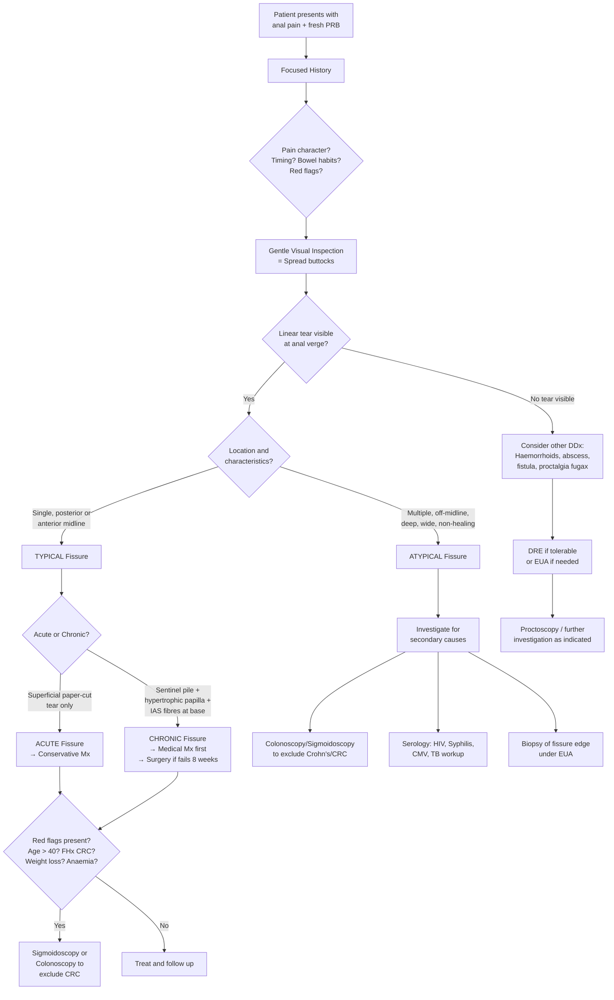

## Diagnostic Criteria, Diagnostic Algorithm & Investigations

### Diagnostic Criteria

Here's the thing about anal fissure — there are **no formal laboratory-based or scoring-system diagnostic criteria** like you'd see for, say, rheumatoid arthritis or SLE. Anal fissure is a **clinical diagnosis**, made primarily on history and visual inspection. The lecture slides are emphatic about this: ***diagnosis is by spreading the buttocks to reveal the fissure*** [1]. ***Rectal examination and proctoscopy are painful and not indicated*** [1] in the acute setting.

That said, there are well-established **clinical diagnostic criteria** that we use to confirm the diagnosis and classify it:

#### Clinical Diagnostic Criteria for Anal Fissure

| Criterion | Details |
|---|---|
| **1. Characteristic history** | ***Pain on defaecation*** [1] — sharp, tearing, specifically at the **start** of defaecation; ***fresh rectal bleeding*** [1] — small amount on toilet paper or stool surface |
| **2. Visual inspection** | ***Spreading the buttocks reveals a linear tear*** in the anoderm [1], most commonly at the ***posterior midline (90%)*** or ***anterior midline (10% of women)*** [1] |
| **3. Classification as Acute or Chronic** | **Acute**: Superficial tear resembling a "paper cut" [2]. **Chronic**: ***Sentinel pile + hypertrophic papilla + visualization of internal sphincter muscles at the base of the fissure*** [1] |
| **4. Typical vs Atypical determination** | **Typical**: Single, midline, without evidence of Crohn's. **Atypical**: ***Multiple, off-midline, recurring, deep/wide, painless*** → suspect secondary cause [1][2] |

<Callout title="The Diagnosis is Clinical — Full Stop">

You do NOT need blood tests, imaging, or endoscopy to diagnose a straightforward primary anal fissure. The combination of (1) characteristic pain on defaecation + fresh PRB, and (2) a visible linear tear at the posterior midline on buttock separation, is sufficient. Investigations are reserved for **atypical features**, **suspected secondary causes**, **exclusion of malignancy**, and **pre-operative planning**.

</Callout>

---

### Diagnostic Algorithm

Let me walk you through the systematic clinical approach from presentation to final diagnosis. This is how you should think in an exam or on the ward.

Let me explain each step from first principles:

#### Step 1: Focused History

The history alone often gives you the diagnosis. Key elements to elicit [3][5]:

- **Chief complaints**: ***Bleeding, pain (fissure-in-ano: pain on defaecation)***, itching, swelling, tenesmus, discharge [3]
- **Pain character**: Sharp/tearing at the START of defaecation → classic for fissure. Constant throbbing → abscess. Brief nocturnal episodes → proctalgia fugax.
- **Bleeding character**: Outlet-type (separate from stool, on paper) → fissure/haemorrhoids. Mixed with stool → CRC/IBD. ***Fresh PRB → distal to splenic flexure; Dark PRB → proximal to splenic flexure*** [3].
- **Bowel habits**: Constipation history, straining → supports primary fissure
- **Red flags for malignancy**: Age > 40, family history CRC, weight loss, change in bowel habit, change in stool calibre, tenesmus, anaemia
- **Features suggesting secondary causes**: Chronic diarrhoea, joint/eye/skin symptoms (IBD), immunosuppression, sexual history (STDs), TB exposure

#### Step 2: Visual Inspection

***Diagnosis is by spreading the buttocks to reveal the fissure*** [1].

- Patient positioned in **left lateral (Sims') position** or **prone jackknife position**
- Gently part the buttocks to expose the anal verge
- Look specifically at the **posterior midline (6 o'clock in lithotomy)** and **anterior midline (12 o'clock)**
- Identify the tear and classify:
  - **Acute**: Superficial, clean-edged, resembles a paper cut [2]
  - **Chronic**: ***Sentinel pile*** (distal), ***hypertrophic papilla*** (proximal), ***internal sphincter muscle fibres at base of fissure*** [1]

<Callout title="Critical Examination Point" type="error">

***Rectal examination and proctoscopy are painful and not indicated*** [1] when an acute anal fissure is visible. Forcing a DRE or proctoscope into a patient with an acute fissure causes unnecessary agony, provides no additional diagnostic information, and may worsen the tear. If examination is essential (e.g., to exclude other pathology), it should be done under ***EUA (examination under anaesthesia)*** [3]. ***AVOID Lord's four-finger stretch*** [3] — it is obsolete due to risk of uncontrolled sphincter damage and faecal incontinence.

</Callout>

#### Step 3: Classify the Fissure

| Feature | Acute | Chronic |
|---|---|---|
| Duration | < 6 weeks | > 6–8 weeks |
| **Pathognomonic finding** | ***Superficial tear*** [2] | ***Hypertrophied with skin tags or papillae*** [2] |
| Base | Granulation tissue or exposed anoderm | ***White horizontally oriented IAS muscle fibres*** [1][2] |
| Edges | Sharp, clean | Raised, fibrotic, rolled |
| Sentinel pile | Absent | ***Present at distal end*** [1] |
| Hypertrophied papilla | Absent | ***Present at proximal end*** [1] |

#### Step 4: Determine If Typical or Atypical

This is a crucial branch point because it determines whether you investigate further or proceed directly to treatment:

- **Typical**: Single + posterior or anterior midline + no features of Crohn's → **primary fissure** → treat
- **Atypical**: ***Multiple + off-midline + recurring + deep/wide + painless*** → ***suspect secondary cause*** → investigate [1][2]

> ***Atypical position and multiple in number*** warrants investigation for: ***inflammatory bowel disease, tuberculosis, syphilis, HIV infection, CMV*** [1]

#### Step 5: Decide on Investigations (If Needed)

Most typical primary fissures need **no investigations**. Investigations are indicated for:
1. Atypical features (to identify secondary cause)
2. Red flag symptoms (to exclude CRC)
3. Pre-operative assessment (before surgical intervention)
4. When diagnosis is uncertain

---

### Investigation Modalities

#### A. Examination Under Anaesthesia (EUA)

| Aspect | Details |
|---|---|
| **When** | ***DRE too painful to perform*** in clinic [3]; need to assess the fissure in detail; suspicion of concurrent pathology (fistula, abscess) |
| **What it involves** | Under general or regional anaesthesia: thorough inspection of the fissure, DRE (assess sphincter tone, exclude mass/induration), proctoscopy, possible biopsy |
| **Key findings** | Depth of fissure, presence of chronic features (sentinel pile, papilla, IAS fibres), sphincter tone, concurrent pathology (fistula tract, abscess cavity) |
| **Why it's useful** | Eliminates pain as a barrier to complete examination. Allows assessment of the entire anal canal which is impossible in the awake patient with an acute fissure. Can combine with therapeutic procedure if needed. |

<Callout title="EUA is Both Diagnostic and Therapeutic" type="idea">
In practice, if a patient is being taken to theatre for an EUA, the surgeon may combine the diagnostic assessment with a therapeutic procedure (e.g., botulinum toxin injection or lateral internal sphincterotomy) in the same anaesthetic session, avoiding the need for a second procedure.
</Callout>

#### B. Proctoscopy

| Aspect | Details |
|---|---|
| **When** | After the fissure has healed or under EUA [3]; ***not indicated in acute fissure*** [1] (too painful) |
| **What it involves** | A rigid or disposable proctoscope is inserted into the anal canal to visualise the distal rectum and anal canal mucosa |
| **Key findings** | Visualise internal haemorrhoids, hypertrophied anal papillae, the fissure itself, rule out low rectal mass or polyp |
| **Why from first principles** | A proctoscope provides a direct view of the anal canal lining — it can confirm chronic fissure features and exclude other anal canal pathology (e.g., internal haemorrhoids, low rectal polyp, anal carcinoma) that wouldn't be visible on external inspection alone |

#### C. Sigmoidoscopy / Colonoscopy

| Aspect | Details |
|---|---|
| **When** | (1) ***Atypical fissure features*** → evaluate for ***Crohn's disease*** [2][4]. (2) Symptoms suggestive of ***colorectal cancer*** (age > 40, red flags, family history) [2]. (3) ***Endoscopy to rule out Crohn's disease first*** before proceeding to surgery for chronic fissure [4]. |
| **What it involves** | Flexible sigmoidoscopy (examines rectum + sigmoid + descending colon) or full colonoscopy (examines the entire colon to caecum + terminal ileum) |
| **Key findings** | **For Crohn's**: Skip lesions, cobblestoning, deep longitudinal ulcers, strictures, aphthous ulcers, terminal ileal involvement. **For UC**: Continuous mucosal inflammation from rectum proximally, pseudopolyps, loss of haustral pattern. **For CRC**: Mass, polyp, ulcerating lesion, stricture. **For TB**: Ileocaecal thickening, transverse ulcers. |
| **Why it's important** | The lecture slides state that investigations serve to ***exclude diseases in the proximal bowel and associated bowel problems (e.g., inflammatory bowel disease)*** [13]. You cannot see Crohn's disease of the terminal ileum by looking at the anus alone. If you're about to perform a lateral internal sphincterotomy on someone who actually has Crohn's, the wound may never heal — Crohn's patients have impaired wound healing and are at high risk of complications. |

> **High Yield**: ***Endoscopy to rule out Crohn's disease first*** [4] before surgical intervention for chronic fissure. This is a crucial pre-operative step.

#### D. Blood Tests (When Indicated)

Blood tests are not needed for diagnosis of the fissure itself, but are useful for:

| Test | Indication & Rationale |
|---|---|
| **Full blood count (FBC)** | Assess for anaemia (iron deficiency from chronic blood loss; or anaemia of chronic disease if IBD). Raised WCC may suggest abscess or infection. |
| **Inflammatory markers (CRP, ESR)** | Elevated in IBD, infection, abscess. Normal in primary fissure. |
| **HIV serology** | If atypical fissure + risk factors (MSM, IVDU, high-risk sexual behaviour). HIV-associated anal ulcers are typically deep, atypical, and painful. |
| **Syphilis serology (RPR/VDRL, TPHA/FTA-Abs)** | If atypical perianal ulcer, especially painless ulcer (primary chancre can mimic fissure). |
| **Iron studies, B12, Folate** | If anaemia detected — helps distinguish cause (iron deficiency from bleeding vs B12/folate deficiency in Crohn's with ileal involvement). |

#### E. Microbiological and Serological Tests

| Test | When & Why |
|---|---|
| **STI screen (HIV, syphilis, HSV, chlamydia, gonorrhoea)** | Atypical fissure in sexually active patient, especially with receptive anal intercourse history |
| **TB workup (Mantoux/IGRA, CXR, sputum AFB)** | Atypical fissure in TB-endemic area (relevant in Hong Kong). Perianal TB can present as non-healing fissure/fistula. |
| **CMV serology / biopsy with immunohistochemistry** | Immunocompromised patients (HIV, transplant). CMV causes perianal ulceration. |
| **Stool cultures** | If concurrent diarrhoea — exclude infective colitis mimicking IBD |

#### F. Biopsy

| Aspect | Details |
|---|---|
| **When** | Non-healing fissure despite adequate treatment; atypical features; suspicion of malignancy (anal carcinoma), Crohn's, or TB |
| **What it involves** | Incisional or punch biopsy of the fissure edge, performed under EUA |
| **Key findings** | **Crohn's**: Non-caseating granulomas, transmural inflammation. **TB**: Caseating granulomas with AFB on Ziehl-Neelsen stain. **SCC**: Malignant squamous cells, keratinisation. **CMV**: Inclusion bodies ("owl's eye" intranuclear inclusions). |
| **Why from first principles** | A fissure that doesn't heal after 8–12 weeks of appropriate treatment is NOT behaving like a typical fissure. The tissue needs histological examination to identify an underlying cause that is preventing healing. |

#### G. Anorectal Manometry (Specialised)

| Aspect | Details |
|---|---|
| **When** | Pre-operative assessment in selected patients, particularly those at **high risk of incontinence** (multiparous women, elderly, previous anal surgery) |
| **What it measures** | Resting anal pressure (reflects IAS tone) and squeeze pressure (reflects EAS function) |
| **Key findings in fissure** | Elevated resting anal pressure (confirming IAS hypertonia/spasm) — this is the physiological basis of the fissure |
| **Why it matters** | If a patient already has low sphincter pressures (e.g., from previous obstetric injury), performing a lateral internal sphincterotomy (which permanently reduces IAS tone) could cause **faecal incontinence**. Manometry helps guide surgical decision-making: sphincterotomy for hypertonic sphincters vs sphincter-sparing procedures (fissurectomy + advancement flap) for those at risk [4]. |

#### H. Endoanal Ultrasound (Specialised)

| Aspect | Details |
|---|---|
| **When** | Pre-operative assessment; suspected sphincter defect; suspected concurrent fistula |
| **What it shows** | Integrity and thickness of IAS and EAS; presence of fistula tracts; scarring from previous surgery |
| **Why useful** | Identifies pre-existing sphincter defects that would make sphincterotomy risky. Can reveal occult fistula tracts not apparent on clinical examination. |

---

### Summary: When to Investigate and What to Order

| Clinical Scenario | Investigations Needed |
|---|---|
| **Typical acute fissure, young patient, no red flags** | **NONE** — clinical diagnosis, treat conservatively |
| **Chronic fissure failing 8 weeks of medical treatment** | EUA + proctoscopy; consider anorectal manometry pre-operatively; ***endoscopy to rule out Crohn's disease first*** [4] |
| **Atypical features** (off-midline, multiple, deep, non-healing) | Colonoscopy (Crohn's, CRC); HIV/syphilis/CMV serology; TB workup; biopsy under EUA |
| **Red flags for CRC** (age > 40, weight loss, FHx, altered bowel habit) | ***Sigmoidoscopy or colonoscopy*** [2] to exclude CRC |
| **Pre-operative** (before LIS in high-risk patient) | Anorectal manometry ± endoanal ultrasound |

---

<Callout title="High Yield Summary — Diagnosis of Anal Fissure">

1. **Anal fissure is a CLINICAL diagnosis** — history + visual inspection by spreading the buttocks. No investigations needed for typical cases.
2. ***Diagnosis is by spreading the buttocks to reveal the fissure. Rectal examination and proctoscopy are painful and not indicated*** in acute fissure.
3. **Acute fissure**: superficial paper-cut tear. **Chronic fissure**: ***sentinel pile + hypertrophic papilla + IAS muscle fibres at base***.
4. **Typical** = single, midline → primary → treat. **Atypical** = multiple, off-midline, deep, non-healing → secondary → investigate (colonoscopy, serology, biopsy).
5. ***Endoscopy to rule out Crohn's disease first*** before surgical intervention for chronic fissure.
6. ***Colorectal neoplasm must always be excluded*** in patients with PR bleeding and red flag features.
7. **EUA** is used when the examination is too painful, and can be combined with therapeutic intervention.
8. **Anorectal manometry** is used pre-operatively to assess sphincter function and guide choice between sphincterotomy vs sphincter-sparing surgery.

</Callout>

---

<ActiveRecallQuiz
  title="Active Recall - Diagnosis of Anal Fissure"
  items={[
    {
      question: "How is the diagnosis of a typical acute anal fissure made? What investigations are required?",
      markscheme: "Diagnosis is CLINICAL: (1) History of sharp pain at start of defaecation + small amount of fresh PR bleeding. (2) Visual inspection by gently spreading the buttocks reveals a linear tear at the posterior midline. NO investigations are required for a typical acute fissure. DRE and proctoscopy are painful and not indicated.",
    },
    {
      question: "Describe the pathognomonic findings that distinguish an acute fissure from a chronic fissure on inspection.",
      markscheme: "Acute fissure: superficial tear resembling a paper cut with clean edges. Chronic fissure: (1) Sentinel pile at distal end, (2) Hypertrophied anal papilla at proximal end, (3) White horizontally oriented internal anal sphincter muscle fibres visible at the base, (4) Raised fibrotic rolled edges.",
    },
    {
      question: "Why must endoscopy be performed before surgical treatment of a chronic anal fissure? What are you looking for?",
      markscheme: "Endoscopy to rule out Crohn's disease first. Crohn's patients have impaired wound healing and are at high risk of complications from sphincterotomy (non-healing wound, worsening fistula). Also to exclude colorectal carcinoma which can present with similar symptoms. Look for: skip lesions, cobblestoning, deep ulcers (Crohn's), mass or polyp (CRC).",
    },
    {
      question: "When would you order anorectal manometry in a patient with anal fissure, and how does it guide management?",
      markscheme: "Ordered pre-operatively in patients at HIGH RISK of faecal incontinence (multiparous women, elderly, previous anal surgery). It measures resting anal pressure (IAS tone) and squeeze pressure (EAS function). High resting pressure confirms IAS hypertonia and supports lateral internal sphincterotomy. Low or normal pressures suggest sphincter-sparing approach (fissurectomy + V-Y advancement flap) to avoid incontinence.",
    },
    {
      question: "A 35-year-old man presents with multiple non-midline, deep anal fissures that have not healed despite 12 weeks of treatment. What investigations would you order and why?",
      markscheme: "Atypical features suggest secondary cause. Investigations: (1) Colonoscopy with ileoscopy to evaluate for Crohn's disease. (2) Biopsy of fissure edge under EUA (granulomas for Crohn's or TB, malignancy). (3) HIV serology, syphilis serology (RPR, TPHA). (4) CMV serology or immunohistochemistry on biopsy. (5) TB workup (IGRA/Mantoux, CXR). (6) FBC, CRP/ESR to assess for systemic inflammation.",
    },
  ]}
/>

## References

[1] Lecture slides: GC 179. Anal pain perianal lesions and sepsis.pdf (p42, p44, p45, p46)
[2] Senior notes: felixlai.md (Anal fissures — Diagnosis section)
[3] Senior notes: maxim.md (Anal fissure — Investigations section)
[4] Senior notes: maxim.md (Anal fissure — Surgical management: endoscopy to rule out Crohn's)
[5] Senior notes: maxim.md (Diseases of anal canal — History taking)
[13] Lecture slides: GC 179. Anal pain perianal lesions and sepsis.pdf (p13 — Investigations)
