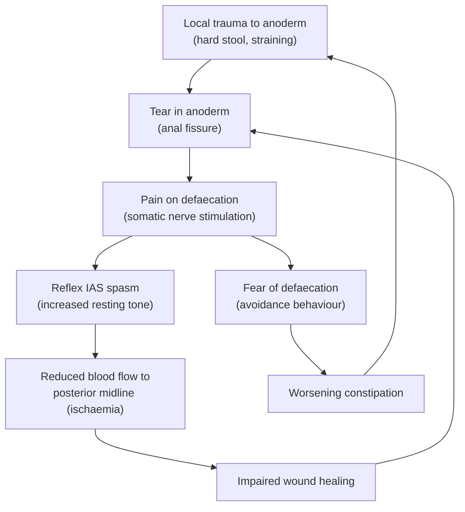

# Anal Fissure

## Definition

***A split (tear) in the anoderm at the dentate line*** [1]. Let's break the name down: "anal" = relating to the anus; "fissure" from Latin *fissura* = a cleft or crack. So quite literally, it is a crack in the lining of the anal canal.

More precisely, an anal fissure is a longitudinal tear in the squamous epithelium (anoderm) of the anal canal, located **distal to the dentate line** [1][2]. It is one of the most common anorectal conditions encountered in clinical practice. The tear typically extends from the dentate line to the anal verge.

<Callout title="Key Distinction: Acute vs Chronic">

- **Acute anal fissure**: A superficial tear resembling a paper cut; typically heals within **6 weeks** with conservative management [2].
- **Chronic anal fissure**: Persists beyond 6–8 weeks; fails conservative management; characterised by a ***triad of the fissure itself + sentinel pile + hypertrophied anal papillae***, with ***visualization of the internal sphincter muscle fibres at the base of the fissure*** [1][3].

</Callout>

---

## Epidemiology

- **Extremely common**: One of the most frequent causes of anal pain and fresh per-rectal bleeding presenting to primary care and surgical outpatients.
- **Age**: Peak incidence in young adults (20–40 years), though can occur at any age including infants.
- **Sex**: Affects males and females roughly equally. However, **anterior midline fissures** are more common in women (***10% of women*** have anterior fissures, often post-partum) [1].
- **Posterior predominance**: ***90% occur at the posterior midline*** [1]. This is critical to understand and is directly related to blood supply (explained below).
- Lifetime prevalence is estimated at ~11% in the general population.
- In Hong Kong, the high prevalence of low-fibre diets, sedentary lifestyles, and constipation contributes significantly.

---

## Risk Factors

The risk factors overlap heavily with those for haemorrhoids and other anorectal pathology, because they all share the common final pathway of **increased anal canal pressure and/or local trauma** [1][4]:

| Category | Risk Factors |
|---|---|
| **Bowel habit** | ***Constipation***, ***straining*** at stool, prolonged diarrhoea [1][4] |
| **Diet** | ***Low fibre diet***, inadequate fluid intake [1][4] |
| **Obstetric** | ***Pregnancy***, vaginal delivery (especially anterior fissures) [1][4] |
| **Genetic / Familial** | ***Family history*** (possibly related to inherited sphincter tone or connective tissue characteristics) [4] |
| **Iatrogenic / Trauma** | Anal instrumentation, anal intercourse |
| **Hypertonic sphincter** | Young patients with high resting internal anal sphincter (IAS) tone |
| **Secondary causes** | IBD (especially Crohn's), HIV, TB, syphilis, malignancy (see Aetiology) |

---

## Anatomy and Function

Understanding the anatomy of the anal canal is essential for understanding why fissures occur where they do, why they hurt, why they bleed, and how we treat them.

### Anal Canal Anatomy

The anal canal measures approximately **4 cm** in length from the anal verge to the anorectal junction [2]. The critical anatomical landmark is the **dentate (pectinate) line**, which divides the canal into upper two-thirds and lower one-third.

| Feature | **Above Dentate Line** | **Below Dentate Line** |
|---|---|---|
| **Embryology** | Endoderm (hindgut) | Ectoderm (proctodeum) |
| **Epithelium** | Columnar epithelium | Stratified squamous epithelium (anoderm) |
| **Nerve supply** | Autonomic (visceral — inferior hypogastric plexus) → **insensate to sharp pain** | Somatic (inferior rectal nerve, branch of pudendal nerve, S2–S4) → **exquisitely sensitive to pain** |
| **Venous drainage** | Superior rectal vein → portal system | Middle & inferior rectal veins → systemic (IVC) |
| **Lymphatic drainage** | Internal iliac & inferior mesenteric nodes | Superficial inguinal nodes |
| **Cancer type** | Adenocarcinoma | Squamous cell carcinoma |

<Callout title="Why Does an Anal Fissure Hurt So Much?" type="idea">
Anal fissures occur **below the dentate line** in the anoderm, which is innervated by **somatic nerves** (inferior rectal nerve). This area has the same pain sensitivity as skin — think of a paper cut on your finger. That's why a small tear causes excruciating, disproportionate pain. By contrast, internal haemorrhoids above the dentate line are painless because they are innervated by visceral autonomic nerves.
</Callout>

### Anal Sphincter Complex

- **Internal anal sphincter (IAS)**: Thickened continuation of the circular smooth muscle of the rectum. It is **involuntary** and responsible for ~70–85% of resting anal tone. This is the key muscle involved in fissure pathophysiology — its ***spasm*** perpetuates the fissure [3].
- **External anal sphincter (EAS)**: Skeletal muscle under **voluntary** control (innervated by the inferior rectal nerve and perineal branch of S4). Responsible for voluntary squeeze pressure.
- **Conjoint longitudinal muscle**: Between IAS and EAS; transmits fibrous septa.

### Blood Supply — Why Posterior Midline?

The anal canal is supplied by:
- **Superior rectal artery** (terminal branch of IMA) — supplies above the dentate line
- **Middle rectal artery** (from internal iliac) — variable contribution
- **Inferior rectal artery** (from internal pudendal artery) — supplies below the dentate line

Critically, anatomical studies have shown that the ***anoderm at the posterior midline has the least blood flow*** compared to other quadrants of the anal canal [2][3]. The posterior commissure is a relative "watershed zone" where the terminal branches of the inferior rectal artery provide the poorest perfusion. This explains:
1. Why ***90% of fissures occur at the posterior midline*** [1]
2. Why increased sphincter pressure (IAS spasm) further compromises this already tenuous blood supply
3. Why the posterior fissure is the most resistant to healing

> **High Yield**: The posterior midline is a **watershed area** of blood supply. IAS spasm → ↓ perfusion → ischaemia → impaired healing. This is the pathophysiological basis for the entire condition and the rationale for all treatments.

---

## Aetiology

Anal fissures can be classified aetiologically into **primary** and **secondary** causes [2]:

### Primary (Idiopathic) Anal Fissures

These result from ***local trauma to the anal canal*** [2]:

- ***Passage of hard stools (constipation)*** — the single most common cause [1][4]
- ***Prolonged diarrhoea*** — liquid stool can be just as traumatic due to repeated passage and chemical irritation
- ***Vaginal delivery*** — particularly causes anterior fissures
- ***Anal intercourse***
- ***Straining*** at defaecation [1][4]

The common thread is **mechanical trauma** to the anoderm that exceeds its capacity to stretch.

### Secondary Anal Fissures

These should be suspected when fissures are ***atypical in position (non-midline), multiple in number, recurring, non-healing, unusually deep or wide, or painless*** [1][3]:

| Category | Specific Causes |
|---|---|
| ***Inflammatory bowel disease*** | **Crohn's disease** (most important — ***always suspect perianal Crohn's disease*** if atypical features [3]); Ulcerative colitis (less common) |
| ***Infections*** | ***Tuberculosis***, ***syphilis***, ***HIV infection***, ***CMV*** [1] |
| **Granulomatous disease** | Extrapulmonary TB, Sarcoidosis |
| **Malignancy** | Squamous cell carcinoma of the anus, Leukaemia |
| **Sexually transmitted diseases** | HIV, Syphilis, Chlamydia, Herpes simplex (HSV) |

<Callout title="When to Suspect Secondary Causes" type="error">
***Atypical position and multiple in number*** should immediately raise suspicion for: ***inflammatory bowel disease, tuberculosis, syphilis, HIV infection, CMV*** [1]. In Hong Kong, TB is an important consideration given higher prevalence. A single posterior midline fissure in a young patient with constipation = primary. Multiple off-midline fissures with deep ulceration in a patient with diarrhoea = think Crohn's, TB, or HIV.
</Callout>

---

## Pathophysiology

This is the core of understanding anal fissure. It is a **vicious cycle** — and every treatment we use targets a specific point in this cycle.

### The Vicious Cycle of Anal Fissure

Let's walk through this step by step:

1. **Initiating event**: ***Hard stool*** or local trauma stretches the anal mucosa beyond its capacity → a **tear** forms in the anoderm, most often at the ***posterior midline*** (least perfused area) [1][3].

2. **Pain**: The anoderm below the dentate line is richly innervated by somatic sensory nerves (inferior rectal nerve). The exposed nerve endings in the tear cause severe, sharp, tearing pain during and after defaecation.

3. ***IAS spasm***: The pain triggers a **reflex spasm of the internal anal sphincter** [3]. This is the key pathological event. The IAS goes into sustained contraction, which:
   - **Pulls the edges of the fissure apart** → prevents apposition of wound edges → impairs healing [2]
   - **Compresses the blood vessels** traversing through the sphincter → ***further reduces perfusion to the already ischaemic posterior midline*** [2][3]

4. **Ischaemia**: The ***posterior midline already has the least blood flow*** [1][3]. IAS spasm worsens this by compressing the terminal branches of the inferior rectal artery. Ischaemia impairs tissue repair and perpetuates the wound.

5. **Avoidance behaviour**: The patient begins to ***avoid defaecation*** due to fear of pain → this leads to ***further constipation*** → harder stools → re-traumatisation of the fissure [3].

6. **Chronicity**: If this cycle is not broken within ~6 weeks, the fissure becomes **chronic**. Chronic changes develop:
   - **Fibrosis** of the fissure edges (raised, rolled edges)
   - ***Sentinel pile*** (skin tag) at the **distal** (external) end of the fissure — this represents ***failed healing*** with formation of a hypertrophied skin tag [3]
   - ***Hypertrophied anal papillae*** at the **proximal** (internal) end of the fissure [1][3]
   - ***Exposed internal sphincter muscle fibres*** visible as white, horizontally-oriented fibres at the base of the fissure [1][2]

<Callout title="Understanding the Pathophysiology = Understanding the Treatment">

Every treatment for anal fissure targets this vicious cycle:
- **Fibre supplements, stool softeners, laxatives** → soften stool → reduce trauma
- **Sitz baths** → relax IAS, improve blood flow
- **Topical vasodilators (GTN, nifedipine)** → relax IAS smooth muscle → reduce spasm → improve blood flow
- **Botulinum toxin** → chemically paralyse IAS → break spasm
- **Lateral internal sphincterotomy** → surgically divide IAS → permanently reduce tone

</Callout>

### Why Posterior Midline?

To reiterate this critical point because it is extremely high yield:

- The ***aetiology*** of posterior midline predominance is threefold [1][3]:
  1. ***Hard stool*** + ***tight internal anal sphincter*** → maximal shearing force at the posterior midline during defaecation (biomechanical studies show the posterior midline bears the greatest mechanical stress)
  2. ***Ischaemia of the overlying anoderm at the posterior midline*** — the posterior commissure is the furthest point from the main arterial supply [1]
  3. The posterior midline has the **thinnest support** from the external sphincter (the EAS is deficient posteriorly in the upper anal canal, offering less structural support)

---

## Classification

### By Duration

| Feature | **Acute Fissure** | **Chronic Fissure** |
|---|---|---|
| **Duration** | < 6 weeks | > 6–8 weeks |
| **Appearance** | Superficial tear, resembles a "paper cut", fresh laceration [2] | Deep ulcer with fibrotic raised/rolled edges [2] |
| **Sentinel pile** | Absent | ***Present*** (distal end) [1][3] |
| **Hypertrophied papilla** | Absent | ***Present*** (proximal end) [1][3] |
| **Sphincter fibres visible** | No | ***Yes — white horizontally oriented fibres of IAS at base*** [1][2] |
| **Pathognomonic feature** | ***Superficial tear*** [2] | ***Hypertrophied with skin tags or papillae*** [2] |
| **Management** | Conservative (medical) | Surgical if fails 8 weeks medical Rx |

### By Position (Typical vs Atypical)

| | **Typical** | **Atypical** |
|---|---|---|
| **Position** | ***Posterior midline (90%)*** or ***anterior midline (10%, especially women)*** [1] | Off-midline, lateral |
| **Number** | Single | ***Multiple*** |
| **Depth** | Superficial to moderate | ***Unusually deep or wide*** |
| **Healing** | Responds to treatment | ***Non-healing, recurring*** |
| **Pain** | Present | May be ***painless*** |
| **Implication** | Primary (idiopathic) | ***Suspect secondary cause*** (Crohn's, TB, HIV, syphilis, CMV) [1] |

> **High Yield**: ***Typical features*** = single posterior or anterior fissure without evidence of Crohn's disease. ***Atypical features*** = multiple, recurring, non-healing, deep or wide, painless, and at off-midline locations → suggests secondary causes [2].

### By Aetiology

- **Primary** (idiopathic): Related to local trauma, constipation, high sphincter tone
- **Secondary**: Related to underlying systemic or local disease (IBD, infections, malignancy)

---

## Clinical Features

### Symptoms

| Symptom | Pathophysiological Basis |
|---|---|
| ***Severe pain on defaecation*** — sharp, tearing, "cutting" quality [2][3] | The tear exposes somatic nerve endings (inferior rectal nerve) in the anoderm below the dentate line. Passage of stool mechanically stimulates these exposed nerves. The pain may persist for minutes to hours after defaecation due to sustained IAS spasm. |
| ***Pain associated with the start of defaecation*** [5] | As stool begins to pass through the anal canal, it mechanically stretches and re-opens the fissure. This distinguishes it from other causes of anal pain (e.g., perianal abscess causes constant throbbing pain). |
| ***Fresh bright red per-rectal bleeding (PRB)*** — typically small amount on toilet paper or surface of stool [2][3] | The tear disrupts small submucosal vessels in the anoderm. Bleeding is typically minor because the vessels below the dentate line are small terminal branches. Blood is bright red (arterial/capillary) because it is fresh and has not been oxidised. |
| **+/- Mucus discharge** [3] | Chronic fissures with associated sentinel pile and hypertrophied papilla may produce mucus from the irritated anal mucosa. |
| ***Perianal pruritus (itching) or skin irritation*** [2] | Chronic discharge, moisture from the wound, and sentinel skin tags cause local skin maceration and irritation. |
| ***Fear/avoidance of defaecation*** [3] | Due to severe pain → patients consciously or subconsciously avoid going to the toilet → worsening constipation → harder stools → further trauma (feeds the vicious cycle). |

<Callout title="Classic History" type="idea">
The classic patient is a young adult who says: "Every time I go to the toilet, I get a sharp, tearing pain in my bottom that lasts for an hour afterwards. There's a small amount of bright red blood on the toilet paper. I've been putting off going to the toilet because I'm so afraid of the pain, which makes my constipation worse."
</Callout>

### Signs

| Sign | Description & Pathophysiological Basis |
|---|---|
| **Visible tear on inspection** | Most fissures can be identified simply by **gentle parting of the buttocks** (without need for DRE in many acute cases). The fissure appears as a linear tear, most commonly at the ***posterior midline (6 o'clock in lithotomy position)*** [1]. |
| **Acute fissure appearance** | ***Superficial tear*** — looks like a fresh "paper cut" with clean, sharp edges [2]. The base may show healthy granulation tissue. |
| ***Chronic fissure triad*** [1][3] | **1. The fissure itself** — deep, with fibrotic raised/rolled edges; ***white horizontally-oriented fibres of the internal anal sphincter muscle visible at the base*** [1][2]. **2. *Sentinel pile*** (skin tag) at the **distal/external end** — represents failed healing with hypertrophic skin tag formation [1][3]. **3. *Hypertrophied anal papillae*** at the **proximal/internal end** [1][3]. |
| **Sphincter spasm** | On gentle examination, the IAS is in sustained spasm — the anus appears "tight" and the patient will resist any attempt at digital examination due to pain. |
| ***DRE may be too painful to perform*** | ***Examination under anaesthesia (EUA) may be required*** [3]. The examiner should NOT force a DRE in a patient with a suspected acute fissure — it is extremely painful and not necessary for diagnosis if the fissure is visible on inspection. |

<Callout title="Do NOT Perform Lord's Four-Finger Stretch" type="error">
***Avoid Lord's four-finger stretch*** [3]. This was a historical procedure involving forceful dilatation of the anus with four fingers to reduce IAS tone. It is now considered **obsolete** because it causes uncontrolled tearing of the sphincter and carries an unacceptably high risk of **faecal incontinence**. It has been replaced by controlled lateral internal sphincterotomy.
</Callout>

### Distinguishing Fissure Pain from Other Causes of Anal Pain

| Condition | Character of Pain | Timing |
|---|---|---|
| **Anal fissure** | Sharp, tearing, cutting | ***Associated with start of defaecation*** [5], persists after |
| **Perianal abscess** | Constant, throbbing, progressive | Not specifically related to defaecation |
| **Thrombosed external haemorrhoid** | Acute, severe, constant | Sudden onset, may worsen with sitting |
| **Proctalgia fugax** | Sudden, severe, cramping | Occurs at night, not related to defaecation |
| **Internal haemorrhoids** | Usually **painless** bleeding | Related to defaecation but without the sharp pain |

---

## Summary of Features Suggesting Secondary Causes

This is worth emphasising separately because it is a common exam question and has important clinical implications:

***Always suspect perianal Crohn's disease if*** [3]:
- ***Non-midline position***
- ***Recurring fissures***
- ***Multiple fissures***
- ***Unusually deep or wide***
- ***Perianal hypertrophic skin tags***

Other secondary causes to consider with atypical features: ***HIV, TB, STD (syphilis, CMV)*** [1]

In any patient with atypical fissure features, the workup must include:
- Assessment for systemic symptoms (weight loss, chronic diarrhoea, fever, joint pain, eye symptoms)
- Sigmoidoscopy/colonoscopy to evaluate for Crohn's disease
- Appropriate serological testing (HIV, syphilis, CMV)
- Biopsy of the fissure edge if indicated (granulomas → Crohn's or TB)

---

<Callout title="High Yield Summary">

1. **Definition**: A tear in the anoderm **below the dentate line**; 90% posterior midline, 10% anterior (women).
2. **Pathophysiology — the vicious cycle**: Trauma → tear → pain → IAS spasm → ischaemia (posterior midline is the least perfused area) → impaired healing → chronicity. Fear of pain → avoidance → constipation → re-trauma.
3. **Acute vs Chronic**: Acute = superficial "paper cut" (< 6 weeks). Chronic = triad of **fissure + sentinel pile + hypertrophied anal papillae** with **visible IAS fibres at the base**.
4. **Typical vs Atypical**: Typical = single, midline. Atypical = multiple, off-midline, deep, wide, painless, non-healing → suspect **Crohn's, TB, HIV, syphilis, CMV**.
5. **Clinical features**: Sharp pain on defaecation + small amount of bright red PR bleeding + perianal pruritus. DRE often too painful — EUA may be required.
6. **Why posterior midline?**: (a) Least blood supply (watershed zone), (b) greatest mechanical shearing force, (c) poorest EAS support posteriorly.
7. **Every treatment targets the vicious cycle**: Soften stool (fibre/laxatives), relax IAS (GTN/nifedipine/botox/LIS), improve blood flow (vasodilators/sitz bath).

</Callout>

---

<ActiveRecallQuiz
  title="Active Recall - Anal Fissure (Definition, Epidemiology, Anatomy, Aetiology, Pathophysiology, Clinical Features)"
  items={[
    {
      question: "Why do 90% of anal fissures occur at the posterior midline?",
      markscheme: "Three reasons: (1) Posterior midline is the least perfused area of the anal canal (watershed zone of blood supply). (2) Greatest mechanical shearing force during defaecation at this point. (3) Deficient external anal sphincter support posteriorly. IAS spasm further reduces blood flow to this area.",
    },
    {
      question: "Describe the vicious cycle that perpetuates an anal fissure and prevents healing.",
      markscheme: "Local trauma causes a tear in the anoderm. Pain from exposed somatic nerves triggers reflex IAS spasm. IAS spasm pulls fissure edges apart and compresses blood vessels, causing ischaemia of the posterior midline. Ischaemia impairs healing. Pain also causes avoidance of defaecation leading to constipation, harder stools, and re-trauma.",
    },
    {
      question: "What is the classic triad of findings in a chronic anal fissure?",
      markscheme: "(1) The fissure itself with visible white horizontally-oriented internal anal sphincter fibres at the base. (2) Sentinel pile (skin tag) at the distal/external end. (3) Hypertrophied anal papillae at the proximal/internal end.",
    },
    {
      question: "List five features that suggest an anal fissure is secondary (atypical) rather than primary, and name four important secondary causes.",
      markscheme: "Atypical features: (1) Non-midline position, (2) Multiple fissures, (3) Recurring, (4) Unusually deep or wide, (5) Painless. Secondary causes: Crohn disease, tuberculosis, HIV infection, syphilis (also CMV).",
    },
    {
      question: "Why is an anal fissure so painful, whereas internal haemorrhoids are typically painless?",
      markscheme: "Anal fissures occur below the dentate line in the anoderm, which is innervated by somatic nerves (inferior rectal nerve) and is exquisitely pain-sensitive. Internal haemorrhoids occur above the dentate line, which is innervated by visceral autonomic nerves (insensate to sharp pain).",
    },
    {
      question: "Explain the pathophysiological rationale for using topical GTN or nifedipine in the treatment of anal fissure.",
      markscheme: "These are vasodilators that relax the internal anal sphincter smooth muscle, thereby breaking the vicious cycle. They reduce IAS spasm (reducing pain and allowing wound edge apposition) and increase local blood flow to the ischaemic posterior midline, promoting healing.",
    },
  ]}
/>

## References

[1] Lecture slides: GC 179. Anal pain perianal lesions and sepsis.pdf (p42–45)
[2] Senior notes: felixlai.md (Anal fissures section)
[3] Senior notes: maxim.md (Anal fissure section)
[4] Lecture slides: GC 179. Anal pain perianal lesions and sepsis.pdf (p24 — Etiology)
[5] Senior notes: maxim.md (Table — Anal fissure: Hx of constipation, sharp pain a/w start of defaecation)
