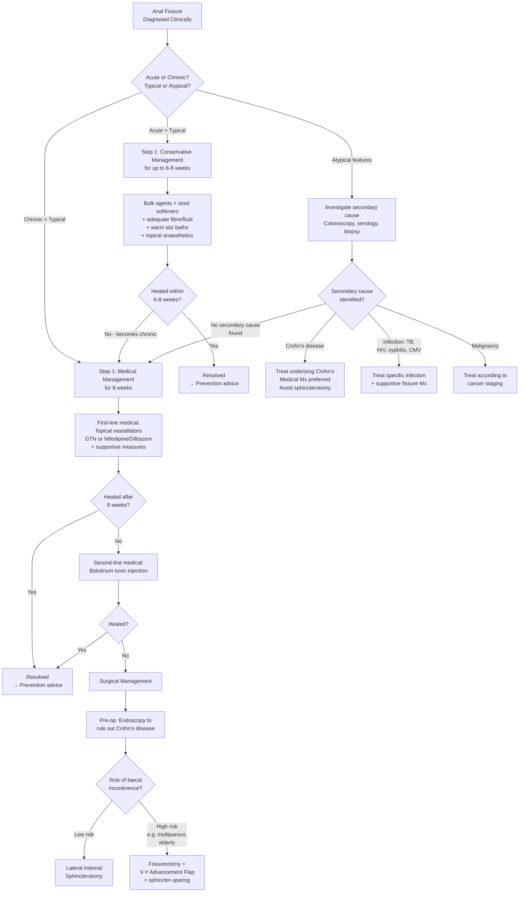

## Management of Anal Fissure

### Guiding Principles

Before diving into specific treatments, let's ground ourselves in the pathophysiology, because **every single treatment targets a specific point in the vicious cycle**:

```
Trauma → Tear → Pain → IAS spasm → ↓ Blood flow (ischaemia) → Impaired healing → Chronicity
                  ↘ Fear → Avoidance → Constipation → Re-trauma ↗
```

| Therapeutic Target | Treatment Modality |
|---|---|
| **Reduce trauma / soften stool** | Fibre supplements, stool softeners, laxatives, adequate fluid intake |
| **Reduce pain** | Topical anaesthetics (lidocaine), sitz baths |
| **Relax IAS / reduce spasm** | Topical GTN, topical nifedipine/diltiazem, botulinum toxin, lateral internal sphincterotomy |
| **Improve blood flow** | Topical vasodilators (GTN, CCBs), sitz baths |
| **Mechanically break the cycle** | Surgical division of IAS (sphincterotomy), fissurectomy + advancement flap |

The overarching strategy follows a **step-up approach**: start conservative → escalate to pharmacological → escalate to surgical if medical treatment fails.

---

### Management Algorithm



---

### Step 1: Conservative / Supportive Management

This is the first-line treatment for **all** anal fissures, and is sufficient for the majority of **acute** fissures. The lecture slides group these as ***non-operative treatment: bulk agents, stool softeners and topical anaesthetics*** [1].

#### A. Dietary and Lifestyle Modification

| Measure | Mechanism (from first principles) | Details |
|---|---|---|
| ***Increased dietary fibre*** [1][2][3] | Fibre adds bulk to stool and retains water → softer, bulkier stool that passes more easily → less mechanical trauma to the anoderm | Aim for 25–30 g/day. Sources: vegetables, fruits, whole grains, psyllium husk (e.g., Metamucil). "Bulk agents" = fibre supplements. |
| **Adequate fluid intake** [2][3] | Water works synergistically with fibre — without adequate fluid, fibre can paradoxically worsen constipation (fibre needs water to swell and soften stool) | Aim for 1.5–2 L/day |
| ***Stool softeners / laxatives*** [1][2][3] | Osmotic laxatives (lactulose, macrogol/PEG) draw water into the bowel lumen → softer stool. Stool softeners (docusate) act as surfactants to allow water penetration into stool. Both reduce the need to strain. | Used as adjunct when dietary modification alone is insufficient |
| **Avoid straining** [2] | Straining increases intra-abdominal and intra-anal pressure → increases IAS tone → worsens ischaemia and re-opens the tear | Advise patients not to sit on the toilet for prolonged periods; go when there is an urge rather than forcing |

#### B. Warm Sitz Bath

| Aspect | Details |
|---|---|
| **What it is** | Sitting in a basin of warm water (not hot) covering the perineum for 10–15 minutes, 2–3 times daily and after bowel movements |
| **Mechanism** | Warmth causes **relaxation of the IAS smooth muscle** → reduces spasm → reduces pain. Also causes local **vasodilatation** → improves blood flow to the ischaemic posterior midline → promotes healing [2]. Additionally provides soothing effect and helps keep the area clean. |
| **Evidence** | Simple, free, no side effects. Part of the standard conservative package for all fissures. |

#### C. Topical Anaesthetics

| Agent | Mechanism | Details |
|---|---|---|
| ***Topical anaesthetics*** e.g. ***5% lignocaine (lidocaine) jelly*** [1][3] | Lignocaine is an amide-type local anaesthetic that blocks voltage-gated sodium channels in sensory nerve endings → prevents depolarisation → blocks pain signal transmission from the exposed somatic nerves in the fissure | Applied before defaecation to reduce the sharp pain. Provides symptomatic relief but does NOT address the underlying IAS spasm or ischaemia — purely palliative. Important as an adjunct to allow more comfortable defaecation and break the avoidance/constipation cycle. |

<Callout title="Conservative Measures Alone Heal ~50% of Acute Fissures" type="idea">
With dietary modification, stool softeners, sitz baths, and topical anaesthetics, approximately half of acute fissures will heal within 6 weeks. The key is breaking the constipation-trauma cycle and giving the anoderm time to re-epithelialise. If it doesn't heal → escalate to topical vasodilators.
</Callout>

---

### Step 2: First-Line Medical Therapy — Topical Vasodilators

These are the ***newer topical agents to reduce internal sphincter pressure*** mentioned in the lecture slides [1]. They are the cornerstone of medical treatment for anal fissure.

#### A. Topical Nitroglycerin (GTN) Ointment

| Aspect | Details |
|---|---|
| **Drug** | 0.2–0.4% ***nitroglycerin*** (glyceryl trinitrate / GTN) ointment [1][2][3] |
| **Mechanism** | GTN is a **nitric oxide (NO) donor**. NO activates guanylate cyclase in smooth muscle → increases cGMP → smooth muscle relaxation. Applied to the perianal skin, it is absorbed and causes: (1) **Relaxation of the IAS smooth muscle** → reduces resting anal pressure → breaks the spasm cycle. (2) **Local vasodilatation** → increases blood flow to the ischaemic posterior midline → promotes healing. |
| **Application** | Applied perianally (to the anal margin, NOT inserted into the canal) 2–3 times daily for 6–8 weeks |
| **Efficacy** | Healing rate ~50–68% (superior to placebo but inferior to surgery). Recurrence rate is significant (~50% at long-term follow-up). |
| **Side effects** | ***Headache*** [3] — the most common side effect (up to 20–60% of patients). This is because GTN is absorbed systemically and causes vasodilatation of cerebral vessels (the same reason IV GTN causes headaches in angina patients). Headache is dose-limiting and is the main reason for non-compliance. Also: dizziness, hypotension. |
| **Contraindications** | Concurrent use of PDE5 inhibitors (sildenafil etc.) — risk of severe hypotension. Severe hypotension/haemodynamic instability. |
| **Indications** | First-line pharmacological treatment for acute fissure not responding to conservative measures alone, and for chronic fissures |

#### B. Topical Calcium Channel Blockers

| Aspect | Details |
|---|---|
| **Drugs** | ***Topical nifedipine*** ointment (0.2–0.5%) [1][2][3]; ***topical 0.5% diltiazem*** [3] |
| **Mechanism** | Nifedipine and diltiazem are **calcium channel blockers (CCBs)**. They block L-type voltage-gated calcium channels in smooth muscle → prevent calcium influx → IAS smooth muscle cannot contract effectively → **reduces IAS spasm** and **improves local blood flow**. The name gives a clue: "nifedipine" → "-dipine" suffix = dihydropyridine CCB = primarily acts on vascular/smooth muscle. |
| **Application** | Applied perianally 2–3 times daily for 6–8 weeks |
| **Efficacy** | Similar to GTN (~65–70% healing rate). Some studies suggest slightly better tolerability due to fewer headaches. |
| **Side effects** | Much **fewer headaches** than GTN (main advantage). Mild local irritation. Theoretically: ***risk of incontinence*** [3] (any agent that reduces IAS tone can cause minor flatus incontinence, though this is rare with topical agents). |
| **Indications** | First-line alternative to GTN (especially if GTN not tolerated due to headache). ***Topical nifedipine*** or ***diltiazem*** can be used interchangeably as first-line. |

<Callout title="GTN vs Nifedipine — Which to Choose?">

Both are first-line options with similar efficacy. The practical choice often comes down to side effects:
- **GTN**: Well-studied, widely available, but ***headache*** is a major problem (up to 60%). Many patients stop treatment because of this.
- **Nifedipine/Diltiazem**: Fewer headaches, better tolerated. Increasingly preferred as first-line in many centres.

Both work by the same principle: **reduce IAS pressure → break the spasm–ischaemia cycle**.

</Callout>

---

### Step 3: Second-Line Medical Therapy — Botulinum Toxin

| Aspect | Details |
|---|---|
| **Drug** | ***Botulinum toxin*** (Botox) type A, ***50 IU*** [1][3] |
| **Mechanism** | Botulinum toxin ("botulinum" from Latin *botulus* = sausage, because it was first identified in sausage food poisoning) is a neurotoxin produced by *Clostridium botulinum*. It cleaves **SNARE proteins** (specifically SNAP-25) at the neuromuscular junction → prevents acetylcholine release from presynaptic nerve terminals → **chemical denervation** of the IAS smooth muscle → muscle paralysis → reduces IAS spasm. Effect lasts ~3 months (until new nerve terminals sprout). |
| **Administration** | Injected directly into the internal anal sphincter under local or general anaesthesia (often during EUA). Usually injected at multiple sites around the IAS. |
| **Efficacy** | Healing rate ~60–80%. Can be repeated if first injection fails. |
| **Side effects** | Temporary flatus incontinence (usually mild and self-limiting as the toxin wears off). Very rarely: faecal incontinence (< 5%). Perianal haematoma at injection site. |
| **Indications** | ***Second-line medical therapy*** [3]: patients who **fail 8 weeks of topical vasodilator therapy** [2], or who cannot tolerate GTN/nifedipine. Also useful as a bridge in patients where surgery is relatively contraindicated (e.g., Crohn's disease). |
| **Contraindications** | Known allergy to botulinum toxin. Myasthenia gravis or other neuromuscular junction disorders (risk of systemic weakness). Active perianal sepsis. |

> **High Yield**: Botulinum toxin is positioned as a second-line option between topical vasodilators and surgery. It provides a **reversible** chemical sphincterotomy — unlike surgical sphincterotomy, which is permanent. This makes it particularly useful in patients at high risk of incontinence.

---

### Step 4: Surgical Management

***Indicated in patients who fail 8 weeks of initial medical treatment*** [2] (some sources say fail conservative management for 8 weeks overall [4]). Before ANY surgery: ***endoscopy to rule out Crohn's disease first*** [4] — this is a critical pre-operative step because operating on a Crohn's fissure without treating the underlying disease leads to disastrous wound healing.

#### Pre-Operative Preparation

| Step | Details |
|---|---|
| ***Endoscopy to rule out Crohn's disease*** [4] | Sigmoidoscopy or colonoscopy before proceeding to surgery. Crohn's patients heal poorly and may develop non-healing wounds, fistulae, or abscesses after sphincterotomy. |
| **Anorectal manometry** (selected patients) | Assess resting IAS pressure and EAS squeeze pressure. Guides choice between sphincterotomy (if hypertonic) vs sphincter-sparing (if normal/low tone). |
| **Stool softener** | Start pre-operatively to reduce post-operative pain from hard stool [6] |
| **Position** | ***Prone jackknife or lithotomy position*** [6] |
| **Anaesthesia** | ***Perianal local anaesthesia / spinal anaesthesia / general anaesthesia*** [6] |

#### A. Lateral Internal Sphincterotomy (LIS)

This is the **gold standard** surgical treatment for chronic anal fissure.

| Aspect | Details |
|---|---|
| **What it is** | ***Lateral internal sphincterotomy is the commonest surgery for anal fissure*** [1]. It involves a **controlled, partial division of the internal anal sphincter** at the lateral aspect (away from the fissure itself, which is usually posterior). |
| **Why "lateral"?** | The sphincterotomy is performed **laterally** (at the 3 o'clock or 9 o'clock position) rather than at the site of the fissure (posterior midline). Why? Because cutting the IAS at the posterior midline (where the fissure already is) would create a "keyhole deformity" — a gutter-like defect that causes soiling and mucus leakage. Lateral division avoids this. |
| **Why "internal"?** | Only the **internal** anal sphincter is divided (the involuntary smooth muscle responsible for ~80% of resting tone). The **external** sphincter (voluntary skeletal muscle) is preserved entirely. This is why continence is maintained. |
| **How much to divide** | The IAS is divided up to the level of the dentate line (approximately the length of the fissure, or roughly the distal 1/3 of the IAS). Over-division causes incontinence; under-division causes treatment failure. |
| **Mechanism** | By permanently reducing resting IAS tone, the surgery: (1) Eliminates the spasm component of the vicious cycle. (2) Allows wound edge apposition. (3) Restores blood flow to the posterior midline. The fissure then heals by secondary intention. |
| **Technique** | Can be performed **open** (small incision at the intersphincteric groove, IAS identified and divided under direct vision) or **closed** (blade inserted through a small stab incision and IAS divided — faster but less controlled). |
| **Efficacy** | ***Healing rate: 95%*** [1] — the most effective treatment available |
| **Complications** | ***Incontinence: 0–15%, most are minor with flatus incontinence*** [1]. This is the main risk. Breakdown: minor flatus incontinence is most common; significant faecal incontinence is rare (< 3%). Other complications: bleeding, haematoma, perianal abscess (rare). |
| **Indications** | Chronic fissure failing 8 weeks of medical treatment [2][4]; ***low risk of faecal incontinence*** [4] (young males, no prior sphincter injury) |
| **Contraindications** | ***High risk of incontinence*** (multiparous women, elderly, prior anal surgery, pre-existing sphincter damage, low resting pressures on manometry) [4]; active Crohn's disease (impaired healing); active perianal sepsis |

<Callout title="LIS — Key Numbers to Remember">

- ***Healing rate: 95%*** [1]
- ***Incontinence risk: 0–15%*** [1]
- ***Most incontinence is minor = flatus incontinence*** [1]
- Recurrence rate: < 5%
- This is the MOST effective treatment for anal fissure — but the incontinence risk means it must be used judiciously.

</Callout>

#### B. Fissurectomy + V-Y Advancement Flap (Sphincter-Sparing)

| Aspect | Details |
|---|---|
| **What it is** | Excision of the chronic fissure (including sentinel pile, hypertrophied papilla, and fibrotic tissue) WITHOUT cutting the IAS. The resulting defect is then covered with a **V-Y advancement flap** — a flap of perianal skin advanced to cover the wound and provide fresh, well-vascularised tissue. |
| **Mechanism** | By excising the chronic fibrotic fissure, you remove the unhealthy tissue that will never heal on its own. The advancement flap provides: (1) Well-vascularised tissue cover. (2) Reduces tension on wound edges. (3) Avoids the need to divide the IAS — hence "sphincter-sparing". |
| **Efficacy** | Healing rate ~85–90% (slightly lower than LIS, but avoids incontinence risk) |
| **Complications** | Flap failure/dehiscence, infection, recurrence (higher than LIS), but **no risk of incontinence from the procedure itself** |
| **Indications** | ***High risk of incontinence: e.g., multiparous women, older patients*** [4] — anyone in whom you cannot afford to reduce sphincter tone further. Also used for fissures associated with low sphincter pressures. |
| **Contraindications** | Active perianal sepsis, active Crohn's (relative) |

<Callout title="Choosing Between LIS and Fissurectomy + Advancement Flap" type="idea">

Think of it simply:
- **LIS** = most effective (95% healing) but trades off a small risk of incontinence. Best for **young, healthy patients with high sphincter tone** and no prior sphincter injury.
- **Fissurectomy + V-Y advancement flap** = slightly less effective (~85-90%) but **sphincter-sparing**. Best for patients where **any degree of incontinence would be unacceptable** — ***multiparous women, older patients***, those with pre-existing sphincter weakness [4].

</Callout>

---

### Management of Secondary (Atypical) Fissures

These require treatment of the **underlying cause** rather than (or in addition to) standard fissure treatment:

| Secondary Cause | Management Approach |
|---|---|
| **Crohn's disease** | **Medical treatment of Crohn's is the priority** (immunomodulators, biologics). Supportive fissure treatment (stool softeners, sitz baths, topical vasodilators). **Avoid LIS** — Crohn's patients have impaired wound healing and high risk of non-healing wound, fistula formation, and incontinence. Botulinum toxin may be used as a bridge. Fissurectomy + advancement flap only if absolutely necessary. |
| **TB** | Anti-TB chemotherapy (standard 6-month RIPE regimen). Supportive perianal care. |
| **HIV** | Antiretroviral therapy. Topical vasodilators for symptomatic relief. Biopsy to exclude CMV or other opportunistic cause. |
| **Syphilis** | Penicillin (standard treatment for syphilis). The "fissure" (chancre) heals with treatment of the infection. |
| **CMV** | Ganciclovir or valganciclovir (especially in immunocompromised patients). |
| **Malignancy** | Treatment according to staging (wide local excision for T1N0 anal SCC; chemoradiation for higher stages). |

---

### Prevention of Recurrence

***Prevention of anal fissures*** [2]:

| Measure | Rationale |
|---|---|
| ***High fibre diet and adequate fluids*** [2] | Maintains soft, bulky stool → reduces mechanical trauma |
| ***Avoid trauma to anus*** [2] | Self-explanatory — avoid anal intercourse or instrumentation during healing |
| ***Avoid straining during defaecation*** [2] | Straining increases IAS pressure → ischaemia → re-tear |
| ***Prompt treatment of diarrhoea*** [2] | Prolonged diarrhoea causes repeated passage of irritant liquid stool → re-traumatises healing anoderm |
| ***Proper anal hygiene*** [2] | Keep the anal area dry; wipe with soft moist cloth rather than rough toilet paper → reduces irritation to healing tissue |

---

### Summary of Treatment Step-Up Approach

| Step | Treatment | Healing Rate | When to Escalate |
|---|---|---|---|
| **1. Conservative** | Fibre, stool softeners, sitz bath, topical anaesthetics | ~50% (acute) | Failure after 6–8 weeks |
| **2. First-line medical** | ***Topical GTN or nifedipine/diltiazem*** + supportive | ~50–70% | Failure after 8 weeks |
| **3. Second-line medical** | ***Botulinum toxin 50 IU*** injection | ~60–80% | Failure or recurrence |
| **4. Surgery** | ***LIS*** (low incontinence risk) or ***Fissurectomy + V-Y flap*** (high incontinence risk) | ***95%*** (LIS) / ~85–90% (flap) | — |

---

<Callout title="High Yield Summary — Management of Anal Fissure">

1. **All fissures**: Start with ***conservative management — bulk agents, stool softeners, topical anaesthetics*** + sitz baths + dietary modification.

2. **First-line pharmacological**: ***Newer topical agents to reduce internal sphincter pressure — nitroglycerin, calcium channel blockers*** [1]. GTN causes headache; nifedipine/diltiazem better tolerated. Both relax IAS and improve blood flow.

3. **Second-line**: ***Botulinum toxin*** 50 IU injection into IAS [1][3]. Reversible chemical sphincterotomy. Good bridge option.

4. **Surgery if fail 8 weeks of medical treatment** [2][4]: ***Endoscopy to rule out Crohn's disease first*** [4].
   - **Low risk of incontinence** → ***Lateral internal sphincterotomy*** (***commonest surgery, healing rate 95%, incontinence 0–15% mostly flatus***) [1].
   - ***High risk of incontinence (multiparous women, older patients)*** → ***Fissurectomy + V-Y advancement flap (sphincter-sparing)*** [4].

5. **Atypical/secondary fissures**: Treat the underlying cause (Crohn's, TB, HIV, syphilis). Avoid sphincterotomy in Crohn's.

6. **Prevention**: High fibre, adequate fluids, avoid straining, proper hygiene, prompt treatment of diarrhoea.

</Callout>

---

<ActiveRecallQuiz
  title="Active Recall - Management of Anal Fissure"
  items={[
    {
      question: "List the non-operative treatments for anal fissure as mentioned in the lecture slides, and explain the mechanism of each.",
      markscheme: "(1) Bulk agents and stool softeners: soften stool to reduce trauma. (2) Topical anaesthetics: block sodium channels in sensory nerves to reduce pain. (3) Nitroglycerin: NO donor, relaxes IAS smooth muscle via cGMP, improves blood flow. (4) Calcium channel blockers (nifedipine/diltiazem): block L-type calcium channels in IAS smooth muscle, reduce spasm, improve blood flow. (5) Botulinum toxin: cleaves SNARE proteins, prevents ACh release at neuromuscular junction, chemical denervation of IAS.",
    },
    {
      question: "What is the healing rate and incontinence risk of lateral internal sphincterotomy?",
      markscheme: "Healing rate: 95%. Incontinence: 0-15%, most are minor with flatus incontinence. It is the commonest surgery for anal fissure.",
    },
    {
      question: "In which patients should you choose fissurectomy with V-Y advancement flap instead of lateral internal sphincterotomy, and why?",
      markscheme: "Patients at HIGH RISK of faecal incontinence: multiparous women, older patients, those with pre-existing sphincter damage or low resting pressures on manometry. The V-Y advancement flap is sphincter-sparing - it does not divide the IAS - so it avoids the risk of incontinence, though healing rate is slightly lower at 85-90%.",
    },
    {
      question: "Why must endoscopy be performed before surgical treatment of chronic anal fissure?",
      markscheme: "To rule out Crohn's disease. Crohn's patients have impaired wound healing and are at high risk of non-healing wounds, fistula formation, and worsening incontinence after sphincterotomy. The underlying Crohn's must be treated medically first. Also helps exclude colorectal carcinoma.",
    },
    {
      question: "A patient on topical GTN for anal fissure complains of severe headaches. What is the mechanism of this side effect and what alternative would you offer?",
      markscheme: "GTN is a nitric oxide donor that causes systemic vasodilation. Dilation of cerebral blood vessels causes headaches (same mechanism as GTN headache in angina treatment). Alternative: switch to topical nifedipine or diltiazem (calcium channel blockers), which have similar efficacy in relaxing IAS but significantly fewer headaches because their mechanism (calcium channel blockade) causes less systemic cerebral vasodilation.",
    },
    {
      question: "Explain the rationale for performing lateral internal sphincterotomy at the lateral position rather than at the site of the posterior fissure.",
      markscheme: "Cutting the IAS at the posterior midline where the fissure is would create a keyhole deformity - a gutter-like defect that causes mucus leakage and soiling. Performing the sphincterotomy laterally (3 or 9 o'clock position) avoids this complication while still effectively reducing IAS resting tone and allowing the posterior fissure to heal by secondary intention.",
    },
  ]}
/>

## References

[1] Lecture slides: GC 179. Anal pain perianal lesions and sepsis.pdf (p47, p48)
[2] Senior notes: felixlai.md (Anal fissures — Treatment and Prevention sections)
[3] Senior notes: maxim.md (Anal fissure — Management section)
[4] Senior notes: maxim.md (Anal fissure — Surgical management: indications, endoscopy, risk stratification)
[6] Senior notes: maxim.md (Haemorrhoidectomy section — pre-op preparation, position, anaesthesia)
