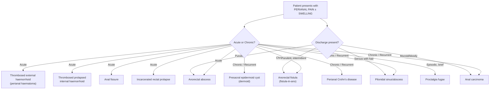
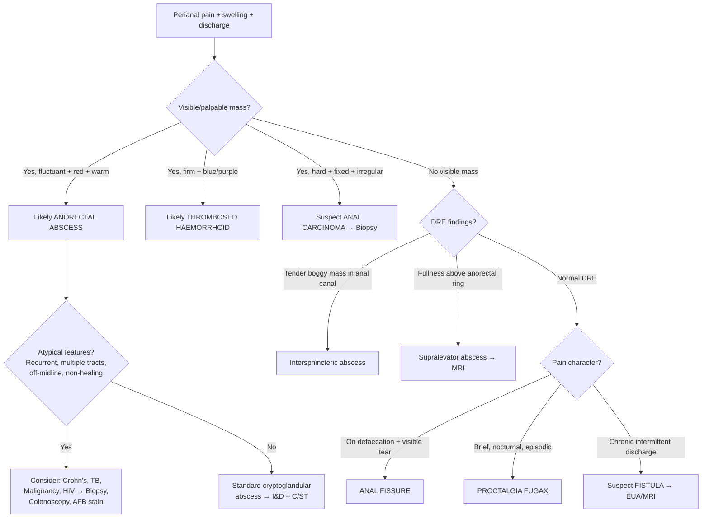

## Differential Diagnosis of Anorectal Abscess

When a patient presents with **perianal pain, swelling, or discharge**, you need a systematic differential diagnosis. The key is to think anatomically and pathophysiologically: *What structures are in the perianal region, and what pathologies can affect them to produce a similar clinical picture?*

The senior notes list three main differentials [2]:
- ***Anorectal fistula***
- ***Internal haemorrhoid***
- ***Presacral epidermoid cyst***

But in clinical practice (and for exams), the differential is broader. Let's work through it systematically, explaining **why** each condition mimics anorectal abscess and **how** to distinguish them.

> ***Common anorectal conditions are mostly benign. Colorectal neoplasm needs to be excluded. Diagnosis can be usually made by careful history and examination.*** [1]

---

### Approach to the Differential

The cardinal presenting features of anorectal abscess are:
1. **Perianal pain** (constant, throbbing)
2. **Perianal swelling/mass**
3. **Discharge** (purulent)
4. **Systemic signs** (fever)

The differential therefore covers conditions that present with one or more of these features. A useful way to organise this is by the **dominant presenting complaint**:

---

### Differential Diagnoses — Detailed Comparison

#### 1. Anorectal Fistula (Fistula-in-Ano)

This is the **chronic phase** of the same cryptoglandular process [2][5]. If a drained or spontaneously ruptured anorectal abscess leaves a persistent internal opening at the crypt, an epithelialised tract forms connecting the anal canal to the perianal skin.

| Feature | Anorectal Abscess | Anorectal Fistula |
|---|---|---|
| **Phase** | Acute (active pus collection) | Chronic (persistent tract) |
| **Pain** | Constant, throbbing, severe | Intermittent — pain builds until pus discharges, then temporarily relieves [5] |
| **Swelling** | Fluctuant, tense mass | May have a small nodule at external opening |
| **Discharge** | Pus under pressure | Intermittent, malodorous purulent drainage [5] |
| **Examination** | Erythematous fluctuant tender mass | **Palpable cord-like tract** [5]; external opening appears as a dimple of granulation tissue that discharges on compression |
| **Systemic signs** | Fever, malaise common | Usually absent (unless superimposed abscess) |
| **Timeline** | ***Suspect fistula if anorectal abscess persists after 6–12 weeks*** [5] | Chronic, recurrent |

**Why it mimics abscess**: A fistula can develop an acute exacerbation (the tract blocks, pus accumulates → essentially a recurrent abscess). The history of **prior abscess drainage** or **recurrent perianal sepsis** is the giveaway.

<Callout title="When to Suspect Fistula After Abscess Drainage">
If perianal symptoms (discharge, intermittent pain) persist **6–12 weeks** after abscess I&D, suspect a fistula-in-ano [5]. Send pus for C/ST at time of initial drainage — **gut flora** predicts fistula formation [4].
</Callout>

#### 2. Thrombosed External Haemorrhoid (Perianal Haematoma)

- **Pathophysiology**: An external haemorrhoid (venous plexus **below** the dentate line, covered by squamous epithelium) undergoes acute thrombosis → blood clot within the vein → sudden painful perianal lump
- **Why it mimics abscess**: Acute onset of a painful perianal mass — just like a perianal abscess

| Feature | Anorectal Abscess | Thrombosed External Haemorrhoid |
|---|---|---|
| **Colour** | Red, erythematous | **Bluish/purple** (visible clot through skin) [6] |
| **Consistency** | Fluctuant (fluid = pus) | **Firm** (solid = clot) — not fluctuant |
| **Tenderness** | Very tender, warm | Tender, but no warmth |
| **Fever** | Often present | Absent |
| **Discharge** | Purulent | None (unless spontaneous clot extrusion → dark blood) |
| **Natural history** | Does not resolve without drainage | Resolves spontaneously over 7–10 days → forms a **skin tag** [6] |

**Key distinguishing feature**: The **bluish discolouration** and **firm (non-fluctuant) consistency** — because it contains clotted blood, not pus.

#### 3. Thrombosed Prolapsed Internal Haemorrhoid

- **Pathophysiology**: Grade III/IV internal haemorrhoid prolapses through the anal canal → becomes incarcerated (trapped by sphincter spasm) → venous congestion → thrombosis → acute pain and swelling
- **Why it mimics abscess**: Acute painful perianal mass with swelling and oedema

| Feature | Anorectal Abscess | Thrombosed Prolapsed Internal Haemorrhoid |
|---|---|---|
| **History** | May be first presentation | History of **prolapsing haemorrhoids** |
| **Appearance** | Erythematous fluctuant mass | **Oedematous, congested, dark purple mass** protruding from the anus; may be circumferential |
| **Reducibility** | N/A | **Irreducible** (incarcerated) |
| **Mucosal folds** | Absent | **Radial mucosal folds** visible (c.f. circular folds in rectal prolapse) |
| **Fever** | Common | Uncommon (unless secondary infection/gangrene) |

#### 4. Anal Fissure (Fissure-in-Ano)

***Clinical features: pain on defaecation, fresh rectal bleeding. Diagnosis is by spreading the buttock to reveal the fissure. Rectal examination and proctoscopy are painful and not indicated.*** [1]

- **Pathophysiology**: A tear in the anoderm **distal to the dentate line** → exposure of the internal sphincter beneath → sphincter spasm → ischaemia (especially posterior midline where blood supply is poorest) → impaired healing → chronic fissure [7]
- **Why it mimics abscess**: Both cause severe perianal pain. An acutely inflamed chronic fissure with a sentinel skin tag can look like a small abscess.

| Feature | Anorectal Abscess | Anal Fissure |
|---|---|---|
| **Pain character** | Constant, throbbing; **not necessarily related to bowel movement** [2] | ***Pain on defaecation*** — sharp, tearing, triggered by passing stool [1][7] |
| **Bleeding** | Purulent discharge, not typically blood | ***Fresh rectal bleeding*** — small amount on toilet paper/stool surface [1][7] |
| **Examination** | Fluctuant mass | **Linear tear** visible on spreading the buttocks; chronic fissure has sentinel pile + hypertrophied anal papilla |
| **Swelling** | Prominent | Absent (unless sentinel skin tag) |
| **Fever** | Common | Absent |

**Key distinguishing feature**: Fissure pain is **related to defaecation** (tearing pain during bowel movement), while abscess pain is **constant and independent of defaecation** [2].

#### 5. Pilonidal Sinus/Abscess

- **Pathophysiology**: Infection and obstruction of a **hair follicle in the natal cleft** (intergluteal cleft) → foreign body reaction around hair → cavity formation → abscess [8]
- "Pilonidal" = Latin: *pilus* = hair, *nidus* = nest → "nest of hair"
- **Why it mimics abscess**: Presents as a painful, red, fluctuant mass in the sacrococcygeal/perianal region

| Feature | Anorectal Abscess | Pilonidal Abscess |
|---|---|---|
| **Location** | **At the anal verge** or within the anal canal | **Sacrococcygeal region / natal cleft** — posterior and superior to the anus |
| **Communication with anal canal** | Yes (internal opening at crypt) | ***Does not continue into the anal canal*** [8] |
| **Discharge** | Purulent | Purulent, may contain **hair** |
| **Risk factors** | Cryptoglandular | ***Caucasian male, coarse dark body hair, prolonged sitting, increased sweating*** [8] |
| **DRE** | May reveal intersphincteric mass | Normal |

**Key distinguishing feature**: Pilonidal sinus is located in the **natal cleft**, **does not communicate with the anal canal**, and may have visible **hair** protruding from the sinus opening.

#### 6. Presacral Epidermoid Cyst (Dermoid Cyst)

This is a **congenital cystic lesion** in the presacral/retrorectal space, lined by squamous epithelium (hence "epidermoid" — *epi-* = upon, *derm* = skin, *-oid* = resembling). It can become secondarily infected, forming an abscess.

| Feature | Anorectal Abscess | Presacral Epidermoid Cyst |
|---|---|---|
| **Location** | Perianal spaces | **Presacral space** (posterior to the rectum, anterior to the sacrum) |
| **Age** | Any age, peak 20–40 | Often presents in young adults |
| **Onset** | Acute | Chronic mass, may become acutely painful if infected |
| **DRE** | Intersphincteric/ischiorectal mass | Smooth, well-defined **posterior rectal mass** on DRE |
| **Imaging** | Abscess with surrounding inflammation | **Well-circumscribed cystic lesion** on MRI, may have fat/calcification |
| **Recurrence** | After drainage → fistula | After drainage → recurs unless completely excised |

**Key distinguishing feature**: A smooth, posterior rectal mass palpable on DRE, with cystic features on imaging, and no connection to the anal crypts.

#### 7. Anal Carcinoma

***Colorectal neoplasm needs to be excluded*** [1].

- **Pathophysiology**: Malignant neoplasm of the anal canal — most commonly **squamous cell carcinoma (80%)**, associated with **HPV-16 & 18** [8]
- **Why it mimics abscess**: Advanced tumours may undergo central necrosis → secondary abscess formation. Also presents with a painful anal mass and bleeding.

| Feature | Anorectal Abscess | Anal Carcinoma |
|---|---|---|
| **Age** | 20–40 years | Typically **older** (> 50), but can occur at any age |
| **Pain** | Acute, throbbing | Chronic, progressive |
| **Mass** | Fluctuant | **Hard, fixed, irregular** |
| **Bleeding** | Purulent discharge | ***Painful PR bleeding*** [8], may have mucoid or bloody discharge |
| **Constitutional symptoms** | Fever, malaise | **Weight loss**, anorexia |
| **Lymphadenopathy** | Absent | May have **inguinal lymphadenopathy** (if below dentate line → drains to inguinal nodes) [8] |
| **Risk factors** | Cryptoglandular | ***HPV, HIV, smoking, immunosuppression, Crohn's*** [8] |

**Key distinguishing feature**: A hard, fixed, irregular mass that does not respond to antibiotics/drainage, especially in an older or immunocompromised patient. **Always biopsy atypical or non-healing perianal lesions.**

<Callout title="Red Flag — When to Suspect Malignancy" type="error">
A perianal "abscess" that **does not heal after adequate I&D**, **recurs repeatedly without an identifiable fistula**, or is associated with a **hard, irregular mass** and **weight loss** should raise suspicion for anal carcinoma. Biopsy the abscess cavity wall at the time of drainage in any atypical case.
</Callout>

#### 8. Perianal Crohn's Disease

- **Pathophysiology**: Crohn's disease causes **transmural inflammation** → sinus tracts, fistulas, and abscesses as part of the fistulising phenotype. Perianal disease may be the **first presentation** of Crohn's in up to 10% of cases.
- **Why it mimics abscess**: Can present with perianal abscess, fistula, or both

| Feature | Simple Anorectal Abscess | Perianal Crohn's |
|---|---|---|
| **Fistula pattern** | Simple, usually single tract | **Complex, multiple tracts**, recurrent |
| **Anal features** | Single abscess | Multiple abscesses, **multiple skin tags**, anal fissures (often **off-midline and painless** — atypical) [7] |
| **GI symptoms** | Absent | **Diarrhoea, abdominal pain, weight loss** |
| **Response to I&D** | Usually curative | Recurs; requires **immunosuppression** (anti-TNF) |
| **Histology** | Acute suppuration | **Non-caseating granulomas** |

#### 9. Incarcerated Rectal Prolapse

- A complete rectal prolapse that becomes irreducible and incarcerated — presents as a painful perianal/protruding mass
- Distinguished by **circular mucosal folds** (vs. radial folds in prolapsed haemorrhoids) and the full-thickness nature of the prolapsing tissue [6]

#### 10. Proctalgia Fugax

- ***Benign, occur in young anxious men. Brief attacks of rectal pain at night, unrelated to defaecation.*** [8]
- "Proctalgia" = *proctos* (Greek) = anus + *algos* = pain; "fugax" = fleeting
- Distinguished from abscess by the **episodic, brief, self-limiting** nature with **no physical findings** on examination
- **No swelling, no discharge, no fever** — examination is entirely normal between attacks

---

### Summary Comparison Table

| Condition | Pain Character | Mass | Discharge | Fever | Key Distinguishing Feature |
|---|---|---|---|---|---|
| **Anorectal abscess** | Constant, throbbing | Fluctuant, tender, red | Purulent | Yes | Fluctuant mass with erythema and systemic signs |
| **Anorectal fistula** | Intermittent, relieved by drainage | Cord-like tract | Intermittent, purulent | No | History of prior abscess; persistent discharge > 6–12 weeks |
| **Thrombosed ext. haemorrhoid** | Acute, at anal verge | **Firm, bluish** | None | No | Blue/purple firm lump (clot, not pus) |
| **Anal fissure** | On defaecation | No mass | Fresh blood | No | Pain related to defaecation; visible linear tear |
| **Pilonidal abscess** | Sacrococcygeal | Fluctuant, natal cleft | May contain hair | Possible | Located in natal cleft; no anal communication |
| **Presacral cyst** | Vague, deep | Smooth posterior mass on DRE | None (unless infected) | If infected | Well-circumscribed cystic lesion on MRI |
| **Anal carcinoma** | Chronic, progressive | Hard, fixed, irregular | Bloody/mucoid | No | Hard mass, inguinal LN, constitutional symptoms |
| **Perianal Crohn's** | Variable | Multiple abscesses, skin tags | Chronic discharge | Variable | Complex/multiple tracts, off-midline fissures, GI symptoms |
| **Proctalgia fugax** | Brief, nocturnal, episodic | None | None | No | Normal examination; fleeting pain |

---

### Diagnostic Approach to Differentiation

***Investigations help in the diagnosis and assess the severity of disease, define anatomy of the pathological process (abscess and fistula), and exclude diseases in the proximal bowel and associated bowel problems (e.g. inflammatory bowel disease)*** [1].

<Callout title="Key Principles for DDx of Anorectal Abscess">

1. **Fluctuance = pus** → Think abscess. **Firm + blue** → Think thrombosed haemorrhoid. **Hard + fixed** → Think malignancy.
2. **Pain on defaecation** → Think fissure. **Constant pain independent of defaecation** → Think abscess.
3. **Natal cleft without anal communication** → Think pilonidal sinus.
4. **Recurrent, complex, atypical** → Think Crohn's disease, TB, or malignancy — biopsy and scope.
5. ***Always exclude colorectal neoplasm*** [1] — especially in older patients or atypical presentations.

</Callout>

---

<ActiveRecallQuiz
  title="Active Recall - Differential Diagnosis of Anorectal Abscess"
  items={[
    {
      question: "A patient presents with an acute painful perianal mass that is firm, non-fluctuant, and has a bluish discolouration. What is the most likely diagnosis and why?",
      markscheme: "Thrombosed external haemorrhoid (perianal haematoma). The bluish colour is due to clotted blood visible through the skin; it is firm (solid clot) rather than fluctuant (liquid pus). No fever or purulent discharge expected."
    },
    {
      question: "Name three features that differentiate anal fissure pain from anorectal abscess pain.",
      markscheme: "1) Fissure pain is triggered by defaecation (tearing on passage of stool); abscess pain is constant and independent of defaecation. 2) Fissure has fresh rectal bleeding on toilet paper; abscess has purulent discharge. 3) Fissure has a visible linear tear on spreading buttocks; abscess has a fluctuant mass."
    },
    {
      question: "A patient has recurrent perianal abscesses with multiple complex fistula tracts and off-midline anal fissures. What underlying condition should you suspect, and what investigations would you perform?",
      markscheme: "Crohn's disease (perianal Crohn's). Investigations: colonoscopy with biopsies (look for non-caseating granulomas, skip lesions), MRI pelvis (map fistula tracts), inflammatory markers (CRP/ESR), and consider anti-TNF therapy."
    },
    {
      question: "How do you distinguish a pilonidal abscess from an anorectal abscess on examination?",
      markscheme: "Pilonidal abscess is located in the natal cleft/sacrococcygeal region (posterior and superior to the anus), does NOT communicate with the anal canal, and may have visible hair in the sinus opening. Anorectal abscess is at the anal verge or within the anal canal and has an internal opening at the dentate line."
    },
    {
      question: "When should you suspect anal carcinoma rather than a simple anorectal abscess?",
      markscheme: "Suspect malignancy if: hard, fixed, irregular mass (not fluctuant); does not heal after adequate I&D; recurrent without identifiable fistula; associated with weight loss, inguinal lymphadenopathy, or chronic progressive pain. Risk factors include HPV, HIV, smoking, immunosuppression. Always biopsy atypical or non-healing perianal lesions."
    },
    {
      question: "What is proctalgia fugax and how does it differ from anorectal abscess?",
      markscheme: "Proctalgia fugax is a benign condition of brief, episodic rectal pain (typically nocturnal, in young anxious men), unrelated to defaecation, with completely normal examination between attacks. Anorectal abscess has constant pain with physical findings (fluctuant mass, erythema, fever). Proctalgia fugax has no swelling, discharge, or fever."
    }
  ]}
/>

## References

[1] Lecture slides: GC 179. Anal pain perianal lesions and sepsis.pdf (p13, p46, p50, p77)
[2] Senior notes: felixlai.md (Anorectal abscess — Clinical manifestation, Differential diagnosis)
[4] Senior notes: maxim.md (Anorectal abscess)
[5] Senior notes: maxim.md (Anal fistula); felixlai.md (Anorectal fistulas)
[6] Senior notes: maxim.md (Acute painful anal mass — Differential diagnosis)
[7] Senior notes: felixlai.md (Anal fissures)
[8] Senior notes: maxim.md (Pilonidal sinus; Proctalgia fugax; Anal carcinoma)
