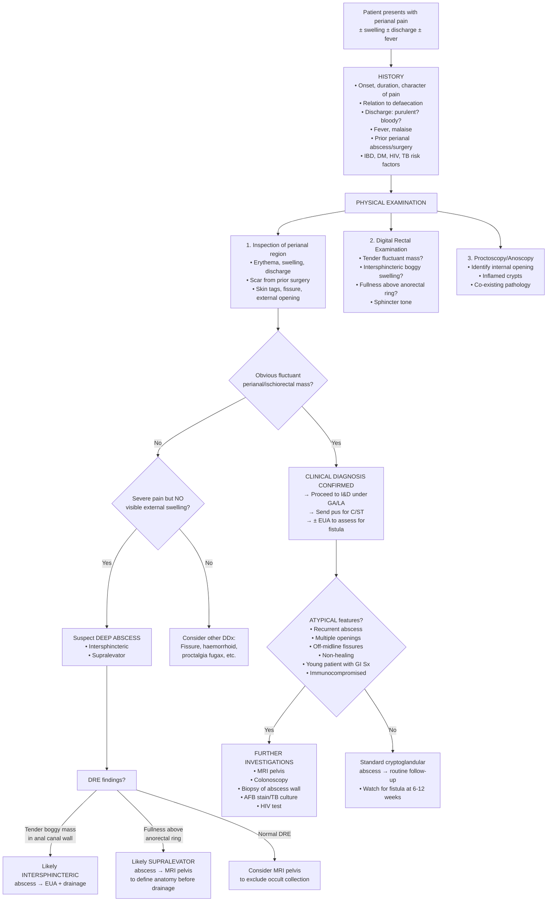
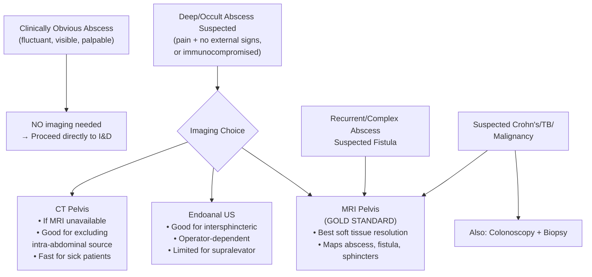

## Diagnostic Criteria, Diagnostic Algorithm & Investigation Modalities

### 1. Diagnostic Criteria

Anorectal abscess does **not** have formal diagnostic criteria in the way that, say, rheumatoid arthritis or SLE does. It is fundamentally a **clinical diagnosis** — you diagnose it by recognising the characteristic history and examination findings [1][2][4]. That said, we can define what constitutes a positive diagnosis:

#### 1.1 Clinical Diagnostic Criteria (Practical Framework)

A diagnosis of anorectal abscess is made when **ALL** of the following are present:

| Criterion | Explanation |
|---|---|
| **1. Compatible symptoms** | ***Pain*** (constant, throbbing, perianal/anorectal), ± ***swelling***, ± ***drainage***, ± ***constipation***, ± ***urinary difficulties*** [1] |
| **2. Compatible signs on examination** | ***Erythematous, fluctuant, tender mass*** on inspection and/or DRE [4]; or a tender boggy mass palpable within the anal canal (intersphincteric) or above the anorectal ring (supralevator) |
| **3. Collection of pus confirmed** | Either by clinical fluctuance, aspiration of pus, imaging (MRI/CT/EUS showing a fluid collection), or at the time of incision and drainage |

For **superficial abscesses** (perianal, most ischiorectal): the diagnosis is almost entirely clinical — you see it, you feel it, you drain it. No imaging is typically needed.

For **deep-seated abscesses** (intersphincteric, supralevator): the diagnosis may require additional investigation because there are **no visible external signs** — you rely on DRE findings and imaging.

<Callout title="Key Principle: Anorectal Abscess is a Clinical Diagnosis">
***Diagnosis can be usually made by careful history and examination*** [1]. The overwhelming majority of perianal and ischiorectal abscesses are diagnosed at the bedside. Reserve imaging (MRI, CT, EUS) for cases where the abscess is **not palpable**, is **deep-seated**, is **recurrent**, or when you suspect **complex pathology** (Crohn's, fistula, malignancy) [2].
</Callout>

#### 1.2 When to Suspect an Anorectal Abscess (Clinical Triggers)

Think of this as the "screening criteria" — features that should make you actively look for an anorectal abscess:

- **Any patient** with constant perianal pain, especially if worsened by sitting and not relieved by defaecation
- **Any patient** with perianal swelling, redness, or warmth
- **Any patient** with fever of unknown origin + perianal symptoms (even vague rectal discomfort) — especially if immunocompromised
- **Any patient** with unexplained urinary retention + perianal/rectal pain
- **Immunocompromised patients** (DM, HIV, chemotherapy, neutropaenia) with perianal symptoms — low threshold for imaging, as clinical signs may be attenuated (reduced inflammatory response → less erythema, less fluctuance, yet the abscess may be large)

<Callout title="Immunocompromised Patients — Beware" type="error">
In neutropaenic or severely immunosuppressed patients, the classical signs of abscess (erythema, fluctuance, warmth) may be **absent or minimal** because the inflammatory response is blunted. These patients may present only with vague perianal pain and fever. Maintain a very low threshold for imaging (MRI pelvis) and examination under anaesthesia (EUA). Delayed diagnosis → necrotising soft tissue infection → mortality.
</Callout>

---

### 2. Diagnostic Algorithm

The algorithm follows a systematic approach: **History → Examination → Bedside assessment → Targeted investigations → Definitive management**. The branching points depend on whether the abscess is clinically obvious or occult.

> The algorithm emphasises that **most anorectal abscesses are diagnosed clinically and treated surgically without delay**. Investigations are reserved for deep, occult, recurrent, or atypical cases. The mantra is: ***"If there is pus, let it out"*** — do not delay drainage waiting for imaging in an obvious abscess.

---

### 3. Investigation Modalities

***Investigations*** serve three distinct purposes [1]:
1. ***Help in the diagnosis and assess the severity of disease***
2. ***Define anatomy of the pathological process (abscess and fistula)***
3. ***Exclude diseases in the proximal bowel and associated bowel problems (e.g. inflammatory bowel disease)***

Let us organise investigations into **bedside**, **laboratory**, **imaging**, and **endoscopic/procedural**, explaining **why** each is done, **what** you expect to find, and **how** to interpret the results.

---

#### 3.1 Bedside Investigations

| Investigation | Purpose | Key Findings & Interpretation |
|---|---|---|
| **Inspection of perianal region** | Identify superficial abscess, external fistula openings, skin tags, fissures, scars | **Erythematous, fluctuant, tender swelling** at anal verge = perianal abscess. Diffuse buttock swelling/induration = ischiorectal abscess. Dimple of granulation tissue with discharge = external fistula opening. |
| **Digital Rectal Examination (DRE)** | Assess for deep abscess (intersphincteric, supralevator); evaluate sphincter tone; palpate for masses | ***Abscess can be felt in DRE if there is no findings on physical inspection*** [2]. Tender boggy mass in the anal canal wall = intersphincteric abscess. Tender fullness above the anorectal ring = supralevator abscess. Hard, fixed, irregular mass = suspect malignancy. Reduced sphincter tone may indicate prior surgery or neurological cause. |
| **Proctoscopy / Anoscopy** | Visualise the anal canal mucosa; identify inflamed crypt (internal opening); rule out co-existing pathology (haemorrhoids, fissure, tumour) | Inflamed, oedematous crypt at the dentate line = probable source. Purulent discharge from a crypt on gentle compression = confirms internal opening. May be too painful to perform in the acute setting → defer to EUA. |
| **Assessment of vital signs** | Detect systemic sepsis | Tachycardia, fever ( > 38°C), hypotension → suggests significant infection; may need resuscitation before theatre. In severe cases, consider Fournier's gangrene (necrotising fasciitis). |

<Callout title="DRE — The Most Important Bedside Investigation" type="idea">
Never skip the DRE. An intersphincteric abscess is diagnosed **only** by DRE (or EUA) — it has no external signs. A supralevator abscess may also be first detected as a tender fullness on DRE. If the patient is in too much pain for bedside DRE, this itself is a strong indication for **EUA** in theatre.
</Callout>

---

#### 3.2 Laboratory Investigations

| Investigation | Purpose | Key Findings & Interpretation |
|---|---|---|
| **Full blood count (CBC/FBC)** | Assess for infection and its severity | **Leucocytosis with neutrophilia** = active bacterial infection. The WCC magnitude correlates loosely with severity. **Neutropaenia** in a chemotherapy patient = high risk of atypical presentation and fulminant sepsis — very low threshold for aggressive management. |
| **C-reactive protein (CRP)** | Quantify systemic inflammatory response; monitor response to treatment | **Elevated CRP** ( > 10 mg/L) supports active infection. Very high CRP ( > 100) raises concern for deep-seated collection or necrotising infection. Useful for serial monitoring after drainage — should trend downward. |
| **Blood glucose / HbA1c** | Screen for diabetes mellitus | **Elevated glucose/HbA1c** = previously undiagnosed or poorly controlled DM — a major risk factor for complicated perianal sepsis, poor wound healing, and necrotising fasciitis. Optimise glycaemic control perioperatively. |
| **Blood cultures** | Identify bacteraemia in systemically septic patients | Obtain **before** starting antibiotics if fever > 38°C, rigors, tachycardia, or hypotension. Positive blood cultures guide targeted antibiotic therapy. Most common isolates: *E. coli*, *Bacteroides fragilis*, *Enterococcus*. |
| **Pus culture and sensitivity (C/ST)** | Identify causative organisms; **predict fistula risk** | ***Culture shows skin flora: no fistula → reassurance. Culture shows gut flora: likely with fistula → treat as fistula after acute state*** [4]. Always send at time of I&D. **Gut flora** (*E. coli*, *Bacteroides*, *Enterococcus*) = internal communication with bowel lumen = **high fistula risk (~50%)**. **Skin flora only** (*Staph. aureus*, *Streptococcus*) = no internal communication = **low fistula risk**. **AFB positive** = TB — send for culture (takes 6–8 weeks). **Sulfur granules** = Actinomycosis. |
| **Pus for AFB stain + TB culture** | Exclude tuberculosis (especially in Hong Kong) | Indicated if: non-healing abscess, caseous material, chronic/recurrent perianal sepsis, patient from TB-endemic area. **AFB positive on Ziehl-Neelsen stain** = TB. Culture on Löwenstein-Jensen medium takes 6–8 weeks but is definitive. Consider TB-PCR (GeneXpert) for rapid result. |
| **Tissue biopsy (abscess wall)** | Exclude Crohn's disease, TB, malignancy | Sent at time of I&D if atypical features. **Non-caseating granulomas** = Crohn's. **Caseating granulomas** = TB. **Dysplasia/malignant cells** = anal carcinoma. **Sulfur granules with filamentous organisms** = Actinomycosis. |
| **HIV test** | Screen for immunodeficiency | Consider in: recurrent perianal sepsis, atypical organisms, young patient with risk factors. HIV increases risk of perianal sepsis, atypical infections, and poor healing. |
| **Inflammatory markers for IBD** | Screen for Crohn's disease if suspected | **Faecal calprotectin** ( > 250 μg/g suggests active bowel inflammation); **CRP/ESR** elevated; **ASCA positive** (anti-*Saccharomyces cerevisiae* antibodies — more specific for Crohn's). These are adjuncts — definitive diagnosis requires colonoscopy + biopsy. |

<Callout title="Pus C/ST — The Underappreciated Investigation">
Many students forget the clinical significance of pus microbiology. It is not just about choosing the right antibiotic — **the type of organism predicts fistula formation**. Gut flora = fistula likely → plan for follow-up and possible fistula surgery. Skin flora = fistula unlikely → reassurance. This directly changes your management and counselling of the patient [4].
</Callout>

---

#### 3.3 Imaging Investigations

| Modality | Indication | Key Findings & Interpretation | Advantages & Limitations |
|---|---|---|---|
| **MRI Pelvis** | ***Non-palpable abscess*** [2]; deep-seated abscess (intersphincteric, supralevator); recurrent abscess; suspected complex fistula; perianal Crohn's disease | **T2-weighted / STIR sequences**: abscess appears as a **high-signal (bright) fluid collection** with surrounding oedema and rim enhancement on post-gadolinium T1. Fistula tracts appear as **linear high-signal tracks** on T2. Accurately maps the relationship of abscess/fistula to the sphincter complex and levator ani. Can identify **occult secondary tracts** and **horseshoe extensions** not apparent clinically. | **Gold standard** for perianal sepsis imaging. Excellent soft tissue resolution. Non-invasive. No radiation. **Limitations**: Expensive, time-consuming, may require sedation (claustrophobia), not universally available for emergency use. |
| **Endoanal Ultrasound (EUS)** | Alternative to MRI; can be performed in clinic or theatre; particularly useful for intersphincteric abscess | Abscess appears as a **hypoechoic (dark) fluid collection**. Can delineate the IAS, EAS, and intersphincteric plane with high resolution. Fistula tracts appear as hypoechoic linear tracks. Internal opening may be identified. | Good for imaging the sphincter complex and intersphincteric plane. **Limitations**: Operator-dependent; limited field of view (cannot assess supralevator space as well as MRI); may be painful in the acute setting. |
| **CT Pelvis** | If MRI unavailable; suspected supralevator abscess from intra-abdominal source (e.g., diverticular abscess, appendiceal abscess tracking down); to exclude pelvic pathology | Abscess appears as a **rim-enhancing hypodense fluid collection** with surrounding fat stranding. Can identify gas within the collection (concerning for gas-forming organisms / necrotising infection). Can assess the abdomen/pelvis simultaneously. | Fast acquisition (good for acutely unwell patients). Widely available. Good for excluding intra-abdominal sources. **Limitations**: Less soft tissue resolution than MRI for the sphincter complex and fistula tracts; radiation exposure; not first-line for perianal imaging. |
| **Fistulography** | Rarely used now; historical test for mapping fistula tracts | Contrast injected through external fistula opening → radiograph shows the tract. | Largely **superseded by MRI** which is non-invasive and provides superior anatomical detail. May still have a role in selected cases. |

> ***CT/MRI scan indicated in a non-palpable abscess*** [2]. Think of imaging as reserved for when your clinical examination cannot adequately define the problem.

---

#### 3.4 Endoscopic & Procedural Investigations

| Investigation | Indication | Key Findings & Interpretation |
|---|---|---|
| **Examination Under Anaesthesia (EUA)** | When bedside examination is too painful; to fully assess abscess extent; to probe for fistula tracts at time of I&D; to assess complex or recurrent perianal sepsis | **The definitive investigation for anorectal abscess.** Under GA/regional anaesthesia, the surgeon can: inspect the perianal region and anal canal thoroughly; perform DRE and proctoscopy without pain; incise and drain the abscess; probe the cavity to identify internal opening and fistula tracts (with caution — avoid creating false passages); assess sphincter integrity. EUA is both **diagnostic and therapeutic**. |
| **Proctoscopy / Rigid Sigmoidoscopy** | Visualise the anal canal and lower rectum; identify internal opening; exclude mucosal pathology | Inflamed crypt at dentate line (source). Purulent discharge from crypt on compression (internal opening identified). Mucosal ulceration, oedema, or nodularity may suggest IBD or malignancy. |
| **Flexible Sigmoidoscopy / Colonoscopy** | ***Exclude diseases in the proximal bowel and associated bowel problems (e.g. inflammatory bowel disease)*** [1] | Indicated when: recurrent/atypical perianal sepsis, young patient with GI symptoms (diarrhoea, abdominal pain, weight loss), suspicion of Crohn's disease, or to exclude colorectal malignancy. **Findings in Crohn's**: skip lesions, aphthous ulcers, cobblestoning, strictures, non-caseating granulomas on biopsy. **Findings in malignancy**: mass, ulcerated lesion, obstruction. |
| **Fistula probing (at EUA)** | Identify the course and complexity of an associated fistula | A malleable probe is gently passed through the external opening → follows the tract → emerges at the internal opening. Identifies the **internal opening** (usually at the dentate line at the site of the infected crypt). Determines if the fistula is **simple** (intersphincteric/low transsphincteric — < 30% EAS involvement) or **complex** (high transsphincteric, suprasphincteric, extrasphincteric, multiple tracts, Crohn's-related). **Perform with extreme caution** to avoid creating a false passage [5]. |
| **Goodsall's rule application (at EUA)** | Predict the location of the internal opening based on the position of the external opening | **Goodsall's rule**: External opening **anterior** to the transverse anal line → fistula tract runs in a **straight radial line** to the nearest crypt (internal opening directly opposite). External opening **posterior** to the transverse anal line → tract curves to the **posterior midline** crypt (internal opening at 6 o'clock in lithotomy position). **Exceptions**: anterior external openings > 3 cm from the anal verge may still curve posteriorly. Crohn's fistulas often do not follow this rule. |

<Callout title="Goodsall's Rule — A Useful but Imperfect Guide" type="idea">
Goodsall's rule helps predict where the internal opening of a fistula is located, which is critical for surgical planning. However, it is a guideline, not a law. Complex fistulas (especially Crohn's-related) frequently violate this rule. MRI is superior for mapping complex tracts.
</Callout>

---

#### 3.5 Summary of Investigations — When and Why

| Clinical Scenario | Investigations Needed | Rationale |
|---|---|---|
| **Obvious perianal/ischiorectal abscess, first episode, otherwise healthy** | FBC, CRP, blood glucose; pus C/ST at I&D; EUA for drainage and fistula assessment | Straightforward case — clinical diagnosis, surgical treatment, send pus to predict fistula risk |
| **Deep abscess suspected (no external signs, severe pain)** | As above + **MRI pelvis** (or EUS) before or concurrent with EUA | ***MRI indicated in a non-palpable abscess*** [2] — define anatomy before choosing drainage route (especially supralevator) |
| **Recurrent perianal abscess** | As above + MRI pelvis + colonoscopy + biopsy of abscess wall + AFB stain + HIV test | ***Exclude diseases in proximal bowel*** [1] — specifically Crohn's disease and TB; HIV testing for immunodeficiency |
| **Immunocompromised patient (DM, HIV, neutropaenia)** | As above + blood cultures + low threshold for MRI + aggressive monitoring | Attenuated clinical signs; higher risk of necrotising infection; blood cultures essential as bacteraemia more likely |
| **Suspected Crohn's-related perianal sepsis** | MRI pelvis + colonoscopy with biopsies + inflammatory markers (faecal calprotectin, CRP) + EUA | Crohn's perianal disease requires combined medical (anti-TNF) and surgical management; MRI maps complex fistula anatomy |
| **Atypical/non-healing abscess — malignancy suspected** | Biopsy of abscess cavity wall + MRI pelvis + colonoscopy + inguinal LN assessment (USS ± FNA) | Exclude anal carcinoma or rectal carcinoma with secondary abscess |

---

### 4. Interpretation Framework — Putting It All Together

When you receive investigation results, interpret them systematically:

| Finding | Interpretation | Next Step |
|---|---|---|
| **Pus C/ST: gut flora** | Internal communication with bowel → **fistula likely** [4] | Plan follow-up at 6–12 weeks; if persistent discharge → MRI + EUA for fistula assessment |
| **Pus C/ST: skin flora only** | No internal communication → **fistula unlikely** [4] | Reassurance; routine wound follow-up |
| **Pus AFB positive** | **Tuberculosis** | Start anti-TB therapy (RIPE regimen); tissue biopsy for confirmation; check CXR and sputum |
| **Biopsy: non-caseating granulomas** | **Crohn's disease** | Colonoscopy; gastroenterology referral; consider anti-TNF therapy |
| **Biopsy: caseating granulomas** | **Tuberculosis** | Anti-TB therapy |
| **Biopsy: dysplasia/malignant cells** | **Anal carcinoma** | Staging (MRI pelvis, CT TAP); MDT discussion; chemoradiation |
| **MRI: rim-enhancing collection in intersphincteric plane** | **Intersphincteric abscess** | Drain transanally at EUA |
| **MRI: collection above levator ani** | **Supralevator abscess** — determine origin | If from intersphincteric extension → drain transanally. If from ischiorectal extension → drain via buttock skin. If from pelvic source → treat abdominal pathology. |
| **MRI: complex branching tracts with multiple collections** | **Complex fistula** (likely Crohn's or recurrent cryptoglandular) | Seton drainage; consider anti-TNF if Crohn's; staged surgical approach |
| **Blood cultures positive** | **Bacteraemia/sepsis** | Targeted IV antibiotics based on sensitivities; ensure adequate source control (drainage) |
| **HbA1c > 6.5% / Blood glucose elevated** | **Diabetes mellitus** | Glycaemic optimisation; higher risk of wound complications — closer follow-up |
| **Leucopaenia/neutropaenia** | **Immunosuppressed** — attenuated clinical signs | Low threshold for imaging and EUA; broad-spectrum antibiotics; close monitoring |

---

<Callout title="High Yield Summary — Diagnosis of Anorectal Abscess">

**1. Clinical diagnosis is the cornerstone.** Most perianal and ischiorectal abscesses are diagnosed by history (constant perianal pain, swelling, discharge) and examination (erythematous fluctuant tender mass).

**2. DRE is essential.** An intersphincteric abscess has no visible external signs — only DRE (tender boggy mass in anal canal wall) can detect it. Supralevator abscess may also be detected as tenderness above the anorectal ring.

**3. Imaging (MRI gold standard) is reserved for:** non-palpable abscess, deep-seated abscess, recurrent abscess, suspected complex fistula, and Crohn's disease.

**4. Always send pus C/ST at I&D.** Gut flora = fistula likely; skin flora = fistula unlikely.

**5. Investigate for underlying cause if atypical:** Crohn's (colonoscopy), TB (AFB stain), malignancy (biopsy), HIV (serology).

**6. Three purposes of investigations:** (i) diagnose and assess severity, (ii) define anatomy, (iii) exclude proximal bowel disease.

</Callout>

---

<ActiveRecallQuiz
  title="Active Recall - Diagnosis of Anorectal Abscess"
  items={[
    {
      question: "What are the three stated purposes of investigations in anorectal abscess according to the lecture slides?",
      markscheme: "1) Help in the diagnosis and assess the severity of disease. 2) Define anatomy of the pathological process (abscess and fistula). 3) Exclude diseases in the proximal bowel and associated bowel problems (e.g. inflammatory bowel disease)."
    },
    {
      question: "Pus C/ST from an anorectal abscess grows Staphylococcus aureus only. What does this imply, and what do you tell the patient?",
      markscheme: "Skin flora only — suggests no internal communication with the bowel lumen. Fistula is unlikely. Reassure the patient that the abscess is likely superficial without a fistula tract, but advise to return if symptoms of persistent discharge develop."
    },
    {
      question: "When is MRI pelvis indicated in the workup of anorectal abscess? Name at least 4 indications.",
      markscheme: "1) Non-palpable/deep-seated abscess (intersphincteric or supralevator). 2) Recurrent abscess. 3) Suspected complex fistula. 4) Suspected perianal Crohn's disease. 5) To define anatomy of supralevator abscess before choosing drainage route. 6) Atypical presentation or non-healing abscess."
    },
    {
      question: "Describe Goodsall's rule and its clinical application.",
      markscheme: "Goodsall's rule predicts the internal opening of a fistula based on the external opening position. External opening ANTERIOR to the transverse anal line: fistula runs in a straight radial line to the nearest crypt. External opening POSTERIOR to the transverse anal line: tract curves to the posterior midline crypt (6 o'clock in lithotomy). Exception: anterior openings >3 cm from anal verge may curve posteriorly. Crohn's fistulas often violate this rule."
    },
    {
      question: "A patient with severe anorectal pain has no visible perianal swelling. DRE reveals a tender boggy area in the right lateral anal canal wall. What is the diagnosis, and what investigation would you perform next?",
      markscheme: "Intersphincteric abscess. Next step: Examination Under Anaesthesia (EUA) for definitive assessment and transanal drainage (internal sphincterotomy). MRI pelvis may be performed if available prior to EUA to map the collection, but should not delay surgical drainage."
    },
    {
      question: "What investigation findings on abscess wall biopsy would suggest: a) Crohn's disease, b) Tuberculosis, c) Anal carcinoma?",
      markscheme: "a) Non-caseating granulomas = Crohn's disease. b) Caseating granulomas (with or without AFB positive on stain) = Tuberculosis. c) Dysplastic or malignant cells (squamous cell carcinoma most common) = Anal carcinoma."
    }
  ]}
/>

## References

[1] Lecture slides: GC 179. Anal pain perianal lesions and sepsis.pdf (p13, p50, p77)
[2] Senior notes: felixlai.md (Anorectal abscess — Diagnosis)
[4] Senior notes: maxim.md (Anorectal abscess — Pus C/ST interpretation)
[5] Senior notes: felixlai.md (Anorectal fistulas — Diagnosis, EUA and fistula probing)
