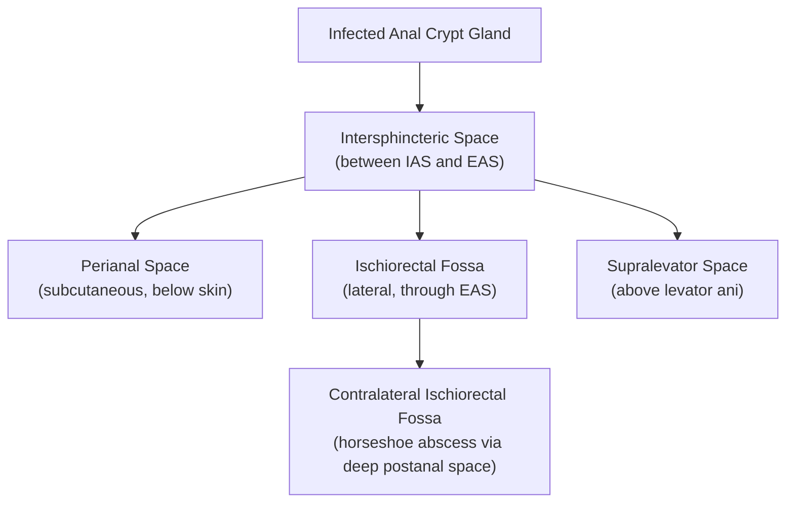
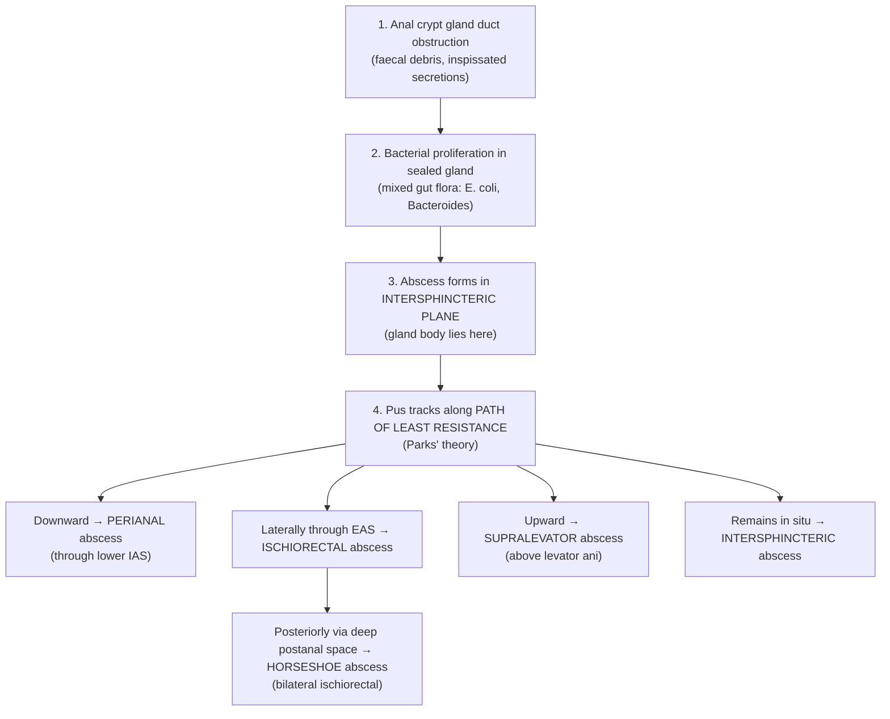
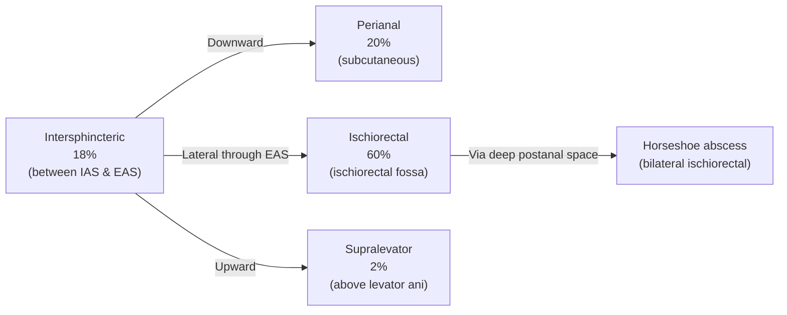

## 1. Definition

An anorectal abscess is an **acute collection of purulent material (pus)** that arises in the tissue spaces surrounding the anorectum [1][2][3]. It represents the **acute phase** of perianal sepsis; the corresponding **chronic phase** is the anorectal fistula (fistula-in-ano) [2].

Let's break the name down:
- **Ano-** = relating to the anus (Latin: *anus* = ring)
- **Rectal** = relating to the rectum (Latin: *rectum* = straight [intestine])
- **Abscess** = from Latin *abscessus* = "a going away" — i.e., a walled-off collection of pus that has "gone away" from normal tissue

The abscess most commonly originates from infection of the **anal crypt glands** (cryptoglandular theory) [1][2][3]. These glands sit in the intersphincteric plane, and when their ducts become obstructed, bacteria proliferate in the trapped secretions, forming an abscess that can then **track along tissue planes of least resistance** into the various perianal and perirectal spaces [2][4].

<Callout title="Key Concept">
Anorectal abscess = acute phase of perianal sepsis. Anorectal fistula = chronic phase of the same process. About 30–50% of anorectal abscesses will progress to a fistula-in-ano if the internal opening (infected crypt) persists.
</Callout>

---

## 2. Epidemiology & Risk Factors

### Epidemiology
- **Incidence**: ~1–2 per 10,000 population per year in Western literature; comparable rates in Hong Kong
- **Age**: Peak incidence in the **3rd–4th decade** of life (20–40 years old)
- **Sex**: Male-to-female ratio approximately **2–3:1** — possibly related to greater density of anal glands in males and hormonal influences on gland secretion
- The **ischiorectal abscess** is the most common type (***60%***), followed by ***perianal (20%)*** and ***intersphincteric (18%)***; ***supralevator is rare (2%)*** [1][2]

### Risk Factors

| Category | Specific Risk Factors | Mechanism |
|---|---|---|
| **Local** | Anal fissure, haemorrhoids, anal trauma, foreign body | Breach in mucosal barrier → bacterial entry |
| **Inflammatory** | ***Crohn's disease***, ulcerative colitis | Transmural inflammation (Crohn's) creates fistulising tracts; disrupted mucosa allows bacterial invasion [1][3] |
| **Infectious** | ***Tuberculosis***, ***actinomycosis***, HIV, LGV (lymphogranuloma venereum) | Specific organisms cause granulomatous or chronic suppurative infection in perianal tissues [1][3] |
| **Iatrogenic** | ***Surgery*** (e.g., haemorrhoidectomy, post-sclerotherapy), episiotomy, radiation | Direct tissue injury opens a portal of entry [3] |
| **Immunosuppression** | Diabetes mellitus, HIV/AIDS, chemotherapy, chronic corticosteroids | Impaired neutrophil function → inability to contain crypt gland infection |
| **Malignancy** | ***Malignancies*** (rectal/anal carcinoma) | Tumour necrosis or obstruction of crypt glands [3] |
| **Lifestyle** | Obesity, smoking, poor hygiene | Obesity increases moisture/friction; smoking impairs microvascular perfusion |

<Callout title="Hong Kong Context" type="idea">
In Hong Kong, be especially mindful of **tuberculosis** as a cause of perianal sepsis — TB remains more prevalent here than in many Western countries. A non-healing perianal abscess/fistula, especially with caseous material, should prompt AFB staining and TB culture. Also consider **Crohn's disease**, which, although historically less common in Asia, is rising in incidence in Hong Kong.
</Callout>

---

## 3. Anatomy & Function

Understanding anorectal abscess requires a solid grasp of the **anal canal anatomy**, the **sphincter complex**, the **anal glands**, and the **perianal/perirectal tissue spaces**. Think of the anatomy as a series of concentric tubes and the spaces between them.

### 3.1 The Anal Canal

- **Surgical anal canal**: From the **anal verge** (where hair-bearing perianal skin begins) to the **anorectal ring** (the palpable upper border of the puborectalis/external sphincter complex) — approximately **4 cm** long
- **Anatomical anal canal**: From the **dentate (pectinate) line** to the anal verge — approximately **2 cm** long
- The **dentate line** is the key landmark:
  - It is the junction of **endoderm** (above — columnar epithelium) and **ectoderm** (below — squamous epithelium)
  - The **crypts of Morgagni** (anal crypts) are located **at** the dentate line — these are the openings into which the anal glands drain
  - Arterial supply, venous drainage, lymphatic drainage, and nerve supply all differ above vs. below the dentate line

### 3.2 The Sphincter Complex

| Structure | Type | Innervation | Function |
|---|---|---|---|
| **Internal Anal Sphincter (IAS)** | Smooth muscle (thickened continuation of the circular muscle layer of the rectum) | Autonomic (sympathetic = contraction, parasympathetic = relaxation) | Provides ~70–85% of resting anal tone — involuntary continence |
| **External Anal Sphincter (EAS)** | Skeletal (striated) muscle — encircles the IAS | Pudendal nerve (S2–S4) — somatic, voluntary | Provides voluntary squeeze pressure; crucial during coughing/straining |
| **Puborectalis** | Skeletal muscle — U-shaped sling around the anorectal junction | Pudendal nerve (S2–S4) | Maintains the anorectal angle (~80–90°); critical for gross continence |

The **intersphincteric groove** (the sulcus between IAS and EAS) is palpable on digital rectal examination (DRE) and is the plane along which the anal glands reside — and along which pus first tracks.

### 3.3 The Anal Glands (Cryptoglandular Apparatus)

- **6–10 anal glands** are present, clustered mainly in the **posterior midline**
- Each gland opens via a duct into one of the **crypts of Morgagni** at the dentate line
- The gland body lies in the **intersphincteric plane** (between IAS and EAS)
- They secrete mucus to lubricate the anal canal
- **Why they matter**: When a crypt duct becomes **obstructed** (by faecal matter, inspissated debris, or mucosal oedema), bacteria proliferate within the trapped glandular secretion → **intersphincteric abscess** forms → pus tracks along **paths of least resistance** into adjacent tissue spaces

### 3.4 Perianal & Perirectal Tissue Spaces

These are the potential spaces into which pus can spread. Think of them as compartments defined by the fascial planes and muscles:

| Space | Location | Boundaries | Clinical Relevance |
|---|---|---|---|
| **Perianal space** | Immediately subcutaneous around the anal verge | Below the dentate line, superficial to the EAS | Most superficial abscess — easily visible and palpable externally |
| **Intersphincteric space** | Between IAS and EAS | Continuous superiorly with the rectal wall | The **origin** of cryptoglandular abscess; may not be visible externally; diagnosed on DRE (tender, boggy swelling) |
| **Ischiorectal fossa** | Lateral to the anal canal, below the levator ani | Medial = EAS; Lateral = obturator internus; Superior = levator ani; Inferior = transverse perineal muscles/skin | Large space → abscess can become very large before presenting; **most common site (60%)** [1][2] |
| **Supralevator space** | Above the levator ani, below the peritoneum | Between the levator ani and the pelvic peritoneum | Rare (2%) [1][2]; dangerous — may present with pelvic sepsis; drainage route must be chosen carefully to avoid creating an extrasphincteric fistula |
| **Deep postanal space** | Posterior to the anal canal, between the EAS and the anococcygeal ligament | Communicates with both ischiorectal fossae | Route for **horseshoe abscess** (bilateral ischiorectal spread) |

<Callout title="Why is the ischiorectal fossa the most common abscess site?">
The ischiorectal fossa is large and filled with loose fatty tissue that offers little resistance to the spread of infection. Once pus breaches the EAS from the intersphincteric plane, it can easily expand within this capacious space. The "path of least resistance" principle (***Parks' theory***) explains this preferential tracking [4].
</Callout>

---

## 4. Etiology

> **The etiology of anorectal abscess is dominated by the cryptoglandular theory, but always consider secondary causes, especially in Hong Kong where TB and rising IBD rates are relevant.**

### 4.1 Cryptoglandular Infection (Most Common — ~90%)

***Cryptoglandular infection*** [1][3] is the overwhelmingly predominant cause:

1. An **anal crypt gland duct** becomes obstructed (by faecal debris, mucosal inflammation, or inspissated secretions)
2. Bacteria proliferate within the sealed gland → **intersphincteric abscess** forms
3. Pus then extends along the **path of least resistance** into the various perianal/perirectal spaces

**Microbiology**: The organisms are typically a **mixed flora** of:
- **Gut organisms**: *E. coli*, *Bacteroides fragilis*, *Enterococcus* spp. — these are the expected organisms when a fistula is present (communication with the bowel lumen)
- **Skin organisms**: *Staphylococcus aureus*, *Streptococcus* spp. — when these predominate and gut flora is absent, a fistula is less likely

<Callout title="Pus Culture Predicts Fistula Risk" type="idea">
This is a clinically important pearl from the senior notes [4]: if pus culture shows **gut flora** → high likelihood of an associated fistula (internal communication with bowel). If only **skin flora** → less likely to have a fistula → reassurance. Always send pus for **C/ST** (culture and sensitivity testing) at the time of incision and drainage.
</Callout>

### 4.2 Other/Secondary Causes

| Cause | Details | Hong Kong Relevance |
|---|---|---|
| ***Inflammatory bowel disease (IBD)*** | Crohn's disease is the classic culprit — transmural inflammation leads to fistulising perianal disease; UC rarely causes perianal sepsis [1][3] | IBD incidence rising in Hong Kong and East Asia; Crohn's disease may present with perianal abscess as the **first** manifestation |
| ***Tuberculosis*** | Perianal TB can present as chronic non-healing abscess, sinus, or fistula; caseous necrosis on histology; AFB staining positive [1][3] | TB remains endemic in Hong Kong — always consider in atypical/recurrent perianal sepsis |
| ***Actinomycosis*** | Caused by *Actinomyces israelii*; forms "sulfur granules"; typically in immunocompromised [1][3] | Uncommon but important differential |
| ***Foreign body*** | Rectal foreign bodies → mucosal laceration → abscess [1][3] | Consider in trauma, sexual practice, accidental ingestion |
| ***Surgery*** | Post-haemorrhoidectomy, post-sclerotherapy, post-episiotomy [3][4] | Iatrogenic cause — always take a surgical history |
| ***Malignancies*** | Anal or rectal carcinoma may present with secondary abscess due to tumour necrosis or obstruction [3] | Consider in older patients or atypical presentations |
| **Radiation** | Radiation proctitis following pelvic radiotherapy → mucosal breakdown → infection | Consider in patients with history of cervical/prostate/rectal cancer treatment |
| **Lymphogranuloma venereum (LGV)** | *Chlamydia trachomatis* serovars L1–L3; chronic lymphatic infection → inflammatory perirectal masses | Consider in MSM (men who have sex with men) — relevant in Hong Kong STI clinics |
| **HIV/AIDS** | Immunodeficiency → opportunistic infections, atypical organisms, poor healing | HIV testing should be considered in recurrent perianal sepsis |
| **Diabetes mellitus** | Not a direct cause, but significantly increases risk due to microvascular disease and impaired immune function | Very common comorbidity in Hong Kong; increases risk of complications (necrotising fasciitis) |

---

## 5. Pathophysiology

### 5.1 The Cryptoglandular Sequence (Step-by-Step)

This is the core pathophysiological mechanism and ties together anatomy, microbiology, and clinical presentation:

**Step 1 — Obstruction**: The anal gland duct (which opens into a crypt of Morgagni at the dentate line) becomes blocked. This may be due to faecal material, inflammatory oedema, or inspissated mucus.

**Step 2 — Infection**: The obstructed gland becomes a closed space → bacteria (typically mixed gut and anaerobic flora) proliferate → acute suppurative infection develops.

**Step 3 — Intersphincteric origin**: Because the gland body lies in the **intersphincteric plane** (between IAS and EAS), the initial abscess **always begins here** [2][4]. This is why the intersphincteric abscess is considered the "origin" of all cryptoglandular abscesses.

**Step 4 — Tracking**: Pus does not respect fascial boundaries if the pressure is high enough. It follows the **path of least resistance** (***Parks' theory*** [4]):
- **Inferiorly** through the distal IAS → emerges at the **perianal skin** (perianal abscess)
- **Laterally** through the EAS → fills the **ischiorectal fossa** (ischiorectal abscess)
- **Superiorly** above the levator ani → enters the **supralevator space** (supralevator abscess)
- **Posteriorly** through the **deep postanal space** → can cross to the contralateral ischiorectal fossa → **horseshoe abscess**

**Step 5 — Spontaneous drainage or progression**: If not drained, the abscess may:
- **Spontaneously drain** through the perianal skin → if the internal opening (at the crypt) persists → a **fistula** forms (chronic tract connecting the internal opening to the external drainage site)
- **Progress** to overwhelming local infection → **cellulitis**, **necrotising fasciitis** (Fournier's gangrene), or **systemic sepsis**

<Callout title="Why Do ~30–50% of Abscesses Become Fistulas?">
When the abscess drains (spontaneously or surgically), the external opening heals but the **internal opening** (the original infected crypt) often remains patent. This creates a persistent communication between the anal canal lumen and the perianal skin — a **fistula-in-ano**. The tract becomes lined with granulation tissue and epithelium, preventing it from healing. This is why some surgeons advocate **primary fistulotomy** at the time of abscess drainage for simple, low fistulas — to address the internal opening and prevent recurrence [1].
</Callout>

### 5.2 Microbiology and Its Clinical Significance

| Organism Type | Common Species | Implication |
|---|---|---|
| **Gut flora** | *E. coli*, *Bacteroides fragilis*, *Enterococcus*, *Klebsiella* | Suggests **cryptoglandular origin** with internal communication → **high fistula risk** |
| **Skin flora** | *Staphylococcus aureus*, *Streptococcus pyogenes* | Suggests **superficial skin infection** without internal communication → **low fistula risk** |
| **TB** | *Mycobacterium tuberculosis* | Chronic granulomatous abscess; AFB stain, culture, and tissue biopsy needed |
| **Actinomyces** | *Actinomyces israelii* | "Sulfur granules" on histology; prolonged antibiotic therapy required |
| **Mixed anaerobes** | *Bacteroides*, *Peptostreptococcus*, *Fusobacterium* | Common in deep abscesses; produce gas → subcutaneous crepitus if gas-forming infection |

---

## 6. Classification

Anorectal abscesses are classified by their **anatomical location**, which determines clinical presentation, examination findings, and the surgical approach to drainage.

### 6.1 Classification by Anatomical Location

| Type | ***Frequency*** | Location | Key Features |
|---|---|---|---|
| ***Perianal*** | ***20%*** [1][2] | Subcutaneous tissue at the anal verge, superficial to the EAS | Most superficial; easily visible and palpable as a tender, fluctuant swelling at the anal margin; the "classic" abscess that patients present with |
| ***Intersphincteric*** | ***18%*** [1][2] | Between the IAS and EAS (the intersphincteric groove) | May NOT be visible externally; diagnosed by DRE revealing a tender, boggy, fluctuant area in the anal canal wall; patient has severe anal pain without obvious external swelling |
| ***Ischiorectal*** | ***60%*** [1][2] | In the ischiorectal fossa, lateral to the anal sphincter complex, below the levator ani | **Most common type**; can become very large (the fossa is spacious and filled with fat); presents with diffuse buttock/perianal swelling, erythema, and induration; may be bilateral (horseshoe) |
| ***Supralevator*** | ***2%*** [1][2] | Above the levator ani muscle, below the pelvic peritoneum | **Rarest but most dangerous**; may present insidiously with pelvic/rectal pain and systemic sepsis without obvious perianal signs; drainage approach is critical — wrong approach can create an extrasphincteric fistula |

### 6.2 Special Types

- **Horseshoe abscess**: A bilateral ischiorectal abscess connected via the **deep postanal space**. The infection originates from a **posterior midline crypt** (where anal glands are most concentrated), tracks posteriorly into the deep postanal space, and then spreads laterally into both ischiorectal fossae. Requires drainage of both sides with counter-drainage of the postanal space.

- **Supralevator abscess — origin matters for drainage**:
  - If it originated from **upward extension of an intersphincteric abscess** → drain **transanally** (through the rectal wall) to avoid creating an extrasphincteric fistula [4]
  - If it originated from **upward extension of an ischiorectal abscess** → drain through the **ischiorectal fossa** (buttock skin incision) [4]
  - If it originated from **intra-abdominal pathology** (e.g., diverticular abscess, appendiceal abscess tracking down) → treat the **primary intra-abdominal source**

<Callout title="Supralevator Abscess Drainage — Critical Surgical Pearl" type="error">
Draining a supralevator abscess via the WRONG route can create a devastating **extrasphincteric fistula** (a fistula that bypasses the entire sphincter complex). This is surgically very difficult to manage and risks faecal incontinence. Always determine the **origin** of the supralevator abscess before choosing the drainage approach:
- Intersphincteric origin → drain transanally (internal sphincterotomy)
- Ischiorectal origin → drain through buttock skin
- Pelvic origin → treat the abdominal source
</Callout>

---

## 7. Clinical Features

### 7.1 Symptoms

| Symptom | Pathophysiological Basis | Details |
|---|---|---|
| ***Pain*** [1] | Acute inflammation and distension of tissue by pus → stimulation of somatic pain fibres (especially below the dentate line, which is innervated by the inferior rectal nerve — somatic, very sensitive) | **Constant, throbbing perianal pain** that is exacerbated by **sitting**, **walking**, **coughing**, and **defaecation**. Intersphincteric abscess may cause deep, poorly localised anal pain. Supralevator abscess may cause vague pelvic or rectal pain. |
| ***Swelling*** [1] | Accumulation of pus and surrounding inflammatory oedema in the perianal tissues | Patient notices a **lump** near the anus. May be obvious in perianal/ischiorectal abscess but absent in intersphincteric/supralevator abscess. |
| ***Drainage/Discharge*** [1] | Spontaneous rupture of the abscess through the skin or mucosa → release of purulent material | **Purulent (pus), serosanguinous, or foul-smelling discharge** from the perianal area. Spontaneous drainage may provide temporary relief of pain but does not cure the underlying source. |
| ***Constipation*** [1] | Pain and sphincter spasm (the inflamed tissues cause reflexive tightening of the EAS) → patient avoids defaecation due to fear of worsening pain (***proctalgia fugax***-like mechanism) | Patient reports difficulty passing stool or deliberately delays defaecation. |
| ***Urinary difficulties*** [1] | **Reflex urinary retention** — the pudendal nerve (S2–S4) innervates both the EAS and the external urethral sphincter; severe perianal inflammation can cause reflex spasm of the urethral sphincter. Additionally, local swelling may mechanically obstruct the urethra in anterior abscesses. | Patient reports difficulty initiating micturition or incomplete voiding. This is more common with larger ischiorectal or supralevator abscesses. |
| **Systemic symptoms** | Bacteraemia from the abscess, systemic inflammatory response | **Fever, rigors, malaise, tachycardia**. More common with deep-seated (ischiorectal, supralevator) or large abscesses, and in immunocompromised patients (DM, HIV). Septic shock may occur if untreated. |
| **Perianal itch/irritation** | Chronic low-grade discharge irritating the perianal skin (more relevant in the transition from abscess to fistula) | May be present as a prodromal symptom before frank abscess formation. |

### 7.2 Signs

| Sign | Pathophysiological Basis | Details |
|---|---|---|
| **Erythematous, fluctuant, tender mass** | Localised pus collection with surrounding inflammatory hyperaemia → erythema (redness from vasodilation); fluctuance (fluid-filled cavity); tenderness (stimulation of nociceptors) | ***Palpable on inspection and/or DRE*** [4]. The classic finding for perianal abscess — a red, hot, tender, fluctuant swelling at the anal margin. For ischiorectal abscess — diffuse buttock swelling and induration. |
| **Induration** | Surrounding cellulitis and inflammatory oedema → tissue hardening | The tissues around the abscess feel firm and "woody" — this represents the zone of cellulitis surrounding the collection. |
| **Digital rectal examination (DRE) findings** | Intersphincteric abscess produces a tender, boggy, fluctuant area **within the anal canal wall**; ischiorectal abscess may be palpable laterally; supralevator abscess may be palpable as a tender fullness above the anorectal ring | DRE is **critical** for diagnosing deeper abscesses (intersphincteric, supralevator) that may not have external signs. However, DRE may be impossible due to pain — **examination under anaesthesia (EUA)** is often required. |
| **Fever** | Systemic inflammatory response to infection | Temperature > 38°C; more likely with larger or deep-seated abscesses. |
| **Cellulitis** | Spread of infection into the surrounding subcutaneous tissues and skin → diffuse erythema, warmth, and tenderness extending beyond the abscess | Important to note: ***antibiotics are indicated when there is surrounding cellulitis*** [1] (otherwise, the treatment is primarily surgical). |
| **Crepitus** | Gas-producing organisms (anaerobes, *Clostridium* spp.) in the soft tissues → subcutaneous emphysema | **Red flag** — suggests necrotising fasciitis (Fournier's gangrene). Requires emergency surgical debridement. |
| **Absent or minimal external signs** | Intersphincteric and supralevator abscesses are deep-seated → pus does not reach the skin surface | A patient with severe anorectal pain but **no visible perianal swelling** should raise suspicion for an intersphincteric or supralevator abscess. DRE +/- imaging (MRI, EUS) is essential. |

<Callout title="Clinical Approach to Anorectal Pain Without Visible Swelling" type="error">
A common exam pitfall: not all anorectal abscesses are visible externally! An **intersphincteric abscess** sits deep within the anal canal wall and may only be detected on DRE (tender, boggy mass in the anal canal). A **supralevator abscess** sits above the levator ani and may present with vague pelvic pain, rectal fullness, and systemic sepsis without any external perianal signs. When in doubt → EUA ± MRI pelvis.
</Callout>

### 7.3 Clinical Features by Abscess Type (Summary Table)

| Feature | Perianal | Intersphincteric | Ischiorectal | Supralevator |
|---|---|---|---|---|
| **Visible swelling** | Yes — at anal margin | No — internal only | Yes — buttock/perianal | Usually no |
| **Pain location** | Localised perianal | Deep anal canal | Diffuse perianal/buttock | Vague pelvic/rectal |
| **DRE finding** | Tender superficial mass at verge | Tender boggy mass within canal wall | Lateral tender fullness | Tender fullness above anorectal ring |
| **Systemic signs** | Uncommon (unless large) | Variable | Common (large collections) | Common (deep sepsis) |
| **Ease of diagnosis** | Easy — visible | Difficult — DRE/EUA needed | Moderate — large but may be deep | Difficult — imaging often required |

---

## 8. Investigations

***Investigations*** serve three purposes [1]:
1. ***Help in the diagnosis and assess the severity of disease***
2. ***Define anatomy of the pathological process (abscess and fistula)***
3. ***Exclude diseases in the proximal bowel and associated bowel problems (e.g. inflammatory bowel disease)***

### 8.1 Bedside

| Investigation | Purpose |
|---|---|
| **Digital rectal examination (DRE)** | Palpate for intersphincteric/supralevator abscess; identify internal opening; assess sphincter tone |
| **Proctoscopy / Anoscopy** | Visualise the anal canal — identify inflamed crypts, internal openings, co-existing pathology (haemorrhoids, fissure, tumour) |
| **Examination under anaesthesia (EUA)** | Gold standard when pain precludes adequate bedside examination; allows thorough assessment of abscess extent, probing for fistula tracts, and drainage in one setting |

### 8.2 Laboratory

| Investigation | Purpose |
|---|---|
| **CBC (FBC)** | Leucocytosis (neutrophilia) — indicates active infection; degree correlates with severity |
| **CRP / ESR** | Inflammatory markers — elevated in infection; useful for monitoring response to treatment |
| **Blood glucose / HbA1c** | Screen for diabetes mellitus — a major risk factor for complicated perianal sepsis |
| **Blood cultures** | If systemically septic (fever, tachycardia, hypotension) — identify causative organism |
| **Pus C/ST** | ***Always send at time of I&D*** — gut flora suggests fistula; skin flora suggests no fistula [4] |
| **Pus for AFB stain/TB culture** | If TB is suspected (non-healing, caseous material, endemic setting — Hong Kong) |
| **Tissue biopsy** | If Crohn's disease, TB, actinomycosis, or malignancy suspected — send abscess wall for histopathology |

### 8.3 Imaging

| Investigation | Indication | Details |
|---|---|---|
| **MRI pelvis** | Deep-seated abscess (intersphincteric, supralevator); recurrent abscess; suspected complex fistula; Crohn's disease | **Gold standard** for mapping perianal sepsis — excellent soft tissue resolution; delineates abscess location, size, and relationship to sphincter complex; identifies occult collections and fistula tracts |
| **Endoanal ultrasound (EUS)** | Alternative to MRI; can be performed in clinic or theatre | Visualises the sphincter complex and intersphincteric collections; operator-dependent |
| **CT pelvis** | If MRI unavailable; suspected supralevator abscess from intra-abdominal source | Less soft tissue resolution than MRI but can identify collections and rule out intra-abdominal pathology (e.g., diverticular abscess tracking down) |

### 8.4 Endoscopy

| Investigation | Indication |
|---|---|
| **Flexible sigmoidoscopy / Colonoscopy** | ***Exclude diseases in the proximal bowel*** [1] — particularly **Crohn's disease** if recurrent or atypical perianal sepsis, young patient, or associated GI symptoms (diarrhoea, abdominal pain, weight loss) |

---

<Callout title="High Yield Summary">

**Definition**: Anorectal abscess = acute collection of pus in the perianal/perirectal tissue spaces; the acute phase of perianal sepsis (chronic phase = fistula-in-ano).

**Aetiology**: ~90% cryptoglandular infection. Secondary causes: Crohn's disease, TB, actinomycosis, foreign body, surgery, malignancy.

**Anatomy**: Anal glands sit in the intersphincteric plane, open at crypts of Morgagni (dentate line). Pus tracks along path of least resistance (Parks' theory) into perianal, intersphincteric, ischiorectal, or supralevator spaces.

**Classification by frequency**: Ischiorectal (60%) > Perianal (20%) > Intersphincteric (18%) > Supralevator (2%).

**Clinical features**: Pain (constant, throbbing, worse on sitting), swelling, drainage/discharge, constipation (pain avoidance), urinary difficulties (reflex retention). Signs: erythematous fluctuant tender mass, induration, fever, cellulitis.

**Key exam pearls**:
- Intersphincteric abscess has NO visible external swelling — diagnosed on DRE.
- Supralevator abscess may present with vague pelvic pain and systemic sepsis without perianal signs.
- Pus C/ST: gut flora = fistula likely; skin flora = fistula unlikely.
- Supralevator abscess drainage route depends on origin (intersphincteric → transanal; ischiorectal → buttock skin; pelvic → treat abdominal source).

</Callout>

---

<ActiveRecallQuiz
  title="Active Recall - Anorectal Abscess (Definition to Clinical Features)"
  items={[
    {
      question: "What is the most common cause of anorectal abscess, and in which anatomical plane does the abscess initially form?",
      markscheme: "Cryptoglandular infection (~90%). Abscess initially forms in the intersphincteric plane (between IAS and EAS), where the anal gland bodies reside."
    },
    {
      question: "List the four types of anorectal abscess by anatomical location and their approximate frequencies.",
      markscheme: "Ischiorectal (60%), Perianal (20%), Intersphincteric (18%), Supralevator (2%)."
    },
    {
      question: "A patient presents with severe anorectal pain but no visible external perianal swelling. What type of abscess should you suspect, and how do you diagnose it?",
      markscheme: "Intersphincteric abscess (or supralevator abscess). Diagnose by DRE (tender boggy mass in anal canal wall) or EUA +/- MRI pelvis."
    },
    {
      question: "Pus culture from an anorectal abscess grows E. coli and Bacteroides. What does this imply about fistula risk, and why?",
      markscheme: "Gut flora implies a communication (fistula) between the abscess and the bowel lumen (i.e., the internal opening at the crypt persists). High fistula risk. Skin flora only would suggest no internal communication and low fistula risk."
    },
    {
      question: "How should a supralevator abscess originating from an intersphincteric abscess be drained, and why?",
      markscheme: "Drain transanally (via internal sphincterotomy through the rectal wall). If drained through the ischiorectal fossa/buttock skin, it would create a track through the entire sphincter complex (extrasphincteric fistula), risking incontinence."
    },
    {
      question: "Why does anorectal abscess cause urinary difficulties?",
      markscheme: "Reflex urinary retention due to shared pudendal nerve innervation (S2-S4) of the EAS and external urethral sphincter. Severe perianal inflammation causes reflex spasm of the urethral sphincter. Mechanical obstruction from swelling may also contribute."
    }
  ]}
/>

## References

[1] Lecture slides: GC 179. Anal pain perianal lesions and sepsis.pdf (p49–53)
[2] Senior notes: felixlai.md (Anorectal abscess section)
[3] Lecture slides: GC 179. Anal pain perianal lesions and sepsis.pdf (p49 — Etiology)
[4] Senior notes: maxim.md (Anorectal abscess section)
