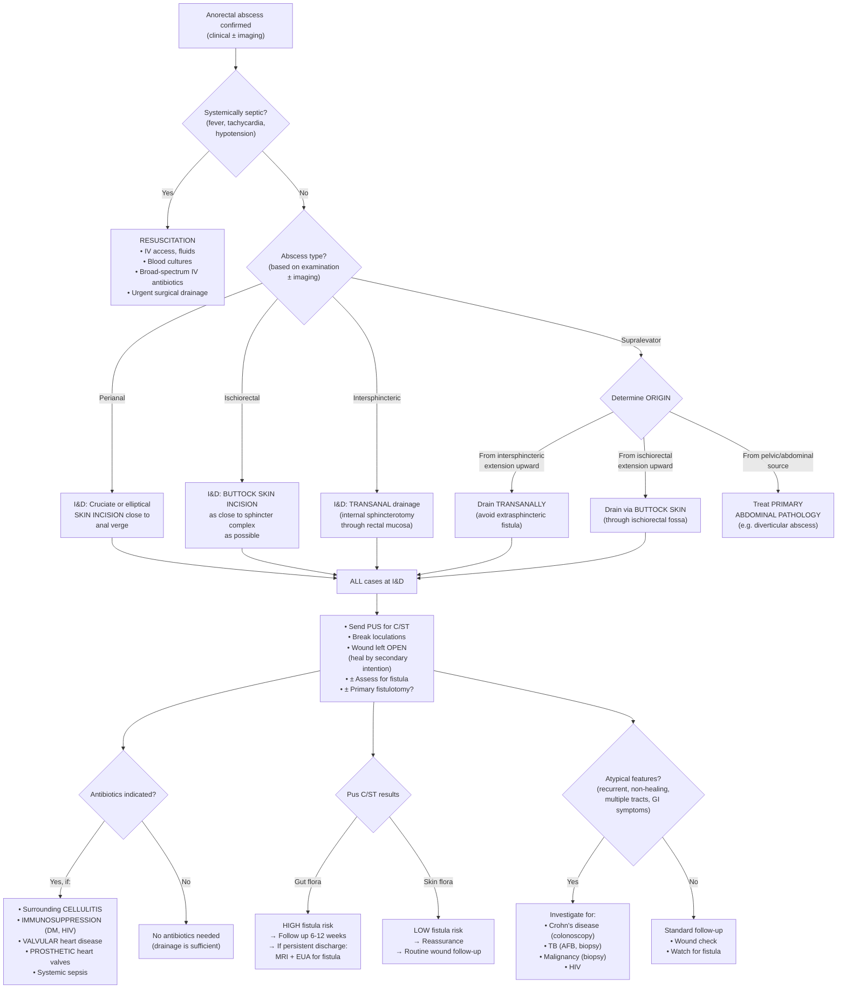
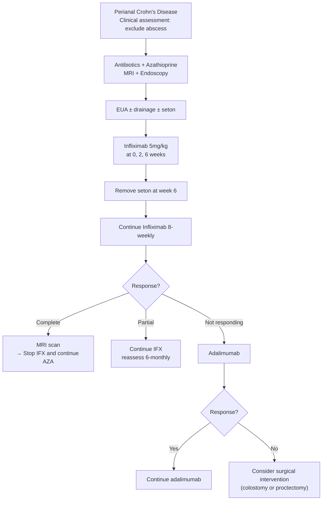

## Management of Anorectal Abscess

### 1. Fundamental Principles

The management of anorectal abscess rests on a single, non-negotiable principle:

> **"If there is pus, let it out."** Surgical drainage is the definitive treatment. An anorectal abscess will NOT resolve with antibiotics alone.

This is because an abscess is a **walled-off collection** of pus — antibiotics cannot penetrate the avascular abscess cavity in sufficient concentration to sterilise it. The cavity must be physically opened and drained to allow the immune system (and any antibiotics, if indicated) to clear the infection. The wound is then left open to **heal by secondary intention** (from the base upward), which prevents premature closure of the skin over an undrained cavity (which would lead to recurrence).

***Treatment: incision and drainage of abscess*** [1].

---

### 2. Management Algorithm

---

### 3. Treatment Modalities

#### 3.1 Surgical Management — Incision and Drainage (I&D)

This is the **mainstay of treatment** for ALL anorectal abscesses [1][4].

##### General Principles of I&D

| Aspect | Details | Rationale |
|---|---|---|
| **Setting** | Operating theatre (preferred) or bedside (for small, superficial perianal abscesses in cooperative patients) | Theatre allows GA/regional anaesthesia for thorough drainage + EUA for fistula assessment |
| **Anaesthesia** | General anaesthesia (GA) or spinal/regional anaesthesia; local anaesthesia (LA) only for small superficial perianal abscess | Deep abscesses and EUA require adequate relaxation; LA is often insufficient and painful |
| **Position** | Prone jackknife or lithotomy | Provides optimal exposure of the perianal region |
| **Incision** | Cruciate or elliptical incision over the point of maximal fluctuance; excise a disc of skin (de-roofing) | An elliptical excision or cruciate incision prevents premature skin closure → the wound must drain from the base upward |
| **Cavity exploration** | Break all loculations digitally; irrigate with saline | Ensures complete evacuation of pus; undrained loculations = recurrence |
| **Wound** | Left **open** — heal by **secondary intention** [4] | Primary closure would trap residual infection → recurrence/re-accumulation |
| **Packing** | Wound may be lightly packed initially (alginate or ribbon gauze) to maintain patency; gradually reduced | Prevents premature skin closure; however, excessive tight packing is painful and counterproductive |
| **Specimens** | ***Pus for C/ST*** [4]; ± tissue biopsy of abscess wall if atypical | Culture guides antibiotic choice and predicts fistula risk; biopsy excludes Crohn's/TB/malignancy |

##### Site-Specific Drainage Approach

This is **critical** — the wrong drainage approach can create an iatrogenic fistula that is worse than the original disease.

| Abscess Type | Drainage Approach | Why This Approach? |
|---|---|---|
| ***Perianal*** | ***Skin incision*** [4] — cruciate/elliptical incision over the fluctuant area at the anal verge | The abscess is subcutaneous and superficial → direct skin incision is all that is needed. Make the incision as close to the anal verge as possible to minimise the length of any potential fistula tract. |
| ***Ischiorectal*** | ***Buttock skin incision → drain as close to sphincter complex as possible*** [4] | The abscess is in the ischiorectal fossa, lateral to the EAS. Incision is made in the buttock/perianal skin overlying the abscess. Draining **as close to the sphincter as possible** minimises the length of a potential fistula tract (a shorter tract is easier to manage surgically later). |
| ***Intersphincteric*** | ***Rectal incision (internal sphincterotomy) → drain transanally*** [4] | The abscess lies between the IAS and EAS. If you drain this through the perianal skin (outward through the EAS), you would create a **transsphincteric** or even **extrasphincteric fistula** — a surgical nightmare. Instead, you drain **inward** through the rectal mucosa and IAS (internal sphincterotomy) → the pus drains into the anal canal → no sphincter damage. |
| ***Supralevator (from intersphincteric extension)*** | ***Drain transanally*** [4] | Same logic — if you drain through the ischiorectal fossa/skin, the tract would traverse the entire sphincter complex + levator ani → **extrasphincteric fistula**. Transanal drainage keeps the tract within the intersphincteric plane. |
| ***Supralevator (from ischiorectal extension)*** | ***Drain via buttock skin (through ischiorectal fossa)*** [4] | The pus has already tracked through the EAS into the ischiorectal fossa and then extended upward. Draining back through the same route (ischiorectal fossa → skin) follows the existing path without creating new sphincter damage. |
| ***Supralevator (from pelvic/abdominal source)*** | Treat the **primary abdominal pathology** (e.g., CT-guided drainage of pelvic abscess; surgery for diverticular disease, appendicitis) | The perianal component is secondary — addressing it alone without treating the source leads to failure. |
| **Horseshoe abscess** | Drain both ischiorectal fossae + counter-drain the **deep postanal space** (modified Hanley procedure) | The horseshoe abscess connects via the deep postanal space — you must drain all three compartments (bilateral ischiorectal fossae + postanal space) for complete source control. |

<Callout title="The Cardinal Rule of Supralevator Abscess Drainage" type="error">
**Determine the origin BEFORE choosing the drainage route.** Draining a supralevator abscess via the wrong route creates an extrasphincteric fistula — the most devastating iatrogenic complication. Intersphincteric origin → transanal. Ischiorectal origin → through buttock skin. Pelvic origin → treat the abdomen. When in doubt, get an **MRI pelvis** before draining [4].
</Callout>

##### Primary Fistulotomy at Time of Abscess Drainage

***?Primary fistulotomy*** [1] — the lecture slide deliberately includes a question mark, reflecting ongoing debate.

| Aspect | Details |
|---|---|
| **Concept** | At the time of I&D, if a fistula tract is identified (by gentle probing), the surgeon may choose to lay open the tract simultaneously — this is "primary fistulotomy" |
| **Rationale for** | Treats the source (infected crypt) at the same time as draining the abscess → lower recurrence rate (reduces need for a second operation); studies show recurrence drops from ~30–50% (I&D alone) to ~5–10% (I&D + primary fistulotomy) |
| **Rationale against** | Risk of **faecal incontinence** if a significant portion of the EAS is divided; may create a false passage if probing is too aggressive; the fistula may not be clearly delineated in the acute inflamed state |
| **Current consensus** | Primary fistulotomy is appropriate only for **simple, low fistulas** (intersphincteric or low transsphincteric involving < 30% of EAS) identified at the time of drainage, performed by an experienced surgeon. It should **NOT** be performed for complex fistulas, high fistulas, or in Crohn's disease. |

> ***Fistulotomy/fistulectomy for simple low fistula. Risk of incontinence should be informed.*** [9]

---

#### 3.2 Medical Management — Antibiotics

The role of antibiotics is **adjunctive, not primary**. Drainage is always the definitive treatment. Antibiotics alone cannot cure an abscess.

***Little role for antibiotics except in patients with severe cellulitis, valvular heart disease, prosthetic heart valves and immunosuppression*** [1].

| Indication for Antibiotics | Rationale | Regimen |
|---|---|---|
| ***Severe surrounding cellulitis*** [1] | Cellulitis = spreading soft tissue infection beyond the abscess cavity → antibiotics needed to control tissue-level infection that surgery alone cannot address | **IV** — Amoxicillin-clavulanate (Augmentin) 1.2g TDS, or Ceftriaxone + Metronidazole; step down to oral when improving |
| ***Valvular heart disease / Prosthetic heart valves*** [1] | Bacteraemia during I&D → risk of **infective endocarditis** (bacteria seeding damaged/prosthetic valves) | Antibiotic prophylaxis before procedure as per local endocarditis prophylaxis guidelines |
| ***Immunosuppression*** [1][4] | Impaired immune response → inability to contain infection after drainage; risk of fulminant sepsis. Includes: **diabetes mellitus** [4], HIV/AIDS, chemotherapy-induced neutropaenia, chronic corticosteroid use, organ transplant recipients | Broad-spectrum IV antibiotics covering gram-negatives and anaerobes (e.g., Piperacillin-tazobactam, or Ceftriaxone + Metronidazole); adjust based on C/ST results |
| **Systemic sepsis** | Fever, tachycardia, hypotension → bacteraemia/sepsis → antibiotics essential alongside surgical source control | Blood cultures → empirical broad-spectrum IV antibiotics → de-escalate based on sensitivities |
| **Necrotising fasciitis (Fournier's gangrene)** | Life-threatening emergency → aggressive antibiotics + emergency surgical debridement | Triple therapy: Meropenem (or Pip-Taz) + Vancomycin + Clindamycin (for toxin suppression); or per local protocol |

<Callout title="When NOT to Give Antibiotics">
A straightforward perianal or ischiorectal abscess in an otherwise healthy patient with no cellulitis does **not** need antibiotics. Drainage alone is curative. Unnecessary antibiotics expose the patient to side effects (C. difficile colitis, antibiotic resistance, allergic reactions) without benefit. The lecture slides specifically state ***little role for antibiotics*** except in the defined indications [1].
</Callout>

**Antibiotic Choice — Principles:**
- Must cover **gram-negative bacilli** (*E. coli*, *Klebsiella*) and **anaerobes** (*Bacteroides fragilis*) — these are the dominant gut flora causing cryptoglandular abscesses
- Common regimens:
  - **IV**: Amoxicillin-clavulanate (Augmentin) 1.2g TDS; or Ceftriaxone 2g daily + Metronidazole 500mg TDS
  - **Oral step-down**: Amoxicillin-clavulanate 625mg TDS; or Ciprofloxacin 500mg BD + Metronidazole 400mg TDS
- Adjust based on **C/ST results** once available

---

#### 3.3 Management of Associated Fistula

About 30–50% of anorectal abscesses will develop a fistula-in-ano. The management of the fistula is a separate (often staged) process after the acute abscess has been drained and the inflammation has settled.

##### Simple Fistula

***Fistulotomy/fistulectomy for simple low fistula*** [9]:
- **Fistulotomy**: Probe inserted from external to internal opening → all tissue overlying the probe is divided → tract is **laid open** to heal by secondary intention ± marsupialization (suturing the wound edges to the tract edges to speed healing) [10]
- **Indications**: Simple fistula — Parks Type 1 (intersphincteric) or Type 2 (low transsphincteric involving < 30% of EAS) [10]
- ***Risk of incontinence should be informed*** [9] — dividing sphincter muscle can impair continence

##### Complex Fistula

***Complicated high fistula or transsphincteric fistula with significant amount of muscle involvement*** [9] — these require **sphincter-sparing procedures** because simple fistulotomy would divide too much sphincter muscle → incontinence.

| Procedure | Mechanism | Indication |
|---|---|---|
| ***Seton (staged procedure)*** [9][10] | A **loose (draining) seton** (silastic vessel loop) is threaded through the fistula tract and left in place for ~6 weeks [10]. It keeps the tract open → prevents re-accumulation of pus → allows inflammation to settle. A **cutting seton** is gradually tightened to slowly cut through the sphincter while fibrosis occurs behind it (prevents gaping incontinence). | Complex/high fistula; first step before definitive sphincter-sparing surgery; also used in Crohn's perianal disease [10][11] |
| ***Endorectal advancement flap*** [9][10] | The internal opening is excised → a flap of rectal mucosa, submucosa, and circular muscle is advanced downward to cover the internal opening → the fistula tract heals with no internal communication | High transsphincteric, suprasphincteric fistulas [10] |
| ***Ligation of Intersphincteric Fistula Tract (LIFT)*** [9][10] | The fistula tract is identified in the intersphincteric plane → ligated and divided → both ends seal off. "LIFT" = you're literally lifting the tract out of the intersphincteric groove and tying it off. | High transsphincteric fistula, especially where internal opening is distal to the dentate line [10] |
| ***Anal fistula plug*** [9] | A bioabsorbable plug (e.g., collagen matrix) is inserted into the fistula tract from the internal opening → scaffold for tissue ingrowth → tract closure | High fistula; variable success rates (30–60%) |
| ***Fibrin sealant*** [10] | Fibrin glue injected into the tract → promotes healing by obliterating the dead space | Simple or complex fistula; low success rates (~15–40%) but minimal morbidity |
| ***Video-Assisted Anal Fistula Treatment (VAAFT)*** [12] | A fistuloscope is inserted into the tract → direct visualisation → electrocautery ablation of the tract lining from within → internal opening closed with a flap or stapler | Sphincter-sparing; newer technique |
| ***FiLaC (Fistula tract Laser Closure)*** [12] | Laser fibre inserted into the tract → thermal energy destroys the tract epithelium → promotes closure | Sphincter-sparing; newer technique |
| ***Permacol paste injection*** [12] | Acellular porcine dermal collagen paste injected into the tract → scaffold for tissue ingrowth | Experimental; newer technique |
| ***Stem cell treatment*** [12] | Mesenchymal stem cells injected into the tract → promotes healing and closure | Promising results in Crohn's perianal fistula (darvadstrocel/Alofisel); newer technique |
| **Modified Hanley procedure** [10] | For **horseshoe fistula**: drains the deep postanal space + bilateral ischiorectal extensions; counter-drainage ensures complete source control | Horseshoe fistula |
| **Diversion / Proctectomy** | Faecal diversion via colostomy; proctectomy if anorectal disease is unsalvageable | Refractory Crohn's perianal disease; extrasphincteric fistula (Parks Type 4) [10] |

---

#### 3.4 Management of Perianal Crohn's Disease

Perianal Crohn's disease requires a **combined medical and surgical approach** [11][13].

***Perianal CD:*** [11]
- ***Metronidazole/ciprofloxacin for infection control***
- ***Abscess — simple drainage***
- ***Simple fistula — fistulotomy***
- ***Complex fistula:***
  - ***Seton insertion for drainage***
  - ***Azathioprine***
  - ***Biologics***
  - ***Colostomy or proctectomy***

The **algorithm from the IBD lecture slides** [13] is as follows:

**Why biologics (anti-TNF) in Crohn's perianal disease?**
- TNF-α is a key pro-inflammatory cytokine driving the transmural inflammation and fistulising phenotype of Crohn's disease
- **Infliximab** ("inflixi-" from "inflixing" a blow to TNF; technically a chimeric monoclonal **anti-body** against TNF-α) blocks TNF-α → reduces inflammation → promotes fistula healing
- **Adalimumab** (a fully human anti-TNF-α monoclonal antibody; "adalim-" from "adaptive" + "immune") is used as second-line if infliximab fails

---

#### 3.5 Post-operative Care and Follow-up

| Aspect | Details |
|---|---|
| **Wound care** | Daily wound irrigation (shower/sitz bath); light packing initially → gradually reduce; wound should heal from the base upward over 4–8 weeks |
| **Pain management** | Regular paracetamol ± NSAIDs; avoid opioids if possible (cause constipation → straining → pain); warm sitz baths (relax sphincter, improve perfusion) |
| **Stool management** | High-fibre diet + adequate fluid intake + stool softeners (e.g., lactulose) → prevent hard stools → reduce pain on defaecation and trauma to healing wound |
| **Follow-up timing** | Review at 1–2 weeks post-drainage (wound check); then at **6–12 weeks** (assess for fistula formation) [5]; C/ST results guide further management |
| **Fistula surveillance** | If pus C/ST showed gut flora → high fistula risk → clinical review ± MRI ± EUA if symptoms persist |
| **Glycaemic control** | Optimise blood glucose in diabetic patients → improves wound healing and reduces recurrence risk |

---

#### 3.6 Contraindications and Cautions

| Intervention | Contraindication / Caution | Reason |
|---|---|---|
| **Primary fistulotomy** | Complex fistula (high transsphincteric, suprasphincteric, extrasphincteric); Crohn's disease; anterior fistula in females; pre-existing incontinence | Dividing a significant portion of the EAS → faecal incontinence; Crohn's fistulas are complex and require staged management |
| **Cutting seton** | Complex fistula with multiple tracts; Crohn's disease; patients with poor healing capacity | Risk of incontinence; Crohn's disease may not heal with cutting seton alone |
| **Antibiotics without drainage** | ALL anorectal abscesses | Antibiotics cannot penetrate the avascular abscess cavity → the abscess will not resolve; drainage is always required |
| **Transanal drainage of ischiorectal abscess** | Should NOT be done — this would create a fistula through the entire sphincter complex | The drainage route must respect the anatomical origin of the abscess |
| **Buttock skin drainage of intersphincteric abscess** | Should NOT be done — this would create a transsphincteric fistula | Same principle — drain along the path that does not traverse the sphincter |
| **MRI with gadolinium** | Severe renal impairment (eGFR < 30) | Risk of nephrogenic systemic fibrosis; use non-contrast MRI or EUS instead |
| **EUA / surgery under GA** | Uncorrected coagulopathy; patient unfit for anaesthesia | Risk of uncontrolled bleeding; optimise before theatre |

---

### 4. Special Situations

#### 4.1 Necrotising Fasciitis (Fournier's Gangrene)

- Life-threatening emergency — perianal sepsis that progresses to necrotising soft tissue infection of the perineum and genitalia
- **Clinical clues**: Pain out of proportion to examination findings, crepitus (gas-forming organisms), rapidly spreading erythema, skin necrosis, systemic toxicity (septic shock)
- **Management**: Emergency surgical debridement (aggressive, wide, often requires multiple returns to theatre) + broad-spectrum IV antibiotics (Meropenem + Vancomycin + Clindamycin) + ICU support + possible faecal diversion (defunctioning colostomy)
- Mortality: 20–40% even with treatment

#### 4.2 Neutropaenic Patients

- Anorectal abscess in neutropaenic patients (e.g., post-chemotherapy) may present with minimal external signs (attenuated inflammatory response)
- **Management**: Low threshold for imaging (MRI/CT) → early drainage → broad-spectrum IV antibiotics → may require G-CSF to boost neutrophil count → close monitoring in haematology/oncology unit

#### 4.3 Pregnancy

- Perianal abscess is uncommon in pregnancy but can occur
- **Management**: I&D under local or regional anaesthesia; avoid general anaesthesia if possible (especially first trimester); coordinate with obstetrics team

---

<Callout title="High Yield Summary — Management of Anorectal Abscess">

**1. Surgical I&D is the definitive treatment** — antibiotics alone will NOT cure an abscess.

**2. Site-specific drainage approach:**
- Perianal → skin incision
- Ischiorectal → buttock skin incision (close to sphincter)
- Intersphincteric → transanal (internal sphincterotomy)
- Supralevator → depends on origin (intersphincteric → transanal; ischiorectal → buttock; pelvic → treat abdomen)

**3. Antibiotics: limited role** — only for cellulitis, valvular/prosthetic heart disease, immunosuppression, or systemic sepsis.

**4. Always send pus for C/ST** — gut flora predicts fistula; skin flora = reassurance.

**5. Primary fistulotomy** may be considered for simple, low fistulas at time of drainage, but **never for complex fistulas or Crohn's**.

**6. Follow up at 6–12 weeks** to assess for fistula formation.

**7. Crohn's perianal disease** = combined medical (antibiotics → azathioprine → biologics) + surgical (drainage → seton) approach.

</Callout>

---

<ActiveRecallQuiz
  title="Active Recall - Management of Anorectal Abscess"
  items={[
    {
      question: "State the definitive treatment for anorectal abscess and explain why antibiotics alone are insufficient.",
      markscheme: "Incision and drainage (I&D) is the definitive treatment. Antibiotics cannot penetrate the avascular abscess cavity in sufficient concentration to sterilise it. The walled-off pus collection must be physically opened and drained. The wound is left open to heal by secondary intention."
    },
    {
      question: "Describe the correct drainage approach for an intersphincteric abscess and explain why you must NOT drain it through the perianal skin.",
      markscheme: "Drain transanally via internal sphincterotomy (rectal mucosal incision). If drained through the perianal skin, the drainage tract would traverse the external anal sphincter, creating a transsphincteric or extrasphincteric fistula — risking faecal incontinence and making future surgical management much more difficult."
    },
    {
      question: "List four specific indications for antibiotics in the management of anorectal abscess.",
      markscheme: "1) Severe surrounding cellulitis. 2) Valvular heart disease. 3) Prosthetic heart valves. 4) Immunosuppression (DM, HIV, neutropaenia). Also accept: systemic sepsis, necrotising fasciitis."
    },
    {
      question: "A patient with known Crohn's disease presents with a complex perianal fistula after abscess drainage. Outline the stepwise management approach.",
      markscheme: "1) Antibiotics (metronidazole/ciprofloxacin) for infection control + azathioprine. 2) MRI pelvis + endoscopy to assess anatomy. 3) EUA with drainage and seton insertion. 4) Infliximab 5mg/kg at 0, 2, 6 weeks. 5) Remove seton at week 6. 6) Continue infliximab 8-weekly. 7) If partial response: continue infliximab and reassess 6-monthly. If no response: switch to adalimumab. If still refractory: consider colostomy or proctectomy."
    },
    {
      question: "What determines the drainage route for a supralevator abscess? Give the correct approach for each origin.",
      markscheme: "The origin of the supralevator abscess determines the route. 1) Intersphincteric origin (upward extension): drain transanally. 2) Ischiorectal origin (upward extension): drain via buttock skin through the ischiorectal fossa. 3) Pelvic/abdominal origin (e.g. diverticular abscess tracking down): treat the primary abdominal pathology. Wrong route creates an extrasphincteric fistula."
    },
    {
      question: "Name four sphincter-sparing procedures for complex anal fistula.",
      markscheme: "Any four of: 1) Loose (draining) seton + staged sphincter-sparing procedure. 2) Endorectal advancement flap. 3) LIFT (ligation of intersphincteric fistula tract). 4) Anal fistula plug. 5) Fibrin sealant. 6) VAAFT (video-assisted anal fistula treatment). 7) FiLaC (fistula tract laser closure). 8) Modified Hanley procedure (horseshoe fistula)."
    }
  ]}
/>

## References

[1] Lecture slides: GC 179. Anal pain perianal lesions and sepsis.pdf (p53 — Treatment)
[4] Senior notes: maxim.md (Anorectal abscess — Management)
[5] Senior notes: maxim.md (Anal fistula — suspect if abscess persists 6–12 weeks)
[9] Lecture slides: GC 179. Anal pain perianal lesions and sepsis.pdf (p58 — Fistula treatment)
[10] Senior notes: maxim.md (Anal fistula — Definitive treatment, sphincter-sparing procedures)
[11] Lecture slides: Inflammatory bowel disease.pdf (p48 — Perianal CD)
[12] Lecture slides: GC 179. Anal pain perianal lesions and sepsis.pdf (p61 — Other treatment modalities)
[13] Lecture slides: Inflammatory bowel disease.pdf (p49 — Perianal CD algorithm)
