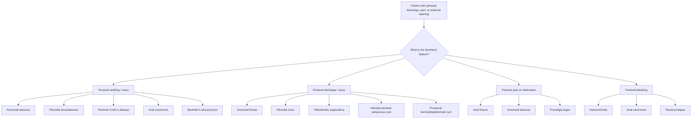

## Differential Diagnosis of Anorectal Fistula

The differential diagnosis of anorectal fistula essentially boils down to one question: **what else can cause a perianal opening with discharge, pain, or swelling?** Let's work through this systematically from first principles.

A patient presenting with perianal discharge, pain, and/or a visible external opening on the perianal skin could have several conditions. The key is to distinguish a true fistula (communication between two epithelial surfaces) from conditions that mimic it. ***Diagnosis can usually be made by careful history and examination*** [1], but you must actively consider — and exclude — the differential diagnoses below.

---

### Approach to Differential Diagnosis

The differentials can be organised by the **dominant presenting feature**:

---

### Detailed Differential Diagnoses

#### 1. Anorectal Abscess

| Feature | Details |
|---|---|
| **Relationship to fistula** | Abscess = acute phase; fistula = chronic phase of the **same cryptoglandular process** [2][3]. |
| **Why it's in the DDx** | An undrained or incompletely drained abscess can mimic a fistula (and vice versa). A fistula with a blocked external opening re-accumulates pus and presents as a "recurrent abscess." |
| **Key distinguishing features** | ***Constant perianal pain, exacerbated when sitting down*** [4]. ***Erythematous, fluctuant, tender mass*** on palpation/DRE [4]. Systemic features (fever, malaise) more prominent than in chronic fistula. No visible external opening (unless spontaneously draining). |
| **How to differentiate** | Fistula has an established **external opening** with chronic intermittent discharge. Abscess is an acute collection without a mature tract. However, they coexist — ***suspect anal fistula if an anorectal abscess persists after 6–12 weeks*** [3]. |

<Callout title="Abscess vs Fistula — Same Coin, Two Sides" type="error">
Do not think of these as completely separate diagnoses. An abscess that doesn't resolve likely has an underlying fistula. After I&D, always arrange follow-up to assess for fistula. Remember: pus culture with **gut flora = likely fistula**; **skin flora = reassurance** [4].
</Callout>

---

#### 2. Anal Fissure

| Feature | Details |
|---|---|
| **What is it?** | A tear in the anoderm **distal to the dentate line** [5][6]. |
| **Why it's in the DDx** | Both present with **painful defecation** and may have perianal discharge/bleeding [2][5]. |
| **Key distinguishing features** | ***Pain on defecation*** — classically described as a **tearing pain** during bowel movement with a brief respite then prolonged burning pain afterwards (due to IAS spasm) [5][6]. ***Fresh rectal bleeding*** — typically small amount on toilet paper or surface of stool [5]. ***Diagnosis is by spreading the buttock to reveal the fissure*** [1]. Most at **posterior midline (6 o'clock)** due to least perfusion [6]. Chronic fissure has **sentinel pile + hypertrophied anal papillae** [6]. |
| **How to differentiate** | Fissure = visible **linear tear** on inspection. Fistula = **external opening** (dimple/granulation tissue) with a palpable **cord-like tract** [3]. Fissure pain is **during and immediately after defecation** (linked to stretching the tear). Fistula pain is **cyclical** — builds when external opening blocks, improves when pus discharges. ***Rectal examination and proctoscopy are painful and not indicated*** in acute fissure [1]. |

<Callout title="Atypical Fissure = Think Crohn's">
***Always suspect perianal Crohn's disease*** if the fissure is: **non-midline, recurring, multiple, unusually deep or wide**, or associated with **perianal hypertrophic skin tags** [6]. In Crohn's, fissures and fistulae often coexist.
</Callout>

---

#### 3. Pilonidal Sinus

| Feature | Details |
|---|---|
| **What is it?** | Formation of a sinus in the **natal cleft** (intergluteal cleft) due to infection and obstruction of a hair follicle → foreign body reaction → cavity formation [7]. |
| **Why it's in the DDx** | Both present as a **perianal discharging opening** with intermittent pain and swelling [7]. |
| **Key distinguishing features** | Located in the **sacrococcygeal region** (natal cleft), **NOT** at the anal verge. ***Does not continue into the anal canal*** (cf. anal fistula) [7]. Often has **embedded hairs** visible at the sinus opening. Risk factors: Caucasian males with coarse dark body hair, prolonged sitting, increased sweating [7]. **Rare in Hong Kong** [7]. |
| **How to differentiate** | **Location is key**: pilonidal sinus is in the midline natal cleft (between the buttocks, over the sacrococcygeal area), well away from the anus. Anal fistula has its external opening **close to the anus** (usually within 3–5 cm of the anal verge) and communicates with the anal canal on probing/imaging. |

---

#### 4. Perianal Crohn's Disease

| Feature | Details |
|---|---|
| **What is it?** | Perianal manifestation of Crohn's disease — affects ***24.5% of patients with Crohn's disease*** [8]. Includes skin tags, fissures, abscesses, fistulae, and strictures. |
| **Why it's in the DDx** | Crohn's perianal fistulae are a specific subset. But sometimes perianal disease is the **first presentation** of Crohn's, before any intestinal symptoms are apparent — so you must think of it. |
| **Key distinguishing features** | ***More complicated courses of fistula tract*** [8]. Multiple external openings, complex/branching tracts, associated "elephant ear" skin tags, off-midline fissures, rectal stricture. Bowel symptoms (diarrhoea, abdominal pain, weight loss) may or may not be present. ***MRI and EAUS necessary to document before definitive treatment*** [8]. |
| **How to differentiate** | Colonoscopy if Crohn's is suspected [3]. Look for skip lesions, cobblestoning, non-caseating granulomata on biopsy. ***Anti-TNF +/- AZA and/or seton drainage*** is the treatment approach [8] — very different from simple cryptoglandular fistula management. |

<Callout title="Perianal Crohn's — Don't Miss It">
Any patient with a **complex, recurrent, or atypical fistula** (multiple tracts, off-midline, associated with non-healing wounds) should be investigated for **Crohn's disease** with colonoscopy, even in the absence of GI symptoms. ***83% of perianal Crohn's patients required surgery*** [8].
</Callout>

---

#### 5. Anal Carcinoma

| Feature | Details |
|---|---|
| **What is it?** | Malignancy of the anal canal — **80% squamous cell carcinoma** (below dentate line), 10% adenocarcinoma (above dentate line), others include melanoma [7]. |
| **Why it's in the DDx** | Can present with **painful PR bleeding, perianal mass, and discharge** — mimicking a fistula. A malignant fistula may also develop. ***Colorectal neoplasm needs to be excluded*** [1]. |
| **Key distinguishing features** | **Hard, irregular, non-tender mass** on DRE (vs. the soft granulation tissue of a fistula opening). Risk factors: HPV infection (esp. 16/18), HIV, smoking, immunosuppression [7]. May have **inguinal lymphadenopathy** (tumour below dentate line drains to superficial inguinal nodes) [7]. |
| **How to differentiate** | **Biopsy any suspicious, indurated, or non-healing perianal lesion** under EUA. MRI pelvis for staging. Always send tissue from the fistula tract for histology at the time of surgery — to exclude malignancy. |

---

#### 6. Hidradenitis Suppurativa

| Feature | Details |
|---|---|
| **What is it?** | Chronic inflammatory condition of the **apocrine sweat glands** (found in axillae, groin, perineum, perianal area). Leads to recurrent abscesses, sinus tracts, and scarring. |
| **Why it's in the DDx** | Produces **multiple discharging sinuses** in the perianal/perineal area that can be confused with complex fistulae. |
| **Key distinguishing features** | Typically **bilateral**, involving the **perineum and groin** (not centred on the anal canal). Extensive **scarring and bridged skin** between sinuses. Often also affects axillae and inguinal folds. **No internal opening in the anal canal** on anoscopy/proctoscopy. |
| **How to differentiate** | Distribution pattern (bilateral, groin/axilla involvement). On examination/imaging, there is no communication with the anal canal lumen. |

---

#### 7. Presacral Epidermoid / Dermoid Cyst

| Feature | Details |
|---|---|
| **What is it?** | Developmental cyst in the presacral/retrorectal space. Can become infected and present as a perianal/gluteal abscess or draining sinus [2]. |
| **Why it's in the DDx** | When infected, it can mimic an anorectal abscess or fistula with posterior perianal swelling and discharge. |
| **Key distinguishing features** | Mass is typically **posterior**, palpable on DRE as a **smooth, well-defined retrorectal mass**. No internal opening at the dentate line. MRI shows a well-circumscribed presacral cystic lesion. |
| **How to differentiate** | MRI pelvis differentiates from fistula. No communication with anal canal lumen. |

---

#### 8. Anal Ulcers or Sores [2]

| Feature | Details |
|---|---|
| **What are they?** | Ulceration of the anal canal/perianal skin from various causes: STIs (syphilitic chancre, HSV, chancroid), TB, HIV, solitary rectal ulcer syndrome. |
| **Why they're in the DDx** | Can present with perianal pain, discharge, and visible lesion — similar to the external opening of a fistula. |
| **Key distinguishing features** | **No palpable tract or cord** connecting to an internal opening. Syphilitic chancre: painless ulcer with raised edges. HSV: multiple shallow painful vesicles/ulcers. Solitary rectal ulcer: anterior rectal wall, associated with straining/rectal prolapse. |
| **How to differentiate** | Careful inspection (no tract), STI screening (serology, swabs), biopsy if needed. |

---

#### 9. Rectal Prolapse [9]

| Feature | Details |
|---|---|
| **What is it?** | Protrusion of rectal wall through the anus — full thickness (procidentia) or mucosal only. |
| **Why it's in the DDx** | Can present with **mucus discharge, pain, and perianal wetness** — similar to fistula symptoms [9]. |
| **Key distinguishing features** | Visible **circumferential concentric mucosal folds** protruding through the anus (vs. radial folds in prolapsed haemorrhoids). History of mass protruding on straining that reduces spontaneously or manually. Predominantly elderly women [9]. |
| **How to differentiate** | Ask the patient to strain — prolapse becomes visible. No external opening or tract. |

---

#### 10. Proctalgia Fugax [7]

| Feature | Details |
|---|---|
| **What is it?** | ***Benign, brief attacks of rectal pain at night, unrelated to defecation*** — occurs in **young anxious men** [7]. |
| **Why it's in the DDx** | Episodic perianal/rectal pain could be confused with the cyclical pain of a fistula. |
| **Key distinguishing features** | **No discharge, no external opening, no physical findings.** Pain is brief (seconds to minutes), often nocturnal, resolves spontaneously. Diagnosis of exclusion. |
| **How to differentiate** | Entirely clinical — **normal examination**. No tract, no opening, no discharge. |

---

### Summary Differential Diagnosis Table

| Condition | Key Distinguishing Feature from Fistula |
|---|---|
| **Anorectal abscess** | Acute fluctuant tender mass, no mature external opening/tract |
| **Anal fissure** | Visible linear tear at anal verge, tearing pain on defecation, no tract |
| **Pilonidal sinus** | Natal cleft location (sacrococcygeal), does not communicate with anal canal |
| **Perianal Crohn's disease** | Multiple complex tracts, skin tags, associated GI symptoms, non-caseating granulomata |
| **Anal carcinoma** | Hard irregular mass, inguinal LN, non-healing, HPV risk factors |
| **Hidradenitis suppurativa** | Bilateral perineal/groin sinuses, axillary involvement, no anal canal communication |
| **Presacral cyst** | Posterior retrorectal smooth mass on DRE, no internal anal opening |
| **Anal ulcers/sores** | No tract or cord, consider STI and TB, biopsy |
| **Rectal prolapse** | Circumferential mucosal protrusion on straining, no external opening |
| **Proctalgia fugax** | Normal examination, brief nocturnal pain, diagnosis of exclusion |

---

### Clinical Decision-Making Flow

When you see a patient with a **perianal external opening and discharge**, your systematic approach should be:

1. **Is it a fistula or something else?** — Examine for a tract, look for internal opening, check location relative to anal canal.
2. **If it's a fistula, is it simple or complex?** — Parks classification, assess sphincter involvement.
3. **Is there an underlying cause?** — Always consider Crohn's disease (colonoscopy), TB (especially in HK), and malignancy (biopsy).
4. ***Common anorectal conditions are mostly benign*** but ***colorectal neoplasm needs to be excluded*** [1].

<Callout title="High Yield Summary">

1. The **three core differentials** listed in senior notes are: **anorectal abscess, anal fissure, and anal ulcers/sores** [2].
2. **Anorectal abscess** = acute phase of the same cryptoglandular process; suspect fistula if abscess persists > 6–12 weeks.
3. **Anal fissure** = linear tear below dentate line; tearing pain on defecation; posterior midline; no tract.
4. **Pilonidal sinus** is in the natal cleft and does NOT communicate with the anal canal — this is the key differentiator.
5. ***Always exclude Crohn's disease*** in complex/recurrent/atypical fistulae — perianal CD affects ~24.5% of Crohn's patients.
6. ***Always exclude malignancy*** — biopsy any suspicious, indurated, non-healing perianal lesion; colorectal neoplasm needs to be excluded.
7. **Hidradenitis suppurativa** mimics complex fistulae but has bilateral distribution, groin/axillary involvement, and no anal canal communication.
8. **Proctalgia fugax** = normal examination, brief nocturnal pain in young anxious men — diagnosis of exclusion.

</Callout>

---

<ActiveRecallQuiz
  title="Active Recall - Anorectal Fistula: Differential Diagnosis"
  items={[
    {
      question: "Name the three differential diagnoses for anorectal fistula listed in the senior notes.",
      markscheme: "Anal abscess, anal fissure, anal ulcers or sores. Abscess is the acute phase of the same process. Fissure is a linear tear below the dentate line. Anal ulcers include STI-related and solitary rectal ulcer syndrome.",
    },
    {
      question: "How do you distinguish a pilonidal sinus from an anorectal fistula on clinical examination?",
      markscheme: "Location: pilonidal sinus is in the natal cleft (sacrococcygeal region), NOT at the anal verge. It does not communicate with the anal canal. Embedded hairs may be visible. Anal fistula external opening is close to the anus and communicates with the anal canal.",
    },
    {
      question: "A 28-year-old man presents with multiple perianal fistulae, skin tags, and chronic diarrhoea. What is the most important differential to exclude and how would you investigate?",
      markscheme: "Crohn's disease (perianal CD affects 24.5% of Crohn's patients). Investigate with colonoscopy looking for skip lesions and non-caseating granulomata on biopsy. MRI pelvis and endoanal ultrasound to map fistula anatomy before definitive treatment.",
    },
    {
      question: "Why must you biopsy an atypical or non-healing perianal fistula? What malignancy are you excluding and what are its risk factors?",
      markscheme: "Must exclude anal carcinoma (80% SCC, below dentate line). Risk factors: HPV infection (esp. 16 and 18), HIV, smoking, immunosuppression, Crohn's disease. Colorectal neoplasm needs to be excluded in any atypical perianal presentation.",
    },
    {
      question: "What clinical feature distinguishes hidradenitis suppurativa from complex anorectal fistulae?",
      markscheme: "Hidradenitis affects apocrine gland-bearing skin, typically bilateral, involving perineum, groin, and axillae. No internal opening in the anal canal. Extensive scarring and bridged skin between sinuses. No communication with the anal canal lumen on imaging.",
    },
  ]}
/>

---

## References

[1] Lecture slides: GC 179. Anal pain perianal lesions and sepsis.pdf (p46, p56, p57, p77)
[2] Senior notes: felixlai.md (Anorectal fistulas — Clinical manifestation, Differential diagnosis)
[3] Senior notes: maxim.md (Anal fistula — Assessment section)
[4] Senior notes: maxim.md (Anorectal abscess — Clinical diagnosis, Management)
[5] Senior notes: felixlai.md (Anal fissures — Clinical manifestation)
[6] Senior notes: maxim.md (Anal fissure section)
[7] Senior notes: maxim.md (Pilonidal sinus, Proctalgia fugax, Anal carcinoma sections)
[8] Lecture slides: Inflammatory bowel disease.pdf (p45, p48)
[9] Senior notes: felixlai.md (Rectal prolapse section)
