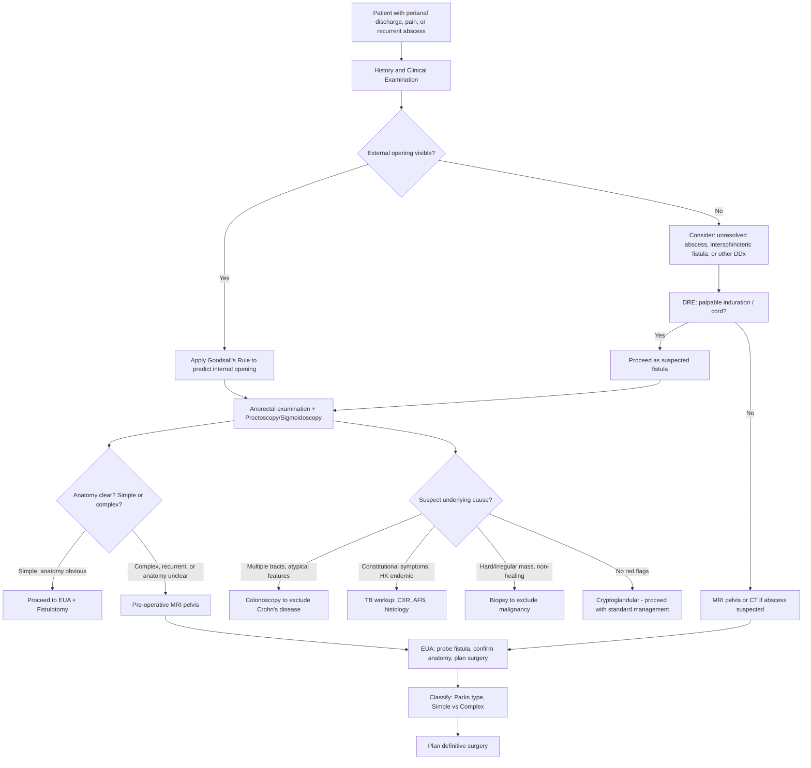

## Diagnosis of Anorectal Fistula

### Diagnostic Principles

Before diving into individual investigations, understand the **three goals of diagnosing a fistula** — every investigation you order serves one of these purposes [1]:

1. ***Define the anatomy of the pathological process*** — where is the internal opening, external opening, primary tract, and any secondary extensions? What is the relationship to the sphincter complex? (This determines Parks classification → determines surgery.)
2. ***Help in the diagnosis and assess the severity of disease*** — is this simple or complex? Is there active sepsis?
3. ***Exclude diseases in the proximal bowel and associated bowel problems (e.g., inflammatory bowel disease)*** — is there an underlying cause like Crohn's, TB, or malignancy? [1]

<Callout title="No Formal 'Diagnostic Criteria'">
Unlike many medical conditions, anorectal fistula does not have formal diagnostic criteria akin to the Jones criteria or McDonald criteria. The diagnosis is **clinical** — based on history, examination, and confirmed by imaging/EUA. The "criteria" are essentially: (1) compatible history, (2) identifiable external opening, (3) demonstrable internal opening and tract connecting the two. The real diagnostic challenge is **classifying** the fistula accurately to plan surgery.
</Callout>

---

### Diagnostic Algorithm

---

### Investigation Modalities

#### 1. Clinical Examination (The Foundation)

Anorectal fistula is **primarily a clinical diagnosis** [1]. ***Clinical examination*** is the first and most important step [1].

##### a. History

***Approach to anorectal diseases*** requires a focused history [1]:
- ***Present illness***: ***anorectal symptoms — pain, bleeding, mass, prolapse*** [1]. For fistula specifically: intermittent perianal discharge, cyclical pain (worse when blocked, better when drains), recurrent abscess at the same site.
- ***Past health***: ***medical diseases, previous surgery*** [1] — prior anorectal abscess drainage? Previous fistula surgery? IBD? TB? Radiation?
- ***Family history*** [1] — IBD.
- ***Sexual history*** [1] — LGV, HIV, HPV (anal carcinoma).

##### b. External Inspection

- ***External opening*** visible on perianal skin [1][2]:
  - Typically a small **dimpled area of granulation tissue** that drains pus or blood on **manual compression** [2].
  - **Pustule-like lesion** in perianal or buttock area [2].
  - **Perianal skin is excoriated and inflamed** from chronic discharge [2].
- Count the number of external openings — multiple openings suggest complex fistula or Crohn's disease.
- Note the **position** of the external opening relative to the anus → apply ***Goodsall's rule*** [3]:
  - Anterior to transverse anal line → straight radial tract.
  - Posterior to transverse anal line → curved tract to posterior midline.
  - ***Higher reliability if external opening within 3 cm of anal verge*** [3].

<Callout title="Do NOT Probe in Clinic!" type="error">
On initial outpatient examination, ***do NOT probe*** the fistula [3]. Blind probing in the clinic without anaesthesia risks creating a **false passage** and causing pain. Probing is done under anaesthesia during ***EUA*** [2][3].
</Callout>

##### c. Digital Rectal Examination (DRE)

- ***PR: induration with cord-like structure*** [1] — the fistula tract is palpable as a firm, cord-like subcutaneous structure running from the external opening towards the anal canal.
- May feel a **pit or area of induration** at the dentate line corresponding to the internal opening.
- Assess **sphincter tone** (resting and squeeze) — baseline continence assessment before surgery is critical.
- Feel for any **abscess** (fluctuance, tenderness) or **mass** (hard, irregular = malignancy).

##### d. Proctoscopy / Sigmoidoscopy

- ***Internal opening in the anus can be viewed with anoscopy*** [2].
- ***Internal opening in the rectum can be viewed with sigmoidoscopy*** [2].
- May see pus exuding from the internal opening.
- Also assesses for concurrent pathology (haemorrhoids, fissure, rectal mucosal changes suggesting Crohn's or malignancy).

---

#### 2. Imaging Studies

***Imaging studies are usually not necessary*** for straightforward simple fistulae [1]. However, they are essential in specific scenarios.

##### a. MRI Pelvis (Gold Standard Imaging)

***MRI*** is the ***accurate technique for evaluation of the primary track of fistula and any extensions*** [1].

**When to order MRI** [1]:
- ***Complicated high fistula***
- ***Recurrent fistula***
- ***When anatomy is not obvious***

***MRI and EAUS are necessary to document before definitive treatment*** in perianal Crohn's disease [8].

| MRI Sequence | What It Shows | Why It Matters |
|---|---|---|
| **T2-weighted (with fat suppression)** | Fluid-filled tracts appear **bright/hyperintense** against dark fat | Demonstrates active tracts and secondary extensions filled with fluid/pus |
| **T1-weighted post-gadolinium** | Enhancing granulation tissue lining the tract wall | Differentiates active inflammation (enhancing) from fibrotic/healed tracts (non-enhancing) |
| **STIR sequences** | Suppresses fat signal, highlights oedema and fluid | Excellent for detecting abscesses (bright collections) and inflamed tracts |

**Key MRI findings and interpretation:**

- **Primary fistula tract**: linear hyperintense tract on T2W connecting internal and external openings. Classify its relationship to EAS → Parks type.
- **Secondary extensions/branches**: additional tracts branching from the primary tract (e.g., horseshoe extension in the ischiorectal fossa or supralevator space).
- **Abscess**: well-defined fluid collection with enhancing rim post-gadolinium. Must be drained before definitive fistula surgery.
- **Internal opening**: identified as a defect in the IAS at the level of the dentate line, often with surrounding inflammation.
- **Sphincter integrity**: assess IAS and EAS for defects (from prior surgery or obstetric injury) — affects surgical planning.

**St James's University Hospital MRI Classification** (widely used):

| Grade | Description |
|---|---|
| 1 | Simple linear intersphincteric fistula |
| 2 | Intersphincteric fistula with intersphincteric abscess or secondary tract |
| 3 | Transsphincteric fistula |
| 4 | Transsphincteric fistula with abscess or secondary tract in ischiorectal fossa |
| 5 | Supralevator or translevator disease |

> Higher grade = more complex = higher recurrence risk, needs sphincter-sparing surgery.

<Callout title="MRI is King for Complex Fistulae">
If you remember one investigation for complex fistula, it's **MRI pelvis**. It has ~90% accuracy for classifying fistula anatomy and detecting secondary extensions that might be missed on clinical examination alone. It has largely replaced fistulography in modern practice.
</Callout>

##### b. Endoanal Ultrasound (EAUS / Transrectal Ultrasound)

***Transrectal ultrasound*** can be used to ***assess complex fistula*** [1] and ***assess the sphincter muscles in patients with faecal incontinence*** [1].

- **Technique**: High-frequency (7–16 MHz) rotating endoprobe inserted into the anal canal.
- ***Instilling H₂O₂ (hydrogen peroxide) via the external opening*** improves visualisation of the fistula tract — the microbubbles appear hyperechoic (bright) on ultrasound [3].

| Finding | Interpretation |
|---|---|
| **Hypoechoic tract** between IAS and EAS | Intersphincteric fistula |
| **Hypoechoic tract crossing EAS** | Transsphincteric fistula |
| **Hypoechoic collection** | Abscess |
| **Sphincter defect** | Prior sphincter injury — affects surgical planning |
| **Hyperechoic tract after H₂O₂** | Tract enhancement confirming fistula course |

**Advantages**: No radiation, real-time imaging, good sphincter assessment, bedside availability.
**Limitations**: Operator-dependent, limited field of view (cannot see supralevator disease as well as MRI), uncomfortable without anaesthesia.

**MRI vs EAUS**: Both have similar accuracy for classifying primary tracts (~85–90%). MRI is superior for detecting **secondary extensions and supralevator disease**. In practice, MRI is preferred for complex fistulae; EAUS is a good alternative if MRI is unavailable or for sphincter assessment.

##### c. Fistulography [1][2]

***Fistulogram*** [1] — injection of water-soluble contrast through the external opening followed by radiographs.

- **Largely superseded** by MRI and EAUS in modern practice.
- Can demonstrate the tract, but has poor sensitivity for secondary extensions and does not show the relationship to sphincter muscles well.
- May have a role when MRI/EAUS are unavailable.

##### d. CT Scan

- Less useful than MRI for fistula tract delineation (poorer soft-tissue contrast).
- Main role: ***CT/MRI scan indicated in a non-palpable abscess*** [5] — particularly useful for detecting **deep abscesses** (supralevator, ischiorectal) that are not clinically apparent.
- CT abdomen/pelvis may also be used to assess for **Crohn's disease** complications (strictures, other fistulae).

---

#### 3. Examination Under Anaesthesia (EUA) — The Definitive Assessment

***Examination under anesthesia (EUA)*** is ***required before surgery to trace the fistula tract*** [3]. This is the most important investigation because it combines diagnostic confirmation with therapeutic planning — and is often performed immediately before definitive surgery.

**What happens during EUA:**

1. **Visual inspection** of perianal area (external opening, scarring, Crohn's features).
2. **DRE** with relaxed sphincter — assess internal opening, induration, sphincter integrity.
3. **Proctoscopy** — identify internal opening (may see pus draining from a crypt at the dentate line).
4. **Fistula probing** [2]:
   - A **fistula probe** (malleable metal probe) is gently inserted into the external opening and passed along the tract towards the internal opening.
   - ***Determine whether the fistula is simple or complex based on the extent of anal sphincter muscle involvement*** [2].
   - ***Performed with caution to avoid creating a false passage by penetrating the fistula wall*** [2].
5. **Injection of hydrogen peroxide or methylene blue** through external opening — helps visualise the internal opening (dye emerges at the crypt).
6. **Assessment of sphincter bulk** around the tract — the surgeon palpates how much muscle lies between the probe and the skin to decide if fistulotomy is safe.

<Callout title="The Surgeon's Dilemma at EUA">
At EUA, the surgeon must answer: **"Can I safely lay this open (fistulotomy) without causing incontinence?"** If the probe shows the tract passes through > 30% of the EAS, or if the patient has poor baseline tone, or if this is a complex/recurrent fistula — the answer is no, and a **sphincter-sparing approach** (seton, advancement flap, LIFT) is needed instead.
</Callout>

---

#### 4. Investigations to Exclude Underlying Causes

These are not for diagnosing the fistula per se but for answering **"Why does this patient have a fistula?"** — essential in atypical cases.

##### a. Colonoscopy [3][8]

- **Indication**: ***Colonoscopy if suspect Crohn's disease*** [3].
- Any patient with **complex, recurrent, multiple, or atypical fistulae** should have a colonoscopy.
- Look for: skip lesions, cobblestoning, aphthous ulcers, non-caseating granulomata on biopsy.
- ***24.5% of patients with Crohn's disease*** have perianal involvement [8]; sometimes perianal disease is the **first** manifestation.

##### b. Histology / Biopsy

- Tissue from the fistula tract (curettings from EUA) should be sent for histology.
- **Granulomata**: if found, must differentiate Crohn's (non-caseating) from TB (caseating). ***Must exclude TB*** — especially in Hong Kong [2].
- **Dysplasia/malignancy**: biopsy any hard, irregular, or suspicious tissue.
- **Actinomycosis**: "sulphur granules" on histology.

##### c. TB Workup

- CXR, sputum AFB (if pulmonary involvement suspected).
- Tissue AFB staining and TB culture from fistula curettings.
- Interferon-gamma release assay (IGRA) / Mantoux test.
- Important in Hong Kong (TB is endemic).

##### d. Blood Tests (Supportive)

| Test | Rationale |
|---|---|
| **FBC** | Raised WCC suggests active sepsis; anaemia in Crohn's |
| **CRP / ESR** | Inflammatory markers — elevated in active sepsis, Crohn's |
| **Albumin** | Low in chronic Crohn's (malnutrition) |
| **LFT** | Baseline; PSC screen in Crohn's/UC |

##### e. Pus Culture and Sensitivity [4]

- After abscess drainage: pus for **C/ST** (culture and sensitivity testing).
- **Gut flora** (E. coli, Bacteroides) → communication with anal canal lumen → **likely fistula** → arrange follow-up [4].
- **Skin flora** (Staphylococcus) → superficial infection → **unlikely fistula** → reassurance [4].

---

### Summary: Which Investigation and When?

| Scenario | Investigations |
|---|---|
| **Straightforward simple fistula** | Clinical exam + EUA (often combined with surgery). ***Imaging usually not necessary*** [1]. |
| ***Complicated high fistula*** | ***MRI pelvis*** (pre-operative) + EUA [1] |
| ***Recurrent fistula*** | ***MRI pelvis*** + EUA + colonoscopy (to exclude Crohn's) [1] |
| ***Anatomy not obvious*** | ***MRI pelvis*** or endoanal USS [1] |
| **Suspected Crohn's disease** | Colonoscopy + ***MRI and EAUS*** + bloods (CRP, albumin, FBC) [3][8] |
| **Suspected malignancy** | EUA with biopsy + MRI pelvis for staging |
| **Suspected TB** | Histology (caseating granulomata), AFB staining/culture, CXR, IGRA |
| **Post-abscess drainage** | Pus C/ST → gut flora predicts fistula [4] |
| **Pre-existing incontinence** | Endoanal USS or MRI (sphincter mapping) + anorectal manometry |

---

<Callout title="High Yield Summary">

1. **Anorectal fistula is a clinical diagnosis** — history (cyclical pain, discharge, recurrent abscess) + examination (external opening, cord-like tract, DRE).
2. **Goals of investigation**: define anatomy of tract, classify simple vs complex, exclude underlying cause (Crohn's, TB, malignancy).
3. **Goodsall's rule** predicts internal opening location: anterior = straight, posterior = curved to midline. Reliable within 3 cm of anal verge.
4. ***Do NOT probe in clinic*** — probing is done at EUA under anaesthesia to avoid creating false passages.
5. **EUA is required before surgery** — the definitive assessment combining probing, proctoscopy, and surgical planning.
6. ***MRI pelvis*** is the **gold standard imaging** for complicated, recurrent, or anatomically unclear fistulae. It shows primary tract, secondary extensions, abscesses, and sphincter integrity.
7. **Endoanal USS** is an alternative, especially good for sphincter assessment; enhanced with H₂O₂ injection through external opening.
8. ***Imaging is usually not necessary*** for simple fistulae — clinical exam + EUA suffices.
9. **Colonoscopy** is indicated whenever Crohn's disease is suspected.
10. **Pus C/ST** after abscess I&D: gut flora = fistula likely; skin flora = reassurance.
11. Always send fistula tract tissue for **histology** — exclude TB (caseating granuloma), Crohn's (non-caseating), and malignancy.

</Callout>

---

<ActiveRecallQuiz
  title="Active Recall - Anorectal Fistula: Diagnosis and Investigations"
  items={[
    {
      question: "What are the three goals of investigating an anorectal fistula as stated in the lecture slides?",
      markscheme: "1. Define anatomy of the pathological process (abscess and fistula). 2. Help in diagnosis and assess severity of disease. 3. Exclude diseases in the proximal bowel and associated bowel problems such as inflammatory bowel disease.",
    },
    {
      question: "When is MRI pelvis indicated in the workup of anorectal fistula? Name three specific scenarios from the lecture slides.",
      markscheme: "1. Complicated high fistula. 2. Recurrent fistula. 3. When anatomy is not obvious. Also indicated in perianal Crohn's disease where MRI and EAUS are necessary before definitive treatment.",
    },
    {
      question: "Describe the key steps performed during Examination Under Anaesthesia for an anorectal fistula.",
      markscheme: "Visual inspection of perianal area. DRE with relaxed sphincter to assess internal opening and sphincter integrity. Proctoscopy to identify internal opening. Fistula probing — gentle passage of probe from external to internal opening to classify tract. Assessment of sphincter bulk around tract. Optional injection of H2O2 or methylene blue through external opening. Must be performed with caution to avoid creating false passage.",
    },
    {
      question: "Why should you NOT probe a fistula in the outpatient clinic?",
      markscheme: "Risk of creating a false passage by penetrating the fistula wall, causing pain without anaesthesia, and incomplete assessment. Probing should be done under general anaesthesia during EUA where the sphincter is relaxed, the patient is comfortable, and the surgeon can assess the full anatomy and proceed to definitive surgery if appropriate.",
    },
    {
      question: "How does endoanal ultrasound visualisation improve with hydrogen peroxide injection, and what does it show?",
      markscheme: "H2O2 is injected via the external opening. The microbubbles appear hyperechoic (bright) on ultrasound, enhancing the visibility of the fistula tract against the surrounding hypoechoic tissue. This helps delineate the primary tract course and identify the internal opening.",
    },
    {
      question: "A patient had an anorectal abscess drained. Pus culture grew E. coli and Bacteroides. What does this imply and what is your next step?",
      markscheme: "Gut flora on pus culture implies communication between the abscess cavity and the anal canal lumen, meaning fistula formation is likely. Next step: arrange follow-up in 6-12 weeks to reassess for fistula. If persistent discharge or induration, proceed to EUA and definitive fistula management.",
    },
  ]}
/>

---

## References

[1] Lecture slides: GC 179. Anal pain perianal lesions and sepsis.pdf (p4, p13, p17, p18, p19, p57)
[2] Senior notes: felixlai.md (Anorectal fistulas — Diagnosis section)
[3] Senior notes: maxim.md (Anal fistula — Assessment section)
[4] Senior notes: maxim.md (Anorectal abscess — Management, Pus C/ST)
[5] Senior notes: felixlai.md (Anorectal abscess — Diagnosis section)
[8] Lecture slides: Inflammatory bowel disease.pdf (p45)
