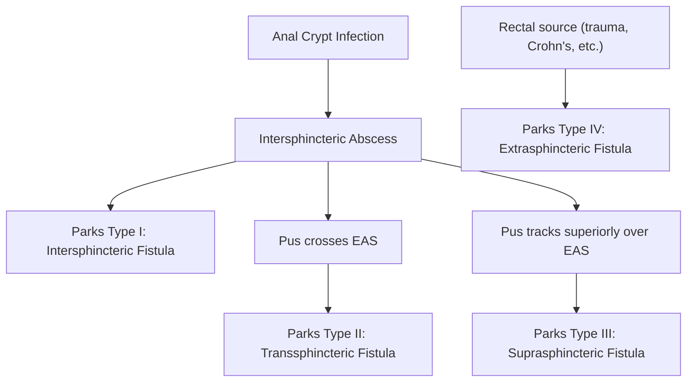

## 1. Definition

Let's get the terminology straight first — this trips people up.

- **Fistula** = an abnormal connection between **two epithelial (or epithelialised) surfaces**. The word comes from Latin *fistula* = "pipe" or "tube." So it's a tube where there shouldn't be one.
- **Sinus** = a blind-ending tract from an epithelial surface into a cavity lined by granulation tissue (i.e., one opening only). Think of it as a dead-end alley.
- ***Anorectal fistula (fistula-in-ano)*** = an ***abnormal tract communicating the rectum or anal canal*** with the perianal skin [1]. It consists of an **internal opening** (usually in the anal canal near the dentate line) and an **external opening** (on the perianal skin), connected by a tract lined with granulation tissue [2][3].

Crucially, anorectal fistula represents the **chronic phase** of the perirectal suppurative process. The acute phase is the **anorectal abscess**. When an abscess ruptures or is surgically drained, the track may persist and epithelialise → fistula [2][3].

<Callout title="Key Conceptual Link">
Anorectal abscess = acute phase. Anorectal fistula = chronic phase. Same disease process — cryptoglandular infection — at different time points.
</Callout>

---

## 2. Epidemiology

- **Incidence**: ~1–2 per 10,000 population per year in Western data. In Hong Kong, anorectal fistulae are a common colorectal outpatient presentation.
- **Age**: Peak incidence **30–50 years** (working-age adults) [2].
- **Sex**: **Male predominance** (M:F ≈ 2–3:1). This is thought to relate to the greater number and density of anal glands in males and possibly hormonal influences on gland activity.
- **Preceding abscess**: Approximately **30–50%** of patients who have an anorectal abscess will develop a subsequent fistula [3]. Conversely, **> 90% of fistulae** originate from a preceding cryptoglandular abscess [2].
- **IBD association**: In **Crohn's disease**, perianal fistulae occur in **~20–30%** of patients (higher in colonic and anorectal Crohn's). This is a major cause of morbidity [4].

---

## 3. Anatomy and Function

Understanding fistula anatomy requires mastering the **anal canal and its spaces**. Without this, classification and surgical planning make no sense.

### 3.1 Anal Canal

- **Surgical anal canal**: From anal verge to anorectal ring (~4 cm).
- **Dentate (pectinate) line**: Located ~2 cm from the anal verge. This is the watershed landmark:
  - **Above**: columnar epithelium, visceral nerve supply (painless), superior rectal artery, internal haemorrhoidal plexus, lymphatic drainage to internal iliac nodes.
  - **Below**: squamous epithelium, somatic nerve supply (painful!), inferior rectal artery, external haemorrhoidal plexus, lymphatic drainage to inguinal nodes.

### 3.2 Anal Glands and Crypts of Morgagni

- At the dentate line sit **6–14 anal columns (columns of Morgagni)** with intervening **crypts of Morgagni** (anal crypts).
- **Anal glands** (4–10 in number) open into these crypts. Their ducts penetrate through the **internal anal sphincter (IAS)** and terminate in the **intersphincteric plane** (between IAS and EAS).
- ***This is why the intersphincteric plane is "ground zero" for cryptoglandular infection*** — infection begins in the gland, spreads to the intersphincteric space, and then tracks along paths of least resistance [1][2].

### 3.3 Sphincter Complex

| Structure | Type | Innervation | Function |
|---|---|---|---|
| **Internal anal sphincter (IAS)** | Smooth muscle (continuation of circular muscle of rectum) | Autonomic (involuntary) | Maintains ~70–85% of resting anal tone |
| **External anal sphincter (EAS)** | Striated (skeletal) muscle | Pudendal nerve (S2–S4) (voluntary) | Voluntary squeeze, continence |
| **Puborectalis** | Striated muscle (part of levator ani) | Direct branches of S3–S4 | Maintains anorectal angle (~80°), key for continence |

<Callout title="Why Sphincter Anatomy Matters in Fistula Surgery" type="error">
Every fistula operation is a trade-off between **eradicating the fistula** and **preserving continence**. The more sphincter muscle you divide, the higher the risk of incontinence. This is why classifying fistulae by their relationship to the sphincter complex (Parks classification) is essential for surgical planning.
</Callout>

### 3.4 Perianal and Perirectal Spaces

Infection (and therefore fistula tracts) can spread through these spaces:

| Space | Location | Clinical Relevance |
|---|---|---|
| **Perianal space** | Surrounds anal verge, below skin | Most common abscess site clinically; superficial fistulae |
| **Intersphincteric space** | Between IAS and EAS | Origin of cryptoglandular infection; intersphincteric fistulae |
| **Ischiorectal (ischioanal) space** | Lateral to EAS, below levator ani | Large potential space; large abscesses can form; transsphincteric fistulae traverse this |
| **Supralevator space** | Above levator ani, below peritoneal reflection | Suprasphincteric and extrasphincteric fistulae; dangerous — must drain correctly |
| **Postanal (deep) space** | Behind anal canal, between EAS and coccyx | "Horseshoe" abscesses/fistulae communicate through this space |

---

## 4. Etiology

### 4.1 Cryptoglandular Infection (> 90%) [1][2][3]

This is the dominant cause. The mechanism:

1. **Obstruction** of an anal gland duct → stasis.
2. **Bacterial overgrowth** within the obstructed gland (mixed flora: *E. coli*, *Bacteroides*, *Enterococcus*).
3. **Abscess formation** in the intersphincteric space (this is the primary site because the gland terminates here).
4. Pus tracks along the **path of least resistance** — this determines the type of abscess and the subsequent fistula tract.
5. If the abscess drains (spontaneously or surgically) but the **internal opening persists** and the tract epithelialises → **fistula**.

***Why does the internal opening persist?*** Because the infected crypt continues to seed bacteria into the tract, preventing healing. This is the rationale for identifying and treating the internal opening in fistula surgery.

### 4.2 Other Causes

| Cause | Mechanism / Notes | HK Relevance |
|---|---|---|
| ***Crohn's disease*** | Transmural inflammation → penetrating disease → fistulae (enterocutaneous, perianal, rectovaginal). Fistulising phenotype in ~20% of CD [4]. | Increasing incidence of IBD in Hong Kong |
| ***Tuberculosis*** | Granulomatous infection can cause perianal abscess/fistula. Must exclude TB in any granuloma found on histology (especially in HK/endemic regions) [4]. | **High yield for HK** — TB is endemic |
| **Malignancy** | Rectal/anal canal carcinoma can present with or cause a fistula. Always consider in atypical/non-healing fistulae. | Biopsy any suspicious tissue |
| **Lymphogranuloma venereum (LGV)** | Chronic infection by *Chlamydia trachomatis* (L1–L3 serovars) → inflammatory perirectal mass, stricture, fistula [2]. | Consider in MSM population in HK |
| **Radiation proctitis** | Post-pelvic radiotherapy (cervical, prostate, rectal Ca) → ischaemic tissue damage → fistula [2]. | |
| **Actinomycosis** | *Actinomyces israelii* — rare cause of perianal fistula/mass, typically in immunocompromised [2]. | |
| **Foreign body / Trauma** | Mucosal laceration → abscess → fistula [1][2]. | Includes iatrogenic (post-surgical, post-sclerotherapy) |
| ***Surgery*** | Post-haemorrhoidectomy, post-lateral internal sphincterotomy [1]. | |

<Callout title="Exam Tip: FRIEND Mnemonic for Causes of Fistula" type="idea">
**F**oreign body, **R**adiation, **I**nflammation/Infection (Crohn's, TB, actinomycosis), **E**pithelialization, **N**eoplasm, **D**istal obstruction [3]. This mnemonic covers enterocutaneous fistulae broadly but is useful for anorectal fistulae too.
</Callout>

---

## 5. Pathophysiology

### 5.1 Cryptoglandular Theory (Parks' Theory) [1][2][3]

This is the cornerstone — understand it step-by-step:

```
Anal crypt gland obstruction
        ↓
Intersphincteric gland infection
        ↓
Intersphincteric abscess (primary)
        ↓
Pus tracks along path of least resistance
        ↓
Secondary abscess formation
(perianal / ischiorectal / supralevator)
        ↓
Spontaneous rupture or surgical drainage
        ↓
Persistent internal opening + granulation-lined tract
        ↓
FISTULA-IN-ANO
```

**Why does it become chronic?**
- The **internal opening** (at the infected crypt) continuously seeds bacteria.
- The tract becomes lined with **granulation tissue** and eventually partly **epithelialised**, preventing spontaneous closure.
- The ongoing faecal contamination from the anal canal keeps the inflammatory cycle going.

### 5.2 Crohn's Disease Pathophysiology

- **Transmural inflammation** is the hallmark of Crohn's — inflammation penetrates the full thickness of the bowel wall.
- This leads to **microperforations** and **abscess formation**, which then track to form fistulae.
- Crohn's fistulae are often **complex** (multiple tracts, horseshoe configurations, rectovaginal).
- ***Fistulising disease accounts for ~20% of Crohn's disease*** [3][4].

### 5.3 Why Some Abscesses Form Fistulae and Others Don't

- If the abscess is adequately drained AND the internal opening heals → no fistula.
- Pus culture showing **gut flora** (e.g., *E. coli*, *Bacteroides*) suggests communication with the anal canal lumen → higher likelihood of fistula formation [3].
- Pus culture showing **skin flora** (e.g., *Staphylococcus*) → less likely to form a fistula (infection was superficial) [3].

<Callout title="Clinical Pearl: Pus Culture Predicts Fistula">
After I&D of an anorectal abscess, always send pus for culture and sensitivity. **Gut flora = likely fistula** (will need follow-up). **Skin flora = reassurance** (unlikely to develop fistula) [3].
</Callout>

---

## 6. Classification

### 6.1 Parks Classification [1][2][3]

This is THE classification. It describes the fistula tract's relationship to the **external anal sphincter (EAS)**.

| Parks Type | Name | Frequency | Course | Description |
|---|---|---|---|---|
| ***Type I*** | ***Intersphincteric*** | **45%** | Between IAS and EAS | ***Originates from dentate line, travels along intersphincteric plane, opens at anal verge/perianal skin*** [1][2] |
| ***Type II*** | ***Transsphincteric*** | **30%** | Through EAS | ***Tracks through the EAS into the ischiorectal fossa, then to perianal skin*** [1][2] |
| ***Type III*** | ***Suprasphincteric*** | **20%** | Over the top of EAS | Tracks upward in intersphincteric plane, passes over puborectalis/top of EAS, descends through ischiorectal fossa to skin |
| ***Type IV*** | ***Extrasphincteric*** | **5%** | Outside the sphincter complex entirely | ***Primary opening in the rectum*** (above the sphincters), tracks through levator ani to perineal skin. Does NOT traverse the sphincter from inside out — the origin is rectal, not cryptoglandular [1][2] |

**Not included in Parks**: **Superficial fistula** — does not involve the sphincter at all (subcutaneous/submucosal tract). Easy to treat [3].



### 6.2 Simple vs Complex Classification [2][3]

This classification determines **surgical strategy** — simple fistulae can usually be laid open safely; complex ones cannot.

**Simple fistula:**
- Superficial fistula
- ***Intersphincteric (Type I)***
- ***Low transsphincteric (Type II) involving < 30% of EAS*** [2][3]

**Complex fistula:**
- ***High transsphincteric (Type II) involving ≥ 30% of EAS*** [2][3]
- ***Suprasphincteric (Type III)***
- ***Extrasphincteric (Type IV)***
- Horseshoe fistulas
- Multiple tracts
- Recurrent fistula
- ***Fistula associated with Crohn's disease*** [2][3]
- Fistula related to TB, HIV, radiation [2]
- ***Women with anterior fistulas / rectovaginal fistulas*** (thinner anterior sphincter in females → higher incontinence risk) [3]
- Patients with pre-existing anal incontinence [2]

<Callout title="Why Is Anterior Fistula in Women 'Complex'?" type="error">
Women have a shorter, thinner **anterior sphincter** compared to men (the perineal body is shorter). Dividing even a small portion of anterior EAS in a woman risks incontinence. That is why an anterior transsphincteric fistula in a woman is classified as complex, even if it involves < 30% of the sphincter.
</Callout>

### 6.3 High vs Low Classification

- **Low fistula**: Below the dentate line / involving minimal sphincter → can usually fistulotomy safely.
- **High fistula**: Above the sphincter complex or involving significant sphincter → need sphincter-sparing techniques.

---

## 7. Clinical Features

### 7.1 Symptoms

| Symptom | Pathophysiological Basis |
|---|---|
| ***Intermittent perianal discharge*** (purulent, serosanguinous, malodorous) | The fistula tract secretes inflammatory exudate and collects faecal material; intermittent because the external opening may periodically seal over then re-open when pressure builds [2][3] |
| ***Perianal pain*** (intermittent, worse with sitting, activity, defecation) | Inflammation and distension of the tract, especially when the external opening blocks and pus re-accumulates (forming a small abscess). Pain characteristically **improves when discharge occurs** (decompression of the abscess) [2] |
| ***Painful defecation*** | Stool passage stretches the inflamed anal canal and compresses the fistula tract [2] |
| **Perianal pruritus** (itching) | Chronic irritation of perianal skin by persistent discharge → contact dermatitis and maceration [2] |
| **Passage of flatus/faeces through external opening** | Suggests the internal opening communicates with the rectal lumen (higher fistula) rather than just the anal canal [3] |
| **Recurrent perianal abscess** | Classic history — patient keeps getting abscesses at the same site because the underlying fistula (with its persistent internal opening) is never addressed [3] |
| **Systemic symptoms** (fever, malaise) — if acute abscess | Acute sepsis from undrained pus collection |

<Callout title="Classic History">
"Doctor, I had an abscess drained 3 months ago, but it never completely healed. I keep getting discharge and occasional swelling in the same spot." → Think **fistula-in-ano**.
***Suspect anal fistula if an anorectal abscess persists after 6–12 weeks*** [3].
</Callout>

### 7.2 Signs

| Sign | Pathophysiological Basis |
|---|---|
| **External opening** on perianal skin | Visible as a small raised area of **granulation tissue** (red, slightly elevated papule) that may discharge pus or blood on gentle **manual compression** [2][3] |
| **Palpable cord-like, indurated tract** | The granulation-tissue-lined fistula tract is palpable as a firm subcutaneous cord running from the external opening towards the anal canal [3] |
| **Perianal skin excoriation and erythema** | Chronic maceration from persistent discharge [2] |
| **Internal opening** (on DRE/proctoscopy) | May feel as a small pit or area of induration at the dentate line. May exude pus on pressure. NOT always palpable [2] |
| **Multiple external openings** (in complex fistulae) | Suggests complex/branching fistula — think Crohn's disease, horseshoe fistula, or TB |
| **Perianal scarring** | Suggests recurrent disease or previous surgery |

### 7.3 Goodsall's Rule [3]

This is a clinical "rule of thumb" to predict the location of the **internal opening** based on the position of the **external opening**.

- Draw an imaginary **transverse line** across the anus (through the ischial spines/tuberosities).
- ***External opening ANTERIOR to the transverse line*** → fistula tracks in a **straight (radial) line** to the nearest crypt at the dentate line.
- ***External opening POSTERIOR to the transverse line*** → fistula follows a **curved track** to open at the **posterior midline** of the anal canal.

***Goodsall's rule has higher reliability when the external opening is within 3 cm of the anal verge*** [3]. Beyond 3 cm, the rule is less reliable (the tract is more likely to be complex).

**Why does this pattern occur?** The posterior midline is where the anal glands are most concentrated. Additionally, the posterior anal canal has a relatively avascular area (the "posterior commissure"), which provides a path of least resistance for infection to track through.

<Callout title="Goodsall's Rule — Exam Favourite" type="idea">
Anterior = straight. Posterior = curved to midline. Simple mnemonic: "**A**nterior = str**A**ight."
</Callout>

### 7.4 Associated Features to Assess

When evaluating a patient with a fistula, always look for features suggesting an **underlying cause**:

- **Crohn's disease**: multiple fistulae, skin tags ("elephant ear" tags), fissures away from the midline, oral ulcers, abdominal pain, diarrhoea, weight loss, perianal disease preceding intestinal disease.
- **TB**: chronic non-healing fistula, constitutional symptoms (night sweats, weight loss), granulomata on histology (caseating).
- **Malignancy**: hard, irregular edges of fistula, bloody discharge, weight loss, change in bowel habit.
- **HIV/immunosuppression**: unusual organisms, poor healing.

---

## 8. Pathophysiology–Clinical Feature Connections (Summary Table)

| Pathophysiology | → | Clinical Feature |
|---|---|---|
| Cryptoglandular infection → intersphincteric abscess → chronic tract | → | Persistent perianal discharge |
| External opening intermittently seals → pus re-accumulates | → | Cyclical pain relieved by discharge |
| Faecal contamination of tract via internal opening | → | Malodorous discharge, failure to heal |
| Chronic inflammation and maceration of perianal skin | → | Pruritus, excoriation, erythema |
| Granulation tissue at external opening | → | Visible papule/dimple that bleeds or discharges on compression |
| High fistula with internal opening at rectal level | → | Passage of flatus/faeces through external opening |
| Transmural Crohn's inflammation | → | Multiple complex fistulae, associated GI symptoms |

---

<Callout title="High Yield Summary">

1. **Anorectal fistula** = chronic phase of anorectal abscess; abnormal tract connecting anal canal/rectum to perianal skin.
2. **> 90% caused by cryptoglandular infection** — infection of anal glands at the dentate line → intersphincteric abscess → fistula.
3. **Other causes**: Crohn's disease (~20% fistulising), TB (important in HK), malignancy, radiation, LGV, actinomycosis, foreign body.
4. **Parks classification** (by relation to EAS): Type I Intersphincteric (45%), Type II Transsphincteric (30%), Type III Suprasphincteric (20%), Type IV Extrasphincteric (5%).
5. **Simple vs Complex** determines surgical approach: Simple = superficial, Type I, low Type II ( < 30% EAS). Complex = high Type II (≥ 30% EAS), Type III, Type IV, Crohn's, recurrent, multiple tracts, anterior in women.
6. **Goodsall's rule**: Anterior external opening → straight tract to nearest crypt. Posterior → curved to posterior midline. Reliable if external opening < 3 cm from anal verge.
7. **Classic presentation**: Intermittent perianal discharge + cyclical pain (worse when blocked, better when drains) + history of previous abscess.
8. **Pus culture after abscess I&D**: Gut flora = likely fistula; Skin flora = reassurance.
9. Always consider **underlying Crohn's disease, TB, or malignancy** in atypical or non-healing fistulae — especially in Hong Kong.

</Callout>

---

<ActiveRecallQuiz
  title="Active Recall - Anorectal Fistula: Definition to Clinical Features"
  items={[
    {
      question: "What is the cryptoglandular theory of anorectal fistula formation? Describe the step-by-step pathophysiology.",
      markscheme: "Obstruction of anal gland duct at crypt of Morgagni → gland infection → intersphincteric abscess (glands terminate in intersphincteric plane) → pus tracks along path of least resistance → abscess drains but internal opening persists → epithelialised tract forms = fistula. Ongoing faecal contamination from internal opening prevents healing.",
    },
    {
      question: "Name the four types in Parks classification of anal fistulae with their frequencies and briefly describe each tract course.",
      markscheme: "Type I Intersphincteric (45%): between IAS and EAS, opens at anal verge. Type II Transsphincteric (30%): through EAS into ischiorectal fossa. Type III Suprasphincteric (20%): up intersphincteric plane, over puborectalis/EAS, down through ischiorectal fossa. Type IV Extrasphincteric (5%): primary opening in rectum, through levator ani, bypasses sphincters entirely.",
    },
    {
      question: "What distinguishes a simple from a complex anal fistula? Give at least 4 features of complex fistula.",
      markscheme: "Simple: superficial, intersphincteric, low transsphincteric involving less than 30% EAS. Complex: high transsphincteric (30% or more EAS), suprasphincteric, extrasphincteric, multiple tracts, Crohn's-associated, radiation-related, recurrent, anterior fistula in women, horseshoe, pre-existing incontinence.",
    },
    {
      question: "State Goodsall's rule and its reliability limitation.",
      markscheme: "External opening anterior to transverse anal line → straight radial tract to nearest crypt. External opening posterior to line → curved tract opening at posterior midline. More reliable when external opening is within 3 cm of anal verge.",
    },
    {
      question: "After incision and drainage of an anorectal abscess, how does pus culture help predict fistula formation?",
      markscheme: "Gut flora (E. coli, Bacteroides) on culture suggests communication with anal canal lumen → high likelihood of fistula → needs follow-up. Skin flora (Staphylococcus) suggests superficial infection → unlikely fistula → reassurance.",
    },
    {
      question: "A patient presents with multiple perianal fistulae, skin tags, and chronic diarrhoea. What underlying condition must you consider and why?",
      markscheme: "Crohn's disease. Transmural inflammation causes penetrating disease leading to fistulae. Crohn's fistulae are often complex with multiple tracts. Perianal disease occurs in 20-30% of Crohn's. Colonoscopy should be performed to confirm diagnosis.",
    },
  ]}
/>

---

## References

[1] Lecture slides: GC 179. Anal pain perianal lesions and sepsis.pdf (p49, p54)
[2] Senior notes: felixlai.md (Anorectal fistulas section, Anorectal abscess section)
[3] Senior notes: maxim.md (Anal fistula, Anorectal abscess sections)
[4] Lecture slides: Inflammatory bowel disease.pdf; Senior notes: felixlai.md (IBD section), maxim.md (Surgical procedures for CD)
