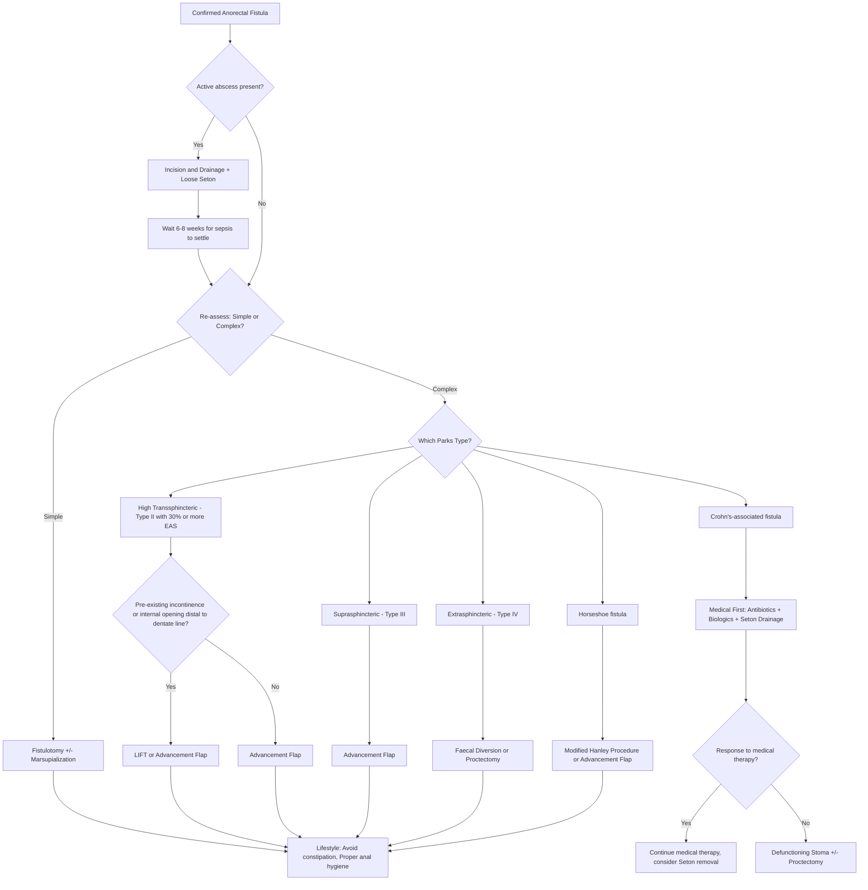

## Management of Anorectal Fistula

### Overarching Principles

Before we discuss specific procedures, let's establish the fundamental management philosophy. Every decision in fistula surgery revolves around **one tension**:

> ***Goal of surgery is to eradicate the fistula while preserving fecal continence*** [2].

This is the central trade-off. The more aggressively you divide sphincter muscle, the better the cure rate — but the higher the risk of incontinence. The more you try to preserve sphincter, the lower the cure rate — but incontinence is avoided. **Every treatment modality exists on this spectrum.**

Three pre-operative requirements must be met [2][3]:

1. ***Probing of the fistula is required before surgery to determine its anatomy*** [2] — this is done at EUA, not in clinic.
2. **Active sepsis must be controlled first** — if there is an undrained abscess, drain it before definitive fistula surgery. Operating on an inflamed, septic field increases recurrence and complication rates.
3. **Underlying disease must be addressed** — Crohn's fistulae are managed very differently from cryptoglandular ones (medical-first approach).

---

### Management Algorithm

---

### Treatment Modalities

#### A. Conservative / Supportive Measures

These are **adjunctive** — no fistula will heal with conservative measures alone (except some Crohn's fistulae with biologics), but they support surgical healing.

***Lifestyle modification*** [2]:
- ***Avoid constipation*** — hard stools traumatise the healing wound and internal opening. Use fibre supplementation, adequate fluid intake, stool softeners.
- ***Maintain proper anal hygiene*** — reduce bacterial load around the wound. Sitz baths (warm water soaks) after defecation promote wound cleanliness and comfort.

---

#### B. Surgical Treatment — Cryptoglandular Fistulae

##### 1. Fistulotomy (Laying Open)

***Fistulotomy/fistulectomy for simple low fistula*** [1].

**The principle**: If you can safely divide the tissue overlying the fistula tract without causing incontinence, you lay the tract open to heal from the base up (secondary intention healing). This is called "fistulotomy" — *fistula* + Greek *-tomē* = "cutting."

**Technique** [2][3]:
1. A **fistula probe** is inserted into the external opening and gently passed along the tract to the internal opening.
2. ***Most critical step is to identify and curette the internal opening to reduce the risk of recurrence*** [2] — remember, the internal opening is the source of ongoing cryptoglandular infection. If you don't eliminate it, the fistula recurs.
3. An incision is made over the entire length of the fistula using the probe as a guide → all overlying tissue (skin, subcutaneous tissue, and the involved portion of sphincter) is divided.
4. The tract is **gently curetted** to remove granulation tissue.
5. ***Marsupialization of tract is preferred as it may speed up wound healing*** [2] — the edges of the laid-open wound are sutured to the base with absorbable sutures, reducing the wound surface area and accelerating healing.
6. The wound is packed with gauze and covered with dressing → heals by **secondary intention**.

| Feature | Details |
|---|---|
| **Indication** | ***Simple fistula with low risk of incontinence*** [3]: superficial, intersphincteric (Type I), low transsphincteric (Type II) involving < 30% EAS |
| **Success rate** | ***Healing in > 90% of patients*** [2] |
| **Contraindications** | ***Contraindicated in patients with preexisting incontinence*** [2]. Complex fistulae (≥ 30% EAS, suprasphincteric, extrasphincteric). Women with anterior fistulae (thin anterior sphincter). Crohn's-associated fistulae (risk of poor healing). |
| ***Complication*** | ***Risk of incontinence should be informed*** [1]. ***Sphincter injury*** [3]. Recurrence (~2–8% for simple fistulae). |

<Callout title="Fistulotomy vs Fistulectomy">
**Fistulotomy** = laying open the tract (incision along the tract). **Fistulectomy** = excising the entire tract (cutting it out). Fistulotomy is preferred because fistulectomy creates a larger wound, takes longer to heal, and has the same cure rate. Fistulectomy may be useful when histological examination of the tract is needed (e.g., to exclude malignancy or Crohn's).
</Callout>

---

##### 2. Seton Techniques

A **seton** (from Latin *seta* = "bristle") is a thread, suture, or loop of material passed through the fistula tract. Setons serve different purposes depending on the type used.

###### a. Loose (Draining / Non-cutting) Seton

***Loose Seton for 6 weeks*** as a first-stage procedure + ***secondary sphincter-sparing procedure*** [3].

**Why use it?**
- ***Establish drainage and eradicate the septic focus*** [3] — the seton keeps the tract open, allowing continuous drainage of pus. This prevents re-accumulation of abscess.
- ***Preserve sphincter mechanism*** [3] — no muscle is divided.
- Acts as a **bridge** to definitive surgery once inflammation has settled.

**Technique**:
- ***Loose seton is usually inserted at EUA*** [3].
- ***Material: silastic vessel loop*** [3] — a soft, elastic tube that sits comfortably in the tract.
- The seton is threaded through the tract from external to internal opening and loosely tied. It is NOT tightened.
- Left in place for **~6 weeks** to allow the tract to mature and sepsis to resolve.

**Indications**:
- ***High risk of incontinence / complex fistula*** [3].
- Active sepsis with complex fistula — drain first, definitive surgery later.
- Crohn's-associated fistula (often left as a long-term draining seton if the patient is asymptomatic with the seton in place).

###### b. Cutting (Tight / Snug) Seton

**Principle**: The seton is progressively tightened at regular intervals → it slowly **cuts through** the sphincter muscle while **fibrosis occurs behind it** → the sphincter is divided gradually with simultaneous scarring, preserving some degree of continence [2][3].

- ***Cutting seton = elastic tightened regularly → slowly cut through the tract to cause scarring*** [3].
- Think of it like a cheese wire slowly cutting through a block — as it cuts forward, scar tissue forms behind it, maintaining structural support.

**Advantage**: Lower incontinence rate than single-stage fistulotomy for complex fistulae.
**Disadvantage**: Painful (each tightening causes discomfort), multiple clinic visits, still a risk of incontinence (~10–20%), largely falling out of favour in modern practice compared to sphincter-sparing techniques.

---

##### 3. Sphincter-Sparing Procedures

These are for ***complicated high fistula or transsphincteric fistula with significant amount of muscle involvement*** [1].

###### a. Endorectal Advancement Flap

***Endorectal advancement flap*** [1].

**Principle**: ***Close the internal opening by a mucosal flap → allow the fistula tract to heal and close*** [3]. By obliterating the internal opening (the source of infection), you remove the driver of the fistula without dividing any sphincter muscle.

**Technique**:
1. A flap of rectal mucosa, submucosa, and sometimes a small cuff of internal sphincter is raised above the internal opening.
2. The internal opening is curetted and closed.
3. The flap is advanced downward to cover the closed internal opening and sutured in place.
4. The external opening is left open to drain.

| Feature | Details |
|---|---|
| **Indication** | High transsphincteric fistula (without pre-existing incontinence), ***suprasphincteric fistula (Type III) — should be treated with endoanal advancement flaps*** [2] |
| **Success rate** | ~60–80% |
| **Advantage** | No sphincter division; good for Crohn's if tissue quality is adequate |
| **Limitation** | Requires healthy, non-inflamed rectal mucosa (poor results in active proctitis/Crohn's with rectal inflammation) |

###### b. LIFT — Ligation of Intersphincteric Fistula Tract

***Ligation of intersphincteric fistula tract (LIFT)*** [1].

**Principle**: The fistula tract passes through the intersphincteric space (between IAS and EAS) in transsphincteric fistulae. LIFT involves making an incision in the intersphincteric groove, identifying the tract as it crosses this space, **ligating (tying off) the tract on both sides**, and dividing it. This seals the internal opening side and allows the external tract to drain and collapse.

**Technique**:
1. Incision in the intersphincteric groove.
2. Identify the fistula tract in the intersphincteric plane.
3. Ligate the tract close to the internal opening.
4. Ligate the tract close to the external sphincter side.
5. Divide the tract between the two ligatures.
6. Curette the external component and leave it open for drainage.

| Feature | Details |
|---|---|
| **Indication** | Transsphincteric fistulae (Type II). Especially when the internal opening is distal to the dentate line or with pre-existing incontinence [3]. |
| **Contraindication** | ***Type III (suprasphincteric) — NOT treated by LIFT since there is no intersphincteric fistula tract*** [2] (the tract goes OVER the top of the sphincter, not through the intersphincteric space) |
| **Success rate** | ~60–75% |
| **Advantage** | Minimal pain, no sphincter division, outpatient procedure, short recovery |

<Callout title="Why Can't You LIFT a Suprasphincteric Fistula?" type="error">
The LIFT procedure works by intercepting the tract **in the intersphincteric plane**. A suprasphincteric fistula (Type III) travels **upward** in the intersphincteric plane, then **over the top** of the puborectalis/EAS, and descends through the ischiorectal fossa — it doesn't cross the intersphincteric space at the level where LIFT is performed. There is no intersphincteric tract to ligate. Use an **advancement flap** instead [2].
</Callout>

###### c. Anal Fistula Plug

***Anal fistula plug*** [1].

**Principle**: A bioabsorbable plug (made of porcine small intestinal submucosa or synthetic material) is inserted into the fistula tract from the internal opening. It acts as a scaffold for tissue ingrowth, occluding the internal opening and allowing the tract to close.

| Feature | Details |
|---|---|
| **Indication** | Transsphincteric or complex fistulae as an alternative to advancement flap/LIFT |
| **Success rate** | Variable (~30–60%) — lower than fistulotomy or advancement flap |
| **Advantage** | No sphincter division, minimal morbidity, repeatable |
| **Limitation** | High plug extrusion rate, lower success compared to LIFT/advancement flap |

###### d. Fibrin Sealant

***Fibrin sealant*** [3].

**Principle**: Fibrin glue is injected into the fistula tract to obliterate it. The glue solidifies and acts as a matrix for tissue ingrowth.

| Feature | Details |
|---|---|
| **Success rate** | Low (~15–40%) |
| **Advantage** | Minimally invasive, no sphincter risk, can be repeated |
| **Limitation** | Poor long-term results; best considered as an adjunct or for patients who refuse more invasive surgery |

###### e. Modified Hanley Procedure

***Modified Hanley procedure: horseshoe fistulas*** [3].

**Principle**: Horseshoe fistulae have a primary tract (usually posterior midline) with extensions through the deep postanal space into both ischiorectal fossae. The Modified Hanley procedure involves:
1. Laying open the deep postanal space (posterior midline) to address the primary tract and internal opening.
2. Counter-incisions over each ischiorectal fossa extension for drainage.
3. The posterior midline component is laid open; the lateral extensions are drained and allowed to heal by secondary intention.

---

##### 4. Newer / Emerging Treatment Modalities

***Other treatment modalities*** from the lecture slides [1]:

| Modality | Principle |
|---|---|
| ***Video-assisted anal fistula treatment (VAAFT)*** | A fistuloscope (small endoscope) is inserted through the external opening to visualise the entire tract. The tract is cauterised/ablated under direct vision. The internal opening is then closed with a stapler or suture. **Advantage**: direct visualisation, identifies secondary tracts missed by MRI. |
| ***FiLaC (Fistula tract Laser Closure)*** | A radial-emitting laser fibre is introduced into the tract and fired as it is slowly withdrawn → destroys the epithelial lining of the tract, promoting collapse and closure. **Advantage**: sphincter-sparing, minimally invasive. |
| ***Permacol paste injection*** | Injection of a collagen-based paste (derived from porcine dermis) into the tract to obliterate it. Acts as a scaffold for tissue ingrowth. |
| ***Stem cell treatment*** | Injection of mesenchymal stem cells (e.g., darvadstrocel/Alofisel — adipose-derived stem cells) into the fistula tract. **Mechanism**: stem cells promote local immunomodulation and tissue repair. **Indication**: primarily studied in **Crohn's perianal fistulae** refractory to conventional therapy. EMA-approved (2018) for complex perianal fistulae in Crohn's disease. |

---

#### C. Management by Parks Classification — Summary Table

| Parks Type | Designation | Surgical Approach |
|---|---|---|
| Superficial | Simple | Fistulotomy |
| ***Type I — Intersphincteric*** | Simple | ***Fistulotomy*** [1][2] |
| ***Type II — Low transsphincteric ( < 30% EAS)*** | Simple | ***Fistulotomy*** [1][2] |
| ***Type II — High transsphincteric (≥ 30% EAS)*** | Complex | ***Seton (staged) → LIFT or Advancement flap*** [1][2][3] |
| ***Type III — Suprasphincteric*** | Complex | ***Advancement flap*** (NOT LIFT — no intersphincteric tract) [2] |
| ***Type IV — Extrasphincteric*** | Complex | ***Faecal diversion or proctectomy*** [2][3] |
| Horseshoe | Complex | ***Modified Hanley procedure or advancement flap*** [3] |

---

#### D. Management of Perianal Crohn's Disease Fistulae

Crohn's perianal fistulae are a **special category** — the approach is fundamentally **medical-first**, with surgery playing a supportive/drainage role [5][8][9].

***Perianal CD management*** [8][9]:

**Step 1: Control Infection**
- ***Metronidazole/ciprofloxacin for infection control*** [9]
  - **Why antibiotics?** Reduce the bacterial load driving the inflammatory process. Metronidazole and ciprofloxacin penetrate well into pelvic/perianal tissue. Used as bridge therapy until immunomodulators/biologics take effect.
  - From CD medical notes: ***Antibiotics are indicated in perianal diseases such as fistula*** [10].

**Step 2: Drain Any Abscess**
- ***Abscess — simple drainage*** [9]
  - I&D under GA. Do NOT perform definitive fistula surgery at this stage — tissue is inflamed, anatomy distorted.

**Step 3: Manage the Fistula Based on Complexity**
- ***Simple fistula — fistulotomy*** [9]
- ***Complex fistula*** [9]:
  - ***Seton insertion for drainage*** — loose seton to control sepsis and maintain drainage.
  - ***Azathioprine*** — immunomodulator to reduce Crohn's inflammation [8][9].
  - ***Biologics*** — ***Anti-TNF +/- AZA and/or seton drainage*** [8]. Give ***biologics after drainage of pus to close the fistula tract*** [5].
    - **Why biologics after drainage?** If you give biologics (which suppress immune response) while there is an undrained abscess, you risk uncontrolled sepsis. Drain first → control sepsis → then introduce biologics to promote fistula closure.
    - ***Must screen for TB with CXR/QuantiFERON-TB Gold + HBV with HBsAg*** before starting anti-TNF [10].
  - ***Colostomy or proctectomy*** — if all else fails [9].
    - ***If failed, consider surgery (defunctioning stoma ± proctectomy)*** [5].

**Enterocutaneous Fistula in Crohn's** — uses the **SNAP** principle [2][10]:
- ***Sepsis control***: Antibiotics + abscess drainage [11]
- ***Nutrition support***: High vs low output assessment, TPN aids closure [11]
- ***Anatomy***: CTE or MRE to delineate anatomy [11]
- ***Procedure***: Medication adjustment, closure with biological agents, en-bloc resection of involved bowel and fistula [11]

<Callout title="SNAP Mnemonic for Fistula Management in Crohn's" type="idea">
**S**epsis control → **N**utrition support → **A**natomy delineation → **P**rocedure (medical or surgical closure). This applies to enterocutaneous fistulae but the principle of "drain first, nourish, image, then treat" is universal.
</Callout>

---

#### E. Management of Anorectal Abscess (Acute Phase)

Since abscess and fistula are the same disease at different time points, managing the abscess correctly can prevent or set up proper management of the subsequent fistula.

***Treatment of anorectal abscess*** [1][4]:
- ***Incision and drainage of abscess*** [1]
- ***Little role for antibiotics except in patients with severe cellulitis, valvular heart disease, prosthetic heart valves, and immunosuppression*** [1]
- ***? Primary fistulotomy*** [1] — if a fistula is clearly identified at the time of abscess drainage (e.g., probe passes easily from abscess to internal opening), some surgeons will perform a primary fistulotomy at the same sitting. This is controversial and typically only done for **simple, low fistulae** with clearly identified anatomy.
- **Drainage approach by site** [4]:
  - Perianal abscess: skin incision close to the anal verge.
  - Ischiorectal abscess: buttock skin incision → drain as close to sphincter complex as possible to minimise the length of a potential fistula tract.
  - ***Intersphincteric abscess: rectal incision (internal sphincterotomy) → drain transanally to avoid creating an extrasphincteric fistula*** [4].

<Callout title="Why Drain Intersphincteric Abscess Transanally?" type="error">
If you drain an intersphincteric abscess through the **perianal skin** (externally), the drainage tract would have to cross the entire external sphincter from inside to outside → you have iatrogenically created a **transsphincteric or extrasphincteric fistula**. By draining it **transanally** (through the rectal wall into the intersphincteric space), the drainage path stays within the intersphincteric plane — no sphincter is crossed [4].
</Callout>

---

### Comprehensive Summary: Treatment Selection Decision Table

| Scenario | First-Line Treatment | Key Consideration |
|---|---|---|
| **Simple fistula, no incontinence risk** | Fistulotomy +/- marsupialization | > 90% cure rate |
| **Complex fistula with active sepsis** | Loose seton for 6 weeks → staged sphincter-sparing procedure | Must control sepsis before definitive surgery |
| **High transsphincteric, no incontinence** | Advancement flap | Requires healthy rectal mucosa |
| **High transsphincteric, pre-existing incontinence** | LIFT or advancement flap | Avoid any further sphincter compromise |
| **Suprasphincteric (Type III)** | Advancement flap | NOT LIFT — no intersphincteric tract |
| **Extrasphincteric (Type IV)** | Faecal diversion or proctectomy | Usually not cryptoglandular; think Crohn's/iatrogenic |
| **Horseshoe fistula** | Modified Hanley procedure | Address posterior midline primary tract + lateral extensions |
| **Crohn's simple fistula** | Fistulotomy (after sepsis control) | Medical therapy adjunct |
| **Crohn's complex fistula** | Seton + azathioprine + anti-TNF | Biologics AFTER drainage; screen for TB/HBV first |
| **Crohn's refractory** | Defunctioning stoma ± proctectomy | Last resort |

---

<Callout title="High Yield Summary">

1. ***Goal: eradicate fistula while preserving faecal continence*** — every surgical choice reflects this trade-off.
2. **Simple fistula → Fistulotomy** ( > 90% cure). Contraindicated with pre-existing incontinence.
3. ***Risk of incontinence should be informed*** before any fistula surgery.
4. **Complex fistula → Staged approach**: Loose seton first (6 weeks, drainage, sepsis control) → then sphincter-sparing procedure.
5. ***Sphincter-sparing options***: Advancement flap, ***LIFT***, fistula plug, fibrin sealant, ***cutting seton***, ***Modified Hanley*** (horseshoe).
6. ***LIFT cannot be used for suprasphincteric (Type III) fistulae*** — no intersphincteric tract exists. Use advancement flap instead.
7. ***Extrasphincteric (Type IV)*** fistulae are typically not cryptoglandular → usually Crohn's or iatrogenic → ***faecal diversion or proctectomy***.
8. ***Crohn's perianal fistula***: Medical-first approach — ***metronidazole/ciprofloxacin*** → drain abscess → seton → ***azathioprine + anti-TNF after pus drainage*** → defunctioning stoma/proctectomy if failed.
9. **SNAP** principle for enterocutaneous fistula: Sepsis → Nutrition → Anatomy → Procedure.
10. ***Newer modalities***: VAAFT, FiLaC, Permacol paste, stem cell therapy (darvadstrocel for Crohn's perianal fistulae).
11. **Most critical step in fistulotomy**: identify and curette the internal opening — failure to do so → recurrence.

</Callout>

---

<ActiveRecallQuiz
  title="Active Recall - Anorectal Fistula: Management"
  items={[
    {
      question: "What is the overarching goal of anorectal fistula surgery, and what is the first-line treatment for a simple fistula?",
      markscheme: "Goal: eradicate the fistula while preserving faecal continence. First-line for simple fistula: fistulotomy (laying open) with marsupialization. Success rate over 90%. Must identify and curette the internal opening to reduce recurrence.",
    },
    {
      question: "Why is LIFT contraindicated for suprasphincteric (Type III) fistulae?",
      markscheme: "LIFT works by ligating the fistula tract in the intersphincteric plane. A suprasphincteric fistula tracks upward in the intersphincteric plane then over the top of the EAS/puborectalis and descends through the ischiorectal fossa. There is no intersphincteric tract at the accessible surgical level to ligate. Advancement flap is used instead.",
    },
    {
      question: "Outline the step-wise management of complex perianal fistula in Crohn's disease as per the lecture slides.",
      markscheme: "Step 1: Metronidazole/ciprofloxacin for infection control. Step 2: Simple drainage of any abscess. Step 3: Seton insertion for drainage of complex fistula. Step 4: Azathioprine. Step 5: Biologics (anti-TNF) given after pus is drained. Step 6: If failed, colostomy or proctectomy. Must screen for TB and HBV before starting anti-TNF.",
    },
    {
      question: "A loose draining seton is placed in a complex fistula. What is its purpose, what material is used, and how long is it left in?",
      markscheme: "Purpose: establish drainage, eradicate septic focus, preserve sphincter mechanism, act as bridge to definitive sphincter-sparing surgery. Material: silastic vessel loop. Duration: approximately 6 weeks. Inserted at EUA. It is NOT tightened (unlike a cutting seton).",
    },
    {
      question: "Name four sphincter-sparing procedures for complex anorectal fistulae mentioned in the lecture slides.",
      markscheme: "1. Seton (staged procedure). 2. Endorectal advancement flap. 3. Anal fistula plug. 4. LIFT (Ligation of intersphincteric fistula tract). Also acceptable from slides: cutting seton, fibrin sealant, Modified Hanley procedure.",
    },
    {
      question: "Why must an intersphincteric abscess be drained transanally rather than through the perianal skin?",
      markscheme: "If drained through perianal skin externally, the drainage tract would cross the entire external sphincter, iatrogenically creating a transsphincteric or extrasphincteric fistula. Draining transanally via internal sphincterotomy keeps the drainage path within the intersphincteric plane, avoiding sphincter transgression.",
    },
  ]}
/>

---

## References

[1] Lecture slides: GC 179. Anal pain perianal lesions and sepsis.pdf (p53, p58, p60, p61)
[2] Senior notes: felixlai.md (Anorectal fistulas — Treatment section)
[3] Senior notes: maxim.md (Anal fistula — Definitive treatment section)
[4] Senior notes: maxim.md (Anorectal abscess — Management section)
[5] Senior notes: maxim.md (Surgical procedures for CD — Perianal CD section)
[8] Lecture slides: Inflammatory bowel disease.pdf (p45)
[9] Lecture slides: Inflammatory bowel disease.pdf (p48)
[10] Senior notes: felixlai.md (Crohn's disease — Treatment section, Antibiotics, Biologics)
[11] Lecture slides: Inflammatory bowel disease.pdf (p33, p34)
