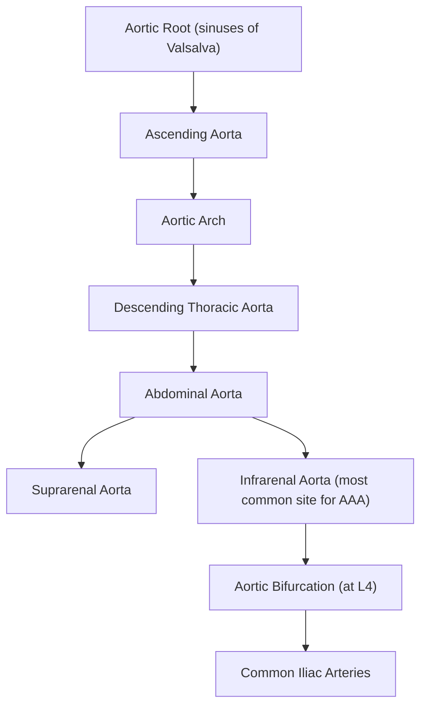
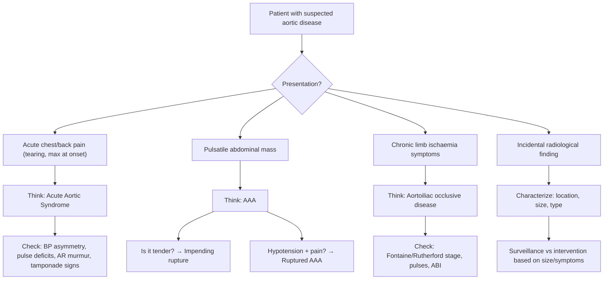

# Aortic Disease

## Definition and Overview

Aortic disease encompasses a broad spectrum of pathological conditions affecting the aorta — the largest artery in the body, responsible for distributing oxygenated blood from the left ventricle to the entire systemic circulation. The term covers:

- **Aortic aneurysms** (abdominal and thoracic): permanent, pathological, localized dilatation of the aorta by ≥50% of its normal diameter [1][2]
- **Acute aortic syndromes**: an umbrella term for acute, life-threatening conditions including ***aortic dissection***, ***intramural haematoma (IMH)***, and ***penetrating atherosclerotic ulcer (PAU)*** [3][4]
- **Aortic occlusive disease**: chronic atherosclerotic narrowing (e.g., Leriche syndrome)
- **Aortitis**: inflammatory conditions affecting the aortic wall (e.g., Takayasu arteritis, giant cell arteritis, syphilitic aortitis)
- **Congenital aortic anomalies**: e.g., coarctation of the aorta, bicuspid aortic valve-associated aortopathy
- **Traumatic aortic injury**: e.g., acute traumatic aortic injury (ATAI) from deceleration injuries

> "Aortic" → from Greek *aortē* (ἀορτή), meaning "that which is hung" — Hippocrates used this to describe the great vessel arising from the heart. "Aneurysm" → from Greek *aneurysma* (ἀνεύρυσμα), meaning "a widening." "Dissection" → from Latin *dissectio*, meaning "to cut apart."

---

## Epidemiology

### Abdominal Aortic Aneurysm (AAA)
- ***Prevalence: 1.7% in females and 5% in males with aortic diameter ≥3.0 cm by age 65*** [2]
- ***M > F*** (approximately 6-9:1) [1][5]
- Incidence increases sharply with age, peaking in the 7th-8th decade
- ***97% are infrarenal*** in location [2][5]
- ***95% are associated with atherosclerosis*** [1][5]
- ***20% have associated aneurysms elsewhere*** (e.g., iliac, popliteal, femoral) [2][5]
- AAA accounts for ~1-3% of all deaths in men aged 65-85 in developed countries
- In Hong Kong, AAA prevalence is lower than in Western populations but is increasing with an ageing population and rising cardiovascular risk factors

### Thoracic Aortic Aneurysm (TAA)
- Less common than AAA
- Ascending aorta is the most common site (~60%), followed by descending aorta (~35%) and aortic arch (~10%)
- More commonly associated with connective tissue diseases (Marfan syndrome, Loeys-Dietz syndrome) and bicuspid aortic valve

### Aortic Dissection
- ***Incidence: 2.6-3.5 per 100,000/year (~1 per day in whole of Hong Kong)*** [4]
- ***Increasing incidence in mainland China*** [4]
- ***Demographics: usually 60-80 years old, but can occur in the young if other risk factors present*** [4]
- ***M:F ≈ 2:1*** [4]
- ***Stanford Type A: 2/3 of cases; Type B: 1/3*** [4]

### Aortic Occlusive Disease
- Prevalence of peripheral arterial disease (PAD) is 3-10% overall, rising to 15-20% in those > 70 years
- In Hong Kong, the burden is significant given the high prevalence of smoking, diabetes, and hypertension

<Callout title="Hong Kong Context">
In Hong Kong, aortic disease is a growing concern. The ageing population, combined with high rates of hypertension, diabetes, smoking, and hyperlipidaemia, contributes to increasing incidence of both aneurysmal and occlusive aortic disease. The incidence of aortic dissection is approximately 1 case per day across the territory [4].
</Callout>

---

## Risk Factors

### For Aneurysmal Disease (AAA and TAA)

| Risk Factor | Mechanism |
|---|---|
| ***Age*** | Progressive degeneration of elastic fibres and collagen in aortic wall over time [1][5] |
| ***Male sex (M > F, ~6-9:1)*** | Hormonal factors (oestrogen may be protective — promotes elastin synthesis and inhibits MMP activity) [1][5] |
| ***Smoking*** | Most potent modifiable risk factor. Directly damages vascular endothelium, accelerates elastin degradation via ↑MMP activity, promotes inflammation [6] |
| ***Hypertension*** | Increases mechanical wall stress (Laplace's law: wall tension = pressure × radius / wall thickness) [1][5] |
| ***Hyperlipidaemia*** | Accelerates atherosclerosis, which weakens the aortic wall [6] |
| ***Family history*** | Genetic predisposition to ECM weakness — first-degree relatives have 15-25% risk [2] |
| ***Connective tissue diseases*** | ***Marfan syndrome*** (fibrillin-1 mutation → ↓elastic fibre integrity), ***Ehlers-Danlos syndrome type IV*** (collagen III mutation → vessel wall fragility) [1][2][5] |
| ***Infection (mycotic aneurysm)*** | ***Non-typhoid Salmonella*** (most common in Hong Kong!), ***Staphylococcus***, ***Syphilis*** → direct bacterial invasion of aortic wall → destruction → aneurysm formation [1] |
| ***Autoimmune/Inflammatory*** | Takayasu arteritis, giant cell arteritis, Behçet disease → chronic aortic wall inflammation → weakening |

<Callout title="Important: Diabetes is NOT a Risk Factor for AAA" type="error">
***Most cardiovascular risk factors are associated with AAA (smoking, HT, hyperlipidaemia) EXCEPT diabetes mellitus (unknown mechanism)*** [1]. This is a frequently tested exam point. The reasons are not fully understood, but hypotheses include: (1) metformin may inhibit MMP activity, (2) advanced glycation end-products may paradoxically stiffen the aortic wall, and (3) diabetes-associated microangiopathy of vasa vasorum may lead to fibrotic (rather than aneurysmal) remodelling.
</Callout>

### For Aortic Dissection

| Risk Factor | Mechanism |
|---|---|
| ***Coexisting HTN (76.6%)*** | Chronic haemodynamic stress damages intima and promotes medial degeneration; abrupt ↑BP can trigger the initial tear [3][4] |
| ***Connective tissue diseases*** | ***Marfan syndrome, Ehlers-Danlos syndrome, Loeys-Dietz syndrome, Turner syndrome*** — all cause structural weakness of the aortic media [3][4] |
| ***Bicuspid aortic valve*** | Associated with inherent aortopathy (cystic medial necrosis) independent of haemodynamic effects [4] |
| ***Cocaine use*** | Acute catecholamine surge → dramatic ↑BP → intimal tear [3] |
| ***Pregnancy and delivery*** | Hormonal changes (↑progesterone/oestrogen) alter connective tissue composition + hyperdynamic circulation → ↑wall stress [3][4] |
| ***Trauma*** | Catheter-related trauma, acceleration-deceleration injury [4] |
| ***Prior aortic diseases*** | Aortic aneurysm, coarctation, vasculitis [4] |
| ***Heavy weight lifting*** | Acute ↑intrathoracic pressure → ↑aortic wall stress [4] |
| ***Phaeochromocytoma*** | Catecholamine surges → hypertensive crises [3] |

### For Aortic Occlusive Disease (Atherosclerotic)

***Atherosclerotic occlusive disease risk factors*** [6]:
- ***Smoking*** — the single most important modifiable risk factor
- ***Diabetes mellitus*** — unlike AAA, DM is a major risk factor for occlusive disease
- ***Hypertension***
- ***Hyperlipidaemia***
- ***Family history***

<Callout title="Key Concept: Atherosclerosis is a Systemic Disease" type="idea">
***Atherosclerosis is a systemic disease*** [6]. A patient with aortic occlusive disease likely also has coronary artery disease, cerebrovascular disease, and/or renal artery stenosis. Always think of the whole vascular tree — this is why we check for concomitant aneurysms and assess all vascular territories.
</Callout>

---

## Anatomy and Function of the Aorta

Understanding aortic anatomy is essential for localizing disease and predicting complications.

### Gross Anatomy

The aorta can be divided into the following segments:

**Key branches:**
- **Aortic root**: Coronary arteries (left and right) arise from the sinuses of Valsalva
- **Aortic arch**: Brachiocephalic trunk → right subclavian + right common carotid; left common carotid artery; left subclavian artery
- **Descending thoracic aorta**: Intercostal arteries (supply spinal cord via artery of Adamkiewicz, typically T9-T12 on the left), bronchial arteries, oesophageal arteries
- **Abdominal aorta**: Coeliac trunk (T12), superior mesenteric artery (L1), renal arteries (L1-L2), inferior mesenteric artery (L3), lumbar arteries, gonadal arteries

### Histology — Why the Aorta is Special

The aortic wall has three layers, and understanding each layer explains why aortic disease occurs:

| Layer | Structure | Function | Relevance to Disease |
|---|---|---|---|
| **Tunica intima** | Single layer of endothelium + subendothelial connective tissue | Smooth blood flow, permeability barrier | Site of atherosclerotic plaque formation; site of intimal tear in dissection |
| **Tunica media** | ***Elastic fibres + smooth muscle cells + collagen in extracellular matrix*** | Provides elasticity ("Windkessel" function — stores energy during systole, releases during diastole to maintain diastolic BP) | ***Loss of elastin and smooth muscle cells, disruption of extracellular matrix*** → aneurysm formation [5]; medial degeneration (cystic medial necrosis) predisposes to dissection |
| **Tunica adventitia** | Collagen, vasa vasorum, nervi vasorum | Structural strength, nourishment of outer wall | ***Deposition of adventitial collagen, thickening, inflammatory infiltrate*** in aneurysmal disease [5]; vasa vasorum rupture → intramural haematoma |

**Vasa vasorum** ("vessels of vessels"): Small arteries within the adventitia and outer media that supply the outer aortic wall with oxygen and nutrients. The inner wall is nourished by direct diffusion from the lumen. In the abdominal aorta, vasa vasorum are less abundant than in the thoracic aorta — this partly explains why the infrarenal aorta is more susceptible to aneurysmal degeneration.

### Why is the Infrarenal Aorta the Most Common Site for AAA?

This is a classic exam question. Several factors converge:

1. **Fewer vasa vasorum** → the infrarenal aortic wall relies more on luminal diffusion → more susceptible to hypoxic injury and degeneration
2. **Fewer elastic lamellae** → the infrarenal aorta has ~28 elastic lamellae vs ~55-60 in the thoracic aorta → less structural resilience
3. **Haemodynamic factors** → reflected arterial waves from the aortic bifurcation create additional wall stress; turbulent flow at the bifurcation promotes atherosclerosis
4. **Atherosclerotic burden** → the infrarenal aorta is a site of predilection for atherosclerosis

### The Windkessel Function

The aorta is not just a passive conduit — it is an elastic reservoir. During systole, the aortic wall stretches to accommodate the stroke volume (storing elastic potential energy). During diastole, the aortic wall recoils, pushing blood forward and maintaining diastolic blood pressure. This is the "Windkessel" (German: "air chamber") function.

**Why does this matter?** Loss of aortic elasticity (due to ageing, atherosclerosis, or aneurysmal degeneration) → loss of Windkessel function → widened pulse pressure (high systolic, low diastolic BP) → increased cardiac afterload → LVH → heart failure. This is the pathophysiological basis of isolated systolic hypertension in the elderly.

---

## Aetiology and Pathophysiology

### A. Aortic Aneurysm

#### Pathophysiology of AAA — A Multifactorial Process [2][5]

***AAA is a multifactorial process*** involving:

1. ***Mechanical: degeneration, BP*** [5]
   - Chronic haemodynamic stress (Laplace's law) causes progressive dilatation
   - **Laplace's law**: Wall tension (T) = Pressure (P) × Radius (r) / Wall thickness (h)
   - As the aneurysm enlarges, wall tension increases → further dilatation → vicious cycle → eventually rupture when wall tension exceeds wall strength

2. ***Enhancement of proteolytic activity — elevated matrix metalloproteinases (MMPs)*** [2][5]
   - MMPs (especially MMP-2 and MMP-9) are zinc-dependent endopeptidases that degrade extracellular matrix proteins (elastin, collagen)
   - Inflammatory cells (macrophages, T-lymphocytes) infiltrate the aortic wall and release MMPs → dissolution of arterial wall ECM [2]
   - This is the **most important pathological mechanism** in AAA formation

3. ***Genetic: Marfan syndrome, Ehlers-Danlos type IV*** [2][5]
   - **Marfan syndrome**: Autosomal dominant mutation in FBN1 gene (chromosome 15) → defective fibrillin-1 → ↓structural integrity of elastic fibres + ↑TGF-β signalling → medial degeneration → aneurysm and dissection
   - **Ehlers-Danlos type IV**: Mutation in COL3A1 gene → defective type III collagen → vessel wall fragility → spontaneous arterial rupture/dissection

4. ***Autoimmune*** [5]
   - Inflammatory AAA (5-10% of cases): dense periaortic fibrosis with lymphocytic/plasmacytic infiltration → may represent an autoimmune response to atherosclerotic antigens in the aortic wall

5. ***Infection*** [5]
   - Mycotic aneurysm: bacterial seeding of the aortic wall
   - In Hong Kong, ***non-typhoid Salmonella*** is the most common cause of mycotic AAA — this is a **high-yield Hong Kong-specific point**
   - Other organisms: Staphylococcus aureus, Treponema pallidum (syphilis)

***Histopathological features of AAA*** [5]:
- ***Loss of elastin and smooth muscle cells***
- ***Disruption of extracellular matrix***
- ***Deposition of adventitial collagen***
- ***Thickening***
- ***Inflammatory infiltrate***

<Callout title="Laplace's Law — The Vicious Cycle of Aneurysm Expansion">
Wall Tension = (Pressure × Radius) / Wall Thickness

As an aneurysm grows:
- Radius ↑ → wall tension ↑
- Wall thickness ↓ (stretching) → wall tension ↑↑
- This creates a self-perpetuating cycle: larger aneurysms grow faster and are more likely to rupture
- This is why there is an exponential relationship between aneurysm size and annual rupture risk
</Callout>

#### Annual Rupture Risk by Size [1]

| ***Aneurysm Size*** | ***Annual Rupture Risk (%/year)*** |
|---|---|
| < 5.5 cm | < 1% |
| 5.5-5.9 cm | 5-10% |
| 6.0-6.9 cm | 10-20% |
| 7.0-7.9 cm | 20-30% |
| ≥ 8.0 cm | 30-50% |

This exponential increase in rupture risk is directly explained by Laplace's law.

### B. Acute Aortic Syndrome

***Acute aortic syndrome (AAS)***: a novel term coined in 2001 to describe a spectrum of acute aortic emergencies [3][4]:

| Entity | Definition | Pathophysiology |
|---|---|---|
| ***Aortic dissection*** | ***Tear in aortic intima, allowing blood to dissect into the media*** → creation of true and false lumens separated by an intimal flap [3] | Primary event uncertain: either spontaneous intimal tear from medial degeneration, OR primary haemorrhage in vasa vasorum → rupture into true lumen [4]. Blood dissects along the media → extends proximally and/or distally → may occlude branch vessels → may re-enter true lumen ("double-barreled aorta") → may rupture externally (haemothorax, tamponade) |
| ***Intramural haematoma (IMH)*** | ***Haematoma within the medial layer of the aortic wall WITHOUT intimal tear*** [3] | Due to rupture of vasa vasorum within the media → haematoma → weakens wall → may progress to frank dissection or rupture |
| ***Penetrating atherosclerotic ulcer (PAU)*** | ***Ulceration of an atheromatous plaque that penetrates the internal elastic lamina into the media*** [3] | Allows haematoma formation within the media → may lead to IMH, dissection, pseudoaneurysm, or rupture |

#### Pathogenesis of Aortic Dissection [4]

**Primary event** (uncertain which initiates):
1. ***Medial collagen and elastin degeneration → spontaneous tear in intima***
2. ***Primary haemorrhage in vasa vasorum into media → rupture into true lumen***
3. ***May be triggered by heavy weight lifting (↑stress on aorta)***

**Progression:**
- ***Tunica media splits into two layers → encloses false lumen → extends proximally and/or distally***
- ***May re-enter true lumen → double-barreled aorta***
- ***May rupture into left pleural space/pericardium → haemothorax or pericardial effusion***

**Cystic medial necrosis** (also called cystic medial degeneration): The histological hallmark of predisposition to dissection. Characterized by:
- Loss of smooth muscle cells in the media
- Fragmentation of elastic fibres
- Accumulation of mucoid (basophilic) ground substance
- This is the underlying medial pathology in Marfan syndrome, bicuspid aortic valve-associated aortopathy, and age-related degeneration

### C. Aortic Occlusive Disease

***Atherosclerotic occlusive disease*** is distinct from aneurysmal disease, though both share atherosclerotic risk factors [6]:

- **Atherosclerosis** → progressive lipid deposition, inflammation, smooth muscle proliferation, and fibrosis within the intima → luminal narrowing → reduced blood flow
- The aortic bifurcation and iliac arteries are common sites of stenosis/occlusion
- ***Acute occlusion*** (embolism, thrombosis, trauma) and ***chronic occlusion*** (atherosclerosis, vasculitis, entrapment) ***are distinct entities*** [6]

#### Leriche Syndrome [1]
A specific pattern of aortic occlusive disease: ***gradual occlusion of the terminal aorta***, causing:
- ***Absent femoral pulses***
- ***Intermittent claudication*** (buttock and thigh)
- ***Gluteal pain***
- ***Impotence*** (due to ↓blood flow to internal iliac arteries → ↓supply to penile arteries)

### D. Aortitis

**Inflammatory conditions affecting the aortic wall include:**

1. **Giant cell arteritis (GCA)** [8]: Granulomatous arteritis of the aorta and its major branches
   - Can cause thoracic aortic aneurysm/dissection, large artery stenosis
   - Most common primary vasculitis; predominantly elderly (> 50 years), F:M = 2:1
   
2. **Takayasu arteritis** [8]: Large vessel vasculitis causing stenosis of aorta and branches
   - Also known as "pulseless disease," "aortic arch syndrome"
   - Predominantly affects young females (10-40 years), especially Asians
   - Granulomatous inflammation → stenosis, occlusion, or aneurysm of aorta and branches

3. **Behçet disease** [8]: Systemic vasculitis that can affect arteries and veins of all sizes
   - More common along the ancient Silk Road (Turkey, Middle East, China)
   - Can cause aortic aneurysms and arterial/venous thrombosis

4. **Syphilitic aortitis**: Tertiary syphilis → obliterative endarteritis of vasa vasorum → ischaemic necrosis of aortic media → ascending aortic aneurysm + aortic regurgitation

5. **IgG4-related aortitis**: Part of IgG4-related disease spectrum → inflammatory aortopathy

### E. Congenital Aortic Anomalies

#### Coarctation of the Aorta [7]
- ***4-6% of CHD, incidence 4/10,000 live births, M > F ≈ 59:41%*** [7]
- ***Majority discrete narrowing of descending aorta at insertion of ductus arteriosus***
- ***Associations: hypoplasia of transverse aortic arch, VSD, bicuspid aortic valve, berry aneurysms*** [7]
- ***Cause: majority sporadic but associated with Turner syndrome*** [7]

**Pathophysiology:**
- ***Severe CoA: duct-dependent systemic circulation*** → RV supplies descending aorta via patent ductus arteriosus → duct closure → acute ↑LV pressure → ***acute HF with shock + renal failure*** [7]
- ***Less severe CoA: systolic HTN + LV pressure overload*** → compensatory LVH → ***enlargement of intercostal arteries as collaterals → rib notching*** on CXR [7]

### F. Traumatic Aortic Injury

***Acute traumatic aortic injury (ATAI)*** [9]:
- ***Cause: high-speed deceleration injury*** (e.g., motor vehicle accident, fall from height)
- ***80-90% die on the spot***
- ***Site: aortic isthmus (80-85%)*** — ***this is where the mobile part of the aorta meets the immobile part*** (fixed by the ligamentum arteriosum) [9]
- Less commonly: ascending aorta (< 10%)
- ***Nearly all associated with mediastinal haematoma*** → helps maintain partial integrity → maintains vital organ perfusion [9]
- ***Prognosis: highly lethal — 10-20% reach hospital, of which 30% die within 6h, 40-50% die within 24h, 90% die within 4 months if not repaired*** [9]

---

## Classification

### Classification of Aneurysms

#### By Form [2]
| Type | Description |
|---|---|
| ***Fusiform*** | Circumferential dilatation (more common) — the entire circumference is involved |
| ***Saccular*** | Only involves part of the circumference — like an outpouching |

#### By Structure [2]
| Type | Description |
|---|---|
| ***True aneurysm*** | ***Wall is formed by all 3 layers of the vessel (intima, media, adventitia)*** — attenuated but intact [1][2] |
| ***False (pseudo) aneurysm*** | ***Damage to blood vessel → extravasated blood lined by connective tissue*** — essentially a ***pulsating haematoma in continuity with the lumen lined by a single layer of fibrous tissue*** [1][2] |

#### By Aetiology [2]
- Degenerative/atherosclerotic (most common)
- Connective tissue disease (Marfan, EDS)
- Inflammatory
- Infectious (mycotic)
- Traumatic
- Anastomotic (at surgical graft sites, AV fistulas)
- Syphilitic
- Congenital

#### By Location (AAA) [1]

| Location | Description |
|---|---|
| ***Infrarenal (95%)*** | Below the renal arteries — the vast majority |
| Juxtarenal | At the level of the renal arteries |
| Pararenal | Involving the renal arteries |
| Suprarenal | Above the renal arteries |

### Classification of Aortic Dissection

#### Stanford Classification (Most Commonly Used) [3][4]

| Type | Involvement | Frequency | Key Implications |
|---|---|---|---|
| ***Type A*** | ***Involves ascending aorta*** (regardless of where the tear originates) | ***2/3 (~80% per some sources)*** | **Surgical emergency** — ALL require urgent surgery |
| ***Type B*** | ***Spares ascending aorta*** (below left subclavian artery) | ***1/3 (~20%)*** | Usually managed medically unless complicated |

#### DeBakey Classification [3]

| Type | Description |
|---|---|
| ***Type I*** | Originates in ascending aorta and extends to descending aorta |
| ***Type II*** | Confined to ascending aorta only |
| ***Type IIIA*** | Originates distal to left subclavian, extends to above diaphragm |
| ***Type IIIB*** | Originates distal to left subclavian, extends below diaphragm |

DeBakey I and II = Stanford A; DeBakey IIIA and IIIB = Stanford B.

<Callout title="Stanford vs DeBakey — Which to Use?">
For clinical decision-making and exams, use the **Stanford classification** — it directly dictates management:
- **Type A** → ALL need **urgent surgery**
- **Type B** → usually **medical management** unless complicated
The DeBakey classification provides more anatomical detail but is less commonly used clinically.
</Callout>

### Classification of Chronic Limb Ischaemia [1]

| Fontaine | Rutherford | Description |
|---|---|---|
| ***Stage I*** | ***0*** | ***Asymptomatic*** |
| ***Stage IIA*** | ***1-2*** | ***Mild-moderate intermittent claudication (walk > 200m)*** |
| ***Stage IIB*** | ***3*** | ***Severe claudication (walk < 200m)*** |
| ***Stage III*** | ***4*** | ***Rest pain / nocturnal pain*** |
| ***Stage IV*** | ***5-6*** | ***Ulcer / gangrene (minor or major tissue loss)*** |

***Critical limb ischaemia***: rest pain / ulcer / gangrene + ankle SBP < 50 mmHg (in DM: toe pressure < 30 mmHg) [1]

---

## Clinical Features

### A. Abdominal Aortic Aneurysm (AAA)

#### Symptoms

| Symptom | Pathophysiological Basis |
|---|---|
| ***Asymptomatic (majority, ~60%)*** | The aneurysm slowly enlarges without compressing surrounding structures or compromising flow [1][2] |
| ***Abdominal / back / loin / groin pain*** | ***Due to compression on nerves and organs*** by the expanding aneurysm sac, or stretching of the aortic wall → activates nociceptors in the adventitia [1][2]. ***Indicates impending rupture!!*** [2] |
| ***Radicular pain in thigh and groin*** | ***Especially in distal aneurysms, due to nerve compression*** (lumbar plexus) [2] |
| ***Limb ischaemia (e.g., blue toe syndrome, trash foot)*** | ***Due to distal embolization of mural thrombus*** from within the aneurysm sac [1] |
| ***Massive GI bleeding*** | Aortoenteric fistula — the aneurysm erodes into the duodenum (usually the 3rd/4th part) → communication between aortic lumen and GI tract [1] |
| ***Haematuria*** | Aorto-ureteric fistula — erosion into the ureter [1] |
| ***High-output heart failure symptoms*** | Aortocaval fistula — erosion into the IVC → large left-to-right shunt → ↑venous return → high-output cardiac failure [1] |

***Concomitant aneurysms***: ***A patient with a femoral aneurysm has an 80% chance of having an AAA; a patient with a popliteal aneurysm has a 50% chance*** [1]

#### Signs — Physical Examination of AAA [1]

***Pulsatile and expansile mass (usually in the epigastrium)***:

| Finding | Significance |
|---|---|
| ***Pulsatile AND expansile*** | Distinguishes a true aneurysm from a mass overlying the aorta (which would be pulsatile but NOT expansile). An expansile mass expands in all directions with each systole — you can feel it pushing your hands apart. |
| ***Non-tender*** | Uncomplicated AAA is typically non-tender. **Tenderness = symptomatic = impending rupture — treat as emergency!** |
| ***Immobile, firm, smooth surface, fusiform/saccular*** | Characteristic features of the aneurysm sac [1] |
| ***Can get above = infrarenal*** | If you can palpate the superior border of the mass (i.e., get your hand between the costal margin and the mass), the aneurysm is infrarenal [1] |
| ***Can get below = no iliac involvement*** | If you can palpate the inferior border, the iliac arteries are not involved [1] |
| ***Measure transverse diameter*** | Clinically estimate size — though ultrasound is far more accurate [1] |
| ***Palpate for other aneurysms*** | Check femoral and popliteal arteries for concomitant aneurysms [1] |
| ***Femoral pulse and features of limb ischaemia*** | Assess for distal embolization [1] |

<Callout title="Pulsatile vs Expansile — Know the Difference!" type="error">
A common exam mistake: not all pulsatile abdominal masses are aneurysms. A mass sitting on top of the aorta (e.g., a pancreatic tumour) may transmit pulsation and feel pulsatile — but it will NOT be expansile (i.e., it won't push your hands apart in both directions). A true AAA is both pulsatile AND expansile.
</Callout>

#### Ruptured AAA — The Classic Triad [2]

***The classical triad of ruptured AAA:***
1. ***Severe abdominal and/or back pain*** — sudden onset, excruciating
2. ***Hypotension*** — haemorrhagic shock
3. ***Pulsatile abdominal mass***

> **Only 30-50% of patients present with the complete triad.** Many patients are misdiagnosed initially — ***AAA can mimic a variety of diseases (30% misdiagnosed)*** [2]. Think of it in any elderly male with sudden abdominal/back pain and haemodynamic instability.

**Types of rupture:**
- **Posterior (retroperitoneal)**: Most common. The retroperitoneum may temporarily tamponade the bleeding → the patient may present with transient haemodynamic stability ("contained rupture") before decompensation
- **Anterior (intraperitoneal)**: Free rupture into the peritoneal cavity → rapid exsanguination → usually fatal before reaching hospital

### B. Thoracic Aortic Aneurysm (TAA)

#### Symptoms

| Symptom | Pathophysiological Basis |
|---|---|
| Asymptomatic (most common) | Incidental finding on imaging |
| Chest or back pain | Stretching of aortic wall, compression of adjacent structures |
| Hoarseness | ***Compression of the recurrent laryngeal nerve (RLN) by thoracic aortic aneurysm*** [2] — the left RLN hooks around the aortic arch, making it vulnerable |
| Dysphagia (dysphagia aortica) | Compression of the oesophagus |
| Stridor / cough / dyspnoea | Compression of the trachea or left main bronchus |
| Superior vena cava syndrome | Compression of the SVC (rare) |
| Haemoptysis | Erosion into the tracheobronchial tree (aortobronchial fistula) — often a "sentinel bleed" before massive fatal haemoptysis |

#### Signs
- Pulsatile mass in the suprasternal notch (ascending aortic aneurysm)
- Aortic regurgitation murmur (if ascending aortic or aortic root dilatation → annular dilatation → AR)
- Tracheal deviation
- Signs of SVC obstruction (facial plethora, distended neck veins)

### C. Aortic Dissection

#### Symptoms [3][4]

| Symptom | Pathophysiological Basis |
|---|---|
| ***Pain (> 90%): sudden, severe, sharp, tearing pain which is MAX AT ONSET*** | Acute tearing of the intima → blood dissects into the media → immediate severe pain. The "max at onset" character distinguishes it from ACS (which builds up gradually). ***Ascending aorta → anterior chest (± radiating to back); Descending aorta → interscapular region to abdomen*** [4] |
| ***Congestive HF symptoms (SOB, orthopnoea)*** | ***Due to acute aortic regurgitation*** — dissection extends proximally to the aortic root → disrupts aortic valve coaptation → acute AR → acute LV volume overload → pulmonary oedema [4] |
| ***Syncope*** | Hypotension from tamponade, severe AR, or carotid artery involvement |
| ***Neurological symptoms (stroke, paraplegia)*** | ***Carotids → syncope, CVA*** [4]; ***Spinal → paraplegia*** (occlusion of spinal arteries, especially the artery of Adamkiewicz) [4] |
| ***Acute abdominal pain*** | ***Coeliac or SMA → mesenteric infarct with acute abdomen*** [4] |
| ***Oliguria/anuria*** | ***Renal → renal failure*** [4] |
| ***Limb pain/weakness*** | ***External iliac → acute ischaemic limb*** [4] |
| ***Chest pain mimicking MI*** | ***Coronaries → MI*** [4] — Type A dissection can occlude the coronary ostia (usually the right coronary artery) |
| ***Asymptomatic*** | ***Can be asymptomatic if chronic*** [4] |

#### Signs [3][4]

| Sign | Pathophysiological Basis |
|---|---|
| ***BP: ↑ (concomitant HTN) or ↓ (tamponade, dissection into brachiocephalics)*** | Most patients are hypertensive (underlying HTN is the main risk factor). Hypotension suggests rupture into pericardium (tamponade) or dissection occluding the brachiocephalic/subclavian arteries [4] |
| ***Asymmetric BP & pulse between arms*** | Dissection occluding or compressing one subclavian artery → BP differential > 20 mmHg between arms [3] |
| ***Radial-radial delay*** | ***For Type A*** — dissection involves the arch/brachiocephalic artery → different path lengths for pulse transmission [3] |
| ***Radial-femoral delay*** | ***For Type B*** — dissection extends distally → differential involvement of upper and lower limb arteries [3] |
| ***Pulse deficits*** | ***Radial pulse rate < auscultation pulse rate*** — some pulses are too weak to palpate peripherally [4] |
| ***Signs of AR: early diastolic murmur*** | Proximal extension disrupts aortic valve → acute AR [4] |
| ***Signs of cardiac tamponade*** (Beck's triad: hypotension, distended neck veins, muffled heart sounds) | Rupture of the aortic root/ascending aorta into the pericardial space → pericardial effusion → compression of the heart → tamponade [4] |
| ***Neurological deficits*** | Stroke (hemiparesis), paraplegia (spinal cord ischaemia) [4] |
| ***Signs of acute limb ischaemia*** | 6 P's: Pain, Pulselessness, Pallor, Paraesthesia, Paralysis, Perishingly cold |

<Callout title="Aortic Dissection vs MI — Critical Distinction" type="error">
Aortic dissection can mimic acute MI (dissection flap occludes a coronary ostium, usually the RCA → inferior STEMI). If you give thrombolytics or anticoagulants to an aortic dissection patient, you will cause catastrophic haemorrhage. **Always consider aortic dissection in the differential of acute chest pain**, especially if:
- Pain is tearing, radiating to the back, max at onset
- There is asymmetric BP or pulse deficits
- There are signs of AR or tamponade
- CXR shows a widened mediastinum
</Callout>

### D. Chronic Limb Ischaemia (Aortoiliac Occlusive Disease)

#### Symptoms [1]

| Symptom | Pathophysiological Basis |
|---|---|
| ***Intermittent claudication*** | ***Reproducible pain of a defined group of muscles that is induced by exercise and relieved by rest*** — during exercise, metabolic demand of muscles exceeds the limited blood supply through stenosed arteries → anaerobic metabolism → lactic acid accumulation → pain [1] |
| ***Rest pain / nocturnal pain*** | ***Severe distal lower limb pain at rest, exacerbated by lying down / limb elevation, relieved by placing the leg in a dependent position*** — in critical ischaemia, even the basal metabolic needs of the tissue cannot be met. ***May wake patient from sleep*** because: (1) ***limb elevation*** in bed → ↓hydrostatic pressure → ↓perfusion, (2) ***reduced cardiac output*** during sleep, (3) ***relative skin vasodilation due to warmth of blankets*** → steals blood away from deep tissues [1] |
| ***Ulcer / gangrene*** | ***Initial: non-healing minor trauma*** → tissue cannot heal due to inadequate blood supply. ***Dry gangrene: uncomplicated, hard, shrunken, clear line of demarcation, may auto-amputate. Wet gangrene: complicated by infection, requires debridement*** [1] |

#### Signs
- **Absent/diminished pulses** (femoral, popliteal, dorsalis pedis, posterior tibial)
- **Bruits** over stenosed arteries (femoral, iliac)
- **Trophic changes**: hair loss, shiny skin, thickened nails, muscle wasting
- **Colour changes**: pallor on elevation (Buerger's test), rubor on dependency (reactive hyperaemia — maximally dilated arterioles fill with deoxygenated blood when gravity-assisted)
- **Temperature**: cool peripheries
- **Buerger's angle**: the angle at which the elevated limb becomes pale — < 20° suggests severe ischaemia

#### Vascular vs Neurogenic Claudication [1]

| Feature | ***Vascular Claudication*** | ***Neurogenic Claudication*** |
|---|---|---|
| ***Cause*** | ***Chronic limb ischaemia*** | ***Spinal stenosis*** |
| ***Radiation of pain*** | ***From distal to proximal*** | ***From proximal to distal*** |
| ***Exacerbating factor*** | ***Walking uphill, exercise*** | ***Walking downhill, increased lordosis*** |
| ***Relieving factor*** | ***Rest (standing still is sufficient)*** | ***Flexion of spine (e.g., leaning on shopping trolley), sitting*** |
| Walking distance | Fixed, reproducible | Variable |
| Pulses | Absent/diminished | Normal |

### E. Buerger's Disease (Thromboangiitis Obliterans) [2]

- ***Recurrent progressive inflammation of small/medium vessels of hands and feet*** [2]
- ***Usually young (30-40s) males*** who are ***smokers*** [2]
- ***Pathophysiology: unknown; histology shows acute inflammation of the wall with luminal thrombosis*** [2]
- ***Usually affects lower limbs > upper limbs*** [2]

**Clinical features:**
- ***Arterial occlusive disease: rest pain, digital ulcers, gangrene*** [2]
- ***Superficial thrombophlebitis*** [2]
- ***Raynaud's phenomenon*** [2]
- ***Angiogram: corkscrew appearance of arteries (vascular damage), tree root appearance of collaterals (vascular occlusion)*** [2]

### F. Coarctation of the Aorta [7]

#### Signs by Type

**Duct-dependent (severe CoA):**
- ***Weak lower limb pulses: only reliable sign before ductus closes*** [7]
- ***RV impulse (systemic circulation supported by RV)*** [7]
- ***Inaudible/soft ESM at LUSB*** [7]
- ***Collapse, shock, oliguria after ductal closure*** [7]

**Non-duct-dependent:**
- ***Weak lower limb pulse with radiofemoral delay*** [7]
- ***LV impulse (heaving apex)*** [7]
- ***ESM at LUSB radiating to left interscapular region*** [7]
- ***± Soft continuous murmur throughout chest in older children with well-developed collaterals*** [7]
- Upper limb hypertension with normal or low lower limb BP

### G. Associated Aortic Valve Disease

Aortic disease frequently coexists with aortic valve pathology:

#### Aortic Regurgitation (AR) from Aortic Root Disease [2][10]
- ***Causes of aortic root dilatation (supravalvular AR)***: ***hypertension, infection (syphilitic aortitis), inflammatory (ankylosing spondylitis), connective tissue disease (Marfan's, EDS)*** [10]
- ***Acute AR causes***: ***aortic dissection, infective endocarditis*** [10]
- ***Wide pulse pressure*** is the hallmark sign
- Various eponymous signs: Corrigan's pulse (collapsing pulse), De Musset's sign (head bobbing), Quincke's pulse (capillary pulsation), Traube's sign (pistol shots over femoral arteries), Duroziez's sign (to-and-fro femoral murmur)

#### Bicuspid Aortic Valve and Aortopathy
- Present in 1-2% of the population
- Associated with both aortic stenosis AND ascending aortic aneurysm/dissection
- The aortopathy is independent of haemodynamic effects — it is an intrinsic wall abnormality (cystic medial necrosis)

---

## Summary of Clinical Approach

<Callout title="High Yield Summary">

**Aortic Disease — Key Points:**

1. **AAA**: ≥3 cm infrarenal aortic dilatation; M > F (6-9:1); 95% associated with atherosclerosis; DM is NOT a risk factor; annual rupture risk escalates exponentially with size (Laplace's law); most are asymptomatic; classic triad of rupture = pain + hypotension + pulsatile mass (only present in 30-50%)

2. **Acute Aortic Syndrome**: Includes aortic dissection (intimal tear → dual lumen), IMH (vasa vasorum rupture, no intimal tear), and PAU (atherosclerotic ulcer penetrating media)

3. **Aortic Dissection Classification**: Stanford Type A (involves ascending aorta → ALL need surgery) vs Type B (spares ascending aorta → medical unless complicated). Pain is sudden, tearing, MAX AT ONSET, radiating to back

4. **Key Signs of Dissection**: Asymmetric BP/pulses, AR murmur, tamponade signs, neurological deficits, acute limb ischaemia

5. **Chronic Limb Ischaemia**: Fontaine staging (I-IV); critical limb ischaemia = rest pain/ulcer/gangrene + ankle SBP < 50 mmHg; distinguish vascular from neurogenic claudication

6. **Leriche Syndrome**: Terminal aortic occlusion → absent femoral pulses + claudication + impotence

7. **AAA Pathology**: Loss of elastin, smooth muscle, ECM disruption, ↑MMP activity, inflammatory infiltrate, adventitial collagen deposition

8. **Mycotic AAA in HK**: Think non-typhoid Salmonella first

9. **Coarctation**: Discrete narrowing at ductus; associated with Turner syndrome, bicuspid AV, berry aneurysms; radiofemoral delay + upper limb HTN

10. **ATAI**: Aortic isthmus (where mobile meets immobile); 80-90% die at scene; mediastinal haematoma on CXR/CT

</Callout>

---

<ActiveRecallQuiz
  title="Active Recall - Aortic Disease: Definition, Epidemiology, Risk Factors, Anatomy, Aetiology, Pathophysiology, Classification and Clinical Features"
  items={[
    {
      question: "What is the definition of an AAA and what is the normal diameter of the abdominal aorta? Why is the infrarenal aorta the most common site?",
      markscheme: "AAA = permanent dilatation of abdominal aorta >=3 cm (>=50% increase from normal 2-2.5 cm). Infrarenal most common (95%) because: (1) fewer vasa vasorum, (2) fewer elastic lamellae (~28 vs ~55-60 in thoracic), (3) reflected waves from aortic bifurcation increase wall stress, (4) predilection for atherosclerosis."
    },
    {
      question: "Name the three entities within Acute Aortic Syndrome and explain the key pathological difference between them.",
      markscheme: "1. Aortic dissection: intimal tear with blood dissecting into media creating true and false lumens. 2. Intramural haematoma (IMH): haematoma within media from rupture of vasa vasorum WITHOUT intimal tear. 3. Penetrating atherosclerotic ulcer (PAU): atherosclerotic ulcer penetrating internal elastic lamina into media. Key difference: dissection has an intimal flap/tear; IMH has no flap; PAU originates from a plaque."
    },
    {
      question: "How does pain character in aortic dissection differ from ACS? What specific pain features should raise suspicion for dissection?",
      markscheme: "Dissection: sudden onset, maximum intensity at onset, tearing/ripping quality, radiates to back. ACS: gradual onset, builds up over minutes, crushing/squeezing. Key differentiating features: max at onset (vs crescendo), tearing quality, radiation to back, associated BP asymmetry/pulse deficits."
    },
    {
      question: "Explain Laplace's law and how it creates a vicious cycle in aneurysm expansion. Why does a 7 cm AAA have a much higher rupture risk than a 4 cm AAA?",
      markscheme: "Laplace's law: Wall tension = (Pressure x Radius) / Wall thickness. As aneurysm grows: radius increases and wall thickness decreases (stretching) -> wall tension increases -> promotes further expansion -> larger aneurysms grow faster. Exponential increase: <5.5 cm = <1%/yr rupture risk vs 7.0-7.9 cm = 20-30%/yr."
    },
    {
      question: "A 70-year-old male smoker presents with sudden severe back pain, hypotension, and a pulsatile abdominal mass. What is the most likely diagnosis? Is this triad always present? What key cardiovascular risk factor is paradoxically NOT associated with AAA?",
      markscheme: "Ruptured AAA. Classic triad (pain + hypotension + pulsatile mass) only present in 30-50% of cases; 30% are misdiagnosed initially. Diabetes mellitus is NOT a risk factor for AAA (unlike other CV risk factors). Possible reasons: metformin inhibits MMPs, AGEs stiffen wall, microangiopathy leads to fibrosis rather than aneurysmal change."
    },
    {
      question: "Compare vascular claudication and neurogenic claudication in terms of pain radiation, exacerbating factors, and relieving factors.",
      markscheme: "Vascular: pain radiates distal to proximal, exacerbated by walking uphill/exercise, relieved by rest (standing still sufficient). Neurogenic: pain radiates proximal to distal, exacerbated by walking downhill/increased lordosis, relieved by spinal flexion (leaning forward/sitting). Vascular has absent pulses; neurogenic has normal pulses."
    }
  ]}
/>

## References

[1] Senior notes: Maksim Surgery Notes.pdf (Section 7.1 Aneurysm, p.160-166)
[2] Senior notes: Ryan Ho Cardiology.pdf (Section 4.5.2 Aortic Aneurysms, p.221-222; Section 4.4.3 Buerger's Disease, p.218)
[3] Senior notes: Maksim Medicine Notes.pdf (Section 1.4 Aortic Dissection, p.15)
[4] Senior notes: Ryan Ho Cardiology.pdf (Section 4.5.1 Aortic Dissection, p.219-221)
[5] Lecture slides: GC 199. Pulsating abdominal mass aortic aneurysm.pdf (p.4)
[6] Lecture slides: WCS 002 - Toe gangrene and leg ulcer - by Prof SWK Cheng.pdf (p.2)
[7] Senior notes: Ryan Ho Cardiology.pdf (Section 3.7.4 Coarctation of Aorta, p.190)
[8] Senior notes: Ryan Ho Rheumatology.pdf (Sections 3.6.1-3.6.4, p.95-98)
[9] Senior notes: Ryan Ho Radiology.pdf (Acute traumatic aortic injury, p.4)
[10] Senior notes: Maksim Medicine Notes.pdf (Section 1.8 Valvular Heart Disease - Aortic Regurgitation, p.35); Ryan Ho Cardiology.pdf (Section B. Aortic Valve Diseases, p.158-160)
