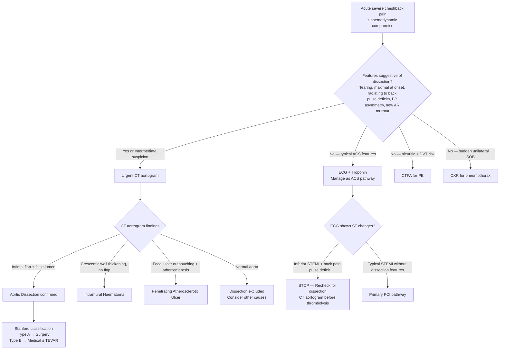

## Differential Diagnosis of Aortic Dissection

The reason differential diagnosis matters so much here is straightforward: aortic dissection is a **time-critical emergency** (~1–2% mortality per hour for Type A if untreated), and its presentation — acute severe chest/back pain ± haemodynamic compromise — overlaps significantly with several other life-threatening conditions. Getting the diagnosis wrong in either direction is dangerous: missing a dissection and giving thrombolytics for a "STEMI" can be fatal, and treating every chest pain as dissection delays management of other emergencies.

The differentials are best organised by the **dominant presenting feature** because dissection is a great mimic — it can present as chest pain, back pain, abdominal pain, stroke, syncope, acute limb ischaemia, or shock.

---

### 1. Differential Diagnosis Organised by Presenting Feature

#### 1A. Chest Pain Differentials

This is the most common presentation. The key differentials are the other **"Big 5" causes of acute life-threatening chest pain** [3][10][11]:

| Condition | Why It Mimics Dissection | Key Distinguishing Features |
|---|---|---|
| **Acute coronary syndrome (ACS)** | Severe central chest pain ± diaphoresis; dissection itself can cause MI via coronary malperfusion, creating a double-mimicry trap | ACS pain is **dull/crushing**, builds over minutes, rarely maximal at onset. ECG shows ST changes. Troponin rises serially. No pulse deficits, no inter-arm BP difference. **Danger**: dissection causing RCA occlusion → inferior STEMI pattern → if you give thrombolytics → catastrophic haemorrhage. Always consider dissection before thrombolysis in inferior STEMI with back pain or inter-arm BP difference |
| **Acute pulmonary embolism (PE)** | Sudden onset pleuritic chest pain ± dyspnoea ± haemodynamic collapse (massive PE) | PE pain is typically **pleuritic** (↑ with inspiration), associated with tachypnoea, tachycardia, and DVT signs. ECG may show S1Q3T3 / RV strain. CTPA shows filling defects in pulmonary arteries. D-dimer elevated. No pulse deficits or BP asymmetry |
| **Tension / massive pneumothorax** | Sudden onset unilateral chest pain ± dyspnoea ± hypotension (tension) | Unilateral absent breath sounds, hyper-resonant percussion, tracheal deviation (tension). CXR diagnostic. No pulse deficits |
| **Myopericarditis ± cardiac tamponade** | Chest pain ± pericardial effusion → tamponade (which dissection can also cause) | Pericarditis pain is **sharp, positional** (↑ sitting forward), pleuritic. ECG shows diffuse ST elevation with PR depression. Tamponade from pericarditis is usually subacute with gradual accumulation vs. dissection tamponade which is acute and fulminant |
| **Pneumonia** | Pleuritic chest pain ± fever ± dyspnoea | Productive cough, fever, consolidation signs (bronchial breathing, crackles). CXR shows consolidation. No BP/pulse asymmetry |

<Callout title="The Deadly Diagnostic Trap" type="error">
Aortic dissection can cause MI (coronary malperfusion). If the ECG shows an inferior STEMI and you reflexively give thrombolytics or load dual antiplatelets without considering dissection, the patient can exsanguinate. **Always think of dissection first** in any patient with acute chest pain PLUS: back pain, tearing quality, maximal at onset, pulse deficits, BP asymmetry, new AR murmur, or widened mediastinum on CXR. The mnemonic is: **before you open the coronaries, make sure the aorta is intact**.
</Callout>

#### 1B. Back / Abdominal Pain Differentials

When dissection presents predominantly as back or abdominal pain (especially Type B extending into the abdominal aorta):

| Condition | Why It Mimics Dissection | Key Distinguishing Features |
|---|---|---|
| ***Ruptured abdominal aortic aneurysm (AAA)*** | Severe abdominal/back pain + shock + pulsatile mass — overlaps with the abdominal extension of dissection | ***Ruptured AAA: triad of severe abdominal/back pain, pulsatile mass, hypotension*** [12]. Pulsatile expansile mass on examination. CT aortogram distinguishes: AAA shows aneurysmal dilatation ± retroperitoneal haematoma; dissection shows intimal flap and false lumen |
| **Acute pancreatitis** | Epigastric/back pain, can be severe and sudden | Relieved by leaning forward, associated with vomiting. ↑ Amylase/lipase. No pulse deficits |
| **Peptic ulcer perforation (PPU)** | Sudden severe epigastric pain radiating to back | Board-like rigidity, free air under diaphragm on erect CXR. No pulse deficits or BP asymmetry |
| **Renal colic** | Severe flank/back pain, can be sudden | Colicky nature, radiates to groin, haematuria. Non-contrast CT KUB shows stone |
| ***Aortic dissection presenting as acute abdomen*** | ***Tearing pain at epigastrium radiates to the back ± shock*** [13] | Must be distinguished from surgical causes of acute abdomen |

#### 1C. Neurological Differentials (Syncope / Stroke)

When dissection presents with neurological symptoms (carotid malperfusion → stroke; or hypotension → syncope):

| Condition | Why It Mimics Dissection | Key Distinguishing Features |
|---|---|---|
| **Primary ischaemic stroke** | Acute focal neurological deficits — dissection causing carotid occlusion produces the same deficits | Primary stroke: no chest/back pain, no pulse deficits, no BP asymmetry. CTA/MRA of head and neck can identify the dissection flap extending into the carotid |
| ***Cervical arterial dissection (carotid or vertebral)*** | ***Spontaneous or traumatic — ICA: retroorbital pain + Horner's syndrome; VA: occipital pain + vertebrobasilar symptoms. Ischaemia from arterial occlusion or embolism. Dissecting aneurysm can rupture intracranially causing SAH*** [14] | This is actually a form of dissection but confined to extracranial/intracranial cervical arteries rather than the aorta. Connective tissue disorders overlap. CTA/MRA of the neck differentiates |
| **Subarachnoid haemorrhage (SAH)** | "Thunderclap" headache — sudden and severe like dissection pain; cervical dissection can even cause SAH | SAH: headache is characteristically occipital/nuchal with meningism. CT brain shows blood in subarachnoid space. No chest pain or BP asymmetry (unless there is concurrent aortic dissection) |
| **Vasovagal / other syncope** | Syncope can be the presenting feature of dissection (via carotid malperfusion or tamponade) | Vasovagal: prodrome of nausea, diaphoresis, tunnel vision; triggered by prolonged standing. No focal neurology, no pain, no pulse deficits post-recovery |

#### 1D. Acute Limb Ischaemia Differentials

When dissection presents as an acutely ischaemic limb (iliac/subclavian malperfusion):

| Condition | Why It Mimics Dissection | Key Distinguishing Features |
|---|---|---|
| **Arterial embolism (cardiac source)** | Sudden onset 6Ps — identical clinical picture to limb malperfusion from dissection | Look for embolic source (AF, recent MI, valvular disease). Contralateral pulses present. No back/chest pain. CTA shows sharp arterial cut-off without intimal flap [2][3] |
| **Acute arterial thrombosis (in-situ)** | Acute limb ischaemia over hours-days | Previous claudication history, PVD in contralateral limb, present bruits. CTA shows irregular cut-off with collaterals [2] |
| **Phlegmasia cerulea dolens** | Massively swollen, cyanotic, painful limb — can be mistaken for arterial ischaemia | This is actually **massive ilio-femoral DVT** → venous congestion → secondary arterial compromise. Limb is swollen and blue (not pale and white). Duplex USG shows DVT [2] |

#### 1E. Shock Differentials

When dissection presents as undifferentiated shock:

| Condition | Why It Mimics Dissection | Key Distinguishing Features |
|---|---|---|
| **Cardiogenic shock (massive MI)** | Hypotension + pulmonary oedema — dissection can cause this via acute AR or coronary malperfusion | ECG: regional ST changes. Echo: RWMA with normal aortic root (vs. dissection: aortic root dilatation ± flap ± pericardial effusion) |
| **Cardiac tamponade (other causes)** | Beck's triad — dissection is one cause, but malignant pericardial effusion, uraemic pericarditis, post-cardiac surgery can also cause tamponade | Dissection tamponade: acute + associated with chest/back pain + widened mediastinum. Other tamponade: usually more insidious onset |
| **Massive PE** | Obstructive shock with ↑ JVP, hypotension | RV dilation on echo, CTPA shows filling defects. No intimal flap |
| **Haemorrhagic shock (GI bleed, ruptured ectopic, ruptured HCC)** | Hypotension + tachycardia | Usually identifiable bleeding source, no BP/pulse asymmetry [15] |

---

### 2. Other Acute Aortic Syndromes (Within-Spectrum Differentials)

These are not so much "differentials" as they are **part of the same clinical spectrum** — but they are managed somewhat differently and should be distinguished on imaging [1][3]:

| Entity | Key Imaging Distinction | Clinical Significance |
|---|---|---|
| **Intramural haematoma (IMH)** | Crescentic or circumferential thickening of the aortic wall (> 5 mm) on CT, **no intimal flap**, no false lumen with flow | Can progress to classical dissection (especially Type A IMH). Type A IMH → surgery; Type B IMH → medical ± surveillance |
| **Penetrating atherosclerotic ulcer (PAU)** | Focal contrast outpouching beyond the expected aortic lumen contour, **associated with extensive atherosclerotic calcification**, often in the descending aorta | Typically elderly patients with heavy atherosclerotic burden. Can progress to IMH, dissection, or pseudoaneurysm |
| **Limited dissection** | Limited intimal tear with eccentric bulge but no propagating haematoma | Can be managed conservatively with close surveillance |

---

### 3. Systematic Approach: Distinguishing Dissection from Its Mimics

The key clinical features that should **raise suspicion for aortic dissection** over its mimics are:

| Feature | Sensitivity | Specificity | Why It Points to Dissection |
|---|---|---|---|
| **Pain maximal at onset** | High | High | Mechanical tear is instantaneous — ACS pain builds, dissection pain starts maximal |
| **Tearing / ripping quality** | Moderate | Moderate–High | Medial layer being physically torn |
| **Radiation to back** | Moderate | Moderate | Descending aorta is a posterior mediastinal structure |
| **Migratory pain** | Moderate | High | Propagation of the dissection flap |
| **Inter-arm BP difference > 20 mmHg** | Moderate (~30%) | High | Unilateral subclavian compromise |
| **Pulse deficits** | Low–Moderate (~30%) | High | Branch vessel compromise by the flap |
| **New diastolic murmur (AR)** | Low–Moderate (~30–45%) | High | Root involvement → leaflet malcoaptation |
| **Widened mediastinum on CXR** | Moderate (60–90%) | Moderate | Expanding aorta / mediastinal haematoma |
| **Neurological deficits + chest pain** | Low | Very High | Stroke from carotid malperfusion + aortic pain — unusual combination in primary stroke |
| **Known Marfan / CTD** | Low | Very High in context | Intrinsic medial weakness → low threshold for dissection |

---

### 4. Diagnostic Algorithm for Differentiating Aortic Dissection from Key Mimics

<Callout title="Clinical Decision Point" type="error">
***Before thrombolysis or primary PCI for any STEMI — especially inferior STEMI — actively exclude aortic dissection.*** Check for: tearing pain, maximal at onset, back radiation, inter-arm BP difference, pulse deficits, widened mediastinum on CXR. If ANY of these are present, get a CT aortogram first. Thrombolysing a dissection can be fatal [3][10].
</Callout>

---

### 5. Summary Table: "At a Glance" Differentiation

| Feature | Aortic Dissection | ACS | PE | Pneumothorax | Pericarditis | Ruptured AAA |
|---|---|---|---|---|---|---|
| **Pain onset** | **Sudden, maximal at onset** | Gradual, builds | Sudden, pleuritic | Sudden | Gradual or sudden | Sudden |
| **Pain quality** | **Tearing / ripping** | Crushing / pressure | Sharp, pleuritic | Sharp, pleuritic | Sharp, positional | Tearing / severe |
| **Radiation** | **Back, interscapular** | Jaw, L arm | None specific | Shoulder tip | Shoulder, trapezius | Back, flank |
| **BP asymmetry / pulse deficit** | **Yes (~30%)** | No | No | No | No | No |
| **New AR murmur** | **Yes (Type A)** | No | No | No | Pericardial rub | No |
| **Widened mediastinum** | **Yes (60-90%)** | No | No | No | ± cardiomegaly | No |
| **Pulsatile mass** | No | No | No | No | No | **Yes** |
| **ECG** | Non-specific (may show MI) | ST changes | S1Q3T3, RV strain | Normal | Diffuse ST↑, PR↓ | Usually normal |
| **Key Ix** | **CT aortogram** | ECG + Troponin | CTPA | CXR | Echo | CT aortogram |

---

### 6. Special Consideration: Cervical Arterial Dissection

This deserves special mention because it is a form of dissection but involving the **cervical arteries** (internal carotid artery or vertebral artery) rather than the aorta, and it is a **key differential for young stroke** [14]:

- ***Spontaneous*** — often in patients with ***connective tissue disorders*** (Marfan, EDS, fibromuscular dysplasia)
- ***Traumatic*** — ***fall, sports, chiropractic manipulation*** [14]
- **ICA dissection**: ***retroorbital pain + Horner's syndrome*** (disruption of sympathetic fibres running along the ICA) ± ipsilateral stroke from occlusion/embolism [14]
- **Vertebral artery dissection**: ***occipital pain + vertebrobasilar symptoms*** (dizziness, diplopia, ataxia, dysarthria) [14]
- ***Dissecting aneurysm can rupture intracranially and cause SAH*** [14]
- Management: ***anticoagulation if no intracranial bleeding; endovascular or bypass surgery*** in selected cases [14]

> The mechanism of ischaemia in cervical dissection is twofold: (1) the false lumen expanding to occlude the true lumen (haemodynamic compromise), and (2) thrombus forming at the intimal tear site → embolism to distal cerebral vessels. The latter is actually more common than the former.

---

<Callout title="High Yield Summary">

**Differential Diagnosis of Aortic Dissection — organised by presentation:**

1. **Chest pain**: ACS (most important — beware dissection causing MI), PE, pneumothorax, pericarditis, pneumonia
2. **Back/abdominal pain**: Ruptured AAA (triad: pain + pulsatile mass + hypotension), pancreatitis, PPU, renal colic
3. **Neurological (stroke/syncope)**: Primary ischaemic stroke, cervical arterial dissection (ICA → retroorbital pain + Horner; VA → occipital pain + vertebrobasilar symptoms), SAH
4. **Acute limb ischaemia**: Arterial embolism, in-situ thrombosis, phlegmasia cerulea dolens
5. **Shock**: Massive MI, massive PE, tamponade from other causes, haemorrhagic shock

**Within-spectrum differentials**: IMH (no flap, wall thickening), PAU (focal ulcer, heavy atherosclerosis), limited dissection

**Critical safety point**: ALWAYS exclude dissection before giving thrombolytics for STEMI — especially inferior STEMI with back pain, pulse deficit, or BP asymmetry.

**Cervical arterial dissection**: ICA (retroorbital pain + Horner's ± stroke) vs VA (occipital pain + posterior circulation symptoms). Can be spontaneous or traumatic. Anticoagulation if no bleeding; surgery in selected cases.

**Key features pointing TO dissection over mimics**: Pain maximal at onset, tearing quality, back radiation, migratory pain, inter-arm BP difference > 20 mmHg, pulse deficits, new AR murmur, widened mediastinum.

</Callout>

---

<ActiveRecallQuiz
  title="Active Recall - Differential Diagnosis of Aortic Dissection"
  items={[
    {
      question: "List the 5 major life-threatening differentials for acute chest pain that must be distinguished from aortic dissection.",
      markscheme: "1. Acute coronary syndrome (ACS/MI). 2. Pulmonary embolism. 3. Tension pneumothorax. 4. Myopericarditis with cardiac tamponade. 5. Pneumonia (less immediately life-threatening but important). Also acceptable: acute decompensated HF."
    },
    {
      question: "A 65-year-old hypertensive man presents with sudden tearing chest pain radiating to the back. ECG shows inferior ST elevation. Why must you NOT give thrombolytics immediately, and what should you do first?",
      markscheme: "Aortic dissection can cause inferior STEMI via RCA malperfusion. Giving thrombolytics to a dissection patient can cause fatal haemorrhage from the torn aorta. Must first exclude dissection by checking for: tearing pain maximal at onset, inter-arm BP difference, pulse deficits, widened mediastinum on CXR. If any suspicion, perform urgent CT aortogram before thrombolysis/PCI."
    },
    {
      question: "How do you clinically distinguish cervical ICA dissection from vertebral artery dissection?",
      markscheme: "ICA dissection: retroorbital pain + ipsilateral Horner syndrome (ptosis, miosis, anhidrosis due to disruption of sympathetic fibres along ICA) + anterior circulation stroke symptoms. VA dissection: occipital pain + vertebrobasilar symptoms (dizziness, diplopia, ataxia, dysarthria) + posterior circulation stroke. Both can be spontaneous or traumatic. Dissecting aneurysm can cause SAH intracranially."
    },
    {
      question: "Name 4 clinical features that distinguish aortic dissection from ACS at the bedside.",
      markscheme: "1. Pain maximal at onset (vs ACS builds gradually). 2. Tearing/ripping quality (vs crushing/pressure). 3. Inter-arm BP difference >20 mmHg (absent in ACS). 4. Pulse deficits (absent in ACS). Also acceptable: new AR murmur (EDM), widened mediastinum on CXR, pain radiating to back."
    },
    {
      question: "How do intramural haematoma and penetrating atherosclerotic ulcer differ from classical aortic dissection on CT aortogram?",
      markscheme: "IMH: crescentic or circumferential aortic wall thickening >5 mm WITHOUT an intimal flap or false lumen flow — caused by vasa vasorum rupture. PAU: focal contrast outpouching beyond normal lumen contour associated with extensive atherosclerotic calcification, typically in descending aorta — caused by plaque ulcerating into the media. Classical dissection: intimal flap separating true and false lumen with flow in false lumen."
    }
  ]}
/>

## References

[1] Senior notes: Maksim Medicine Notes.pdf (p5, p15, p119 — chest pain DDx, aortic dissection, abdominal pain DDx)
[2] Senior notes: Maksim Surgery Notes.pdf (p168 — acute limb ischaemia, embolism vs thrombosis)
[3] Senior notes: Ryan Ho Cardiology.pdf (p54, p58, p210, p219-220 — chest pain approach, acute limb ischaemia DDx, aortic dissection DDx)
[10] Senior notes: Ryan Ho Fundamentals.pdf (p199-203 — chest pain approach and DDx)
[11] Senior notes: Ryan Ho Critical Care.pdf (p16-17 — shock differentials, CXR widened mediastinum)
[12] Lecture slides: GC 199. Pulsating abdominal mass aortic aneurysm.pdf (p20 — ruptured AAA triad)
[13] Lecture slides: GC 195. Lower and diffuse abdominal pain RLQ problems; pelvic inflammatory disease; peritonitis and abdominal emergencies.pdf (p44 — ruptured AAA/aortic dissection in acute abdomen DDx)
[14] Lecture slides: GC 109. Headache and loss of consciousness Acute stroke, subarachnoid haemorrhage and vascular malformation.pdf (p25 — cervical arterial dissection)
[15] Senior notes: Maksim Surgery Notes.pdf (p45, p163 — acute abdomen DDx, ruptured AAA DDx)
