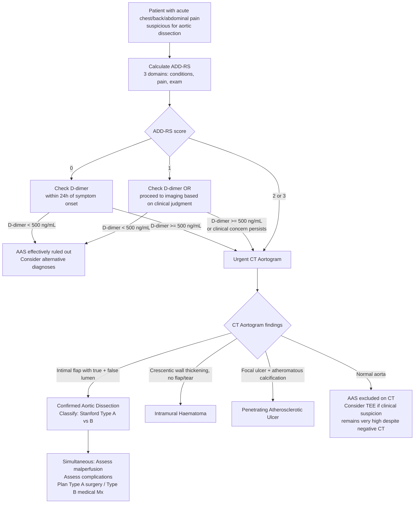

## Diagnosis of Aortic Dissection

There is no single "diagnostic criterion" for aortic dissection in the way that, say, the Jones criteria exist for rheumatic fever. Instead, diagnosis relies on a **clinical pre-test probability assessment** (using the Aortic Dissection Detection Risk Score — ADD-RS) combined with **biomarkers** (D-dimer) and **definitive imaging** (CT aortogram). The philosophy is: use clinical features to decide *how urgently and directly you go to imaging*, then let imaging make the definitive diagnosis.

---

### 1. Pre-Test Probability: The Aortic Dissection Detection Risk Score (ADD-RS)

The ADD-RS was developed by the AHA/ACC (2010) and refined in subsequent ESC and Society for Vascular Surgery guidelines. It is the recommended structured tool to stratify clinical suspicion before deciding on the next step. It works by scoring three domains — each domain scores 0 or 1, giving a total of 0–3 [3].

| Domain | Features (Score 1 if ANY feature present in that domain) |
|---|---|
| **A. High-risk conditions** | Marfan syndrome or other connective tissue disease; family history of aortic disease; known aortic valve disease (including BAV); known thoracic aortic aneurysm; previous aortic manipulation/surgery |
| **B. High-risk pain features** | Chest, back, or abdominal pain described as: (1) abrupt onset, (2) severe intensity, (3) tearing or ripping quality |
| **C. High-risk examination features** | Pulse deficit or systolic BP difference > 20 mmHg between limbs; focal neurological deficit + pain; new aortic regurgitation murmur (with pain); hypotension/shock |

**Interpretation:**
- **ADD-RS 0**: Low probability → proceed to D-dimer
- **ADD-RS 1**: Intermediate probability → D-dimer may still help stratify
- **ADD-RS ≥ 2–3**: High probability → proceed **directly to urgent CT aortogram** (do not wait for D-dimer)

> The logic here is straightforward: if a patient has high-risk conditions, high-risk pain features, AND high-risk exam findings, the pre-test probability is so high that waiting for a blood test wastes precious time. Go straight to imaging.

<Callout title="Exam-Critical: ADD-RS in 30 Seconds">
Think of it as 3 buckets: (1) Who is this patient? (predisposing conditions), (2) What does the pain sound like? (abrupt, severe, tearing), (3) What do I find on examination? (pulse deficit, BP asymmetry, AR murmur, neuro deficit). One point per bucket. Score ≥ 2 → straight to CT aortogram.
</Callout>

---

### 2. Biomarker: D-Dimer

- **D-dimer** is a fibrin degradation product. In aortic dissection, the expanding false lumen activates the coagulation cascade within it → fibrin is laid down → plasmin degrades the fibrin → D-dimer is released into the circulation.
- **Role**: primarily a **rule-out** test in patients with **low pre-test probability (ADD-RS 0–1)**.
- **Threshold**: D-dimer < 500 ng/mL within the first **24 hours** of symptom onset has a **sensitivity ~96–97% and negative predictive value ~95%** for excluding acute aortic dissection.
- **Limitation**: D-dimer is **not specific** — elevated in PE, DVT, DIC, sepsis, malignancy, post-operative states, pregnancy. So a positive D-dimer does not confirm dissection; it merely means you cannot rule it out and must proceed to imaging.
- **Time-dependency**: D-dimer sensitivity drops if the patient presents > 24 hours after symptom onset (chronic dissections may have normal D-dimer).

> Think of D-dimer in aortic dissection the same way you think of D-dimer in PE: a negative D-dimer in a low-probability patient effectively rules it out; a positive D-dimer in anyone just tells you to image.

<Callout title="D-dimer in AAS" type="error">
D-dimer is useful to RULE OUT dissection, not to rule it in. Never rely on a negative D-dimer if clinical suspicion is high (ADD-RS ≥ 2). And remember: D-dimer loses sensitivity after 24 hours from onset — it is a test for the acute phase.
</Callout>

---

### 3. Overall Diagnostic Algorithm

This algorithm integrates the ADD-RS, D-dimer, and imaging into a stepwise approach based on current (2022 ACC/AHA, 2024 ESC) guidelines [1][3][10]:

---

### 4. Investigation Modalities — Detailed Breakdown

#### 4A. Bedside Investigations (Done Immediately, Before Definitive Imaging)

##### 4A-i. ECG

- **Purpose**: Not to diagnose dissection but to (1) assess for concurrent MI from coronary malperfusion, (2) rule out other causes of chest pain (PE, pericarditis), (3) baseline before surgery.
- **Common findings in aortic dissection**:
  - **Normal ECG** (~30%) — a normal ECG does NOT exclude dissection
  - **Non-specific ST-T changes** (~40%) — due to LV hypertrophy from longstanding HTN
  - ***ST elevation (especially inferior leads — II, III, aVF)*** → suggests **RCA malperfusion** → dissection-induced MI. This is the classic diagnostic trap — if you see an inferior STEMI with back pain, check for dissection before giving thrombolytics [1][3]
  - **Low voltage / electrical alternans** → suggests **pericardial effusion/tamponade** (fluid around the heart attenuates electrical signals)
  - **LVH pattern** → reflects chronic hypertension (the most common risk factor)

<Callout title="ECG in Dissection" type="error">
~30% of patients with aortic dissection have a completely normal ECG. A normal ECG does NOT rule out dissection. Conversely, ST elevation (especially inferior) may be present because the dissection involves the RCA — do NOT reflexively thrombolyse without excluding dissection first.
</Callout>

##### 4A-ii. Bloods

| Test | Rationale | Expected Findings in Dissection | Interpretation |
|---|---|---|---|
| ***Troponin T / I (or hs-TnT)*** | ***Rule out MI*** — dissection can cause MI via coronary malperfusion [1] | ↑ if coronary malperfusion → MI | Elevated troponin in a patient with tearing chest pain + back radiation → think dissection causing MI, not primary ACS |
| ***Lactate*** | ***Elevated in ischaemic gut / shock*** [1] | ↑ if mesenteric ischaemia or shock | Rising lactate = tissue hypoperfusion — may indicate mesenteric malperfusion (SMA compromise) or generalised shock from rupture/tamponade |
| **D-dimer** | Rule-out biomarker (see above) | ↑ in acute dissection (> 500 ng/mL in ~97%) | Negative D-dimer in low pre-test probability → rules out; positive is non-specific |
| **FBC (CBC)** | Baseline; anaemia assessment | May show ↓ Hb if ongoing haemorrhage (rupture), ↑ WCC (stress response) | Falling Hb → ongoing bleeding (rupture into pleural/pericardial space) |
| **Renal function (U&E/Cr)** | Assess for renal malperfusion → AKI [17] | ↑ creatinine, ↑ urea if renal artery involvement | Rising creatinine → renal malperfusion (a marker of complicated dissection) |
| **LFT** | Baseline | Usually normal; ↑ ALT/AST in shock liver | |
| **Clotting (PT/aPTT/INR)** | Pre-operative baseline; DIC screening | May be deranged in DIC from massive haemorrhage | |
| **Group & Save / Crossmatch** | Pre-operative preparation | — | Always crossmatch at least 4–6 units of packed red cells for Type A |
| **ABG** | Assess oxygenation, ventilation, acid-base, lactate | Metabolic acidosis (↑ lactate) in malperfusion/shock | Lactic acidosis = tissue hypoperfusion → urgent intervention needed |

##### 4A-iii. CXR (Chest X-ray)

***CXR is abnormal in > 80% of cases*** [3] but is **not diagnostic** — it raises suspicion and should prompt definitive imaging.

**Key CXR Findings:**

| Finding | Frequency | Pathophysiology |
|---|---|---|
| ***Broadening/widening of the upper mediastinum*** | ***60–90%*** [3] | The expanding false lumen and/or mediastinal haematoma pushes the mediastinal pleura laterally. The normal superior mediastinum is < 8 cm on a PA film. A widened mediastinum (> 8 cm on PA, or > 6 cm on AP supine) is suggestive but not diagnostic |
| ***Distorted aortic knuckle*** | Moderate | The aortic arch contour becomes irregular or blurred as the dissection distorts the normal anatomy |
| ***Left pleural effusion*** | ***~19%*** [3] | Rupture of the descending aorta through the adventitia into the left pleural space → haemothorax. Left-sided because the descending aorta is a left-sided structure |
| **Displacement of intimal calcification** | Low–Moderate | In a normal aorta, intimal calcification sits at the outer edge of the aortic shadow. If there is a false lumen beyond it, the calcification is displaced inward (> 6 mm from the outer aortic wall → "calcium sign") |
| **Tracheal/oesophageal deviation to the right** | Low | Expanding arch/descending aorta pushes the trachea and oesophagus (seen as NG tube deviation) to the right |
| **Normal CXR** | **~10–20%** | A normal CXR does NOT exclude dissection |

> The CXR is a rapid, bedside screening tool. Its main value is in increasing your clinical suspicion and prompting a CT aortogram. A normal CXR does not rule out dissection, and a widened mediastinum has many other causes (eg. lymphoma, mediastinal mass, poor AP film technique). Always interpret in clinical context.

---

#### 4B. Definitive Imaging

##### 4B-i. CT Aortogram (CTA) — The Preferred First-Line Imaging

***CT aortogram is the preferred method of imaging*** [3] for suspected aortic dissection.

**Why CT aortogram is first-line:**
- ***CT is usually quicker to perform and thus is preferred (over MRI) as aortic dissection is an acute situation*** [3]
- Widely available 24/7 in most EDs
- Very high sensitivity (~95–100%) and specificity (~98–100%) for aortic dissection
- Can assess the entire aorta from root to bifurcation in a single scan
- Provides information for surgical planning (anatomy, branch involvement, entry/re-entry tears)
- ***MRI is unsuitable for pacing wiring and life support equipment*** → ICU patients often cannot undergo MRI [3]

**Technique:**
- ECG-gated CT of the entire aorta with IV contrast (arterial phase)
- ECG-gating reduces motion artefact from the beating heart, which is crucial for imaging the ascending aorta and root

**Key CT Aortogram Findings:**

| Finding | Description | Clinical Significance |
|---|---|---|
| ***Intimal flap*** | A thin, linear hypodensity within the aortic lumen separating the true lumen from the false lumen | **Hallmark finding** — pathognomonic of classical aortic dissection |
| ***Demonstration of false lumen*** [3] | A second channel parallel to the true lumen, separated by the intimal flap | Confirms dissection; allows classification (Stanford A vs B) |
| ***True lumen identification*** | ***True lumen can be traced from normal aorta*** (it is continuous with the undissected segment) ***and is compressed by the false lumen*** [1] | The true lumen is typically smaller, smoothly marginated, and sits anteriorly and to the right in Type A |
| **Contrast density differences** | ***True lumen is more hyperdense (new blood) [because contrast arrives here first via direct arterial flow]; false lumen is more hypodense (slower flow / old blood / partial thrombosis)*** [1] | Helps distinguish true from false lumen — the "beak sign" (acute angle of the false lumen) and "cobweb sign" (residual medial strands in false lumen) are ancillary signs |
| ***Extent of dissection*** | ***Site of entry and re-entry tears, proximal and distal extent*** [3] | Essential for surgical planning — determines Stanford type and extent of repair needed |
| ***Branch involvement*** | Involvement of brachiocephalic, carotid, subclavian, coeliac, SMA, renal, iliac arteries [3] | Identifies malperfusion syndromes — determines if Type B is "complicated" |
| ***Thrombus in false lumen*** | Partial or complete thrombosis of the false lumen [3] | Complete false lumen thrombosis in Type B is prognostically favourable; partial thrombosis is worse (because there is still flow but impaired drainage → progressive expansion) |
| ***Pericardial effusion*** | Hyperdense fluid around the heart [3] | Indicates haemopericardium → impending/existing tamponade → emergent surgery |
| **Pleural effusion** | Hyperdense fluid in pleural space (usually left) | Haemothorax from descending aortic rupture |
| **Mediastinal haematoma** | Hyperdense collection in mediastinum surrounding the aorta | Indicates rupture through adventitia contained by mediastinal tissues |

**For IMH on CT:**
- Crescentic or circumferential **hyperdense** (on non-contrast phase) thickening of the aortic wall > 5 mm
- **No intimal flap or false lumen with flow** on contrast phase
- May have focal enhancement suggesting a small intimal tear

**For PAU on CT:**
- Focal contrast-filled outpouching extending beyond the expected aortic lumen contour
- Surrounded by extensive mural thrombus and atherosclerotic calcification
- Usually in the descending thoracic aorta

##### 4B-ii. Transoesophageal Echocardiography (TEE)

***TEE is indicated if CTA is contraindicated or if the patient is haemodynamically unstable*** [3] — i.e., too unstable to transport to the CT scanner.

**Why TEE and not TTE?**
- ***Transthoracic echo (TTE) can only provide images of the first 3–4 cm of the ascending aorta*** [3] — it cannot visualise the arch or descending aorta reliably
- ***TEE provides much better views*** because the oesophagus sits immediately posterior to the heart and descending aorta, allowing high-frequency imaging without lung or chest wall interference
- ***However, TEE cannot visualise the entire distal aorta*** [3] — there is a "blind spot" in the distal ascending aorta/proximal arch where the trachea/left main bronchus interposes between the oesophagus and aorta

**TEE Findings:**

| Finding | Description |
|---|---|
| ***Dilated aortic root ± intimal flap*** [3] | Directly visualises the flap oscillating in real-time |
| ***Aortic regurgitation on Doppler*** [3] | Colour-flow Doppler shows diastolic flow from aorta back into LV |
| ***Pericardial effusion*** | Anechoic/echoic fluid surrounding the heart |
| **RWMA (regional wall motion abnormalities)** | If coronary malperfusion → MI → the affected myocardial segments will be hypokinetic/akinetic [1] |
| **True vs false lumen** | Real-time assessment of flow dynamics — the true lumen typically expands in systole (when aortic pressure is highest) and the false lumen expands in diastole |

**Advantages:**
- Can be performed at the bedside / in the operating theatre
- Real-time assessment of AR severity
- Does not require contrast or radiation

**Disadvantages:**
- Semi-invasive (requires sedation, oesophageal intubation)
- Operator-dependent
- Blind spot in distal ascending aorta/proximal arch
- Cannot assess abdominal aorta or iliac arteries

**TTE role:**
- Useful as an **initial rapid bedside assessment** to look for pericardial effusion, AR, LV function, and RWMA
- If TTE shows pericardial effusion + dilated aortic root in a patient with acute chest pain → very high suspicion for Type A dissection → can expedite surgical decision even before CT

##### 4B-iii. MRI / MRA (Magnetic Resonance Imaging / Angiography)

***MRI is usually reserved for serial follow-up of chronic dissections*** [3].

**MRI characteristics:**

| Feature | Detail |
|---|---|
| ***Sensitivity and specificity*** | ***Highly sensitive and specific — almost 100%*** [3] |
| **Identification** | ***Intimal flaps, great vessel anatomy, type of dissection and degree of AR*** [3] |
| **Advantages** | No radiation, no iodinated contrast (gadolinium instead), excellent soft tissue contrast, multiplanar imaging |
| **Disadvantages** | ***Time consuming*** [3]; ***need disconnecting from monitoring devices and IV pumps*** [3]; CI in patients with pacemakers/metallic implants; limited availability for emergencies |

**When MRI is used:**
- ***Serial follow-up*** (at 3, 6, 12 months and then annually) to monitor: false lumen size, residual dissection, aneurysmal degeneration, endoleak after TEVAR [3]
- When CT is contraindicated (severe contrast allergy, renal impairment)
- Chronic dissection where time is not as critical

##### 4B-iv. Digital Subtraction Angiography (DSA) — Formerly the Gold Standard

- DSA was historically considered the gold standard but is now **rarely used for diagnosis** alone [5][16]
- It is an **invasive** procedure: catheter inserted (usually via femoral artery) → contrast injected → real-time fluoroscopic images
- ***Almost never done except if endovascular intervention is required*** [5]
- **Advantages**: real-time dynamic imaging, allows simultaneous endovascular intervention (TEVAR)
- **Disadvantages**: ***catheter- and contrast-related complications*** (arterial injury, dissection extension, embolism, contrast nephropathy, stroke risk ~2-3% for cerebral vessels) [5][16]
- **Current role**: primarily intra-operative — used to guide stent-graft placement during TEVAR

---

### 5. Additional Investigations to Assess Complications / Plan Surgery

| Investigation | Purpose | Key Findings |
|---|---|---|
| **Coronary angiography** | Assess coronary involvement (if planning surgery and time allows) | Coronary ostial occlusion by the dissection flap; may identify pre-existing CAD for concomitant CABG |
| **CT brain** | If neurological deficits present → assess for stroke | Acute ischaemic infarct or haemorrhage |
| **Duplex USG of carotids** | Assess carotid involvement if neurological symptoms | Dissection flap extending into carotid; abnormal flow patterns |
| **Duplex USG of lower limbs** | If limb ischaemia suspected | Absent flow distal to occlusion |
| **Renal function monitoring** | Ongoing assessment of renal malperfusion | Rising creatinine → worsening renal ischaemia |
| **Serial lactate** | Monitor for mesenteric ischaemia progression | Persistently rising lactate → ongoing gut ischaemia |
| ***Serial imaging (MRA/CTA at 3, 6, 12 months)*** | ***Detect recurrence, aneurysm formation, leakage*** post-intervention [3] | False lumen expansion, new dissection, endoleak after TEVAR |

---

### 6. Interpretation Pearls: True Lumen vs False Lumen on CT

This is a commonly tested concept and worth understanding from first principles:

| Feature | True Lumen | False Lumen |
|---|---|---|
| **Continuity** | ***Can be traced from normal undissected aorta*** [1] | Cannot be traced from normal aorta |
| **Size** | ***Usually smaller (compressed by false lumen)*** [1] | Usually larger (blood under pressure expands it) |
| **Shape** | Smoothly marginated | Irregular margins, may have "cobweb sign" (residual medial strands) |
| **Contrast enhancement** | ***More hyperdense (contrast arrives first)*** [1] | ***More hypodense (delayed filling, partial thrombosis)*** [1] |
| **Position (ascending aorta)** | Typically anteriorly and to the right | Typically posteriorly and to the left |
| **Beak sign** | Absent | Present — the acute angle where the intimal flap meets the aortic wall |
| **Systolic expansion** | Expands in systole (receives direct aortic flow) | Expands in diastole (recoil from compressed true lumen) |

> Why is the false lumen usually larger? Because the blood in the false lumen is under systemic pressure but the false lumen wall (just the outer media + thin adventitia) is weaker than the intact aortic wall → it expands more easily. The true lumen is sandwiched and compressed.

---

### 7. Summary: Which Imaging When?

| Scenario | First-Line Imaging | Rationale |
|---|---|---|
| **Haemodynamically stable, suspected AAS** | ***Urgent CT aortogram*** | Fast, widely available, high sensitivity/specificity, provides complete anatomical information [3] |
| **Haemodynamically unstable, cannot transport to CT** | ***Bedside TEE*** | Can be done at bedside/OR; identifies flap, AR, pericardial effusion [3] |
| **CT contraindicated (contrast allergy, renal failure)** | **TEE or MRI (if stable enough)** | MRI has near-100% sensitivity but is time-consuming and requires stable patient |
| **Chronic dissection follow-up** | ***MRA or CTA at 3, 6, 12 months*** | Monitor false lumen, aneurysm formation, endoleak [3] |
| **Planned endovascular intervention** | **DSA (intra-operative)** | Real-time guidance for stent-graft deployment [5] |
| **Traumatic aortic injury** | ***CT aortogram (fast with high sensitivity)*** [5] | Most ATAI patients are polytrauma → CT is part of trauma workup |

---

<Callout title="High Yield Summary">

**Diagnostic Approach:**

1. **Pre-test probability** — ADD-RS (3 domains: conditions, pain, exam) → 0 = low, ≥ 2 = high
2. **D-dimer** — rule-out test in low probability (ADD-RS 0-1); < 500 ng/mL within 24h effectively excludes AAS (sensitivity ~97%). Not useful if high probability or > 24h from onset
3. **CT aortogram** — gold-standard imaging for stable patients; identifies intimal flap, true/false lumen, extent, branch involvement, complications
4. **TEE** — for unstable patients or CT contraindicated; sees flap, AR, pericardial effusion at bedside
5. **MRI** — near-100% sensitivity but reserved for follow-up or when CT is contraindicated

**Key CT findings**: intimal flap (pathognomonic), true lumen traced from normal aorta and compressed by larger false lumen, true lumen more hyperdense (contrast arrives first), false lumen more hypodense

**Key CXR findings**: widened mediastinum (60-90%), distorted aortic knuckle, left pleural effusion (19%), displaced intimal calcification. Normal CXR does NOT exclude dissection (10-20% normal)

**ECG**: often normal or non-specific; ST elevation (especially inferior) may indicate coronary malperfusion → DO NOT thrombolyse without excluding dissection

**Bloods**: Troponin (rule out MI), lactate (mesenteric ischaemia/shock), D-dimer (rule-out), CBC, RFT, clotting, crossmatch

</Callout>

---

<ActiveRecallQuiz
  title="Active Recall - Diagnosis of Aortic Dissection"
  items={[
    {
      question: "What are the 3 domains of the Aortic Dissection Detection Risk Score (ADD-RS)? Give one example feature from each domain.",
      markscheme: "Domain A - High-risk conditions: e.g. Marfan syndrome, known thoracic aortic aneurysm, BAV. Domain B - High-risk pain features: abrupt onset, severe intensity, tearing/ripping quality. Domain C - High-risk exam findings: pulse deficit, BP difference >20 mmHg, new AR murmur, focal neurological deficit. Score 1 per domain if any feature present. Score 0-3."
    },
    {
      question: "What is the role of D-dimer in suspected aortic dissection? State its sensitivity, the threshold used, and its key limitation.",
      markscheme: "Role: rule-out test in low pre-test probability patients (ADD-RS 0-1). Threshold: <500 ng/mL within 24h of symptom onset. Sensitivity ~96-97%, high NPV. Key limitation: non-specific (elevated in PE, DVT, DIC, sepsis etc), and loses sensitivity after 24 hours from onset. Should NOT be relied upon if clinical suspicion is high (ADD-RS >= 2)."
    },
    {
      question: "On CT aortogram, how do you distinguish the true lumen from the false lumen? List 4 differentiating features.",
      markscheme: "1. True lumen can be traced from normal undissected aorta; false lumen cannot. 2. True lumen is usually smaller/compressed; false lumen is larger. 3. True lumen is more hyperdense (contrast arrives first); false lumen is more hypodense. 4. False lumen has beak sign (acute angle at flap-wall junction) and cobweb sign (residual medial strands). Also: true lumen expands in systole; false lumen expands in diastole."
    },
    {
      question: "Why is TEE preferred over TTE for imaging aortic dissection? When is TEE the first-line choice?",
      markscheme: "TTE can only image the first 3-4 cm of the ascending aorta and cannot visualise the arch or descending aorta. TEE provides better views because the oesophagus is immediately posterior to the heart and aorta. TEE is first-line when: (1) patient is haemodynamically unstable and cannot be transported to CT scanner, or (2) CT is contraindicated. TEE limitation: blind spot at distal ascending aorta/proximal arch (trachea/bronchus interposition)."
    },
    {
      question: "List 4 CXR findings suggestive of aortic dissection and the pathophysiological basis for each.",
      markscheme: "1. Widened mediastinum (60-90%): expanding false lumen and mediastinal haematoma push mediastinal pleura laterally. 2. Distorted aortic knuckle: dissection disrupts normal arch contour. 3. Left pleural effusion (19%): rupture of descending aorta into left pleural space (haemothorax). 4. Displaced intimal calcification: calcium sign - intimal calcification displaced inward by >6 mm because the false lumen sits beyond it. Also acceptable: tracheal/oesophageal deviation to the right."
    },
    {
      question: "State the recommended long-term imaging surveillance schedule after treatment of aortic dissection and what findings you are monitoring for.",
      markscheme: "MRA or CTA at 3, 6, and 12 months, then annually. Monitoring for: (1) false lumen expansion or new dissection, (2) aneurysmal degeneration of the residual dissected segment, (3) endoleak after TEVAR, (4) recurrence of dissection at other sites."
    }
  ]}
/>

## References

[1] Senior notes: Maksim Medicine Notes.pdf (p15 — aortic dissection investigations, true vs false lumen on CT)
[3] Senior notes: Ryan Ho Cardiology.pdf (p219–221 — investigations: CXR, CT aortogram, TEE, MRI findings and rationale; serial follow-up; prognosis)
[5] Senior notes: Ryan Ho Radiology.pdf (p4 — CT aortogram for traumatic aortic injury, DSA as gold standard, TEE)
[10] Senior notes: Ryan Ho Fundamentals.pdf (p199–203 — approach to acute chest pain, ECG and initial workup)
[16] Senior notes: Maksim Surgery Notes.pdf (p165 — DSA as gold standard for vascular imaging, advantages and disadvantages)
[17] Senior notes: Ryan Ho Urogenital.pdf (p96 — aortic dissection as cause of pre-renal AKI via renal artery malperfusion)
[18] Senior notes: Ryan Ho Diagnostic Radiology.pdf (p36, p43 — CT applications including aortic dissection, CT angiography)
[19] Senior notes: Ryan Ho Critical Care.pdf (p17 — early investigations in shock including CXR widened mediastinum, ECG, bloods)
