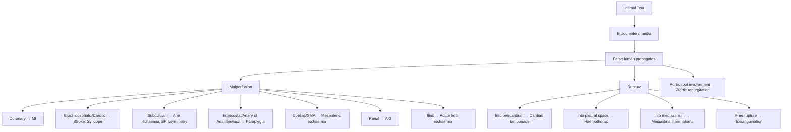

# Aortic Dissection

## 1. Definition

Aortic dissection is a **tear in the tunica intima** (innermost layer) of the aorta that allows blood under systemic arterial pressure to enter and propagate within the **tunica media**, creating a **false lumen** that separates the intimal-medial layers longitudinally [1][2][3].

The term literally breaks down as:
- **"Aortic"** = pertaining to the aorta (Greek *aortē*, from *aeirein* "to lift/carry" — the great vessel that carries blood from the heart)
- **"Dissection"** = Latin *dissectio*, "to cut apart" — the wall is being split apart by blood tracking within it

### Acute Aortic Syndrome (AAS)

Aortic dissection sits within the broader umbrella of **acute aortic syndrome (AAS)** — a term coined in 2001 to describe a spectrum of acute, life-threatening aortic conditions that share overlapping presentations and are all initially managed as aortic dissection until proven otherwise [2][3]:

| Entity | Pathology |
|---|---|
| **Classical aortic dissection** | Intimal tear → blood enters media → creates a true and false lumen separated by an intimal flap |
| **Limited dissection** | Limited intimal tear with eccentric bulge at the tear site but no propagating haematoma |
| **Intramural haematoma (IMH)** | Haemorrhage within the medial layer **without** a demonstrable intimal tear or flap — due to **rupture of the vasa vasorum** (the tiny nutrient vessels within the aortic wall itself) |
| **Penetrating atherosclerotic ulcer (PAU)** | An atherosclerotic plaque ulcerates deeply enough to penetrate through the internal elastic lamina into the media, allowing haematoma formation |

<Callout title="Clinical Pearl">
All acute aortic syndromes are managed as aortic dissection until definitive imaging says otherwise. IMH and PAU can progress to classical dissection.
</Callout>

---

## 2. Epidemiology

- **Incidence**: approximately **2.6–3.5 per 100,000 per year** — roughly equivalent to about **1 case per day across the whole of Hong Kong** [3]
- ***Incidence is notably higher in mainland China*** due to the enormous burden of uncontrolled hypertension [3]
- **Demographics**: typically affects ages **60–80 years**, but can occur much younger in the presence of connective tissue disease or other risk factors [3]
- **Sex**: **Male : Female ≈ 2 : 1** [3]
- **Stanford Type A** accounts for approximately ***~2/3 (66%)*** of cases; **Type B** accounts for the remaining ***~1/3*** [1][3]
- ***DeBakey type I is the most common and the worst type*** [4]

<Callout title="High Yield – Epidemiology">
In Hong Kong, roughly one aortic dissection presents per day across all hospitals. Uncontrolled hypertension is the single most important risk factor — present in ~77% of cases.
</Callout>

---

## 3. Anatomy and Function

To understand aortic dissection, you need to understand aortic wall structure and the functional segments of the aorta.

### 3.1 Aortic Wall Layers

The aortic wall has three layers (from lumen outwards):

1. **Tunica intima**: a single layer of endothelial cells resting on a basement membrane and thin subendothelial connective tissue. The **internal elastic lamina** forms its outer boundary.
2. **Tunica media**: the thickest layer — composed of concentrically arranged **elastic lamellae** (40–60 layers in the thoracic aorta) interspersed with **smooth muscle cells** (SMCs) and an extracellular matrix (ECM) rich in **collagen** and **elastin**. This is the layer that bears most of the haemodynamic stress. It is also where the **vasa vasorum** (literally "vessels of the vessels") penetrate to supply the outer two-thirds of the wall.
3. **Tunica adventitia**: the outermost layer of collagenous connective tissue containing the vasa vasorum, nerves (including nociceptive fibres — this is why dissection hurts so intensely), and lymphatics.

> The reason aortic dissection is so painful is that the dissecting haematoma stretches and tears through the media and stimulates adventitial nerve fibres. The reason it is so dangerous is that the media is the structural layer — once it is split, the thin adventitia is the only barrier between aortic pressure and catastrophic rupture.

### 3.2 Segments of the Aorta

| Segment | Boundaries | Key Branches |
|---|---|---|
| **Aortic root** | Aortic valve annulus → sinotubular junction | Coronary arteries (RCA, LCA) |
| **Ascending aorta** | Sinotubular junction → brachiocephalic artery origin | — |
| **Aortic arch** | Brachiocephalic → left subclavian artery | Brachiocephalic trunk, left CCA, left subclavian |
| **Descending thoracic aorta** | Distal to left subclavian → diaphragm | Intercostal arteries, bronchial arteries, artery of Adamkiewicz (spinal cord supply, typically T9–T12) |
| **Abdominal aorta** | Diaphragm → aortic bifurcation (L4) | Coeliac trunk, SMA, renal arteries, IMA, gonadal arteries |

The **aortic isthmus** (just distal to the left subclavian artery origin) is a crucial anatomical landmark — it is where the **mobile** aortic arch transitions to the **relatively fixed** descending thoracic aorta. This is the most common site of traumatic aortic injury (acceleration-deceleration) [5] and is also the boundary used in the Stanford classification.

### 3.3 Vasa Vasorum

The **vasa vasorum** ("vessels of the vessels") are small arteries that supply the outer two-thirds of the media and the adventitia. In the thoracic aorta, they are more prominent because the wall is thicker. **Rupture of the vasa vasorum** is the proposed mechanism for **intramural haematoma** — haemorrhage occurs within the media without a primary intimal tear [2][3].

---

## 4. Risk Factors

***Coexisting HTN is present in 76.6% of cases*** — it is by far the most important modifiable risk factor [3].

### 4.1 Acquired Risk Factors

| Risk Factor | Mechanism |
|---|---|
| ***Hypertension (76.6%)*** | Chronic ↑ wall stress → accelerated medial degeneration; acute ↑ BP can be the trigger event |
| ***Cocaine use*** | Causes acute severe hypertension via sympathomimetic effects → abrupt ↑ aortic wall stress [1][3] |
| ***Phaeochromocytoma*** | Catecholamine surges → episodic severe hypertension [1] |
| **Smoking** | Accelerates atherosclerosis and medial degeneration |
| **Atherosclerosis** | Weakens the intima; PAU is a direct consequence |
| ***Heavy weight lifting / isometric exercise*** | Acute ↑ intrathoracic and aortic pressure → can trigger intimal tear in a susceptible aorta [3][6] |
| ***Pregnancy and delivery*** | Hormonal changes (↑ progesterone/oestrogen) → ↑ elastin fragmentation in the media; haemodynamic stress of pregnancy (↑ CO, ↑ blood volume); highest risk in 3rd trimester and peripartum [1][3] |
| ***Trauma*** (catheter-related, acceleration-deceleration) | Direct mechanical injury to the intima [3] |

### 4.2 Congenital / Inherited Risk Factors

| Risk Factor | Mechanism |
|---|---|
| ***Marfan syndrome*** | Fibrillin-1 (*FBN1*) mutation → defective elastic fibre assembly → **cystic medial necrosis** (loss of elastic lamellae, smooth muscle, and accumulation of basophilic ground substance). This makes the media intrinsically weak. These patients often dissect at a younger age and at smaller aortic diameters. [1][3] |
| ***Ehlers-Danlos syndrome (EDS type IV)*** | Mutations in type III collagen (*COL3A1*) → fragile arteries prone to spontaneous dissection/rupture [3] |
| ***Loeys-Dietz syndrome*** | Mutations in **TGF-β receptor** genes (*TGFBR1/2*) → abnormal vascular remodelling → aneurysm and dissection at young ages [3] |
| ***Bicuspid aortic valve (BAV)*** | Associated with aortopathy — the ascending aorta has intrinsic medial abnormalities independent of haemodynamic effects; ↑ risk of ascending aortic aneurysm and Type A dissection [3] |
| ***Turner syndrome*** | 45,X karyotype → associated BAV and aortic coarctation → ↑ risk of dissection |
| **Familial thoracic aortic aneurysm/dissection (FTAAD)** | Mutations in *ACTA2*, *MYH11*, *SMAD3*, etc. — various genes encoding smooth muscle contractile proteins |
| ***Coarctation of the aorta*** | Chronic proximal hypertension + turbulent flow at the coarctation site → medial degeneration |

### 4.3 Inflammatory / Vasculitic Risk Factors

| Risk Factor | Mechanism |
|---|---|
| ***Takayasu arteritis*** | Granulomatous large-vessel vasculitis → mural inflammation and weakening → aneurysm/dissection [1][7] |
| ***Giant cell arteritis (GCA)*** | Granulomatous arteritis of the aorta and major branches → large-vessel involvement → aneurysm/dissection [7] |
| **Syphilitic aortitis** | *Treponema pallidum* causes obliterative endarteritis of the vasa vasorum → ischaemic necrosis of the media → weakening (historically more important, now rare) |
| ***Prior aortic diseases*** (aortic aneurysm, prior aortic surgery) | A pre-existing aneurysm stretches and thins the wall → lower threshold for dissection [3] |

<Callout title="Hong Kong Focus" type="idea">
In Hong Kong, the dominant risk factor profile is: elderly Chinese male with poorly controlled hypertension (often non-adherent to medications). Connective tissue disease is a smaller but important subset — particularly Marfan syndrome presenting at younger ages. Cocaine-related dissection is less common in HK than in Western populations, but does occur.
</Callout>

---

## 5. Pathophysiology

### 5.1 Initiating Event

The exact initiating event is debated, but two main theories exist [3]:

1. **Primary intimal tear hypothesis** (most widely accepted): Chronic medial degeneration (from hypertension, connective tissue disease, etc.) weakens the wall → a **tear develops in the intima** → high-pressure aortic blood enters the media → the blood propagates along the plane of least resistance within the media, creating a **false lumen**.

2. **Primary vasa vasorum haemorrhage hypothesis**: Rupture of the vasa vasorum within the media → **intramural haematoma** → the haematoma may then rupture inwards through the intima into the true lumen (creating a secondary intimal tear and classical dissection) or outwards through the adventitia (rupture).

Both pathways converge: once blood is within the media, it dissects along the vessel.

### 5.2 Propagation

- The false lumen can extend **both proximally and distally** from the initial tear
- It can re-enter the true lumen at another point downstream → creating a **"double-barrelled aorta"** [3]
- The false lumen typically **compresses the true lumen** → this can cause **malperfusion** of any branch vessel arising from the compressed segment
- The false lumen may **thrombose** (partially or completely), which paradoxically can be stabilising (if the false lumen thromboses completely in Type B, the prognosis is generally better)

### 5.3 Consequences of Dissection

The consequences arise from two fundamental mechanisms: **malperfusion** and **rupture**.

#### 5.3.1 Malperfusion Syndromes

When the dissection flap or false lumen compromises flow to branch arteries:

| Branch Involved | Clinical Consequence | Mechanism |
|---|---|---|
| **Coronary arteries** (especially RCA — more commonly involved because the dissection flap often extends into the right coronary ostium) | ***MI*** | False lumen compresses coronary ostium or dissection extends into coronary artery |
| **Brachiocephalic / Carotid** | ***Ischaemic stroke, syncope, LOC*** | ↓ Cerebral perfusion; may be transient if flap oscillates |
| **Subclavian** | ***Arm ischaemia, asymmetric BP/pulses*** | Compression of subclavian → ↓ flow to one arm |
| **Intercostal / Artery of Adamkiewicz** | ***Paraplegia*** | Spinal cord ischaemia — devastating and often irreversible |
| **Coeliac trunk / SMA** | ***Mesenteric infarction*** (acute abdomen) | Gut ischaemia → ↑ lactate, peritonitis |
| **Renal arteries** | ***AKI*** | Renal malperfusion → oliguria, ↑ creatinine |
| **Iliac arteries** | ***Acute limb ischaemia*** | Lower extremity malperfusion |

#### 5.3.2 Rupture

- **Into the pericardial sac** → **cardiac tamponade** (most common cause of death in acute Type A dissection) — because the ascending aorta is intrapericardial; the pericardium is relatively inelastic, so even a small amount of blood causes rapid ↑ intrapericardial pressure → ↓ ventricular filling → cardiogenic shock
- **Into the left pleural space** → **haemothorax** (left side because the descending aorta is a left-sided structure)
- **Free rupture** into the mediastinum or peritoneal cavity → rapid exsanguination

#### 5.3.3 Aortic Regurgitation (AR)

When the dissection involves the **aortic root**, the dissection flap can:
- Dilate the aortic root → the aortic valve leaflets are pulled apart → **incomplete coaptation**
- Prolapse through the aortic valve orifice → **direct leaflet malcoaptation**
- Result: ***acute aortic regurgitation → acute pulmonary oedema (APO)*** [1][3]

> In chronic AR, the LV has time to dilate and compensate. In acute AR from dissection, the LV is of normal size and cannot accommodate the sudden volume overload → LV end-diastolic pressure rises acutely → acute pulmonary oedema. This is a surgical emergency.

---

## 6. Classification

### 6.1 Stanford Classification (Most Clinically Used)

The Stanford classification is the one that drives management decisions:

| Type | Definition | Frequency | Management |
|---|---|---|---|
| ***Type A*** | ***Involves the ascending aorta*** (regardless of where the tear originates — even if the tear is in the descending aorta but the dissection extends retrograde to involve the ascending aorta, it is Type A) | ***~2/3 (~66-80%)*** | ***Surgical treatment*** |
| ***Type B*** | ***Spares the ascending aorta*** (dissection begins distal to the left subclavian artery and does not extend proximally to involve the ascending aorta) | ***~1/3 (~20-34%)*** | ***Medical treatment, unless complicated*** |

<Callout title="Why Does Type A Require Surgery?" type="idea">
Because the ascending aorta is intrapericardial — Type A dissection carries imminent risk of: (1) rupture into pericardium → tamponade, (2) coronary malperfusion → MI, (3) aortic root involvement → acute AR with APO. Without surgery, mortality is ~1-2% per hour in the first 48 hours. Medical therapy alone carries ~50% mortality at 48h.
</Callout>

### 6.2 DeBakey Classification

| Type | Origin of Tear | Extent | Corresponding Stanford |
|---|---|---|---|
| ***Type I*** | Ascending aorta | Extends to **both** ascending and descending aorta (beyond the arch) | **Type A** |
| **Type II** | Ascending aorta | **Confined** to the ascending aorta | **Type A** |
| **Type IIIa** | Descending aorta (distal to L subclavian) | Confined to **thoracic** descending aorta | **Type B** |
| **Type IIIb** | Descending aorta (distal to L subclavian) | Extends into **abdominal** aorta | **Type B** |

***DeBakey type I is the most common and the worst type*** — it involves the entire aorta, has the highest complication rate, and carries the worst prognosis [4].

### 6.3 Temporal Classification

| Timeframe | Definition |
|---|---|
| **Hyperacute** | < 24 hours |
| **Acute** | < 14 days |
| **Subacute** | 15–90 days |
| **Chronic** | > 90 days |

> The 14-day cutoff for "acute" is based on the observation that most deaths from untreated dissection occur within the first 2 weeks. After this period, the false lumen wall has typically organised enough to reduce (but not eliminate) the risk of rupture.

---

## 7. Clinical Features

### 7.1 Symptoms

#### 7.1.1 Pain (Present in > 90% of acute dissections)

***Sudden onset, severe, "tearing" or "ripping" chest pain that is maximal at onset*** [1][2][3][6]

- **Why sudden and maximal at onset?** Because the intimal tear is an instantaneous mechanical event — unlike MI where pain builds gradually as ischaemia worsens, dissection pain is immediate and at its worst right from the start. This "maximal at onset" character is a key distinguishing feature from ACS.
- **Why "tearing"?** Because the media is literally being torn apart by the dissecting haematoma. Pain fibres in the adventitia are being activated by the acute stretching and disruption.
- **Radiation depends on the location and propagation of the dissection:**
  - ***Ascending aorta → anterior chest pain*** (may mimic MI) ***± radiating to the back*** [3]
  - ***Descending aorta → interscapular region, radiating to the abdomen*** [3][6]
  - As the dissection propagates, the pain may **migrate** — e.g., starting in the chest and then moving to the back, then to the abdomen. This migratory quality is highly suggestive of dissection.

<Callout title="Classic Teaching Point" type="error">
Do NOT confuse aortic dissection pain with MI pain. MI pain is typically described as "crushing/pressure", builds over minutes, and is often associated with diaphoresis and nausea. Dissection pain is "tearing/ripping", is maximal at onset, and often radiates to the back. The danger is that dissection can cause MI (coronary malperfusion), creating a diagnostic trap — always think of dissection before giving thrombolytics for an "inferior STEMI" in a hypertensive patient with back pain.
</Callout>

#### 7.1.2 Symptoms from Malperfusion

- ***Syncope / loss of consciousness*** → from carotid involvement → cerebral hypoperfusion; or from tamponade → ↓ CO [3][8]
- ***Focal neurological deficits (stroke)*** → carotid or vertebral artery malperfusion [3]
- ***Angina / chest tightness*** → coronary malperfusion → MI [3]
- **Dyspnoea** → acute AR → acute pulmonary oedema; or haemothorax
- **Abdominal pain** → mesenteric ischaemia (coeliac/SMA involvement) [3]
- **Oliguria / anuria** → renal malperfusion → AKI [3]
- ***Lower limb pain / weakness*** → iliac artery malperfusion → acute limb ischaemia [3]; or spinal cord ischaemia → ***paraplegia*** [3]
- **Hoarseness** → left recurrent laryngeal nerve compression by expanding aorta/haematoma (rare)
- **Dysphagia** → oesophageal compression (rare)
- ***Congestive heart failure*** → due to ***acute AR*** [3]

#### 7.1.3 Asymptomatic / Chronic

- ***Chronic dissections can be asymptomatic*** — found incidentally on imaging [3]

### 7.2 Signs

#### 7.2.1 Blood Pressure

- ***Hypertension*** → present in the majority (reflects the underlying predisposing HTN) [3]
- ***Hypotension*** → ominous sign, indicates: [3]
  - **Cardiac tamponade** (rupture into pericardium)
  - **Free rupture** (haemothorax, mediastinal haematoma)
  - **Dissection involving the brachiocephalic arteries** → the "measured" BP is falsely low because the arm being measured is malperfused
  - **Severe acute AR** → cardiogenic shock
- ***Asymmetric BP between arms (inter-arm BP difference > 20 mmHg)*** → **highly suggestive** of dissection — occurs when the dissection flap compromises one subclavian artery [1]

<Callout title="Clinical Pearl – Pseudo-hypotension" type="error">
A patient with Type A dissection may appear hypotensive because the dissection extends into the innominate artery (right subclavian) and/or left subclavian → both arm BPs are falsely low. Always check leg BP as well. True hypotension from tamponade/rupture vs. pseudo-hypotension from branch vessel compromise must be distinguished urgently.
</Callout>

#### 7.2.2 Pulse Abnormalities

- ***Pulse deficits***: the palpable radial pulse rate is **less than** the auscultated heart rate — because the dissection flap intermittently occludes the subclavian → some cardiac beats do not produce a palpable pulse [3]
- ***Asymmetric pulses between limbs*** [1]:
  - ***Radial-radial delay / asymmetry*** → suggests involvement of one subclavian artery (***Type A — especially if the brachiocephalic is involved***) [1]
  - ***Radial-femoral delay / asymmetry*** → suggests involvement of the descending aorta/iliac arteries (***Type B***) [1]
  - Absent femoral pulse → iliac involvement

#### 7.2.3 Cardiac Signs

- ***Early diastolic murmur (EDM)*** → indicates **acute aortic regurgitation** → the dissection has distorted the aortic root [3]
- ***Muffled heart sounds, raised JVP, hypotension*** → **Beck's triad** of **cardiac tamponade** (if rupture into pericardium)
- **Pulsus paradoxus** → exaggerated ↓ in SBP (> 10 mmHg) during inspiration → another sign of tamponade

#### 7.2.4 Neurological Signs

- **Hemiplegia / hemisensory loss** → stroke from carotid malperfusion
- ***Paraplegia*** → spinal cord ischaemia from intercostal/Adamkiewicz artery involvement [3]
- **Horner syndrome** → compression of the superior cervical sympathetic ganglion by the expanding aortic arch or descending aorta (rare)

#### 7.2.5 Other Signs

- **Signs of acute limb ischaemia** → pale, pulseless, cold limb (the 6 Ps — Pain, Pallor, Pulseless, Perishingly cold, Paraesthesia, Paralysis) [9]
- ***Signs of pleural effusion (usually left-sided)*** → dull percussion, ↓ breath sounds, ↓ vocal resonance → haemothorax from descending aortic rupture [3]
- **Abdominal tenderness / peritonism** → mesenteric ischaemia

---

## 8. Summary of Clinical Features by Dissection Type

| Feature | Type A (Ascending) | Type B (Descending) |
|---|---|---|
| **Pain location** | Anterior chest ± back | Interscapular ± abdomen |
| **Coronary malperfusion (MI)** | Yes (especially RCA → inferior STEMI) | No |
| **Acute AR** | Yes | No |
| **Tamponade** | Yes | No |
| **Carotid involvement (stroke)** | Yes | Rare |
| **Subclavian (arm ischaemia)** | Yes (especially right) | Yes (left) |
| **Spinal cord ischaemia** | Possible but less common | More common |
| **Mesenteric/renal ischaemia** | Possible (if Type I / extending distally) | More common |
| **Limb ischaemia** | Possible | More common |
| **Mortality without surgery** | ~1–2% per hour in first 48h | ~10% at 30 days with medical therapy |

---

## 9. Pathophysiological Basis of Key Clinical Features — Summary Table

| Clinical Feature | Pathophysiological Basis |
|---|---|
| Sudden tearing chest pain, maximal at onset | Instantaneous mechanical intimal tear → haematoma stretches adventitial nociceptors |
| Pain radiates to back | Dissection propagates into descending aorta → posterior mediastinal structures |
| Migratory pain | Progressive propagation of the dissection flap along the aorta |
| Inter-arm BP difference > 20 mmHg | Dissection flap compresses one subclavian artery |
| Pulse deficits | Intermittent or fixed occlusion of branch vessels by the flap |
| EDM of acute AR | Root dilatation → leaflet malcoaptation; or flap prolapses through valve |
| Acute pulmonary oedema | Acute AR → sudden volume overload on a non-dilated LV → ↑ LVEDP → pulmonary venous congestion |
| Tamponade (hypotension, muffled sounds, raised JVP) | Rupture into pericardium → rapid accumulation of blood → ↓ ventricular filling |
| Stroke / syncope | Carotid artery malperfusion → cerebral ischaemia |
| Paraplegia | Intercostal artery / artery of Adamkiewicz malperfusion → anterior spinal cord ischaemia |
| Acute limb ischaemia | Iliac artery compression by false lumen |
| AKI | Renal artery malperfusion |
| Mesenteric ischaemia (↑ lactate, acute abdomen) | SMA/coeliac malperfusion → gut ischaemia |
| Left pleural effusion | Rupture into left pleural space (descending aorta is left-sided) |

---

<Callout title="High Yield Summary">

**Definition**: Tear in aortic intima → blood dissects into media → false lumen. Part of the acute aortic syndrome spectrum (classical dissection, IMH, PAU, limited dissection).

**Epidemiology**: ~3/100k/year; ~1/day in HK; M:F = 2:1; age 60-80y; **HTN in ~77%**.

**Stanford Classification (drives management)**:
- ***Type A = involves ascending aorta → SURGICAL***
- ***Type B = spares ascending aorta → MEDICAL (unless complicated)***
- ***DeBakey I = most common and worst***

**Risk Factors**: HTN (#1), connective tissue diseases (Marfan, EDS, Loeys-Dietz), BAV, cocaine, pregnancy, vasculitis, trauma, prior aortic disease.

**Pathophysiology**: Intimal tear → false lumen → (1) **malperfusion** of branch vessels (MI, stroke, paraplegia, mesenteric ischaemia, AKI, limb ischaemia) and (2) **rupture** (tamponade, haemothorax, exsanguination) and (3) **acute AR** (root distortion → APO).

**Clinical Features**:
- **Pain**: Sudden, maximal at onset, tearing, radiates to back (ascending → anterior chest; descending → interscapular)
- **BP**: HTN or pseudo-hypotension; inter-arm difference > 20 mmHg
- **Pulses**: Deficits, radial-radial delay (Type A), radial-femoral delay (Type B)
- **Cardiac**: EDM of acute AR, tamponade (Beck's triad)
- **Neurological**: Stroke, syncope, paraplegia
- **Malperfusion**: MI, mesenteric ischaemia, AKI, limb ischaemia
- **Rupture**: Left haemothorax, tamponade

**Mortality**: ~1-2% per hour untreated (Type A); 90% survival if prompt Dx and Mx.

</Callout>

---

<ActiveRecallQuiz
  title="Active Recall - Aortic Dissection (Definition to Clinical Features)"
  items={[
    {
      question: "Name the 4 entities within the Acute Aortic Syndrome spectrum and briefly state the key pathological difference of each.",
      markscheme: "1. Classical aortic dissection: intimal tear with true and false lumen separated by intimal flap. 2. Limited dissection: limited intimal tear with eccentric bulge, no propagating haematoma. 3. Intramural haematoma: haemorrhage within media from vasa vasorum rupture, no intimal tear/flap. 4. Penetrating atherosclerotic ulcer: atherosclerotic plaque ulcerates through internal elastic lamina into media."
    },
    {
      question: "What is the Stanford classification of aortic dissection and what are the management implications?",
      markscheme: "Type A: involves ascending aorta - requires emergent surgical repair. Type B: spares ascending aorta (distal to L subclavian) - medical management unless complicated (malperfusion, rupture, retrograde extension, aneurysm, Marfan)."
    },
    {
      question: "Explain why aortic dissection pain is maximal at onset and why this distinguishes it from MI pain.",
      markscheme: "Dissection pain is maximal at onset because the intimal tear is an instantaneous mechanical event that immediately stimulates adventitial nociceptors. MI pain builds gradually over minutes as myocardial ischaemia progresses. Dissection is tearing/ripping; MI is crushing/pressure."
    },
    {
      question: "A patient with Type A aortic dissection has a BP of 80/50 in both arms. List 4 possible causes of hypotension.",
      markscheme: "1. Cardiac tamponade (rupture into pericardium). 2. Free aortic rupture (haemothorax, mediastinal haematoma). 3. Acute severe aortic regurgitation causing cardiogenic shock. 4. Pseudo-hypotension from bilateral subclavian malperfusion (dissection into brachiocephalics) - check leg BP."
    },
    {
      question: "Why does Type A dissection cause acute aortic regurgitation and why is this haemodynamically dangerous?",
      markscheme: "Dissection distorts/dilates the aortic root causing aortic valve leaflet malcoaptation, or the dissection flap prolapses through the valve. This is dangerous because in acute AR, the LV has no time to dilate and compensate - the sudden volume overload on a normal-sized LV causes acute rise in LVEDP leading to acute pulmonary oedema. This is a surgical emergency."
    },
    {
      question: "Name 6 branch vessel malperfusion syndromes in aortic dissection and the clinical consequence of each.",
      markscheme: "1. Coronary (esp RCA) - MI. 2. Carotid - stroke/syncope. 3. Subclavian - arm ischaemia, inter-arm BP difference. 4. Intercostal/artery of Adamkiewicz - paraplegia. 5. Coeliac/SMA - mesenteric ischaemia. 6. Renal - AKI. (Also acceptable: iliac - acute limb ischaemia)"
    }
  ]}
/>

## References

[1] Senior notes: Maksim Medicine Notes.pdf (p15, Cardiology section 1.4)
[2] Senior notes: Maksim Surgery Notes.pdf (p168, Acute limb ischaemia — aortic dissection as a cause)
[3] Senior notes: Ryan Ho Cardiology.pdf (p219–221, section 4.5.1 Aortic Dissection)
[4] Lecture slides: Cardiac Surgery Tutorial_Prof. D Chan.pdf (p72, Acute Aortic Dissection)
[5] Senior notes: Ryan Ho Radiology.pdf (p4, Acute traumatic aortic injury)
[6] Senior notes: Ryan Ho Fundamentals.pdf (p201, Aortic dissection — chest pain differential)
[7] Senior notes: Ryan Ho Rheumatology.pdf (p95–96, GCA and Takayasu arteritis)
[8] Lecture slides: GC 109. Headache and loss of consciousness Acute stroke, subarachnoid haemorrhage and vascular malformation.pdf
[9] Senior notes: Maksim Surgery Notes.pdf (p168, 6P of acute limb ischaemia)
