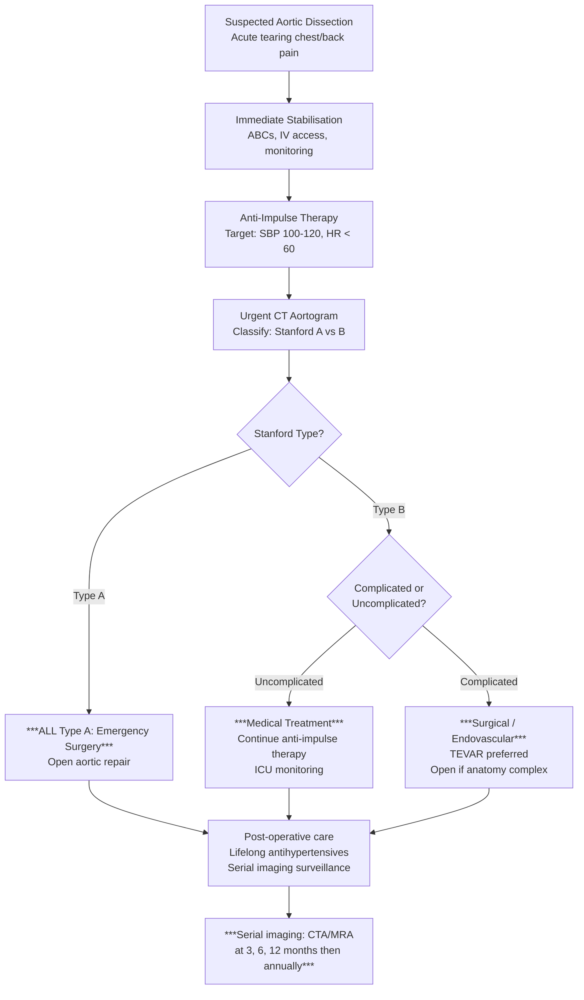

## Management of Aortic Dissection

The management of aortic dissection is a race against time — untreated Type A dissection carries ***~1% mortality per hour in the first 48 hours*** [3]. The overarching principles are simple: (1) **stabilise the patient immediately**, (2) **reduce aortic wall stress** to prevent propagation and rupture, and (3) **determine the definitive treatment** based on Stanford classification and complication status.

---

### 1. Principles of Management — First Principles

To understand management, think about what is physically happening to the aorta:

- The intimal flap is being driven apart by the **force of each heartbeat** (dP/dt — the rate of rise of aortic pressure)
- This force is determined by two factors: **blood pressure** (how much pressure) and **heart rate** (how fast the pressure cycles)
- Therefore, the fundamental medical goal is to **reduce dP/dt** — literally reduce the "impulse" of each heartbeat on the aortic wall. This is called ***anti-impulse therapy*** [3]
- The reason we target **both BP and HR** is that dropping BP alone without controlling HR can trigger **reflex tachycardia** → actually *increases* dP/dt → makes dissection worse

> Think of it like a hammer hitting a wall: you need to reduce both how hard the hammer hits (BP) and how often it hits (HR). Reducing only the force but increasing the frequency doesn't help — the wall still gets destroyed.

---

### 2. Management Algorithm — Overview

---

### 3. Immediate Stabilisation (All Patients)

Every patient with suspected aortic dissection receives these measures **immediately**, regardless of Stanford type. The goal is to buy time while awaiting imaging and definitive treatment [1][3].

#### 3A. Supportive Measures

| Measure | Rationale |
|---|---|
| ***NPO (nil by mouth)*** | Patient may need emergency surgery; general anaesthesia requires fasting to reduce aspiration risk [1] |
| ***Complete bed rest*** | Any physical activity ↑ sympathetic tone → ↑ HR and BP → ↑ dP/dt → propagation of dissection [1] |
| ***O₂ supplementation*** | Maintain SpO₂ > 94%; may be hypoxic from haemothorax, pulmonary oedema (acute AR), or shock |
| ***Cardiac monitor*** | Continuous ECG for arrhythmia detection (coronary malperfusion → MI → VT/VF); continuous BP monitoring [1] |
| ***IV access + arterial line*** | ***Arterial line for continuous BP monitoring*** (non-invasive cuff BP is intermittent and may be inaccurate with BP asymmetry) [3]; large-bore IV for fluid/drug/blood administration |
| ***Foley catheter*** | ***Monitor urine output*** — a key indicator of renal perfusion (renal malperfusion → oliguria) [3] |
| ***IV opioid analgesia*** | ***IV opioids (morphine or fentanyl)*** for pain control [3]. Pain itself causes sympathetic activation → ↑ HR and BP → worsens dissection. Adequate analgesia is therapeutic, not just humane |
| ***Book CCU / ICU bed*** | ***Intensive monitoring of BP/P, ECG, I/O*** is essential [1] |

<Callout title="Why Analgesia is Not Optional">
Pain drives the sympathetic nervous system → catecholamine surge → ↑ HR + ↑ BP → ↑ aortic wall stress → dissection propagation. Controlling pain with IV opioids is one of the most important early interventions — it directly reduces the force tearing the aorta apart.
</Callout>

#### 3B. Anti-Impulse Therapy (Medical BP/HR Control)

This is the cornerstone of acute medical management for ALL aortic dissections.

***Target goals: SBP 100–120 mmHg (MAP 60–75 mmHg) and HR < 60 bpm*** [1][3]

##### First-Line Agents

| Agent | Class | Mechanism | Dose / Route | Why First-Line |
|---|---|---|---|---|
| ***Labetalol*** | ***Combined α₁-blocker + non-selective β-blocker*** [3] | **β-blockade**: ↓ HR + ↓ contractility → ↓ dP/dt. **α₁-blockade**: ↓ SVR → ↓ SBP. The combination gives both heart rate control AND vasodilation without reflex tachycardia | ***IV 10–20 mg bolus, then infusion 1–2 mg/min, titrate to target*** [1] | ***Labetalol is a combined α- and β-blocker, and therefore confers extra vasodilating effect*** [3]. Ideal because it addresses both components (HR + BP) in one drug |
| ***Esmolol*** | **Cardioselective β₁-blocker** (ultra-short acting) | Pure β₁-blockade → ↓ HR + ↓ contractility → ↓ dP/dt. Short half-life (~9 min) allows precise titration | IV 500 μg/kg bolus over 1 min, then 50–200 μg/kg/min infusion | Preferred when you want tight control and rapid on/off (e.g., unstable patients where you might need to quickly stop the drug if BP drops too much) |
| ***Non-dihydropyridine CCBs: Diltiazem / Verapamil*** | **Non-DHP calcium channel blockers** | Block L-type Ca²⁺ channels in cardiac myocytes and SA/AV nodes → ↓ HR + ↓ contractility + some vasodilation | Diltiazem IV 0.25 mg/kg bolus then 5–15 mg/h infusion; Verapamil IV 2.5–5 mg bolus | ***Used if β-blocker is contraindicated*** [1][3] (e.g., severe asthma/COPD, decompensated HF with bradycardia). Remember these are the "non-dipine" CCBs — the amlodipine/nifedipine type CCBs cause reflex tachycardia and are NOT used |

> **Why β-blockers first?** Because they directly ↓ dP/dt (the rate of aortic pressure rise), which is the primary physical force driving dissection propagation. Other antihypertensives lower BP but may cause reflex tachycardia (↑ HR → ↑ dP/dt → worse). β-blockers prevent this.

##### Second-Line Agents (Add If First-Line Fails to Achieve Target)

| Agent | Class | Mechanism | Dose / Route | Important Caveats |
|---|---|---|---|---|
| ***Sodium nitroprusside (SNP)*** | **Direct arterial and venous vasodilator** | Releases nitric oxide → smooth muscle relaxation → ↓ SVR → ↓ BP | IV 0.25–10 μg/kg/min infusion | ***Nitroprusside alone may trigger reflex tachycardia and thus ↑ dP/dt → must be pre-treated with a β-blocker*** [3]. ***Caution if renal failure*** (accumulation of cyanide metabolite) [1]. ***Contraindicated in pregnancy*** [1] |
| **IV GTN (glyceryl trinitrate)** | Predominantly venodilator at low dose, arterial at high dose | Releases NO → ↓ preload (low dose) and ↓ afterload (high dose) | IV 5–200 μg/min | Alternative to SNP; less cyanide risk but also can cause reflex tachycardia if used without β-blocker |
| **Nicardipine** | DHP CCB (IV formulation) | Arterial vasodilation → ↓ SVR → ↓ BP; minimal reflex tachycardia at controlled infusion rates | IV 5–15 mg/h | Unlike oral nifedipine, IV nicardipine can be titrated carefully; used in some centres |

##### Contraindicated Agents

| Agent | Why Contraindicated |
|---|---|
| ***Hydralazine*** | ***Contraindicated in aortic dissection*** [1] — it is a direct arterial vasodilator that causes marked reflex tachycardia → ↑ dP/dt → propagation of dissection |
| **Oral nifedipine (sublingual)** | Same reason — causes reflex tachycardia. Never use sublingual nifedipine for BP control in dissection |
| **Thrombolytics / fibrinolytics** | ***Suspected aortic dissection is an absolute contraindication to thrombolysis*** [20]. If given to a dissection patient, it prevents haemostasis at the tear site → uncontrolled haemorrhage → death |

<Callout title="Drug Selection Logic" type="idea">
**Step 1**: Start IV β-blocker (labetalol or esmolol) → get HR < 60. **Step 2**: If SBP still > 120 despite HR < 60, add sodium nitroprusside (or nicardipine). **Never give a vasodilator without β-blocker cover first** — the reflex tachycardia is dangerous. If β-blocker CI → use diltiazem/verapamil instead, then add vasodilator if needed.
</Callout>

---

### 4. Definitive Treatment by Stanford Type

The Stanford classification directly determines management:

***Type A = surgical treatment*** [4]
***Type B = medical treatment, unless complicated*** [4]

#### 4A. Stanford Type A — Emergency Surgery

***ALL Type A dissections require emergency surgery*** [3][4]

##### Why Is Surgery Mandatory for Type A?

***Type A dissections are treated more aggressively because further proximal extension will lead to cardiac tamponade, MI, and acute aortic regurgitation*** [3]. The ascending aorta is intrapericardial — any rupture goes directly into the pericardial sac → tamponade → death within minutes. Without surgery, mortality approaches 50% at 48 hours and 80% at 2 weeks.

##### Surgical Options

| Procedure | Description | When Used |
|---|---|---|
| ***Open aortic repair (standard)*** | ***Excise the intimal tear, obliterate the entry site, place an interposition synthetic aortic graft (Dacron tube graft)*** [3] | Standard procedure for most Type A dissections involving the ascending aorta alone (DeBakey II) |
| ***Bentall procedure*** | ***Composite replacement of the aortic valve, aortic root, and ascending aorta with a valved conduit + reimplantation of coronary ostia*** [3] | ***When the aortic valve, root, and ascending aorta are all involved*** [3] — e.g., significant AR from root dilatation, annuloaortic ectasia (Marfan), or irreparable valve damage |
| **Valve-sparing root replacement (David or Yacoub procedure)** | Replace the aortic root and ascending aorta but preserve the native aortic valve leaflets by reimplanting them inside the graft | Used when the aortic valve leaflets are structurally normal but the root is dilated — avoids lifelong anticoagulation of a mechanical valve. Increasingly favoured in younger patients and Marfan patients |
| **Hemiarch or total arch replacement** | Extension of the graft to replace part or all of the aortic arch | When dissection extends into the arch; total arch replacement may use the "frozen elephant trunk" technique (hybrid open + endovascular) |
| ***Aortic valve repair/replacement*** | ***± repair or replacement of the aortic valve*** [3] | If acute AR is present — may use mechanical valve (requires lifelong warfarin), bioprosthetic valve, or repair |

**Operative Principles:**
- Performed under **deep hypothermic circulatory arrest (DHCA)** at 18–22°C — the body is cooled to reduce metabolic demand during the period when the heart and brain receive no blood flow (while the arch is being repaired)
- **Cardiopulmonary bypass (CPB)** is essential — the heart must be arrested and circulation maintained by a heart-lung machine
- The surgeon opens the ascending aorta, identifies the entry tear, and resects the affected segment
- The false lumen is obliterated and the graft is sewn in place
- Coronary ostia are reimplanted if the root is replaced

##### Emergency Pericardiocentesis

***Emergency pericardiocentesis if cardiac tamponade*** [3] — this is a temporising measure to relieve tamponade physiology while awaiting definitive surgery. However, there is a risk: removing too much pericardial blood may "release the tamponade effect" that was paradoxically limiting further bleeding → sudden increase in bleeding rate. Therefore, pericardiocentesis should only drain enough to restore haemodynamic stability, and surgery should follow immediately.

#### 4B. Stanford Type B — Uncomplicated

***Uncomplicated Type B dissection is managed medically*** [4].

"Uncomplicated" means:
- No malperfusion syndrome (no end-organ ischaemia)
- No rupture or impending rupture
- No uncontrolled pain despite maximal medical therapy
- No rapid false lumen expansion
- No retrograde extension into the ascending aorta

**Medical management consists of:**
1. **Anti-impulse therapy** (as described above) — continued until stable
2. **Transition to oral antihypertensives** once stabilised:
   - Oral β-blocker (e.g., atenolol, bisoprolol, carvedilol)
   - ± CCB, ACE inhibitor/ARB as needed to achieve target
3. ***Lifelong antihypertensive therapy to aim target BP < 120/80 mmHg*** [3]
4. **ICU monitoring** for at least 48–72 hours to detect complications early
5. ***Serial imaging (MRA/CTA at 3, 6, 12 months) to detect recurrence, aneurysm, leakage*** [3]

> Why is medical management sufficient for uncomplicated Type B? Because the descending aorta is outside the pericardium — there is no immediate risk of tamponade or coronary/cerebral malperfusion. The natural history is much better: with medical therapy alone, in-hospital mortality for uncomplicated Type B is ~10%, and many patients do well long-term with aggressive BP control and surveillance.

#### 4C. Stanford Type B — Complicated

***Complicated Type B dissection requires intervention (surgical or endovascular)*** [1][3]

##### Indications for Intervention in Type B

| Complication | Why It Mandates Intervention |
|---|---|
| ***Malperfusion of distal organs*** (renal, mesenteric, limb ischaemia) [1][3] | Ongoing end-organ damage is irreversible if not restored. Mesenteric ischaemia in particular has very high mortality if untreated |
| ***Associated aneurysm formation*** [3] | Progressive dilatation of the false lumen → ↑ risk of rupture |
| ***Rupture (haemothorax, haemomediastinum)*** [3] | Active haemorrhage → imminent death |
| ***Retrograde dissection into ascending aorta*** [3] | Effectively becomes a Type A dissection → emergent surgery |
| ***Marfan syndrome*** [3] | Intrinsic connective tissue weakness → higher risk of progression even if initially uncomplicated |
| **Refractory pain** | Ongoing pain despite maximal medical therapy suggests ongoing dissection propagation |
| **Refractory hypertension** | Cannot achieve target SBP despite maximal IV anti-impulse therapy → ongoing wall stress |
| **Rapid false lumen expansion** | Progressive ↑ in false lumen diameter on serial imaging → impending rupture |

##### Interventional Options for Complicated Type B

| Procedure | Description | When Used |
|---|---|---|
| ***TEVAR (Thoracic Endovascular Aortic Repair)*** | A covered stent-graft is deployed via femoral artery access under fluoroscopic guidance. The stent covers the primary entry tear in the descending aorta → seals off flow into the false lumen → promotes false lumen thrombosis and aortic remodelling | ***Endovascular stent-grafting is the preferred approach*** for most complicated Type B dissections [3]. Less invasive than open surgery, lower perioperative mortality |
| ***Open surgical repair*** | Thoracotomy → resection of affected descending aorta → interposition graft | ***If anatomy is complex*** (e.g., involvement of visceral branches not amenable to TEVAR, connective tissue disease where stent durability is questioned, or failed TEVAR) [3] |
| **Fenestration procedures** | Endovascular creation of a tear in the intimal flap to allow communication between true and false lumens → equalises pressure → restores flow to malperfused branches | Used specifically for malperfusion syndromes where the intimal flap is compressing true lumen. Can be percutaneous (balloon fenestration) or surgical |
| **Branch vessel stenting** | Stenting of specific malperfused branch arteries (renal, SMA, iliac) | Adjunct to TEVAR or fenestration when individual branches are compromised |

**TEVAR — How It Works (From First Principles):**
- "TEVAR" = **T**horacic **E**ndovascular **A**ortic **R**epair
- A sheathed stent-graft is advanced retrogradely via the femoral artery into the descending thoracic aorta
- Under fluoroscopic guidance, it is positioned to cover the primary intimal entry tear
- When deployed, the stent-graft expands against the true lumen wall, sealing the entry point
- With the entry tear sealed, flow into the false lumen is eliminated → the false lumen gradually thromboses and may eventually remodel
- This restores flow through the true lumen and relieves malperfusion

**Complications of TEVAR:**
- Endoleak (persistent flow into false lumen despite stent)
- Stent migration
- Access site injury (femoral artery)
- Spinal cord ischaemia (coverage of intercostal arteries including the artery of Adamkiewicz → paraplegia — risk ~3–5%)
- Retrograde Type A dissection (rare but catastrophic — the stent deployment can create a new tear in the ascending aorta)
- Stroke

---

### 5. Management of Specific Complications

| Complication | Management |
|---|---|
| **Cardiac tamponade** | ***Emergency pericardiocentesis*** [3] as bridge to surgery; definitive treatment is emergent open repair (Type A) |
| **Acute aortic regurgitation** | Emergent surgery — aortic valve repair or replacement (often as part of Bentall procedure) |
| **Coronary malperfusion → MI** | Emergent surgery with coronary revascularisation (reimplantation of coronary ostia or CABG); do NOT give thrombolytics |
| **Stroke (carotid malperfusion)** | Emergent aortic repair is the priority — restoring true lumen flow may restore cerebral perfusion; thrombolysis is absolutely contraindicated |
| **Mesenteric ischaemia** | TEVAR + fenestration/branch stenting; if bowel necrosis → laparotomy and resection |
| **Renal malperfusion → AKI** | TEVAR/fenestration to restore renal perfusion; may need temporary renal replacement therapy |
| **Acute limb ischaemia** | TEVAR + iliac stenting or surgical bypass; femoral embolectomy if embolic component |

---

### 6. Long-Term Management (All Patients)

After surviving the acute phase (whether treated medically or surgically), every patient needs lifelong follow-up:

| Measure | Rationale |
|---|---|
| ***Lifelong antihypertensive therapy aiming for BP < 120/80 mmHg*** [3] | Uncontrolled HTN is the #1 driver of recurrent dissection, false lumen expansion, and aneurysm formation. Oral β-blockers are the backbone of long-term therapy |
| ***Serial imaging: CTA or MRA at 3, 6, 12 months, then annually*** [3] | Monitor for: (1) false lumen expansion, (2) new/recurrent dissection, (3) aneurysmal degeneration, (4) endoleak after TEVAR |
| **Cardiovascular risk factor modification** | Smoking cessation (absolute), lipid control (statins), diabetes management, weight management |
| **Genetic counselling** | If connective tissue disease suspected (Marfan, EDS, Loeys-Dietz) → refer for genetic testing; screen first-degree relatives |
| **Activity restriction** | Avoid isometric exercise (heavy weightlifting), competitive sports, and stimulant drugs (cocaine). Moderate aerobic exercise is generally permitted |
| **Anticoagulation** | Generally NOT used chronically in dissection (increases bleeding risk from the false lumen). Exception: if concurrent AF or mechanical valve post-Bentall |

---

### 7. Summary Table: Management by Stanford Type

| | ***Type A*** | ***Type B — Uncomplicated*** | ***Type B — Complicated*** |
|---|---|---|---|
| **Acute medical Mx** | Anti-impulse therapy (bridge to surgery) | Anti-impulse therapy (definitive) | Anti-impulse therapy + plan intervention |
| **Definitive Mx** | ***Emergency open surgery (ALL patients)*** | ***Medical management*** | ***TEVAR (preferred) or open repair*** |
| **Surgical procedure** | Open aortic repair ± valve (Bentall if root involved) | — | TEVAR ± fenestration ± branch stenting |
| **BP target** | SBP 100–120, HR < 60 (acute); < 120/80 (chronic) | Same | Same |
| **Long-term** | Lifelong antihypertensives + serial imaging | Same | Same |

---

### 8. Management of Other Acute Aortic Syndromes

| Entity | Type A (involves ascending) | Type B (spares ascending) |
|---|---|---|
| **Intramural Haematoma (IMH)** | Emergency surgery (same as Type A dissection — IMH has similar risk of progression to tamponade/rupture) | Medical management with close surveillance; some progress to dissection/rupture (20–30%) → intervene if progression |
| **Penetrating Atherosclerotic Ulcer (PAU)** | Rare in ascending aorta; surgery if present | Medical management if stable; TEVAR if symptomatic, expanding, or complicated |

---

<Callout title="High Yield Summary">

**Immediate stabilisation (ALL patients)**:
- NPO, bed rest, O₂, cardiac monitor, arterial line, Foley, IV opioids, ICU bed

**Anti-impulse therapy targets**: ***SBP 100–120 mmHg, HR < 60 bpm***
- ***1st line: IV β-blocker (labetalol or esmolol) or non-DHP CCB (diltiazem/verapamil if BB CI)***
- ***2nd line: add sodium nitroprusside (ONLY after β-blocker cover — never alone due to reflex tachycardia)***
- ***Hydralazine is CONTRAINDICATED (reflex tachycardia)***
- ***Thrombolytics are ABSOLUTELY CONTRAINDICATED***

**Definitive treatment**:
- ***Type A: ALL → Emergency open surgery*** (excise tear, interposition graft ± Bentall if root/valve involved)
- ***Type B uncomplicated: Medical management*** (anti-impulse therapy → oral antihypertensives)
- ***Type B complicated*** (malperfusion, rupture, retrograde extension, aneurysm, Marfan): ***TEVAR preferred, open if complex anatomy***
- ***Emergency pericardiocentesis if tamponade***

**Long-term**: ***Lifelong BP < 120/80, serial CTA/MRA at 3, 6, 12 months then annually***

</Callout>

---

<ActiveRecallQuiz
  title="Active Recall - Management of Aortic Dissection"
  items={[
    {
      question: "What are the acute BP and HR targets in aortic dissection, and what is the physiological rationale for targeting both?",
      markscheme: "Target SBP 100-120 mmHg and HR <60 bpm. Rationale: both determine dP/dt (rate of aortic pressure rise per heartbeat), which is the primary force driving dissection propagation. Lowering BP alone without HR control causes reflex tachycardia which increases dP/dt. Both must be controlled simultaneously (anti-impulse therapy)."
    },
    {
      question: "What is the first-line anti-impulse agent for aortic dissection, and why is it particularly well-suited? What is given if it is contraindicated?",
      markscheme: "First-line: IV labetalol or esmolol. Labetalol is a combined alpha-1 and non-selective beta-blocker, so it reduces HR and contractility (beta-blockade decreasing dP/dt) AND causes vasodilation (alpha-blockade lowering SVR/BP) in one drug without reflex tachycardia. If beta-blockers are contraindicated (e.g. severe asthma/COPD): use non-dihydropyridine CCBs (diltiazem or verapamil)."
    },
    {
      question: "Why is sodium nitroprusside dangerous if given alone in aortic dissection? How should it be used safely?",
      markscheme: "Nitroprusside is a pure vasodilator that lowers BP but triggers reflex tachycardia via baroreceptor response. Reflex tachycardia increases dP/dt which worsens dissection propagation. It must ONLY be used after pre-treatment with a beta-blocker (to block the reflex tachycardia). Additional caution: cyanide toxicity in renal failure; contraindicated in pregnancy."
    },
    {
      question: "State the management strategy for each Stanford type: Type A, uncomplicated Type B, and complicated Type B. Include the typical surgical procedure for each.",
      markscheme: "Type A: ALL require emergency open surgical repair - excise intimal tear, interposition synthetic graft, plus Bentall procedure if aortic valve/root/ascending all involved. Type B uncomplicated: medical management with anti-impulse therapy, transition to oral antihypertensives, lifelong BP control. Type B complicated (malperfusion, rupture, retrograde extension, aneurysm, Marfan): TEVAR (thoracic endovascular aortic repair) preferred; open repair if anatomy complex."
    },
    {
      question: "Name 2 drugs that are absolutely contraindicated in acute aortic dissection and explain why for each.",
      markscheme: "1. Hydralazine: direct arteriolar vasodilator causing marked reflex tachycardia which increases dP/dt and worsens dissection propagation. 2. Thrombolytics (e.g. tPA, streptokinase): aortic dissection is an absolute contraindication because thrombolytics prevent haemostasis at the tear site leading to uncontrolled haemorrhage and death. This is especially dangerous when dissection mimics STEMI via coronary malperfusion."
    },
    {
      question: "What is the recommended long-term follow-up protocol after aortic dissection, including BP target and imaging schedule?",
      markscheme: "Lifelong antihypertensive therapy targeting BP <120/80 mmHg (oral beta-blocker as backbone). Serial imaging with CTA or MRA at 3, 6, and 12 months, then annually. Monitoring for: false lumen expansion, recurrent/new dissection, aneurysmal degeneration, endoleak (if TEVAR). Also: CV risk factor modification, activity restriction (avoid isometric exercise, cocaine), genetic counselling if CTD suspected."
    }
  ]}
/>

## References

[1] Senior notes: Maksim Medicine Notes.pdf (p15 — management: supportive measures, anti-impulse therapy targets, labetalol, nitroprusside caveats, hydralazine CI, surgical indications)
[3] Senior notes: Ryan Ho Cardiology.pdf (p221 — management: supportive, anti-impulse therapy, first-line and second-line agents, surgical indications Type A and B, Bentall procedure, TEVAR, pericardiocentesis, lifelong antihypertensives, serial imaging; p220 footnotes on labetalol MOA, nitroprusside reflex tachycardia, Type A rationale)
[4] Lecture slides: Cardiac Surgery Tutorial_Prof. D Chan.pdf (p72 — Type A = surgical, Type B = medical unless complicated, DeBakey I most common and worst)
[5] Senior notes: Ryan Ho Radiology.pdf (p4 — endovascular intervention for traumatic aortic injury)
[19] Senior notes: Ryan Ho Critical Care.pdf (p17 — initial investigations and monitoring in shock)
[20] Senior notes: Ryan Ho Cardiology.pdf (p138 — suspected aortic dissection as absolute contraindication to thrombolysis)
[21] Senior notes: Ryan Ho Cardiology.pdf (p182 — hypertensive emergency management, SBP target < 120 in aortic dissection)
[22] Senior notes: Ryan Ho Diagnostic Radiology.pdf (p84-85 — endovascular stenting principles, stent graft for aneurysm repair)
