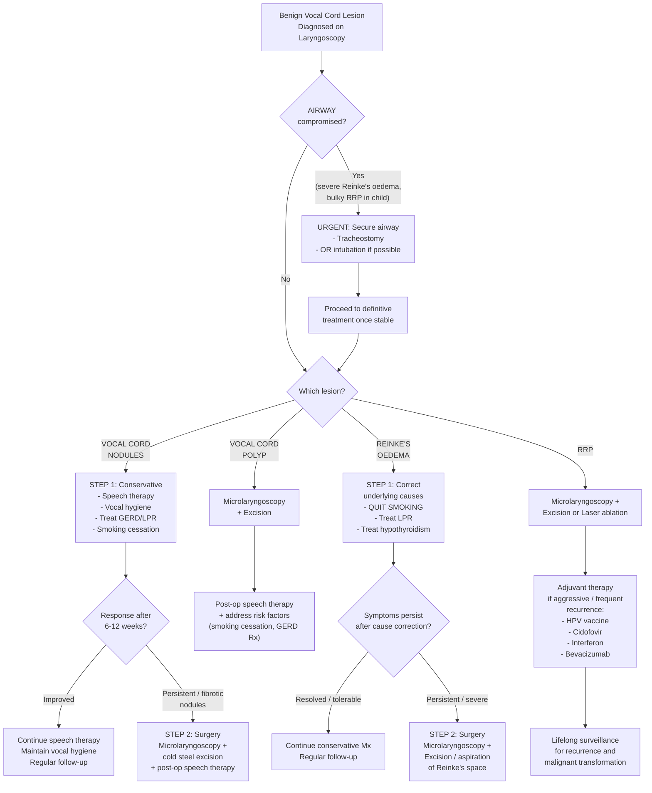

## Management of Benign Lesions of the Vocal Cord

### 1. General Principles of Management

Before diving into lesion-specific treatments, understand the overarching philosophy:

1. **Address the underlying cause first** — every benign vocal cord lesion has a causative or aggravating factor. If you don't address it, the lesion will recur after treatment (e.g., if you excise a polyp but the patient keeps smoking → the conditions for another polyp remain).

2. **Conservative before surgical** — for lesions driven by behaviour (nodules), behavioural modification (speech therapy) is the primary treatment. Surgery is reserved for lesions that are structural (polyps, severe Reinke's oedema) or recurrent (RRP).

3. **Preserve the layered microanatomy** — the goal of any vocal fold surgery is to remove the lesion while **preserving the superficial lamina propria (Reinke's space)** and the mucosal wave. Aggressive surgery that scars the SLP will trade one voice problem for another (scarring → stiff fold → permanent hoarseness).

4. **Airway takes priority** — in severe Reinke's oedema or RRP with airway compromise, securing the airway (tracheostomy) may be the first step before definitive treatment.

---

### 2. Management Algorithm

---

### 3. Lesion-Specific Management

#### 3.1 Vocal Cord Nodules

> ***Management: speech therapy, vocal hygiene*** [1]

**Why is conservative management first-line?** Because nodules are fundamentally a **behavioural disease** — they are caused by ***voice abuse*** [1]. The pathophysiology is: ***vocal trauma → localised oedema → fibrosis → nodules*** [1]. If you remove the causative behaviour (voice abuse), early oedematous nodules can **regress spontaneously**. Only mature, fibrotic nodules that fail conservative therapy need surgery.

##### A. Speech Therapy (First-line)

***Speech therapy*** is the **most widely accepted treatment** [2]:

| Component | What It Involves | Why It Works |
|:----------|:-----------------|:-------------|
| **Vocal hygiene education** | Avoid shouting, whispering (paradoxically strains the cords), throat clearing, excessive caffeine/alcohol (dehydrating), smoking | Reduces the mechanical and chemical insults that drive the oedema → fibrosis cycle |
| **Voice technique training** | Breath support, resonant voice therapy, reducing laryngeal tension, projection without strain | Teaches the patient to phonated efficiently — less force per vibration cycle → less microtrauma |
| **Hydration** | Adequate systemic hydration (drink water), mucolytics if needed, humidification | Vocal fold mucosa needs to be well-hydrated for efficient vibration; dehydrated mucosa is stiffer and more injury-prone |
| **Amplification devices** | Microphones/amplifiers for teachers | Reduces the need to project, lowering phonatory effort |

**Expected timeline**: Improvement typically seen within **6–12 weeks** of consistent speech therapy. If no improvement after 3 months of compliant therapy → reassess.

##### B. Medical Adjuncts

- **GERD/LPR treatment**: Proton pump inhibitors (PPIs) — acid reflux reaching the posterior larynx causes chemical irritation and oedema that contributes to nodule formation/persistence. Treating reflux reduces the inflammatory load on the vocal folds [2].
- **Smoking cessation**: Smoking causes chronic mucosal inflammation, and combined with voice abuse, accelerates the oedema → fibrosis pathway [2].

##### C. Surgery (Second-line — for refractory cases)

***Microlaryngeal surgery may be indicated for persistent symptoms*** [2]:

- **Indication**: Mature, fibrotic nodules that fail to respond to ≥ 3 months of speech therapy
- **Technique**: Microlaryngoscopy under GA → **cold steel excision** (microsurgical instruments: microflap technique to precisely excise the nodule while preserving the underlying SLP) [2]
- **Post-operative**: Speech therapy is **mandatory** after surgery — without it, the same vocal behaviour that caused the original nodules will cause recurrence
- **CO2 laser**: Generally NOT preferred for nodules as it causes more thermal damage to adjacent tissues than cold steel

<Callout title="Critical Point" type="error">
Never operate on vocal cord nodules without a trial of speech therapy first. Surgery without behavioural modification = recurrence. And never excise both nodules in the same session at the exact opposing point — this risks **anterior commissure web formation** (adhesion of the two raw surfaces → permanent hoarseness). If bilateral surgery is needed, stage the excisions or excise only one side at a time, or use a microflap technique that preserves epithelium.
</Callout>

---

#### 3.2 Vocal Cord Polyps

> ***Management: Microlaryngoscopy + Excision*** [1]

**Why is surgery first-line (unlike nodules)?** Because a polyp is a **structural lesion** — an ***organised haematoma*** [1] — that represents a completed pathological process. The haematoma has already organised into fibrous tissue and dilated vessels. Unlike the oedematous early nodule, it will NOT reabsorb with voice therapy alone. You need to physically remove it.

##### A. Surgical Excision (First-line)

**Technique**: ***Microlaryngoscopy + cold steel excision (instruments like forceps, scissors)*** [2]:

1. Patient under general anaesthesia with endotracheal intubation (using a small-diameter tube to maximise working space)
2. Rigid laryngoscope (e.g., Lindholm or Kleinsasser) placed to expose the vocal folds
3. Operating microscope provides magnification
4. The polyp is grasped with microlaryngeal forceps and excised using microscissors or a microflap technique
5. The goal: remove the polyp while **preserving the underlying SLP and vocal ligament** — overly aggressive excision damages Reinke's space → scarring → worse voice than before

**Alternative**: ***CO2 laser*** — ***less bleeding but more time-consuming, reserved for complicated cases*** [2]. The CO2 laser vaporises tissue with precision but carries risk of **thermal spread** to adjacent normal tissue. It's preferred for:
- Highly vascular polyps (reduces intraoperative bleeding)
- Polyps in difficult anatomical locations (e.g., anterior commissure)
- Simultaneous treatment of other lesions (e.g., coexisting vascular ectasia)

**KTP laser** (532nm): An angiolytic laser that targets haemoglobin in feeding vessels. Increasingly used for vascular polyps — it can be delivered through a flexible fibre in awake office-based procedures.

##### B. Post-operative Care

- **Voice rest**: Strict voice rest for 5–7 days post-operatively → allows mucosal healing without shear forces from vibration
- **Speech therapy**: Post-operative voice therapy is essential to prevent recurrence and to optimise voice recovery
- **Address risk factors**: Smoking cessation, GERD/LPR treatment [2]

##### C. Voice Therapy Alone?

> ***Surgical treatment is often necessary although voice therapy is usually attempted*** [2]

Some clinicians will trial a short period of voice therapy before proceeding to surgery, especially if the polyp is small and recent (might still have a significant oedematous/haemorrhagic component that could partially resolve). However, most established polyps require excision.

**Contraindication to immediate surgery**: Active vocal fold haemorrhage — operate when the acute haemorrhage has settled (2–3 weeks), otherwise you cannot distinguish haematoma from polyp and risk over-excision.

---

#### 3.3 Polypoid Corditis (Reinke's Oedema)

> ***Management*** [1]:
> - ***Correct underlying causes (quit smoking!!)***
> - ***Microlaryngoscopy + Excision***

##### A. Correct Underlying Causes (First-line — Essential)

This cannot be overstated: ***quit smoking!!*** [1] — Reinke's oedema is almost invariably driven by smoking. Without smoking cessation, surgery will only provide temporary improvement before the oedema recurs.

| Cause | Treatment |
|:------|:----------|
| ***Smoking*** | ***Quit smoking*** [1] — single most important intervention |
| ***Laryngeal reflux*** | PPI therapy (omeprazole/esomeprazole) + lifestyle measures (elevate head of bed, avoid late meals) [1][2] |
| ***Hypothyroidism*** | Thyroid hormone replacement (levothyroxine) — myxoedematous fluid contributes to SLP oedema [1][2] |
| Vocal hyperfunctioning | Speech therapy [2] |

> **Why must you address the cause BEFORE or WITH surgery?** Reinke's oedema arises from chronic capillary damage in Reinke's space → fluid extravasation [2]. If you aspirate/excise the fluid surgically but the capillaries are still being damaged by smoke → the fluid reaccumulates. It's like mopping a floor under a leaking roof without fixing the roof.

##### B. Surgery (For persistent or severe cases)

**Indications**:
- Symptoms persist despite cause correction (smoking cessation, reflux treatment) for ≥ 3–6 months
- Severe oedema causing significant voice impairment or **respiratory compromise** [2]
- Patient requires rapid voice improvement for occupational reasons

**Technique**: ***Microlaryngoscopy + Excision*** [1]:

1. Under GA, the vocal fold is incised along its superior surface (microflap technique)
2. The gelatinous, viscous fluid in Reinke's space is **aspirated** or the redundant mucosa is **trimmed** (stripping)
3. The epithelial flap is repositioned back over the body of the vocal fold
4. **Critical**: avoid stripping too much mucosa — excessive stripping causes **scarring of Reinke's space** → loss of mucosal wave → permanent dysphonia

**Bilateral surgery**: Can be performed in one session but must be careful to:
- **Avoid stripping the anterior commissure bilaterally** → risk of web formation (anterior glottic web)
- Some surgeons stage bilateral procedures (one side per session, 6–8 weeks apart) for safety

##### C. Post-operative

- Smoking cessation (non-negotiable)
- Speech therapy
- PPI therapy continued for LPR
- Follow-up laryngoscopy to assess resolution

---

#### 3.4 Recurrent Respiratory Papillomatosis (RRP)

> ***Management*** [1]:
> - ***Microlaryngoscopy + Excision***
> - ***HPV vaccine reduces recurrence***
> - ***Adjuvant medical therapy (Cidofovir, alpha interferon, Avastin, etc.)***

Also from senior notes [2]:
> ***No cure for the disease and surgery has an ongoing role of palliation***
> ***Most children with RRP require multiple surgical treatments before puberty and the natural history is eventual recurrence***

RRP is the most complex benign lesion to manage because **there is no cure** — HPV persists in a latent state in the adjacent "normal" mucosa, and recurrence is the rule, not the exception.

##### A. Airway Management (Emergency, if needed)

- ***Tracheostomy*** [2]: For children with severe airway obstruction from bulky papillomata
  - **Avoided if at all possible** because tracheostomy creates a **new squamocolumnar junction** at the stoma → HPV has a predilection for these junctions → papillomata can seed at the tracheostomy site and even extend into the tracheobronchial tree ("distal spread")
  - Used only as a **last resort** when repeated surgical debulking cannot maintain a safe airway

##### B. Surgical Debulking (Mainstay)

***Microlaryngeal surgery with excision or laser ablation*** [2]:

| Technique | Mechanism | Advantages | Disadvantages |
|:----------|:----------|:-----------|:--------------|
| ***Cold steel excision*** (microdebrider) | Powered rotary blade shaves papilloma tissue | Precise, preserves underlying SLP, fast, good for bulky disease | Requires skill to avoid over-excision; some bleeding |
| ***CO2 laser*** | Thermal vaporisation of papilloma tissue | Excellent haemostasis; precise; good for small lesions | Risk of thermal damage to adjacent normal mucosa; potential for airway fire (laser + O2 in closed space); slower for bulky disease [2] |
| **KTP laser** (532nm) | Angiolytic — targets haemoglobin in papilloma feeding vessels | Can be used in awake, office-based setting; selective vascular targeting reduces collateral damage | Less effective for very bulky disease |
| **Pulsed dye laser** | Similar angiolytic principle | Office-based; emerging evidence | Limited availability |

**Surgical goal**: Remove papillomata to maintain a **safe airway** and an **acceptable voice** — NOT to achieve perfect-looking vocal folds. Over-aggressive excision strips the SLP → scarring → permanent dysphonia. It is better to leave a small amount of papilloma tissue than to scar the vocal fold.

> **Why multiple surgeries?** ***No cure for the disease*** [2] — excision removes visible papillomata but HPV remains latent in adjacent epithelium. ***Most children with RRP require multiple surgical treatments before puberty and the natural history is eventual recurrence*** [2]. Some children need surgery every 2–4 weeks during active disease phases.

##### C. Adjuvant Medical Therapy

These are used when surgical frequency is unacceptably high (e.g., > 4 surgeries per year) or when disease is particularly aggressive:

> ***Adjuvant medical therapy (Cidofovir, alpha interferon, Avastin, etc.)*** [1]

| Agent | Mechanism | Route | Evidence/Notes |
|:------|:----------|:------|:---------------|
| ***Cidofovir*** | Nucleotide analogue — inhibits viral DNA polymerase; selectively toxic to HPV-infected cells | Intralesional injection (during microlaryngoscopy) | Most widely used adjuvant; can prolong inter-surgical intervals; concern about theoretical nephrotoxicity (minimal with intralesional route) and potential carcinogenicity (animal data, but not confirmed in humans) |
| ***Alpha interferon*** (IFN-α) | Antiviral and immunomodulatory — upregulates MHC-I, enhances NK cell activity against HPV-infected cells | Systemic (subcutaneous injection) | Was first-line adjuvant; effective in ~50% of patients; significant side effects (flu-like symptoms, neutropaenia, depression); largely replaced by cidofovir |
| ***Bevacizumab (Avastin)*** | Anti-VEGF monoclonal antibody — targets the rich vascular supply of papillomata ("beva" = bevacizumab, "cizumab" = chimeric monoclonal antibody) | Intralesional injection or systemic (for severe cases) | Emerging evidence; particularly useful for highly vascular papillomata; reduces the blood supply feeding papilloma growth |
| **Indole-3-carbinol (I3C)** | Dietary supplement (from cruciferous vegetables) — alters oestrogen metabolism; mechanism in RRP unclear | Oral | Limited evidence; sometimes used as adjunct; low toxicity |
| **Celecoxib** | COX-2 inhibitor — COX-2 is upregulated in RRP, promoting cell proliferation | Oral | Limited evidence; being studied |

##### D. HPV Vaccination

> ***HPV vaccine reduces recurrence*** [1]

This is an important **therapeutic** (not just preventive) use of HPV vaccination:

- **Gardasil 9** (9-valent HPV vaccine covering subtypes 6, 11, 16, 18, 31, 33, 45, 52, 58) includes the RRP-causing subtypes 6 and 11
- **As therapeutic adjuvant**: Growing evidence that administering HPV vaccine to patients with established RRP **reduces recurrence rates** and **prolongs inter-surgical intervals** [1]. The proposed mechanism: the vaccine boosts the patient's immune response against HPV L1 capsid proteins, augmenting clearance of residual latent virus
- **As primary prevention**: Widespread HPV vaccination of the population will reduce maternal HPV carriage → fewer infected birth canals → fewer cases of juvenile-onset RRP. This is already being observed in HPV-vaccinated populations

##### E. Surveillance

- **Lifelong follow-up** is required (especially adult-onset RRP)
- Regular laryngoscopy to monitor for recurrence
- Watch for **malignant transformation** → ***malignant transformation (→ SCC)*** [1] — reported in ~3–5% of RRP cases, more common with HPV subtype 11 and in patients who have received radiation therapy (which is therefore contraindicated in RRP)

<Callout title="Key Point — Radiation is Contraindicated in RRP" type="error">
Never irradiate RRP. Radiation therapy accelerates malignant transformation of HPV-infected epithelium. This is why surgery (not radiation) is the mainstay of treatment, even though the disease is recurrent.
</Callout>

---

### 4. Management of Vocal Cord Palsy (For Completeness)

Since vocal cord palsy is a key differential and may be encountered alongside benign lesions, here is the management framework from the lecture slides:

#### Unilateral Vocal Cord Palsy

> ***Unilateral vocal cord palsy*** [1]:
> - ***Hoarseness, choking***
> - ***Work up for underlying cause***
> - ***Treatment aim: improve voice and reduce choking***
> - ***Speech therapy***
> - ***Vocal cord medialisation procedure (e.g. injection laryngoplasty, thyroplasty)*** [1]

| Treatment | Mechanism | Indication |
|:----------|:----------|:-----------|
| **Speech therapy** | Trains the patient to compensate by increasing contralateral fold adduction force and supraglottic compression | First-line; mild symptoms; awaiting spontaneous recovery (idiopathic palsy may recover in 6–12 months) |
| ***Injection laryngoplasty*** [1] | Material (hyaluronic acid, calcium hydroxyapatite, fat) injected into the paralysed fold → medialises it → improves glottic closure | Temporary measure (HA lasts ~6 months); used while awaiting recovery or as a bridge to thyroplasty |
| ***Thyroplasty*** [1] (Type I medialization) | A silicone or Gore-Tex implant is placed through a window in the thyroid cartilage → pushes the paralysed fold medially → permanent medialisation | Permanent palsy confirmed (no recovery after 12 months); provides stable, long-term voice improvement |

#### Bilateral Vocal Cord Palsy

> ***Bilateral vocal cord palsy*** [1]:
> - ***SOB, stridor, hoarseness, choking***
> - ***Tracheostomy for airway protection*** [1]

Additional options [2]:
- ***Lateralisation of vocal cord*** — suture one cord laterally to widen the glottic airway
- ***Arytenoidectomy*** — remove one arytenoid cartilage to open the posterior glottis [2]
- ***Laryngeal reinnervation*** — re-establish nerve supply (long-term option) [2]

> **Why is bilateral palsy so different from unilateral?** In bilateral palsy, the cords are often paralysed in a ***paramedian position*** [2] — close to midline. This means the **airway is critically narrowed** (stridor, SOB) but the voice may be paradoxically preserved (because the folds are close enough to vibrate). The priority shifts from voice to **airway** — hence ***tracheostomy for airway protection*** [1].

---

### 5. Summary: Management Comparison Table

| Lesion | First-line | Surgical Option | Key Surgical Technique | Essential Adjunct | Contraindication / Caution |
|:-------|:-----------|:----------------|:----------------------|:------------------|:---------------------------|
| **Nodules** | ***Speech therapy, vocal hygiene*** [1] | Microlaryngoscopy + cold steel excision [2] | Microflap technique; preserve SLP | Treat GERD; stop smoking | Do NOT operate without trial of speech therapy; avoid bilateral anterior commissure excision |
| **Polyp** | ***Microlaryngoscopy + Excision*** [1] | Primary treatment | ***Cold steel excision*** [2] or ***CO2 laser*** [2] | Post-op speech therapy; address risk factors | Avoid surgery during active haemorrhage; preserve SLP |
| **Reinke's oedema** | ***Correct underlying causes (quit smoking!!)*** [1] | ***Microlaryngoscopy + Excision*** [1] | Aspiration/trimming of SLP fluid; microflap | Smoking cessation (non-negotiable); treat LPR and hypothyroidism [1] | Avoid excessive mucosal stripping; stage bilateral procedures if needed |
| **RRP** | ***Microlaryngoscopy + Excision*** [1] | Primary and ongoing treatment | CO2 laser / microdebrider / KTP laser [2] | ***HPV vaccine***; ***Cidofovir, interferon, Avastin*** [1] | **Radiation is CONTRAINDICATED** (accelerates malignant transformation); avoid tracheostomy if possible |
| **Unilateral VCP** | Speech therapy + work up cause [1] | ***Injection laryngoplasty / Thyroplasty*** [1] | Medialisation procedure | Investigate and treat underlying cause | Do not perform permanent thyroplasty before allowing time for spontaneous recovery (12 months) |
| **Bilateral VCP** | ***Tracheostomy*** [1] | Lateralisation / Arytenoidectomy [2] | Open posterior glottis | Airway takes priority over voice | Every procedure that opens the airway worsens the voice (trade-off) |

---

### 6. Indications and Contraindications — Detailed

#### 6.1 Speech Therapy

**Indications**:
- All vocal cord nodules (first-line) [1]
- Pre-operative optimisation for polyps (some centres)
- Post-operative rehabilitation after ANY vocal fold surgery
- Functional dysphonia (MTD)
- Mild unilateral vocal cord palsy [1]

**Contraindications**: None absolute. Relative: patient with suspected malignancy (don't delay investigation with therapy trial); non-compliant patient unlikely to benefit.

#### 6.2 Microlaryngoscopy + Excision

**Indications**:
- ***Vocal cord polyp*** (primary treatment) [1]
- Vocal cord nodules refractory to speech therapy [2]
- ***Reinke's oedema*** persistent despite cause correction [1]
- ***RRP*** (repeated as needed) [1][2]
- Biopsy of suspicious lesions (leukoplakia, erythroplakia)

**Contraindications**:
- **Absolute**: Uncontrolled coagulopathy; unsafe for general anaesthesia
- **Relative**: Active vocal fold haemorrhage (wait 2–3 weeks for resolution); unstable airway (secure first with tracheostomy before elective microlaryngoscopy); nodules that haven't had adequate speech therapy trial

#### 6.3 CO2 Laser

**Indications**: Vascular polyps; RRP (excision and ablation); complicated lesions at anterior commissure [2]

**Contraindications/Cautions**:
- **High FiO2** — risk of **airway fire** (laser + oxygen in closed space). Use lowest possible FiO2, consider jet ventilation, use laser-safe endotracheal tubes
- Not preferred for simple nodule excision (thermal damage outweighs benefit)
- Avoid in anterior commissure web-prone situations (thermal scarring risk)

#### 6.4 Tracheostomy

**Indications**:
- Bilateral vocal cord palsy with airway compromise [1][2]
- Severe RRP with airway obstruction as a temporary measure [2]
- Severe Reinke's oedema with respiratory compromise (rare) [2]

**Contraindications**: Relative — in RRP, tracheostomy should be **avoided if possible** because of the risk of distal seeding of papillomata at the stoma site and tracheobronchial tree.

---

<Callout title="High Yield Summary">

**Management of Benign Vocal Cord Lesions — Must Know:**

1. ***Nodules***: ***Speech therapy and vocal hygiene*** is first-line [1]. Surgery only for refractory fibrotic nodules. Always combine surgery with post-op speech therapy to prevent recurrence.

2. ***Polyps***: ***Microlaryngoscopy + Excision*** is the primary treatment [1]. ***Cold steel excision*** preferred; ***CO2 laser reserved for complicated cases*** [2]. Post-op speech therapy and risk factor modification essential.

3. ***Reinke's oedema***: ***Correct underlying causes first — quit smoking!!*** [1]. ***Microlaryngoscopy + Excision*** for persistent/severe cases [1]. Also treat ***laryngeal reflux*** and ***hypothyroidism*** [1].

4. ***RRP***: ***Microlaryngoscopy + Excision*** [1] is the mainstay but ***no cure exists*** [2]. ***HPV vaccine reduces recurrence*** [1]. ***Adjuvant medical therapy (Cidofovir, alpha interferon, Avastin)*** for aggressive disease [1]. Avoid tracheostomy if possible (distal seeding risk). **Radiation is contraindicated** (promotes malignant transformation). ***Malignant transformation to SCC*** is a recognised complication [1].

5. ***Unilateral vocal cord palsy***: ***Speech therapy*** + ***vocal cord medialisation (injection laryngoplasty, thyroplasty)*** [1].

6. ***Bilateral vocal cord palsy***: ***Tracheostomy for airway protection*** [1]; lateralisation/arytenoidectomy for definitive management [2].

7. **Surgical principle**: Preserve the superficial lamina propria (Reinke's space) — scarring this layer destroys the mucosal wave and causes permanent dysphonia.

</Callout>

---

<ActiveRecallQuiz
  title="Active Recall - Management of Benign Vocal Cord Lesions"
  items={[
    {
      question: "Why is speech therapy first-line for vocal cord nodules but NOT for vocal cord polyps? Explain from the pathophysiology.",
      markscheme: "Nodules are caused by chronic voice abuse leading to vocal trauma, oedema, then fibrosis. The underlying cause is behavioural, and early oedematous nodules can regress if the behaviour is corrected through speech therapy and vocal hygiene. Polyps are organised haematomas from acute mucosal vessel bleeding — a completed structural lesion that will not reabsorb with behavioural modification. Therefore polyps require surgical excision (microlaryngoscopy + excision) as primary treatment."
    },
    {
      question: "A patient with Reinke's oedema is scheduled for microlaryngoscopy. What is the single most important non-surgical intervention, and what happens if it is not addressed?",
      markscheme: "Smoking cessation (quit smoking). Reinke's oedema is caused by chronic capillary damage in the SLP from smoke exposure, leading to fluid extravasation. If smoking is not stopped, the capillaries continue to be damaged after surgery, fluid reaccumulates in Reinke's space, and the oedema recurs. Surgery without smoking cessation provides only temporary benefit."
    },
    {
      question: "Why should tracheostomy be avoided in RRP if possible? What alternative is preferred for airway management?",
      markscheme: "Tracheostomy creates a new squamocolumnar junction at the stoma site. HPV has a predilection for squamocolumnar junctions, so papillomata can seed at the tracheostomy site and even spread distally into the tracheobronchial tree, dramatically worsening the disease. The preferred alternative is repeated microlaryngeal surgery (excision or laser ablation) to debulk papillomata and maintain a safe airway. Tracheostomy is reserved as a last resort for severe airway obstruction uncontrollable by surgery."
    },
    {
      question: "Name three adjuvant medical therapies for aggressive RRP and state one mechanism of action for each.",
      markscheme: "(1) Cidofovir — nucleotide analogue that inhibits viral DNA polymerase, selectively toxic to HPV-infected cells; (2) Alpha interferon — antiviral and immunomodulatory, upregulates MHC-I and enhances NK cell activity; (3) Bevacizumab (Avastin) — anti-VEGF monoclonal antibody that targets the vascular supply of papillomata. Also accept: HPV vaccine — boosts immune response against HPV L1 capsid proteins to augment viral clearance."
    },
    {
      question: "What is the key surgical principle when operating on any benign vocal fold lesion, and what complication results from violating it?",
      markscheme: "Key principle: preserve the superficial lamina propria (Reinke's space) and the mucosal wave. Over-aggressive excision or stripping damages the SLP, causing scarring (fibrosis) of Reinke's space. A scarred SLP cannot generate a mucosal wave, resulting in permanent dysphonia (stiff vocal fold with absent mucosal wave — the same finding as malignancy on stroboscopy, but iatrogenic). Additionally, bilateral anterior commissure excision risks anterior glottic web formation."
    },
    {
      question: "For unilateral vocal cord palsy, what are the two medialisation procedures mentioned in the lecture, and when is each indicated?",
      markscheme: "1. Injection laryngoplasty — material (e.g. hyaluronic acid, calcium hydroxyapatite) injected into the paralysed fold to medialise it. Indicated as a temporary measure (lasts approx. 6 months) while awaiting potential spontaneous nerve recovery or as a bridge to thyroplasty. 2. Thyroplasty (Type I medialisation) — implant placed through a window in the thyroid cartilage for permanent medialisation. Indicated when palsy is confirmed permanent (no recovery after 12 months). Both aim to improve glottic closure, thereby improving voice and reducing aspiration."
    }
  ]}
/>

## References

[1] Lecture slides: GC 216. Dysphonia Laryngitis, voice abuse, tumour and laryngeal cancer.pdf (p4, p13–16, p35)
[2] Senior notes: felixlai.md (sections on Benign conditions of larynx pp. 315–316, 319; Vocal cord palsy pp. 317–319)
