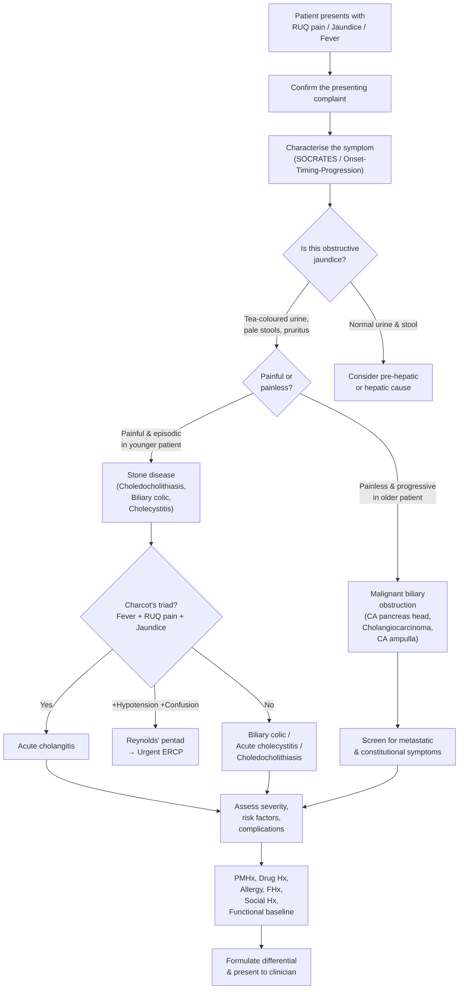

# History Taking: Biliary Disease

## Master Framework Diagram

---

## 1. Introduction & Opening

Before diving into questions, set the scene. Greet the patient, confirm their identity, and establish rapport.

> "Good morning Mr/Mrs ___, my name is Dr ___. I'm one of the doctors looking after you today. I understand you've been having some problems — could you tell me in your own words what's been troubling you?"

In Cantonese:
> 「你好，我係XXX醫生，今日負責照顧你。你可唔可以用自己嘅說話同我講吓，你邊度唔舒服？」

---

## 2. Focused Presenting Complaint Framework

Biliary disease most commonly presents with one or more of three cardinal symptoms: **RUQ/epigastric pain**, **jaundice**, and **fever**. Your job is to systematically characterise each.

### 2A. Pain Analysis (SOCRATES adapted for biliary disease)

| Element | Question (English) | Cantonese Phrasing | Why This Matters |
|---|---|---|---|
| **Site** | "Where exactly is the pain?" | 「痛喺邊度？可唔可以指俾我睇？」 | RUQ/epigastric → biliary; epigastric radiating to back → pancreatic |
| **Onset** | "When did it start? Was it sudden or gradual?" | 「幾時開始痛？突然定慢慢嚟？」 | ***Biliary colic***: onset over minutes, plateaus within 1h [1][2]. ***Acute cholecystitis***: sudden, prolonged >4-6h [2]. Seconds → perforation/infarction [2] |
| **Character** | "What does it feel like — dull, sharp, crampy?" | 「個痛係點嘅？鈍痛、刺痛定絞痛？」 | ***Biliary colic is a misnomer*** — it is severe, constant with excruciating exacerbations (false colic), NOT true waxing-and-waning colic [2] |
| **Radiation** | "Does it go anywhere else — back, shoulder?" | 「有冇痛去其他地方？背脊？膊頭？」 | Right scapular tip → gallbladder (referred via phrenic nerve). Back → pancreatitis. Right shoulder → diaphragmatic irritation (Fitz-Hugh-Curtis) [2] |
| **Associated symptoms** | "Any nausea, vomiting, fever, change in urine or stool colour?" | 「有冇作嘔、嘔、發燒、小便變深色、大便變淺色？」 | Vomiting common in colic/cholecystitis. Fever → cholecystitis or cholangitis. Stool/urine changes → obstruction [1][3] |
| **Timing/Duration** | "How long does the pain last?" | 「痛幾耐？」 | ***Biliary colic***: usually ≥30min, resolves ≤6h [2]. ***Cholecystitis***: prolonged >4-6h [2][4]. Pain >6h with fever → think cholecystitis |
| **Exacerbating/Relieving** | "Does anything make it better or worse? Fatty food? Movement?" | 「有冇咩令佢好啲或差啲？食油嘢之後？郁動？」 | ***Fat intolerance*** (pain after fatty meal) is classic for biliary colic [1]. Pain worse with movement/breathing → peritoneal irritation (cholecystitis) [2][4] |
| **Severity** | "On a scale 0-10?" | 「由0到10分，0係唔痛，10係最痛，你覺得幾多分？」 | Gauges severity and guides analgesia |

<Callout title="Biliary Colic Is NOT True Colic" type="error">
A very common pitfall: biliary "colic" does NOT have true pain-free intervals. It is severe and constant with superimposed exacerbations (false colic). True colic with complete cessation of pain is more typical of intestinal obstruction or ureteric colic. This is a favourite OSCE/viva distinction. [2]
</Callout>

### 2B. Jaundice Assessment

This is the critical branch point for biliary disease — is it **medical (pre-hepatic/hepatic)** or **surgical (post-hepatic/obstructive)**?

- **"Have you or anyone noticed your eyes or skin turning yellow?"** — 「有冇人話你隻眼或者皮膚變咗黃色？」
- **"What colour is your urine? Is it dark, like pu'er tea?"** — 「你嘅小便係咩顏色？有冇好深色，好似普洱茶咁？」 [3]
  - *Why:* ***Tea-coloured urine*** indicates conjugated hyperbilirubinaemia (post-hepatic/hepatic). Rules out unconjugated causes [1][3].
  - Exclude confounders: recent intake of rifampicin, Pyridium, beetroot [5]
- **"What colour are your stools? Are they pale or clay-coloured?"** — 「大便係咩色？有冇好淺色、好似泥咁？」
  - *Why:* ***Pale stools*** = lack of stercobilin reaching GI tract = obstruction [1][3]
  - ***Steatorrhoea*** (floating, foul-smelling, difficult to flush) indicates fat malabsorption from bile salt deficiency [5]
- **"Any itchiness all over?"** — 「有冇周身痕？」
  - *Why:* Generalised ***pruritus*** from bile salt deposition in skin in cholestasis. Look for scratch marks on examination [1][3]

<Callout title="Stone vs Tumour — The Key Differentiator" type="idea">
***Painful, episodic jaundice in a younger patient → stone disease (choledocholithiasis)*** [1][3]

***Painless, progressive jaundice in an older patient → malignant biliary obstruction*** (CA head of pancreas, cholangiocarcinoma, CA ampulla) until proven otherwise [1][3][6]

This single distinction drives your entire differential and is universally tested in OSCEs.
</Callout>

### 2C. Fever and Sepsis Assessment

- **"Do you have fevers? Any chills or rigors?"** — 「有冇發燒？有冇發冷、打冷震？」
  - *Why:* ***Charcot's triad*** = fever + RUQ pain + jaundice → acute cholangitis [1][2][4]
  - ***Reynolds' pentad*** = Charcot's triad + hypotension + confusion → suppurative cholangitis (a surgical emergency) [1][2][4]
- **"Have you felt confused or lightheaded recently?"** — 「有冇覺得頭暈或者神志唔清？」
  - Altered mental status is a red flag for sepsis

---

## 3. Differentiating Questions — Narrowing the Differential

### 3A. Biliary Colic vs Acute Cholecystitis vs Cholangitis

| Feature | Biliary Colic | Acute Cholecystitis | Acute Cholangitis |
|---|---|---|---|
| Pain duration | ≥30min, resolves ≤6h | Prolonged >4-6h | Variable |
| Fever | No | Yes (low-grade) | ***Yes, with chills/rigors*** |
| Jaundice | ± (if CBD stone) | Usually no | ***Yes*** |
| Urine/stool changes | ± | No | ***Tea urine, pale stools*** |
| History of biliary surgery | Variable | Variable | ***Often yes*** [4] |

Ask: **"Have you had any previous gallbladder surgery or procedures on your bile duct?"** — 「你之前有冇做過膽囊或者膽管嘅手術？」
- *Why:* A history of cholecystectomy with recurrent symptoms suggests ***retained/recurrent CBD stones*** or ***stricture*** [4]

### 3B. Malignant Biliary Obstruction — Constitutional & Metastatic Screen

If painless progressive jaundice is the picture, you MUST screen for malignancy:

- **"Have you lost weight without trying?"** — 「有冇唔覺意瘦咗？」
- **"How is your appetite?"** — 「胃口點？」
  - *Why:* ***LOA (loss of appetite) and LOW (loss of weight)*** are cardinal constitutional symptoms of malignancy [1][3]
- **"Any bone pains? Breathlessness? New lumps?"** — 「有冇骨痛？氣促？身上有冇新嘅腫塊？」
  - *Why:* Screen for metastatic disease [1][3]
- **"Any constant dull pain in the upper abdomen going through to the back?"** — 「有冇持續嘅上腹鈍痛，痛去背脊？」
  - *Why:* ***CA pancreas classically presents with constant, dull, boring epigastric pain radiating to back*** — usually a late feature [1][3]
- ***"Any new-onset diabetes or worsening blood sugar control?"***
  - *Why:* New-onset DM in an elderly patient can be a presenting feature of CA pancreas [6]

### 3C. Acute Pancreatitis — Complication of Stone Disease

- **"Is the pain relieved by sitting forward?"** — 「坐前啲會唔會好啲？」
  - *Why:* Pain relieved by sitting up and leaning forward is classic for acute pancreatitis [2]
- **"Any severe vomiting?"**
  - *Why:* Prominent nausea and frequent vomiting are features of pancreatitis [2]

### 3D. Recurrent Pyogenic Cholangitis (RPC) — Important in HK/Asian Context

- **"Have you had repeated episodes of fever, abdominal pain, and jaundice before?"** — 「你之前有冇試過重複咁發燒、肚痛同埋黃疸？」
  - *Why:* ***RPC*** (recurrent pyogenic cholangitis) involves repeated bouts of cholangitis due to intrahepatic stones and strictures. It is ***much more common in Asia*** than the West [1][7]. This is a favourite HKUMed question because of local relevance.

### 3E. Excluding Hepatic Causes of Jaundice

If the picture is not clearly obstructive, screen for hepatic causes:

- **Viral hepatitis**: "Do you know your hepatitis B/C status? Any blood transfusions? IV drug use?" — 「你知唔知自己有冇乙型/丙型肝炎？有冇輸過血？有冇注射毒品？」
- **Alcohol**: "How much alcohol do you drink?" — 「你平時飲幾多酒？」
- **Drugs/TCM**: "Any new medications, traditional Chinese medicine, or supplements?" — 「有冇食新嘅藥、中藥或者保健品？」 [1][3]
- **Travel**: "Any recent travel?" (Hepatitis A/E — feco-oral) [1][3]

---

## 4. Risk Factors and Background History

### 4A. Risk Factors for Gallstone Disease

The classic mnemonic is ***5F: Female, Fat, Forty, Fertile, Family history*** [7][2]:

- **Age and sex**: "How old are you? Have you been pregnant before?" — 「你幾多歲？之前有冇懷過孕？」
- **Weight**: "What is your weight? Have you lost weight rapidly recently?" — 「你幾重？最近有冇快速減咗磅？」
  - *Why:* Both ***obesity AND rapid weight loss*** are risk factors [7]
- **Family history of gallstones**: "Does anyone in your family have gallstone problems?" — 「屋企人有冇膽石嘅問題？」
  - *Why:* 1st degree relative → 2× risk [7]
- **Haemolytic conditions**: "Do you have thalassaemia or sickle cell disease?" — 「你有冇地中海貧血或者鐮刀型細胞貧血？」
  - *Why:* Chronic haemolysis → pigment stones [7]
- **Diabetes mellitus** [7]
- **Liver cirrhosis** [7]
- **Crohn's disease** (terminal ileal disease → bile salt malabsorption → gallstones) [7]

### 4B. Risk Factors for Cholangiocarcinoma

- **PSC / ulcerative colitis**: "Have you been diagnosed with inflammatory bowel disease or primary sclerosing cholangitis?" [8]
  - *Why:* ***PSC → 30% of cholangioCA; lifetime risk 5-15%*** [8]
- **RPC / hepatolithiasis** [8]
- **Parasitic infection**: "Any exposure to raw freshwater fish?" (Clonorchis, Opisthorchis — SE Asia context) [8]
- **Choledochal cyst / Caroli's disease** [8]
- **Chronic liver disease** [8]

### 4C. Past Medical History

- Previous gallstone disease, cholecystitis, pancreatitis
- Known biliary strictures or biliary surgery
- Hepatitis B/C carrier status
- Chronic liver disease / cirrhosis
- IBD (especially UC → PSC association)
- Diabetes mellitus
- Haemolytic anaemia

### 4D. Past Surgical History

- **Previous cholecystectomy** — critically important [4]
- Previous ERCP, sphincterotomy, biliary stenting
- Any other abdominal surgery

### 4E. Medication and Allergy History

- **Oral contraceptive pill / HRT**: ↑cholesterol saturation of bile → gallstones [7]
- **Statins, ursodeoxycholic acid**: may reduce stone formation
- **Antibiotics recently**: may mask cholangitis
- **NSAIDs**: alternative cause of GI pain
- **Any allergies?** — especially contrast/iodine allergy (relevant for CT/ERCP planning)

### 4F. Family History

- Gallstone disease in 1st degree relatives [7]
- Hepatitis B/C carrier status in family
- GI malignancies (CA pancreas, cholangiocarcinoma)
- Haemolytic conditions

### 4G. Social History

- **Alcohol**: quantity, frequency, duration — 「你飲酒嗎？一個星期飲幾多？飲咗幾耐？」
  - *Why:* Alcoholic liver disease → hepatic jaundice; also risk factor for pancreatitis
- **Smoking**: pack-years — 「你有冇食煙？食咗幾耐？一日幾多支？」
  - *Why:* Risk factor for CA pancreas
- **Occupation and diet**: high-fat diet → cholesterol stones
- **Travel history**: endemic areas for parasitic infections or hepatitis A/E
- **IV drug use / sexual history**: risk for hepatitis B/C [1][3]
- **Living situation**: who is at home, can they manage ADLs?

### 4H. Functional Baseline

- **"What were you able to do before this episode?"** — 「你入院之前平時自己做到啲咩？」
- **Mobility, ADLs, exercise tolerance** — important for surgical risk assessment (can they tolerate cholecystectomy? Are they fit for a Whipple's?)
- **Performance status** (ECOG/Karnofsky) if malignancy is suspected

---

## 5. Targeted Systems Review

| System | Relevant Symptoms | Why Ask |
|---|---|---|
| **GI** | Nausea, vomiting, anorexia, change in bowel habit, steatorrhoea, haematemesis/melaena, dysphagia | Gallstone pancreatitis; GI malignancy; fat malabsorption from cholestasis |
| **Constitutional** | Fever, weight loss, night sweats, fatigue | Infection (cholangitis) vs malignancy |
| **Haematological** | Easy bruising, bleeding | Coagulopathy from Vitamin K malabsorption in prolonged obstruction [1][3] |
| **Skin** | Pruritus, new rashes, scratch marks | Cholestasis |
| **Neurological** | Confusion, drowsiness | Hepatic encephalopathy; Reynolds' pentad |
| **Respiratory** | Cough, pleuritic pain | Basal pneumonia can mimic RUQ pain; right pleural effusion in pancreatitis |
| **Urological** | Dysuria, haematuria, loin pain | Renal colic / pyelonephritis can mimic RUQ pain |
| **Gynaecological** (if female) | LMP, vaginal discharge, pelvic pain | Ectopic pregnancy, PID (Fitz-Hugh-Curtis) |

---

## 6. Red-Flag Findings and Escalation Triggers

These findings should prompt immediate senior escalation and urgent intervention:

| Red Flag | Implication |
|---|---|
| ***Reynolds' pentad*** (Charcot's triad + hypotension + confusion) | Suppurative cholangitis — needs **urgent biliary decompression (ERCP)** [1][2][4] |
| Peritonism (guarding, rebound, rigidity) | Gallbladder perforation, biliary peritonitis |
| Septic shock (tachycardia, hypotension, oliguria) | Biliary sepsis — needs resuscitation, IV antibiotics, urgent ERCP |
| ***Painless progressive jaundice*** in elderly | ***Malignant biliary obstruction*** until proven otherwise [1][3][6] |
| New-onset DM + weight loss + back pain in elderly | CA head of pancreas |
| Rapidly rising bilirubin | Complete obstruction — urgent imaging |
| Coagulopathy (bleeding, raised INR) | Vitamin K malabsorption from cholestasis — needs correction before any procedure [1][3] |

---

## 7. Common Pitfalls in History-Taking for Biliary Disease

<Callout title="Common Pitfalls" type="error">

1. **Calling biliary colic "colicky"** — It is NOT true colic. It is constant pain with superimposed exacerbations. Saying "colicky pain with pain-free intervals" suggests intestinal obstruction, not biliary disease. [2]

2. **Forgetting to ask about urine and stool colour** — This is the single most important question to distinguish obstructive from non-obstructive jaundice. Many students jump to asking about pain and forget the toilet.

3. **Not differentiating stone vs tumour early** — The entire management pathway differs. Ask about pain character (episodic painful vs progressive painless), age, constitutional symptoms, and progression pattern EARLY.

4. **Missing RPC in the Hong Kong context** — RPC is much more common in Asia. Always ask about recurrent episodes of cholangitis and prior biliary procedures. [7]

5. **Ignoring drug/TCM history** — Drug-induced hepatitis is a very common cause of jaundice in Hong Kong. Always ask about TCM. [1][3]

6. **Forgetting to screen for complications** — Pancreatitis (back pain, vomiting), coagulopathy (bruising), and fat malabsorption (steatorrhoea) are all complications of biliary obstruction that students miss. [1][3]

7. **Not asking about previous cholecystectomy** — A patient who has had a cholecystectomy can still develop CBD stones. This changes the differential and management. [4]

</Callout>

---

## 8. High-Yield Exam-Focused Interpretation Tips

### ***Courvoisier's Law*** [1][3][6][7]

> *"In painless jaundice, if the gallbladder is palpable, it is unlikely to be due to gallstones."*

- **Why?** A gallbladder that produces CBD stones has likely been chronically inflamed → fibrosis → contracted → cannot distend. In malignant obstruction, the gallbladder has NOT been chronically inflamed, so it distends from back-pressure. [1][3]
- **Exceptions** (love to be tested):
  1. ***Double stones*** (one in CBD, one in cystic duct) — CBD stone → jaundice; cystic duct stone → mucocele → palpable GB [1][3]
  2. ***Recurrent pyogenic cholangitis (RPC)*** — pathology is in the duct, not the GB → GB is not fibrosed [1][3]
  3. ***Mirizzi syndrome*** (rare) [3]
  4. ***Pancreatic stone*** (rare) [3]

### ***Charcot's Triad and Reynolds' Pentad*** [1][2][4]

- **Charcot's triad**: Fever + RUQ pain + Jaundice = acute cholangitis
- **Reynolds' pentad**: Charcot's triad + Hypotension + Confusion = suppurative cholangitis (urgent decompression needed)
- *In the OSCE, if a patient has all 5 features, you must escalate immediately and state the need for urgent ERCP.*

### ***CA19-9 Pitfall in Cholestasis*** [3]

- ***CA19-9 is excreted via bile → invariably elevated in ANY cholestasis*** [3]
- Always interpret after relief of obstruction. Do NOT use it to diagnose malignancy in a jaundiced patient. This is a high-yield viva trap.

### ***LFT Pattern Recognition*** [1][3]

- **Obstructive** (post-hepatic): ***↑↑↑ALP/GGT > AST/ALT (mildly ↑), ↑conjugated bilirubin*** [3]
- **Hepatocellular** (hepatic): ↑↑↑AST/ALT > ALP/GGT
- **Pre-hepatic**: ↑unconjugated bilirubin, normal enzymes

### ***Thomas's Sign*** [3]

- ***Silvery stools*** (clay + tarry) → CA ampulla of Vater (combination of obstruction + tumour bleeding) — a rare but very testable sign [3]

---

## 9. Model Reporting Script

> "Mr Chan is a 68-year-old gentleman who presented 5 days ago to Queen Mary Hospital with a 3-week history of progressive painless jaundice, tea-coloured urine, pale stools, and generalised pruritus. He also reports a 6-kilogram unintentional weight loss over the past 2 months and reduced appetite. He denies abdominal pain, fever, chills, or rigors. He has no history of haematemesis, melaena, or change in bowel habit. He has not noticed any new lumps.
>
> His past medical history is significant for type 2 diabetes mellitus diagnosed 8 months ago — this was new-onset — and hypertension for 10 years. He has no history of gallstone disease, previous biliary surgery, or inflammatory bowel disease. He is a known hepatitis B carrier on entecavir.
>
> Regarding his surgical history, he has had no previous operations.
>
> His current medications include metformin 500mg BD, amlodipine 5mg OD, and entecavir 0.5mg OD. He has no known drug allergies.
>
> His family history is unremarkable — there is no family history of GI malignancy or gallstone disease.
>
> Socially, he is a retired taxi driver. He is an ex-smoker with a 30-pack-year history, having quit 5 years ago. He drinks alcohol socially, approximately 2-3 units per week. He lives with his wife and is independently mobile with no limitation in activities of daily living. His baseline ECOG performance status is 0.
>
> In summary, this is a 68-year-old gentleman with new-onset diabetes, progressive painless obstructive jaundice, and constitutional symptoms. The clinical picture is highly concerning for malignant biliary obstruction, most likely carcinoma of the head of the pancreas, and I would like to arrange urgent blood tests including LFT, CBC, clotting profile, amylase, CA19-9, CEA, and an urgent USG hepatobiliary system as the initial investigation, followed by a CT abdomen with contrast for staging."

---

<ActiveRecallQuiz
  title="Active Recall - History Taking"
  items={[
    {
      question: "What is Courvoisier's law and what are its exceptions?",
      markscheme: "In painless jaundice, if the gallbladder is palpable, it is unlikely due to gallstones — points to malignant biliary obstruction. Exceptions: (1) double stones (CBD + cystic duct), (2) recurrent pyogenic cholangitis, (3) Mirizzi syndrome, (4) pancreatic stone.",
    },
    {
      question: "What are Charcot's triad and Reynolds' pentad? What is the clinical significance of Reynolds' pentad?",
      markscheme: "Charcot's triad: fever, RUQ pain, jaundice — suggests acute cholangitis. Reynolds' pentad adds hypotension and confusion — indicates suppurative cholangitis requiring urgent biliary decompression (ERCP).",
    },
    {
      question: "How do you differentiate stone disease from malignant biliary obstruction on history alone?",
      markscheme: "Stone disease: episodic, painful jaundice in younger patients with history of biliary colic or gallstones. Malignant biliary obstruction: painless, progressive jaundice in elderly with constitutional symptoms (LOA, LOW) and possibly new-onset DM or back pain.",
    },
    {
      question: "Why is CA19-9 unreliable in a jaundiced patient?",
      markscheme: "CA19-9 is excreted via bile, so any cause of cholestasis will elevate CA19-9 regardless of malignancy. It should be interpreted only after relief of biliary obstruction.",
    },
    {
      question: "Why is biliary colic a misnomer? How does it differ from true colic?",
      markscheme: "Biliary colic is constant pain with superimposed exacerbations (false colic) without complete pain-free intervals. True colic (e.g. intestinal obstruction, ureteric colic) has periods of complete cessation between episodes.",
    },
    {
      question: "What are the 5F risk factors for cholesterol gallstones, and name two additional important risk factors relevant to Hong Kong?",
      markscheme: "5F: Female, Fat (obesity), Forty (middle age), Fertile (pregnancy/multiparity), Family history. Additional HK-relevant risk factors: thalassaemia (pigment stones from chronic haemolysis) and liver cirrhosis.",
    },
  ]}
/>

---

## References

[1] Senior notes: Ryan Ho GI.pdf (Section 4.1.2 Malignant Biliary Obstruction; Section C Approach to Jaundice pp.191-194)
[2] Senior notes: Ryan Ho GI.pdf (Section 4.1.5 RUQ Pain pp.209-210; Section B Approach to Acute Abdomen p.101)
[3] Senior notes: Ryan Ho Fundamentals.pdf (Section 3.3.10 Malignant Biliary Obstruction pp.297; Section C Approach to Jaundice pp.294-296; Section 3.3.12 RUQ Pain pp.307-308)
[4] Lecture slides: GC 200. RUQ pain, jaundice and fever Cholecytitis and cholangitis Imaging of GI system.pdf (pp.3, 6)
[5] Senior notes: maxim.md (Section 5.3 Obstructive jaundice)
[6] Lecture slides: WCS 056 - Painless jaundice and epigastric mass - by Prof R Poon.ppt (1).pdf
[7] Senior notes: felixlai.md (Cholelithiasis and Choledocholithiasis section; Courvoisier's law; RPC)
[8] Senior notes: Ryan Ho GI.pdf (Section 4.3.3 Cholangiocarcinoma p.273; Section 4.4.3 PSC p.289)

---

<Callout title="High Yield Summary">

**The 3 pillars of biliary disease history:**

1. **Characterise the pain** — constant with exacerbations (biliary colic), prolonged >6h with fever (cholecystitis), or with Charcot's triad (cholangitis). Remember biliary "colic" is a false colic.

2. **Determine if there is obstructive jaundice** — ask about tea-coloured urine, pale stools, pruritus, and steatorrhoea. This distinguishes surgical from medical jaundice.

3. **Stone vs tumour** — the most important branch point. ***Episodic, painful jaundice in younger patients = stone. Painless, progressive jaundice in elderly = malignancy until proven otherwise.*** Screen for constitutional symptoms, new-onset DM, and back pain if malignancy is suspected.

**Don't forget:** Courvoisier's law and its exceptions, Reynolds' pentad as an escalation trigger, CA19-9 is unreliable in cholestasis, and RPC is important in the Hong Kong context.

</Callout>
